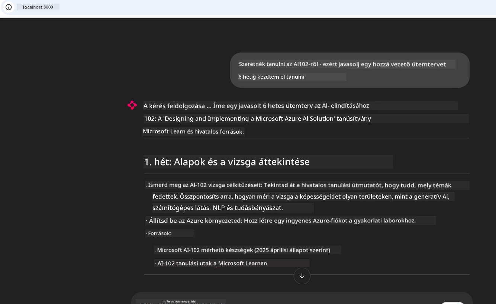
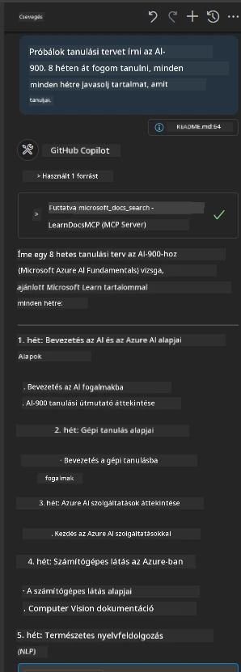

# Esettanulmány: Kapcsolódás a Microsoft Learn Docs MCP szerverhez egy kliensből

Előfordult már, hogy dokumentációs oldalakat, a Stack Overflow-t és végtelen keresőfüleket kellett váltogatnod, miközben a kódodban próbáltál megoldani egy problémát? Talán van egy második monitorod kizárólag a dokumentációknak, vagy állandóan alt-tab-elsz az IDE-d és a böngésző között. Nem lenne jobb, ha a dokumentáció közvetlenül a munkafolyamatodba kerülne beépítve — az alkalmazásaidba, az IDE-dbe vagy akár a saját egyedi eszközeidbe? Ebben az esettanulmányban megmutatjuk, hogyan lehet ezt megtenni úgy, hogy közvetlenül a Microsoft Learn Docs MCP szerverhez csatlakozol a saját kliensalkalmazásodból.

## Áttekintés

A modern fejlesztés több, mint pusztán kódírás — a megfelelő információ megtalálása a megfelelő időben a kulcs. A dokumentáció mindenütt jelen van, de ritkán ott, ahol a leginkább szükséged van rá: az eszközeidben és munkafolyamataidban. Ha a dokumentáció lekérését közvetlenül az alkalmazásaidba integrálod, időt spórolhatsz, csökkentheted a kontextusváltásokat, és növelheted a termelékenységet. Ebben a részben megmutatjuk, hogyan csatlakoztathatsz egy klienst a Microsoft Learn Docs MCP szerverhez, hogy a valós idejű, kontextusérzékeny dokumentációt az alkalmazásodból érhesd el anélkül, hogy el kellene hagynod azt.

Végigvezetünk a kapcsolat létrehozásának folyamatán, a kérés elküldésén és az áramló válaszok hatékony kezelésén. Ez a megközelítés nem csak egyszerűsíti a munkafolyamatot, hanem lehetőséget ad arra is, hogy okosabb, hasznosabb fejlesztői eszközöket építs.

## Tanulási célok

Miért csináljuk ezt? Mert a legjobb fejlesztői élmények azok, amelyek eltávolítják a súrlódásokat. Képzeld el azt a világot, ahol a kódszerkesztőd, chatbotod vagy webalkalmazásod azonnal válaszol a dokumentációs kérdéseidre, a Microsoft Learn legfrissebb tartalmait használva. A fejezet végére megtanulod:

- Megérteni az MCP szerver-kliens kommunikáció alapjait a dokumentációk esetén
- Konzol vagy webalkalmazás megvalósítása a Microsoft Learn Docs MCP szerverhez való kapcsolódáshoz
- Áramló HTTP kliensek használata valós idejű dokumentáció lekéréshez
- A dokumentációs válaszok naplózása és értelmezése az alkalmazásodban

Megtanulod, hogyan segíthetnek ezek a képességek olyan eszközök készítésében, amelyek nem csupán reaktívak, hanem valóban interaktívak és kontextusérzékenyek.

## 1. Forgatókönyv – Valós idejű dokumentáció lekérés MCP-vel

Ebben a forgatókönyvben megmutatjuk, hogyan csatlakozz egy klienssel a Microsoft Learn Docs MCP szerverhez, hogy valós idejű, kontextusérzékeny dokumentációhoz férj hozzá anélkül, hogy el kellene hagynod az alkalmazásodat.

Gyakorlatba ültetve: a feladatod egy olyan alkalmazás írása, amely csatlakozik a Microsoft Learn Docs MCP szerverhez, meghívja a `microsoft_docs_search` eszközt, és a streaming választ a konzolra naplózza.

### Miért ez a megközelítés?
Mert ez az alapja a fejlettebb integrációknak — legyen szó chatbot, IDE-bővítmény vagy webes irányítópult működtetéséről.

A kódot és az utasításokat erre a forgatókönyvre megtalálod a [`solution`](./solution/README.md) mappában. Az alábbi lépések segítségével létrehozod a kapcsolatot:
- Használd a hivatalos MCP SDK-t és a streamelhető HTTP klienst a kapcsolódáshoz
- Hívd meg a `microsoft_docs_search` eszközt egy lekérdezési paraméterrel a dokumentáció eléréséhez
- Valósítsd meg a megfelelő naplózást és hibakezelést
- Készíts interaktív konzol interfészt, hogy a felhasználók több keresési lekérdezést is be tudjanak adni

Ez a forgatókönyv megmutatja, hogyan:
- Kapcsolódj a Docs MCP szerverhez
- Küldj le kérdést
- Elemezd és írasd ki az eredményeket

Íme, hogyan nézhet ki a megoldás futtatása:

```
Prompt> What is Azure Key Vault?
Answer> Azure Key Vault is a cloud service for securely storing and accessing secrets. ...
```

Az alábbiakban egy minimális mintamegoldás található. A teljes kód és részletek a solution mappában elérhetők.

<details>
<summary>Python</summary>

```python
import asyncio
from mcp.client.streamable_http import streamablehttp_client
from mcp import ClientSession

async def main():
    async with streamablehttp_client("https://learn.microsoft.com/api/mcp") as (read_stream, write_stream, _):
        async with ClientSession(read_stream, write_stream) as session:
            await session.initialize()
            result = await session.call_tool("microsoft_docs_search", {"query": "Azure Functions best practices"})
            print(result.content)

if __name__ == "__main__":
    asyncio.run(main())
```

- A teljes implementációért és naplózásért lásd a [`scenario1.py`](../../../../09-CaseStudy/docs-mcp/solution/python/scenario1.py) fájlt.
- A telepítési és használati utasításokért lásd a [`README.md`](./solution/python/README.md) fájlt ugyanebben a mappában.
</details>


## 2. Forgatókönyv – Interaktív tanulási terv generátor webalkalmazás MCP-vel

Ebben a forgatókönyvben megtanulod, hogyan integráld a Docs MCP-t egy webfejlesztési projektbe. A cél az, hogy a felhasználók közvetlenül egy webes felületről keresni tudjanak a Microsoft Learn dokumentációjában, így az dokumentáció azonnal elérhető lesz az alkalmazásodban vagy webhelyeden.

Megmutatjuk, hogyan:
- Állíts be egy webalkalmazást
- Kapcsolódj a Docs MCP szerverhez
- Kezeld a felhasználói bevitelt és jelenítsd meg az eredményeket

Íme, hogyan nézhet ki a megoldás futtatása:

```
User> I want to learn about AI102 - so suggest the roadmap to get it started from learn for 6 weeks

Assistant> Here’s a detailed 6-week roadmap to start your preparation for the AI-102: Designing and Implementing a Microsoft Azure AI Solution certification, using official Microsoft resources and focusing on exam skills areas:

---
## Week 1: Introduction & Fundamentals
- **Understand the Exam**: Review the [AI-102 exam skills outline](https://learn.microsoft.com/en-us/credentials/certifications/exams/ai-102/).
- **Set up Azure**: Sign up for a free Azure account if you don't have one.
- **Learning Path**: [Introduction to Azure AI services](https://learn.microsoft.com/en-us/training/modules/intro-to-azure-ai/)
- **Focus**: Get familiar with Azure portal, AI capabilities, and necessary tools.

....more weeks of the roadmap...

Let me know if you want module-specific recommendations or need more customized weekly tasks!
```

Az alábbiakban egy minimális mintamegoldás található. A teljes kód és részletek a solution mappában elérhetők.



<details>
<summary>Python (Chainlit)</summary>

A Chainlit egy keretrendszer beszélgetés-alapú AI webalkalmazásokhoz. Megkönnyíti az interaktív chatbotok és asszisztensek létrehozását, amelyek képesek MCP eszközöket hívni és valós időben megjeleníteni az eredményeket. Ideális gyors prototípus készítéshez és felhasználóbarát felületekhez.

```python
import chainlit as cl
import requests

MCP_URL = "https://learn.microsoft.com/api/mcp"

@cl.on_message
def handle_message(message):
    query = {"question": message}
    response = requests.post(MCP_URL, json=query)
    if response.ok:
        result = response.json()
        cl.Message(content=result.get("answer", "No answer found.")).send()
    else:
        cl.Message(content="Error: " + response.text).send()
```

- A teljes megvalósításhoz lásd a [`scenario2.py`](../../../../09-CaseStudy/docs-mcp/solution/python/scenario2.py) fájlt.
- A beállítási és futtatási utasításokhoz lásd a [`README.md`](./solution/python/README.md) fájlt.
</details>


## 3. Forgatókönyv: Dokumentáció az editorban MCP szerverrel VS Code-ban

Ha azt szeretnéd, hogy a Microsoft Learn Docs közvetlenül a VS Code-ban legyen elérhető (ahelyett, hogy a böngészőfüleket váltogatnád), használhatod az MCP szervert az editorodból. Ennek használatával:
- Kereshetsz, olvashatsz dokumentációt a VS Code-on belül anélkül, hogy elhagynád a fejlesztői környezetedet.
- Hivatkozhatsz dokumentációkra és linkeket illeszthetsz be közvetlenül a README vagy tananyag fájljaidba.
- Együtt használhatod a GitHub Copilot-ot és az MCP-t a zökkenőmentes, MI-alapú dokumentációs munkafolyamathoz.

**Megtanulod, hogy hogyan:**
- Adj hozzá egy érvényes `.vscode/mcp.json` fájlt a munkaterületed gyökerébe (lásd az alábbi példát).
- Nyisd meg az MCP panelt vagy használd a parancspalettát a VS Code-ban dokumentáció kereséséhez és beszúrásához.
- Hivatkozz közvetlenül a felhasználás közben a markdown fájljaidban lévő dokumentációra.
- Kombináld ezt a munkafolyamatot a GitHub Copilot-tal a még nagyobb termelékenység érdekében.

Íme egy példa az MCP szerver beállítására VS Code-ban:

```json
{
  "servers": {
    "LearnDocsMCP": {
      "url": "https://learn.microsoft.com/api/mcp"
    }
  }
}
```

</details>

> Részletes útmutató képernyőképekkel és lépésről lépésre elérhető a [`README.md`](./solution/scenario3/README.md) fájlban.



Ez a megközelítés ideális mindazoknak, akik technikai tanfolyamokat építenek, dokumentációt írnak vagy olyan kódot fejlesztenek, amely gyakori hivatkozásokat igényel.

## Fő tanulságok

A dokumentáció közvetlen integrálása az eszközeidbe nem csupán kényelmi funkció — ez a produktivitás forradalmasítása. Ha a Microsoft Learn Docs MCP szerverhez kapcsolódsz a kliensedből, akkor:

- Megszünteted a kontextusváltást a kódod és a dokumentáció között
- Valós idejű, kontextusérzékeny, naprakész dokumentációt kérhetsz le
- Okosabb, interaktívabb fejlesztői eszközöket építhetsz

Ezek a készségek lehetővé teszik, hogy olyan megoldásokat alkoss, amelyek nemcsak hatékonyak, hanem élvezetesek is használni.

## További források

A tudás mélyítéséhez böngészd át ezeket a hivatalos forrásokat:

- [Microsoft Learn Docs MCP Server (GitHub)](https://github.com/MicrosoftDocs/mcp)
- [Azure MCP Server elkezdése (mcp-python)](https://learn.microsoft.com/en-us/azure/developer/azure-mcp-server/get-started#create-the-python-app)
- [Mi az Azure MCP Server?](https://learn.microsoft.com/en-us/azure/developer/azure-mcp-server/)
- [Model Context Protocol (MCP) Bevezetés](https://modelcontextprotocol.io/introduction)
- [Pluginok hozzáadása MCP szerverről (Python)](https://learn.microsoft.com/en-us/semantic-kernel/concepts/plugins/adding-mcp-plugins)

## Mi jön ezután

- Vissza ide: [Esettanulmányok áttekintése](../README.md)
- Folytatás: [10. Modul: AI munkafolyamatok egyszerűsítése AI Toolkit használatával](../../10-StreamliningAIWorkflowsBuildingAnMCPServerWithAIToolkit/README.md)

---

<!-- CO-OP TRANSLATOR DISCLAIMER START -->
**Jogi nyilatkozat**:  
Ez a dokumentum az AI fordítási szolgáltatás, a [Co-op Translator](https://github.com/Azure/co-op-translator) segítségével készült. Bár törekszünk a pontosságra, kérjük, vegye figyelembe, hogy az automatikus fordítások tartalmazhatnak hibákat vagy pontatlanságokat. Az eredeti, anyanyelvi dokumentum tekintendő hiteles forrásnak. Kritikus információk esetén javasolt szakmai, emberi fordítás igénybevétele. Nem vállalunk felelősséget az e fordítás használatából eredő félreértésekért vagy félreértelmezésekért.
<!-- CO-OP TRANSLATOR DISCLAIMER END -->