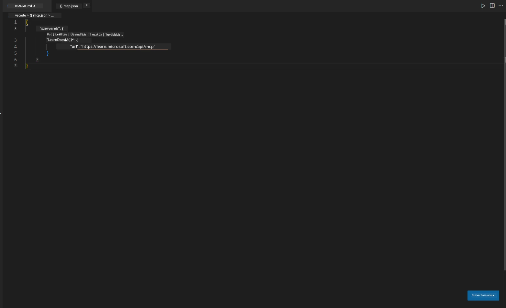
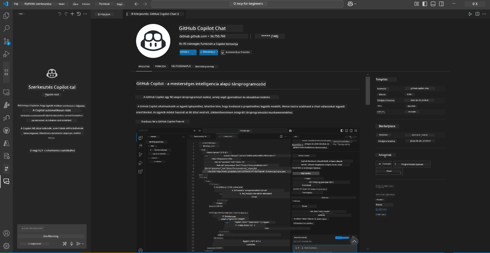
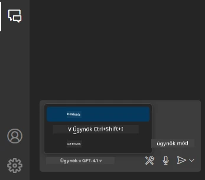
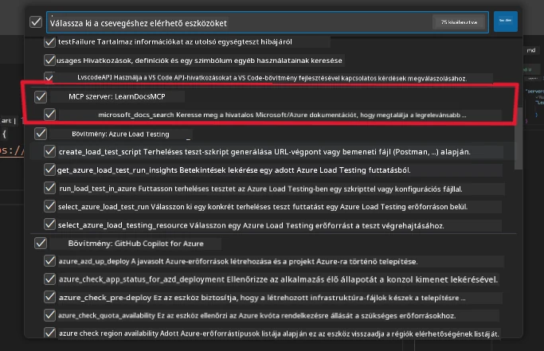
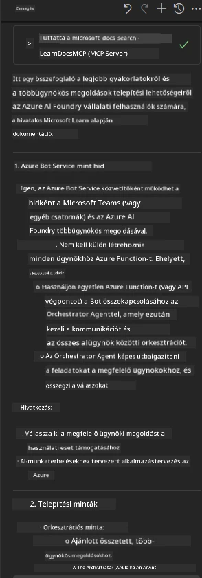

# 3. Forgatókönyv: Szerkesztőn belüli dokumentáció MCP szerverrel VS Code-ban

## Áttekintés

Ebben a forgatókönyvben megtanulod, hogyan hozhatod be a Microsoft Learn dokumentációt közvetlenül a Visual Studio Code környezetedbe az MCP szerver segítségével. Ahelyett, hogy folyamatosan böngészőfüleket váltogatnál a dokumentáció kereséséhez, közvetlenül a szerkesztődben érheted el, keresheted és hivatkozhatsz a hivatalos anyagokra. Ez a megközelítés egyszerűsíti a munkafolyamatodat, segít fókuszált maradni, és zökkenőmentes integrációt tesz lehetővé olyan eszközökkel, mint a GitHub Copilot.

- Keresd és olvasd a dokumentációt VS Code-on belül, anélkül, hogy elhagynád a kódolási környezetet.
- Hivatkozz dokumentációra, és illessz be linkeket közvetlenül a README vagy tananyag fájljaidba.
- Használd együtt a GitHub Copilotot és az MCP-t egy gördülékeny, mesterséges intelligencia által támogatott dokumentációs munkafolyamathoz.

## Tanulási célok

A fejezet végére megérted, hogyan állítsd be és használd az MCP szervert a VS Code-ban a dokumentációs és fejlesztési munkafolyamatod javítására. Képes leszel:

- Beállítani a munkakörnyezetedet az MCP szerver használatára dokumentáció kereséséhez.
- Keresni és beszúrni dokumentációt közvetlenül a VS Code-ból.
- Ötvözni a GitHub Copilot és az MCP erejét egy hatékonyabb, mesterséges intelligenciával támogatott munkafolyamathoz.

Ezek a képességek segítenek fókuszált maradni, javítani a dokumentáció minőségét, és növelni a termelékenységedet fejlesztőként vagy technikai íróként.

## Megoldás

A szerkesztőn belüli dokumentáció eléréséhez egy lépésről lépésre követhető folyamatot fogsz követni, amely integrálja az MCP szervert a VS Code-dal és a GitHub Copilottal. Ez a megoldás ideális tananyagírók, dokumentációs szakemberek és fejlesztők számára, akik szeretnék megtartani a fókuszt a szerkesztőben, miközben dolgoznak a dokumentációval és a Copilottal.

- Gyorsan adj hozzá hivatkozásokat egy README-hez tananyag vagy projekt dokumentáció írása közben.
- Használd a Copilotot kód generálására, és az MCP-t a releváns dokumentáció azonnali megtalálására és idézésére.
- Maradj fókuszált a szerkesztődben, és növeld a termelékenységedet.

### Lépésről lépésre útmutató

A kezdéshez kövesd az alábbi lépéseket. Minden lépéshez hozzáadhatsz egy képernyőképet az assets mappából, hogy vizuálisan is illusztráld a folyamatot.

1. **Add hozzá az MCP konfigurációt:**
   A projekt gyökérkönyvtárában hozz létre egy `.vscode/mcp.json` fájlt, és illeszd be a következő konfigurációt:
   ```json
   {
     "servers": {
       "LearnDocsMCP": {
         "url": "https://learn.microsoft.com/api/mcp"
       }
     }
   }
   ```
   Ez a konfiguráció megmondja a VS Code-nak, hogyan csatlakozzon a [`Microsoft Learn Docs MCP szerverhez`](https://github.com/MicrosoftDocs/mcp).
   
   
    
2. **Nyisd meg a GitHub Copilot Chat panelt:**
   Ha még nincs telepítve a GitHub Copilot bővítményed, menj a VS Code Extensions nézetébe, és telepítsd. Közvetlenül letöltheted a [Visual Studio Code Marketplace-ről](https://marketplace.visualstudio.com/items?itemName=GitHub.copilot-chat). Ezután nyisd meg a Copilot Chat panelt az oldalsávból.

   

3. **Kapcsold be az agent módot és ellenőrizd az eszközöket:**
   A Copilot Chat panelen kapcsold be az agent módot.

   

   Az agent mód bekapcsolása után ellenőrizd, hogy az MCP szerver szerepel-e az elérhető eszközök között. Ez biztosítja, hogy a Copilot agent hozzáférjen a dokumentációs szerverhez a releváns információk lekéréséhez.
   
   

4. **Indíts új chatet és kérdezd az agentet:**
   Nyiss egy új chatet a Copilot Chat panelen. Most már kérdezheted az agentet a dokumentációs kérdéseiddel. Az agent az MCP szervert használja, hogy közvetlenül a szerkesztődben megjelenítse a releváns Microsoft Learn dokumentációt.

   - *„Tanulmányi tervet szeretnék írni az X témához. 8 héten át fogom tanulni, minden hétre javasolj tartalmat.”*

   

5. **Élő lekérdezés:**

   > Vegyünk egy élő lekérdezést az Azure AI Foundry Discord [#get-help](https://discord.gg/D6cRhjHWSC) szekcióból ([eredeti üzenet megtekintése](https://discord.com/channels/1113626258182504448/1385498306720829572)):
   
   *„Válaszokat keresek arra, hogyan lehet többagentű megoldást telepíteni az Azure AI Foundry-n fejlesztett AI agentekkel. Látom, hogy nincs közvetlen telepítési mód, mint például a Copilot Studio csatornák. Milyen különböző módjai vannak ennek a telepítésnek, hogy vállalati felhasználók tudjanak együttműködni és elvégezni a feladatot?
Számos cikk/blog állítja, hogy az Azure Bot szolgáltatás használható erre a célra, amely hidat képezhet az MS Teams és az Azure AI Foundry agentek között. Vajon működik-e, ha beállítok egy Azure botot, amely az Azure AI Foundry Orchestrator Agentjéhez kapcsolódik Azure functionön keresztül az orchestration végrehajtásához, vagy minden AI agenthez külön Azure functiont kell létrehoznom a Bot framework orchestrationhöz? Egyéb javaslatokat is szívesen fogadok.”*

   

   Az agent releváns dokumentációs linkekkel és összefoglalókkal válaszol, amelyeket közvetlenül beilleszthetsz markdown fájljaidba vagy hivatkozásként használhatsz a kódodban.

### Minta lekérdezések

Íme néhány példa lekérdezés, amelyeket kipróbálhatsz. Ezek megmutatják, hogyan működhet együtt az MCP szerver és a Copilot, hogy azonnali, kontextusérzékeny dokumentációt és hivatkozásokat biztosítsanak anélkül, hogy elhagynád a VS Code-ot:

- „Mutasd meg, hogyan használhatók az Azure Functions trigger-ek.”
- „Illessz be egy linket az Azure Key Vault hivatalos dokumentációjához.”
- „Mik az Azure erőforrások biztonságos kezelésének legjobb gyakorlatai?”
- „Keress egy gyors kezdő útmutatót az Azure AI szolgáltatásokhoz.”

Ezek a lekérdezések bemutatják, hogyan tud együttműködni az MCP szerver és a Copilot, hogy azonnali, kontextusérzékeny dokumentációt és hivatkozásokat nyújtsanak anélkül, hogy elhagynád a VS Code-ot.

---

**Jogi nyilatkozat**:  
Ez a dokumentum az AI fordító szolgáltatás, a [Co-op Translator](https://github.com/Azure/co-op-translator) segítségével készült. Bár a pontosságra törekszünk, kérjük, vegye figyelembe, hogy az automatikus fordítások hibákat vagy pontatlanságokat tartalmazhatnak. Az eredeti dokumentum az anyanyelvén tekintendő hiteles forrásnak. Fontos információk esetén szakmai, emberi fordítást javaslunk. Nem vállalunk felelősséget a fordítás használatából eredő félreértésekért vagy téves értelmezésekért.