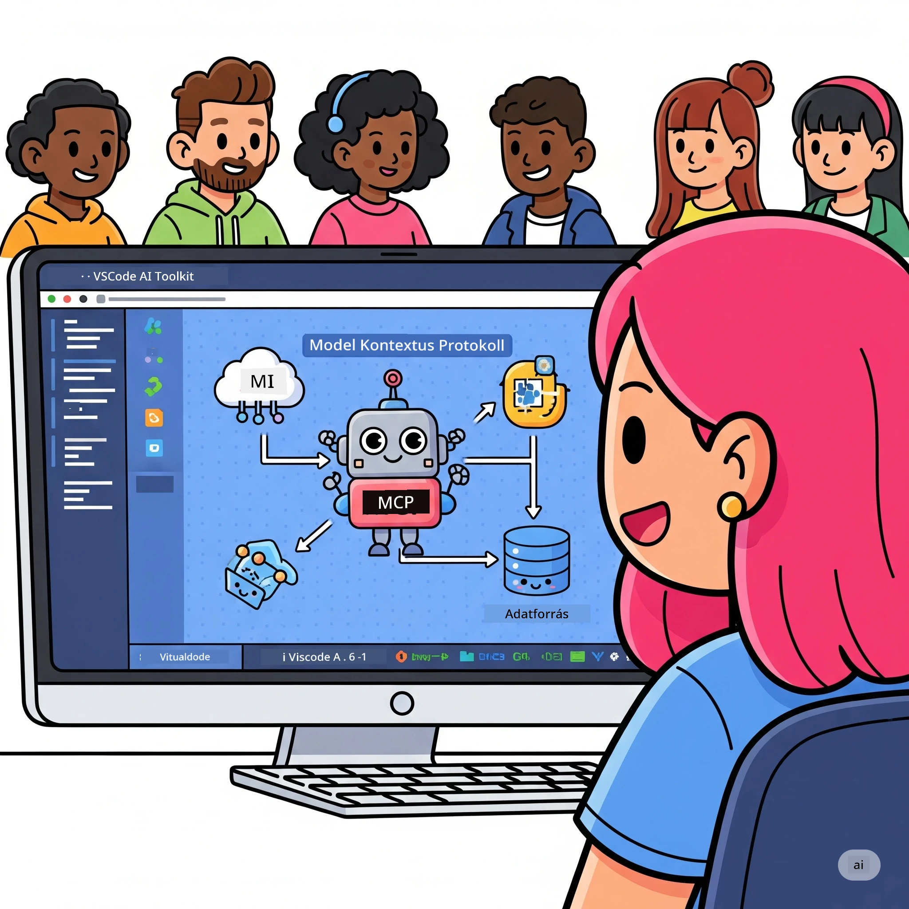
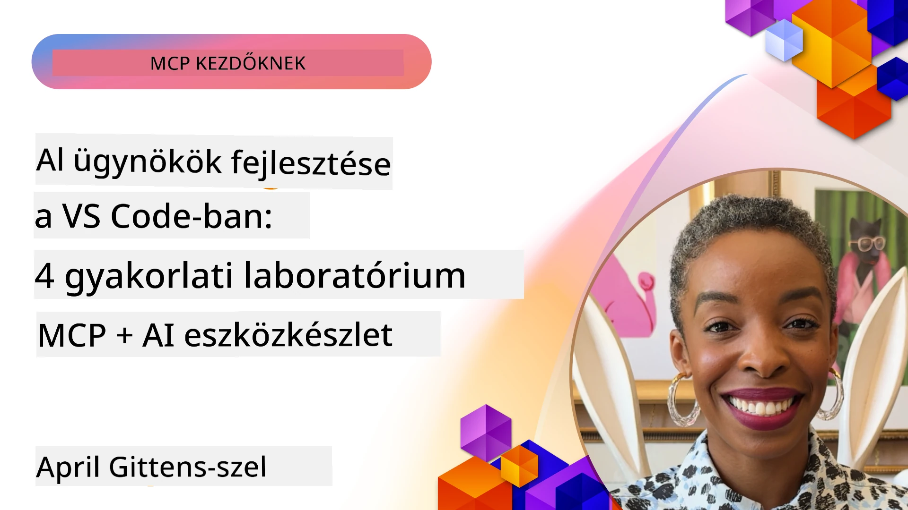

# AI Munkafolyamatok Egyszerűsítése: MCP Szerver Építése az AI Toolkit segítségével

## 🎯 Áttekintés

_(Kattints a fenti képre, hogy megnézd az óra videóját)_

Üdvözlünk a **Model Context Protocol (MCP) Műhelyben**! Ez az átfogó, gyakorlati műhely két élvonalbeli technológiát kombinál az AI alkalmazásfejlesztés forradalmasításához:

- **🔗 Model Context Protocol (MCP)**: Nyílt szabvány a zökkenőmentes AI-eszköz integrációhoz
- **🛠️ AI Toolkit a Visual Studio Code-hoz (AITK)**: A Microsoft erőteljes AI fejlesztőbővítménye

### 🎓 Amit megtanulsz

A műhely végére elsajátítod az intelligens alkalmazások építésének tudományát, amelyek áthidalják az AI modelleket a valós eszközökkel és szolgáltatásokkal. Az automatizált teszteléstől az egyedi API integrációkig gyakorlati készségeket kapsz komplex üzleti kihívások megoldásához.

## 🏗️ Technológiai Halmaz

### 🔌 Model Context Protocol (MCP)

Az MCP a **„USB-C az AI számára”** – egy univerzális szabvány, amely összeköti az AI modelleket külső eszközökkel és adatforrásokkal.

**✨ Fő jellemzők:**

- 🔄 **Szabványosított Integráció**: Univerzális interfész AI-eszköz csatlakozáshoz
- 🏛️ **Rugalmas Architektúra**: Helyi és távoli szerverek stdio/SSE átvitellel
- 🧰 **Gazdag Ökoszisztéma**: Eszközök, előhívások és erőforrások egy protokollban
- 🔒 **Vállalati Szintű**: Beépített biztonság és megbízhatóság

**🎯 Miért fontos az MCP:**
Ahogyan az USB-C megszüntette a káoszt a kábeleknél, az MCP eltünteti az AI integrációk bonyolultságát. Egy protokoll, végtelen lehetőségek.

### 🤖 AI Toolkit a Visual Studio Code-hoz (AITK)

A Microsoft zászlóshajó AI fejlesztőbővítménye, amely VS Code-ot AI erőművé alakítja.

**🚀 Fő képességek:**

- 📦 **Modellkatalógus**: Hozzáférés Azure AI, GitHub, Hugging Face, Ollama modellekhez
- ⚡ **Helyi Inferencia**: ONNX-optimalizált CPU/GPU/NPU futtatás
- 🏗️ **Agent Builder**: Vizual AI ügynök fejlesztés MCP integrációval
- 🎭 **Multi-Modalitás**: Szöveg, látvány és strukturált kimenet támogatás

**💡 Fejlesztési Előnyök:**

- Zero-config modell telepítés
- Vizual prompt tervezés
- Valós idejű tesztelési játszótér
- Zökkenőmentes MCP szerver integráció

## 📚 Tanulási Út

### [🚀 1. Modul: AI Toolkit Alapok](./lab1/README.md)

**Időtartam**: 15 perc

- 🛠️ Telepítsd és konfiguráld az AI Toolkit-et VS Code-hoz
- 🗂️ Fedezd fel a Modellkatalógust (100+ modell GitHubról, ONNX-ről, OpenAI-ról, Anthropicról, Google-ről)
- 🎮 Sajátítsd el az Interaktív Játszóteret valós idejű modell teszteléshez
- 🤖 Építsd meg első AI ügynöködet az Agent Builderrel
- 📊 Értékeld a modell teljesítményt beépített metrikákkal (F1, relevancia, hasonlóság, koherencia)
- ⚡ Tanuld meg a kötegelt feldolgozás és multi-modális támogatás képességeit

**🎯 Tanulási eredmény**: Készíts egy működőképes AI ügynököt az AITK képességeinek átfogó ismeretével

### [🌐 2. Modul: MCP az AI Toolkittel Alapok](./lab2/README.md)

**Időtartam**: 20 perc

- 🧠 Sajátítsd el a Model Context Protocol (MCP) architektúrát és koncepciókat
- 🌐 Ismerd meg a Microsoft MCP szerver ökoszisztémáját
- 🤖 Építs egy böngésző automatizációs ügynököt Playwright MCP szerverrel
- 🔧 Integráld az MCP szervereket az AI Toolkit Agent Builderrel
- 📊 Konfiguráld és teszteld az MCP eszközöket az ügynökeidben
- 🚀 Exportáld és telepítsd az MCP által hajtott ügynököket éles használatra

**🎯 Tanulási eredmény**: Telepíts MCP-vel felturbózott AI ügynököt külső eszközökkel

### [🔧 3. Modul: Haladó MCP Fejlesztés AI Toolkittel](./lab3/README.md)

**Időtartam**: 20 perc

- 💻 Hozz létre egyedi MCP szervereket az AI Toolkittel
- 🐍 Konfiguráld és használd a legújabb MCP Python SDK-t (v1.9.3)
- 🔍 Állítsd be és használd az MCP Inspectort hibakereséshez
- 🛠️ Építs időjárás MCP szervert profi hibakeresési munkafolyamatokkal
- 🧪 Hibakeresd az MCP szervereket Agent Builder és Inspector környezetben

**🎯 Tanulási eredmény**: Fejlessz és hibakeress egyedi MCP szervereket modern eszközökkel

### [🐙 4. Modul: Gyakorlati MCP Fejlesztés – Egyedi GitHub Klón Szerver](./lab4/README.md)

**Időtartam**: 30 perc

- 🏗️ Építs valódi GitHub Klón MCP szervert fejlesztési munkafolyamatokhoz
- 🔄 Valósíts meg intelligens tárhely klónozást érvényesítéssel és hibakezeléssel
- 📁 Hozz létre intelligens könyvtárkezelést és VS Code-integrációt
- 🤖 Használd a GitHub Copilot Agent módot egyedi MCP eszközökkel
- 🛡️ Alkalmazz éles használatra kész megbízhatóságot és platformközi kompatibilitást

**🎯 Tanulási eredmény**: Telepíts éles MCP szervert, amely egyszerűsíti a valós fejlesztési munkafolyamatokat

## 💡 Valós Alkalmazások & Hatás

### 🏢 Vállalati Használati Esetek

#### 🔄 DevOps Automatizálás

Alakítsd át fejlesztési munkafolyamatodat intelligens automatizációval:

- **Okos tárhelykezelés**: AI-alapú kódáttekintés és egyesítési döntések
- **Intelligens CI/CD**: Automatizált pipeline optimalizáció kódváltozások alapján
- **Hibakezelés**: Automatikus bug osztályozás és kiosztás

#### 🧪 Minőségbiztosítás Forradalma

Emeld a tesztelést AI-alapú automatizációval:

- **Intelligens tesztgenerálás**: Teljes tesztcsomagok automatikus létrehozása
- **Vizuális regressziós tesztelés**: AI-vezérelt UI változásérzékelés
- **Teljesítmény monitorozás**: Proaktív problémaazonosítás és megoldás

#### 📊 Adatfolyam Intelligencia

Építs okosabb adatfeldolgozó munkafolyamatokat:

- **Adaptív ETL folyamatok**: Önműködő adattranszformációk
- **Anomália érzékelés**: Valós idejű adatminőség figyelés
- **Intelligens irányítás**: Okos adatáramlás kezelés

#### 🎧 Ügyfélélmény Javítása

Teremts kivételes ügyfélkapcsolatokat:

- **Kontekstusérzékeny támogatás**: AI ügynökök ügyfél előzményekkel
- **Proaktív probléma megoldás**: Előrejelző ügyfélszolgálat
- **Többcsatornás integráció**: Egységes AI élmény platformokon át

## 🛠️ Előfeltételek & Beállítás

### 💻 Rendszerkövetelmények

| Komponens | Követelmény | Megjegyzés |
|-----------|-------------|------------|
| **Operációs Rendszer** | Windows 10+, macOS 10.15+, Linux | Bármely modern OS |
| **Visual Studio Code** | Legfrissebb stabil verzió | Szükséges az AITK-hoz |
| **Node.js** | v18.0+ és npm | MCP szerver fejlesztéshez |
| **Python** | 3.10+ | Opcionális Python MCP szerverekhez |
| **Memória** | Min. 8GB RAM | Ajánlott 16GB helyi modellekhez |

### 🔧 Fejlesztői Környezet

#### Ajánlott VS Code Bővítmények

- **AI Toolkit** (ms-windows-ai-studio.windows-ai-studio)
- **Python** (ms-python.python)
- **Python Hibakereső** (ms-python.debugpy)
- **GitHub Copilot** (GitHub.copilot) – Opcionális, de hasznos

#### Opcionális Eszközök

- **uv**: Modern Python csomagkezelő
- **MCP Inspector**: Vizual hibakereső eszköz MCP szerverekhez
- **Playwright**: Web automatizációs példákhoz

## 🎖️ Tanulási Eredmények & Tanúsítási Út

### 🏆 Készségek Mesterlistája

A műhely végére mesterfokú tudásra teszel szert:

#### 🎯 Fő Kompetenciák

- [ ] **MCP Protokoll Mester**: Mély architektúra és megvalósítási minták ismerete
- [ ] **AITK Jártasság**: AI Toolkit szakértői használata gyors fejlesztéshez
- [ ] **Egyedi Szerver Fejlesztés**: MCP szerverek építése, üzemeltetése éles környezetben
- [ ] **Eszköz Integráció Kiválóság**: Zökkenőmentes AI integráció meglévő fejlesztési munkafolyamatokkal
- [ ] **Problémamegoldás Alkalmazása**: Tanult képességek használata valós üzleti kihívások megoldására

#### 🔧 Technikai Készségek

- [ ] AI Toolkit beállítása és konfigurálása VS Code-ban
- [ ] Egyedi MCP szerverek tervezése és megvalósítása
- [ ] GitHub Modellek integrálása MCP architektúrába
- [ ] Automatizált tesztelési munkafolyamatok készítése Playwrighttal
- [ ] AI ügynökök üzembe helyezése éles használatra
- [ ] MCP szerver teljesítményének hibakeresése és optimalizálása

#### 🚀 Haladó Képességek

- [ ] Nagyvállalati AI integrációk architektúrájának tervezése
- [ ] Biztonsági legjobb gyakorlatok alkalmazása AI alkalmazásokban
- [ ] Skálázható MCP szerver architektúrák tervezése
- [ ] Egyedi eszközláncok létrehozása specifikus területekre
- [ ] Mások mentorálása AI-natív fejlesztésben

## 📖 További Források

- [MCP Specifikáció (2025-11-25)](https://spec.modelcontextprotocol.io/specification/2025-11-25/)
- [AI Toolkit GitHub Tároló](https://github.com/microsoft/vscode-ai-toolkit)
- [MCP Szerverek Gyűjteménye](https://github.com/modelcontextprotocol/servers)
- [Legjobb Gyakorlatok Útmutató](https://modelcontextprotocol.io/docs/best-practices)
- [OWASP MCP Top 10](https://microsoft.github.io/mcp-azure-security-guide/mcp/) – Biztonsági legjobb gyakorlatok

---

**🚀 Készen állsz forradalmasítani AI fejlesztési munkafolyamatodat?**

Építsük együtt az intelligens alkalmazások jövőjét az MCP-vel és az AI Toolkittel!

## Mi következik

Folytasd: [11. Modul: MCP Szerver Gyakorlati Műhelyek](../11-MCPServerHandsOnLabs/README.md)

---

<!-- CO-OP TRANSLATOR DISCLAIMER START -->
**Jogi nyilatkozat**:  
Ez a dokumentum az AI fordító szolgáltatás, a [Co-op Translator](https://github.com/Azure/co-op-translator) segítségével készült. Bár a pontosságra törekszünk, kérjük, vegye figyelembe, hogy az automatikus fordítások tartalmazhatnak hibákat vagy pontatlanságokat. Az eredeti dokumentum anyanyelvi változata tekintendő hiteles forrásnak. Kritikus információk esetén profi, emberi fordítás igénylése javasolt. Nem vállalunk felelősséget az ebből a fordításból eredő félreértésekért vagy félreértelmezésekért.
<!-- CO-OP TRANSLATOR DISCLAIMER END -->