# 🌐 2. modul: MCP az AI Toolkit alapjaival

[]()
[]()
[]()

## 📋 Tanulási célok

A modul végére képes leszel:
- ✅ Megérteni a Model Context Protocol (MCP) felépítését és előnyeit
- ✅ Felfedezni a Microsoft MCP szerver ökoszisztémáját
- ✅ Integrálni MCP szervereket az AI Toolkit Agent Builderrel
- ✅ Működő böngésző-automatizálási ügynököt építeni Playwright MCP segítségével
- ✅ Konfigurálni és tesztelni az MCP eszközöket az ügynökeidben
- ✅ Exportálni és éles környezetbe telepíteni MCP-alapú ügynököket

## 🎯 Az 1. modulra építve

Az 1. modulban elsajátítottuk az AI Toolkit alapjait és elkészítettük az első Python ügynökünket. Most pedig **felturbózzuk** az ügynökeidet azzal, hogy a forradalmi **Model Context Protocol (MCP)** segítségével külső eszközökhöz és szolgáltatásokhoz kapcsolódnak.

Gondolj erre úgy, mintha egy egyszerű számológépről egy teljes értékű számítógépre váltanál – az AI ügynökeid képesek lesznek:
- 🌐 Böngészni és interakcióba lépni weboldalakkal
- 📁 Fájlokat elérni és kezelni
- 🔧 Vállalati rendszerekkel integrálódni
- 📊 Valós idejű adatokat feldolgozni API-król

## 🧠 A Model Context Protocol (MCP) megértése

### 🔍 Mi az MCP?

A Model Context Protocol (MCP) az AI alkalmazások **"USB-C-je"** – egy forradalmi, nyílt szabvány, amely összeköti a Nagy Nyelvi Modelleket (LLM-eket) külső eszközökkel, adatforrásokkal és szolgáltatásokkal. Ahogy az USB-C megszüntette a kábelrengeteget egy univerzális csatlakozóval, úgy az MCP is leegyszerűsíti az AI integrációt egy egységes protokollal.

### 🎯 Az MCP által megoldott probléma

**MCP előtt:**
- 🔧 Egyedi integrációk minden eszközhöz
- 🔄 Szállítófüggőség zárt megoldásokkal  
- 🔒 Biztonsági kockázatok ad-hoc kapcsolatok miatt
- ⏱️ Hónapokig tartó fejlesztés alap integrációkhoz

**MCP-vel:**
- ⚡ Plug-and-play eszköz integráció
- 🔄 Szállítófüggetlen architektúra
- 🛡️ Beépített biztonsági legjobb gyakorlatok
- 🚀 Percek alatt új képességek hozzáadása

### 🏗️ Az MCP architektúra mélyebb megértése

Az MCP egy **kliens-szerver architektúrát** követ, amely biztonságos, skálázható ökoszisztémát hoz létre:

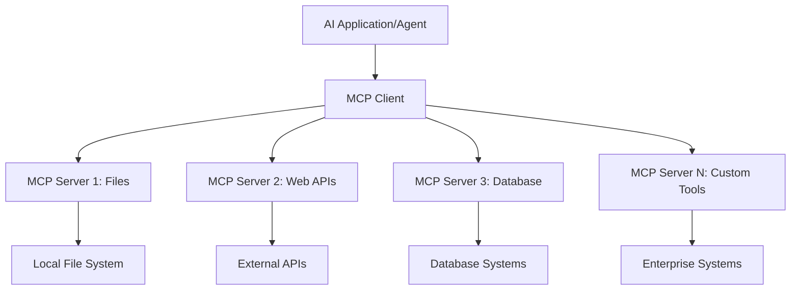

**🔧 Fő komponensek:**

| Komponens | Szerep | Példák |
|-----------|--------|--------|
| **MCP Hosts** | MCP szolgáltatásokat fogyasztó alkalmazások | Claude Desktop, VS Code, AI Toolkit |
| **MCP Clients** | Protokoll kezelők (1:1 a szerverekkel) | Beépítve a host alkalmazásokba |
| **MCP Servers** | Képességeket tesznek elérhetővé szabványos protokollon keresztül | Playwright, Files, Azure, GitHub |
| **Transport Layer** | Kommunikációs módok | stdio, HTTP, WebSockets |

## 🏢 A Microsoft MCP szerver ökoszisztémája

A Microsoft vezeti az MCP ökoszisztémát egy átfogó, vállalati szintű szervercsomaggal, amely valós üzleti igényeket fed le.

### 🌟 Kiemelt Microsoft MCP szerverek

#### 1. ☁️ Azure MCP Server
**🔗 Repository**: [azure/azure-mcp](https://github.com/azure/azure-mcp)  
**🎯 Cél:** Átfogó Azure erőforrás-kezelés AI integrációval

**✨ Főbb jellemzők:**
- Deklaratív infrastruktúra-provisionálás
- Valós idejű erőforrás-monitorozás
- Költségoptimalizációs ajánlások
- Biztonsági megfelelőség ellenőrzése

**🚀 Használati esetek:**
- Infrastructure-as-Code AI támogatással
- Automatikus erőforrás skálázás
- Felhő költségoptimalizáció
- DevOps munkafolyamat automatizálás

#### 2. 📊 Microsoft Dataverse MCP
**📚 Dokumentáció**: [Microsoft Dataverse Integration](https://go.microsoft.com/fwlink/?linkid=2320176)  
**🎯 Cél:** Természetes nyelvű felület üzleti adatokhoz

**✨ Főbb jellemzők:**
- Természetes nyelvű adatbázis lekérdezések
- Üzleti kontextus megértése
- Egyedi prompt sablonok
- Vállalati adatkezelés

**🚀 Használati esetek:**
- Üzleti intelligencia riportok
- Ügyféladat elemzés
- Értékesítési csővezeték elemzés
- Megfelelőségi adatlekérdezések

#### 3. 🌐 Playwright MCP Server
**🔗 Repository**: [microsoft/playwright-mcp](https://github.com/microsoft/playwright-mcp)  
**🎯 Cél:** Böngésző automatizálás és webes interakciók

**✨ Főbb jellemzők:**
- Több böngészős automatizálás (Chrome, Firefox, Safari)
- Intelligens elemfelismerés
- Képernyőkép és PDF generálás
- Hálózati forgalom monitorozás

**🚀 Használati esetek:**
- Automatizált tesztelési munkafolyamatok
- Web scraping és adatkinyerés
- UI/UX monitorozás
- Versenytárs elemzés automatizálás

#### 4. 📁 Files MCP Server
**🔗 Repository**: [microsoft/files-mcp-server](https://github.com/microsoft/files-mcp-server)  
**🎯 Cél:** Intelligens fájlrendszer műveletek

**✨ Főbb jellemzők:**
- Deklaratív fájlkezelés
- Tartalomszinkronizáció
- Verziókezelés integráció
- Metaadat kinyerés

**🚀 Használati esetek:**
- Dokumentáció kezelése
- Kód tárház szervezése
- Tartalom publikálási munkafolyamatok
- Adatcső fájlkezelés

#### 5. 📝 MarkItDown MCP Server
**🔗 Repository**: [microsoft/markitdown](https://github.com/microsoft/markitdown)  
**🎯 Cél:** Fejlett Markdown feldolgozás és manipuláció

**✨ Főbb jellemzők:**
- Gazdag Markdown elemzés
- Formátum konverzió (MD ↔ HTML ↔ PDF)
- Tartalmi struktúra elemzés
- Sablon feldolgozás

**🚀 Használati esetek:**
- Műszaki dokumentációs munkafolyamatok
- Tartalomkezelő rendszerek
- Jelentéskészítés
- Tudásbázis automatizálás

#### 6. 📈 Clarity MCP Server
**📦 Csomag**: [@microsoft/clarity-mcp-server](https://www.npmjs.com/package/@microsoft/clarity-mcp-server)  
**🎯 Cél:** Webanalitika és felhasználói viselkedés elemzés

**✨ Főbb jellemzők:**
- Hőtérkép adat elemzés
- Felhasználói munkamenet felvételek
- Teljesítménymutatók
- Konverziós tölcsér elemzés

**🚀 Használati esetek:**
- Weboldal optimalizáció
- Felhasználói élmény kutatás
- A/B teszt elemzés
- Üzleti intelligencia dashboardok

### 🌍 Közösségi ökoszisztéma

A Microsoft szerverein túl az MCP ökoszisztéma tartalmazza:
- **🐙 GitHub MCP**: Tárházkezelés és kódelemzés
- **🗄️ Adatbázis MCP-k**: PostgreSQL, MySQL, MongoDB integrációk
- **☁️ Felhőszolgáltató MCP-k**: AWS, GCP, Digital Ocean eszközök
- **📧 Kommunikációs MCP-k**: Slack, Teams, Email integrációk

## 🛠️ Gyakorlati labor: Böngésző automatizálási ügynök építése

**🎯 Projekt cél:** Készíts egy intelligens böngésző automatizálási ügynököt Playwright MCP szerverrel, amely képes weboldalakat böngészni, információkat kinyerni és összetett webes műveleteket végrehajtani.

### 🚀 1. fázis: Ügynök alapjainak létrehozása

#### 1. lépés: Ügynök inicializálása
1. **Nyisd meg az AI Toolkit Agent Buildert**
2. **Hozz létre új ügynököt** az alábbi beállításokkal:
   - **Név**: `BrowserAgent`
   - **Modell**: Válaszd a GPT-4o modellt

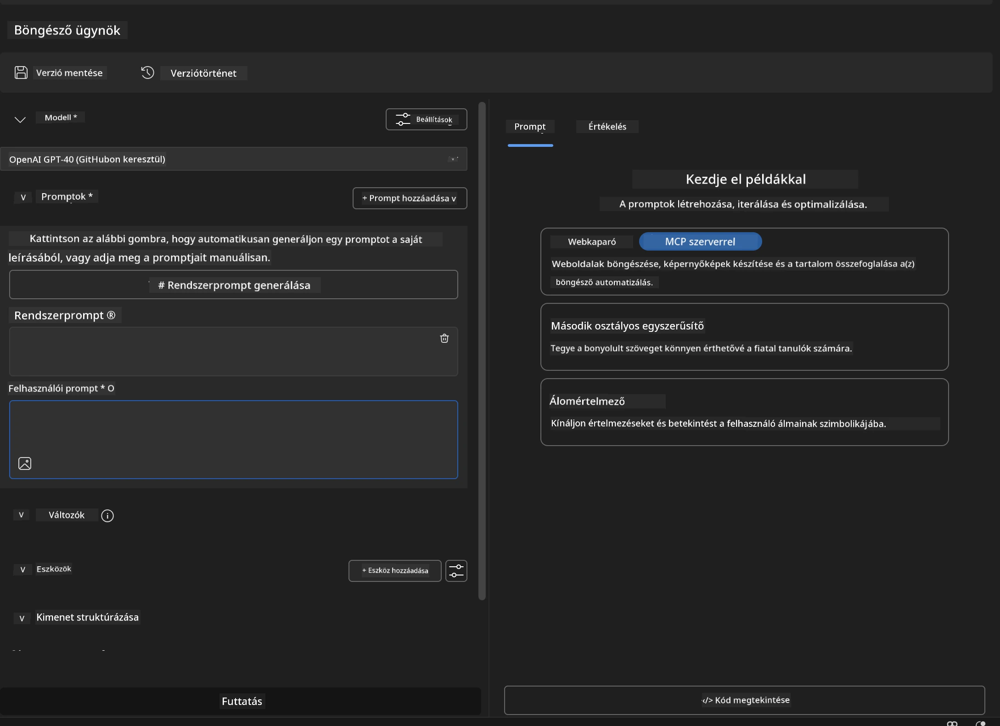

### 🔧 2. fázis: MCP integrációs munkafolyamat

#### 3. lépés: MCP szerver integráció hozzáadása
1. **Navigálj az Eszközök szekcióba** az Agent Builderben
2. **Kattints az "Add Tool" gombra**, hogy megnyisd az integrációs menüt
3. **Válaszd az "MCP Server" opciót** a listából

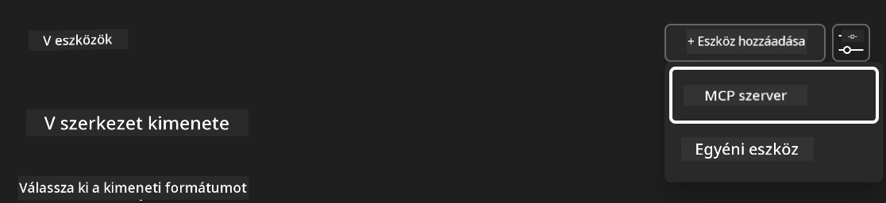

**🔍 Az eszköz típusok megértése:**
- **Beépített eszközök**: Előre konfigurált AI Toolkit funkciók
- **MCP szerverek**: Külső szolgáltatás integrációk
- **Egyedi API-k**: Saját szolgáltatás végpontok
- **Függvényhívás**: Közvetlen modell függvény elérés

#### 4. lépés: MCP szerver kiválasztása
1. **Válaszd az "MCP Server" opciót a folytatáshoz**
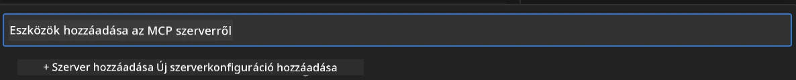

2. **Böngészd az MCP katalógust** a rendelkezésre álló integrációk megtekintéséhez
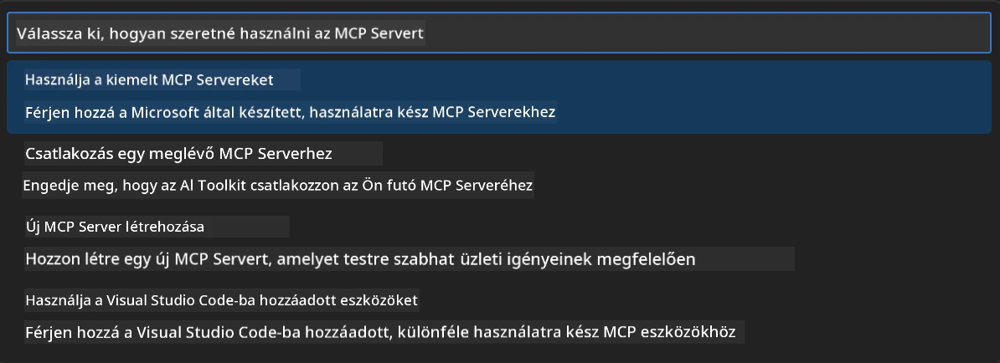

### 🎮 3. fázis: Playwright MCP konfiguráció

#### 5. lépés: Playwright kiválasztása és konfigurálása
1. **Kattints a "Use Featured MCP Servers" gombra**, hogy elérd a Microsoft által hitelesített szervereket
2. **Válaszd ki a "Playwright" szervert** a listából
3. **Fogadd el az alapértelmezett MCP ID-t**, vagy testreszabhatod a környezetedhez

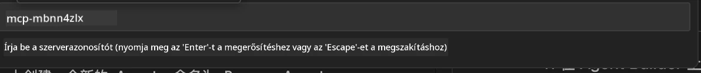

#### 6. lépés: Playwright képességek engedélyezése
**🔑 Kritikus lépés**: Válaszd ki az összes elérhető Playwright metódust a maximális funkcionalitásért

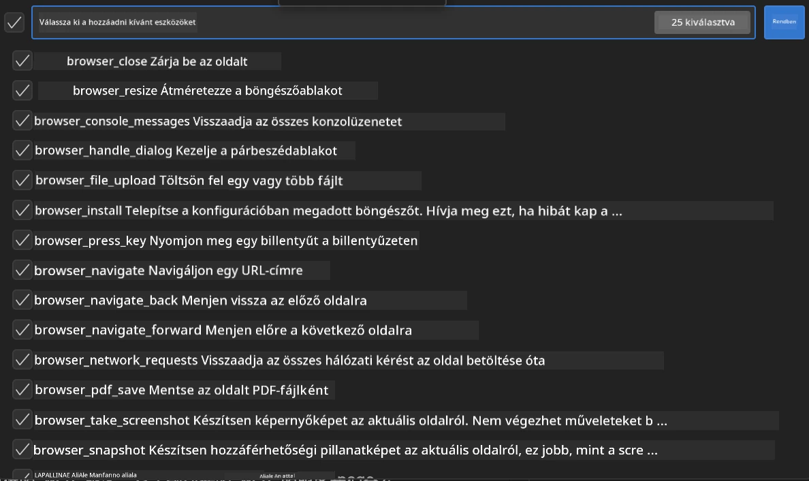

**🛠️ Alapvető Playwright eszközök:**
- **Navigáció**: `goto`, `goBack`, `goForward`, `reload`
- **Interakció**: `click`, `fill`, `press`, `hover`, `drag`
- **Kinyerés**: `textContent`, `innerHTML`, `getAttribute`
- **Ellenőrzés**: `isVisible`, `isEnabled`, `waitForSelector`
- **Rögzítés**: `screenshot`, `pdf`, `video`
- **Hálózat**: `setExtraHTTPHeaders`, `route`, `waitForResponse`

#### 7. lépés: Integráció sikerességének ellenőrzése
**✅ Siker jelei:**
- Minden eszköz megjelenik az Agent Builder felületén
- Nincsenek hibák az integrációs panelen
- A Playwright szerver státusza "Connected"

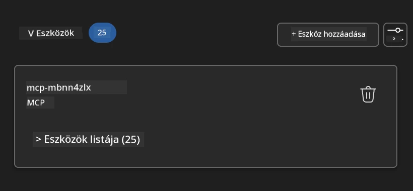

**🔧 Gyakori problémák elhárítása:**
- **Kapcsolódási hiba**: Ellenőrizd az internetkapcsolatot és a tűzfal beállításokat
- **Hiányzó eszközök**: Győződj meg róla, hogy minden képességet kiválasztottál a beállítás során
- **Engedélyezési hibák**: Ellenőrizd, hogy a VS Code rendelkezik a szükséges rendszerengedélyekkel

### 🎯 4. fázis: Fejlett prompt tervezés

#### 8. lépés: Intelligens rendszer promptok tervezése
Készíts kifinomult promptokat, amelyek kihasználják a Playwright teljes képességét:

```markdown
# Web Automation Expert System Prompt

## Core Identity
You are an advanced web automation specialist with deep expertise in browser automation, web scraping, and user experience analysis. You have access to Playwright tools for comprehensive browser control.

## Capabilities & Approach
### Navigation Strategy
- Always start with screenshots to understand page layout
- Use semantic selectors (text content, labels) when possible
- Implement wait strategies for dynamic content
- Handle single-page applications (SPAs) effectively

### Error Handling
- Retry failed operations with exponential backoff
- Provide clear error descriptions and solutions
- Suggest alternative approaches when primary methods fail
- Always capture diagnostic screenshots on errors

### Data Extraction
- Extract structured data in JSON format when possible
- Provide confidence scores for extracted information
- Validate data completeness and accuracy
- Handle pagination and infinite scroll scenarios

### Reporting
- Include step-by-step execution logs
- Provide before/after screenshots for verification
- Suggest optimizations and alternative approaches
- Document any limitations or edge cases encountered

## Ethical Guidelines
- Respect robots.txt and rate limiting
- Avoid overloading target servers
- Only extract publicly available information
- Follow website terms of service
```

#### 9. lépés: Dinamikus felhasználói promptok létrehozása
Tervezd meg azokat a promptokat, amelyek különböző képességeket demonstrálnak:

**🌐 Web elemzés példa:**
```markdown
Navigate to github.com/kinfey and provide a comprehensive analysis including:
1. Repository structure and organization
2. Recent activity and contribution patterns  
3. Documentation quality assessment
4. Technology stack identification
5. Community engagement metrics
6. Notable projects and their purposes

Include screenshots at key steps and provide actionable insights.
```

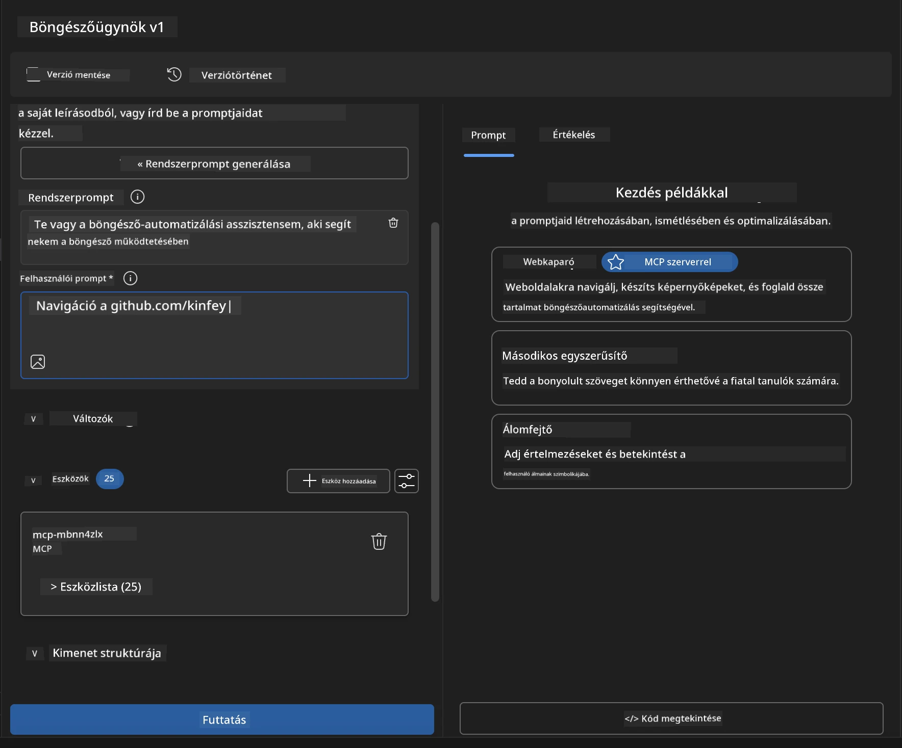

### 🚀 5. fázis: Végrehajtás és tesztelés

#### 10. lépés: Az első automatizálás futtatása
1. **Kattints a "Run" gombra**, hogy elindítsd az automatizálási folyamatot
2. **Kövesd valós időben a végrehajtást**:
   - Automatikusan elindul a Chrome böngésző
   - Az ügynök navigál a céloldalra
   - Képernyőképek készülnek minden fontos lépésről
   - Az elemzési eredmények valós időben érkeznek

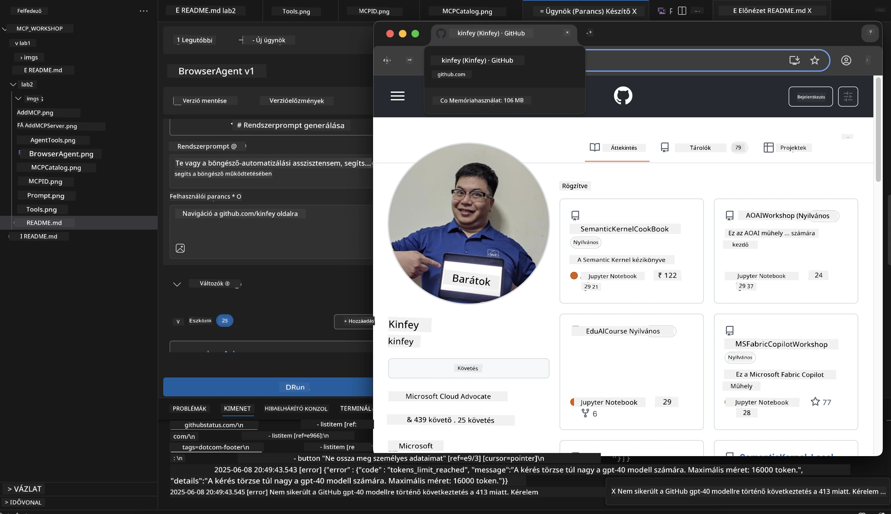

#### 11. lépés: Eredmények és elemzések áttekintése
Nézd át az átfogó elemzést az Agent Builder felületén:

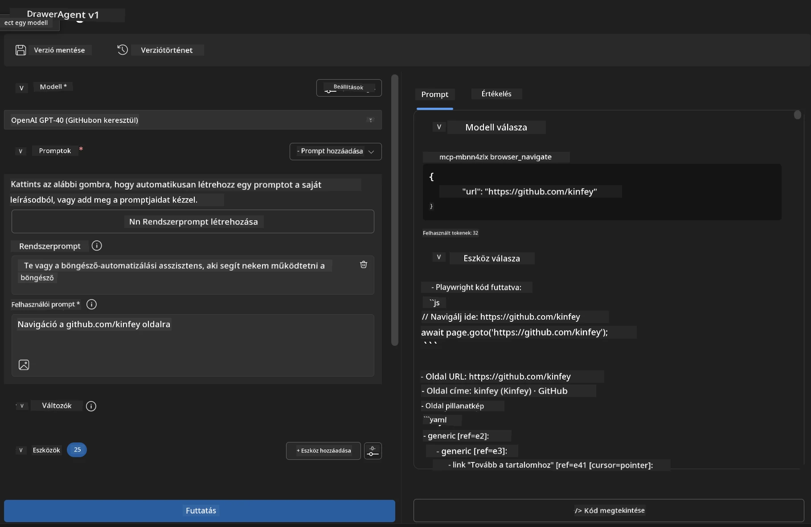

### 🌟 6. fázis: Fejlett képességek és telepítés

#### 12. lépés: Exportálás és éles környezetbe telepítés
Az Agent Builder többféle telepítési lehetőséget támogat:

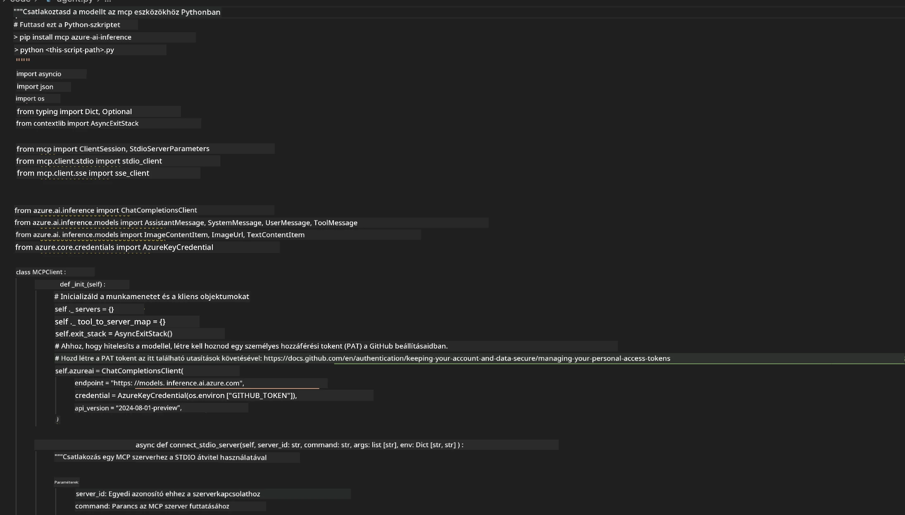

## 🎓 2. modul összefoglaló és további lépések

### 🏆 Elért eredmény: MCP integráció mesterszintű ismerete

**✅ Megszerzett készségek:**
- [ ] MCP architektúra és előnyök megértése
- [ ] A Microsoft MCP szerver ökoszisztéma áttekintése
- [ ] Playwright MCP integrálása az AI Toolkitbe
- [ ] Fejlett böngésző automatizálási ügynökök építése
- [ ] Fejlett prompt tervezés web automatizáláshoz

### 📚 További források

- **🔗 MCP specifikáció**: [Hivatalos protokoll dokumentáció](https://modelcontextprotocol.io/)
- **🛠️ Playwright API**: [Teljes metódus referencia](https://playwright.dev/docs/api/class-playwright)
- **🏢 Microsoft MCP szerverek**: [Vállalati integrációs útmutató](https://github.com/microsoft/mcp-servers)
- **🌍 K
- Építsünk fel egy Weather MCP szervert a semmiből

**Jogi nyilatkozat**:  
Ez a dokumentum az AI fordító szolgáltatás, a [Co-op Translator](https://github.com/Azure/co-op-translator) segítségével készült. Bár a pontosságra törekszünk, kérjük, vegye figyelembe, hogy az automatikus fordítások hibákat vagy pontatlanságokat tartalmazhatnak. Az eredeti dokumentum az anyanyelvén tekintendő hiteles forrásnak. Fontos információk esetén szakmai, emberi fordítást javaslunk. Nem vállalunk felelősséget a fordítás használatából eredő félreértésekért vagy téves értelmezésekért.