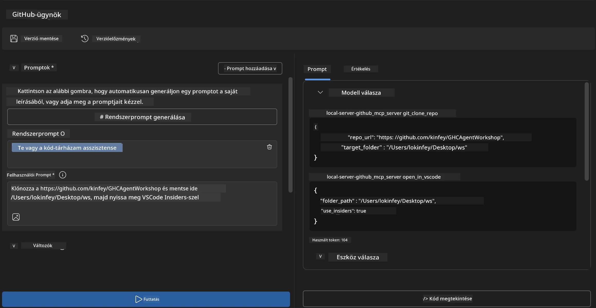
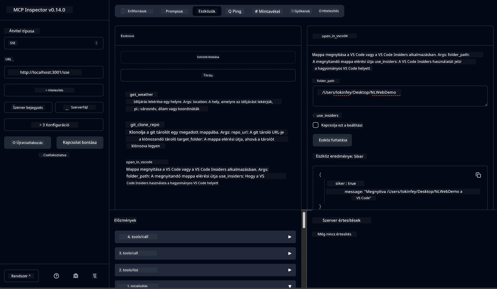

# 🐙 4. modul: Gyakorlati MCP fejlesztés - Egyedi GitHub klón szerver


> **⚡ Gyors indítás:** Építs egy éles használatra kész MCP szervert, amely automatizálja a GitHub tárolók klónozását és a VS Code integrációját mindössze 30 perc alatt!

## 🎯 Tanulási célok

A labor végére képes leszel:

- ✅ Egyedi MCP szerver létrehozása valós fejlesztési munkafolyamatokhoz
- ✅ GitHub tároló klónozás funkció implementálása MCP-n keresztül
- ✅ Egyedi MCP szerverek integrálása VS Code-dal és Agent Builder-rel
- ✅ GitHub Copilot Agent Mode használata egyedi MCP eszközökkel
- ✅ Egyedi MCP szerverek tesztelése és éles környezetbe telepítése

## 📋 Előfeltételek

- Az 1-3. laborok elvégzése (MCP alapok és haladó fejlesztés)
- GitHub Copilot előfizetés ([ingyenes regisztráció elérhető](https://github.com/github-copilot/signup))
- VS Code AI Toolkit és GitHub Copilot kiterjesztésekkel
- Telepített és konfigurált Git CLI

## 🏗️ Projekt áttekintése

### **Valós fejlesztési kihívás**
Fejlesztőként gyakran használjuk a GitHub-ot tárolók klónozására, majd azok VS Code vagy VS Code Insiders-ben való megnyitására. Ez a manuális folyamat a következőkből áll:
1. Terminál/parancssor megnyitása
2. A kívánt mappa megkeresése
3. `git clone` parancs futtatása
4. VS Code megnyitása a klónozott mappában

**MCP megoldásunk ezt egyetlen intelligens parancsra egyszerűsíti!**

### **Mit fogsz építeni**
Egy **GitHub Clone MCP szervert** (`git_mcp_server`), amely a következőket nyújtja:

| Funkció | Leírás | Előny |
|---------|-------------|---------|
| 🔄 **Intelligens tároló klónozás** | GitHub tárolók validált klónozása | Automatizált hibaellenőrzés |
| 📁 **Intelligens könyvtárkezelés** | Biztonságos mappák ellenőrzése és létrehozása | Felülírás megelőzése |
| 🚀 **Platformfüggetlen VS Code integráció** | Projektek megnyitása VS Code/Insiders-ben | Zökkenőmentes munkafolyamat |
| 🛡️ **Robosztus hiba kezelés** | Hálózati, jogosultsági és útvonallal kapcsolatos hibák kezelése | Éles környezetre kész megbízhatóság |

---

## 📖 Lépésről lépésre megvalósítás

### 1. lépés: GitHub agent létrehozása az Agent Builder-ben

1. **Indítsd el az Agent Builder-t** az AI Toolkit kiterjesztésből
2. **Hozz létre egy új agent-et** az alábbi konfigurációval:
   ```
   Agent Name: GitHubAgent
   ```

3. **Indítsd el az egyedi MCP szervert:**
   - Navigálj a **Tools** → **Add Tool** → **MCP Server** menüpontra
   - Válaszd a **"Create A new MCP Server"** opciót
   - Válaszd a **Python sablont** a maximális rugalmasság érdekében
   - **Szerver neve:** `git_mcp_server`

### 2. lépés: GitHub Copilot Agent Mode konfigurálása

1. **Nyisd meg a GitHub Copilot-ot** VS Code-ban (Ctrl/Cmd + Shift + P → "GitHub Copilot: Open")
2. **Válaszd ki az Agent Modellt** a Copilot felületén
3. **Válaszd a Claude 3.7 modellt** a fejlettebb érvelési képességekért
4. **Kapcsold be az MCP integrációt** az eszközhasználathoz

> **💡 Profi tipp:** A Claude 3.7 jobban érti a fejlesztési munkafolyamatokat és a hibakezelési mintákat.

### 3. lépés: Alap MCP szerver funkció implementálása

**Használd a következő részletes promptot GitHub Copilot Agent Mode-ban:**

```
Create two MCP tools with the following comprehensive requirements:

🔧 TOOL A: clone_repository
Requirements:
- Clone any GitHub repository to a specified local folder
- Return the absolute path of the successfully cloned project
- Implement comprehensive validation:
  ✓ Check if target directory already exists (return error if exists)
  ✓ Validate GitHub URL format (https://github.com/user/repo)
  ✓ Verify git command availability (prompt installation if missing)
  ✓ Handle network connectivity issues
  ✓ Provide clear error messages for all failure scenarios

🚀 TOOL B: open_in_vscode
Requirements:
- Open specified folder in VS Code or VS Code Insiders
- Cross-platform compatibility (Windows/Linux/macOS)
- Use direct application launch (not terminal commands)
- Auto-detect available VS Code installations
- Handle cases where VS Code is not installed
- Provide user-friendly error messages

Additional Requirements:
- Follow MCP 1.9.3 best practices
- Include proper type hints and documentation
- Implement logging for debugging purposes
- Add input validation for all parameters
- Include comprehensive error handling
```

### 4. lépés: MCP szerver tesztelése

#### 4a. Tesztelés az Agent Builder-ben

1. **Indítsd el az Agent Builder hibakeresési konfigurációját**
2. **Állítsd be az agent-ed az alábbi rendszer prompttal:**

```
SYSTEM_PROMPT:
You are my intelligent coding repository assistant. You help developers efficiently clone GitHub repositories and set up their development environment. Always provide clear feedback about operations and handle errors gracefully.
```

3. **Tesztelj életszerű felhasználói szcenáriókkal:**

```
USER_PROMPT EXAMPLES:

Scenario : Basic Clone and Open
"Clone {Your GitHub Repo link such as https://github.com/kinfey/GHCAgentWorkshop
 } and save to {The global path you specify}, then open it with VS Code Insiders"
```



**Várt eredmények:**
- ✅ Sikeres klónozás az útvonal megerősítésével
- ✅ Automatikus VS Code indítás
- ✅ Egyértelmű hibajelzések érvénytelen esetekre
- ✅ Szél- és szélsőséges esetek megfelelő kezelése

#### 4b. Tesztelés MCP Inspector-ban




---

**🎉 Gratulálunk!** Sikeresen létrehoztál egy gyakorlati, éles környezetbe is alkalmas MCP szervert, amely megoldja a valós fejlesztési munkafolyamat kihívásait. Az egyedi GitHub klón szervered bizonyítja az MCP erejét a fejlesztői produktivitás automatizálásában és növelésében.

### 🏆 Elért eredmények:
- ✅ **MCP fejlesztő** - Egyedi MCP szerver létrehozása
- ✅ **Folyamat automatizáló** - Fejlesztési munkafolyamatok egyszerűsítése  
- ✅ **Integrációs szakértő** - Több fejlesztői eszköz összekapcsolása
- ✅ **Éles környezetre kész** - Telepíthető megoldások építése

---

## 🎓 Workshop befejezés: Az út a Model Context Protocol-lal

**Kedves Workshop résztvevő!**

Gratulálunk a Model Context Protocol workshop négy moduljának elvégzéséhez! Hosszú utat tettél meg az AI Toolkit alapjaitól kezdve egészen az éles használatra kész MCP szerverek fejlesztéséig, amelyek valós fejlesztési kihívásokat oldanak meg.

### 🚀 Tanulási út összefoglalása:

**[1. modul](../lab1/README.md):** Megismerted az AI Toolkit alapjait, modellek tesztelését, és elkészítetted az első AI agent-edet.

**[2. modul](../lab2/README.md):** Megtanultad az MCP architektúrát, integráltad a Playwright MCP-t, és elkészítetted az első böngésző-automatizáló agent-edet.

**[3. modul](../lab3/README.md):** Haladó egyedi MCP szerver fejlesztést tanultál meg Weather MCP szerverrel és hibakeresési eszközökkel.

**[4. modul](../lab4/README.md):** Most mindezt alkalmaztad, hogy valós GitHub tároló munkafolyamat automatizációs eszközt építs.

### 🌟 Amit elsajátítottál:

- ✅ **AI Toolkit ökoszisztéma:** Modellek, agentek és integrációs minták
- ✅ **MCP architektúra:** Kliens-szerver tervezés, protokollok, biztonság
- ✅ **Fejlesztői eszközök:** Playground, Inspector és éles telepítés
- ✅ **Egyedi fejlesztés:** Saját MCP szerverek építése, tesztelése, telepítése
- ✅ **Gyakorlati alkalmazások:** Valós munkafolyamat kihívások AI segítségével való megoldása

### 🔮 Következő lépések:

1. **Építsd meg a saját MCP szerveredet:** Automatizáld a saját egyedi munkafolyamataidat
2. **Csatlakozz az MCP közösséghez:** Oszd meg munkáidat és tanulj másoktól
3. **Fedezd fel a haladó integrációkat:** Kösd össze az MCP szervereket vállalati rendszerekkel
4. **Járulj hozzá a nyílt forráskódhoz:** Segítsd az MCP eszköztár és dokumentáció fejlesztését

Emlékezz, ez a workshop csak a kezdete. A Model Context Protocol ökoszisztéma gyorsan fejlődik, és most már képes vagy az AI-alapú fejlesztői eszközök élvonalában lenni.

**Köszönjük, hogy részt vettél és kitartóan tanultál!**

Reméljük, ez a workshop ötleteket ébresztett benned, amelyek megváltoztatják, hogyan építesz és használsz AI eszközöket a fejlesztési munkád során.

**Jó kódolást!**

---

## Mi következik

Gratulálunk a 10. modul összes laborjának befejezéséhez!

- Vissza: [10. modul áttekintése](../README.md)
- Tovább: [11. modul: MCP szerver gyakorlati laborok](../../11-MCPServerHandsOnLabs/README.md)

---

<!-- CO-OP TRANSLATOR DISCLAIMER START -->
**Nyilatkozat**:
Jelen dokumentumot az AI fordító szolgáltatás, a [Co-op Translator](https://github.com/Azure/co-op-translator) használatával fordítottuk. Bár igyekszünk pontosan dolgozni, kérjük, vegye figyelembe, hogy az automatikus fordítások hibákat vagy pontatlanságokat tartalmazhatnak. Az eredeti dokumentum az anyanyelvén tekintendő hiteles forrásnak. Kritikus információk esetén szakmai emberi fordítást javasolunk. Nem vállalunk felelősséget semmilyen félreértésért vagy téves értelmezésért, amely ebből a fordításból ered.
<!-- CO-OP TRANSLATOR DISCLAIMER END -->