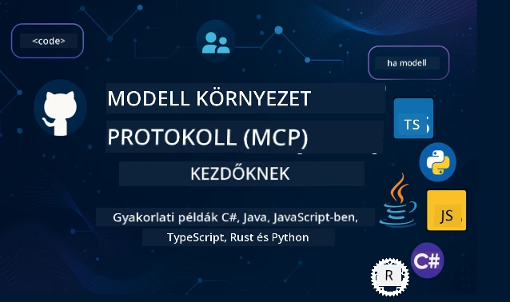

 

[](https://GitHub.com/microsoft/mcp-for-beginners/graphs/contributors)
[](https://GitHub.com/microsoft/mcp-for-beginners/issues)
[](https://GitHub.com/microsoft/mcp-for-beginners/pulls)
[](http://makeapullrequest.com)

[](https://GitHub.com/microsoft/mcp-for-beginners/watchers)
[](https://GitHub.com/microsoft/mcp-for-beginners/fork)
[](https://GitHub.com/microsoft/mcp-for-beginners/stargazers)


[](https://discord.gg/nTYy5BXMWG)

Kövesd ezeket a lépéseket, hogy elkezdd használni ezeket az erőforrásokat:
1. **Forkold le a tárházat**: Kattints a [](https://GitHub.com/microsoft/mcp-for-beginners/fork) gombra
2. **Klonozd a tárházat**:   `git clone https://github.com/microsoft/mcp-for-beginners.git`
3. **Csatlakozz a** [](https://discord.gg/nTYy5BXMWG)


### 🌐 Többnyelvű Támogatás

#### GitHub Action által támogatott (Automatizált és Mindig Naprakész)

<!-- CO-OP TRANSLATOR LANGUAGES TABLE START -->
[Arab](../ar/README.md) | [Bengáli](../bn/README.md) | [Bolgár](../bg/README.md) | [Burmai (Myanmar)](../my/README.md) | [Kínai (Egyszerűsített)](../zh-CN/README.md) | [Kínai (Hagyományos, Hong Kong)](../zh-HK/README.md) | [Kínai (Hagyományos, Macau)](../zh-MO/README.md) | [Kínai (Hagyományos, Taiwan)](../zh-TW/README.md) | [Horvát](../hr/README.md) | [Cseh](../cs/README.md) | [Dán](../da/README.md) | [Holland](../nl/README.md) | [Észt](../et/README.md) | [Finn](../fi/README.md) | [Francia](../fr/README.md) | [Német](../de/README.md) | [Görög](../el/README.md) | [Héber](../he/README.md) | [Hindi](../hi/README.md) | [Magyar](./README.md) | [Indonéz](../id/README.md) | [Olasz](../it/README.md) | [Japán](../ja/README.md) | [Kannada](../kn/README.md) | [Koreai](../ko/README.md) | [Litván](../lt/README.md) | [Maláj](../ms/README.md) | [Malayalam](../ml/README.md) | [Marathi](../mr/README.md) | [Nepáli](../ne/README.md) | [Nigériai Pidgin](../pcm/README.md) | [Norvég](../no/README.md) | [Perzsa (Fárszi)](../fa/README.md) | [Lengyel](../pl/README.md) | [Portugál (Brazília)](../pt-BR/README.md) | [Portugál (Portugália)](../pt-PT/README.md) | [Pandzsábi (Gurmukhi)](../pa/README.md) | [Román](../ro/README.md) | [Orosz](../ru/README.md) | [Szerb (Cirill)](../sr/README.md) | [Szlovák](../sk/README.md) | [Szlovén](../sl/README.md) | [Spanyol](../es/README.md) | [Szuahéli](../sw/README.md) | [Svéd](../sv/README.md) | [Tagalog (Filipino)](../tl/README.md) | [Tamil](../ta/README.md) | [Telugu](../te/README.md) | [Thai](../th/README.md) | [Török](../tr/README.md) | [Ukrán](../uk/README.md) | [Urdu](../ur/README.md) | [Vietnami](../vi/README.md)

> **Szeretnéd helyben klónozni?**
>
> Ez a tárház több mint 50 nyelvi fordítást tartalmaz, ami jelentősen növeli a letöltési méretet. Ha fordítások nélkül szeretnél klónozni, használj sparse checkoutot:
>
> **Bash / macOS / Linux:**
> ```bash
> git clone --filter=blob:none --sparse https://github.com/microsoft/mcp-for-beginners.git
> cd mcp-for-beginners
> git sparse-checkout set --no-cone '/*' '!translations' '!translated_images'
> ```
>
> **CMD (Windows):**
> ```cmd
> git clone --filter=blob:none --sparse https://github.com/microsoft/mcp-for-beginners.git
> cd mcp-for-beginners
> git sparse-checkout set --no-cone "/*" "!translations" "!translated_images"
> ```
>
> Így mindent megkapsz a kurzus elvégzéséhez, sokkal gyorsabb letöltési sebességgel.
<!-- CO-OP TRANSLATOR LANGUAGES TABLE END -->

# 🚀 Model Context Protocol (MCP) Tananyag Kezdőknek

## **Tanulj MCP-t kézzel fogható kódpéldákkal C#, Java, JavaScript, Rust, Python és TypeScript nyelveken**

## 🧠 A Model Context Protocol Tananyag Áttekintése
Üdvözlünk a Model Context Protocol (MCP) felfedezőútján! Ha valaha is kíváncsi voltál, hogyan kommunikálnak az AI alkalmazások különböző eszközökkel és szolgáltatásokkal, most megismered azt az elegáns megoldást, amely átalakítja, hogyan építenek a fejlesztők intelligens rendszereket.

Gondolj az MCP-re mint egy univerzális fordítóra az AI alkalmazások számára – ahogyan az USB portok lehetővé teszik, hogy bármilyen eszközt csatlakoztass a számítógépedhez, úgy az MCP szabványos módon köti össze az AI modelleket bármilyen eszközzel vagy szolgáltatással. Akár az első chatbotodat építed, akár összetett AI munkafolyamatokat fejlesztesz, az MCP megértése képessé tesz arra, hogy sokkal rugalmasabb és hatékonyabb alkalmazásokat hozz létre.

Ez a tananyag türelemmel és gondossággal készült az oktatási utazásodhoz. Egyszerű fogalmakkal, amiket már ismersz, kezdünk, és fokozatosan fejlesztjük a tudásodat gyakorlati példákon keresztül a kedvenc programozási nyelveden. Minden lépéshez világos magyarázatok, gyakorlatias példák és bőséges bátorítás társul.

A tananyag végére magabiztosan fogsz saját MCP szervereket építeni, integrálni azokat népszerű AI platformokkal, és megérted, hogyan alakítja ez a technológia az AI fejlesztés jövőjét. Vágjunk bele ebbe az izgalmas kalandba együtt!

### Hivatalos Dokumentáció és Specifikációk

Ez a tananyag összhangban van az **MCP Specification 2025-11-25** verzióval (a legfrissebb stabil kiadás). Az MCP specifikáció dátum alapú verziókezelést használ (ÉÉÉÉ-HH-NN formátumban), hogy egyértelmű legyen a protokoll verziókövetése.

Ezek az erőforrások egyre értékesebbek lesznek, ahogy nő a tudásod, de ne érezd kötelezőnek azonnal mindent elolvasni. Kezdd azzal, ami leginkább érdekel!
- 📘 [MCP Dokumentáció](https://modelcontextprotocol.io/) – Ez a lépésről lépésre útmutató és használati kézikönyv az elsődleges forrásod. A dokumentáció kezdőknek íródott, világos példákkal, amiket saját tempódban követhetsz.
- 📜 [MCP Specifikáció](https://modelcontextprotocol.io/specification/2025-11-25) – Gondolj erre, mint a részletes referencia kézikönyvedre. A tananyag során gyakran vissza fogsz térni hozzá, hogy konkrét részleteket és fejlett funkciókat tanulmányozz.
- 📜 [MCP Specifikáció Verziókezelés](https://modelcontextprotocol.io/specification/versioning) – Ez tartalmazza a protokoll verziótörténetét és azt, hogyan használja az MCP a dátum alapú verziózást (ÉÉÉÉ-HH-NN formátumban).
- 🧑‍💻 [MCP GitHub Tárház](https://github.com/modelcontextprotocol) – Itt SDK-kat, eszközöket és kód példákat találsz több programozási nyelven. Egy gyakorlati példákban és kész komponensekben gazdag tárház.
- 🌐 [MCP Közösség](https://github.com/orgs/modelcontextprotocol/discussions) – Csatlakozz más tanulókhoz és tapasztalt fejlesztőkhöz az MCP-ről szóló beszélgetésekben. Ez egy támogató közösség, ahol kérdésekre szívesen válaszolnak és a tudás szabadon megosztott.

## Tanulási Célok

A tananyag végére magabiztosságot és örömet fogsz érezni az új képességeid miatt. Íme, mit fogsz elérni:

• **Megérted az MCP alapjait**: Megérted, hogy mi az a Model Context Protocol, és miért forradalmasítja az AI alkalmazások együttműködését, analógiák és példák segítségével, amelyek könnyen érthetők.

• **Megépíted az első MCP szerveredet**: Elkészítesz egy működő MCP szervert a választott programozási nyelveden, egyszerű példákkal kezdve, és lépésről lépésre fejlesztve a képességeidet.

• **Kapcsolod az AI modelleket valós eszközökhöz**: Megtanulod, hogyan hidald át a szakadékot AI modellek és valódi szolgáltatások között, hogy alkalmazásaidnak hatalmas új funkciókat adj.

• **Biztonsági legjobb gyakorlatokat alkalmazol**: Megérted, hogyan tartsd biztonságban az MCP implementációidat, megvédve mind az alkalmazásaidat, mind a felhasználókat.

• **Magabiztosan telepítesz**: Tudni fogod, hogyan vidd élesbe MCP projektjeidet, gyakorlati telepítési stratégiákkal, amelyek a való világban is működnek.

• **Csatlakozol az MCP közösséghez**: A növekvő fejlesztői közösség tagja leszel, akik formálják az AI alkalmazásfejlesztés jövőjét.

## Alapvető Háttér

Mielőtt belevágnánk az MCP részleteibe, győződjünk meg róla, hogy kényelmesen érzed magad néhány alapvető fogalommal. Ne aggódj, ha nem vagy szakértő ezekben - mindent elmagyarázunk menet közben!

### Protokollok megértése (Az alapok)

Gondolj egy protokollra úgy, mint egy beszélgetés szabályaira. Amikor felhívsz egy ismerőst, mindketten tudjátok, hogy köszönéskor „szia”-t mondotok, felváltva beszéltek, és a végén elköszönötök. A számítógépes programoknak is szükségük van hasonló szabályokra, hogy hatékonyan kommunikáljanak.

Az MCP egy protokoll – egy előre egyeztetett szabályrendszer, amely segíti az AI modelleket és alkalmazásokat abban, hogy eredményesen "beszélgessenek" eszközökkel és szolgáltatásokkal. Ahogy a beszélgetési szabályok segítik a hatékony emberi kommunikációt, úgy az MCP teszi megbízhatóbbá és erőteljesebbé az AI alkalmazások közötti kommunikációt.

### Kliens-szerver kapcsolatok (Hogyan működnek együtt a programok)

Nap mint nap használsz kliens-szerver kapcsolatokat! Amikor webböngészővel (kliens) meglátogatsz egy weboldalt, egy web szerverhez kapcsolódsz, amely elküldi az oldal tartalmát. A böngésző tudja, hogyan kérjen le információt, és a szerver tud válaszolni.

Az MCP esetében hasonló kapcsolat van: az AI modellek kliensként kérnek információt vagy műveleteket, míg az MCP szerverek szolgáltatják ezeket a képességeket. Olyan, mintha egy segítőkész asszisztens (a szerver) lenne, akit az AI megkérhet, hogy végezzen el konkrét feladatokat.

### Miért fontos a szabványosítás (Hogy működjön minden együtt)

Képzeld el, ha minden autógyártó más alakú benzinkútdugót használna – minden autóhoz külön adapterre lenne szükség! A szabványosítás azt jelenti, hogy közös megoldásokban állapodunk meg, hogy minden zökkenőmentesen működjön együtt.

Az MCP ezt a szabványosítást biztosítja az AI alkalmazások számára. Ahelyett, hogy minden AI modell egyedi kódot igényelne, az MCP egy univerzális kommunikációs módot hoz létre. Ez azt jelenti, hogy a fejlesztők egyszer építhetnek eszközöket, amelyek sokféle AI rendszerrel működnek együtt.

## 🧭 A tanulási utad áttekintése

Az MCP tananyagod gondosan felépített, hogy fokozatosan növelje a magabiztosságodat és készségeidet. Minden szakasz új fogalmakat vezet be, miközben megerősíti, amit már megtanultál.

### 🌱 Alapozó szakasz: Az alapok megértése (0-2. modulok)

Itt kezdődik a kalandod! Bemutatjuk az MCP fogalmait ismerős analógiák és egyszerű példák segítségével. Megérted, mi az MCP, miért létezik, és hogyan illeszkedik az AI fejlesztés nagyobb képébe.

• **0. modul – Bevezetés az MCP-be**: Felfedezzük, mi az MCP és miért olyan fontos a modern AI alkalmazások számára. Valódi példákat látsz az MCP működésére, és megérted, hogyan oldja meg a fejlesztők által gyakran tapasztalt problémákat.

• **1. modul – Alapfogalmak magyarázata**: Megtanulod az MCP lényegi építőköveit. Sok analógiát és vizuális példát használunk, hogy ezek a fogalmak természetesnek és érthetőnek hassanak.

• **2. modul – Biztonság az MCP-ben**: A biztonság talán ijesztőnek hangzik, de megmutatjuk, hogyan tartalmaz az MCP beépített biztonsági funkciókat, és megtanítjuk a legjobb gyakorlatokat, hogy már az elejétől védve legyenek az alkalmazásaid.

### 🔨 Építő szakasz: Az első megvalósítások létrehozása (3. modul)

Most kezdődik az igazi móka! Gyakorlati tapasztalatot szerzel valódi MCP szerverek és kliensek építésében. Ne aggódj – egyszerűen kezdünk, és végigvezetünk minden lépésen.
Ez a modul több gyakorlati útmutatót tartalmaz, amelyek lehetővé teszik, hogy kedvenc programozási nyelvén gyakoroljon. Létrehozza az első szerverét, épít egy klienset, hogy csatlakozzon hozzá, és akár népszerű fejlesztői eszközökkel, mint a VS Code integrálódik.

Minden útmutató teljes kódpéldákat, hibaelhárítási tippeket és magyarázatokat tartalmaz arra vonatkozóan, miért hozunk meg bizonyos tervezési döntéseket. Ennek a szakasznak a végére működő MCP megvalósításokkal rendelkezik, amelyekre büszke lehet!

### 🚀 Fejlődési szakasz: Haladó fogalmak és valós alkalmazás (4-5. modulok)

Alapok elsajátítása után készen áll arra, hogy felfedezze az MCP fejlettebb funkcióit. Megvizsgáljuk a gyakorlati megvalósítási stratégiákat, hibakeresési technikákat és olyan haladó témákat, mint a multimodális MI integráció.

Megtanulja, hogyan méretezze MCP megvalósításait éles használatra, és hogyan integrálódjon felhőplatformokkal, például az Azure-ral. Ezek a modulok felkészítik arra, hogy MCP megoldásokat építsen, amelyek képesek kezelni a valós világ igényeit.

### 🌟 Mesteri szakasz: Közösség és specializáció (6-11. modulok)

Az utolsó szakasz az MCP közösséghez való csatlakozásra és az Ön számára legérdekesebb területeken való specializálódásra összpontosít. Megtanulja, hogyan járulhat hozzá nyílt forráskódú MCP projektekhez, valósíthat meg fejlett hitelesítési mintákat, és építhet átfogó, adatbázis-integrált megoldásokat.

A 11. modul külön figyelmet érdemel – ez egy teljes, 13 laborból álló gyakorlati tanulási útvonal, amely megtanítja, hogyan építsen éles használatra kész MCP szervereket PostgreSQL integrációval. Olyan, mint egy záróprojekt, amely összehozza mindazt, amit tanult!

### 📚 Teljes tananyag felépítése

| Modul | Téma | Leírás | Link |
|--------|-------|-------------|------|
| **0-3. modulok: Alapok** | | | |
| 00 | Bevezetés az MCP-be | Áttekintés a Model Context Protocolról és annak jelentőségéről MI folyamatokban | [Bővebben](./00-Introduction/README.md) |
| 01 | Alapfogalmak magyarázata | Az MCP alapfogalmainak mélyreható feltárása | [Bővebben](./01-CoreConcepts/README.md) |
| 02 | Biztonság az MCP-ben | Biztonsági fenyegetések és legjobb gyakorlatok | [Bővebben](./02-Security/README.md) |
| 03 | Az MCP használatának megkezdése | Környezet beállítása, alap szerverek/kliens, integráció | [Bővebben](./03-GettingStarted/README.md) |
| **3. modul: Első szerver és kliens építése** | | | |
| 3.1 | Első szerver | Hozza létre első MCP szerverét | [Útmutató](./03-GettingStarted/01-first-server/README.md) |
| 3.2 | Első kliens | Fejlesszen alap MCP klienst | [Útmutató](./03-GettingStarted/02-client/README.md) |
| 3.3 | Kliens LLM-mel | Integráljon nagy nyelvi modelleket | [Útmutató](./03-GettingStarted/03-llm-client/README.md) |
| 3.4 | VS Code integráció | MCP szervereket használjon VS Code-ban | [Útmutató](./03-GettingStarted/04-vscode/README.md) |
| 3.5 | stdio szerver | Szerverek létrehozása stdio kommunikációval | [Útmutató](./03-GettingStarted/05-stdio-server/README.md) |
| 3.6 | HTTP streaming | HTTP streaming megvalósítása MCP-ben | [Útmutató](./03-GettingStarted/06-http-streaming/README.md) |
| 3.7 | AI Toolkit | Az AI Toolkit használata MCP-vel | [Útmutató](./03-GettingStarted/07-aitk/README.md) |
| 3.8 | Tesztelés | MCP szerver implementáció tesztelése | [Útmutató](./03-GettingStarted/08-testing/README.md) |
| 3.9 | Telepítés | MCP szerverek éles környezetbe telepítése | [Útmutató](./03-GettingStarted/09-deployment/README.md) |
| 3.10 | Haladó szerverhasználat | Haladó szerverek használata fejlettebb funkciókhoz és jobb architektúrához | [Útmutató](./03-GettingStarted/10-advanced/README.md) |
| 3.11 | Egyszerű hitelesítés | Fejezet az autentikációról az alapoktól és RBAC-ról | [Útmutató](./03-GettingStarted/11-simple-auth/README.md) |
| 3.12 | MCP hosztok | Claude Desktop, Cursor, Cline és egyéb MCP hosztok konfigurálása | [Útmutató](./03-GettingStarted/12-mcp-hosts/README.md) |
| 3.13 | MCP Inspector | MCP szerverek hibakeresése és tesztelése Inspector eszközzel | [Útmutató](./03-GettingStarted/13-mcp-inspector/README.md) |
| **4-5. modulok: Gyakorlati & Haladó** | | | |
| 04 | Gyakorlati megvalósítás | SDK-k, hibakeresés, tesztelés, újrahasználható prompt sablonok | [Bővebben](./04-PracticalImplementation/README.md) |
| 4.1 | Lapozás | Nagy eredményhalmazok kezelése kurzoros lapozással | [Útmutató](./04-PracticalImplementation/pagination/README.md) |
| 05 | Haladó MCP témák | Multimodális MI, méretezés, vállalati használat | [Bővebben](./05-AdvancedTopics/README.md) |
| 5.1 | Azure integráció | MCP integráció Azure-ral | [Útmutató](./05-AdvancedTopics/mcp-integration/README.md) |
| 5.2 | Multimodalitás | Több modalitással való munka | [Útmutató](./05-AdvancedTopics/mcp-multi-modality/README.md) |
| 5.3 | OAuth2 demo | OAuth2 hitelesítés megvalósítása | [Útmutató](./05-AdvancedTopics/mcp-oauth2-demo/README.md) |
| 5.4 | Root kontextusok | Root kontextusok megértése és megvalósítása | [Útmutató](./05-AdvancedTopics/mcp-root-contexts/README.md) |
| 5.5 | Routing | MCP routing stratégiák | [Útmutató](./05-AdvancedTopics/mcp-routing/README.md) |
| 5.6 | Mintavételezés | Mintavételezési technikák MCP-ben | [Útmutató](./05-AdvancedTopics/mcp-sampling/README.md) |
| 5.7 | Méretezés | MCP megvalósítások méretezése | [Útmutató](./05-AdvancedTopics/mcp-scaling/README.md) |
| 5.8 | Biztonság | Haladó biztonsági megfontolások | [Útmutató](./05-AdvancedTopics/mcp-security/README.md) |
| 5.9 | Web keresés | Web keresési képességek megvalósítása | [Útmutató](./05-AdvancedTopics/web-search-mcp/README.md) |
| 5.10 | Valós idejű streaming | Valós idejű streaming funkció fejlesztése | [Útmutató](./05-AdvancedTopics/mcp-realtimestreaming/README.md) |
| 5.11 | Valós idejű keresés | Valós idejű keresés megvalósítása | [Útmutató](./05-AdvancedTopics/mcp-realtimesearch/README.md) |
| 5.12 | Entra ID hitelesítés | Hitelesítés Microsoft Entra ID-vel | [Útmutató](./05-AdvancedTopics/mcp-security-entra/README.md) |
| 5.13 | Foundry integráció | Integráció Azure AI Foundry-val | [Útmutató](./05-AdvancedTopics/mcp-foundry-agent-integration/README.md) |
| 5.14 | Kontextusmérnökség | Hatékony kontextus-mérnökségi technikák | [Útmutató](./05-AdvancedTopics/mcp-contextengineering/README.md) |
| 5.15 | MCP egyéni szállítás | Egyéni szállítási megvalósítások | [Útmutató](./05-AdvancedTopics/mcp-transport/README.md) |
| 5.16 | Protokoll funkciók | Előrehaladási értesítések, törlés, erőforrás sablonok | [Útmutató](./05-AdvancedTopics/mcp-protocol-features/README.md) |
| **6-10. modulok: Közösség & Legjobb gyakorlatok** | | | |
| 06 | Közösségi hozzájárulások | Hogyan járuljon hozzá az MCP ökoszisztémához | [Útmutató](./06-CommunityContributions/README.md) |
| 07 | Korai alkalmazási tapasztalatok | Valós megvalósítási történetek | [Útmutató](./07-LessonsfromEarlyAdoption/README.md) |
| 08 | Legjobb MCP gyakorlatok | Teljesítmény, hibatűrés, ellenállóképesség | [Útmutató](./08-BestPractices/README.md) |
| 09 | MCP esettanulmányok | Gyakorlati megvalósítási példák | [Útmutató](./09-CaseStudy/README.md) |
| 10 | Gyakorlati műhelymunka | MCP szerver építése AI Toolkit-kel | [Labor](./10-StreamliningAIWorkflowsBuildingAnMCPServerWithAIToolkit/README.md) |
| **11. modul: MCP szerver gyakorlati labor** | | | |
| 11 | MCP szerver adatbázis integráció | Átfogó 13 laborból álló gyakorlati tanulási útvonal PostgreSQL integrációval | [Laborok](./11-MCPServerHandsOnLabs/README.md) |
| 11.1 | Bevezetés | MCP és adatbázis integráció áttekintése, kiskereskedelmi elemzési felhasználási eset | [Labor 00](./11-MCPServerHandsOnLabs/00-Introduction/README.md) |
| 11.2 | Alap architektúra | MCP szerver architektúra, adatbázis rétegek és biztonsági minták megértése | [Labor 01](./11-MCPServerHandsOnLabs/01-Architecture/README.md) |
| 11.3 | Biztonság és többbérlős környezet | Sor szintű biztonság, autentikáció és többbérlős adat-hozzáférés | [Labor 02](./11-MCPServerHandsOnLabs/02-Security/README.md) |
| 11.4 | Környezet beállítása | Fejlesztői környezet, Docker, Azure erőforrások beállítása | [Labor 03](./11-MCPServerHandsOnLabs/03-Setup/README.md) |
| 11.5 | Adatbázis tervezés | PostgreSQL konfiguráció, kiskereskedelmi séma tervezése és mintaadatok | [Labor 04](./11-MCPServerHandsOnLabs/04-Database/README.md) |
| 11.6 | MCP szerver megvalósítás | FastMCP szerver építése adatbázis integrációval | [Labor 05](./11-MCPServerHandsOnLabs/05-MCP-Server/README.md) |
| 11.7 | Eszközfejlesztés | Adatbázis lekérdező eszközök és séma introspekció készítése | [Labor 06](./11-MCPServerHandsOnLabs/06-Tools/README.md) |
| 11.8 | Szemantikus keresés | Vektoros beágyazások megvalósítása Azure OpenAI és pgvector segítségével | [Labor 07](./11-MCPServerHandsOnLabs/07-Semantic-Search/README.md) |
| 11.9 | Tesztelés és hibakeresés | Tesztelési stratégiák, hibakereső eszközök és validáció | [Labor 08](./11-MCPServerHandsOnLabs/08-Testing/README.md) |
| 11.10 | VS Code integráció | VS Code MCP integráció és MI csevegő beállítása | [Labor 09](./11-MCPServerHandsOnLabs/09-VS-Code/README.md) |
| 11.11 | Telepítési stratégiák | Docker telepítés, Azure Container Apps, méretezési szempontok | [Labor 10](./11-MCPServerHandsOnLabs/10-Deployment/README.md) |
| 11.12 | Monitorozás | Application Insights, naplózás, teljesítményfigyelés | [Labor 11](./11-MCPServerHandsOnLabs/11-Monitoring/README.md) |
| 11.13 | Legjobb gyakorlatok | Teljesítmény optimalizálás, biztonság megerősítése, éles környezet tippek | [Labor 12](./11-MCPServerHandsOnLabs/12-Best-Practices/README.md) |

### 💻 Példakód projektek

Az MCP tanulás egyik legizgalmasabb része, hogy fokozatosan fejlesztheti kódolási képességeit. Kódpéldáinkat úgy terveztük, hogy egyszerűen kezdjenek, és az ismeretek mélyülésével egyre kifinomultabbá váljanak. Így vezessük be a fogalmakat – kód, amely könnyen érthető, de valós MCP elveket szemléltet, így nemcsak azt érti meg, mit csinál a kód, hanem azt is, miért van így strukturálva, és hogyan illeszkedik nagyobb MCP alkalmazásokba.

#### Alap MCP kalkulátor példák

| Nyelv | Leírás | Link |
|----------|-------------|------|
| C# | MCP szerver példa | [Kód megtekintése](./03-GettingStarted/samples/csharp/README.md) |
| Java | MCP kalkulátor | [Kód megtekintése](./03-GettingStarted/samples/java/calculator/README.md) |
| JavaScript | MCP demo | [Kód megtekintése](./03-GettingStarted/samples/javascript/README.md) |
| Python | MCP szerver | [Kód megtekintése](../../03-GettingStarted/samples/python/mcp_calculator_server.py) |
| TypeScript | MCP példa | [Kód megtekintése](./03-GettingStarted/samples/typescript/README.md) |
| Rust | MCP példa | [Kód megtekintése](./03-GettingStarted/samples/rust/README.md) |

#### Haladó MCP megvalósítások

| Nyelv | Leírás | Link |
|----------|-------------|------|
| C# | Haladó példa | [Kód megtekintése](./04-PracticalImplementation/samples/csharp/README.md) |
| Java Springgel | Container app példa | [Kód megtekintése](./04-PracticalImplementation/samples/java/containerapp/README.md) |
| JavaScript | Haladó példa | [Kód megtekintése](./04-PracticalImplementation/samples/javascript/README.md) |
| Python | Komplex megvalósítás | [Kód megtekintése](./04-PracticalImplementation/samples/python/README.md) |
| TypeScript | Container példa | [Kód megtekintése](./04-PracticalImplementation/samples/typescript/README.md) |


## 🎯 MCP tanulás előfeltételei

Ahhoz, hogy a legtöbbet hozza ki ebből a tananyagból, rendelkeznie kell:

- Alap programozási ismeretekkel legalább az alábbi nyelvek egyikében: C#, Java, JavaScript, Python vagy TypeScript
- Kliens-szerver modell és API-k ismerete
- REST és HTTP alapfogalmak ismerete
- (Opcionális) AI/ML fogalmak háttértudása

- Közösségi beszélgetéseinken való részvétel támogatásért

## 📚 Tanulmányi útmutató & források

Ez a tároló több forrást tartalmaz, amelyek segítenek a hatékony tanulásban és eligazodásban:

### Tanulmányi útmutató
Átfogó [Tanulmányi Útmutató](./study_guide.md) áll rendelkezésre, hogy segítsen hatékonyan eligazodni ebben a tárolóban. Ez a vizuális tantervtérkép megmutatja, hogyan kapcsolódnak egymáshoz a témák, és útmutatást ad arra, hogyan használd eredményesen a mintaprojekteket. Különösen hasznos, ha vizuális típusú tanuló vagy, aki szereti látni az összképet.

Az útmutató tartalmazza:
- Egy vizuális tantervtérképet, amely az összes témát bemutatja
- Részletes bontást a tároló egyes részeiről
- Útmutatást a mintaprojektek használatához
- Ajánlott tanulási útvonalakat különböző tudásszintekre
- Kiegészítő forrásokat a tanulási utad támogatásához

### Változásnapló

Részletes [Változásnaplót](./changelog.md) vezetünk, amely nyomon követi a tananyag anyagok minden jelentős frissítését, így naprakész maradhatsz az aktuális javításokkal és bővítésekkel.
- Új tartalom hozzáadások
- Strukturális változások
- Funkciófejlesztések
- Dokumentáció frissítések

## 🛠️ Hogyan Használd Ezt a Tantervet Hatékonyan

Minden leckében megtalálható:

1. Egyértelmű magyarázatok az MCP fogalmairól  
2. Élő kódpéldák több nyelven  
3. Gyakorlatok, amelyek valódi MCP alkalmazások fejlesztését segítik  
4. Kiegészítő források haladó tanulók számára

### Tanuljuk meg az MCP-t C#-szal - Oktató sorozat
Ismerkedjünk meg a Model Context Protocol (MCP) nevű, élvonalbeli keretrendszerrel, amely célja az AI modellek és ügyfélalkalmazások közötti interakciók szabványosítása. Ebben a kezdőbarát foglalkozásban bemutatjuk az MCP-t, és végigvezetünk az első MCP szerver létrehozásán.
#### C#: [https://aka.ms/letslearnmcp-csharp](https://aka.ms/letslearnmcp-csharp)
#### Java: [https://aka.ms/letslearnmcp-java](https://aka.ms/letslearnmcp-java)
#### JavaScript: [https://aka.ms/letslearnmcp-javascript](https://aka.ms/letslearnmcp-javascript)
#### Python: [https://aka.ms/letslearnmcp-python](https://aka.ms/letslearnmcp-python)

## 🎓 Az MCP Utad Kezdete

Gratulálunk! Éppen megtetted az első lépést egy izgalmas út felé, amely bővíti a programozási képességeidet és összekapcsol a mesterséges intelligencia fejlesztésének élvonalával.

### Amit Már Eddig Elértél

Azáltal, hogy végigolvastad ezt a bevezetőt, már elkezdted kiépíteni az MCP tudásalapot. Megérted, mi az MCP, miért fontos, és hogyan támogat ez a tanterv a tanulási utad során. Ez jelentős eredmény, és a szakértelem kezdetét jelenti ebben a fontos technológiában.

### Az Előtted Álló Kaland

Ahogy haladsz a modulokon keresztül, ne feledd, hogy minden szakértő valaha kezdő volt. Azok a fogalmak, amelyek most bonyolultnak tűnnek, második természeteddé válnak majd, ahogy gyakorolsz és alkalmazod őket. Minden apró lépés olyan erős képességeket épít fel, amelyek egész fejlesztői karriered során szolgálnak majd.

### Támogató Közösséged

Csatlakozol egy olyan tanulók és szakértők közösségéhez, akik szenvedélyesen érdeklődnek az MCP iránt, és örömmel segítenek másoknak sikereket elérni. Legyen szó kódolási kihívásról, vagy áttörés megosztásáról, a közösség itt van, hogy támogassa az utadat.

Ha elakadnál vagy kérdésed lenne az AI alkalmazások fejlesztésével kapcsolatban, csatlakozz tanulók és tapasztalt fejlesztők beszélgetéseihez az MCP-ről. Ez egy támogató közösség, ahol a kérdések örömmel fogadottak és a tudás szabadon megosztott.

[](https://discord.gg/nTYy5BXMWG)

Ha termékhez kapcsolódó visszajelzésed vagy hibák vannak a fejlesztés során, látogass el ide:

[](https://aka.ms/foundry/forum)

### Készen Állsz Kezdeni?

Az MCP kalandod most kezdődik! Kezd a 0. Modulnál, hogy belemerülj az első gyakorlati MCP tapasztalataidba, vagy fedezd fel a mintaprojekteket, hogy máris láthasd, min fogsz dolgozni. Ne feledd – minden szakértő pontosan ott indult, ahol most te vagy, és türelemmel, gyakorlással csodálatos dolgokat érsz majd el.

Üdvözlünk a Model Context Protocol fejlesztés világában. Építsünk valami lenyűgözőt együtt!

## 🤝 Hozzájárulás a Tanulóközösséghez

Ez a tanterv a tanulók, például a te hozzájárulásaid által erősödik! Legyen szó elírás javításáról, tisztább magyarázat javaslatáról vagy új példa hozzáadásáról, a hozzájárulásaid segítenek más kezdőknek sikereket elérni.

Köszönetet mondunk a Microsoft Értékelt Szakember [Shivam Goyal](https://www.linkedin.com/in/shivam2003/) kódmintákhoz való hozzájárulásáért.

A hozzájárulási folyamat befogadó és támogató. A legtöbb hozzájáruláshoz hozzájárulási licencszerződés (CLA) szükséges, de az automatikus eszközök zökkenőmentesen vezetnek végig ezen a folyamaton.

## 📜 Nyílt Forráskódú Tanulás

Az egész tananyag az MIT [LICENC](../../LICENSE) feltételei alatt érhető el, ami azt jelenti, hogy szabadon használhatod, módosíthatod és megoszthatod. Ez támogatja azt a missziónkat, hogy az MCP tudás minden fejlesztő számára elérhető legyen.
## 🤝 Hozzájárulási Irányelvek

Ez a projekt örömmel fogadja a hozzájárulásokat és javaslatokat. A legtöbb hozzájáruláshoz hozzájárulási licencszerződésre (CLA) kell, hogy beleegyezz, amely kijelenti, hogy jogodban áll és ténylegesen engedélyezed a hozzájárulás használatát. Részletekért látogass el ide: <https://cla.opensource.microsoft.com>.

Amikor húzás kérést (pull request) nyújtasz be, egy CLA bot automatikusan megállapítja, hogy szükséges-e CLA-t benyújtanod, és ennek megfelelően megjelöli a PR-t (pl. státusz ellenőrzés, megjegyzés). Egyszerűen kövesd a bot utasításait. Ezt csak egyszer kell megtenned az összes, CLA-t használó tároló esetén.

Ez a projekt elfogadta a [Microsoft Nyílt Forráskódú Magatartási Kódexét](https://opensource.microsoft.com/codeofconduct/).
További információért lásd a [Magatartási Kódex Gyakran Ismételt Kérdéseit](https://opensource.microsoft.com/codeofconduct/faq/) vagy lépj kapcsolatba az [opencode@microsoft.com](mailto:opencode@microsoft.com) címen további kérdésekkel vagy megjegyzésekkel.

---

*Készen állsz elkezdeni az MCP utadat? Kezdd a [00. Modul - Bevezetés az MCP-be](./00-Introduction/README.md) tananyaggal, és tedd meg az első lépéseket a Model Context Protocol fejlesztés világában!*

## 🎒 Egyéb Kurzusok
Csapatunk más kurzusokat is készít! Nézd meg:

<!-- CO-OP TRANSLATOR OTHER COURSES START -->
### LangChain
[](https://aka.ms/langchain4j-for-beginners)
[](https://aka.ms/langchainjs-for-beginners?WT.mc_id=m365-94501-dwahlin)
[](https://github.com/microsoft/langchain-for-beginners?WT.mc_id=m365-94501-dwahlin)
---

### Azure / Edge / MCP / Ügynökök
[](https://github.com/microsoft/AZD-for-beginners?WT.mc_id=academic-105485-koreyst)
[](https://github.com/microsoft/edgeai-for-beginners?WT.mc_id=academic-105485-koreyst)
[](https://github.com/microsoft/mcp-for-beginners?WT.mc_id=academic-105485-koreyst)
[](https://github.com/microsoft/ai-agents-for-beginners?WT.mc_id=academic-105485-koreyst)

---

### Generatív Mesterséges Intelligencia Sorozat
[](https://github.com/microsoft/generative-ai-for-beginners?WT.mc_id=academic-105485-koreyst)
[-9333EA?style=for-the-badge&labelColor=E5E7EB&color=9333EA)](https://github.com/microsoft/Generative-AI-for-beginners-dotnet?WT.mc_id=academic-105485-koreyst)
[-C084FC?style=for-the-badge&labelColor=E5E7EB&color=C084FC)](https://github.com/microsoft/generative-ai-for-beginners-java?WT.mc_id=academic-105485-koreyst)
[-E879F9?style=for-the-badge&labelColor=E5E7EB&color=E879F9)](https://github.com/microsoft/generative-ai-with-javascript?WT.mc_id=academic-105485-koreyst)

---

### Alapvető Tanulás
[](https://aka.ms/ml-beginners?WT.mc_id=academic-105485-koreyst)
[](https://aka.ms/datascience-beginners?WT.mc_id=academic-105485-koreyst)
[](https://aka.ms/ai-beginners?WT.mc_id=academic-105485-koreyst)
[](https://github.com/microsoft/Security-101?WT.mc_id=academic-96948-sayoung)
[](https://aka.ms/webdev-beginners?WT.mc_id=academic-105485-koreyst)
[](https://aka.ms/iot-beginners?WT.mc_id=academic-105485-koreyst)
[](https://github.com/microsoft/xr-development-for-beginners?WT.mc_id=academic-105485-koreyst)

---

### Copilot Sorozat
[](https://aka.ms/GitHubCopilotAI?WT.mc_id=academic-105485-koreyst)
[](https://github.com/microsoft/mastering-github-copilot-for-dotnet-csharp-developers?WT.mc_id=academic-105485-koreyst)
[](https://github.com/microsoft/CopilotAdventures?WT.mc_id=academic-105485-koreyst)
<!-- CO-OP FORDÍTÓ EGYÉB TANFOLYAMOK VÉGE -->

---

<!-- CO-OP TRANSLATOR DISCLAIMER START -->
**Jogi nyilatkozat**:
Ez a dokumentum az AI fordító szolgáltatás, a [Co-op Translator](https://github.com/Azure/co-op-translator) használatával készült. Bár a pontosságra törekszünk, kérjük, vegye figyelembe, hogy az automatikus fordítások hibákat vagy pontatlanságokat tartalmazhatnak. Az eredeti, a dokumentum anyanyelvén készült változata tekintendő hivatalos forrásnak. Fontos információk esetén professzionális emberi fordítást javaslunk. Nem vállalunk felelősséget a fordítás használatából eredő félreértésekért vagy helytelen értelmezésekért.
<!-- CO-OP TRANSLATOR DISCLAIMER END -->