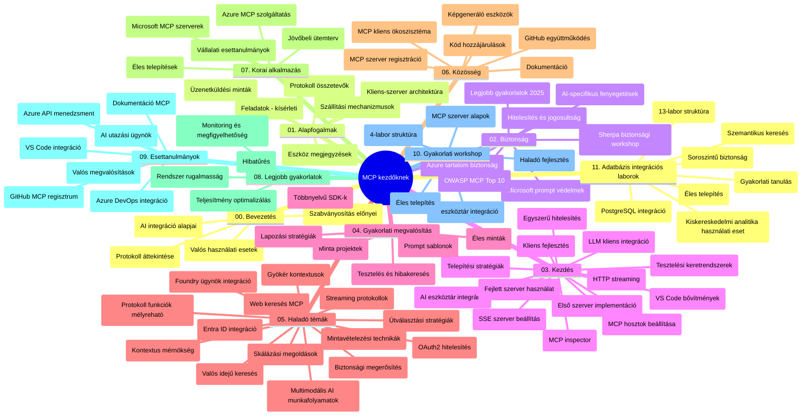

# Model Context Protocol (MCP) kezdőknek – Tanulmányi útmutató

Ez a tanulmányi útmutató áttekintést nyújt a „Model Context Protocol (MCP) kezdőknek” tananyag tárházának felépítéséről és tartalmáról. Használd ezt az útmutatót a tárház hatékony navigálásához, és hogy a legtöbbet hozd ki a rendelkezésre álló erőforrásokból.

## Tárház áttekintése

A Model Context Protocol (MCP) egy szabványosított keretrendszer az AI modellek és kliensalkalmazások közötti interakciókhoz. Eredetileg az Anthropic hozta létre, az MCP most a tágabb MCP közösség fenntartásában van az hivatalos GitHub szervezeten keresztül. Ez a tárház átfogó tananyagot kínál gyakorlati kód példákkal C#, Java, JavaScript, Python és TypeScript nyelveken, AI fejlesztők, rendszertervezők és szoftvermérnökök számára.

## Vizualizált tananyag térkép

## Tárház felépítése

A tárház tizenegy fő szekcióra van tagolva, melyek mindegyike az MCP különböző aspektusaival foglalkozik:

1. **Bevezetés (00-Introduction/)**
   - A Model Context Protocol áttekintése
   - Miért fontos a szabványosítás az AI folyamatokban
   - Gyakorlati felhasználási esetek és előnyök

2. **Alapfogalmak (01-CoreConcepts/)**
   - Kliens-szerver architektúra
   - A protokoll kulcsfontosságú elemei
   - Üzenetküldési minták az MCP-ben

3. **Biztonság (02-Security/)**
   - Biztonsági fenyegetések az MCP-alapú rendszerekben
   - Legjobb gyakorlatok a biztonságos megvalósításért
   - Hitelesítési és jogosultságszabályozási stratégiák
   - **Átfogó biztonsági dokumentáció**:
     - MCP Security Best Practices 2025
     - Azure Content Safety Implementációs útmutató
     - MCP Biztonsági vezérlők és technikák
     - MCP Best Practices Gyorsreferencia
   - **Fő biztonsági témák**:
     - Prompt injekció és eszközmérgező támadások
     - Munkamenet eltérítés és összezavarodott megbízott problémák
     - Token továbbítási sebezhetőségek
     - Túlságosan bő jogosultságok és hozzáférés-ellenőrzés
     - Ellátási lánc biztonsága AI komponensek esetén
     - Microsoft Prompt Shields integráció

4. **Első lépések (03-GettingStarted/)**
   - Környezet beállítása és konfigurációja
   - Alap MCP szerverek és kliensek létrehozása
   - Integráció meglévő alkalmazásokkal
   - Szekciók:
     - Első szerver megvalósítás
     - Kliensfejlesztés
     - LLM kliens integráció
     - VS Code integráció
     - Server-Sent Events (SSE) szerver
     - Fejlett szerverhasználat
     - HTTP streaming
     - AI Toolkit integráció
     - Tesztelési stratégiák
     - Telepítési útmutatók

5. **Gyakorlati megvalósítás (04-PracticalImplementation/)**
   - SDK-k használata különböző nyelveken
   - Hibakeresési, tesztelési és ellenőrzési technikák
   - Újrahasznosítható prompt sablonok és munkafolyamatok készítése
   - Példaprojektek megvalósítási példákkal

6. **Haladó témák (05-AdvancedTopics/)**
   - Kontextus-mérnökségi technikák
   - Foundry agent integráció
   - Többmodalitású AI munkafolyamatok
   - OAuth2 hitelesítési demók
   - Valós idejű keresés
   - Valós idejű streaming
   - Root context-ek megvalósítása
   - Útvonaltervezési stratégiák
   - Mintavételezési módszerek
   - Skálázási megközelítések
   - Biztonsági megfontolások
   - Entra ID biztonsági integráció
   - Webes keresés integrációja

7. **Közösségi hozzájárulások (06-CommunityContributions/)**
   - Hogyan járuljunk hozzá kóddal és dokumentációval
   - Együttműködés GitHubon keresztül
   - Közösségi fejlesztések és visszajelzések
   - Többféle MCP kliens használata (Claude Desktop, Cline, VSCode)
   - Népszerű MCP szerverek használata, beleértve képgenerálást

8. **Korai alkalmazási tapasztalatok (07-LessonsfromEarlyAdoption/)**
   - Valós megvalósítások és sikertörténetek
   - MCP alapú megoldások építése és bevezetése
   - Trendek és jövőbeli útiterv
   - **Microsoft MCP szerverek útmutatója**: Átfogó útmutató 10 termeléskész Microsoft MCP szerverhez, köztük:
     - Microsoft Learn Docs MCP szerver
     - Azure MCP szerver (15+ speciális csatlakozó)
     - GitHub MCP szerver
     - Azure DevOps MCP szerver
     - MarkItDown MCP szerver
     - SQL Server MCP szerver
     - Playwright MCP szerver
     - Dev Box MCP szerver
     - Azure AI Foundry MCP szerver
     - Microsoft 365 Agents Toolkit MCP szerver

9. **Legjobb gyakorlatok (08-BestPractices/)**
   - Teljesítményhangolás és optimalizálás
   - Hibabiztos MCP rendszerek tervezése
   - Tesztelési és ellenállóképességi stratégiák

10. **Esettanulmányok (09-CaseStudy/)**
    - **Hét átfogó esettanulmány** az MCP sokoldalúságának bemutatására különböző helyzetekben:
    - **Azure AI Travel Agents**: Többügynökös összehangolás Azure OpenAI és AI Search segítségével
    - **Azure DevOps integráció**: Munkafolyamat automatizálás YouTube adatfrissítésekkel
    - **Valós idejű dokumentum lekérés**: Python konzol kliens, HTTP streaming támogatással
    - **Interaktív tanulmányi terv generátor**: Chainlit webalkalmazás konverzációs AI-val
    - **Szerkesztőbeli dokumentáció**: VS Code integráció GitHub Copilot munkafolyamatokkal
    - **Azure API menedzsment**: Vállalati API integráció MCP szerver létrehozásával
    - **GitHub MCP Registry**: Ökoszisztéma fejlesztés és agentikus integrációs platform
    - Megvalósítási példák vállalati integrációra, fejlesztői produktivitásra és ökoszisztéma fejlesztésre

11. **Gyakorlati workshop (10-StreamliningAIWorkflowsBuildingAnMCPServerWithAIToolkit/)**
    - Átfogó, gyakorlati workshop az MCP és AI Toolkit együttes használatával
    - Intelligens alkalmazások építése, amelyek hidat képeznek AI modellek és valós eszközök között
    - Gyakorlati modulok az alapoktól a testreszabott szerverfejlesztésig és éles telepítésig
    - **Labor felépítés**:
      - Labor 1: MCP szerver alapok
      - Labor 2: Haladó MCP szerver fejlesztés
      - Labor 3: AI Toolkit integráció
      - Labor 4: Termelési telepítés és skálázás
    - Labor-alapú tanulási megközelítés lépésről lépésre

12. **MCP szerver adatbázis integrációs laborok (11-MCPServerHandsOnLabs/)**
    - **Átfogó 13 laborból álló tanulási útvonal** termeléskész MCP szerverek építéséhez PostgreSQL integrációval
    - **Valós kiskereskedelmi analitika megvalósítás** a Zava Retail használati esettel
    - **Vállalati szintű minták**, köztük Row Level Security (RLS), szemantikus keresés és több bérlős adathozzáférés
    - **Teljes labor felépítés**:
      - **Laborok 00-03: Alapok** - Bevezetés, architektúra, biztonság, környezet beállítás
      - **Laborok 04-06: MCP szerver építése** - Adatbázis tervezés, MCP szerver megvalósítás, eszközfejlesztés
      - **Laborok 07-09: Haladó funkciók** - Szemantikus keresés, tesztelés & hibakeresés, VS Code integráció
      - **Laborok 10-12: Termelés & legjobb gyakorlatok** - Telepítés, monitorozás, optimalizálás
    - **Használt technológiák**: FastMCP keretrendszer, PostgreSQL, Azure OpenAI, Azure Container Apps, Application Insights
    - **Tanulási eredmények**: Termeléskész MCP szerverek, adatbázis integrációs minták, AI-alapú analitika, vállalati biztonság

## További források

A tárház további támogató anyagokat tartalmaz:

- **Képek mappa**: Ábrák és illusztrációk, melyek a tananyagban szerepelnek
- **Fordítások**: Többnyelvű támogatás automatikus dokumentáció fordításokkal
- **Hivatalos MCP források**:
  - [MCP Dokumentáció](https://modelcontextprotocol.io/)
  - [MCP Specifikáció](https://spec.modelcontextprotocol.io/)
  - [MCP GitHub Tárház](https://github.com/modelcontextprotocol)

## Hogyan használd ezt a tárházat

1. **Folyamatos tanulás**: Kövesd a fejezeteket sorrendben (00-tól 11-ig) a strukturált tanulási élményért.
2. **Nyelvspecifikus fókusz**: Ha egy adott programozási nyelv érdekel, nézd meg a minta könyvtárakat a preferált nyelvedhez megvalósításokért.
3. **Gyakorlati megvalósítás**: Kezdd az "Első lépések" részleggel a környezeted beállításához és az első MCP szerver és kliens létrehozásához.
4. **Haladó felfedezés**: Ha már jól érzed az alapokat, merülj el a haladó témákban tudásod bővítéséhez.
5. **Közösségi részvétel**: Csatlakozz az MCP közösséghez GitHub vitákon és Discord csatornákon expertjekkel és fejlesztőtársakkal való kapcsolathoz.

## MCP kliensek és eszközök

A tananyag többféle MCP klienset és eszközt lefed:

1. **Hivatalos kliensek**:
   - Visual Studio Code
   - MCP a Visual Studio Code-ban
   - Claude Desktop
   - Claude VSCode-ban
   - Claude API

2. **Közösségi kliensek**:
   - Cline (terminál alapú)
   - Cursor (kód szerkesztő)
   - ChatMCP
   - Windsurf

3. **MCP kezelő eszközök**:
   - MCP CLI
   - MCP Manager
   - MCP Linker
   - MCP Router

## Népszerű MCP szerverek

A tárház különféle MCP szervereket mutat be, többek között:

1. **Hivatalos Microsoft MCP szerverek**:
   - Microsoft Learn Docs MCP szerver
   - Azure MCP szerver (15+ speciális csatlakozó)
   - GitHub MCP szerver
   - Azure DevOps MCP szerver
   - MarkItDown MCP szerver
   - SQL Server MCP szerver
   - Playwright MCP szerver
   - Dev Box MCP szerver
   - Azure AI Foundry MCP szerver
   - Microsoft 365 Agents Toolkit MCP szerver

2. **Hivatalos referencia szerverek**:
   - Fájlrendszer
   - Fetch
   - Memória
   - Szekvenciális gondolkodás

3. **Képgenerálás**:
   - Azure OpenAI DALL-E 3
   - Stable Diffusion WebUI
   - Replicate

4. **Fejlesztői eszközök**:
   - Git MCP
   - Terminál vezérlés
   - Kód asszisztens

5. **Speciális szerverek**:
   - Salesforce
   - Microsoft Teams
   - Jira & Confluence

## Hozzájárulás

Ez a tárház szívesen fogad közösségi hozzájárulásokat. Lásd a Közösségi hozzájárulások részt, ahol útmutatást találsz az MCP ökoszisztémához való eredményes hozzájáruláshoz.

----

*Ez a tanulmányi útmutató utolsó frissítése 2026. február 5-én történt, tükrözve a legfrissebb MCP Specifikációt 2025-11-25-én, és a tárház ezen időpont szerinti áttekintését nyújtja. A tárház tartalma a későbbiekben is frissülhet.*

---

<!-- CO-OP TRANSLATOR DISCLAIMER START -->
**Felelősségkizárás**:  
Ez a dokumentum az AI fordító szolgáltatás, a [Co-op Translator](https://github.com/Azure/co-op-translator) segítségével készült. Bár a pontosságra törekszünk, kérjük, vegye figyelembe, hogy az automatikus fordítások hibákat vagy pontatlanságokat tartalmazhatnak. Az eredeti dokumentum anyanyelven készült változatát tekintse a hiteles forrásnak. Kritikus információk esetén professzionális emberi fordítást javasolunk. Nem vállalunk felelősséget a fordítás használatából eredő félreértésekért vagy hibás értelmezésekért.
<!-- CO-OP TRANSLATOR DISCLAIMER END -->