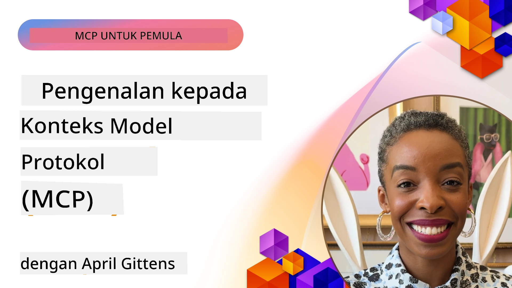
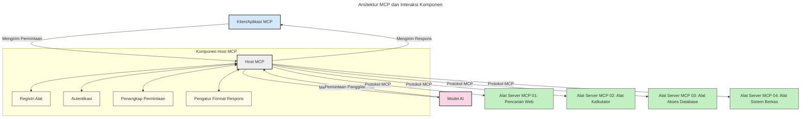

# Pengantar Model Context Protocol (MCP): Mengapa Ini Penting untuk Aplikasi AI yang Skalabel

[](https://youtu.be/agBbdiOPLQA)

_(Klik gambar di atas untuk menonton video pelajaran ini)_

Aplikasi AI generatif merupakan langkah maju yang hebat karena sering kali memungkinkan pengguna berinteraksi dengan aplikasi menggunakan prompt bahasa alami. Namun, seiring bertambahnya waktu dan sumber daya yang diinvestasikan dalam aplikasi tersebut, Anda ingin memastikan bahwa Anda dapat dengan mudah mengintegrasikan fungsionalitas dan sumber daya sedemikian rupa sehingga mudah diperluas, aplikasi Anda dapat melayani lebih dari satu model yang digunakan, dan menangani berbagai kerumitan model. Singkatnya, membangun aplikasi Gen AI mudah untuk memulai, tetapi saat mereka tumbuh dan menjadi lebih kompleks, Anda perlu mulai mendefinisikan arsitektur dan kemungkinan besar harus bergantung pada standar untuk memastikan aplikasi Anda dibangun dengan cara yang konsisten. Di sinilah MCP berperan untuk mengatur hal-hal dan menyediakan standar.

---

## **🔍 Apa Itu Model Context Protocol (MCP)?**

**Model Context Protocol (MCP)** adalah **antarmuka terbuka yang distandarisasi** yang memungkinkan Large Language Models (LLM) berinteraksi secara mulus dengan alat eksternal, API, dan sumber data. Ini menyediakan arsitektur yang konsisten untuk meningkatkan fungsionalitas model AI di luar data pelatihan mereka, memungkinkan sistem AI yang lebih cerdas, skalabel, dan responsif.

---

## **🎯 Mengapa Standarisasi dalam AI Penting**

Seiring aplikasi AI generatif menjadi lebih kompleks, penting untuk mengadopsi standar yang menjamin **skalabilitas, ekstensi, pemeliharaan,** dan **menghindari ketergantungan pada vendor tertentu**. MCP mengatasi kebutuhan ini dengan:

- Menyatukan integrasi model- alat
- Mengurangi solusi kustom yang rapuh dan satu kali pakai
- Memungkinkan beberapa model dari vendor berbeda untuk berdampingan dalam satu ekosistem

**Catatan:** Walaupun MCP mengklaim dirinya sebagai standar terbuka, tidak ada rencana untuk menstandarkan MCP melalui badan standar yang ada seperti IEEE, IETF, W3C, ISO, atau badan standar lainnya.

---

## **📚 Tujuan Pembelajaran**

Pada akhir artikel ini, Anda akan mampu:

- Mendefinisikan **Model Context Protocol (MCP)** dan kasus penggunaannya
- Memahami bagaimana MCP menstandarkan komunikasi model-ke-alat
- Mengidentifikasi komponen inti dari arsitektur MCP
- Menjelajahi aplikasi nyata MCP dalam konteks perusahaan dan pengembangan

---

## **💡 Mengapa Model Context Protocol (MCP) Merupakan Perubahan Besar**

### **🔗 MCP Mengatasi Fragmentasi dalam Interaksi AI**

Sebelum MCP, mengintegrasikan model dengan alat memerlukan:

- Kode kustom per pasangan alat-model
- API non-standar untuk setiap vendor
- Sering mengalami gangguan akibat pembaruan
- Skalabilitas yang buruk dengan semakin banyak alat

### **✅ Manfaat Standarisasi MCP**

| **Manfaat**              | **Deskripsi**                                                                |
|--------------------------|-------------------------------------------------------------------------------|
| Interoperabilitas        | LLM dapat bekerja mulus dengan alat dari berbagai vendor                     |
| Konsistensi              | Perilaku seragam di berbagai platform dan alat                               |
| Dapat Digunakan Kembali  | Alat yang dibuat sekali dapat digunakan di berbagai proyek dan sistem        |
| Percepatan Pengembangan  | Mengurangi waktu pengembangan dengan menggunakan antarmuka standar plug-and-play |

---

## **🧱 Gambaran Arsitektur MCP Tingkat Tinggi**

MCP mengikuti model **klien-server**, di mana:

- **MCP Hosts** menjalankan model AI
- **MCP Clients** memulai permintaan
- **MCP Servers** menyediakan konteks, alat, dan kapabilitas

### **Komponen Utama:**

- **Resources** – Data statis atau dinamis untuk model  
- **Prompts** – Alur kerja yang sudah ditentukan sebelumnya untuk generasi terpandu  
- **Tools** – Fungsi yang dapat dieksekusi seperti pencarian, perhitungan  
- **Sampling** – Perilaku agen melalui interaksi rekursif  
- **Elicitation** – Permintaan yang diinisiasi server untuk input pengguna  
- **Roots** – Batasan sistem file untuk kontrol akses server

### **Arsitektur Protokol:**

MCP menggunakan arsitektur dua lapis:  
- **Lapisan Data**: Komunikasi berbasis JSON-RPC 2.0 dengan manajemen siklus hidup dan primitif  
- **Lapisan Transportasi**: STDIO (lokal) dan HTTP Streamable dengan SSE (remote) sebagai saluran komunikasi

---

## Cara Kerja MCP Servers

Server MCP beroperasi dengan cara berikut:

- **Alur Permintaan**:
    1. Permintaan diajukan oleh pengguna akhir atau perangkat lunak yang bertindak atas nama mereka.
    2. **MCP Client** mengirimkan permintaan ke **MCP Host**, yang mengelola runtime Model AI.
    3. **Model AI** menerima prompt pengguna dan mungkin meminta akses ke alat atau data eksternal melalui satu atau lebih panggilan alat.
    4. **MCP Host**, bukan model secara langsung, berkomunikasi dengan **MCP Server(s)** yang sesuai menggunakan protokol standar.
- **Fungsi MCP Host**:
    - **Registri Alat**: Memelihara katalog alat yang tersedia dan kapabilitasnya.
    - **Otentikasi**: Memverifikasi izin untuk akses alat.
    - **Penangan Permintaan**: Memproses permintaan alat yang masuk dari model.
    - **Formatter Respon**: Menstrukturkan output alat dalam format yang dapat dipahami model.
- **Eksekusi MCP Server**:
    - **MCP Host** mengarahkan panggilan alat ke satu atau lebih **MCP Servers**, masing-masing menyediakan fungsi khusus (misalnya pencarian, perhitungan, kueri database).
    - **MCP Servers** menjalankan operasi masing-masing dan mengembalikan hasil kepada **MCP Host** dalam format konsisten.
    - **MCP Host** memformat dan menyampaikan hasil ini ke **Model AI**.
- **Penyelesaian Respon**:
    - **Model AI** menggabungkan output alat ke dalam respon akhir.
    - **MCP Host** mengirimkan respon ini kembali ke **MCP Client** yang menyerahkannya ke pengguna akhir atau perangkat lunak pemanggil.
    


## 👨‍💻 Cara Membangun MCP Server (Dengan Contoh)

Server MCP memungkinkan Anda memperluas kemampuan LLM dengan menyediakan data dan fungsionalitas.

Siap mencobanya? Berikut adalah SDK spesifik bahasa dan/atau stack dengan contoh pembuatan server MCP sederhana dalam berbagai bahasa/stack:

- **Python SDK**: https://github.com/modelcontextprotocol/python-sdk

- **TypeScript SDK**: https://github.com/modelcontextprotocol/typescript-sdk

- **Java SDK**: https://github.com/modelcontextprotocol/java-sdk

- **C#/.NET SDK**: https://github.com/modelcontextprotocol/csharp-sdk


## 🌍 Kasus Penggunaan Nyata untuk MCP

MCP memungkinkan beragam aplikasi dengan memperluas kemampuan AI:

| **Aplikasi**                | **Deskripsi**                                                                |
|-----------------------------|-------------------------------------------------------------------------------|
| Integrasi Data Perusahaan   | Menghubungkan LLM ke database, CRM, atau alat internal                        |
| Sistem AI Agenik            | Memungkinkan agen otonom dengan akses alat dan alur keputusan                 |
| Aplikasi Multi-modal        | Menggabungkan teks, gambar, dan alat audio dalam satu aplikasi AI terpadu    |
| Integrasi Data Real-time    | Membawa data hidup ke dalam interaksi AI untuk keluaran yang lebih akurat dan terkini |


### 🧠 MCP = Standar Universal untuk Interaksi AI

Model Context Protocol (MCP) berfungsi sebagai standar universal untuk interaksi AI, seperti bagaimana USB-C menstandarkan koneksi fisik untuk perangkat. Dalam dunia AI, MCP menyediakan antarmuka konsisten, memungkinkan model (klien) terintegrasi mulus dengan alat eksternal dan penyedia data (server). Ini menghilangkan kebutuhan akan protokol kustom yang beragam untuk setiap API atau sumber data.

Di bawah MCP, alat kompatibel MCP (disebut server MCP) mengikuti standar terpadu. Server ini dapat mencantumkan alat atau tindakan yang mereka tawarkan dan menjalankan tindakan tersebut saat diminta oleh agen AI. Platform agen AI yang mendukung MCP mampu menemukan alat yang tersedia dari server dan memanggilnya lewat protokol standar ini.

### 💡 Memudahkan akses ke pengetahuan

Selain menawarkan alat, MCP juga memfasilitasi akses ke pengetahuan. Ini memungkinkan aplikasi menyediakan konteks ke large language models (LLM) dengan menghubungkan mereka ke berbagai sumber data. Misalnya, server MCP dapat merepresentasikan repositori dokumen perusahaan, memungkinkan agen mengambil informasi relevan sesuai permintaan. Server lain dapat menangani tindakan spesifik seperti mengirim email atau memperbarui catatan. Dari perspektif agen, ini hanyalah alat yang dapat digunakannya — beberapa alat mengembalikan data (konteks pengetahuan), sementara yang lain melakukan tindakan. MCP secara efisien mengelola keduanya.

Agen yang terhubung ke server MCP otomatis belajar kapabilitas dan data yang dapat diakses server tersebut melalui format standar. Standarisasi ini memungkinkan ketersediaan alat secara dinamis. Misalnya, menambahkan server MCP baru ke sistem agen membuat fungsinya langsung dapat digunakan tanpa perlu kustomisasi lebih lanjut terhadap instruksi agen.

Integrasi ramping ini sejalan dengan alur yang tergambarkan dalam diagram berikut, di mana server menyediakan alat dan pengetahuan, memastikan kolaborasi mulus antar sistem.

### 👉 Contoh: Solusi Agen yang Skalabel

```mermaid
---
title: Solusi Agen Skalabel dengan MCP
description: Diagram yang menggambarkan bagaimana pengguna berinteraksi dengan LLM yang terhubung ke beberapa server MCP, dengan setiap server menyediakan pengetahuan dan alat, menciptakan arsitektur sistem AI yang skalabel
---
graph TD
    User -->|Prompt| LLM
    LLM -->|Response| User
    LLM -->|MCP| ServerA
    LLM -->|MCP| ServerB
    ServerA -->|Penghubung universal| ServerB
    ServerA --> KnowledgeA
    ServerA --> ToolsA
    ServerB --> KnowledgeB
    ServerB --> ToolsB

    subgraph Server A
        KnowledgeA[Pengetahuan]
        ToolsA[Alat]
    end

    subgraph Server B
        KnowledgeB[Pengetahuan]
        ToolsB[Alat]
    end
```Universal Connector memungkinkan server MCP berkomunikasi dan berbagi kapabilitas satu sama lain, memungkinkan ServerA mendelegasikan tugas ke ServerB atau mengakses alat dan pengetahuannya. Ini memfederasikan alat dan data antar server, mendukung arsitektur agen yang skalabel dan modular. Karena MCP menstandarkan eksposur alat, agen bisa menemukan dan mengarahkan permintaan antar server secara dinamis tanpa integrasi yang dikodekan keras.


Federasi alat dan pengetahuan: Alat dan data dapat diakses antar server, memungkinkan arsitektur agen yang lebih skalabel dan modular.

### 🔄 Skenario MCP Lanjutan dengan Integrasi LLM Sisi Klien

Selain arsitektur MCP dasar, terdapat skenario lanjutan di mana klien dan server sama-sama memiliki LLM, memungkinkan interaksi yang lebih canggih. Dalam diagram berikut, **Client App** bisa berupa IDE dengan sejumlah alat MCP yang tersedia untuk digunakan oleh LLM:

```mermaid
---
title: Skenario MCP Tingkat Lanjut dengan Integrasi LLM Klien-Server
description: Diagram urutan yang menunjukkan alur interaksi rinci antara pengguna, aplikasi klien, LLM klien, beberapa server MCP, dan LLM server, menggambarkan penemuan alat, interaksi pengguna, pemanggilan alat langsung, dan fase negosiasi fitur
---
sequenceDiagram
    autonumber
    actor User as 👤 Pengguna
    participant ClientApp as 🖥️ Aplikasi Klien
    participant ClientLLM as 🧠 LLM Klien
    participant Server1 as 🔧 Server MCP 1
    participant Server2 as 📚 Server MCP 2
    participant ServerLLM as 🤖 LLM Server
    
    %% Discovery Phase
    rect rgb(220, 240, 255)
        Note over ClientApp, Server2: FASE PENEMUAN ALAT
        ClientApp->>+Server1: Meminta alat/sumber daya yang tersedia
        Server1-->>-ClientApp: Mengembalikan daftar alat (JSON)
        ClientApp->>+Server2: Meminta alat/sumber daya yang tersedia
        Server2-->>-ClientApp: Mengembalikan daftar alat (JSON)
        Note right of ClientApp: Simpan katalog alat<br/>gabungan secara lokal
    end
    
    %% User Interaction
    rect rgb(255, 240, 220)
        Note over User, ClientLLM: FASE INTERAKSI PENGGUNA
        User->>+ClientApp: Memasukkan prompt bahasa alami
        ClientApp->>+ClientLLM: Meneruskan prompt + katalog alat
        ClientLLM->>-ClientLLM: Menganalisa prompt & memilih alat
    end
    
    %% Scenario A: Direct Tool Calling
    alt Pemanggilan Alat Langsung
        rect rgb(220, 255, 220)
            Note over ClientApp, Server1: SKENARIO A: PEMANGGILAN ALAT LANGSUNG
            ClientLLM->>+ClientApp: Meminta eksekusi alat
            ClientApp->>+Server1: Mengeksekusi alat spesifik
            Server1-->>-ClientApp: Mengembalikan hasil
            ClientApp->>+ClientLLM: Memproses hasil
            ClientLLM-->>-ClientApp: Menghasilkan respons
            ClientApp-->>-User: Menampilkan jawaban akhir
        end
    
    %% Scenario B: Feature Negotiation (VS Code style)
    else Negosiasi Fitur (gaya VS Code)
        rect rgb(255, 220, 220)
            Note over ClientApp, ServerLLM: SKENARIO B: NEGOSIASI FITUR
            ClientLLM->>+ClientApp: Mengidentifikasi kemampuan yang dibutuhkan
            ClientApp->>+Server2: Menegosiasikan fitur/kapabilitas
            Server2->>+ServerLLM: Meminta konteks tambahan
            ServerLLM-->>-Server2: Memberikan konteks
            Server2-->>-ClientApp: Mengembalikan fitur yang tersedia
            ClientApp->>+Server2: Memanggil alat yang dinegosiasikan
            Server2-->>-ClientApp: Mengembalikan hasil
            ClientApp->>+ClientLLM: Memproses hasil
            ClientLLM-->>-ClientApp: Menghasilkan respons
            ClientApp-->>-User: Menampilkan jawaban akhir
        end
    end
```
## 🔐 Manfaat Praktis MCP

Berikut adalah manfaat praktis menggunakan MCP:

- **Keterkinian**: Model dapat mengakses informasi terkini di luar data latihannya  
- **Perluasan Kapabilitas**: Model dapat memanfaatkan alat khusus untuk tugas yang tidak dilatihnya  
- **Pengurangan Halusinasi**: Sumber data eksternal memberikan dasar faktual  
- **Privasi**: Data sensitif dapat tetap dalam lingkungan aman tanpa dimasukkan dalam prompt

## 📌 Poin Penting

Berikut adalah poin penting dalam menggunakan MCP:

- **MCP** menstandarkan cara model AI berinteraksi dengan alat dan data  
- Mendukung **ekstensibilitas, konsistensi, dan interoperabilitas**  
- MCP membantu **mengurangi waktu pengembangan, meningkatkan keandalan, dan memperluas kapabilitas model**  
- Arsitektur klien-server **memungkinkan aplikasi AI yang fleksibel dan dapat diperluas**

## 🧠 Latihan

Pikirkan tentang aplikasi AI yang ingin Anda bangun.

- Alat atau data **eksternal mana** yang dapat meningkatkan kemampuannya?  
- Bagaimana MCP dapat membuat integrasi menjadi **lebih sederhana dan andal**?  

## Sumber Daya Tambahan

- [Repositori MCP GitHub](https://github.com/modelcontextprotocol)


## Selanjutnya

Selanjutnya: [Bab 1: Konsep Inti](../01-CoreConcepts/README.md)

---

<!-- CO-OP TRANSLATOR DISCLAIMER START -->
**Penafian**:  
Dokumen ini telah diterjemahkan menggunakan layanan terjemahan AI [Co-op Translator](https://github.com/Azure/co-op-translator). Meskipun kami berupaya mencapai akurasi, harap diingat bahwa terjemahan otomatis mungkin mengandung kesalahan atau ketidakakuratan. Dokumen asli dalam bahasa aslinya harus dianggap sebagai sumber yang sahih. Untuk informasi penting, disarankan menggunakan jasa penerjemah manusia profesional. Kami tidak bertanggung jawab atas kesalahpahaman atau kesalahan interpretasi yang timbul dari penggunaan terjemahan ini.
<!-- CO-OP TRANSLATOR DISCLAIMER END -->