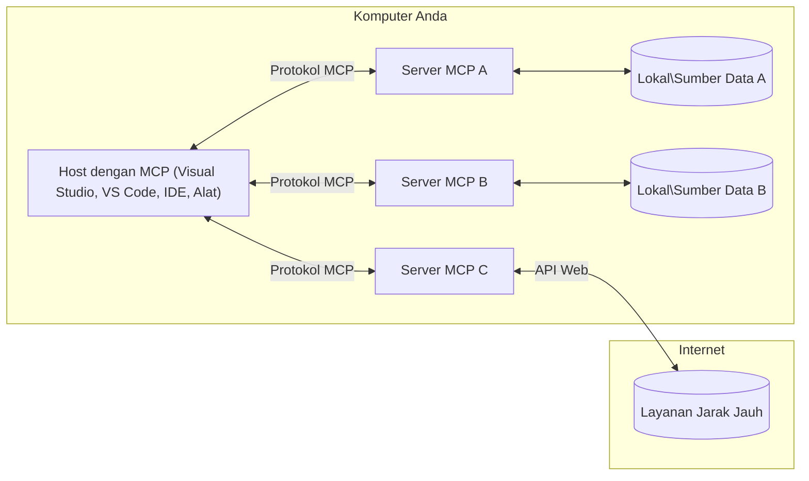

# Konsep Inti MCP: Menguasai Model Context Protocol untuk Integrasi AI

[](https://youtu.be/earDzWGtE84)

_(Klik gambar di atas untuk melihat video pelajaran ini)_

[Model Context Protocol (MCP)](https://github.com/modelcontextprotocol) adalah kerangka standar yang kuat yang mengoptimalkan komunikasi antara Large Language Models (LLM) dan alat, aplikasi, serta sumber data eksternal.  
Panduan ini akan membimbing Anda melalui konsep inti MCP. Anda akan belajar tentang arsitektur klien-server, komponen penting, mekanisme komunikasi, dan praktik terbaik implementasi.

- **Persetujuan Pengguna Eksplisit**: Semua akses data dan operasi memerlukan persetujuan eksplisit dari pengguna sebelum pelaksanaan. Pengguna harus jelas memahami data apa yang akan diakses dan tindakan apa yang akan dilakukan, dengan kontrol granular atas izin dan otorisasi.

- **Perlindungan Privasi Data**: Data pengguna hanya dibuka dengan persetujuan eksplisit dan harus dilindungi dengan kontrol akses yang kuat sepanjang siklus interaksi. Implementasi harus mencegah transmisi data yang tidak sah dan menjaga batas privasi yang ketat.

- **Keamanan Eksekusi Alat**: Setiap pemanggilan alat memerlukan persetujuan eksplisit pengguna dengan pemahaman jelas tentang fungsi alat, parameter, dan dampak potensialnya. Batas keamanan yang kuat harus mencegah eksekusi alat yang tidak diinginkan, tidak aman, atau berbahaya.

- **Keamanan Lapisan Transport**: Semua saluran komunikasi harus menggunakan mekanisme enkripsi dan otentikasi yang sesuai. Koneksi jarak jauh harus menerapkan protokol transportasi aman dan manajemen kredensial yang tepat.

#### Pedoman Implementasi:

- **Manajemen Izin**: Terapkan sistem izin yang sangat rinci yang memungkinkan pengguna mengontrol server, alat, dan sumber daya mana yang dapat diakses  
- **Otentikasi & Otorisasi**: Gunakan metode otentikasi yang aman (OAuth, kunci API) dengan manajemen token dan kadaluarsa yang tepat  
- **Validasi Input**: Validasi semua parameter dan input data sesuai skema yang ditentukan untuk mencegah serangan injeksi  
- **Audit Logging**: Pertahankan log komprehensif dari semua operasi untuk pemantauan keamanan dan kepatuhan  

## Ikhtisar

Pelajaran ini mengeksplorasi arsitektur dan komponen dasar yang membentuk ekosistem Model Context Protocol (MCP). Anda akan belajar tentang arsitektur klien-server, komponen utama, dan mekanisme komunikasi yang mendukung interaksi MCP.

## Tujuan Pembelajaran Utama

Pada akhir pelajaran ini, Anda akan:

- Memahami arsitektur klien-server MCP.  
- Mengidentifikasi peran dan tanggung jawab Host, Klien, dan Server.  
- Menganalisis fitur inti yang membuat MCP menjadi lapisan integrasi yang fleksibel.  
- Memahami aliran informasi dalam ekosistem MCP.  
- Mendapatkan wawasan praktis melalui contoh kode di .NET, Java, Python, dan JavaScript.

## Arsitektur MCP: Pandangan Lebih Dalam

Ekosistem MCP dibangun di atas model klien-server. Struktur modular ini memungkinkan aplikasi AI berinteraksi dengan alat, basis data, API, dan sumber daya kontekstual secara efisien. Mari kita urai arsitektur ini ke dalam komponen inti.

Pada intinya, MCP mengikuti arsitektur klien-server di mana sebuah aplikasi host dapat terhubung ke banyak server:


- **Host MCP**: Program seperti VSCode, Claude Desktop, IDE, atau alat AI yang ingin mengakses data melalui MCP  
- **Klien MCP**: Klien protokol yang mempertahankan koneksi 1:1 dengan server  
- **Server MCP**: Program ringan yang masing-masing mengekspos kemampuan tertentu melalui Model Context Protocol standar  
- **Sumber Data Lokal**: File, basis data, dan layanan komputer Anda yang dapat diakses secara aman oleh server MCP  
- **Layanan Remote**: Sistem eksternal yang tersedia melalui internet yang dapat dihubungi server MCP lewat API.  

Protokol MCP adalah standar yang terus berkembang menggunakan versi berdasarkan tanggal (format YYYY-MM-DD). Versi protokol saat ini adalah **2025-11-25**. Anda dapat melihat pembaruan terbaru pada [spesifikasi protokol](https://modelcontextprotocol.io/specification/2025-11-25/)

### 1. Host

Dalam Model Context Protocol (MCP), **Host** adalah aplikasi AI yang berfungsi sebagai antarmuka utama melalui mana pengguna berinteraksi dengan protokol. Host mengkoordinasikan dan mengelola koneksi ke banyak server MCP dengan membuat klien MCP khusus untuk setiap koneksi server. Contoh Host meliputi:

- **Aplikasi AI**: Claude Desktop, Visual Studio Code, Claude Code  
- **Lingkungan Pengembangan**: IDE dan editor kode dengan integrasi MCP  
- **Aplikasi Kustom**: Agen dan alat AI buatan khusus  

**Host** adalah aplikasi yang mengoordinasikan interaksi model AI. Mereka:

- **Mengorkestrasi Model AI**: Menjalankan atau berinteraksi dengan LLM untuk menghasilkan respons dan mengoordinasikan alur kerja AI  
- **Mengelola Koneksi Klien**: Membuat dan memelihara satu klien MCP per koneksi server MCP  
- **Mengontrol Antarmuka Pengguna**: Menangani alur percakapan, interaksi pengguna, dan penyajian respons  
- **Menegakkan Keamanan**: Mengatur izin, batas keamanan, dan otentikasi  
- **Menangani Persetujuan Pengguna**: Mengelola persetujuan pengguna untuk berbagi data dan eksekusi alat  

### 2. Klien

**Klien** adalah komponen penting yang mempertahankan koneksi satu-satu khusus antara Host dan server MCP. Setiap klien MCP dibuat oleh Host untuk terhubung ke server MCP tertentu, memastikan saluran komunikasi yang terorganisir dan aman. Banyak klien memungkinkan Host terhubung ke banyak server sekaligus.

**Klien** adalah komponen penghubung dalam aplikasi host. Mereka:

- **Komunikasi Protokol**: Mengirim permintaan JSON-RPC 2.0 ke server dengan prompt dan instruksi  
- **Negosiasi Kemampuan**: Menegosiasikan fitur dan versi protokol yang didukung dengan server saat inisialisasi  
- **Eksekusi Alat**: Mengelola permintaan eksekusi alat dari model dan memproses respons  
- **Pembaharuan Waktu Nyata**: Menangani notifikasi dan pembaruan waktu nyata dari server  
- **Pemrosesan Respons**: Memproses dan memformat respons server untuk ditampilkan ke pengguna  

### 3. Server

**Server** adalah program yang menyediakan konteks, alat, dan kemampuan kepada klien MCP. Mereka dapat dijalankan secara lokal (di mesin yang sama dengan Host) atau jarak jauh (di platform eksternal), dan bertanggung jawab menangani permintaan klien serta memberikan respons terstruktur. Server mengekspos fungsi tertentu melalui Model Context Protocol standar.

**Server** adalah layanan yang menyediakan konteks dan kemampuan. Mereka:

- **Registrasi Fitur**: Mendaftarkan dan mengekspos primitif yang tersedia (sumber daya, prompt, alat) kepada klien  
- **Pemrosesan Permintaan**: Menerima dan menjalankan panggilan alat, permintaan sumber daya, dan permintaan prompt dari klien  
- **Penyediaan Konteks**: Menyediakan informasi kontekstual dan data untuk meningkatkan respons model  
- **Pengelolaan Status**: Memelihara status sesi dan menangani interaksi berstatus bila diperlukan  
- **Notifikasi Waktu Nyata**: Mengirim notifikasi perubahan kemampuan dan pembaruan ke klien yang terhubung  

Server dapat dikembangkan oleh siapa saja untuk memperluas kemampuan model dengan fungsi khusus, dan mereka mendukung skenario penerapan lokal maupun jarak jauh.

### 4. Primitif Server

Server dalam Model Context Protocol (MCP) menyediakan tiga **primitif** inti yang mendefinisikan blok bangunan dasar untuk interaksi kaya antara klien, host, dan model bahasa. Primitif ini menentukan jenis informasi kontekstual dan aksi yang tersedia melalui protokol.

Server MCP dapat mengekspos kombinasi dari tiga primitif inti berikut:

#### Sumber Daya

**Sumber Daya** adalah sumber data yang menyediakan informasi kontekstual ke aplikasi AI. Mereka mewakili konten statis atau dinamis yang dapat meningkatkan pemahaman model dan pengambilan keputusan:

- **Data Kontekstual**: Informasi terstruktur dan konteks untuk konsumsi model AI  
- **Basis Pengetahuan**: Repositori dokumen, artikel, manual, dan makalah penelitian  
- **Sumber Data Lokal**: File, basis data, dan informasi sistem lokal  
- **Data Eksternal**: Respons API, layanan web, dan data sistem jarak jauh  
- **Konten Dinamis**: Data waktu nyata yang diperbarui berdasarkan kondisi eksternal  

Sumber daya diidentifikasi dengan URI dan mendukung penemuan melalui metode `resources/list` dan pengambilan melalui `resources/read`:

```text
file://documents/project-spec.md
database://production/users/schema
api://weather/current
```

#### Prompt

**Prompt** adalah template yang dapat digunakan ulang yang membantu menyusun interaksi dengan model bahasa. Mereka menyediakan pola interaksi standar dan alur kerja templatis:

- **Interaksi Berbasis Template**: Pesan terstruktur dan pembuka percakapan yang sudah dipersiapkan  
- **Template Alur Kerja**: Urutan standar untuk tugas dan interaksi umum  
- **Contoh Few-shot**: Template berbasis contoh untuk instruksi model  
- **Prompt Sistem**: Prompt dasar yang mendefinisikan perilaku dan konteks model  
- **Template Dinamis**: Prompt yang diparameterisasi yang beradaptasi dengan konteks spesifik  

Prompt mendukung substitusi variabel dan dapat ditemukan lewat `prompts/list` serta diambil dengan `prompts/get`:

```markdown
Generate a {{task_type}} for {{product}} targeting {{audience}} with the following requirements: {{requirements}}
```

#### Alat

**Alat** adalah fungsi yang dapat dieksekusi yang dapat dipanggil oleh model AI untuk melakukan tindakan tertentu. Mereka mewakili "kata kerja" dalam ekosistem MCP, memungkinkan model berinteraksi dengan sistem eksternal:

- **Fungsi Eksekusi**: Operasi diskrit yang dapat dipanggil model dengan parameter tertentu  
- **Integrasi Sistem Eksternal**: Panggilan API, kueri basis data, operasi file, perhitungan  
- **Identitas Unik**: Setiap alat memiliki nama, deskripsi, dan skema parameter yang jelas  
- **I/O Terstruktur**: Alat menerima parameter yang tervalidasi dan mengembalikan respons terstruktur dan bertipe  
- **Kemampuan Aksi**: Memungkinkan model melakukan tindakan dunia nyata dan mengambil data langsung  

Alat didefinisikan dengan JSON Schema untuk validasi parameter dan ditemukan lewat `tools/list` serta dipanggil melalui `tools/call`. Alat juga dapat menyertakan **ikon** sebagai metadata tambahan untuk penyajian UI yang lebih baik.

**Anotasi Alat**: Alat mendukung anotasi perilaku (misalnya, `readOnlyHint`, `destructiveHint`) yang menjelaskan apakah alat hanya baca atau destruktif, membantu klien membuat keputusan yang tepat tentang eksekusi alat.

Contoh definisi alat:

```typescript
server.tool(
  "search_products", 
  {
    query: z.string().describe("Search query for products"),
    category: z.string().optional().describe("Product category filter"),
    max_results: z.number().default(10).describe("Maximum results to return")
  }, 
  async (params) => {
    // Jalankan pencarian dan kembalikan hasil yang terstruktur
    return await productService.search(params);
  }
);
```

## Primitif Klien

Dalam Model Context Protocol (MCP), **klien** dapat mengekspos primitif yang memungkinkan server meminta kemampuan tambahan dari aplikasi host. Primitif sisi klien ini memungkinkan implementasi server yang lebih kaya dan interaktif yang dapat mengakses kemampuan model AI dan interaksi pengguna.

### Sampling

**Sampling** memungkinkan server meminta kelengkapan model bahasa dari aplikasi AI klien. Primitif ini memungkinkan server mengakses kemampuan LLM tanpa menyertakan dependensi model mereka sendiri:

- **Akses Independen Model**: Server dapat meminta kelengkapan tanpa menyertakan SDK LLM atau mengelola akses model  
- **AI yang Dinisiasi Server**: Memungkinkan server secara otonom menghasilkan konten menggunakan model AI klien  
- **Interaksi LLM Rekursif**: Mendukung skenario kompleks di mana server memerlukan bantuan AI untuk pemrosesan  
- **Pembuatan Konten Dinamis**: Memungkinkan server membuat respons kontekstual menggunakan model host  
- **Dukungan Panggilan Alat**: Server dapat menyertakan parameter `tools` dan `toolChoice` untuk mengaktifkan model klien memanggil alat selama sampling  

Sampling dimulai melalui metode `sampling/complete`, di mana server mengirim permintaan kelengkapan ke klien.

### Roots

**Roots** menyediakan cara standar bagi klien untuk mengekspos batas sistem file ke server, membantu server memahami direktori dan file mana yang dapat diakses:

- **Batas Sistem File**: Mendefinisikan batasan di mana server dapat beroperasi dalam sistem file  
- **Kontrol Akses**: Membantu server memahami direktori dan file mana yang memiliki izin akses  
- **Pembaharuan Dinamis**: Klien dapat memberi tahu server ketika daftar roots berubah  
- **Identifikasi Berbasis URI**: Roots menggunakan URI `file://` untuk mengidentifikasi direktori dan file yang dapat diakses  

Roots ditemukan melalui metode `roots/list`, dengan klien mengirim `notifications/roots/list_changed` ketika roots berubah.

### Elicitation

**Elicitation** memungkinkan server meminta informasi tambahan atau konfirmasi dari pengguna melalui antarmuka klien:

- **Permintaan Input Pengguna**: Server dapat meminta informasi tambahan saat diperlukan untuk eksekusi alat  
- **Dialog Konfirmasi**: Meminta persetujuan pengguna untuk operasi sensitif atau berdampak  
- **Alur Kerja Interaktif**: Memungkinkan server membuat interaksi pengguna langkah demi langkah  
- **Pengumpulan Parameter Dinamis**: Mengumpulkan parameter yang hilang atau opsional selama eksekusi alat  

Permintaan elicitation dilakukan menggunakan metode `elicitation/request` untuk mengumpulkan input pengguna melalui antarmuka klien.

**Elicitation Mode URL**: Server juga dapat meminta interaksi pengguna berbasis URL, memungkinkan server mengarahkan pengguna ke halaman web eksternal untuk otentikasi, konfirmasi, atau pengisian data.

### Logging

**Logging** memungkinkan server mengirim pesan log terstruktur kepada klien untuk debugging, pemantauan, dan visibilitas operasional:

- **Dukungan Debugging**: Memungkinkan server menyediakan log eksekusi detail untuk pemecahan masalah  
- **Pemantauan Operasional**: Mengirim pembaruan status dan metrik performa ke klien  
- **Pelaporan Kesalahan**: Menyediakan konteks kesalahan dan informasi diagnostik terperinci  
- **Audit Trail**: Membuat log komprehensif dari operasi dan keputusan server  

Pesan log dikirim ke klien untuk memberikan transparansi dalam operasi server dan memfasilitasi debugging.

## Aliran Informasi dalam MCP

Model Context Protocol (MCP) mendefinisikan aliran informasi terstruktur antara host, klien, server, dan model. Memahami aliran ini membantu memperjelas bagaimana permintaan pengguna diproses dan bagaimana alat eksternal serta data diintegrasikan ke dalam respons model.

- **Host Memulai Koneksi**  
  Aplikasi host (seperti IDE atau antarmuka chat) membangun koneksi ke server MCP, biasanya melalui STDIO, WebSocket, atau transportasi lain yang didukung.

- **Negosiasi Kemampuan**  
  Klien (tertanam di host) dan server bertukar informasi tentang fitur, alat, sumber daya, dan versi protokol yang didukung. Ini memastikan kedua pihak memahami kemampuan yang tersedia untuk sesi.

- **Permintaan Pengguna**  
  Pengguna berinteraksi dengan host (misalnya memasukkan prompt atau perintah). Host mengumpulkan input ini dan mengoper ke klien untuk diproses.

- **Penggunaan Sumber Daya atau Alat**  
  - Klien dapat meminta konteks tambahan atau sumber daya dari server (seperti file, entri basis data, atau artikel basis pengetahuan) untuk memperkaya pemahaman model.  
  - Jika model menentukan bahwa alat diperlukan (misalnya untuk mengambil data, melakukan perhitungan, atau memanggil API), klien mengirim permintaan panggilan alat ke server, menyebutkan nama alat dan parameter.

- **Eksekusi Server**  

Server menerima permintaan sumber daya atau alat, menjalankan operasi yang diperlukan (seperti menjalankan fungsi, kueri database, atau mengambil berkas), dan mengembalikan hasilnya ke klien dalam format terstruktur.

- **Pembuatan Respons**  
  Klien mengintegrasikan respons server (data sumber daya, keluaran alat, dll.) ke dalam interaksi model yang sedang berlangsung. Model menggunakan informasi ini untuk menghasilkan respons yang komprehensif dan relevan secara kontekstual.

- **Penyajian Hasil**  
  Host menerima keluaran akhir dari klien dan menyajikannya kepada pengguna, sering kali termasuk teks yang dihasilkan model dan hasil dari eksekusi alat atau pencarian sumber daya.

Alur ini memungkinkan MCP mendukung aplikasi AI yang canggih, interaktif, dan sadar konteks dengan menghubungkan model secara mulus dengan alat eksternal dan sumber data.

## Arsitektur & Lapisan Protokol

MCP terdiri dari dua lapisan arsitektur yang berbeda yang bekerja sama menyediakan kerangka komunikasi lengkap:

### Lapisan Data

**Lapisan Data** mengimplementasikan protokol inti MCP menggunakan **JSON-RPC 2.0** sebagai dasarnya. Lapisan ini mendefinisikan struktur pesan, semantik, dan pola interaksi:

#### Komponen Inti:

- **Protokol JSON-RPC 2.0**: Semua komunikasi menggunakan format pesan JSON-RPC 2.0 yang distandarisasi untuk panggilan metode, respons, dan notifikasi
- **Manajemen Siklus Hidup**: Menangani inisialisasi koneksi, negosiasi kemampuan, dan terminasi sesi antara klien dan server
- **Primitif Server**: Memungkinkan server menyediakan fungsi inti melalui alat, sumber daya, dan prompt
- **Primitif Klien**: Memungkinkan server meminta sampling dari LLM, memanggil input pengguna, dan mengirim pesan log
- **Notifikasi Real-time**: Mendukung notifikasi asinkron untuk pembaruan dinamis tanpa polling

#### Fitur Kunci:

- **Negosiasi Versi Protokol**: Menggunakan versi berbasis tanggal (YYYY-MM-DD) untuk memastikan kompatibilitas
- **Penemuan Kemampuan**: Klien dan server bertukar informasi fitur yang didukung saat inisialisasi
- **Sesi Stateful**: Memelihara status koneksi di berbagai interaksi untuk kontinuitas konteks

### Lapisan Transport

**Lapisan Transport** mengelola saluran komunikasi, pembingkaian pesan, dan autentikasi antara peserta MCP:

#### Mekanisme Transport yang Didukung:

1. **Transport STDIO**:
   - Menggunakan aliran input/output standar untuk komunikasi proses langsung
   - Optimal untuk proses lokal di mesin yang sama tanpa overhead jaringan
   - Umum digunakan untuk implementasi server MCP lokal

2. **Transport HTTP Streamable**:
   - Menggunakan HTTP POST untuk pesan klien-ke-server  
   - Opsional Server-Sent Events (SSE) untuk streaming server-ke-klien
   - Memungkinkan komunikasi server jarak jauh melalui jaringan
   - Mendukung autentikasi HTTP standar (token bearer, kunci API, header khusus)
   - MCP merekomendasikan OAuth untuk autentikasi berbasis token yang aman

#### Abstraksi Transport:

Lapisan transport mengabstraksi detail komunikasi dari lapisan data, memungkinkan format pesan JSON-RPC 2.0 yang sama digunakan di semua mekanisme transport. Abstraksi ini memungkinkan aplikasi untuk beralih antara server lokal dan jarak jauh dengan mulus.

### Pertimbangan Keamanan

Implementasi MCP harus mematuhi beberapa prinsip keamanan kritis untuk memastikan interaksi yang aman, terpercaya, dan terlindungi di seluruh operasi protokol:

- **Persetujuan dan Kontrol Pengguna**: Pengguna harus memberikan persetujuan eksplisit sebelum data diakses atau operasi dilakukan. Mereka harus memiliki kontrol jelas atas data yang dibagikan dan tindakan yang diizinkan, didukung oleh antarmuka pengguna yang intuitif untuk meninjau dan menyetujui aktivitas.

- **Privasi Data**: Data pengguna hanya boleh diekspos dengan persetujuan eksplisit dan harus dilindungi dengan kontrol akses yang tepat. Implementasi MCP harus menjaga agar data tidak dikirim tanpa izin dan menjamin privasi selama seluruh interaksi.

- **Keamanan Alat**: Sebelum memanggil alat apa pun, persetujuan eksplisit dari pengguna diperlukan. Pengguna harus memahami fungsi tiap alat dengan jelas, dan batasan keamanan yang ketat harus diterapkan untuk mencegah eksekusi alat yang tidak diinginkan atau tidak aman.

Dengan mengikuti prinsip keamanan ini, MCP menjamin kepercayaan pengguna, privasi, dan keselamatan terjaga di seluruh interaksi protokol sekaligus memungkinkan integrasi AI yang kuat.

## Contoh Kode: Komponen Utama

Berikut adalah contoh kode dalam beberapa bahasa pemrograman populer yang menggambarkan cara mengimplementasikan komponen server MCP utama dan alat.

### Contoh .NET: Membuat Server MCP Sederhana dengan Alat

Berikut contoh kode .NET praktis yang menunjukkan cara mengimplementasikan server MCP sederhana dengan alat kustom. Contoh ini menunjukkan cara mendefinisikan dan mendaftarkan alat, menangani permintaan, dan menghubungkan server menggunakan Model Context Protocol.

```csharp
using System;
using System.Threading.Tasks;
using ModelContextProtocol.Server;
using ModelContextProtocol.Server.Transport;
using ModelContextProtocol.Server.Tools;

public class WeatherServer
{
    public static async Task Main(string[] args)
    {
        // Create an MCP server
        var server = new McpServer(
            name: "Weather MCP Server",
            version: "1.0.0"
        );
        
        // Register our custom weather tool
        server.AddTool<string, WeatherData>("weatherTool", 
            description: "Gets current weather for a location",
            execute: async (location) => {
                // Call weather API (simplified)
                var weatherData = await GetWeatherDataAsync(location);
                return weatherData;
            });
        
        // Connect the server using stdio transport
        var transport = new StdioServerTransport();
        await server.ConnectAsync(transport);
        
        Console.WriteLine("Weather MCP Server started");
        
        // Keep the server running until process is terminated
        await Task.Delay(-1);
    }
    
    private static async Task<WeatherData> GetWeatherDataAsync(string location)
    {
        // This would normally call a weather API
        // Simplified for demonstration
        await Task.Delay(100); // Simulate API call
        return new WeatherData { 
            Temperature = 72.5,
            Conditions = "Sunny",
            Location = location
        };
    }
}

public class WeatherData
{
    public double Temperature { get; set; }
    public string Conditions { get; set; }
    public string Location { get; set; }
}
```

### Contoh Java: Komponen Server MCP

Contoh ini memperlihatkan server MCP dan pendaftaran alat yang sama seperti contoh .NET di atas, tetapi diimplementasikan dalam Java.

```java
import io.modelcontextprotocol.server.McpServer;
import io.modelcontextprotocol.server.McpToolDefinition;
import io.modelcontextprotocol.server.transport.StdioServerTransport;
import io.modelcontextprotocol.server.tool.ToolExecutionContext;
import io.modelcontextprotocol.server.tool.ToolResponse;

public class WeatherMcpServer {
    public static void main(String[] args) throws Exception {
        // Buat server MCP
        McpServer server = McpServer.builder()
            .name("Weather MCP Server")
            .version("1.0.0")
            .build();
            
        // Daftarkan alat cuaca
        server.registerTool(McpToolDefinition.builder("weatherTool")
            .description("Gets current weather for a location")
            .parameter("location", String.class)
            .execute((ToolExecutionContext ctx) -> {
                String location = ctx.getParameter("location", String.class);
                
                // Dapatkan data cuaca (disederhanakan)
                WeatherData data = getWeatherData(location);
                
                // Kembalikan respons yang diformat
                return ToolResponse.content(
                    String.format("Temperature: %.1f°F, Conditions: %s, Location: %s", 
                    data.getTemperature(), 
                    data.getConditions(), 
                    data.getLocation())
                );
            })
            .build());
        
        // Hubungkan server menggunakan transportasi stdio
        try (StdioServerTransport transport = new StdioServerTransport()) {
            server.connect(transport);
            System.out.println("Weather MCP Server started");
            // Pertahankan server berjalan sampai proses dihentikan
            Thread.currentThread().join();
        }
    }
    
    private static WeatherData getWeatherData(String location) {
        // Implementasi akan memanggil API cuaca
        // Disederhanakan untuk tujuan contoh
        return new WeatherData(72.5, "Sunny", location);
    }
}

class WeatherData {
    private double temperature;
    private String conditions;
    private String location;
    
    public WeatherData(double temperature, String conditions, String location) {
        this.temperature = temperature;
        this.conditions = conditions;
        this.location = location;
    }
    
    public double getTemperature() {
        return temperature;
    }
    
    public String getConditions() {
        return conditions;
    }
    
    public String getLocation() {
        return location;
    }
}
```

### Contoh Python: Membangun Server MCP

Contoh ini menggunakan fastmcp, jadi pastikan Anda menginstalnya terlebih dahulu:

```python
pip install fastmcp
```
Kode Contoh:

```python
#!/usr/bin/env python3
import asyncio
from fastmcp import FastMCP
from fastmcp.transports.stdio import serve_stdio

# Buat server FastMCP
mcp = FastMCP(
    name="Weather MCP Server",
    version="1.0.0"
)

@mcp.tool()
def get_weather(location: str) -> dict:
    """Gets current weather for a location."""
    return {
        "temperature": 72.5,
        "conditions": "Sunny",
        "location": location
    }

# Pendekatan alternatif menggunakan kelas
class WeatherTools:
    @mcp.tool()
    def forecast(self, location: str, days: int = 1) -> dict:
        """Gets weather forecast for a location for the specified number of days."""
        return {
            "location": location,
            "forecast": [
                {"day": i+1, "temperature": 70 + i, "conditions": "Partly Cloudy"}
                for i in range(days)
            ]
        }

# Daftarkan alat kelas
weather_tools = WeatherTools()

# Mulai server
if __name__ == "__main__":
    asyncio.run(serve_stdio(mcp))
```

### Contoh JavaScript: Membuat Server MCP

Contoh ini menunjukkan pembuatan server MCP dalam JavaScript dan cara mendaftarkan dua alat terkait cuaca.

```javascript
// Menggunakan SDK Protokol Konteks Model resmi
import { McpServer } from "@modelcontextprotocol/sdk/server/mcp.js";
import { StdioServerTransport } from "@modelcontextprotocol/sdk/server/stdio.js";
import { z } from "zod"; // Untuk validasi parameter

// Membuat server MCP
const server = new McpServer({
  name: "Weather MCP Server",
  version: "1.0.0"
});

// Mendefinisikan alat cuaca
server.tool(
  "weatherTool",
  {
    location: z.string().describe("The location to get weather for")
  },
  async ({ location }) => {
    // Ini biasanya memanggil API cuaca
    // Disederhanakan untuk demonstrasi
    const weatherData = await getWeatherData(location);
    
    return {
      content: [
        { 
          type: "text", 
          text: `Temperature: ${weatherData.temperature}°F, Conditions: ${weatherData.conditions}, Location: ${weatherData.location}` 
        }
      ]
    };
  }
);

// Mendefinisikan alat perkiraan cuaca
server.tool(
  "forecastTool",
  {
    location: z.string(),
    days: z.number().default(3).describe("Number of days for forecast")
  },
  async ({ location, days }) => {
    // Ini biasanya memanggil API cuaca
    // Disederhanakan untuk demonstrasi
    const forecast = await getForecastData(location, days);
    
    return {
      content: [
        { 
          type: "text", 
          text: `${days}-day forecast for ${location}: ${JSON.stringify(forecast)}` 
        }
      ]
    };
  }
);

// Fungsi pembantu
async function getWeatherData(location) {
  // Mensimulasikan panggilan API
  return {
    temperature: 72.5,
    conditions: "Sunny",
    location: location
  };
}

async function getForecastData(location, days) {
  // Mensimulasikan panggilan API
  return Array.from({ length: days }, (_, i) => ({
    day: i + 1,
    temperature: 70 + Math.floor(Math.random() * 10),
    conditions: i % 2 === 0 ? "Sunny" : "Partly Cloudy"
  }));
}

// Menghubungkan server menggunakan transport stdio
const transport = new StdioServerTransport();
server.connect(transport).catch(console.error);

console.log("Weather MCP Server started");
```

Contoh JavaScript ini mendemonstrasikan cara membuat klien MCP yang terhubung ke server, mengirim prompt, dan memproses respons termasuk panggilan alat yang dilakukan.

## Keamanan dan Otorisasi

MCP mencakup beberapa konsep dan mekanisme bawaan untuk mengelola keamanan dan otorisasi sepanjang protokol:

1. **Kontrol Izin Alat**:  
  Klien dapat menentukan alat mana yang diperbolehkan digunakan model selama sesi. Ini memastikan hanya alat yang diotorisasi eksplisit yang dapat diakses, mengurangi risiko operasi yang tidak diinginkan atau tidak aman. Izin dapat dikonfigurasi secara dinamis berdasarkan preferensi pengguna, kebijakan organisasi, atau konteks interaksi.

2. **Autentikasi**:  
  Server dapat meminta autentikasi sebelum memberikan akses ke alat, sumber daya, atau operasi sensitif. Ini dapat melibatkan kunci API, token OAuth, atau skema autentikasi lain. Autentikasi yang tepat memastikan hanya klien dan pengguna tepercaya yang dapat memanggil kemampuan sisi server.

3. **Validasi**:  
  Validasi parameter ditegakkan untuk semua pemanggilan alat. Setiap alat mendefinisikan tipe, format, dan batasan parameter yang diharapkan, dan server memvalidasi permintaan yang masuk sesuai itu. Ini mencegah input yang salah bentuk atau berbahaya mencapai implementasi alat dan membantu menjaga integritas operasi.

4. **Pembatasan Laju**:  
  Untuk mencegah penyalahgunaan dan memastikan penggunaan sumber daya server yang adil, server MCP dapat menerapkan pembatasan laju untuk panggilan alat dan akses sumber daya. Pembatasan laju dapat diterapkan per pengguna, per sesi, atau secara global, dan membantu melindungi dari serangan denial-of-service atau konsumsi sumber daya berlebihan.

Dengan menggabungkan mekanisme ini, MCP menyediakan fondasi aman untuk mengintegrasikan model bahasa dengan alat eksternal dan sumber data, sekaligus memberi pengguna dan pengembang kontrol granular atas akses dan penggunaan.

## Pesan Protokol & Alur Komunikasi

Komunikasi MCP menggunakan pesan **JSON-RPC 2.0** terstruktur untuk memfasilitasi interaksi yang jelas dan dapat diandalkan antara host, klien, dan server. Protokol mendefinisikan pola pesan khusus untuk berbagai jenis operasi:

### Jenis Pesan Inti:

#### **Pesan Inisialisasi**
- Permintaan **`initialize`**: Membangun koneksi dan menegosiasikan versi protokol serta kemampuan
- Respons **`initialize`**: Mengonfirmasi fitur dan informasi server yang didukung  
- **`notifications/initialized`**: Menandakan inisialisasi selesai dan sesi siap

#### **Pesan Penemuan**
- Permintaan **`tools/list`**: Menemukan alat yang tersedia dari server
- Permintaan **`resources/list`**: Mendaftar sumber daya yang tersedia (sumber data)
- Permintaan **`prompts/list`**: Mengambil template prompt yang tersedia

#### **Pesan Eksekusi**  
- Permintaan **`tools/call`**: Menjalankan alat tertentu dengan parameter yang diberikan
- Permintaan **`resources/read`**: Mengambil konten dari sumber daya tertentu
- Permintaan **`prompts/get`**: Mengambil template prompt dengan parameter opsional

#### **Pesan Sisi Klien**
- Permintaan **`sampling/complete`**: Server meminta penyelesaian LLM dari klien
- **`elicitation/request`**: Server meminta input pengguna melalui antarmuka klien
- Pesan Logging: Server mengirim pesan log terstruktur ke klien

#### **Pesan Notifikasi**
- **`notifications/tools/list_changed`**: Server memberi tahu klien tentang perubahan alat
- **`notifications/resources/list_changed`**: Server memberi tahu klien tentang perubahan sumber daya  
- **`notifications/prompts/list_changed`**: Server memberi tahu klien tentang perubahan prompt

### Struktur Pesan:

Semua pesan MCP mengikuti format JSON-RPC 2.0 dengan:
- **Pesan Permintaan**: Memuat `id`, `method`, dan `params` opsional
- **Pesan Respons**: Memuat `id` dan `result` atau `error`  
- **Pesan Notifikasi**: Memuat `method` dan `params` opsional (tanpa `id` atau respons diharapkan)

Komunikasi terstruktur ini menjamin interaksi yang andal, dapat dilacak, dan dapat diperluas yang mendukung skenario canggih seperti pembaruan real-time, pengurutan alat, dan penanganan kesalahan yang tangguh.

### Tugas (Eksperimental)

**Tugas** adalah fitur eksperimental yang menyediakan pembungkus eksekusi tahan lama memungkinkan pengambilan hasil ditunda dan pelacakan status untuk permintaan MCP:

- **Operasi Jangka Panjang**: Melacak perhitungan mahal, otomasi alur kerja, dan pemrosesan batch
- **Hasil Ditunda**: Melakukan polling status tugas dan mengambil hasil saat operasi selesai
- **Pelacakan Status**: Memantau kemajuan tugas melalui status siklus hidup yang ditentukan
- **Operasi Multi-Langkah**: Mendukung alur kerja kompleks yang mencakup banyak interaksi

Tugas membungkus permintaan MCP standar untuk memungkinkan pola eksekusi asinkron untuk operasi yang tidak dapat selesai segera.

## Poin Penting

- **Arsitektur**: MCP menggunakan arsitektur klien-server di mana host mengelola banyak koneksi klien ke server
- **Peserta**: Ekosistem mencakup host (aplikasi AI), klien (penghubung protokol), dan server (penyedia kemampuan)
- **Mekanisme Transport**: Komunikasi mendukung STDIO (lokal) dan HTTP Streamable dengan SSE opsional (jarak jauh)
- **Primitif Inti**: Server mengekspos alat (fungsi eksekusi), sumber daya (sumber data), dan prompt (template)
- **Primitif Klien**: Server dapat meminta sampling (penyelesaian LLM dengan dukungan pemanggilan alat), elicitation (input pengguna termasuk mode URL), roots (batas sistem berkas), dan logging dari klien
- **Fitur Eksperimental**: Tugas menyediakan pembungkus eksekusi tahan lama untuk operasi jangka panjang
- **Fondasi Protokol**: Dibangun di atas JSON-RPC 2.0 dengan versi berbasis tanggal (saat ini: 2025-11-25)
- **Kapabilitas Real-time**: Mendukung notifikasi untuk pembaruan dinamis dan sinkronisasi real-time
- **Keamanan Utama**: Persetujuan pengguna eksplisit, perlindungan privasi data, dan transportasi aman adalah persyaratan inti

## Latihan

Rancang alat MCP sederhana yang berguna di domain Anda. Definisikan:
1. Nama alat tersebut
2. Parameter apa yang akan diterimanya
3. Output apa yang akan dihasilkannya
4. Bagaimana model dapat menggunakan alat ini untuk menyelesaikan masalah pengguna


---

## Selanjutnya

Berikutnya: [Bab 2: Keamanan](../02-Security/README.md)

---

<!-- CO-OP TRANSLATOR DISCLAIMER START -->
**Penafian**:  
Dokumen ini telah diterjemahkan menggunakan layanan terjemahan AI [Co-op Translator](https://github.com/Azure/co-op-translator). Meskipun kami berusaha untuk mencapai tingkat akurasi, harap diketahui bahwa terjemahan otomatis mungkin mengandung kesalahan atau ketidakakuratan. Dokumen asli dalam bahasa aslinya harus dianggap sebagai sumber otoritatif. Untuk informasi yang sangat penting, disarankan menggunakan terjemahan profesional oleh manusia. Kami tidak bertanggung jawab atas kesalahpahaman atau salah tafsir yang timbul dari penggunaan terjemahan ini.
<!-- CO-OP TRANSLATOR DISCLAIMER END -->