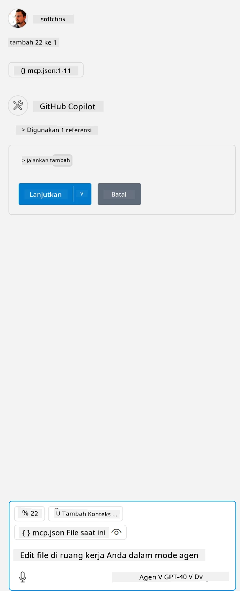

Ini sesuai dengan menjalankan perintah seperti ini: `node build/index.js`.

- Ubah entri server ini agar sesuai dengan lokasi file server Anda atau sesuai dengan yang dibutuhkan untuk memulai server Anda tergantung pada runtime dan lokasi server yang Anda pilih.

## Menggunakan fitur di server

- Klik ikon `play`, setelah Anda menambahkan *mcp.json* ke folder *./vscode*,

    Perhatikan ikon tooling berubah untuk menambah jumlah alat yang tersedia. Ikon tooling terletak tepat di atas kolom chat di GitHub Copilot.

## Menjalankan sebuah alat

- Ketik prompt di jendela chat Anda yang sesuai dengan deskripsi alat Anda. Misalnya, untuk memicu alat `add` ketik sesuatu seperti "add 3 to 20".

    Anda akan melihat sebuah alat ditampilkan di atas kotak teks chat yang menunjukkan agar Anda memilih untuk menjalankan alat tersebut seperti pada gambar berikut:

    

    Memilih alat tersebut seharusnya menghasilkan angka "23" jika prompt Anda seperti yang kami sebutkan sebelumnya.

**Penafian**:  
Dokumen ini telah diterjemahkan menggunakan layanan terjemahan AI [Co-op Translator](https://github.com/Azure/co-op-translator). Meskipun kami berupaya untuk mencapai akurasi, harap diingat bahwa terjemahan otomatis mungkin mengandung kesalahan atau ketidakakuratan. Dokumen asli dalam bahasa aslinya harus dianggap sebagai sumber yang sahih. Untuk informasi penting, disarankan menggunakan terjemahan profesional oleh manusia. Kami tidak bertanggung jawab atas kesalahpahaman atau penafsiran yang keliru yang timbul dari penggunaan terjemahan ini.