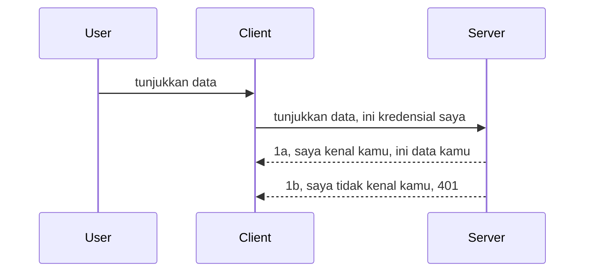

# Otentikasi sederhana

SDK MCP mendukung penggunaan OAuth 2.1 yang jujur saja adalah proses yang cukup rumit melibatkan konsep seperti server otentikasi, server sumber daya, mengirim kredensial, mendapatkan kode, menukar kode untuk token bearer sampai akhirnya Anda bisa mendapatkan data sumber daya Anda. Jika Anda belum terbiasa dengan OAuth yang merupakan hal bagus untuk diimplementasikan, ada baiknya memulai dengan tingkat otentikasi dasar dan membangunnya menuju keamanan yang lebih baik. Itulah sebabnya bab ini ada, untuk membangun Anda menuju otentikasi yang lebih maju.

## Otentikasi, apa yang kami maksud?

Otentikasi adalah singkatan dari autentikasi dan otorisasi. Idéanya adalah kita perlu melakukan dua hal:

- **Autentikasi**, yaitu proses menentukan apakah kita membiarkan seseorang masuk ke rumah kita, bahwa mereka memiliki hak untuk "di sini" yaitu memiliki akses ke server sumber daya kita tempat fitur MCP Server kita berada.
- **Otorisasi**, adalah proses mengetahui apakah pengguna seharusnya memiliki akses ke sumber daya spesifik yang mereka minta, misalnya pesanan ini atau produk ini atau apakah mereka diperbolehkan membaca kontennya tapi tidak menghapus sebagai contoh lain.

## Kredensial: bagaimana kita memberi tahu sistem siapa kita

Nah, kebanyakan pengembang web mulai berpikir dalam istilah memberikan kredensial ke server, biasanya sebuah rahasia yang mengatakan jika mereka diizinkan berada di sini "Autentikasi". Kredensial ini biasanya berupa versi base64 terenkode dari nama pengguna dan kata sandi atau kunci API yang secara unik mengidentifikasi pengguna tertentu.

Ini melibatkan mengirimkannya lewat header bernama "Authorization" seperti berikut:

```json
{ "Authorization": "secret123" }
```

Ini biasanya disebut autentikasi dasar (basic authentication). Cara alur keseluruhan bekerja adalah sebagai berikut:


Sekarang setelah kita mengerti cara kerjanya dari sudut pandang alur, bagaimana kita mengimplementasikannya? Nah, sebagian besar server web memiliki konsep bernama middleware, potongan kode yang dijalankan sebagai bagian dari permintaan yang dapat memverifikasi kredensial, dan jika kredensial valid dapat membiarkan permintaan melewati. Jika permintaan tidak memiliki kredensial yang valid maka Anda mendapatkan kesalahan autentikasi. Mari kita lihat bagaimana ini bisa diimplementasikan:

**Python**

```python
class AuthMiddleware(BaseHTTPMiddleware):
    async def dispatch(self, request, call_next):

        has_header = request.headers.get("Authorization")
        if not has_header:
            print("-> Missing Authorization header!")
            return Response(status_code=401, content="Unauthorized")

        if not valid_token(has_header):
            print("-> Invalid token!")
            return Response(status_code=403, content="Forbidden")

        print("Valid token, proceeding...")
       
        response = await call_next(request)
        # tambahkan header pelanggan apa pun atau perubahan dalam respons dengan cara tertentu
        return response


starlette_app.add_middleware(CustomHeaderMiddleware)
```

Di sini kita memiliki:

- Membuat middleware bernama `AuthMiddleware` di mana metode `dispatch`-nya dipanggil oleh server web.
- Menambahkan middleware ke server web:

    ```python
    starlette_app.add_middleware(AuthMiddleware)
    ```

- Menulis logika validasi yang memeriksa apakah header Authorization ada dan apakah rahasia yang dikirim valid:

    ```python
    has_header = request.headers.get("Authorization")
    if not has_header:
        print("-> Missing Authorization header!")
        return Response(status_code=401, content="Unauthorized")

    if not valid_token(has_header):
        print("-> Invalid token!")
        return Response(status_code=403, content="Forbidden")
    ```

    jika rahasia ada dan valid maka kita membiarkan permintaan melewati dengan memanggil `call_next` dan mengembalikan respons.

    ```python
    response = await call_next(request)
    # tambahkan header pelanggan atau ubah respons dengan cara tertentu
    return response
    ```

Cara kerjanya adalah jika permintaan web dilakukan ke server, middleware akan dipanggil dan dengan implementasinya akan membiarkan permintaan lewat atau mengembalikan kesalahan yang menunjukkan klien tidak diizinkan untuk melanjutkan.

**TypeScript**

Di sini kita membuat middleware dengan framework populer Express dan mencegat permintaan sebelum mencapai MCP Server. Ini kodenya:

```typescript
function isValid(secret) {
    return secret === "secret123";
}

app.use((req, res, next) => {
    // 1. Header otorisasi ada?
    if(!req.headers["Authorization"]) {
        res.status(401).send('Unauthorized');
    }
    
    let token = req.headers["Authorization"];

    // 2. Periksa keabsahan.
    if(!isValid(token)) {
        res.status(403).send('Forbidden');
    }

   
    console.log('Middleware executed');
    // 3. Lanjutkan permintaan ke langkah berikutnya dalam pipeline permintaan.
    next();
});
```

Dalam kode ini kita:

1. Memeriksa apakah header Authorization ada, jika tidak, kita mengirim kesalahan 401.
2. Memastikan kredensial/token valid, jika tidak, kita mengirim kesalahan 403.
3. Akhirnya meneruskan permintaan dalam pipeline permintaan dan mengembalikan sumber daya yang diminta.

## Latihan: Implementasi autentikasi

Mari ambil pengetahuan kita dan coba mengimplementasikannya. Berikut rencananya:

Server

- Buat server web dan instance MCP.
- Implementasikan middleware untuk server.

Klien

- Kirim permintaan web dengan kredensial melalui header.

### -1- Membuat server web dan instance MCP

Langkah pertama kita, kita perlu membuat instance server web dan MCP Server.

**Python**

Di sini kita membuat instance MCP server, membuat aplikasi web starlette dan menghostnya dengan uvicorn.

```python
# membuat Server MCP

app = FastMCP(
    name="MCP Resource Server",
    instructions="Resource Server that validates tokens via Authorization Server introspection",
    host=settings["host"],
    port=settings["port"],
    debug=True
)

# membuat aplikasi web starlette
starlette_app = app.streamable_http_app()

# menyajikan aplikasi melalui uvicorn
async def run(starlette_app):
    import uvicorn
    config = uvicorn.Config(
            starlette_app,
            host=app.settings.host,
            port=app.settings.port,
            log_level=app.settings.log_level.lower(),
        )
    server = uvicorn.Server(config)
    await server.serve()

run(starlette_app)
```

Dalam kode ini kita:

- Membuat MCP Server.
- Membangun aplikasi web starlette dari MCP Server, `app.streamable_http_app()`.
- Meng-host dan melayani aplikasi web menggunakan uvicorn `server.serve()`.

**TypeScript**

Di sini kita membuat instance MCP Server.

```typescript
const server = new McpServer({
      name: "example-server",
      version: "1.0.0"
    });

    // ... siapkan sumber daya server, alat, dan prompt ...
```

Pembuatan MCP Server ini harus terjadi dalam definisi rute POST /mcp kita, jadi mari kita pindahkan kode di atas seperti ini:

```typescript
import express from "express";
import { randomUUID } from "node:crypto";
import { McpServer } from "@modelcontextprotocol/sdk/server/mcp.js";
import { StreamableHTTPServerTransport } from "@modelcontextprotocol/sdk/server/streamableHttp.js";
import { isInitializeRequest } from "@modelcontextprotocol/sdk/types.js"

const app = express();
app.use(express.json());

// Peta untuk menyimpan transport berdasarkan ID sesi
const transports: { [sessionId: string]: StreamableHTTPServerTransport } = {};

// Tangani permintaan POST untuk komunikasi klien-ke-server
app.post('/mcp', async (req, res) => {
  // Periksa ID sesi yang sudah ada
  const sessionId = req.headers['mcp-session-id'] as string | undefined;
  let transport: StreamableHTTPServerTransport;

  if (sessionId && transports[sessionId]) {
    // Gunakan kembali transport yang ada
    transport = transports[sessionId];
  } else if (!sessionId && isInitializeRequest(req.body)) {
    // Permintaan inisialisasi baru
    transport = new StreamableHTTPServerTransport({
      sessionIdGenerator: () => randomUUID(),
      onsessioninitialized: (sessionId) => {
        // Simpan transport berdasarkan ID sesi
        transports[sessionId] = transport;
      },
      // Perlindungan DNS rebinding dinonaktifkan secara default untuk kompatibilitas mundur. Jika Anda menjalankan server ini
      // secara lokal, pastikan untuk mengatur:
      // enableDnsRebindingProtection: true,
      // allowedHosts: ['127.0.0.1'],
    });

    // Bersihkan transport saat ditutup
    transport.onclose = () => {
      if (transport.sessionId) {
        delete transports[transport.sessionId];
      }
    };
    const server = new McpServer({
      name: "example-server",
      version: "1.0.0"
    });

    // ... siapkan sumber daya server, alat, dan prompt ...

    // Hubungkan ke server MCP
    await server.connect(transport);
  } else {
    // Permintaan tidak valid
    res.status(400).json({
      jsonrpc: '2.0',
      error: {
        code: -32000,
        message: 'Bad Request: No valid session ID provided',
      },
      id: null,
    });
    return;
  }

  // Tangani permintaan
  await transport.handleRequest(req, res, req.body);
});

// Penangkap ulang yang dapat digunakan untuk permintaan GET dan DELETE
const handleSessionRequest = async (req: express.Request, res: express.Response) => {
  const sessionId = req.headers['mcp-session-id'] as string | undefined;
  if (!sessionId || !transports[sessionId]) {
    res.status(400).send('Invalid or missing session ID');
    return;
  }
  
  const transport = transports[sessionId];
  await transport.handleRequest(req, res);
};

// Tangani permintaan GET untuk notifikasi server-ke-klien melalui SSE
app.get('/mcp', handleSessionRequest);

// Tangani permintaan DELETE untuk pengakhiran sesi
app.delete('/mcp', handleSessionRequest);

app.listen(3000);
```

Sekarang Anda lihat bagaimana pembuatan MCP Server dipindahkan ke dalam `app.post("/mcp")`.

Mari lanjut ke langkah berikutnya membuat middleware agar kita dapat memvalidasi kredensial yang masuk.

### -2- Implementasi middleware untuk server

Mari kita lanjut ke bagian middleware berikutnya. Di sini kita akan membuat middleware yang mencari kredensial di header `Authorization` dan memvalidasinya. Jika dapat diterima maka permintaan akan melanjutkan melakukan apa yang perlu (misal: daftar alat, membaca sumber daya atau fungsionalitas MCP lain yang diminta klien).

**Python**

Untuk membuat middleware, kita perlu membuat kelas yang mewarisi dari `BaseHTTPMiddleware`. Ada dua bagian menarik:

- Permintaan `request`, yang kita baca informasi headernya.
- `call_next` callback yang harus kita panggil jika klien membawa kredensial yang kita terima.

Pertama, kita perlu menangani jika header `Authorization` tidak ada:

```python
has_header = request.headers.get("Authorization")

# tidak ada header, gagal dengan 401, jika tidak lanjutkan.
if not has_header:
    print("-> Missing Authorization header!")
    return Response(status_code=401, content="Unauthorized")
```

Di sini kita mengirim pesan 401 unauthorized karena klien gagal melakukan autentikasi.

Selanjutnya, jika kredensial dikirimkan, kita perlu memeriksa validitasnya seperti ini:

```python
 if not valid_token(has_header):
    print("-> Invalid token!")
    return Response(status_code=403, content="Forbidden")
```

Perhatikan bagaimana kita mengirim pesan 403 forbidden di atas. Mari lihat middleware lengkap di bawah yang mengimplementasikan semua yang kita sebutkan di atas:

```python
class AuthMiddleware(BaseHTTPMiddleware):
    async def dispatch(self, request, call_next):

        has_header = request.headers.get("Authorization")
        if not has_header:
            print("-> Missing Authorization header!")
            return Response(status_code=401, content="Unauthorized")

        if not valid_token(has_header):
            print("-> Invalid token!")
            return Response(status_code=403, content="Forbidden")

        print("Valid token, proceeding...")
        print(f"-> Received {request.method} {request.url}")
        response = await call_next(request)
        response.headers['Custom'] = 'Example'
        return response

```

Bagus, tapi bagaimana dengan fungsi `valid_token`? Ini di bawah:

```python
# JANGAN gunakan untuk produksi - perbaiki !!
def valid_token(token: str) -> bool:
    # hapus prefix "Bearer "
    if token.startswith("Bearer "):
        token = token[7:]
        return token == "secret-token"
    return False
```

Ini tentu perlu perbaikan.

PENTING: Anda TIDAK PERNAH boleh menyimpan rahasia seperti ini dalam kode. Idealnya Anda mengambil nilai perbandingan dari sumber data atau dari IDP (penyedia layanan identitas) atau lebih baik lagi biarkan IDP melakukan validasi.

**TypeScript**

Untuk mengimplementasikan ini dengan Express, kita perlu memanggil metode `use` yang menerima fungsi middleware.

Kita perlu:

- Berinteraksi dengan variabel request untuk memeriksa kredensial yang dikirim dalam properti `Authorization`.
- Memvalidasi kredensial, dan jika valid membiarkan permintaan lanjut sehingga permintaan MCP klien melakukan apa yang harusnya (misal: daftar alat, baca sumber daya atau hal lain terkait MCP).

Di sini, kita memeriksa apakah header `Authorization` ada dan jika tidak, kita hentikan permintaan:

```typescript
if(!req.headers["authorization"]) {
    res.status(401).send('Unauthorized');
    return;
}
```

Jika header tidak dikirim, Anda menerima 401.

Selanjutnya, kita memeriksa apakah kredensial valid, jika tidak kita kembali hentikan permintaan tapi dengan pesan yang sedikit berbeda:

```typescript
if(!isValid(token)) {
    res.status(403).send('Forbidden');
    return;
} 
```

Perhatikan bahwa sekarang Anda mendapatkan error 403.

Ini kode lengkapnya:

```typescript
app.use((req, res, next) => {
    console.log('Request received:', req.method, req.url, req.headers);
    console.log('Headers:', req.headers["authorization"]);
    if(!req.headers["authorization"]) {
        res.status(401).send('Unauthorized');
        return;
    }
    
    let token = req.headers["authorization"];

    if(!isValid(token)) {
        res.status(403).send('Forbidden');
        return;
    }  

    console.log('Middleware executed');
    next();
});
```

Kita sudah menyiapkan server web untuk menerima middleware pengecek kredensial yang semoga dikirim klien. Bagaimana dengan sisi klien sendiri?

### -3- Kirim permintaan web dengan kredensial melalui header

Kita perlu memastikan klien mengirim kredensial lewat header. Karena kita akan menggunakan klien MCP untuk melakukannya, kita perlu mencari tahu bagaimana caranya.

**Python**

Untuk klien, kita perlu mengirim header dengan kredensial seperti berikut:

```python
# JANGAN meng-hardcode nilai, simpan minimal di variabel lingkungan atau penyimpanan yang lebih aman
token = "secret-token"

async with streamablehttp_client(
        url = f"http://localhost:{port}/mcp",
        headers = {"Authorization": f"Bearer {token}"}
    ) as (
        read_stream,
        write_stream,
        session_callback,
    ):
        async with ClientSession(
            read_stream,
            write_stream
        ) as session:
            await session.initialize()
      
            # TODO, apa yang ingin Anda lakukan di klien, misalnya daftar alat, panggil alat, dll.
```

Perhatikan bagaimana kita mengisi properti `headers` seperti ini ` headers = {"Authorization": f"Bearer {token}"}`.

**TypeScript**

Kita bisa menyelesaikannya dalam dua langkah:

1. Mengisi objek konfigurasi dengan kredensial kita.
2. Mengirim objek konfigurasi ke transport.

```typescript

// JANGAN hardcode nilainya seperti yang ditunjukkan di sini. Setidaknya simpan sebagai variabel lingkungan dan gunakan sesuatu seperti dotenv (dalam mode pengembangan).
let token = "secret123"

// definisikan objek opsi transport klien
let options: StreamableHTTPClientTransportOptions = {
  sessionId: sessionId,
  requestInit: {
    headers: {
      "Authorization": "secret123"
    }
  }
};

// kirimkan objek opsi ke transportasi
async function main() {
   const transport = new StreamableHTTPClientTransport(
      new URL(serverUrl),
      options
   );
```

Di sini Anda lihat di atas bagaimana kita membuat objek `options` dan menempatkan header kita di bawah properti `requestInit`.

PENTING: Bagaimana kita memperbaikinya dari sini? Nah, implementasi saat ini memiliki beberapa masalah. Pertama, mengirim kredensial seperti ini cukup berisiko kecuali Anda setidaknya memakai HTTPS. Bahkan dengan itu, kredensial dapat dicuri jadi Anda perlu sistem di mana Anda dapat dengan mudah mencabut token dan menambahkan pemeriksaan tambahan seperti dari mana asalnya, apakah permintaan terlalu sering terjadi (perilaku bot), singkatnya ada banyak hal yang perlu diperhatikan.

Namun demikian, untuk API yang sangat sederhana di mana Anda tidak ingin sembarang orang memanggil API Anda tanpa autentikasi, apa yang kita punya di sini adalah awal yang baik.

Dengan itu dikatakan, mari kita coba memperkuat keamanan sedikit dengan menggunakan format standar seperti JSON Web Token, yang juga dikenal sebagai JWT atau token "JOT".

## JSON Web Tokens, JWT

Jadi, kita mencoba memperbaiki hal dari mengirim kredensial yang sangat sederhana. Apa perbaikan langsung yang kita dapatkan dengan mengadopsi JWT?

- **Perbaikan keamanan**. Dalam basic auth, Anda mengirim nama pengguna dan kata sandi sebagai token base64 (atau mengirim kunci API) berulang-ulang yang meningkatkan risiko. Dengan JWT, Anda mengirim nama pengguna dan kata sandi dan mendapatkan token sebagai balasan dan token itu juga memiliki batas waktu kedaluwarsa. JWT memungkinkan Anda menggunakan kontrol akses yang sangat terperinci menggunakan peran, cakupan, dan izin.
- **Tanpa status dan skalabilitas**. JWT bersifat mandiri, mereka membawa semua info pengguna dan menghilangkan kebutuhan penyimpanan sesi di sisi server. Token juga bisa divalidasi secara lokal.
- **Interoperabilitas dan federasi**. JWT adalah pusat dari Open ID Connect dan digunakan dengan penyedia identitas seperti Entra ID, Google Identity dan Auth0. Mereka juga memungkinkan penggunaan single sign on dan banyak lagi sehingga berskala enterprise.
- **Modularitas dan fleksibilitas**. JWT juga bisa digunakan dengan API Gateway seperti Azure API Management, NGINX dan lainnya. Mendukung skenario autentikasi dan komunikasi server-ke-layanan termasuk impersonasi dan delegasi.
- **Kinerja dan caching**. JWT dapat dicache setelah decoding yang mengurangi kebutuhan parsing. Ini membantu terutama untuk aplikasi dengan trafik tinggi karena meningkatkan throughput dan mengurangi beban pada infrastruktur pilihan Anda.
- **Fitur lanjutan**. Mendukung introspeksi (memeriksa validitas di server) dan pencabutan (membuat token tidak berlaku).

Dengan semua manfaat ini, mari kita lihat bagaimana kita bisa membawa implementasi kita ke level berikutnya.

## Mengubah basic auth menjadi JWT

Jadi, perubahan yang kita perlukan secara garis besar adalah:

- **Belajar membangun token JWT** dan membuatnya siap dikirim dari klien ke server.
- **Memvalidasi token JWT**, dan jika valid membiarkan klien mengakses sumber daya kita.
- **Penyimpanan token yang aman**. Bagaimana kita menyimpan token ini.
- **Melindungi rute**. Kita perlu melindungi rute, dalam kasus kita, kita melindungi rute dan fitur MCP spesifik.
- **Menambah token refresh**. Pastikan kita membuat token yang berumur pendek tapi token refresh yang berumur panjang yang bisa digunakan untuk mendapatkan token baru jika token utama kedaluwarsa. Pastikan juga ada endpoint refresh dan strategi rotasi.

### -1- Membangun token JWT

Pertama, token JWT memiliki bagian-bagian berikut:

- **header**, algoritma yang digunakan dan tipe token.
- **payload**, klaim, seperti sub (pengguna atau entitas yang diwakili token. Dalam skenario auth biasanya user id), exp (waktu kedaluwarsa), role (peran)
- **signature**, ditandatangani dengan rahasia atau kunci privat.

Untuk ini, kita perlu membangun header, payload dan token terenkode.

**Python**

```python

import jwt
import jwt
from jwt.exceptions import ExpiredSignatureError, InvalidTokenError
import datetime

# Kunci rahasia yang digunakan untuk menandatangani JWT
secret_key = 'your-secret-key'

header = {
    "alg": "HS256",
    "typ": "JWT"
}

# info pengguna dan klaim serta waktu kedaluwarsanya
payload = {
    "sub": "1234567890",               # Subjek (ID pengguna)
    "name": "User Userson",                # Klaim kustom
    "admin": True,                     # Klaim kustom
    "iat": datetime.datetime.utcnow(),# Diterbitkan pada
    "exp": datetime.datetime.utcnow() + datetime.timedelta(hours=1)  # Kedaluwarsa
}

# enkode itu
encoded_jwt = jwt.encode(payload, secret_key, algorithm="HS256", headers=header)
```

Dalam kode di atas kita:

- Mendefinisikan header menggunakan algoritma HS256 dan tipe JWT.
- Membuat payload yang berisi subjek atau id user, nama pengguna, peran, kapan diterbitkan dan kapan kedaluwarsa sehingga mengimplementasikan aspek terbatas waktu yang kita sebut sebelumnya.

**TypeScript**

Di sini kita akan butuh beberapa dependensi yang membantu kita membuat token JWT.

Dependensi

```sh

npm install jsonwebtoken
npm install --save-dev @types/jsonwebtoken
```

Sekarang setelah itu selesai, mari buat header, payload dan melalui itu buat token terenkode.

```typescript
import jwt from 'jsonwebtoken';

const secretKey = 'your-secret-key'; // Gunakan variabel lingkungan di produksi

// Definisikan payload
const payload = {
  sub: '1234567890',
  name: 'User usersson',
  admin: true,
  iat: Math.floor(Date.now() / 1000), // Dikeluarkan pada
  exp: Math.floor(Date.now() / 1000) + 60 * 60 // Berakhir dalam 1 jam
};

// Definisikan header (opsional, jsonwebtoken menetapkan default)
const header = {
  alg: 'HS256',
  typ: 'JWT'
};

// Buat token
const token = jwt.sign(payload, secretKey, {
  algorithm: 'HS256',
  header: header
});

console.log('JWT:', token);
```

Token ini:

Ditandatangani menggunakan HS256
Valid 1 jam
Memuat klaim seperti sub, name, admin, iat, dan exp.

### -2- Memvalidasi token

Kita juga perlu memvalidasi token, ini adalah sesuatu yang harus kita lakukan di server untuk memastikan apa yang klien kirimkan memang valid. Ada banyak pemeriksaan yang harus dilakukan mulai dari memvalidasi struktur hingga validitasnya. Anda juga dianjurkan untuk menambah pemeriksaan lainnya, misalnya memastikan pengguna ada dalam sistem dan lainnya.

Untuk memvalidasi token, kita perlu mendekodenya agar bisa membacanya dan mulai memeriksa validitasnya:

**Python**

```python

# Mendekode dan memverifikasi JWT
try:
    decoded = jwt.decode(token, secret_key, algorithms=["HS256"])
    print("✅ Token is valid.")
    print("Decoded claims:")
    for key, value in decoded.items():
        print(f"  {key}: {value}")
except ExpiredSignatureError:
    print("❌ Token has expired.")
except InvalidTokenError as e:
    print(f"❌ Invalid token: {e}")

```

Dalam kode ini, kita memanggil `jwt.decode` menggunakan token, kunci rahasia dan algoritma yang dipilih sebagai input. Perhatikan bahwa kita menggunakan struktur try-catch karena validasi gagal akan menimbulkan error.

**TypeScript**

Di sini kita perlu memanggil `jwt.verify` untuk mendapatkan versi token yang sudah didecode yang dapat kita analisa lebih lanjut. Jika panggilan ini gagal, berarti struktur token salah atau sudah tidak valid.

```typescript

try {
  const decoded = jwt.verify(token, secretKey);
  console.log('Decoded Payload:', decoded);
} catch (err) {
  console.error('Token verification failed:', err);
}
```

CATATAN: seperti disebutkan sebelumnya, kita harus melakukan pemeriksaan tambahan untuk memastikan token ini menunjuk pada pengguna dalam sistem kita dan memastikan pengguna memiliki hak yang diklaim.
Selanjutnya, mari kita lihat kontrol akses berbasis peran, juga dikenal sebagai RBAC.

## Menambahkan kontrol akses berbasis peran

Idenya adalah kita ingin menyatakan bahwa peran yang berbeda memiliki izin yang berbeda. Misalnya, kita mengasumsikan admin bisa melakukan segalanya dan pengguna biasa bisa melakukan baca/tulis dan tamu hanya bisa membaca. Oleh karena itu, berikut beberapa tingkat izin yang mungkin:

- Admin.Write 
- User.Read
- Guest.Read

Mari kita lihat bagaimana kita dapat mengimplementasikan kontrol seperti itu dengan middleware. Middleware dapat ditambahkan per rute maupun untuk semua rute.

**Python**

```python
from starlette.middleware.base import BaseHTTPMiddleware
from starlette.responses import JSONResponse
import jwt

# JANGAN menyimpan rahasia dalam kode seperti ini, ini hanya untuk tujuan demonstrasi. Baca dari tempat yang aman.
SECRET_KEY = "your-secret-key" # masukkan ini ke dalam variabel env
REQUIRED_PERMISSION = "User.Read"

class JWTPermissionMiddleware(BaseHTTPMiddleware):
    async def dispatch(self, request, call_next):
        auth_header = request.headers.get("Authorization")
        if not auth_header or not auth_header.startswith("Bearer "):
            return JSONResponse({"error": "Missing or invalid Authorization header"}, status_code=401)

        token = auth_header.split(" ")[1]
        try:
            decoded = jwt.decode(token, SECRET_KEY, algorithms=["HS256"])
        except jwt.ExpiredSignatureError:
            return JSONResponse({"error": "Token expired"}, status_code=401)
        except jwt.InvalidTokenError:
            return JSONResponse({"error": "Invalid token"}, status_code=401)

        permissions = decoded.get("permissions", [])
        if REQUIRED_PERMISSION not in permissions:
            return JSONResponse({"error": "Permission denied"}, status_code=403)

        request.state.user = decoded
        return await call_next(request)


```

Ada beberapa cara berbeda untuk menambahkan middleware seperti di bawah ini:

```python

# Alt 1: tambahkan middleware saat membangun aplikasi starlette
middleware = [
    Middleware(JWTPermissionMiddleware)
]

app = Starlette(routes=routes, middleware=middleware)

# Alt 2: tambahkan middleware setelah aplikasi starlette sudah dibangun
starlette_app.add_middleware(JWTPermissionMiddleware)

# Alt 3: tambahkan middleware per rute
routes = [
    Route(
        "/mcp",
        endpoint=..., # penangkap
        middleware=[Middleware(JWTPermissionMiddleware)]
    )
]
```

**TypeScript**

Kita bisa menggunakan `app.use` dan middleware yang akan dijalankan untuk semua permintaan. 

```typescript
app.use((req, res, next) => {
    console.log('Request received:', req.method, req.url, req.headers);
    console.log('Headers:', req.headers["authorization"]);

    // 1. Periksa apakah header otorisasi telah dikirim

    if(!req.headers["authorization"]) {
        res.status(401).send('Unauthorized');
        return;
    }
    
    let token = req.headers["authorization"];

    // 2. Periksa apakah token valid
    if(!isValid(token)) {
        res.status(403).send('Forbidden');
        return;
    }  

    // 3. Periksa apakah pengguna token ada dalam sistem kami
    if(!isExistingUser(token)) {
        res.status(403).send('Forbidden');
        console.log("User does not exist");
        return;
    }
    console.log("User exists");

    // 4. Verifikasi token memiliki izin yang tepat
    if(!hasScopes(token, ["User.Read"])){
        res.status(403).send('Forbidden - insufficient scopes');
    }

    console.log("User has required scopes");

    console.log('Middleware executed');
    next();
});

```

Ada beberapa hal yang bisa kita biarkan middleware kita lakukan dan middleware kita HARUS lakukan, yaitu:

1. Periksa apakah header otorisasi ada
2. Periksa apakah token valid, kita memanggil `isValid` yang merupakan metode yang kita buat untuk memeriksa integritas dan validitas token JWT.
3. Verifikasi pengguna ada di sistem kita, kita harus memeriksa ini.

   ```typescript
    // pengguna dalam DB
   const users = [
     "user1",
     "User usersson",
   ]

   function isExistingUser(token) {
     let decodedToken = verifyToken(token);

     // TODO, periksa apakah pengguna ada di DB
     return users.includes(decodedToken?.name || "");
   }
   ```

   Di atas, kita telah membuat daftar `users` yang sangat sederhana, yang seharusnya tentunya ada di database.

4. Selain itu, kita juga harus memeriksa token memiliki izin yang tepat.

   ```typescript
   if(!hasScopes(token, ["User.Read"])){
        res.status(403).send('Forbidden - insufficient scopes');
   }
   ```

   Dalam kode di atas dari middleware, kita memeriksa bahwa token mengandung izin User.Read, jika tidak kita mengirimkan error 403. Di bawah ini adalah metode pembantu `hasScopes`.

   ```typescript
   function hasScopes(scope: string, requiredScopes: string[]) {
     let decodedToken = verifyToken(scope);
    return requiredScopes.every(scope => decodedToken?.scopes.includes(scope));
  }
   ```

Have a think which additional checks you should be doing, but these are the absolute minimum of checks you should be doing.

Using Express as a web framework is a common choice. There are helpers library when you use JWT so you can write less code.

- `express-jwt`, helper library that provides a middleware that helps decode your token.
- `express-jwt-permissions`, this provides a middleware `guard` that helps check if a certain permission is on the token.

Here's what these libraries can look like when used:

```typescript
const express = require('express');
const jwt = require('express-jwt');
const guard = require('express-jwt-permissions')();

const app = express();
const secretKey = 'your-secret-key'; // put this in env variable

// Decode JWT and attach to req.user
app.use(jwt({ secret: secretKey, algorithms: ['HS256'] }));

// Check for User.Read permission
app.use(guard.check('User.Read'));

// multiple permissions
// app.use(guard.check(['User.Read', 'Admin.Access']));

app.get('/protected', (req, res) => {
  res.json({ message: `Welcome ${req.user.name}` });
});

// Error handler
app.use((err, req, res, next) => {
  if (err.code === 'permission_denied') {
    return res.status(403).send('Forbidden');
  }
  next(err);
});

```

Sekarang Anda telah melihat bagaimana middleware dapat digunakan untuk otentikasi dan otorisasi, bagaimana dengan MCP, apakah itu mengubah cara kita melakukan auth? Mari kita temukan di bagian berikutnya.

### -3- Tambahkan RBAC ke MCP

Anda sudah melihat sejauh ini bagaimana Anda dapat menambahkan RBAC melalui middleware, namun untuk MCP tidak ada cara mudah untuk menambahkan RBAC per fitur MCP, jadi apa yang kita lakukan? Nah, kita hanya harus menambahkan kode seperti ini yang memeriksa dalam kasus ini apakah klien memiliki hak untuk memanggil alat tertentu:

Anda memiliki beberapa pilihan berbeda tentang bagaimana mencapai RBAC per fitur, berikut beberapa:

- Tambahkan pemeriksaan untuk setiap alat, sumber daya, prompt di mana Anda perlu memeriksa tingkat izin.

   **python**

   ```python
   @tool()
   def delete_product(id: int):
      try:
          check_permissions(role="Admin.Write", request)
      catch:
        pass # klien gagal otorisasi, kirimkan kesalahan otorisasi
   ```

   **typescript**

   ```typescript
   server.registerTool(
    "delete-product",
    {
      title: Delete a product",
      description: "Deletes a product",
      inputSchema: { id: z.number() }
    },
    async ({ id }) => {
      
      try {
        checkPermissions("Admin.Write", request);
        // todo, kirim id ke productService dan remote entry
      } catch(Exception e) {
        console.log("Authorization error, you're not allowed");  
      }

      return {
        content: [{ type: "text", text: `Deletected product with id ${id}` }]
      };
    }
   );
   ```


- Gunakan pendekatan server lanjutan dan penangan permintaan sehingga Anda meminimalkan berapa banyak tempat di mana Anda perlu melakukan pemeriksaan.

   **Python**

   ```python
   
   tool_permission = {
      "create_product": ["User.Write", "Admin.Write"],
      "delete_product": ["Admin.Write"]
   }

   def has_permission(user_permissions, required_permissions) -> bool:
      # user_permissions: daftar izin yang dimiliki pengguna
      # required_permissions: daftar izin yang dibutuhkan untuk alat
      return any(perm in user_permissions for perm in required_permissions)

   @server.call_tool()
   async def handle_call_tool(
     name: str, arguments: dict[str, str] | None
   ) -> list[types.TextContent]:
    # Asumsikan request.user.permissions adalah daftar izin untuk pengguna
     user_permissions = request.user.permissions
     required_permissions = tool_permission.get(name, [])
     if not has_permission(user_permissions, required_permissions):
        # Munculkan kesalahan "Anda tidak memiliki izin untuk memanggil alat {name}"
        raise Exception(f"You don't have permission to call tool {name}")
     # lanjutkan dan panggil alat
     # ...
   ```   
   

   **TypeScript**

   ```typescript
   function hasPermission(userPermissions: string[], requiredPermissions: string[]): boolean {
       if (!Array.isArray(userPermissions) || !Array.isArray(requiredPermissions)) return false;
       // Kembalikan true jika pengguna memiliki setidaknya satu izin yang diperlukan
       
       return requiredPermissions.some(perm => userPermissions.includes(perm));
   }
  
   server.setRequestHandler(CallToolRequestSchema, async (request) => {
      const { params: { name } } = request;
  
      let permissions = request.user.permissions;
  
      if (!hasPermission(permissions, toolPermissions[name])) {
         return new Error(`You don't have permission to call ${name}`);
      }
  
      // lanjutkan..
   });
   ```

   Catatan, Anda harus memastikan middleware Anda menetapkan token yang didekodekan ke properti user pada permintaan sehingga kode di atas menjadi sederhana.

### Kesimpulan

Sekarang setelah kita membahas cara menambahkan dukungan untuk RBAC secara umum dan untuk MCP secara khusus, saatnya mencoba mengimplementasikan keamanan sendiri untuk memastikan Anda memahami konsep yang telah disampaikan.

## Tugas 1: Bangun server mcp dan klien mcp menggunakan otentikasi dasar

Di sini Anda akan mengambil apa yang telah Anda pelajari tentang mengirimkan kredensial melalui header.

## Solusi 1

[Solusi 1](./code/basic/README.md)

## Tugas 2: Tingkatkan solusi dari Tugas 1 untuk menggunakan JWT

Ambil solusi pertama namun kali ini, mari kita tingkatkan.

Alih-alih menggunakan Basic Auth, gunakan JWT.

## Solusi 2

[Solusi 2](./solution/jwt-solution/README.md)

## Tantangan

Tambahkan RBAC per alat yang kami jelaskan di bagian "Tambahkan RBAC ke MCP".

## Ringkasan

Semoga Anda telah belajar banyak di bab ini, dari tanpa keamanan sama sekali, ke keamanan dasar, ke JWT dan bagaimana itu dapat ditambahkan ke MCP.

Kita telah membangun fondasi yang solid dengan JWT kustom, tetapi saat kita berkembang, kita bergerak menuju model identitas berbasis standar. Mengadopsi IdP seperti Entra atau Keycloak membiarkan kita menyerahkan penerbitan token, validasi, dan manajemen siklus hidup ke platform terpercaya — membebaskan kita untuk fokus pada logika aplikasi dan pengalaman pengguna.

Untuk itu, kami memiliki [bab lanjutan tentang Entra](../../05-AdvancedTopics/mcp-security-entra/README.md)

## Selanjutnya

- Selanjutnya: [Menyiapkan Host MCP](../12-mcp-hosts/README.md)

---

<!-- CO-OP TRANSLATOR DISCLAIMER START -->
**Penafian**:  
Dokumen ini telah diterjemahkan menggunakan layanan terjemahan AI [Co-op Translator](https://github.com/Azure/co-op-translator). Meskipun kami berupaya untuk memberikan terjemahan yang akurat, harap diingat bahwa terjemahan otomatis mungkin mengandung kesalahan atau ketidakakuratan. Dokumen asli dalam bahasa aslinya harus dianggap sebagai sumber yang berwenang. Untuk informasi penting, disarankan menggunakan terjemahan profesional oleh penerjemah manusia. Kami tidak bertanggung jawab atas kesalahpahaman atau kesalahan interpretasi yang timbul dari penggunaan terjemahan ini.
<!-- CO-OP TRANSLATOR DISCLAIMER END -->