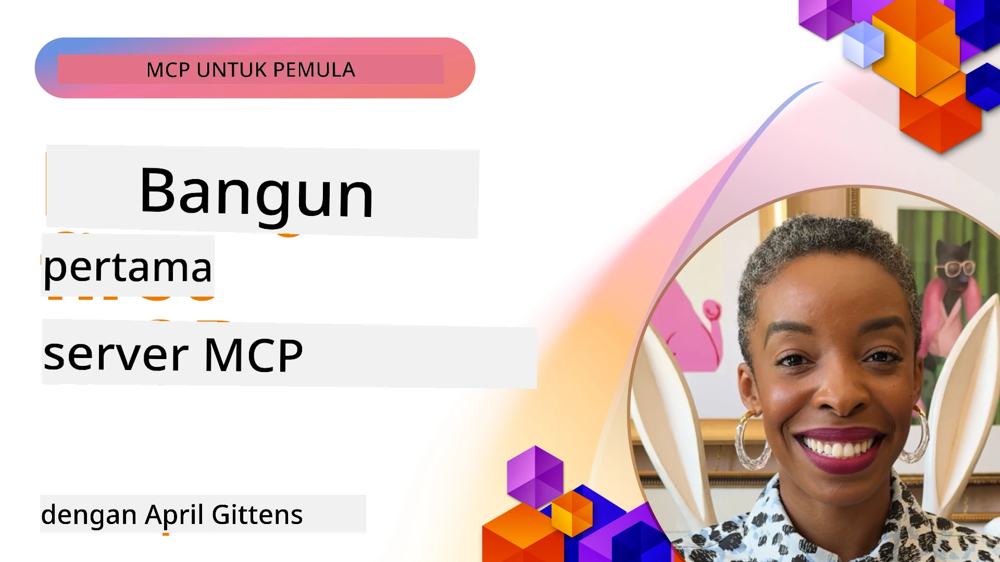

## Memulai  

_(Klik gambar di atas untuk menonton video pelajaran ini)_

Bagian ini terdiri dari beberapa pelajaran:

- **1 Server pertama Anda**, dalam pelajaran pertama ini, Anda akan belajar cara membuat server pertama Anda dan memeriksanya dengan alat inspector, cara yang berharga untuk menguji dan debug server Anda, [ke pelajaran](01-first-server/README.md)

- **2 Klien**, dalam pelajaran ini, Anda akan belajar cara menulis klien yang dapat terhubung ke server Anda, [ke pelajaran](02-client/README.md)

- **3 Klien dengan LLM**, cara yang lebih baik menulis klien adalah dengan menambahkan LLM sehingga dapat "bernegosiasi" dengan server Anda tentang apa yang harus dilakukan, [ke pelajaran](03-llm-client/README.md)

- **4 Menggunakan server mode GitHub Copilot Agent dalam Visual Studio Code**. Di sini, kita melihat cara menjalankan Server MCP kita dari dalam Visual Studio Code, [ke pelajaran](04-vscode/README.md)

- **5 Server Transport stdio** transport stdio adalah standar yang direkomendasikan untuk komunikasi server-ke-klien MCP lokal, menyediakan komunikasi berbasis subprocess yang aman dengan isolasi proses bawaan [ke pelajaran](05-stdio-server/README.md)

- **6 HTTP Streaming dengan MCP (Streamable HTTP)**. Pelajari tentang transport streaming HTTP modern (pendekatan yang direkomendasikan untuk server MCP jarak jauh menurut [Spesifikasi MCP 2025-11-25](https://spec.modelcontextprotocol.io/specification/2025-11-25/basic/transports/#streamable-http)), notifikasi progres, dan cara mengimplementasikan server dan klien MCP yang dapat diskalakan secara real-time menggunakan Streamable HTTP. [ke pelajaran](06-http-streaming/README.md)

- **7 Memanfaatkan AI Toolkit untuk VSCode** untuk menggunakan dan menguji Klien dan Server MCP Anda [ke pelajaran](07-aitk/README.md)

- **8 Pengujian**. Di sini kita akan fokus khususnya pada bagaimana kita dapat menguji server dan klien kita dengan berbagai cara, [ke pelajaran](08-testing/README.md)

- **9 Penyebaran**. Bab ini akan melihat berbagai cara menyebarkan solusi MCP Anda, [ke pelajaran](09-deployment/README.md)

- **10 Penggunaan server lanjutan**. Bab ini membahas penggunaan server lanjutan, [ke pelajaran](./10-advanced/README.md)

- **11 Otentikasi**. Bab ini membahas cara menambahkan otentikasi sederhana, dari Basic Auth hingga menggunakan JWT dan RBAC. Anda disarankan untuk mulai dari sini lalu melihat Topik Lanjutan di Bab 5 dan melakukan pengamanan tambahan sesuai rekomendasi di Bab 2, [ke pelajaran](./11-simple-auth/README.md)

- **12 Host MCP**. Konfigurasikan dan gunakan klien host MCP populer termasuk Claude Desktop, Cursor, Cline, dan Windsurf. Pelajari jenis transport dan pemecahan masalah, [ke pelajaran](./12-mcp-hosts/README.md)

- **13 Inspektur MCP**. Debug dan uji server MCP Anda secara interaktif menggunakan alat MCP Inspector. Pelajari cara memecahkan masalah alat, sumber daya, dan pesan protokol, [ke pelajaran](./13-mcp-inspector/README.md)

Model Context Protocol (MCP) adalah protokol terbuka yang menstandarisasi cara aplikasi menyediakan konteks untuk LLM. Anggap MCP seperti port USB-C untuk aplikasi AI - menyediakan cara standar menghubungkan model AI ke berbagai sumber data dan alat.

## Tujuan Pembelajaran

Setelah pelajaran ini, Anda akan dapat:

- Menyiapkan lingkungan pengembangan MCP di C#, Java, Python, TypeScript, dan JavaScript
- Membangun dan menyebarkan server MCP dasar dengan fitur kustom (sumber daya, prompt, dan alat)
- Membuat aplikasi host yang terhubung ke server MCP
- Menguji dan debug implementasi MCP
- Memahami tantangan setup umum dan solusinya
- Menghubungkan implementasi MCP Anda ke layanan LLM populer

## Menyiapkan Lingkungan MCP Anda

Sebelum mulai bekerja dengan MCP, penting untuk menyiapkan lingkungan pengembangan Anda dan memahami alur kerja dasar. Bagian ini akan membimbing Anda melalui langkah-langkah setup awal untuk memastikan awal yang lancar dengan MCP.

### Prasyarat

Sebelum mulai pengembangan MCP, pastikan Anda memiliki:

- **Lingkungan Pengembangan**: Untuk bahasa pilihan Anda (C#, Java, Python, TypeScript, atau JavaScript)
- **IDE/Editor**: Visual Studio, Visual Studio Code, IntelliJ, Eclipse, PyCharm, atau editor kode modern lainnya
- **Manajer Paket**: NuGet, Maven/Gradle, pip, atau npm/yarn
- **API Key**: Untuk layanan AI apa pun yang Anda rencanakan gunakan dalam aplikasi host Anda

### SDK Resmi

Di bab berikutnya Anda akan melihat solusi dibangun menggunakan Python, TypeScript, Java, dan .NET. Berikut adalah semua SDK resmi yang didukung.

MCP menyediakan SDK resmi untuk berbagai bahasa (selaras dengan [Spesifikasi MCP 2025-11-25](https://spec.modelcontextprotocol.io/specification/2025-11-25/)):
- [SDK C#](https://github.com/modelcontextprotocol/csharp-sdk) - Dipelihara bekerja sama dengan Microsoft
- [SDK Java](https://github.com/modelcontextprotocol/java-sdk) - Dipelihara bekerja sama dengan Spring AI
- [SDK TypeScript](https://github.com/modelcontextprotocol/typescript-sdk) - Implementasi resmi TypeScript
- [SDK Python](https://github.com/modelcontextprotocol/python-sdk) - Implementasi resmi Python (FastMCP)
- [SDK Kotlin](https://github.com/modelcontextprotocol/kotlin-sdk) - Implementasi resmi Kotlin
- [SDK Swift](https://github.com/modelcontextprotocol/swift-sdk) - Dipelihara bekerja sama dengan Loopwork AI
- [SDK Rust](https://github.com/modelcontextprotocol/rust-sdk) - Implementasi resmi Rust
- [SDK Go](https://github.com/modelcontextprotocol/go-sdk) - Implementasi resmi Go

## Poin Penting

- Menyiapkan lingkungan pengembangan MCP mudah dengan SDK spesifik bahasa
- Membangun server MCP melibatkan pembuatan dan pendaftaran alat dengan skema jelas
- Klien MCP terhubung ke server dan model untuk memanfaatkan kemampuan tambahan
- Pengujian dan debugging penting untuk implementasi MCP yang andal
- Opsi penyebaran mulai dari pengembangan lokal hingga solusi berbasis cloud

## Berlatih

Kami memiliki serangkaian sampel yang melengkapi latihan yang akan Anda temui di semua bab di bagian ini. Selain itu setiap bab juga memiliki latihan dan tugas sendiri

- [Kalkulator Java](./samples/java/calculator/README.md)
- [Kalkulator .Net](../../../03-GettingStarted/samples/csharp)
- [Kalkulator JavaScript](./samples/javascript/README.md)
- [Kalkulator TypeScript](./samples/typescript/README.md)
- [Kalkulator Python](../../../03-GettingStarted/samples/python)

## Sumber Tambahan

- [Membangun Agen menggunakan Model Context Protocol di Azure](https://learn.microsoft.com/azure/developer/ai/intro-agents-mcp)
- [MCP Remote dengan Azure Container Apps (Node.js/TypeScript/JavaScript)](https://learn.microsoft.com/samples/azure-samples/mcp-container-ts/mcp-container-ts/)
- [Agen MCP .NET OpenAI](https://learn.microsoft.com/samples/azure-samples/openai-mcp-agent-dotnet/openai-mcp-agent-dotnet/)

## Apa Selanjutnya

Mulai dengan pelajaran pertama: [Membuat Server MCP Pertama Anda](01-first-server/README.md)

Setelah menyelesaikan modul ini, lanjutkan ke: [Modul 4: Implementasi Praktis](../04-PracticalImplementation/README.md)

---

<!-- CO-OP TRANSLATOR DISCLAIMER START -->
**Penafian**:
Dokumen ini telah diterjemahkan menggunakan layanan terjemahan AI [Co-op Translator](https://github.com/Azure/co-op-translator). Meskipun kami berupaya untuk menjaga akurasi, harap diketahui bahwa terjemahan otomatis mungkin mengandung kesalahan atau ketidakakuratan. Dokumen asli dalam bahasa aslinya harus dianggap sebagai sumber yang sahih. Untuk informasi penting, disarankan menggunakan terjemahan profesional oleh manusia. Kami tidak bertanggung jawab atas kesalahpahaman atau penafsiran yang timbul dari penggunaan terjemahan ini.
<!-- CO-OP TRANSLATOR DISCLAIMER END -->