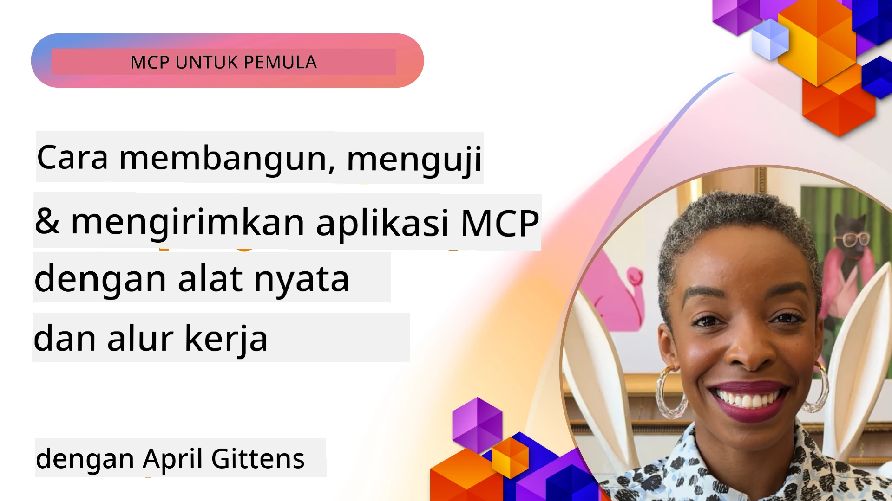
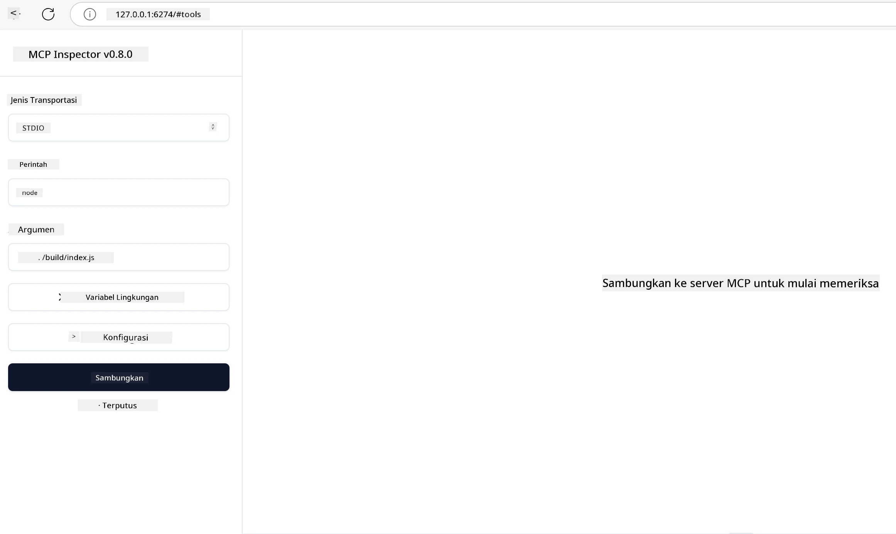

# Implementasi Praktis

[](https://youtu.be/vCN9-mKBDfQ)

_(Klik gambar di atas untuk melihat video pelajaran ini)_

Implementasi praktis adalah di mana kekuatan Model Context Protocol (MCP) menjadi nyata. Meskipun memahami teori dan arsitektur di balik MCP itu penting, nilai sebenarnya muncul ketika Anda menerapkan konsep ini untuk membangun, menguji, dan menerapkan solusi yang memecahkan masalah dunia nyata. Bab ini menjembatani kesenjangan antara pengetahuan konseptual dan pengembangan langsung, memandu Anda melalui proses membawa aplikasi berbasis MCP ke kehidupan nyata.

Apakah Anda mengembangkan asisten cerdas, mengintegrasikan AI ke dalam alur kerja bisnis, atau membangun alat khusus untuk pemrosesan data, MCP menyediakan fondasi yang fleksibel. Desainnya yang tidak bergantung bahasa dan SDK resmi untuk bahasa pemrograman populer membuatnya dapat diakses oleh berbagai pengembang. Dengan memanfaatkan SDK ini, Anda dapat dengan cepat membuat prototipe, iterasi, dan menskalakan solusi Anda di berbagai platform dan lingkungan.

Dalam bagian berikut, Anda akan menemukan contoh praktis, kode sampel, dan strategi penerapan yang menunjukkan cara mengimplementasikan MCP dalam C#, Java dengan Spring, TypeScript, JavaScript, dan Python. Anda juga akan belajar cara men-debug dan menguji server MCP, mengelola API, dan menerapkan solusi ke cloud menggunakan Azure. Sumber daya praktis ini dirancang untuk mempercepat pembelajaran Anda dan membantu Anda membangun aplikasi MCP yang tangguh dan siap produksi dengan percaya diri.

## Ikhtisar

Pelajaran ini berfokus pada aspek praktis implementasi MCP di berbagai bahasa pemrograman. Kita akan mengeksplorasi cara menggunakan SDK MCP di C#, Java dengan Spring, TypeScript, JavaScript, dan Python untuk membangun aplikasi yang kokoh, men-debug dan menguji server MCP, serta membuat sumber daya, prompt, dan alat yang dapat digunakan kembali.

## Tujuan Pembelajaran

Setelah menyelesaikan pelajaran ini, Anda akan mampu:

- Mengimplementasikan solusi MCP menggunakan SDK resmi dalam berbagai bahasa pemrograman
- Men-debug dan menguji server MCP secara sistematis
- Membuat dan menggunakan fitur server (Sumber Daya, Prompt, dan Alat)
- Merancang alur kerja MCP yang efektif untuk tugas kompleks
- Mengoptimalkan implementasi MCP untuk kinerja dan keandalan

## Sumber SDK Resmi

Model Context Protocol menawarkan SDK resmi untuk berbagai bahasa (sesuai dengan [Spesifikasi MCP 2025-11-25](https://spec.modelcontextprotocol.io/specification/2025-11-25/)):

- [SDK C#](https://github.com/modelcontextprotocol/csharp-sdk)
- [SDK Java dengan Spring](https://github.com/modelcontextprotocol/java-sdk) **Catatan:** memerlukan ketergantungan pada [Project Reactor](https://projectreactor.io). (Lihat [diskusi issue 246](https://github.com/orgs/modelcontextprotocol/discussions/246).)
- [SDK TypeScript](https://github.com/modelcontextprotocol/typescript-sdk)
- [SDK Python](https://github.com/modelcontextprotocol/python-sdk)
- [SDK Kotlin](https://github.com/modelcontextprotocol/kotlin-sdk)
- [SDK Go](https://github.com/modelcontextprotocol/go-sdk)

## Bekerja dengan SDK MCP

Bagian ini menyediakan contoh praktis implementasi MCP di berbagai bahasa pemrograman. Anda dapat menemukan kode sampel di direktori `samples` yang diorganisasi berdasarkan bahasa.

### Sampel yang Tersedia

Repositori ini mencakup [implementasi sampel](../../../04-PracticalImplementation/samples) dalam bahasa berikut:

- [C#](./samples/csharp/README.md)
- [Java dengan Spring](./samples/java/containerapp/README.md)
- [TypeScript](./samples/typescript/README.md)
- [JavaScript](./samples/javascript/README.md)
- [Python](./samples/python/README.md)

Setiap sampel menunjukkan konsep utama MCP dan pola implementasi untuk bahasa serta ekosistem tertentu.

### Panduan Praktis

Panduan tambahan untuk implementasi praktis MCP:

- [Paginasi dan Set Hasil Besar](./pagination/README.md) - Menangani paginasi berbasis kursor untuk alat, sumber daya, dan set data besar

## Fitur Inti Server

Server MCP dapat mengimplementasikan kombinasi fitur berikut:

### Sumber Daya

Sumber daya menyediakan konteks dan data untuk digunakan oleh pengguna atau model AI:

- Repositori dokumen
- Basis pengetahuan
- Sumber data terstruktur
- Sistem berkas

### Prompt

Prompt adalah pesan dan alur kerja templated untuk pengguna:

- Template percakapan yang telah ditentukan
- Pola interaksi yang dibimbing
- Struktur dialog khusus

### Alat

Alat adalah fungsi yang dapat dijalankan oleh model AI:

- Utilitas pemrosesan data
- Integrasi API eksternal
- Kapabilitas komputasi
- Fungsionalitas pencarian

## Contoh Implementasi: Implementasi C#

Repositori SDK C# resmi berisi beberapa contoh implementasi yang menunjukkan berbagai aspek MCP:

- **Klien MCP Dasar**: Contoh sederhana menunjukkan cara membuat klien MCP dan memanggil alat
- **Server MCP Dasar**: Implementasi server minimal dengan pendaftaran alat dasar
- **Server MCP Lanjutan**: Server fitur lengkap dengan pendaftaran alat, autentikasi, dan penanganan error
- **Integrasi ASP.NET**: Contoh menunjukkan integrasi dengan ASP.NET Core
- **Pola Implementasi Alat**: Berbagai pola untuk mengimplementasikan alat dengan tingkat kompleksitas berbeda

SDK C# MCP masih dalam preview dan API dapat berubah. Kami akan terus memperbarui blog ini seiring evolusi SDK.

### Fitur Utama

- [C# MCP Nuget ModelContextProtocol](https://www.nuget.org/packages/ModelContextProtocol)
- Membangun [Server MCP pertama Anda](https://devblogs.microsoft.com/dotnet/build-a-model-context-protocol-mcp-server-in-csharp/).

Untuk contoh implementasi C# lengkap, kunjungi [repositori sampel SDK C# resmi](https://github.com/modelcontextprotocol/csharp-sdk)

## Contoh Implementasi: Implementasi Java dengan Spring

SDK Java dengan Spring menawarkan opsi implementasi MCP yang kuat dengan fitur kelas enterprise.

### Fitur Utama

- Integrasi Spring Framework
- Keamanan tipe yang kuat
- Dukungan pemrograman reaktif
- Penanganan error yang komprehensif

Untuk contoh implementasi Java dengan Spring lengkap, lihat [sampel Java dengan Spring](samples/java/containerapp/README.md) di direktori sampel.

## Contoh Implementasi: Implementasi JavaScript

SDK JavaScript menyediakan pendekatan ringan dan fleksibel untuk implementasi MCP.

### Fitur Utama

- Dukungan Node.js dan browser
- API berbasis Promise
- Integrasi mudah dengan Express dan framework lain
- Dukungan WebSocket untuk streaming

Untuk contoh implementasi JavaScript lengkap, lihat [sampel JavaScript](samples/javascript/README.md) di direktori sampel.

## Contoh Implementasi: Implementasi Python

SDK Python menawarkan pendekatan Pythonik untuk implementasi MCP dengan integrasi framework ML yang baik.

### Fitur Utama

- Dukungan async/await dengan asyncio
- Integrasi FastAPI
- Pendaftaran alat yang sederhana
- Integrasi native dengan pustaka ML populer

Untuk contoh implementasi Python lengkap, lihat [sampel Python](samples/python/README.md) di direktori sampel.

## Manajemen API

Azure API Management adalah jawaban yang tepat untuk bagaimana kita dapat mengamankan Server MCP. Idemya adalah menempatkan instansi Azure API Management di depan Server MCP Anda dan membiarkannya mengelola fitur-fitur yang kemungkinan besar Anda inginkan seperti:

- pembatasan rate
- manajemen token
- pemantauan
- penyeimbangan beban
- keamanan

### Sampel Azure

Berikut adalah Sampel Azure yang melakukan persis itu, yaitu [membuat Server MCP dan mengamankannya dengan Azure API Management](https://github.com/Azure-Samples/remote-mcp-apim-functions-python).

Lihat bagaimana alur otorisasi berlangsung pada gambar di bawah ini:


Dalam gambar tersebut, terjadi:

- Autentikasi/Otorisasi menggunakan Microsoft Entra.
- Azure API Management berperan sebagai gateway dan menggunakan kebijakan untuk mengarahkan serta mengelola lalu lintas.
- Azure Monitor mencatat semua permintaan untuk analisis lebih lanjut.

#### Alur otorisasi

Mari kita lihat alur otorisasi lebih rinci:


#### Spesifikasi otorisasi MCP

Pelajari lebih lanjut tentang [spesifikasi Otorisasi MCP](https://spec.modelcontextprotocol.io/specification/2025-11-25/basic/authorization/)

## Menerapkan Server MCP Remote ke Azure

Mari kita lihat apakah kita dapat menerapkan contoh yang disebutkan sebelumnya:

1. Kloning repositori

    ```bash
    git clone https://github.com/Azure-Samples/remote-mcp-apim-functions-python.git
    cd remote-mcp-apim-functions-python
    ```

1. Daftarkan penyedia sumber daya `Microsoft.App`.

   - Jika Anda menggunakan Azure CLI, jalankan `az provider register --namespace Microsoft.App --wait`.
   - Jika Anda menggunakan Azure PowerShell, jalankan `Register-AzResourceProvider -ProviderNamespace Microsoft.App`. Kemudian jalankan `(Get-AzResourceProvider -ProviderNamespace Microsoft.App).RegistrationState` setelah beberapa waktu untuk memeriksa apakah pendaftaran selesai.

1. Jalankan perintah [azd](https://aka.ms/azd) ini untuk menyediakan layanan manajemen API, function app (dengan kode) dan semua sumber daya Azure lain yang dibutuhkan

    ```shell
    azd up
    ```

    Perintah ini harus menerapkan semua sumber daya cloud di Azure

### Menguji server Anda dengan MCP Inspector

1. Di **jendela terminal baru**, instal dan jalankan MCP Inspector

    ```shell
    npx @modelcontextprotocol/inspector
    ```

    Anda akan melihat antarmuka seperti:

    

1. CTRL klik untuk memuat aplikasi web MCP Inspector dari URL yang ditampilkan oleh aplikasi (misalnya [http://127.0.0.1:6274/#resources](http://127.0.0.1:6274/#resources))
1. Atur tipe transportasi menjadi `SSE`
1. Atur URL ke endpoint SSE API Management Anda yang berjalan yang ditampilkan setelah `azd up` dan **Connect**:

    ```shell
    https://<apim-servicename-from-azd-output>.azure-api.net/mcp/sse
    ```

1. **Daftar Alat**. Klik pada salah satu alat dan **Jalankan Alat**.

Jika semua langkah berhasil, Anda sekarang harus terhubung ke server MCP dan dapat memanggil alat.

## Server MCP untuk Azure

[Remote-mcp-functions](https://github.com/Azure-Samples/remote-mcp-functions-dotnet): Kumpulan repositori ini adalah template cepat untuk membangun dan menerapkan server remote MCP (Model Context Protocol) khusus menggunakan Azure Functions dengan Python, C# .NET, atau Node/TypeScript.

Contoh menyediakan solusi lengkap yang memungkinkan pengembang untuk:

- Membangun dan menjalankan secara lokal: Mengembangkan dan men-debug server MCP pada mesin lokal
- Menerapkan ke Azure: Mudah menerapkan ke cloud dengan perintah azd up sederhana
- Terhubung dari klien: Terhubung ke server MCP dari berbagai klien termasuk mode agen Copilot di VS Code dan alat MCP Inspector

### Fitur Utama

- Keamanan sejak desain: Server MCP diamankan menggunakan kunci dan HTTPS
- Opsi autentikasi: Mendukung OAuth menggunakan autentikasi bawaan dan/atau API Management
- Isolasi jaringan: Memungkinkan isolasi jaringan menggunakan Azure Virtual Networks (VNET)
- Arsitektur tanpa server: Memanfaatkan Azure Functions untuk eksekusi yang dapat diskalakan dan berbasis event
- Pengembangan lokal: Dukungan pengembangan dan debugging lokal yang komprehensif
- Penerapan sederhana: Proses penerapan yang disederhanakan ke Azure

Repositori ini mencakup semua file konfigurasi yang diperlukan, kode sumber, dan definisi infrastruktur untuk dengan cepat memulai implementasi server MCP siap produksi.

- [Azure Remote MCP Functions Python](https://github.com/Azure-Samples/remote-mcp-functions-python) - Contoh implementasi MCP menggunakan Azure Functions dengan Python

- [Azure Remote MCP Functions .NET](https://github.com/Azure-Samples/remote-mcp-functions-dotnet) - Contoh implementasi MCP menggunakan Azure Functions dengan C# .NET

- [Azure Remote MCP Functions Node/Typescript](https://github.com/Azure-Samples/remote-mcp-functions-typescript) - Contoh implementasi MCP menggunakan Azure Functions dengan Node/TypeScript.

## Intisari Utama

- SDK MCP menyediakan alat khusus bahasa untuk mengimplementasikan solusi MCP yang tangguh
- Proses debugging dan pengujian sangat penting untuk aplikasi MCP yang andal
- Template prompt yang dapat digunakan ulang memungkinkan interaksi AI yang konsisten
- Alur kerja yang dirancang dengan baik dapat mengorkestrasi tugas kompleks menggunakan banyak alat
- Mengimplementasikan solusi MCP memerlukan pertimbangan keamanan, kinerja, dan penanganan error

## Latihan

Rancang alur kerja MCP praktis yang menangani masalah dunia nyata di domain Anda:

1. Identifikasi 3-4 alat yang berguna untuk menyelesaikan masalah ini
2. Buat diagram alur kerja yang menunjukkan bagaimana alat-alat ini berinteraksi
3. Implementasikan versi dasar salah satu alat menggunakan bahasa favorit Anda
4. Buat template prompt yang membantu model menggunakan alat Anda secara efektif

## Sumber Tambahan

---

## Selanjutnya

Selanjutnya: [Topik Lanjutan](../05-AdvancedTopics/README.md)

---

<!-- CO-OP TRANSLATOR DISCLAIMER START -->
**Penafian**:  
Dokumen ini telah diterjemahkan menggunakan layanan terjemahan AI [Co-op Translator](https://github.com/Azure/co-op-translator). Meskipun kami berusaha untuk akurasi, harap diingat bahwa terjemahan otomatis mungkin mengandung kesalahan atau ketidakakuratan. Dokumen asli dalam bahasa aslinya harus dianggap sebagai sumber otoritatif. Untuk informasi yang penting, disarankan menggunakan penerjemahan profesional oleh manusia. Kami tidak bertanggung jawab atas kesalahpahaman atau salah tafsir yang timbul dari penggunaan terjemahan ini.
<!-- CO-OP TRANSLATOR DISCLAIMER END -->