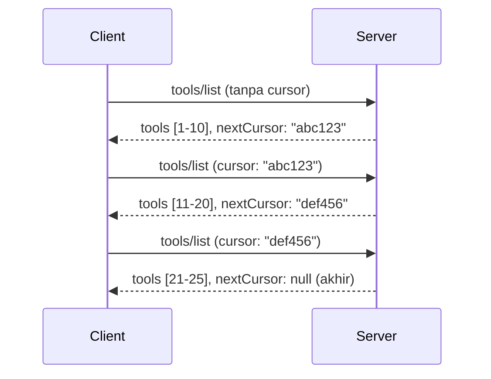

# Paginasi dan Set Hasil Besar di MCP

Ketika server MCP Anda menangani dataset besar - apakah itu daftar ribuan file, catatan database, atau hasil pencarian - Anda memerlukan paginasi untuk mengelola memori secara efisien dan memberikan pengalaman pengguna yang responsif. Panduan ini membahas cara mengimplementasikan dan menggunakan paginasi di MCP.

## Mengapa Paginasi Penting

Tanpa paginasi, respons besar dapat menyebabkan:

- **Kehabisan memori** - Memuat jutaan catatan sekaligus
- **Waktu respons lambat** - Pengguna menunggu saat semua data dimuat
- **Kesalahan timeout** - Permintaan melewati batas waktu
- **Performa AI yang buruk** - LLM kesulitan dengan konteks yang sangat besar

MCP menggunakan **paginasi berbasis kursor** untuk pemetaan halaman yang andal dan konsisten melalui set hasil.

---

## Cara Kerja Paginasi MCP

### Konsep Kursor

**Kursor** adalah string opak yang menandai posisi Anda dalam set hasil. Anggap seperti penanda buku dalam buku yang panjang.


### Paginasi dalam Metode MCP

Metode MCP berikut mendukung paginasi:

| Metode | Mengembalikan | Dukungan Kursor |
|--------|---------------|-----------------|
| `tools/list` | Definisi alat | ✅ |
| `resources/list` | Definisi sumber daya | ✅ |
| `prompts/list` | Definisi prompt | ✅ |
| `resources/templates/list` | Template sumber daya | ✅ |

---

## Implementasi Server

### Python (FastMCP)

```python
from mcp.server import Server
from mcp.types import Tool, ListToolsResult
import math

app = Server("paginated-server")

# Dataset besar yang disimulasikan
ALL_TOOLS = [
    Tool(name=f"tool_{i}", description=f"Tool number {i}", inputSchema={})
    for i in range(100)
]

PAGE_SIZE = 10

@app.list_tools()
async def list_tools(cursor: str | None = None) -> ListToolsResult:
    """List tools with pagination support."""
    
    # Dekode kursor untuk mendapatkan indeks awal
    start_index = 0
    if cursor:
        try:
            start_index = int(cursor)
        except ValueError:
            start_index = 0
    
    # Dapatkan halaman hasil
    end_index = min(start_index + PAGE_SIZE, len(ALL_TOOLS))
    page_tools = ALL_TOOLS[start_index:end_index]
    
    # Hitung kursor berikutnya
    next_cursor = None
    if end_index < len(ALL_TOOLS):
        next_cursor = str(end_index)
    
    return ListToolsResult(
        tools=page_tools,
        nextCursor=next_cursor
    )
```

### TypeScript

```typescript
import { Server } from "@modelcontextprotocol/sdk/server/index.js";
import { ListToolsResultSchema } from "@modelcontextprotocol/sdk/types.js";

const server = new Server({
  name: "paginated-server",
  version: "1.0.0"
});

// Dataset besar yang disimulasikan
const ALL_TOOLS = Array.from({ length: 100 }, (_, i) => ({
  name: `tool_${i}`,
  description: `Tool number ${i}`,
  inputSchema: { type: "object", properties: {} }
}));

const PAGE_SIZE = 10;

server.setRequestHandler(ListToolsResultSchema, async (request) => {
  // Dekode kursor
  let startIndex = 0;
  if (request.params?.cursor) {
    startIndex = parseInt(request.params.cursor, 10) || 0;
  }
  
  // Ambil halaman hasil
  const endIndex = Math.min(startIndex + PAGE_SIZE, ALL_TOOLS.length);
  const pageTools = ALL_TOOLS.slice(startIndex, endIndex);
  
  // Hitung kursor berikutnya
  const nextCursor = endIndex < ALL_TOOLS.length ? String(endIndex) : undefined;
  
  return {
    tools: pageTools,
    nextCursor
  };
});
```

### Java (Spring MCP)

```java
@Service
public class PaginatedToolService {
    
    private static final int PAGE_SIZE = 10;
    private final List<Tool> allTools;
    
    public PaginatedToolService() {
        // Inisialisasi dataset besar
        this.allTools = IntStream.range(0, 100)
            .mapToObj(i -> new Tool("tool_" + i, "Tool number " + i, Map.of()))
            .collect(Collectors.toList());
    }
    
    @McpMethod("tools/list")
    public ListToolsResult listTools(@Param("cursor") String cursor) {
        // Dekode kursor
        int startIndex = 0;
        if (cursor != null && !cursor.isEmpty()) {
            try {
                startIndex = Integer.parseInt(cursor);
            } catch (NumberFormatException e) {
                startIndex = 0;
            }
        }
        
        // Dapatkan halaman hasil
        int endIndex = Math.min(startIndex + PAGE_SIZE, allTools.size());
        List<Tool> pageTools = allTools.subList(startIndex, endIndex);
        
        // Hitung kursor berikutnya
        String nextCursor = endIndex < allTools.size() ? String.valueOf(endIndex) : null;
        
        return new ListToolsResult(pageTools, nextCursor);
    }
}
```

---

## Implementasi Klien

### Klien Python

```python
from mcp import ClientSession

async def get_all_tools(session: ClientSession) -> list:
    """Fetch all tools using pagination."""
    all_tools = []
    cursor = None
    
    while True:
        result = await session.list_tools(cursor=cursor)
        all_tools.extend(result.tools)
        
        if result.nextCursor is None:
            break
        cursor = result.nextCursor
    
    return all_tools

# Penggunaan
async with client_session as session:
    tools = await get_all_tools(session)
    print(f"Found {len(tools)} tools")
```

### Klien TypeScript

```typescript
import { Client } from "@modelcontextprotocol/sdk/client/index.js";

async function getAllTools(client: Client): Promise<Tool[]> {
  const allTools: Tool[] = [];
  let cursor: string | undefined = undefined;
  
  do {
    const result = await client.listTools({ cursor });
    allTools.push(...result.tools);
    cursor = result.nextCursor;
  } while (cursor);
  
  return allTools;
}

// Penggunaan
const tools = await getAllTools(client);
console.log(`Found ${tools.length} tools`);
```

### Pola Lazy Loading

Untuk dataset yang sangat besar, muat halaman sesuai permintaan:

```python
class PaginatedToolIterator:
    """Lazily iterate through paginated tools."""
    
    def __init__(self, session: ClientSession):
        self.session = session
        self.cursor = None
        self.buffer = []
        self.exhausted = False
    
    async def __anext__(self):
        # Kembalikan dari buffer jika tersedia
        if self.buffer:
            return self.buffer.pop(0)
        
        # Periksa apakah kita telah menghabiskan semua halaman
        if self.exhausted:
            raise StopAsyncIteration
        
        # Ambil halaman berikutnya
        result = await self.session.list_tools(cursor=self.cursor)
        self.buffer = list(result.tools)
        self.cursor = result.nextCursor
        
        if self.cursor is None:
            self.exhausted = True
        
        if not self.buffer:
            raise StopAsyncIteration
        
        return self.buffer.pop(0)
    
    def __aiter__(self):
        return self

# Penggunaan - efisien memori untuk dataset besar
async for tool in PaginatedToolIterator(session):
    process_tool(tool)
```

---

## Paginasi untuk Sumber Daya

Sumber daya sering membutuhkan paginasi untuk direktori atau dataset besar:

```python
from mcp.server import Server
from mcp.types import Resource, ListResourcesResult
import os

app = Server("file-server")

@app.list_resources()
async def list_resources(cursor: str | None = None) -> ListResourcesResult:
    """List files in directory with pagination."""
    
    directory = "/data/files"
    all_files = sorted(os.listdir(directory))
    
    # Dekode kursor (indeks file)
    start_index = int(cursor) if cursor else 0
    page_size = 20
    end_index = min(start_index + page_size, len(all_files))
    
    # Buat daftar sumber daya untuk halaman ini
    resources = []
    for filename in all_files[start_index:end_index]:
        filepath = os.path.join(directory, filename)
        resources.append(Resource(
            uri=f"file://{filepath}",
            name=filename,
            mimeType="application/octet-stream"
        ))
    
    # Hitung kursor berikutnya
    next_cursor = str(end_index) if end_index < len(all_files) else None
    
    return ListResourcesResult(
        resources=resources,
        nextCursor=next_cursor
    )
```

---

## Strategi Desain Kursor

### Strategi 1: Berdasarkan Indeks (Sederhana)

```python
# Kursor hanyalah indeks
cursor = "50"  # Mulai dari item 50
```

**Kelebihan:** Sederhana, tanpa status  
**Kekurangan:** Hasil dapat bergeser jika item ditambah/dihapus

### Strategi 2: Berdasarkan ID (Stabil)

```python
# Kursor adalah ID yang terakhir terlihat
cursor = "item_abc123"  # Mulai setelah item ini
```

**Kelebihan:** Stabil meskipun item berubah  
**Kekurangan:** Memerlukan ID yang terurut

### Strategi 3: Status Terenkripsi (Kompleks)

```python
import base64
import json

def encode_cursor(state: dict) -> str:
    return base64.b64encode(json.dumps(state).encode()).decode()

def decode_cursor(cursor: str) -> dict:
    return json.loads(base64.b64decode(cursor).decode())

# Kursor berisi beberapa bidang status
cursor = encode_cursor({
    "offset": 50,
    "filter": "active",
    "sort": "name"
})
```

**Kelebihan:** Dapat mengenkripsi status kompleks  
**Kekurangan:** Lebih kompleks, string kursor lebih besar

---

## Praktik Terbaik

### 1. Pilih Ukuran Halaman yang Tepat

```python
# Pertimbangkan ukuran data
PAGE_SIZE_SMALL_ITEMS = 100   # Metadata sederhana
PAGE_SIZE_MEDIUM_ITEMS = 20   # Objek yang lebih kaya
PAGE_SIZE_LARGE_ITEMS = 5     # Konten kompleks
```

### 2. Tangani Kursor Tidak Valid dengan Baik

```python
@app.list_tools()
async def list_tools(cursor: str | None = None) -> ListToolsResult:
    try:
        start_index = int(cursor) if cursor else 0
        if start_index < 0 or start_index >= len(ALL_TOOLS):
            start_index = 0  # Atur ulang ke awal
    except (ValueError, TypeError):
        start_index = 0  # Kursor tidak valid, mulai dari awal
    # ...
```

### 3. Sertakan Jumlah Total (Opsional)

```python
return ListToolsResult(
    tools=page_tools,
    nextCursor=next_cursor,
    # Beberapa implementasi menyertakan total untuk kemajuan UI
    _meta={"total": len(ALL_TOOLS)}
)
```

### 4. Uji Kasus Tepian

```python
async def test_pagination():
    # Hasil kosong
    result = await session.list_tools()
    assert result.tools == []
    assert result.nextCursor is None
    
    # Halaman tunggal
    result = await session.list_tools()
    assert len(result.tools) <= PAGE_SIZE
    
    # Kursor tidak valid
    result = await session.list_tools(cursor="invalid")
    assert result.tools  # Harus mengembalikan halaman pertama
```

---

## Kesalahan Umum

### ❌ Mengembalikan Semua Hasil Lalu Melakukan Paginasi di Klien

```python
# BURUK: Memuat semuanya ke dalam memori
@app.list_tools()
async def list_tools() -> ListToolsResult:
    all_tools = load_all_tools()  # 1 juta alat!
    return ListToolsResult(tools=all_tools)
```

### ✅ Paginasi di Sumber Data

```python
# BAGUS: Hanya memuat apa yang dibutuhkan
@app.list_tools()
async def list_tools(cursor: str | None = None) -> ListToolsResult:
    offset = int(cursor) if cursor else 0
    tools = await db.query_tools(offset=offset, limit=PAGE_SIZE)
    return ListToolsResult(tools=tools, nextCursor=...)
```

---

## Apa Selanjutnya

- [Modul 5.14 - Teknik Konteks](../../05-AdvancedTopics/mcp-contextengineering/README.md)  
- [Modul 8 - Praktik Terbaik](../../08-BestPractices/README.md)  
- [3.8 - Menguji Server MCP Anda](../../03-GettingStarted/08-testing/README.md)  

---

## Sumber Daya Tambahan

- [Spesifikasi MCP - Paginasi](https://spec.modelcontextprotocol.io/specification/2025-11-25/)  
- [Penjelasan Paginasi Berbasis Kursor](https://slack.engineering/evolving-api-pagination-at-slack/)  
- [Tes paginasi Python SDK](https://github.com/modelcontextprotocol/python-sdk/blob/main/tests/client/test_list_methods_cursor.py)

---

<!-- CO-OP TRANSLATOR DISCLAIMER START -->
**Penafian**:  
Dokumen ini telah diterjemahkan menggunakan layanan terjemahan AI [Co-op Translator](https://github.com/Azure/co-op-translator). Meskipun kami berupaya untuk mencapai keakuratan, harap diingat bahwa terjemahan otomatis mungkin mengandung kesalahan atau ketidakakuratan. Dokumen asli dalam bahasa aslinya harus dianggap sebagai sumber yang berwenang. Untuk informasi penting, disarankan menggunakan jasa penerjemahan profesional oleh manusia. Kami tidak bertanggung jawab atas kesalahpahaman atau salah tafsir yang timbul dari penggunaan terjemahan ini.
<!-- CO-OP TRANSLATOR DISCLAIMER END -->