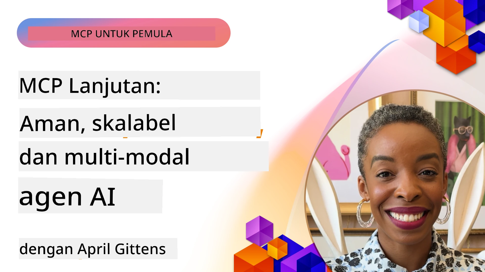

# Topik Lanjutan dalam MCP

_(Klik gambar di atas untuk menonton video pelajaran ini)_

Bab ini membahas serangkaian topik lanjutan dalam implementasi Model Context Protocol (MCP), termasuk integrasi multi-modal, skalabilitas, praktik keamanan terbaik, dan integrasi enterprise. Topik-topik ini sangat penting untuk membangun aplikasi MCP yang tangguh dan siap produksi yang dapat memenuhi tuntutan sistem AI modern.

## Ikhtisar

Pelajaran ini mengeksplorasi konsep lanjutan dalam implementasi Model Context Protocol, dengan fokus pada integrasi multi-modal, skalabilitas, praktik keamanan terbaik, dan integrasi enterprise. Topik-topik ini esensial untuk membangun aplikasi MCP tingkat produksi yang dapat menangani kebutuhan kompleks dalam lingkungan enterprise.

## Tujuan Pembelajaran

Pada akhir pelajaran ini, Anda akan dapat:

- Mengimplementasikan kemampuan multi-modal dalam kerangka kerja MCP
- Merancang arsitektur MCP yang skalabel untuk skenario dengan permintaan tinggi
- Menerapkan praktik keamanan terbaik yang selaras dengan prinsip keamanan MCP
- Mengintegrasikan MCP dengan sistem dan kerangka kerja AI enterprise
- Mengoptimalkan kinerja dan keandalan di lingkungan produksi

## Pelajaran dan Proyek Contoh

| Link | Judul | Deskripsi |
|------|-------|-------------|
| [5.1 Integration with Azure](./mcp-integration/README.md) | Integrasi dengan Azure | Pelajari cara mengintegrasikan Server MCP Anda di Azure |
| [5.2 Multi modal sample](./mcp-multi-modality/README.md) | Contoh Multi Modal MCP | Contoh untuk audio, gambar, dan respons multi modal |
| [5.3 MCP OAuth2 sample](../../../05-AdvancedTopics/mcp-oauth2-demo) | Demo MCP OAuth2 | Aplikasi Spring Boot minimal yang menunjukkan OAuth2 dengan MCP, baik sebagai Authorization maupun Resource Server. Menunjukkan penerbitan token yang aman, endpoint terlindungi, penyebaran Azure Container Apps, dan integrasi API Management. |
| [5.4 Root Contexts](./mcp-root-contexts/README.md) | Root contexts | Pelajari lebih lanjut tentang root context dan cara mengimplementasikannya |
| [5.5 Routing](./mcp-routing/README.md) | Routing | Pelajari berbagai jenis routing |
| [5.6 Sampling](./mcp-sampling/README.md) | Sampling | Pelajari cara kerja dengan sampling |
| [5.7 Scaling](./mcp-scaling/README.md) | Skalabilitas | Pelajari tentang scaling |
| [5.8 Security](./mcp-security/README.md) | Keamanan | Amankan Server MCP Anda |
| [5.9 Web Search sample](./web-search-mcp/README.md) | Web Search MCP | Server dan klien MCP Python yang mengintegrasikan dengan SerpAPI untuk pencarian web, berita, produk, dan tanya jawab secara real-time. Menunjukkan orkestrasi multi-alat, integrasi API eksternal, dan penanganan kesalahan yang kuat. |
| [5.10 Realtime Streaming](./mcp-realtimestreaming/README.md) | Streaming | Streaming data real-time kini sangat penting di dunia yang didorong data saat ini, dimana bisnis dan aplikasi membutuhkan akses langsung ke informasi untuk pengambilan keputusan yang tepat waktu. |
| [5.11 Realtime Web Search](./mcp-realtimesearch/README.md) | Pencarian Web | Pencarian web real-time bagaimana MCP mengubah pencarian web real-time dengan menyediakan pendekatan standar untuk manajemen konteks di antara model AI, mesin pencari, dan aplikasi. |
| [5.12 Entra ID Authentication for Model Context Protocol Servers](./mcp-security-entra/README.md) | Autentikasi Entra ID | Microsoft Entra ID menyediakan solusi manajemen identitas dan akses berbasis cloud yang tangguh, membantu memastikan hanya pengguna dan aplikasi yang berwenang dapat berinteraksi dengan server MCP Anda. |
| [5.13 Azure AI Foundry Agent Integration](./mcp-foundry-agent-integration/README.md) | Integrasi Azure AI Foundry | Pelajari cara mengintegrasikan server Model Context Protocol dengan agen Azure AI Foundry, memungkinkan orkestrasi alat yang kuat dan kemampuan AI enterprise dengan koneksi sumber data eksternal yang standar. |
| [5.14 Context Engineering](./mcp-contextengineering/README.md) | Rekayasa Konteks | Peluang masa depan teknik rekayasa konteks untuk server MCP, termasuk optimasi konteks, manajemen konteks dinamis, dan strategi untuk rekayasa prompt efektif dalam kerangka MCP. |
| [5.15 MCP Custom Transport](./mcp-transport/README.md) | Transportasi Kustom | Pelajari cara mengimplementasikan mekanisme transportasi khusus untuk skenario komunikasi MCP yang spesifik. |
| [5.16 Protocol Features Deep Dive](./mcp-protocol-features/README.md) | Fitur Protokol | Kuasai fitur protokol lanjutan termasuk notifikasi kemajuan, pembatalan permintaan, template sumber daya, dan pola penanganan kesalahan. |

> **Baru di Spesifikasi MCP 2025-11-25**: Spesifikasi kini mencakup dukungan eksperimental untuk **Tugas** (operasi jangka panjang dengan pelacakan kemajuan), **Anotasi Alat** (metadata tentang perilaku alat untuk keamanan), **URL Mode Elicitation** (permintaan konten URL spesifik dari klien), dan **Roots** yang ditingkatkan (untuk manajemen konteks ruang kerja). Lihat [changelog Spesifikasi MCP](https://spec.modelcontextprotocol.io/) untuk detail lengkap.

## Referensi Tambahan

Untuk informasi terkini tentang topik MCP lanjutan, lihat:
- [Dokumentasi MCP](https://modelcontextprotocol.io/)
- [Spesifikasi MCP (2025-11-25)](https://spec.modelcontextprotocol.io/specification/2025-11-25/)
- [Repositori GitHub](https://github.com/modelcontextprotocol)
- [OWASP MCP Top 10](https://microsoft.github.io/mcp-azure-security-guide/mcp/) - Risiko keamanan dan mitigasi
- [Workshop MCP Security Summit (Sherpa)](https://azure-samples.github.io/sherpa/) - Pelatihan keamanan langsung

## Poin Penting

- Implementasi MCP multi-modal memperluas kemampuan AI di luar pemrosesan teks
- Skalabilitas penting untuk penyebaran enterprise dan dapat diatasi melalui scaling horizontal dan vertikal
- Tindakan keamanan yang komprehensif melindungi data dan memastikan kontrol akses yang tepat
- Integrasi enterprise dengan platform seperti Azure OpenAI dan Microsoft AI Foundry meningkatkan kemampuan MCP
- Implementasi MCP lanjutan mendapat manfaat dari arsitektur yang dioptimalkan dan manajemen sumber daya yang hati-hati

## Latihan

Rancang implementasi MCP tingkat enterprise untuk kasus penggunaan spesifik:

1. Identifikasi kebutuhan multi-modal untuk kasus penggunaan Anda
2. Gariskan kontrol keamanan yang diperlukan untuk melindungi data sensitif
3. Rancang arsitektur yang skalabel yang dapat menangani beban yang bervariasi
4. Rencanakan titik integrasi dengan sistem AI enterprise
5. Dokumentasikan potensi kemacetan kinerja dan strategi mitigasinya

## Sumber Daya Tambahan

- [Dokumentasi Azure OpenAI](https://learn.microsoft.com/en-us/azure/ai-services/openai/)
- [Dokumentasi Microsoft AI Foundry](https://learn.microsoft.com/en-us/ai-services/)

---

## Selanjutnya

Jelajahi pelajaran dalam modul ini mulai dengan: [5.1 Integrasi MCP](./mcp-integration/README.md)

Setelah Anda menyelesaikan modul ini, lanjutkan ke: [Modul 6: Kontribusi Komunitas](../06-CommunityContributions/README.md)

---

<!-- CO-OP TRANSLATOR DISCLAIMER START -->
**Penafian**:  
Dokumen ini telah diterjemahkan menggunakan layanan terjemahan AI [Co-op Translator](https://github.com/Azure/co-op-translator). Meskipun kami berusaha untuk akurat, harap diperhatikan bahwa terjemahan otomatis mungkin mengandung kesalahan atau ketidaktepatan. Dokumen asli dalam bahasa aslinya harus dianggap sebagai sumber otoritatif. Untuk informasi penting, disarankan menggunakan terjemahan profesional oleh manusia. Kami tidak bertanggung jawab atas kesalahpahaman atau salah tafsir yang timbul akibat penggunaan terjemahan ini.
<!-- CO-OP TRANSLATOR DISCLAIMER END -->