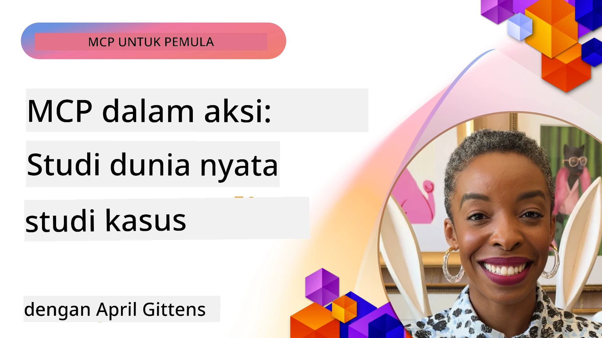

# MCP dalam Aksi: Studi Kasus Dunia Nyata

_(Klik gambar di atas untuk menonton video pelajaran ini)_

Model Context Protocol (MCP) mengubah cara aplikasi AI berinteraksi dengan data, alat, dan layanan. Bagian ini menyajikan studi kasus dunia nyata yang menunjukkan aplikasi praktis MCP dalam berbagai skenario perusahaan.

## Ikhtisar

Bagian ini menampilkan contoh konkret implementasi MCP, menyoroti bagaimana organisasi memanfaatkan protokol ini untuk menyelesaikan tantangan bisnis yang kompleks. Dengan memeriksa studi kasus ini, Anda akan memperoleh wawasan tentang fleksibilitas, skalabilitas, dan manfaat praktis MCP dalam skenario dunia nyata.

## Tujuan Pembelajaran Utama

Dengan mengeksplorasi studi kasus ini, Anda akan:

- Memahami bagaimana MCP dapat diterapkan untuk menyelesaikan masalah bisnis tertentu
- Mempelajari pola integrasi dan pendekatan arsitektur yang berbeda
- Mengenali praktik terbaik untuk mengimplementasikan MCP di lingkungan perusahaan
- Mendapatkan wawasan tentang tantangan dan solusi yang ditemui dalam implementasi dunia nyata
- Mengidentifikasi peluang untuk menerapkan pola serupa dalam proyek Anda sendiri

## Studi Kasus Unggulan

### 1. [Azure AI Travel Agents – Implementasi Referensi](./travelagentsample.md)

Studi kasus ini menelaah solusi referensi komprehensif Microsoft yang menunjukkan cara membangun aplikasi perencanaan perjalanan bertenaga AI multi-agent menggunakan MCP, Azure OpenAI, dan Azure AI Search. Proyek ini menampilkan:

- Orkestrasi multi-agent melalui MCP
- Integrasi data perusahaan dengan Azure AI Search
- Arsitektur aman dan skalabel menggunakan layanan Azure
- Alat yang dapat diperluas dengan komponen MCP yang dapat digunakan kembali
- Pengalaman pengguna percakapan yang didukung oleh Azure OpenAI

Arsitektur dan detail implementasi memberikan wawasan berharga dalam membangun sistem multi-agent kompleks dengan MCP sebagai lapisan koordinasi.

### 2. [Memperbarui Item Azure DevOps dari Data YouTube](./UpdateADOItemsFromYT.md)

Studi kasus ini menunjukkan aplikasi praktis MCP untuk mengotomatisasi proses alur kerja. Ini menunjukkan bagaimana alat MCP dapat digunakan untuk:

- Mengekstrak data dari platform online (YouTube)
- Memperbarui item kerja dalam sistem Azure DevOps
- Membuat alur kerja otomatisasi yang dapat diulang
- Mengintegrasikan data di berbagai sistem yang berbeda

Contoh ini menggambarkan bagaimana implementasi MCP yang relatif sederhana dapat memberikan peningkatan efisiensi signifikan dengan mengotomatisasi tugas rutin dan meningkatkan konsistensi data di berbagai sistem.

### 3. [Pengambilan Dokumentasi Waktu Nyata dengan MCP](./docs-mcp/README.md)

Studi kasus ini membimbing Anda melalui proses menghubungkan klien konsol Python ke server Model Context Protocol (MCP) untuk mengambil dan merekam dokumentasi Microsoft kontekstual dan waktu nyata. Anda akan belajar bagaimana:

- Menghubungkan ke server MCP menggunakan klien Python dan SDK MCP resmi
- Menggunakan klien HTTP streaming untuk pengambilan data waktu nyata yang efisien
- Memanggil alat dokumentasi di server dan merekam respons langsung ke konsol
- Mengintegrasikan dokumentasi Microsoft terbaru ke alur kerja Anda tanpa meninggalkan terminal

Bab ini mencakup tugas langsung, contoh kode kerja minimal, dan tautan ke sumber daya tambahan untuk pembelajaran lebih mendalam. Lihat panduan lengkap dan kode di bab terkait untuk memahami bagaimana MCP dapat mengubah akses dokumentasi dan produktivitas pengembang di lingkungan berbasis konsol.

### 4. [Aplikasi Web Generator Rencana Belajar Interaktif dengan MCP](./docs-mcp/README.md)

Studi kasus ini menunjukkan cara membangun aplikasi web interaktif menggunakan Chainlit dan Model Context Protocol (MCP) untuk menghasilkan rencana belajar yang dipersonalisasi untuk topik apa pun. Pengguna dapat menentukan subjek (seperti "sertifikasi AI-900") dan durasi belajar (misalnya, 8 minggu), dan aplikasi akan menyediakan rincian konten yang direkomendasikan per minggu. Chainlit memungkinkan antarmuka obrolan percakapan, membuat pengalaman menjadi menarik dan adaptif.

- Aplikasi web percakapan yang didukung oleh Chainlit
- Prompt yang digerakkan pengguna untuk topik dan durasi
- Rekomendasi konten mingguan menggunakan MCP
- Respons adaptif waktu nyata dalam antarmuka obrolan

Proyek ini mengilustrasikan bagaimana AI percakapan dan MCP dapat digabungkan untuk menciptakan alat pendidikan yang dinamis dan digerakkan oleh pengguna di lingkungan web modern.

### 5. [Dokumentasi Dalam Editor dengan Server MCP di VS Code](./docs-mcp/README.md)

Studi kasus ini menunjukkan bagaimana Anda dapat menghadirkan Microsoft Learn Docs langsung ke lingkungan VS Code Anda menggunakan server MCP—tidak perlu lagi berganti tab browser! Anda akan melihat bagaimana cara:

- Mencari dan membaca dokumentasi secara instan di dalam VS Code menggunakan panel MCP atau palet perintah
- Merujuk dokumentasi dan memasukkan tautan langsung ke README atau file markdown kursus Anda
- Menggunakan GitHub Copilot dan MCP bersama untuk alur kerja dokumentasi dan kode bertenaga AI tanpa hambatan
- Memvalidasi dan meningkatkan dokumentasi Anda dengan umpan balik waktu nyata dan akurasi sumber Microsoft
- Mengintegrasikan MCP dengan alur kerja GitHub untuk validasi dokumentasi berkelanjutan

Implementasinya meliputi:

- Konfigurasi `.vscode/mcp.json` contoh untuk pengaturan mudah
- Panduan berbasis tangkapan layar pengalaman dalam editor
- Tips menggabungkan Copilot dan MCP untuk produktivitas maksimal

Skenario ini ideal untuk penulis kursus, penulis dokumentasi, dan pengembang yang ingin tetap fokus di editor sambil bekerja dengan docs, Copilot, dan alat validasi—semua didukung oleh MCP.

### 6. [Pembuatan Server APIM MCP](./apimsample.md)

Studi kasus ini memberikan panduan langkah demi langkah tentang cara membuat server MCP menggunakan Azure API Management (APIM). Ini mencakup:

- Menyiapkan server MCP di Azure API Management
- Mengekspos operasi API sebagai alat MCP
- Mengonfigurasi kebijakan untuk pembatasan kecepatan dan keamanan
- Menguji server MCP menggunakan Visual Studio Code dan GitHub Copilot

Contoh ini menunjukkan bagaimana memanfaatkan kemampuan Azure untuk membuat server MCP yang tangguh yang dapat digunakan dalam berbagai aplikasi, meningkatkan integrasi sistem AI dengan API perusahaan.

### 7. [GitHub MCP Registry — Mempercepat Integrasi Agenik](https://github.com/mcp)

Studi kasus ini menelaah bagaimana GitHub MCP Registry, yang diluncurkan pada September 2025, mengatasi tantangan penting dalam ekosistem AI: penemuan dan penyebaran Model Context Protocol (MCP) server yang terfragmentasi.

#### Ikhtisar
**MCP Registry** memecahkan masalah yang berkembang akibat tersebarnya server MCP di berbagai repositori dan registri, yang sebelumnya membuat integrasi lambat dan rentan kesalahan. Server ini memungkinkan agen AI berinteraksi dengan sistem eksternal seperti API, basis data, dan sumber dokumentasi.

#### Pernyataan Masalah
Pengembang yang membangun alur kerja agenik menghadapi beberapa tantangan:
- **Penemuan server MCP yang buruk** di berbagai platform
- **Pertanyaan pengaturan yang berulang** tersebar di forum dan dokumentasi
- **Risiko keamanan** dari sumber yang tidak diverifikasi dan tidak tepercaya
- **Kurangnya standar** dalam kualitas dan kompatibilitas server

#### Arsitektur Solusi
GitHub MCP Registry memusatkan server MCP terpercaya dengan fitur utama:
- **Instalasi sekali klik** terintegrasi melalui VS Code untuk pengaturan yang mudah
- **Pengurutan sinyal-dari-noise** berdasarkan bintang, aktivitas, dan validasi komunitas
- **Integrasi langsung** dengan GitHub Copilot dan alat kompatibel MCP lainnya
- **Model kontribusi terbuka** memungkinkan komunitas dan mitra perusahaan untuk berkontribusi

#### Dampak Bisnis
Registry telah memberikan peningkatan terukur:
- **Onboarding lebih cepat** bagi pengembang menggunakan alat seperti Microsoft Learn MCP Server, yang memutar dokumentasi resmi langsung ke dalam agen
- **Produktivitas meningkat** melalui server khusus seperti `github-mcp-server`, yang memungkinkan otomasi GitHub bahasa alami (pembuatan PR, pengulangan CI, pemindaian kode)
- **Kepercayaan ekosistem lebih kuat** melalui daftar kurasi dan standar konfigurasi yang transparan

#### Nilai Strategis
Bagi praktisi yang mengkhususkan diri dalam manajemen siklus hidup agen dan alur kerja yang dapat direproduksi, MCP Registry menyediakan:
- **Kemampuan penyebaran agen modular** dengan komponen standar
- **Pipeline evaluasi berbasis registry** untuk pengujian dan validasi konsisten
- **Interoperabilitas lintas alat** yang memungkinkan integrasi mulus di berbagai platform AI

Studi kasus ini menunjukkan bahwa MCP Registry lebih dari sekadar direktori—ini adalah platform fundamental untuk integrasi model yang skalabel dan penyebaran sistem agenik dunia nyata.

## Kesimpulan

Ketujuh studi kasus komprehensif ini menunjukkan fleksibilitas luar biasa dan aplikasi praktis Model Context Protocol di berbagai skenario dunia nyata. Dari sistem perencanaan perjalanan multi-agent yang kompleks dan manajemen API perusahaan hingga alur kerja dokumentasi yang efisien serta revolusioner GitHub MCP Registry, contoh-contoh ini memperlihatkan bagaimana MCP menyediakan cara standar dan skalabel untuk menghubungkan sistem AI dengan alat, data, dan layanan yang mereka perlukan untuk memberikan nilai luar biasa.

Studi kasus mencakup berbagai dimensi implementasi MCP:
- **Integrasi Perusahaan**: Manajemen API Azure dan otomatisasi Azure DevOps
- **Orkestrasi Multi-Agent**: Perencanaan perjalanan dengan agen AI terkoordinasi
- **Produktivitas Pengembang**: Integrasi VS Code dan akses dokumentasi waktu nyata
- **Pengembangan Ekosistem**: GitHub MCP Registry sebagai platform dasar
- **Aplikasi Pendidikan**: Generator rencana belajar interaktif dan antarmuka percakapan

Dengan mempelajari implementasi ini, Anda mendapatkan wawasan penting tentang:
- **Pola arsitektur** untuk berbagai skala dan kasus penggunaan
- **Strategi implementasi** yang menyeimbangkan fungsionalitas dan pemeliharaan
- **Pertimbangan keamanan dan skalabilitas** untuk penyebaran produksi
- **Praktik terbaik** untuk pengembangan server MCP dan integrasi klien
- **Pemikiran ekosistem** untuk membangun solusi bertenaga AI yang saling terhubung

Contoh-contoh ini secara kolektif menunjukkan bahwa MCP bukan hanya kerangka teoretis tetapi protokol matang siap produksi yang memungkinkan solusi praktis untuk tantangan bisnis kompleks. Baik Anda membangun alat otomatisasi sederhana atau sistem multi-agent canggih, pola dan pendekatan yang diilustrasikan di sini menyediakan fondasi kokoh untuk proyek MCP Anda sendiri.

## Sumber Daya Tambahan

- [Repositori GitHub Azure AI Travel Agents](https://github.com/Azure-Samples/azure-ai-travel-agents)
- [Alat Azure DevOps MCP](https://github.com/microsoft/azure-devops-mcp)
- [Alat Playwright MCP](https://github.com/microsoft/playwright-mcp)
- [Server Microsoft Docs MCP](https://github.com/MicrosoftDocs/mcp)
- [GitHub MCP Registry — Mempercepat Integrasi Agenik](https://github.com/mcp)
- [Contoh Komunitas MCP](https://github.com/microsoft/mcp)

## Berikutnya

- Sebelumnya: [Modul 8: Praktik Terbaik](../08-BestPractices/README.md)
- Selanjutnya: [Modul 10: Menyederhanakan Alur Kerja AI: Membangun Server MCP dengan AI Toolkit](../10-StreamliningAIWorkflowsBuildingAnMCPServerWithAIToolkit/README.md)

---

<!-- CO-OP TRANSLATOR DISCLAIMER START -->
**Penafian**:
Dokumen ini telah diterjemahkan menggunakan layanan terjemahan AI [Co-op Translator](https://github.com/Azure/co-op-translator). Meskipun kami berupaya untuk memberikan terjemahan yang akurat, harap diingat bahwa terjemahan otomatis mungkin mengandung kesalahan atau ketidakakuratan. Dokumen asli dalam bahasa aslinya harus dianggap sebagai sumber yang sahih. Untuk informasi penting, disarankan menggunakan jasa terjemahan profesional oleh manusia. Kami tidak bertanggung jawab atas kesalahpahaman atau salah tafsir yang timbul dari penggunaan terjemahan ini.
<!-- CO-OP TRANSLATOR DISCLAIMER END -->