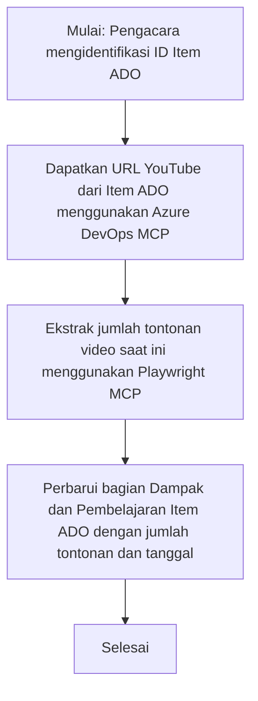

# Studi Kasus: Memperbarui Item Azure DevOps dari Data YouTube dengan MCP

> **Penafian:** Ada alat dan laporan online yang sudah ada yang dapat mengotomatisasi proses memperbarui item Azure DevOps dengan data dari platform seperti YouTube. Skenario berikut disediakan murni sebagai contoh kasus penggunaan untuk mengilustrasikan bagaimana alat MCP dapat diterapkan untuk tugas otomasi dan integrasi.

## Ikhtisar

Studi kasus ini menunjukkan satu contoh bagaimana Model Context Protocol (MCP) dan alatnya dapat digunakan untuk mengotomatisasi proses memperbarui work item Azure DevOps (ADO) dengan informasi yang bersumber dari platform online, seperti YouTube. Skenario yang dijelaskan hanyalah satu ilustrasi dari kemampuan luas alat ini, yang dapat disesuaikan untuk banyak kebutuhan otomasi serupa.

Dalam contoh ini, seorang Advocate melacak sesi online menggunakan item ADO, di mana setiap item berisi URL video YouTube. Dengan memanfaatkan alat MCP, Advocate dapat menjaga item ADO tetap diperbarui dengan metrik video terbaru, seperti jumlah penayangan, dengan cara yang dapat diulang dan otomatis. Pendekatan ini dapat digeneralisasi ke kasus penggunaan lain di mana informasi dari sumber online perlu diintegrasikan ke ADO atau sistem lain.

## Skenario

Seorang Advocate bertanggung jawab untuk melacak dampak sesi online dan keterlibatan komunitas. Setiap sesi dicatat sebagai work item ADO dalam proyek 'DevRel', dan work item tersebut berisi bidang untuk URL video YouTube. Untuk melaporkan jangkauan sesi dengan akurat, Advocate perlu memperbarui item ADO dengan jumlah penayangan video saat ini dan tanggal informasi ini diambil.

## Alat yang Digunakan

- [Azure DevOps MCP](https://github.com/microsoft/azure-devops-mcp): Memungkinkan akses dan pembaruan programatik ke work item ADO melalui MCP.
- [Playwright MCP](https://github.com/microsoft/playwright-mcp): Mengotomatisasi tindakan browser untuk mengekstrak data langsung dari halaman web, seperti statistik video YouTube.

## Alur Kerja Langkah-demi-Langkah

1. **Identifikasi Item ADO**: Mulai dengan ID work item ADO (misalnya, 1234) dalam proyek 'DevRel'.
2. **Ambil URL YouTube**: Gunakan alat Azure DevOps MCP untuk mendapatkan URL YouTube dari work item.
3. **Ekstrak Jumlah Penayangan Video**: Gunakan alat Playwright MCP untuk menavigasi ke URL YouTube dan mengambil jumlah penayangan saat ini.
4. **Perbarui Item ADO**: Tulis jumlah penayangan terbaru dan tanggal pengambilan ke dalam bagian 'Impact and Learnings' work item ADO menggunakan alat Azure DevOps MCP.

## Contoh Prompt

```bash
- Work with the ADO Item ID: 1234
- The project is '2025-Awesome'
- Get the YouTube URL for the ADO item
- Use Playwright to get the current views from the YouTube video
- Update the ADO item with the current video views and the updated date of the information
```

## Mermaid Flowchart


## Implementasi Teknis

- **Orkestrasi MCP**: Alur kerja diorkestrasi oleh server MCP, yang mengkoordinasikan penggunaan alat Azure DevOps MCP dan Playwright MCP.
- **Otomatisasi**: Proses dapat dipicu secara manual atau dijadwalkan berjalan secara berkala untuk menjaga item ADO tetap diperbarui.
- **Ekstensibilitas**: Pola yang sama dapat diperluas untuk memperbarui item ADO dengan metrik online lainnya (misalnya, suka, komentar) atau dari platform lain.

## Hasil dan Dampak

- **Efisiensi**: Mengurangi usaha manual bagi Advocate dengan mengotomatisasi pengambilan dan pembaruan metrik video.
- **Akurasi**: Memastikan item ADO mencerminkan data terbaru yang tersedia dari sumber online.
- **Dapat Diulang**: Menyediakan alur kerja yang dapat digunakan kembali untuk skenario serupa yang melibatkan sumber data atau metrik lain.

## Referensi

- [Azure DevOps MCP](https://github.com/microsoft/azure-devops-mcp)
- [Playwright MCP](https://github.com/microsoft/playwright-mcp)
- [Model Context Protocol (MCP)](https://modelcontextprotocol.io/)

## Selanjutnya

- Kembali ke: [Ikhtisar Studi Kasus](./README.md)
- Berikutnya: [Pengambilan Dokumentasi Real-Time dengan MCP](./docs-mcp/README.md)

---

<!-- CO-OP TRANSLATOR DISCLAIMER START -->
**Penafian**:  
Dokumen ini telah diterjemahkan menggunakan layanan terjemahan AI [Co-op Translator](https://github.com/Azure/co-op-translator). Meskipun kami berupaya mencapai akurasi, harap diingat bahwa terjemahan otomatis mungkin mengandung kesalahan atau ketidakakuratan. Dokumen asli dalam bahasa aslinya harus dianggap sebagai sumber yang sah dan otoritatif. Untuk informasi yang penting, disarankan menggunakan jasa terjemahan profesional oleh manusia. Kami tidak bertanggung jawab atas kesalahpahaman atau penafsiran yang salah yang timbul dari penggunaan terjemahan ini.
<!-- CO-OP TRANSLATOR DISCLAIMER END -->