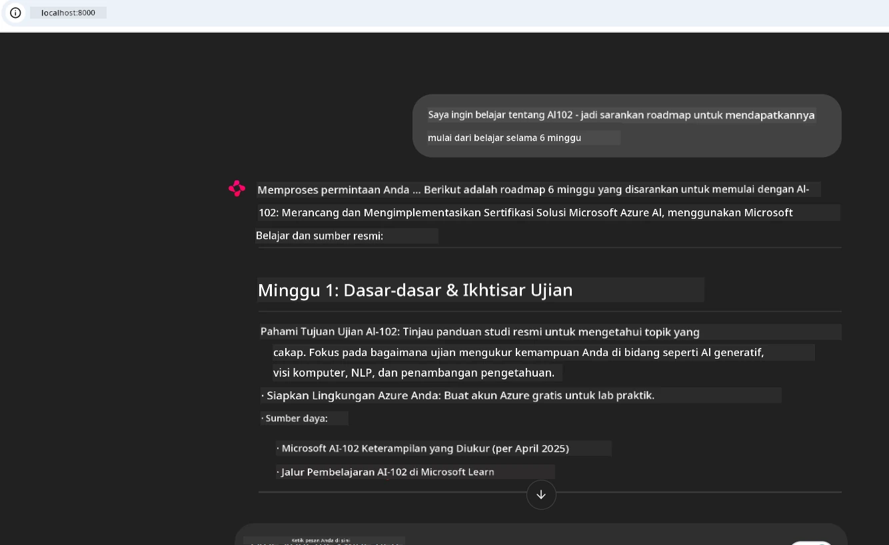
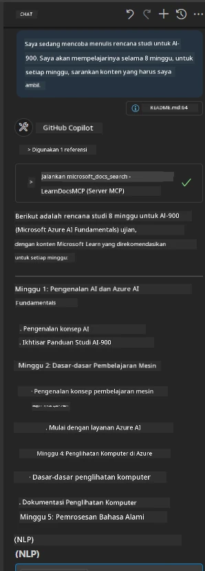

# Studi Kasus: Menghubungkan ke Microsoft Learn Docs MCP Server dari Klien

Pernahkah Anda merasa sibuk berpindah-pindah antara situs dokumentasi, Stack Overflow, dan tab mesin pencari yang tak ada habisnya, sambil mencoba memecahkan masalah di kode Anda? Mungkin Anda menyimpan monitor kedua hanya untuk dokumen, atau Anda terus-menerus beralih antara IDE dan browser. Bukankah akan lebih baik jika Anda bisa membawa dokumentasi itu langsung ke dalam alur kerja Anda—terintegrasi ke dalam aplikasi Anda, IDE Anda, atau bahkan alat kustom Anda sendiri? Dalam studi kasus ini, kami akan menjelajahi bagaimana melakukan hal itu dengan menghubungkan langsung ke Microsoft Learn Docs MCP server dari aplikasi klien Anda sendiri.

## Gambaran Umum

Pengembangan modern bukan hanya tentang menulis kode—ini tentang menemukan informasi yang tepat pada waktu yang tepat. Dokumentasi ada di mana-mana, tetapi jarang ada di tempat Anda paling membutuhkannya: di dalam alat dan alur kerja Anda. Dengan mengintegrasikan pengambilan dokumentasi langsung ke dalam aplikasi Anda, Anda dapat menghemat waktu, mengurangi pergantian konteks, dan meningkatkan produktivitas. Di bagian ini, kami akan menunjukkan cara menghubungkan klien ke Microsoft Learn Docs MCP server, sehingga Anda dapat mengakses dokumentasi kontekstual secara real-time tanpa pernah meninggalkan aplikasi Anda.

Kami akan menuntun Anda melalui proses membangun koneksi, mengirim permintaan, dan menangani respons streaming secara efisien. Pendekatan ini tidak hanya memperlancar alur kerja Anda, tetapi juga membuka pintu untuk membangun alat pengembang yang lebih cerdas dan berguna.

## Tujuan Pembelajaran

Mengapa kita melakukan ini? Karena pengalaman pengembang terbaik adalah yang menghilangkan hambatan. Bayangkan dunia dimana editor kode Anda, chatbot, atau aplikasi web dapat menjawab pertanyaan dokumentasi Anda dengan instan, menggunakan konten terbaru dari Microsoft Learn. Pada akhir bab ini, Anda akan tahu cara:

- Memahami dasar komunikasi server-klien MCP untuk dokumentasi
- Mengimplementasikan aplikasi konsol atau web untuk menghubungkan ke Microsoft Learn Docs MCP server
- Menggunakan klien HTTP streaming untuk pengambilan dokumentasi real-time
- Mencatat dan menginterpretasi respons dokumentasi dalam aplikasi Anda

Anda akan melihat bagaimana keterampilan ini dapat membantu Anda membangun alat yang bukan hanya reaktif, tetapi benar-benar interaktif dan sadar konteks.

## Skenario 1 - Pengambilan Dokumentasi Real-Time dengan MCP

Dalam skenario ini, kami akan menunjukkan cara menghubungkan klien ke Microsoft Learn Docs MCP server, sehingga Anda dapat mengakses dokumentasi kontekstual secara real-time tanpa meninggalkan aplikasi Anda.

Mari kita praktikkan ini. Tugas Anda adalah menulis aplikasi yang menghubungkan ke Microsoft Learn Docs MCP server, memanggil alat `microsoft_docs_search`, dan mencatat respons streaming ke konsol.

### Kenapa pendekatan ini?
Karena ini adalah fondasi untuk membangun integrasi yang lebih canggih—baik Anda ingin menggerakkan chatbot, ekstensi IDE, atau dashboard web.

Anda akan menemukan kode dan instruksi untuk skenario ini di folder [`solution`](./solution/README.md) dalam studi kasus ini. Langkah-langkahnya akan memandu Anda melalui pengaturan koneksi:
- Gunakan SDK MCP resmi dan klien HTTP yang mendukung streaming untuk koneksi
- Panggil alat `microsoft_docs_search` dengan parameter kueri untuk mengambil dokumentasi
- Terapkan pencatatan yang tepat dan penanganan kesalahan
- Buat antarmuka konsol interaktif supaya pengguna dapat memasukkan banyak kueri pencarian

Skenario ini memperlihatkan bagaimana:
- Menghubungkan ke Docs MCP server
- Mengirim kueri
- Mengurai dan mencetak hasil

Inilah contoh tampilan saat menjalankan solusi:

```
Prompt> What is Azure Key Vault?
Answer> Azure Key Vault is a cloud service for securely storing and accessing secrets. ...
```

Di bawah ini adalah contoh solusi minimal. Kode lengkap dan detail tersedia di folder solusi.

<details>
<summary>Python</summary>

```python
import asyncio
from mcp.client.streamable_http import streamablehttp_client
from mcp import ClientSession

async def main():
    async with streamablehttp_client("https://learn.microsoft.com/api/mcp") as (read_stream, write_stream, _):
        async with ClientSession(read_stream, write_stream) as session:
            await session.initialize()
            result = await session.call_tool("microsoft_docs_search", {"query": "Azure Functions best practices"})
            print(result.content)

if __name__ == "__main__":
    asyncio.run(main())
```

- Untuk implementasi lengkap dan pencatatan, lihat [`scenario1.py`](../../../../09-CaseStudy/docs-mcp/solution/python/scenario1.py).
- Untuk instruksi instalasi dan penggunaan, lihat file [`README.md`](./solution/python/README.md) di folder yang sama.
</details>


## Skenario 2 - Aplikasi Web Generator Rencana Studi Interaktif dengan MCP

Dalam skenario ini, Anda akan belajar cara mengintegrasikan Docs MCP ke dalam proyek pengembangan web. Tujuannya adalah memungkinkan pengguna mencari dokumentasi Microsoft Learn langsung dari antarmuka web, membuat dokumentasi dapat diakses secara instan dalam aplikasi atau situs Anda.

Anda akan melihat bagaimana cara:
- Menyiapkan aplikasi web
- Menghubungkan ke Docs MCP server
- Menangani input pengguna dan menampilkan hasil

Inilah contoh tampilan saat menjalankan solusi:

```
User> I want to learn about AI102 - so suggest the roadmap to get it started from learn for 6 weeks

Assistant> Here’s a detailed 6-week roadmap to start your preparation for the AI-102: Designing and Implementing a Microsoft Azure AI Solution certification, using official Microsoft resources and focusing on exam skills areas:

---
## Week 1: Introduction & Fundamentals
- **Understand the Exam**: Review the [AI-102 exam skills outline](https://learn.microsoft.com/en-us/credentials/certifications/exams/ai-102/).
- **Set up Azure**: Sign up for a free Azure account if you don't have one.
- **Learning Path**: [Introduction to Azure AI services](https://learn.microsoft.com/en-us/training/modules/intro-to-azure-ai/)
- **Focus**: Get familiar with Azure portal, AI capabilities, and necessary tools.

....more weeks of the roadmap...

Let me know if you want module-specific recommendations or need more customized weekly tasks!
```

Di bawah ini adalah contoh solusi minimal. Kode lengkap dan detail tersedia di folder solusi.



<details>
<summary>Python (Chainlit)</summary>

Chainlit adalah kerangka kerja untuk membangun aplikasi web AI percakapan. Ini memudahkan pembuatan chatbot interaktif dan asisten yang dapat memanggil alat MCP dan menampilkan hasil secara real-time. Ini ideal untuk prototipe cepat dan antarmuka ramah pengguna.

```python
import chainlit as cl
import requests

MCP_URL = "https://learn.microsoft.com/api/mcp"

@cl.on_message
def handle_message(message):
    query = {"question": message}
    response = requests.post(MCP_URL, json=query)
    if response.ok:
        result = response.json()
        cl.Message(content=result.get("answer", "No answer found.")).send()
    else:
        cl.Message(content="Error: " + response.text).send()
```

- Untuk implementasi lengkap, lihat [`scenario2.py`](../../../../09-CaseStudy/docs-mcp/solution/python/scenario2.py).
- Untuk instruksi pemasangan dan menjalankan, lihat [`README.md`](./solution/python/README.md).
</details>


## Skenario 3: Dokumentasi Dalam Editor dengan MCP Server di VS Code

Jika Anda ingin mendapatkan Microsoft Learn Docs langsung di dalam VS Code (alih-alih berpindah tab browser), Anda dapat menggunakan MCP server di editor Anda. Ini memungkinkan Anda untuk:
- Mencari dan membaca dokumen di VS Code tanpa meninggalkan lingkungan coding Anda.
- Merujuk dokumentasi dan memasukkan tautan langsung ke file README atau kursus Anda.
- Memanfaatkan GitHub Copilot dan MCP bersama-sama untuk alur kerja dokumentasi bertenaga AI yang mulus.

**Anda akan belajar cara:**
- Menambahkan file `.vscode/mcp.json` yang valid ke root workspace Anda (lihat contoh di bawah).
- Membuka panel MCP atau menggunakan palet perintah di VS Code untuk mencari dan menyisipkan dokumen.
- Merujuk dokumentasi langsung di file markdown saat Anda bekerja.
- Menggabungkan alur kerja ini dengan GitHub Copilot untuk produktivitas yang lebih tinggi.

Berikut contoh cara mengatur MCP server di VS Code:

```json
{
  "servers": {
    "LearnDocsMCP": {
      "url": "https://learn.microsoft.com/api/mcp"
    }
  }
}
```

</details>

> Untuk panduan detail dengan tangkapan layar dan langkah demi langkah, lihat [`README.md`](./solution/scenario3/README.md).



Pendekatan ini ideal untuk siapa saja yang membangun kursus teknis, menulis dokumentasi, atau mengembangkan kode dengan kebutuhan referensi yang sering.

## Poin Penting

Mengintegrasikan dokumentasi langsung ke dalam alat Anda bukan hanya kemudahan—ini mengubah cara produktivitas. Dengan menghubungkan ke Microsoft Learn Docs MCP server dari klien Anda, Anda dapat:

- Menghilangkan pergantian konteks antara kode dan dokumentasi Anda
- Mengambil dokumen yang mutakhir dan sadar konteks secara real-time
- Membangun alat pengembang yang lebih cerdas dan interaktif

Keterampilan ini akan membantu Anda menciptakan solusi yang tidak hanya efisien, tetapi juga menyenangkan untuk digunakan.

## Sumber Daya Tambahan

Untuk memperdalam pemahaman Anda, jelajahi sumber daya resmi ini:

- [Microsoft Learn Docs MCP Server (GitHub)](https://github.com/MicrosoftDocs/mcp)
- [Mulai dengan Azure MCP Server (mcp-python)](https://learn.microsoft.com/en-us/azure/developer/azure-mcp-server/get-started#create-the-python-app)
- [Apa itu Azure MCP Server?](https://learn.microsoft.com/en-us/azure/developer/azure-mcp-server/)
- [Pengenalan Model Context Protocol (MCP)](https://modelcontextprotocol.io/introduction)
- [Tambahkan plugin dari MCP Server (Python)](https://learn.microsoft.com/en-us/semantic-kernel/concepts/plugins/adding-mcp-plugins)

## Selanjutnya

- Kembali ke: [Gambaran Studi Kasus](../README.md)
- Lanjut ke: [Modul 10: Mempercepat Alur Kerja AI dengan AI Toolkit](../../10-StreamliningAIWorkflowsBuildingAnMCPServerWithAIToolkit/README.md)

---

<!-- CO-OP TRANSLATOR DISCLAIMER START -->
**Penafian**:
Dokumen ini telah diterjemahkan menggunakan layanan terjemahan AI [Co-op Translator](https://github.com/Azure/co-op-translator). Meskipun kami berusaha untuk akurasi, harap diingat bahwa terjemahan otomatis mungkin mengandung kesalahan atau ketidakakuratan. Dokumen asli dalam bahasa aslinya harus dianggap sebagai sumber otoritatif. Untuk informasi penting, disarankan menggunakan terjemahan profesional oleh manusia. Kami tidak bertanggung jawab atas kesalahpahaman atau kesalahan tafsir yang timbul dari penggunaan terjemahan ini.
<!-- CO-OP TRANSLATOR DISCLAIMER END -->