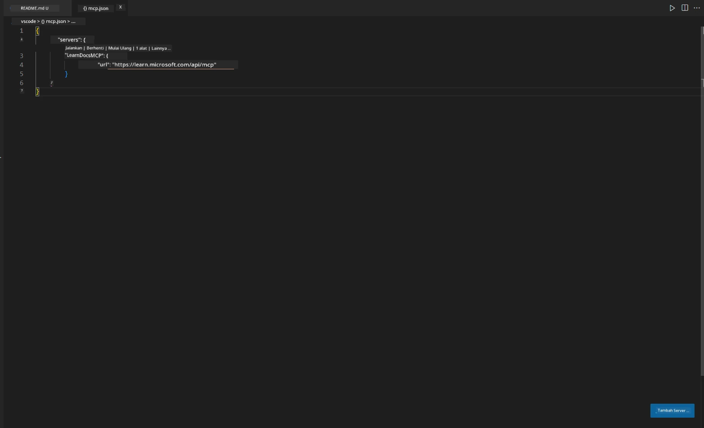
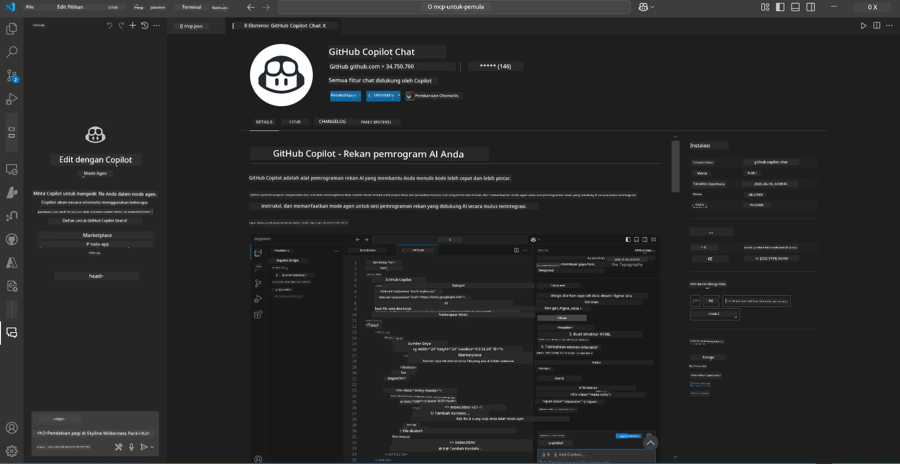
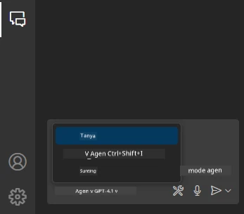
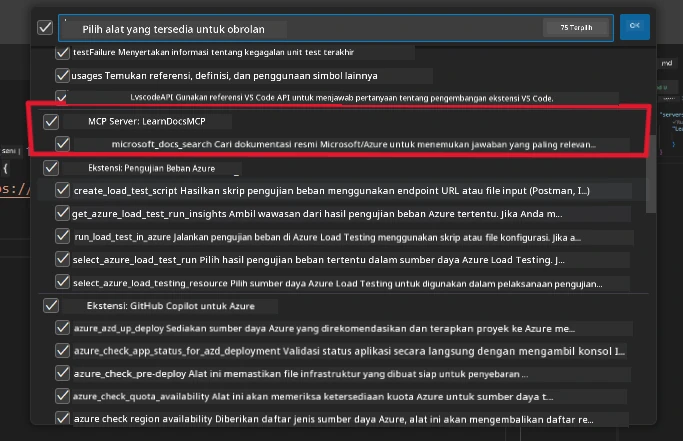
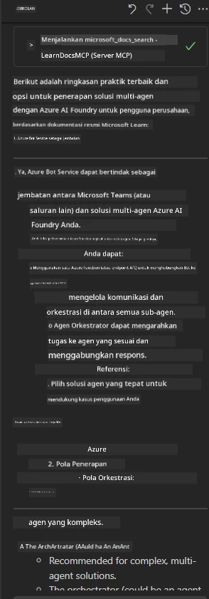

# Skenario 3: Dokumentasi Dalam Editor dengan MCP Server di VS Code

## Ikhtisar

Dalam skenario ini, Anda akan belajar cara menghadirkan Microsoft Learn Docs langsung ke dalam lingkungan Visual Studio Code menggunakan server MCP. Alih-alih terus-menerus berganti tab browser untuk mencari dokumentasi, Anda dapat mengakses, mencari, dan merujuk dokumen resmi langsung di dalam editor Anda. Pendekatan ini mempermudah alur kerja Anda, menjaga fokus, dan memungkinkan integrasi mulus dengan alat seperti GitHub Copilot.

- Cari dan baca dokumen di dalam VS Code tanpa meninggalkan lingkungan pengkodean Anda.
- Rujuk dokumentasi dan sisipkan tautan langsung ke README atau file kursus Anda.
- Gunakan GitHub Copilot dan MCP bersama-sama untuk alur kerja dokumentasi bertenaga AI yang lancar.

## Tujuan Pembelajaran

Pada akhir bab ini, Anda akan memahami cara mengatur dan menggunakan server MCP di dalam VS Code untuk meningkatkan alur kerja dokumentasi dan pengembangan Anda. Anda akan mampu:

- Mengonfigurasi workspace Anda untuk menggunakan server MCP dalam pencarian dokumentasi.
- Mencari dan menyisipkan dokumentasi langsung dari dalam VS Code.
- Menggabungkan kekuatan GitHub Copilot dan MCP untuk alur kerja yang lebih produktif dan didukung AI.

Keterampilan ini akan membantu Anda tetap fokus, meningkatkan kualitas dokumentasi, dan meningkatkan produktivitas sebagai pengembang atau penulis teknis.

## Solusi

Untuk mendapatkan akses dokumentasi dalam editor, Anda akan mengikuti serangkaian langkah yang mengintegrasikan server MCP dengan VS Code dan GitHub Copilot. Solusi ini ideal untuk penulis kursus, penulis dokumentasi, dan pengembang yang ingin tetap fokus di editor saat bekerja dengan dokumen dan Copilot.

- Tambahkan tautan referensi dengan cepat ke README saat menulis dokumentasi kursus atau proyek.
- Gunakan Copilot untuk menghasilkan kode dan MCP untuk langsung menemukan serta mengutip dokumen yang relevan.
- Tetap fokus di editor dan tingkatkan produktivitas.

### Panduan Langkah demi Langkah

Untuk memulai, ikuti langkah-langkah berikut. Untuk setiap langkah, Anda dapat menambahkan tangkapan layar dari folder aset untuk memperjelas proses secara visual.

1. **Tambahkan konfigurasi MCP:**
   Di root proyek Anda, buat file `.vscode/mcp.json` dan tambahkan konfigurasi berikut:
   ```json
   {
     "servers": {
       "LearnDocsMCP": {
         "url": "https://learn.microsoft.com/api/mcp"
       }
     }
   }
   ```
   Konfigurasi ini memberitahu VS Code bagaimana cara terhubung ke [`Microsoft Learn Docs MCP server`](https://github.com/MicrosoftDocs/mcp).
   
   
    
2. **Buka panel GitHub Copilot Chat:**
   Jika Anda belum memasang ekstensi GitHub Copilot, buka tampilan Extensions di VS Code dan pasang ekstensi tersebut. Anda dapat mengunduhnya langsung dari [Visual Studio Code Marketplace](https://marketplace.visualstudio.com/items?itemName=GitHub.copilot-chat). Kemudian, buka panel Copilot Chat dari sidebar.

   

3. **Aktifkan mode agen dan verifikasi alat:**
   Di panel Copilot Chat, aktifkan mode agen.

   

   Setelah mengaktifkan mode agen, pastikan server MCP tercantum sebagai salah satu alat yang tersedia. Ini memastikan agen Copilot dapat mengakses server dokumentasi untuk mengambil informasi yang relevan.
   
   
4. **Mulai chat baru dan berikan perintah pada agen:**
   Buka chat baru di panel Copilot Chat. Sekarang Anda dapat memberikan perintah pada agen dengan pertanyaan dokumentasi Anda. Agen akan menggunakan server MCP untuk mengambil dan menampilkan dokumentasi Microsoft Learn yang relevan langsung di editor Anda.

   - *"Saya sedang mencoba menulis rencana belajar untuk topik X. Saya akan mempelajarinya selama 8 minggu, untuk setiap minggu, sarankan konten yang harus saya pelajari."*

   

5. **Query Langsung:**

   > Mari kita ambil query langsung dari bagian [#get-help](https://discord.gg/D6cRhjHWSC) di Azure AI Foundry Discord ([lihat pesan asli](https://discord.com/channels/1113626258182504448/1385498306720829572)):
   
   *"Saya mencari jawaban tentang cara menerapkan solusi multi-agen dengan agen AI yang dikembangkan di Azure AI Foundry. Saya melihat tidak ada metode penerapan langsung, seperti saluran Copilot Studio. Jadi, apa saja cara berbeda untuk melakukan penerapan ini agar pengguna enterprise dapat berinteraksi dan menyelesaikan pekerjaan?
Ada banyak artikel/blog yang mengatakan kita bisa menggunakan layanan Azure Bot untuk melakukan pekerjaan ini yang dapat bertindak sebagai jembatan antara MS Teams dan Azure AI Foundry Agents, apakah ini akan berhasil jika saya mengatur Azure bot yang terhubung ke Orchestrator Agent di Azure AI Foundry melalui Azure function untuk melakukan orkestrasi atau saya perlu membuat Azure function untuk setiap agen AI yang menjadi bagian dari solusi multi-agen untuk melakukan orkestrasi di Bot framework? Saran lain sangat diterima."*

   

   Agen akan merespons dengan tautan dokumentasi dan ringkasan yang relevan, yang kemudian dapat Anda sisipkan langsung ke file markdown Anda atau gunakan sebagai referensi dalam kode Anda.
   
### Contoh Query

Berikut beberapa contoh query yang bisa Anda coba. Query ini akan menunjukkan bagaimana server MCP dan Copilot dapat bekerja sama untuk menyediakan dokumentasi dan referensi yang instan dan kontekstual tanpa meninggalkan VS Code:

- "Tunjukkan cara menggunakan trigger Azure Functions."
- "Sisipkan tautan ke dokumentasi resmi untuk Azure Key Vault."
- "Apa praktik terbaik untuk mengamankan sumber daya Azure?"
- "Cari quickstart untuk layanan Azure AI."

Query-query ini akan menunjukkan bagaimana server MCP dan Copilot dapat bekerja sama untuk menyediakan dokumentasi dan referensi yang instan dan kontekstual tanpa meninggalkan VS Code.

---

**Penafian**:  
Dokumen ini telah diterjemahkan menggunakan layanan terjemahan AI [Co-op Translator](https://github.com/Azure/co-op-translator). Meskipun kami berupaya untuk mencapai akurasi, harap diperhatikan bahwa terjemahan otomatis mungkin mengandung kesalahan atau ketidakakuratan. Dokumen asli dalam bahasa aslinya harus dianggap sebagai sumber yang sahih. Untuk informasi penting, disarankan menggunakan terjemahan profesional oleh manusia. Kami tidak bertanggung jawab atas kesalahpahaman atau penafsiran yang keliru yang timbul dari penggunaan terjemahan ini.