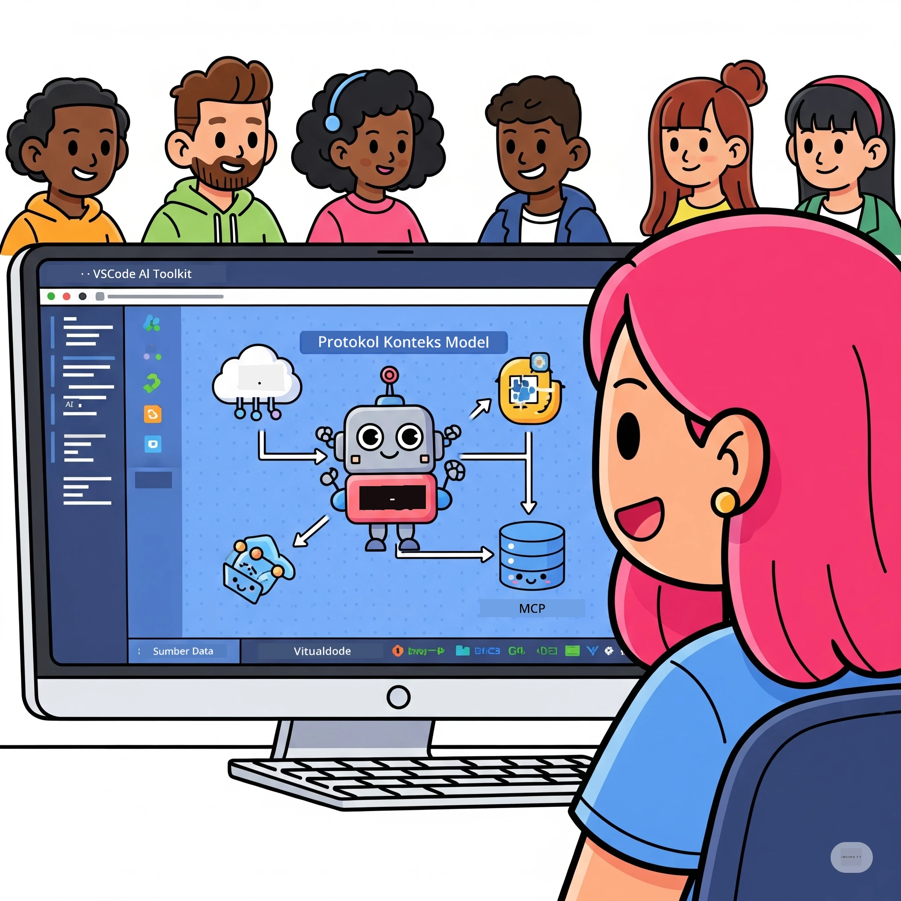
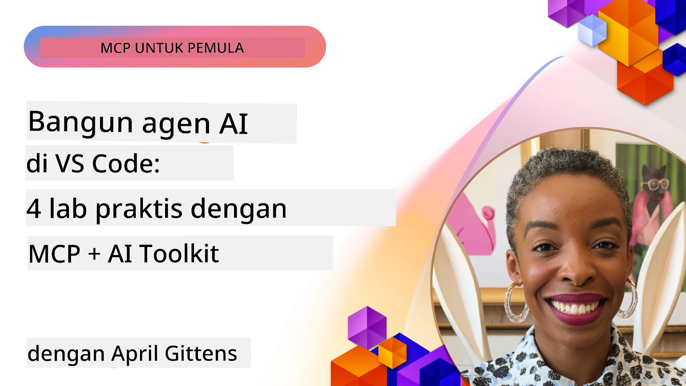

# Menyederhanakan Alur Kerja AI: Membangun Server MCP dengan AI Toolkit

## 🎯  Ikhtisar

_(Klik gambar di atas untuk menonton video pelajaran ini)_

Selamat datang di **Model Context Protocol (MCP) Workshop**! Workshop praktis komprehensif ini menggabungkan dua teknologi mutakhir untuk merevolusi pengembangan aplikasi AI:

- **🔗 Model Context Protocol (MCP)**: Standar terbuka untuk integrasi alat AI yang mulus
- **🛠️ AI Toolkit untuk Visual Studio Code (AITK)**: Ekstensi pengembangan AI canggih dari Microsoft

### 🎓 Apa yang Akan Anda Pelajari

Pada akhir workshop ini, Anda akan menguasai seni membangun aplikasi cerdas yang menghubungkan model AI dengan alat dan layanan dunia nyata. Dari pengujian otomatis hingga integrasi API khusus, Anda akan memperoleh keterampilan praktis untuk memecahkan tantangan bisnis yang kompleks.

## 🏗️ Tumpukan Teknologi

### 🔌 Model Context Protocol (MCP)

MCP adalah **"USB-C untuk AI"** - standar universal yang menghubungkan model AI ke alat eksternal dan sumber data.

**✨ Fitur Utama:**

- 🔄 **Integrasi Standar**: Antarmuka universal untuk koneksi alat AI
- 🏛️ **Arsitektur Fleksibel**: Server lokal & jarak jauh melalui transport stdio/SSE
- 🧰 **Ekosistem Kaya**: Alat, prompt, dan sumber daya dalam satu protokol
- 🔒 **Siap Perusahaan**: Keamanan dan keandalan bawaan

**🎯 Mengapa MCP Penting:**
Seperti halnya USB-C menghilangkan kekacauan kabel, MCP menghilangkan kompleksitas integrasi AI. Satu protokol, kemungkinan tanpa batas.

### 🤖 AI Toolkit untuk Visual Studio Code (AITK)

Ekstensi pengembangan AI unggulan Microsoft yang mengubah VS Code menjadi kekuatan AI.

**🚀 Kapabilitas Inti:**

- 📦 **Katalog Model**: Akses model dari Azure AI, GitHub, Hugging Face, Ollama
- ⚡ **Inferensi Lokal**: Eksekusi CPU/GPU/NPU yang dioptimalkan ONNX
- 🏗️ **Agent Builder**: Pengembangan agen AI visual dengan integrasi MCP
- 🎭 **Multi-Modal**: Dukungan teks, visi, dan output terstruktur

**💡 Manfaat Pengembangan:**

- Penyebaran model tanpa konfigurasi
- Rekayasa prompt visual
- Tempat uji coba model waktu nyata
- Integrasi server MCP tanpa hambatan

## 📚 Perjalanan Pembelajaran

### [🚀 Modul 1: Dasar-Dasar AI Toolkit](./lab1/README.md)

**Durasi**: 15 menit

- 🛠️ Instal dan konfigurasikan AI Toolkit untuk VS Code
- 🗂️ Jelajahi Katalog Model (100+ model dari GitHub, ONNX, OpenAI, Anthropic, Google)
- 🎮 Kuasai Interactive Playground untuk pengujian model waktu nyata
- 🤖 Bangun agen AI pertama Anda dengan Agent Builder
- 📊 Evaluasi performa model dengan metrik bawaan (F1, relevansi, kemiripan, koherensi)
- ⚡ Pelajari pemrosesan batch dan dukungan multi-modal

**🎯 Hasil Pembelajaran**: Membuat agen AI fungsional dengan pemahaman lengkap tentang kapabilitas AITK

### [🌐 Modul 2: MCP dengan Dasar-Dasar AI Toolkit](./lab2/README.md)

**Durasi**: 20 menit

- 🧠 Kuasai arsitektur dan konsep Model Context Protocol (MCP)
- 🌐 Jelajahi ekosistem server MCP Microsoft
- 🤖 Bangun agen otomatisasi browser menggunakan Playwright MCP server
- 🔧 Integrasikan server MCP dengan AI Toolkit Agent Builder
- 📊 Konfigurasikan dan uji alat MCP dalam agen Anda
- 🚀 Ekspor dan deploy agen bertenaga MCP untuk penggunaan produksi

**🎯 Hasil Pembelajaran**: Men-deploy agen AI yang diperkaya dengan alat eksternal melalui MCP

### [🔧 Modul 3: Pengembangan MCP Lanjutan dengan AI Toolkit](./lab3/README.md)

**Durasi**: 20 menit

- 💻 Buat server MCP khusus menggunakan AI Toolkit
- 🐍 Konfigurasikan dan gunakan SDK MCP Python terbaru (v1.9.3)
- 🔍 Siapkan dan gunakan MCP Inspector untuk debugging
- 🛠️ Bangun Server Cuaca MCP dengan alur kerja debugging profesional
- 🧪 Debug server MCP di lingkungan Agent Builder dan Inspector

**🎯 Hasil Pembelajaran**: Mengembangkan dan mendebug server MCP kustom dengan alat modern

### [🐙 Modul 4: Pengembangan MCP Praktis - Server GitHub Clone Kustom](./lab4/README.md)

**Durasi**: 30 menit

- 🏗️ Bangun Server GitHub Clone MCP nyata untuk alur kerja pengembangan
- 🔄 Implementasikan cloning repository pintar dengan validasi dan penanganan kesalahan
- 📁 Buat manajemen direktori cerdas dan integrasi VS Code
- 🤖 Gunakan GitHub Copilot Agent Mode dengan alat MCP kustom
- 🛡️ Terapkan keandalan siap produksi dan kompatibilitas lintas platform

**🎯 Hasil Pembelajaran**: Men-deploy server MCP siap produksi yang menyederhanakan alur kerja pengembangan nyata

## 💡 Aplikasi Dunia Nyata & Dampak

### 🏢 Kasus Penggunaan Perusahaan

#### 🔄 Otomasi DevOps

Transformasi alur kerja pengembangan Anda dengan otomatisasi cerdas:

- **Manajemen Repository Pintar**: Review kode dan keputusan merge berbasis AI
- **CI/CD Pintar**: Optimasi pipeline otomatis berdasarkan perubahan kode
- **Triage Masalah**: Klasifikasi bug otomatis dan penugasan

#### 🧪 Revolusi Jaminan Kualitas

Tingkatkan pengujian dengan otomatisasi berbasis AI:

- **Generasi Uji Pintar**: Membuat suite pengujian komprehensif secara otomatis
- **Pengujian Regresi Visual**: Deteksi perubahan UI berbasis AI
- **Monitoring Performa**: Identifikasi dan penyelesaian masalah secara proaktif

#### 📊 Intelijen Pipeline Data

Bangun alur kerja pemrosesan data yang lebih cerdas:

- **Proses ETL Adaptif**: Transformasi data yang mengoptimasi diri sendiri
- **Deteksi Anomali**: Monitoring kualitas data waktu nyata
- **Routing Pintar**: Manajemen aliran data cerdas

#### 🎧 Peningkatan Pengalaman Pelanggan

Ciptakan interaksi pelanggan yang luar biasa:

- **Dukungan Berbasis Konteks**: Agen AI dengan akses ke riwayat pelanggan
- **Penyelesaian Masalah Proaktif**: Layanan pelanggan prediktif
- **Integrasi Multi-Channel**: Pengalaman AI terpadu lintas platform

## 🛠️ Prasyarat & Persiapan

### 💻 Persyaratan Sistem

| Komponen | Persyaratan | Catatan |
|-----------|-------------|---------|
| **Sistem Operasi** | Windows 10+, macOS 10.15+, Linux | OS modern apa pun |
| **Visual Studio Code** | Versi stabil terbaru | Dibutuhkan untuk AITK |
| **Node.js** | v18.0+ dan npm | Untuk pengembangan server MCP |
| **Python** | 3.10+ | Opsional untuk server MCP Python |
| **Memori** | Minimal 8GB RAM | 16GB direkomendasikan untuk model lokal |

### 🔧 Lingkungan Pengembangan

#### Ekstensi VS Code yang Direkomendasikan

- **AI Toolkit** (ms-windows-ai-studio.windows-ai-studio)
- **Python** (ms-python.python)
- **Python Debugger** (ms-python.debugpy)
- **GitHub Copilot** (GitHub.copilot) - Opsional tapi berguna

#### Alat Opsional

- **uv**: Pengelola paket Python modern
- **MCP Inspector**: Alat debugging visual untuk server MCP
- **Playwright**: Untuk contoh otomasi web

## 🎖️ Hasil Pembelajaran & Jalur Sertifikasi

### 🏆 Daftar Periksa Penguasaan Keterampilan

Dengan menyelesaikan workshop ini, Anda akan mencapai penguasaan dalam:

#### 🎯 Kompetensi Inti

- [ ] **Penguasaan Protokol MCP**: Pemahaman mendalam tentang arsitektur dan pola implementasi
- [ ] **Kemahiran AITK**: Penggunaan tingkat ahli AI Toolkit untuk pengembangan cepat
- [ ] **Pengembangan Server Kustom**: Membuat, men-deploy, dan memelihara server MCP produksi
- [ ] **Keunggulan Integrasi Alat**: Menghubungkan AI dengan alur kerja pengembangan yang ada secara mulus
- [ ] **Penerapan Pemecahan Masalah**: Menerapkan keterampilan yang dipelajari ke tantangan bisnis nyata

#### 🔧 Keterampilan Teknis

- [ ] Menyiapkan dan mengonfigurasi AI Toolkit di VS Code
- [ ] Merancang dan mengimplementasikan server MCP kustom
- [ ] Mengintegrasikan Model GitHub dengan arsitektur MCP
- [ ] Membangun alur kerja pengujian otomatis dengan Playwright
- [ ] Men-deploy agen AI untuk penggunaan produksi
- [ ] Debug dan optimalkan performa server MCP

#### 🚀 Kapabilitas Lanjutan

- [ ] Merancang integrasi AI skala perusahaan
- [ ] Menerapkan praktik keamanan terbaik untuk aplikasi AI
- [ ] Merancang arsitektur server MCP yang skalabel
- [ ] Membuat rantai alat khusus untuk domain tertentu
- [ ] Membimbing orang lain dalam pengembangan AI-native

## 📖 Sumber Daya Tambahan

- [Spesifikasi MCP (2025-11-25)](https://spec.modelcontextprotocol.io/specification/2025-11-25/)
- [Repositori AI Toolkit GitHub](https://github.com/microsoft/vscode-ai-toolkit)
- [Koleksi Server MCP Sampel](https://github.com/modelcontextprotocol/servers)
- [Panduan Praktik Terbaik](https://modelcontextprotocol.io/docs/best-practices)
- [OWASP MCP Top 10](https://microsoft.github.io/mcp-azure-security-guide/mcp/) - Praktik keamanan terbaik

---

**🚀 Siap merevolusi alur kerja pengembangan AI Anda?**

Mari bangun masa depan aplikasi cerdas bersama MCP dan AI Toolkit!

## Selanjutnya

Lanjut ke: [Modul 11: MCP Server Hands-On Labs](../11-MCPServerHandsOnLabs/README.md)

---

<!-- CO-OP TRANSLATOR DISCLAIMER START -->
**Penafian**:  
Dokumen ini telah diterjemahkan menggunakan layanan terjemahan AI [Co-op Translator](https://github.com/Azure/co-op-translator). Meskipun kami berusaha untuk akurasi, harap diketahui bahwa terjemahan otomatis dapat mengandung kesalahan atau ketidakakuratan. Dokumen asli dalam bahasa asalnya harus dianggap sebagai sumber otoritatif. Untuk informasi penting, disarankan menggunakan terjemahan profesional oleh manusia. Kami tidak bertanggung jawab atas kesalahpahaman atau salah tafsir yang timbul dari penggunaan terjemahan ini.
<!-- CO-OP TRANSLATOR DISCLAIMER END -->