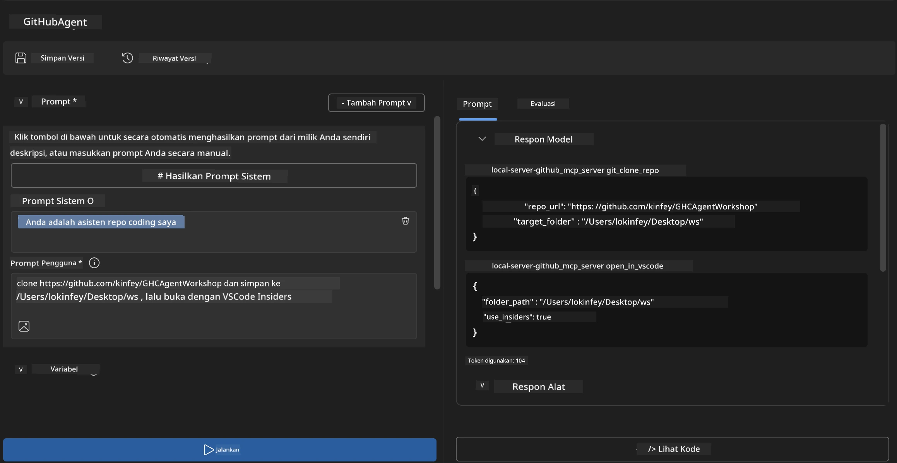
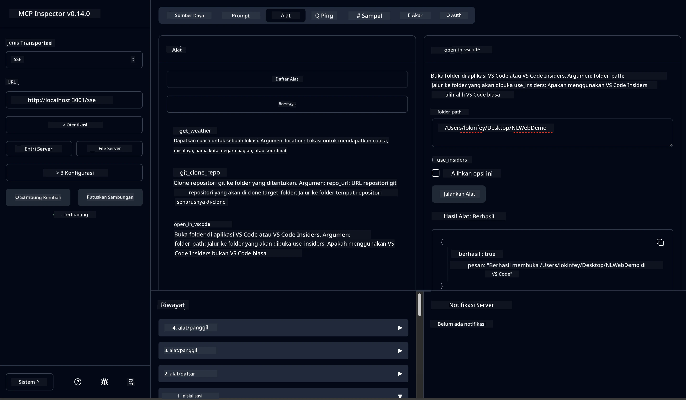

# 🐙 Modul 4: Pengembangan MCP Praktis - Server Kloning GitHub Kustom


> **⚡ Mulai Cepat:** Bangun server MCP siap produksi yang mengotomatiskan kloning repositori GitHub dan integrasi VS Code hanya dalam 30 menit!

## 🎯 Tujuan Pembelajaran

Pada akhir lab ini, Anda akan dapat:

- ✅ Membuat server MCP kustom untuk alur kerja pengembangan dunia nyata
- ✅ Menerapkan fungsi kloning repositori GitHub melalui MCP
- ✅ Mengintegrasikan server MCP kustom dengan VS Code dan Agent Builder
- ✅ Menggunakan GitHub Copilot Agent Mode dengan alat MCP kustom
- ✅ Menguji dan menerapkan server MCP kustom di lingkungan produksi

## 📋 Prasyarat

- Menyelesaikan Lab 1-3 (fundamental MCP dan pengembangan lanjutan)
- Langganan GitHub Copilot ([daftar gratis tersedia](https://github.com/github-copilot/signup))
- VS Code dengan ekstensi AI Toolkit dan GitHub Copilot
- Git CLI sudah terpasang dan dikonfigurasi

## 🏗️ Gambaran Proyek

### **Tantangan Pengembangan Dunia Nyata**
Sebagai pengembang, kami sering menggunakan GitHub untuk mengkloning repositori dan membukanya di VS Code atau VS Code Insiders. Proses manual ini meliputi:
1. Membuka terminal/command prompt
2. Menavigasi ke direktori yang diinginkan
3. Menjalankan perintah `git clone`
4. Membuka VS Code di direktori yang telah dikloning

**Solusi MCP kami menyederhanakan ini menjadi satu perintah cerdas!**

### **Apa yang Akan Anda Bangun**
Sebuah **Server MCP Kloning GitHub** (`git_mcp_server`) yang menyediakan:

| Fitur | Deskripsi | Manfaat |
|---------|-------------|---------|
| 🔄 **Kloning Repositori Pintar** | Mengkloning repos GitHub dengan validasi | Pemeriksaan kesalahan otomatis |
| 📁 **Manajemen Direktori Cerdas** | Memeriksa dan membuat direktori dengan aman | Mencegah penimpaan |
| 🚀 **Integrasi VS Code Lintas Platform** | Membuka proyek di VS Code/Insiders | Transisi alur kerja mulus |
| 🛡️ **Penanganan Kesalahan Kuat** | Mengatasi masalah jaringan, izin, dan jalur | Keandalan siap produksi |

---

## 📖 Implementasi Langkah demi Langkah

### Langkah 1: Buat Agen GitHub di Agent Builder

1. **Luncurkan Agent Builder** melalui ekstensi AI Toolkit
2. **Buat agen baru** dengan konfigurasi berikut:
   ```
   Agent Name: GitHubAgent
   ```

3. **Inisialisasi server MCP kustom:**
   - Navigasi ke **Tools** → **Add Tool** → **MCP Server**
   - Pilih **"Create A new MCP Server"**
   - Pilih **template Python** untuk fleksibilitas maksimal
   - **Nama Server:** `git_mcp_server`

### Langkah 2: Konfigurasi GitHub Copilot Agent Mode

1. **Buka GitHub Copilot** di VS Code (Ctrl/Cmd + Shift + P → "GitHub Copilot: Open")
2. **Pilih Model Agen** di antarmuka Copilot
3. **Pilih model Claude 3.7** untuk kemampuan penalaran yang lebih baik
4. **Aktifkan integrasi MCP** untuk akses alat

> **💡 Tips Pro:** Claude 3.7 memberikan pemahaman superior tentang alur kerja pengembangan dan pola penanganan kesalahan.

### Langkah 3: Terapkan Fungsi Inti Server MCP

**Gunakan prompt rinci berikut dengan GitHub Copilot Agent Mode:**

```
Create two MCP tools with the following comprehensive requirements:

🔧 TOOL A: clone_repository
Requirements:
- Clone any GitHub repository to a specified local folder
- Return the absolute path of the successfully cloned project
- Implement comprehensive validation:
  ✓ Check if target directory already exists (return error if exists)
  ✓ Validate GitHub URL format (https://github.com/user/repo)
  ✓ Verify git command availability (prompt installation if missing)
  ✓ Handle network connectivity issues
  ✓ Provide clear error messages for all failure scenarios

🚀 TOOL B: open_in_vscode
Requirements:
- Open specified folder in VS Code or VS Code Insiders
- Cross-platform compatibility (Windows/Linux/macOS)
- Use direct application launch (not terminal commands)
- Auto-detect available VS Code installations
- Handle cases where VS Code is not installed
- Provide user-friendly error messages

Additional Requirements:
- Follow MCP 1.9.3 best practices
- Include proper type hints and documentation
- Implement logging for debugging purposes
- Add input validation for all parameters
- Include comprehensive error handling
```

### Langkah 4: Uji Server MCP Anda

#### 4a. Uji di Agent Builder

1. **Luncurkan konfigurasi debug** untuk Agent Builder
2. **Konfigurasikan agen Anda dengan prompt sistem ini:**

```
SYSTEM_PROMPT:
You are my intelligent coding repository assistant. You help developers efficiently clone GitHub repositories and set up their development environment. Always provide clear feedback about operations and handle errors gracefully.
```

3. **Uji dengan skenario pengguna realistis:**

```
USER_PROMPT EXAMPLES:

Scenario : Basic Clone and Open
"Clone {Your GitHub Repo link such as https://github.com/kinfey/GHCAgentWorkshop
 } and save to {The global path you specify}, then open it with VS Code Insiders"
```



**Hasil yang Diharapkan:**
- ✅ Kloning berhasil dengan konfirmasi jalur
- ✅ Peluncuran VS Code otomatis
- ✅ Pesan kesalahan jelas untuk skenario tidak valid
- ✅ Penanganan tepat untuk kasus tepi

#### 4b. Uji di MCP Inspector




---


**🎉 Selamat!** Anda telah berhasil membuat server MCP praktis siap produksi yang menyelesaikan tantangan alur kerja pengembangan nyata. Server kloning GitHub kustom Anda menunjukkan kekuatan MCP untuk mengotomatiskan dan meningkatkan produktivitas pengembang.

### 🏆 Pencapaian Terbuka:
- ✅ **Pengembang MCP** - Membuat server MCP kustom
- ✅ **Automator Alur Kerja** - Menyederhanakan proses pengembangan  
- ✅ **Ahli Integrasi** - Menghubungkan banyak alat pengembangan
- ✅ **Siap Produksi** - Membangun solusi yang dapat diterapkan

---

## 🎓 Penyelesaian Workshop: Perjalanan Anda dengan Model Context Protocol

**Peserta Workshop yang Terhormat,**

Selamat telah menyelesaikan keempat modul workshop Model Context Protocol! Anda telah melalui perjalanan panjang dari memahami konsep dasar AI Toolkit hingga membangun server MCP siap produksi yang menyelesaikan tantangan pengembangan dunia nyata.

### 🚀 Ringkasan Jalur Pembelajaran Anda:

**[Modul 1](../lab1/README.md)**: Anda memulai dengan mempelajari dasar AI Toolkit, pengujian model, dan membuat agen AI pertama Anda.

**[Modul 2](../lab2/README.md)**: Anda mempelajari arsitektur MCP, mengintegrasikan Playwright MCP, dan membangun agen otomatisasi browser pertama.

**[Modul 3](../lab3/README.md)**: Anda maju ke pengembangan server MCP kustom dengan server Weather MCP dan menguasai alat debugging.

**[Modul 4](../lab4/README.md)**: Sekarang Anda menerapkan semuanya untuk membuat alat otomatisasi alur kerja repositori GitHub yang praktis.

### 🌟 Apa yang Telah Anda Kuasai:

- ✅ **Ekosistem AI Toolkit**: Model, agen, dan pola integrasi
- ✅ **Arsitektur MCP**: Desain klien-server, protokol transport, dan keamanan
- ✅ **Alat Pengembang**: Dari Playground ke Inspector sampai penerapan produksi
- ✅ **Pengembangan Kustom**: Membangun, menguji, dan menerapkan server MCP Anda sendiri
- ✅ **Aplikasi Praktis**: Menyelesaikan tantangan alur kerja dunia nyata dengan AI

### 🔮 Langkah Berikutnya:

1. **Bangun Server MCP Sendiri**: Terapkan keterampilan ini untuk mengotomatiskan alur kerja unik Anda
2. **Bergabung dengan Komunitas MCP**: Bagikan kreasi Anda dan pelajari dari orang lain
3. **Jelajahi Integrasi Lanjutan**: Hubungkan server MCP ke sistem perusahaan
4. **Kontribusi ke Open Source**: Bantu tingkatkan alat dan dokumentasi MCP

Ingat, workshop ini hanyalah permulaan. Ekosistem Model Context Protocol berkembang pesat, dan Anda kini siap berada di garis depan alat pengembangan bertenaga AI.

**Terima kasih atas partisipasi dan dedikasi Anda dalam belajar!**

Kami berharap workshop ini memicu ide-ide yang akan mengubah cara Anda membangun dan berinteraksi dengan alat AI dalam perjalanan pengembangan Anda.

**Selamat coding!**

---

## Apa Selanjutnya

Selamat telah menyelesaikan semua lab di Modul 10!

- Kembali ke: [Gambaran Modul 10](../README.md)
- Lanjut ke: [Modul 11: Lab Praktik Server MCP](../../11-MCPServerHandsOnLabs/README.md)

---

<!-- CO-OP TRANSLATOR DISCLAIMER START -->
**Penafian**:  
Dokumen ini telah diterjemahkan menggunakan layanan terjemahan AI [Co-op Translator](https://github.com/Azure/co-op-translator). Meskipun kami berusaha untuk menjaga akurasi, harap diketahui bahwa terjemahan otomatis mungkin mengandung kesalahan atau ketidakakuratan. Dokumen asli dalam bahasa aslinya harus dianggap sebagai sumber yang sah dan resmi. Untuk informasi yang penting, disarankan menggunakan terjemahan profesional oleh manusia. Kami tidak bertanggung jawab atas kesalahpahaman atau salah tafsir yang timbul dari penggunaan terjemahan ini.
<!-- CO-OP TRANSLATOR DISCLAIMER END -->