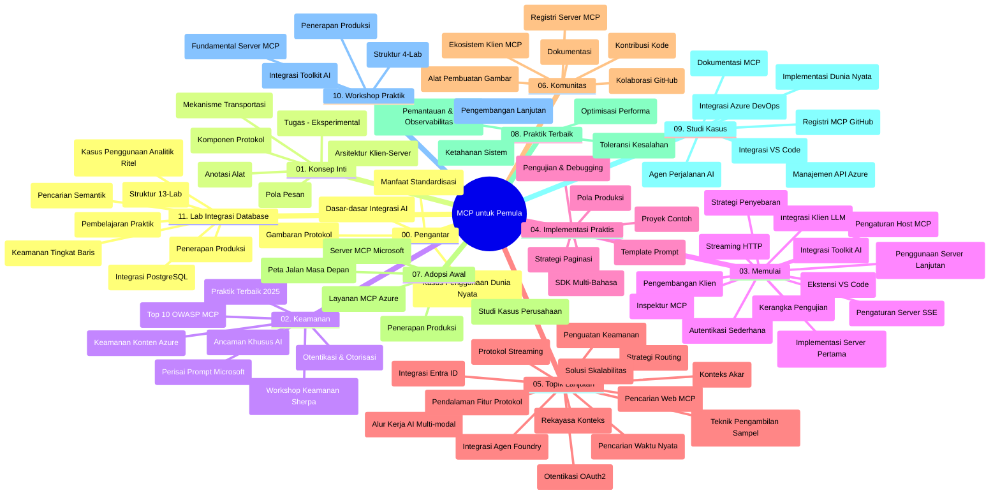

# Model Context Protocol (MCP) untuk Pemula - Panduan Belajar

Panduan belajar ini memberikan gambaran tentang struktur dan isi repositori untuk kurikulum "Model Context Protocol (MCP) untuk Pemula". Gunakan panduan ini untuk menavigasi repositori dengan efisien dan memanfaatkan sumber daya yang tersedia secara optimal.

## Gambaran Umum Repositori

Model Context Protocol (MCP) adalah kerangka kerja standar untuk interaksi antara model AI dan aplikasi klien. Awalnya dibuat oleh Anthropic, MCP sekarang dikelola oleh komunitas MCP yang lebih luas melalui organisasi resmi GitHub. Repositori ini menyediakan kurikulum komprehensif dengan contoh kode praktis dalam C#, Java, JavaScript, Python, dan TypeScript, yang dirancang untuk pengembang AI, arsitek sistem, dan insinyur perangkat lunak.

## Peta Kurikulum Visual

## Struktur Repositori

Repositori ini diorganisasi menjadi sebelas bagian utama, masing-masing berfokus pada aspek berbeda dari MCP:

1. **Pengantar (00-Introduction/)**
   - Gambaran umum Model Context Protocol
   - Mengapa standarisasi penting dalam pipeline AI
   - Kasus penggunaan praktis dan manfaat

2. **Konsep Inti (01-CoreConcepts/)**
   - Arsitektur klien-server
   - Komponen utama protokol
   - Pola pesan dalam MCP

3. **Keamanan (02-Security/)**
   - Ancaman keamanan dalam sistem berbasis MCP
   - Praktik terbaik untuk mengamankan implementasi
   - Strategi autentikasi dan otorisasi
   - **Dokumentasi Keamanan Komprehensif**:
     - Praktik Terbaik Keamanan MCP 2025
     - Panduan Implementasi Azure Content Safety
     - Kontrol dan Teknik Keamanan MCP
     - Referensi Cepat Praktik Terbaik MCP
   - **Topik Keamanan Utama**:
     - Serangan penyuntikan prompt dan keracunan alat
     - Pembajakan sesi dan masalah confident deputy
     - Kerentanan penerusan token
     - Izin berlebihan dan kontrol akses
     - Keamanan rantai pasokan untuk komponen AI
     - Integrasi Microsoft Prompt Shields

4. **Memulai (03-GettingStarted/)**
   - Pengaturan dan konfigurasi lingkungan
   - Membuat server dan klien MCP dasar
   - Integrasi dengan aplikasi yang sudah ada
   - Berisi bagian untuk:
     - Implementasi server pertama
     - Pengembangan klien
     - Integrasi klien LLM
     - Integrasi VS Code
     - Server Server-Sent Events (SSE)
     - Penggunaan server tingkat lanjut
     - Streaming HTTP
     - Integrasi AI Toolkit
     - Strategi pengujian
     - Panduan penerapan

5. **Implementasi Praktis (04-PracticalImplementation/)**
   - Menggunakan SDK di berbagai bahasa pemrograman
   - Teknik debugging, pengujian, dan validasi
   - Membuat template prompt dan alur kerja yang dapat digunakan ulang
   - Proyek contoh dengan contoh implementasi

6. **Topik Lanjutan (05-AdvancedTopics/)**
   - Teknik rekayasa konteks
   - Integrasi agen Foundry
   - Alur kerja AI multi-modal 
   - Demo autentikasi OAuth2
   - Kapabilitas pencarian real-time
   - Streaming real-time
   - Implementasi root contexts
   - Strategi routing
   - Teknik sampling
   - Pendekatan skalabilitas
   - Pertimbangan keamanan
   - Integrasi keamanan Entra ID
   - Integrasi pencarian web

7. **Kontribusi Komunitas (06-CommunityContributions/)**
   - Cara memberikan kontribusi kode dan dokumentasi
   - Kolaborasi melalui GitHub
   - Peningkatan dan umpan balik yang digerakkan komunitas
   - Menggunakan berbagai klien MCP (Claude Desktop, Cline, VSCode)
   - Bekerja dengan server MCP populer termasuk generasi gambar

8. **Pelajaran dari Adopsi Awal (07-LessonsfromEarlyAdoption/)**
   - Implementasi dunia nyata dan kisah sukses
   - Membangun dan menerapkan solusi berbasis MCP
   - Tren dan roadmap masa depan
   - **Panduan Server MCP Microsoft**: Panduan komprehensif 10 server MCP Microsoft siap produksi termasuk:
     - Microsoft Learn Docs MCP Server
     - Azure MCP Server (15+ konektor khusus)
     - GitHub MCP Server
     - Azure DevOps MCP Server
     - MarkItDown MCP Server
     - SQL Server MCP Server
     - Playwright MCP Server
     - Dev Box MCP Server
     - Azure AI Foundry MCP Server
     - Microsoft 365 Agents Toolkit MCP Server

9. **Praktik Terbaik (08-BestPractices/)**
   - Penyempurnaan dan optimasi performa
   - Merancang sistem MCP yang tahan kesalahan
   - Strategi pengujian dan ketahanan

10. **Studi Kasus (09-CaseStudy/)**
    - **Tujuh studi kasus komprehensif** yang menunjukkan fleksibilitas MCP di berbagai skenario:
    - **Azure AI Travel Agents**: Orkestrasi multi-agen dengan Azure OpenAI dan AI Search
    - **Integrasi Azure DevOps**: Otomatisasi proses alur kerja dengan pembaruan data YouTube
    - **Pengambilan Dokumen Real-Time**: Klien konsol Python dengan streaming HTTP
    - **Generator Rencana Belajar Interaktif**: Aplikasi web Chainlit dengan AI percakapan
    - **Dokumentasi Dalam Editor**: Integrasi VS Code dengan alur kerja GitHub Copilot
    - **Manajemen API Azure**: Integrasi API perusahaan dengan pembuatan server MCP
    - **GitHub MCP Registry**: Pengembangan ekosistem dan platform integrasi agensi
    - Contoh implementasi mencakup integrasi perusahaan, produktivitas pengembang, dan pengembangan ekosistem

11. **Workshop Praktis (10-StreamliningAIWorkflowsBuildingAnMCPServerWithAIToolkit/)**
    - Workshop praktis komprehensif yang menggabungkan MCP dengan AI Toolkit
    - Membangun aplikasi cerdas yang menjembatani model AI dengan alat dunia nyata
    - Modul praktis mencakup dasar-dasar, pengembangan server kustom, dan strategi penerapan produksi
    - **Struktur Lab**:
      - Lab 1: Dasar-dasar Server MCP
      - Lab 2: Pengembangan Server MCP Lanjutan
      - Lab 3: Integrasi AI Toolkit
      - Lab 4: Penerapan Produksi dan Skalabilitas
    - Pendekatan pembelajaran berbasis lab dengan instruksi langkah demi langkah

12. **Lab Integrasi Database Server MCP (11-MCPServerHandsOnLabs/)**
    - **Jalur pembelajaran 13-lab komprehensif** untuk membangun server MCP siap produksi dengan integrasi PostgreSQL
    - **Implementasi analitik ritel dunia nyata** menggunakan kasus penggunaan Zava Retail
    - **Pola tingkat perusahaan** termasuk Row Level Security (RLS), pencarian semantik, dan akses data multi-tenant
    - **Struktur Lab Lengkap**:
      - **Lab 00-03: Dasar** - Pengantar, Arsitektur, Keamanan, Pengaturan Lingkungan
      - **Lab 04-06: Membangun Server MCP** - Desain Basis Data, Implementasi Server MCP, Pengembangan Alat
      - **Lab 07-09: Fitur Lanjutan** - Pencarian Semantik, Pengujian & Debugging, Integrasi VS Code
      - **Lab 10-12: Produksi & Praktik Terbaik** - Penerapan, Pemantauan, Optimasi
    - **Teknologi yang Dicakup**: Kerangka FastMCP, PostgreSQL, Azure OpenAI, Azure Container Apps, Application Insights
    - **Hasil Pembelajaran**: Server MCP siap produksi, pola integrasi basis data, analitik berbasis AI, keamanan tingkat perusahaan

## Sumber Daya Tambahan

Repositori ini menyertakan sumber daya pendukung:

- **Folder gambar**: Berisi diagram dan ilustrasi yang digunakan sepanjang kurikulum
- **Terjemahan**: Dukungan multi-bahasa dengan terjemahan otomatis dokumentasi
- **Sumber Resmi MCP**:
  - [Dokumentasi MCP](https://modelcontextprotocol.io/)
  - [Spesifikasi MCP](https://spec.modelcontextprotocol.io/)
  - [Repositori MCP GitHub](https://github.com/modelcontextprotocol)

## Cara Menggunakan Repositori Ini

1. **Pembelajaran Berurutan**: Ikuti bab secara berurutan (00 sampai 11) untuk pengalaman belajar yang terstruktur.
2. **Fokus Bahasa Spesifik**: Jika Anda tertarik pada bahasa pemrograman tertentu, jelajahi direktori contoh untuk implementasi dalam bahasa pilihan Anda.
3. **Implementasi Praktis**: Mulailah dengan bagian "Getting Started" untuk mengatur lingkungan dan membuat server serta klien MCP pertama Anda.
4. **Eksplorasi Lanjutan**: Setelah nyaman dengan dasar, dalami topik lanjutan untuk memperluas pengetahuan.
5. **Keterlibatan Komunitas**: Bergabunglah dengan komunitas MCP melalui diskusi GitHub dan saluran Discord untuk terhubung dengan pakar dan sesama pengembang.

## Klien MCP dan Alat

Kurikulum mencakup berbagai klien dan alat MCP:

1. **Klien Resmi**:
   - Visual Studio Code 
   - MCP di Visual Studio Code
   - Claude Desktop
   - Claude di VSCode 
   - Claude API

2. **Klien Komunitas**:
   - Cline (berbasis terminal)
   - Cursor (editor kode)
   - ChatMCP
   - Windsurf

3. **Alat Manajemen MCP**:
   - MCP CLI
   - MCP Manager
   - MCP Linker
   - MCP Router

## Server MCP Populer

Repositori memperkenalkan berbagai server MCP, termasuk:

1. **Server MCP Microsoft Resmi**:
   - Microsoft Learn Docs MCP Server
   - Azure MCP Server (15+ konektor khusus)
   - GitHub MCP Server
   - Azure DevOps MCP Server
   - MarkItDown MCP Server
   - SQL Server MCP Server
   - Playwright MCP Server
   - Dev Box MCP Server
   - Azure AI Foundry MCP Server
   - Microsoft 365 Agents Toolkit MCP Server

2. **Server Referensi Resmi**:
   - Filesystem
   - Fetch
   - Memory
   - Sequential Thinking

3. **Generasi Gambar**:
   - Azure OpenAI DALL-E 3
   - Stable Diffusion WebUI
   - Replicate

4. **Alat Pengembangan**:
   - Git MCP
   - Terminal Control
   - Code Assistant

5. **Server Khusus**:
   - Salesforce
   - Microsoft Teams
   - Jira & Confluence

## Kontribusi

Repositori ini menyambut kontribusi dari komunitas. Lihat bagian Kontribusi Komunitas untuk panduan cara berkontribusi secara efektif ke ekosistem MCP.

----

*Panduan belajar ini terakhir diperbarui pada 5 Februari 2026, mencerminkan Spesifikasi MCP terbaru 2025-11-25 dan memberikan gambaran repositori sampai tanggal tersebut. Konten repositori dapat diperbarui setelah tanggal ini.*

---

<!-- CO-OP TRANSLATOR DISCLAIMER START -->
**Penafian**:  
Dokumen ini telah diterjemahkan menggunakan layanan terjemahan AI [Co-op Translator](https://github.com/Azure/co-op-translator). Meskipun kami berusaha untuk memberikan terjemahan yang akurat, harap diperhatikan bahwa terjemahan otomatis mungkin mengandung kesalahan atau ketidakakuratan. Dokumen asli dalam bahasa aslinya harus dianggap sebagai sumber yang sah dan utama. Untuk informasi penting, disarankan menggunakan jasa terjemahan profesional oleh manusia. Kami tidak bertanggung jawab atas kesalahpahaman atau salah tafsir yang timbul akibat penggunaan terjemahan ini.
<!-- CO-OP TRANSLATOR DISCLAIMER END -->