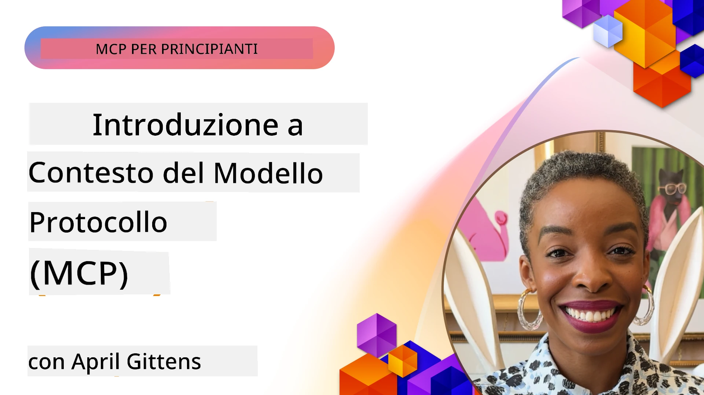
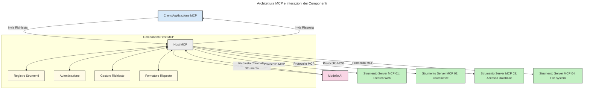

# Introduzione al Model Context Protocol (MCP): Perché è Importante per Applicazioni AI Scalabili

[](https://youtu.be/agBbdiOPLQA)

_(Clicca sull'immagine sopra per visualizzare il video di questa lezione)_

Le applicazioni di AI generativa rappresentano un grande passo avanti in quanto spesso permettono all'utente di interagire con l'app tramite comandi in linguaggio naturale. Tuttavia, con l'aumentare di tempo e risorse investite in tali app, si vuole assicurare che sia facile integrare funzionalità e risorse in modo che sia semplice estendere, che la tua app possa supportare più di un modello utilizzato e gestire varie complessità dei modelli. In breve, costruire app Gen AI è facile all'inizio, ma man mano che crescono e diventano più complesse, è necessario iniziare a definire un’architettura e probabilmente affidarsi a uno standard per assicurare che le tue app siano costruite in modo coerente. È qui che MCP interviene per organizzare le cose e fornire uno standard.

---

## **🔍 Cos'è il Model Context Protocol (MCP)?**

Il **Model Context Protocol (MCP)** è un'**interfaccia aperta e standardizzata** che permette ai Grandi Modelli di Linguaggio (LLM) di interagire senza problemi con strumenti esterni, API e fonti di dati. Fornisce un'architettura coerente per migliorare la funzionalità dei modelli di AI oltre i loro dati di addestramento, consentendo sistemi AI più intelligenti, scalabili e reattivi.

---

## **🎯 Perché la Standardizzazione nell'AI è Importante**

Man mano che le applicazioni AI generativa diventano più complesse, è essenziale adottare standard che garantiscano **scalabilità, estendibilità, manutenibilità** e **evitare il lock-in del fornitore**. MCP risponde a queste esigenze:

- Unificando le integrazioni modello-strumento
- Riducendo soluzioni personalizzate fragili e isolate
- Permettendo a più modelli di diversi fornitori di coesistere in un unico ecosistema

**Nota:** Pur definendosi uno standard aperto, MCP non ha piani per standardizzarsi tramite enti di standardizzazione esistenti come IEEE, IETF, W3C, ISO o altri.

---

## **📚 Obiettivi di Apprendimento**

Al termine di questo articolo sarai in grado di:

- Definire il **Model Context Protocol (MCP)** e i suoi casi d'uso
- Comprendere come MCP standardizza la comunicazione modello-strumento
- Identificare i componenti principali dell'architettura MCP
- Esplorare applicazioni reali di MCP in contesti aziendali e di sviluppo

---

## **💡 Perché il Model Context Protocol (MCP) è una Svolta**

### **🔗 MCP Risolve la Frammentazione nelle Interazioni AI**

Prima di MCP, integrare modelli con strumenti richiedeva:

- Codice personalizzato per ogni coppia modello-strumento
- API non standard per ogni fornitore
- Incidenti frequenti causati da aggiornamenti
- Scarsa scalabilità con l’aumento di strumenti

### **✅ Vantaggi della Standardizzazione MCP**

| **Vantaggio**             | **Descrizione**                                                                |
|--------------------------|--------------------------------------------------------------------------------|
| Interoperabilità         | Gli LLM lavorano senza problemi con strumenti di diversi fornitori            |
| Coerenza                 | Comportamento uniforme tra piattaforme e strumenti                            |
| Riutilizzabilità         | Strumenti costruiti una volta possono essere usati in diversi progetti e sistemi |
| Sviluppo Accelerato      | Riduce il tempo di sviluppo usando interfacce standardizzate plug-and-play    |

---

## **🧱 Panoramica di Alto Livello sull’Architettura MCP**

MCP segue un **modello client-server**, dove:

- **Host MCP** eseguono i modelli AI
- **Client MCP** avviano richieste
- **Server MCP** forniscono contesto, strumenti e capacità

### **Componenti Chiave:**

- **Risorse** – Dati statici o dinamici per modelli  
- **Prompt** – Flussi di lavoro predefiniti per generazione guidata  
- **Strumenti** – Funzioni eseguibili come ricerca, calcoli  
- **Campionamento** – Comportamento agentico tramite interazioni ricorsive
- **Elencazione** – Richieste avviate dal server per input utente
- **Roots** – Confini filesystem per controllo accessi server

### **Architettura del Protocollo:**

MCP usa un’architettura a due livelli:
- **Livello Dati**: Comunicazione basata su JSON-RPC 2.0 con gestione del ciclo di vita e primitive
- **Livello Trasporto**: Canali di comunicazione locali STDIO e remoti Streamable HTTP con SSE

---

## Come Funzionano i Server MCP

I server MCP operano nel seguente modo:

- **Flusso della Richiesta**:
    1. Una richiesta è avviata da un utente finale o software per suo conto.
    2. Il **Client MCP** invia la richiesta a un **Host MCP**, che gestisce il runtime del Modello AI.
    3. Il **Modello AI** riceve il prompt utente e può richiedere accesso a strumenti o dati esterni tramite una o più chiamate strumento.
    4. L’**Host MCP**, non il modello direttamente, comunica con i **Server MCP** appropriati usando il protocollo standardizzato.
- **Funzionalità dell'Host MCP**:
    - **Registro Strumenti**: Mantiene un catalogo degli strumenti disponibili e delle loro capacità.
    - **Autenticazione**: Verifica i permessi per l’accesso agli strumenti.
    - **Gestore delle Richieste**: Processa le richieste strumenti provenienti dal modello.
    - **Formatore Risposte**: Struttura le uscite degli strumenti in un formato comprensibile dal modello.
- **Esecuzione del Server MCP**:
    - L’**Host MCP** smista le chiamate strumento a uno o più **Server MCP**, ciascuno con funzioni specializzate (es. ricerca, calcoli, query database).
    - I **Server MCP** eseguono le loro operazioni e restituiscono i risultati all’**Host MCP** in formato coerente.
    - L’**Host MCP** formatta e inoltra i risultati al **Modello AI**.
- **Completamento della Risposta**:
    - Il **Modello AI** incorpora le uscite degli strumenti in una risposta finale.
    - L’**Host MCP** invia questa risposta al **Client MCP**, il quale la consegna all’utente finale o al software chiamante.
    


## 👨‍💻 Come Costruire un Server MCP (Con Esempi)

I server MCP ti permettono di estendere le capacità degli LLM fornendo dati e funzionalità. 

Pronto a provarci? Ecco SDK specifici per linguaggi e/o stack con esempi per creare server MCP semplici in diversi linguaggi/stack:

- **Python SDK**: https://github.com/modelcontextprotocol/python-sdk

- **TypeScript SDK**: https://github.com/modelcontextprotocol/typescript-sdk

- **Java SDK**: https://github.com/modelcontextprotocol/java-sdk

- **C#/.NET SDK**: https://github.com/modelcontextprotocol/csharp-sdk


## 🌍 Casi d'Uso Realistici per MCP

MCP abilita una vasta gamma di applicazioni estendendo le capacità AI:

| **Applicazione**             | **Descrizione**                                                                |
|-----------------------------|--------------------------------------------------------------------------------|
| Integrazione Dati Aziendali | Connettere gli LLM a database, CRM o strumenti interni                         |
| Sistemi AI Agentici          | Abilitare agenti autonomi con accesso a strumenti e workflow decisionali       |
| Applicazioni Multi-modali    | Combinare strumenti testo, immagine e audio in una singola app AI unificata    |
| Integrazione Dati in Tempo Reale | Inserire dati live nelle interazioni AI per output più accurati e aggiornati|

### 🧠 MCP = Standard Universale per le Interazioni AI

Il Model Context Protocol (MCP) agisce come uno standard universale per le interazioni AI, proprio come USB-C ha standardizzato le connessioni fisiche per i dispositivi. Nel mondo dell’AI, MCP fornisce un’interfaccia coerente, permettendo ai modelli (client) di integrarsi senza problemi con strumenti esterni e fornitori di dati (server). Questo elimina la necessità di protocolli diversi e personalizzati per ogni API o fonte di dati.

Secondo MCP, uno strumento compatibile MCP (chiamato server MCP) segue uno standard unificato. Questi server possono elencare gli strumenti o azioni offerti ed eseguirli quando richiesti da un agente AI. Le piattaforme agent AI che supportano MCP possono scoprire dinamicamente gli strumenti disponibili dai server e invocarli tramite questo protocollo standard.

### 💡 Facilita l’accesso alla conoscenza

Oltre a offrire strumenti, MCP facilita anche l’accesso alla conoscenza. Permette alle applicazioni di fornire contesto ai grandi modelli di linguaggio collegandoli a varie fonti di dati. Per esempio, un server MCP potrebbe rappresentare un archivio documentale aziendale, consentendo agli agenti di recuperare informazioni rilevanti su richiesta. Un altro server potrebbe gestire azioni specifiche come inviare email o aggiornare record. Dal punto di vista dell’agente, questi sono semplicemente strumenti utilizzabili—alcuni restituiscono dati (contesto conoscitivo), altri eseguono azioni. MCP gestisce entrambi efficientemente.

Un agente che si connette a un server MCP apprende automaticamente le capacità disponibili e i dati accessibili tramite un formato standard. Questa standardizzazione abilita la disponibilità dinamica degli strumenti. Per esempio, aggiungendo un nuovo server MCP al sistema di un agente le sue funzioni diventano subito utilizzabili senza necessità di ulteriore personalizzazione delle istruzioni dell’agente.

Questa integrazione fluida si allinea al flusso mostrato nel diagramma seguente, dove i server forniscono sia strumenti che conoscenza, garantendo una collaborazione senza interruzioni tra sistemi. 

### 👉 Esempio: Soluzione Agent Scalabile

```mermaid
---
title: Soluzione Agente Scalabile con MCP
description: Un diagramma che illustra come un utente interagisce con un LLM che si connette a più server MCP, con ogni server che fornisce sia conoscenza che strumenti, creando un'architettura di sistema AI scalabile
---
graph TD
    User -->|Prompt| LLM
    LLM -->|Risposta| User
    LLM -->|MCP| ServerA
    LLM -->|MCP| ServerB
    ServerA -->|Connettore universale| ServerB
    ServerA --> KnowledgeA
    ServerA --> ToolsA
    ServerB --> KnowledgeB
    ServerB --> ToolsB

    subgraph Server A
        KnowledgeA[Conoscenza]
        ToolsA[Strumenti]
    end

    subgraph Server B
        KnowledgeB[Conoscenza]
        ToolsB[Strumenti]
    end
```Il Connettore Universale permette ai server MCP di comunicare e condividere capacità tra loro, consentendo a ServerA di delegare compiti a ServerB o accedere ai suoi strumenti e conoscenza. Questo federare strumenti e dati tra server supporta architetture agent modulari e scalabili. Poiché MCP standardizza l’esposizione degli strumenti, gli agenti possono scoprire dinamicamente e indirizzare le richieste tra server senza integrazioni codificate a mano.

Federazione di strumenti e conoscenza: strumenti e dati possono essere accessi tra server, favorendo architetture agentiche più scalabili e modulari.

### 🔄 Scenari Avanzati MCP con Integrazione LLM lato Client

Oltre all’architettura MCP di base, esistono scenari avanzati in cui sia client che server contengono LLM, permettendo interazioni più sofisticate. Nel diagramma seguente, **Client App** potrebbe essere un IDE con diversi strumenti MCP disponibili per l’uso da parte del LLM:

```mermaid
---
title: Scenari MCP Avanzati con Integrazione Client-Server LLM
description: Un diagramma di sequenza che mostra il flusso dettagliato di interazione tra utente, applicazione client, LLM client, più server MCP e LLM server, illustrando la scoperta degli strumenti, l'interazione con l'utente, la chiamata diretta degli strumenti e le fasi di negoziazione delle funzionalità
---
sequenceDiagram
    autonumber
    actor User as 👤 Utente
    participant ClientApp as 🖥️ App Client
    participant ClientLLM as 🧠 LLM Client
    participant Server1 as 🔧 Server MCP 1
    participant Server2 as 📚 Server MCP 2
    participant ServerLLM as 🤖 LLM Server
    
    %% Fase di scoperta
    rect rgb(220, 240, 255)
        Note over ClientApp, Server2: FASE DI SCOPERTA DEGLI STRUMENTI
        ClientApp->>+Server1: Richiedi strumenti/risorse disponibili
        Server1-->>-ClientApp: Ritorna lista strumenti (JSON)
        ClientApp->>+Server2: Richiedi strumenti/risorse disponibili
        Server2-->>-ClientApp: Ritorna lista strumenti (JSON)
        Note right of ClientApp: Memorizza catalogo<br/> strumenti combinato localmente
    end
    
    %% Interazione con l'utente
    rect rgb(255, 240, 220)
        Note over User, ClientLLM: FASE DI INTERAZIONE CON L'UTENTE
        User->>+ClientApp: Inserisci prompt in lingua naturale
        ClientApp->>+ClientLLM: Inoltra prompt + catalogo strumenti
        ClientLLM->>-ClientLLM: Analizza prompt e seleziona strumenti
    end
    
    %% Scenario A: Chiamata diretta degli strumenti
    alt Chiamata diretta degli strumenti
        rect rgb(220, 255, 220)
            Note over ClientApp, Server1: SCENARIO A: CHIAMATA DIRETTA DEGLI STRUMENTI
            ClientLLM->>+ClientApp: Richiedi esecuzione strumento
            ClientApp->>+Server1: Esegui strumento specifico
            Server1-->>-ClientApp: Ritorna risultati
            ClientApp->>+ClientLLM: Elabora risultati
            ClientLLM-->>-ClientApp: Genera risposta
            ClientApp-->>-User: Mostra risposta finale
        end
    
    %% Scenario B: Negoziazione funzionalità (stile VS Code)
    else Negoziazione funzionalità (stile VS Code)
        rect rgb(255, 220, 220)
            Note over ClientApp, ServerLLM: SCENARIO B: NEGOZIAZIONE DELLE FUNZIONALITÀ
            ClientLLM->>+ClientApp: Identifica capacità necessarie
            ClientApp->>+Server2: Negozia funzionalità/capacità
            Server2->>+ServerLLM: Richiedi contesto aggiuntivo
            ServerLLM-->>-Server2: Fornisci contesto
            Server2-->>-ClientApp: Ritorna funzionalità disponibili
            ClientApp->>+Server2: Chiama strumenti negoziati
            Server2-->>-ClientApp: Ritorna risultati
            ClientApp->>+ClientLLM: Elabora risultati
            ClientLLM-->>-ClientApp: Genera risposta
            ClientApp-->>-User: Mostra risposta finale
        end
    end
```
## 🔐 Benefici Pratici di MCP

Ecco i benefici pratici dell’utilizzo di MCP:

- **Aggiornamenti**: I modelli possono accedere a informazioni aggiornate oltre i dati di addestramento
- **Estensione delle Capacità**: I modelli possono sfruttare strumenti specializzati per compiti non addestrati
- **Riduzione delle Allucinazioni**: Fonti di dati esterne forniscono ancoraggi fattuali
- **Privacy**: Dati sensibili possono restare in ambienti sicuri invece di essere incorporati nei prompt

## 📌 Punti Chiave

Ecco i punti chiave per usare MCP:

- **MCP** standardizza il modo in cui i modelli AI interagiscono con strumenti e dati
- Promuove **estendibilità, coerenza e interoperabilità**
- MCP aiuta a **ridurre il tempo di sviluppo, migliorare l’affidabilità e estendere le capacità del modello**
- L’architettura client-server **permette applicazioni AI flessibili ed estendibili**

## 🧠 Esercizio

Pensa a un’applicazione AI che ti interessa costruire.

- Quali **strumenti esterni o dati** potrebbero migliorare le sue capacità?
- Come potrebbe MCP rendere l’integrazione **più semplice e affidabile?**

## Risorse Supplementari

- [Repository GitHub MCP](https://github.com/modelcontextprotocol)


## Cosa c’è dopo

Prossimo: [Capitolo 1: Concetti Fondamentali](../01-CoreConcepts/README.md)

---

<!-- CO-OP TRANSLATOR DISCLAIMER START -->
**Dichiarazione di esclusione di responsabilità**:  
Questo documento è stato tradotto utilizzando il servizio di traduzione automatica [Co-op Translator](https://github.com/Azure/co-op-translator). Pur impegnandoci per garantire accuratezza, si prega di considerare che le traduzioni automatiche possono contenere errori o inesattezze. Il documento originale nella sua lingua natale deve essere considerato la fonte autorevole. Per informazioni critiche si raccomanda una traduzione professionale effettuata da un umano. Non ci assumiamo alcuna responsabilità per incomprensioni o errori di interpretazione derivanti dall’utilizzo di questa traduzione.
<!-- CO-OP TRANSLATOR DISCLAIMER END -->