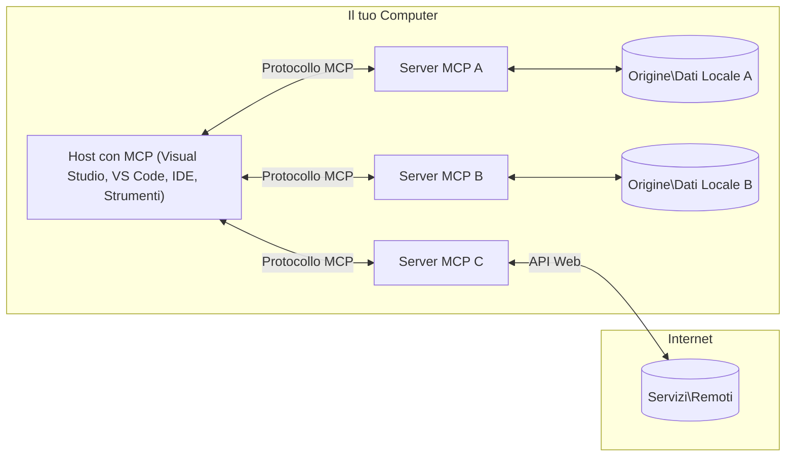

# Concetti Fondamentali MCP: Padroneggiare il Model Context Protocol per l'Integrazione AI

[](https://youtu.be/earDzWGtE84)

_(Clicca sull'immagine sopra per vedere il video di questa lezione)_

Il [Model Context Protocol (MCP)](https://github.com/modelcontextprotocol) è un potente framework standardizzato che ottimizza la comunicazione tra i Large Language Models (LLM) e strumenti esterni, applicazioni e fonti dati.  
Questa guida ti condurrà attraverso i concetti fondamentali di MCP. Imparerai la sua architettura client-server, i componenti essenziali, i meccanismi di comunicazione e le migliori pratiche di implementazione.

- **Consenso Esplicito dell'Utente**: Tutti gli accessi ai dati e le operazioni richiedono l'approvazione esplicita dell'utente prima dell'esecuzione. Gli utenti devono comprendere chiaramente quali dati saranno accessibili e quali azioni saranno intraprese, con un controllo granulare su permessi e autorizzazioni.

- **Protezione della Privacy dei Dati**: I dati dell'utente vengono esposti solo con consenso esplicito e devono essere protetti da rigorosi controlli di accesso durante l'intero ciclo di vita dell'interazione. Le implementazioni devono prevenire la trasmissione non autorizzata dei dati e mantenere confini di privacy rigorosi.

- **Sicurezza nell'Esecuzione degli Strumenti**: Ogni invocazione di uno strumento richiede il consenso esplicito dell'utente con chiara comprensione delle funzionalità, parametri e potenziali impatti dello strumento. Devono essere implementati confini di sicurezza robusti per evitare esecuzioni involontarie, insicure o malevole.

- **Sicurezza del Livello di Trasporto**: Tutti i canali di comunicazione devono utilizzare meccanismi appropriati di crittografia e autenticazione. Le connessioni remote devono implementare protocolli di trasporto sicuri e una gestione corretta delle credenziali.

#### Linee guida per l’implementazione:

- **Gestione dei Permessi**: Implementa sistemi di permessi granulari che consentano agli utenti di controllare quali server, strumenti e risorse siano accessibili
- **Autenticazione & Autorizzazione**: Usa metodi di autenticazione sicuri (OAuth, chiavi API) con gestione appropriata dei token e scadenze  
- **Validazione degli Input**: Convalida tutti i parametri e dati in ingresso secondo schemi definiti per prevenire attacchi di injection
- **Audit Logging**: Mantieni registri completi di tutte le operazioni per monitoraggio della sicurezza e conformità

## Panoramica

Questa lezione esplora l'architettura fondamentale e i componenti che costituiscono l'ecosistema del Model Context Protocol (MCP). Imparerai l’architettura client-server, i componenti chiave e i meccanismi di comunicazione che alimentano le interazioni MCP.

## Obiettivi di Apprendimento Chiave

Al termine di questa lezione, sarai in grado di:

- Comprendere l'architettura client-server MCP.
- Identificare ruoli e responsabilità di Host, Client e Server.
- Analizzare le caratteristiche core che rendono MCP uno strato di integrazione flessibile.
- Apprendere come fluisce l’informazione all’interno dell’ecosistema MCP.
- Ottenere approfondimenti pratici tramite esempi di codice in .NET, Java, Python e JavaScript.

## Architettura MCP: Uno Sguardo Approfondito

L’ecosistema MCP è costruito su un modello client-server. Questa struttura modulare consente alle applicazioni AI di interagire efficacemente con strumenti, database, API e risorse contestuali. Suddividiamo questa architettura nei suoi componenti fondamentali.

Al suo nucleo, MCP segue un’architettura client-server in cui un'app host può collegarsi a molteplici server:


- **Host MCP**: Programmi come VSCode, Claude Desktop, IDE o strumenti AI che vogliono accedere ai dati tramite MCP
- **Client MCP**: Client del protocollo che mantengono connessioni 1:1 con i server
- **Server MCP**: Programmi leggeri che espongono specifiche capacità tramite il Model Context Protocol standardizzato
- **Fonti Dati Locali**: File, database e servizi del tuo computer a cui i server MCP possono accedere in modo sicuro
- **Servizi Remoti**: Sistemi esterni disponibili tramite internet a cui i server MCP possono connettersi tramite API.

Il Protocollo MCP è uno standard in evoluzione che utilizza versioni basate su data (formato AAAA-MM-GG). La versione corrente del protocollo è **2025-11-25**. Puoi vedere gli ultimi aggiornamenti della [specifica del protocollo](https://modelcontextprotocol.io/specification/2025-11-25/)

### 1. Host

Nel Model Context Protocol (MCP), gli **Host** sono applicazioni AI che fungono da interfaccia primaria attraverso cui gli utenti interagiscono con il protocollo. Gli Host coordinano e gestiscono connessioni a molteplici server MCP creando client MCP dedicati per ogni connessione a server. Esempi di Host comprendono:

- **Applicazioni AI**: Claude Desktop, Visual Studio Code, Claude Code
- **Ambienti di Sviluppo**: IDE e editor di codice con integrazione MCP  
- **Applicazioni Personalizzate**: Agenti AI e strumenti costruiti su misura

Gli **Host** sono applicazioni che coordinano le interazioni con i modelli AI. Essi:

- **Orchestrano i Modelli AI**: Eseguono o interagiscono con LLM per generare risposte e coordinare flussi di lavoro AI
- **Gestiscono Connessioni Client**: Creano e mantengono un client MCP per ogni connessione a server MCP
- **Controllano l’Interfaccia Utente**: Gestiscono il flusso della conversazione, interazioni utente e presentazione delle risposte  
- **Applicano la Sicurezza**: Gestiscono permessi, vincoli di sicurezza e autenticazione
- **Gestiscono il Consenso Utente**: Amministrano l'approvazione dell’utente per la condivisione dati e l’esecuzione degli strumenti

### 2. Client

I **Client** sono componenti essenziali che mantengono connessioni dedicate one-to-one tra Host e server MCP. Ogni client MCP è istanziato dall’Host per connettersi a uno specifico server MCP, garantendo canali di comunicazione organizzati e sicuri. Più client permettono agli Host di connettersi simultaneamente a molteplici server.

I **Client** sono connettori integrati nell’applicazione host. Essi:

- **Comunicazione Protocollo**: Invia richieste JSON-RPC 2.0 ai server con prompt e istruzioni
- **Negoziazione Capabilities**: Negoziano caratteristiche supportate e versioni del protocollo con i server durante l’inizializzazione
- **Esecuzione Strumenti**: Gestiscono richieste di esecuzione strumenti da modelli e processano risposte
- **Aggiornamenti in Tempo Reale**: Gestiscono notifiche e aggiornamenti in tempo reale dai server
- **Elaborazione Risposte**: Processano e formattano le risposte dei server per la visualizzazione agli utenti

### 3. Server

I **Server** sono programmi che forniscono contesto, strumenti e capacità ai client MCP. Possono eseguire localmente (sulla stessa macchina dell’Host) o remotamente (su piattaforme esterne) e sono responsabili di gestire richieste client e fornire risposte strutturate. I server espongono funzionalità specifiche tramite il Model Context Protocol standardizzato.

I **Server** sono servizi che forniscono contesto e capacità. Essi:

- **Registrazione delle Funzionalità**: Registrano ed espongono primitive disponibili (risorse, prompt, strumenti) ai client
- **Elaborazione Richieste**: Ricevono e eseguono chiamate strumenti, richieste di risorse e prompt dai client
- **Fornitura di Contesto**: Forniscono informazioni contestuali e dati per arricchire le risposte del modello
- **Gestione Stato**: Mantengono lo stato della sessione e gestiscono interazioni con stato quando necessario
- **Notifiche in Tempo Reale**: Inviano notifiche su cambiamenti di capability e aggiornamenti ai client connessi

I server possono essere sviluppati da chiunque per estendere le capacità del modello con funzionalità specializzate e supportano scenari di distribuzione sia locali che remoti.

### 4. Primitive del Server

I server nel Model Context Protocol (MCP) forniscono tre primitive core che definiscono i mattoni fondamentali per interazioni ricche tra client, host e modelli linguistici. Queste primitive specificano i tipi di informazioni contestuali e azioni disponibili tramite il protocollo.

I server MCP possono esporre qualsiasi combinazione delle seguenti tre primitive core:

#### Risorse

Le **Risorse** sono fonti dati che forniscono informazioni contestuali alle applicazioni AI. Rappresentano contenuti statici o dinamici che possono arricchire la comprensione e le decisioni del modello:

- **Dati Contestuali**: Informazioni strutturate e contesti per il consumo da modelli AI
- **Basi di Conoscenza**: Repository documentali, articoli, manuali e pubblicazioni scientifiche
- **Fonti Dati Locali**: File, database e informazioni di sistema locali  
- **Dati Esterni**: Risposte API, web service e dati da sistemi remoti
- **Contenuti Dinamici**: Dati in tempo reale che si aggiornano in base a condizioni esterne

Le risorse sono identificate da URI e supportano discovery tramite i metodi `resources/list` e recupero tramite `resources/read`:

```text
file://documents/project-spec.md
database://production/users/schema
api://weather/current
```

#### Prompt

I **Prompt** sono modelli riutilizzabili che aiutano a strutturare le interazioni con i modelli linguistici. Forniscono schemi di interazione standardizzati e workflow templati:

- **Interazioni Basate su Modelli**: Messaggi pre-strutturati e iniziatori di conversazione
- **Template di Workflow**: Sequenze standardizzate per compiti e interazioni comuni
- **Esempi Few-shot**: Template basati su esempi per l’istruzione del modello
- **Prompt di Sistema**: Prompt fondamentali che definiscono comportamento e contesto dei modelli
- **Template Dinamici**: Prompt parametrizzati che si adattano a contesti specifici

I prompt supportano la sostituzione di variabili e possono essere scoperti tramite `prompts/list` e recuperati con `prompts/get`:

```markdown
Generate a {{task_type}} for {{product}} targeting {{audience}} with the following requirements: {{requirements}}
```

#### Strumenti

Gli **Strumenti** sono funzioni eseguibili che i modelli AI possono invocare per compiere azioni specifiche. Rappresentano i "verbi" dell’ecosistema MCP, consentendo ai modelli di interagire con sistemi esterni:

- **Funzioni Eseguibili**: Operazioni discrete che i modelli possono invocare con parametri specifici
- **Integrazione con Sistemi Esterni**: Chiamate API, query a database, operazioni su file, calcoli
- **Identità Unica**: Ogni strumento ha un nome distinto, descrizione e schema parametri
- **I/O Strutturato**: Gli strumenti accettano parametri validati e restituiscono risposte tipizzate e strutturate
- **Capacità d’Azione**: Permettono ai modelli di eseguire azioni reali e recuperare dati live

Gli strumenti sono definiti con JSON Schema per la convalida dei parametri e sono scoperti tramite `tools/list` ed eseguiti via `tools/call`. Possono includere anche **icone** come metadati aggiuntivi per una migliore presentazione UI.

**Annotazioni degli Strumenti**: Gli strumenti supportano annotazioni comportamentali (es. `readOnlyHint`, `destructiveHint`) che descrivono se uno strumento è di sola lettura o distruttivo, aiutando i client a prendere decisioni informate sull’esecuzione degli strumenti.

Esempio di definizione di uno strumento:

```typescript
server.tool(
  "search_products", 
  {
    query: z.string().describe("Search query for products"),
    category: z.string().optional().describe("Product category filter"),
    max_results: z.number().default(10).describe("Maximum results to return")
  }, 
  async (params) => {
    // Eseguire la ricerca e restituire risultati strutturati
    return await productService.search(params);
  }
);
```

## Primitive Client

Nel Model Context Protocol (MCP), i **client** possono esporre primitive che permettono ai server di richiedere funzionalità aggiuntive dall'applicazione host. Queste primitive lato client permettono implementazioni server più ricche e interattive che possono accedere a capacità del modello AI e interazioni utente.

### Sampling

Il **Sampling** consente ai server di richiedere completamenti dal modello linguistico dell'app AI cliente. Questa primitiva permette ai server di accedere alle capacità LLM senza includere le proprie dipendenze di modello:

- **Accesso Indipendente dal Modello**: I server possono richiedere completamenti senza includere SDK LLM o gestire accesso ai modelli
- **AI Iniziata dal Server**: Permette ai server di generare autonomamente contenuto usando il modello AI del client
- **Interazioni LLM Ricorsive**: Supporta scenari complessi dove i server necessitano assistenza AI per il processamento
- **Generazione Contenuto Dinamica**: Consente ai server di creare risposte contestuali usando il modello dell’host
- **Supporto Invocazione Strumenti**: I server possono includere parametri `tools` e `toolChoice` per abilitare il modello del client a invocare strumenti durante il sampling

Il sampling è attivato tramite il metodo `sampling/complete`, dove i server inviano richieste di completamento ai client.

### Roots

Le **Roots** forniscono un modo standardizzato per i client di esporre ai server i confini del filesystem, aiutando i server a capire quali directory e file possono accedere:

- **Confini del Filesystem**: Definiscono i limiti entro cui i server possono operare nel filesystem
- **Controllo Accessi**: Aiutano i server a comprendere quali directory e file possono accedere
- **Aggiornamenti Dinamici**: I client possono notificare ai server quando cambia la lista delle roots
- **Identificazione basata su URI**: Le roots usano URI `file://` per identificare directory e file accessibili

Le roots sono scoperte tramite il metodo `roots/list`, con i client che inviano notifiche `notifications/roots/list_changed` quando le roots cambiano.

### Elicitation

L'**Elicitation** consente ai server di richiedere informazioni aggiuntive o conferme dagli utenti tramite l'interfaccia client:

- **Richieste di Input Utente**: I server possono chiedere informazioni aggiuntive quando necessarie all'esecuzione degli strumenti
- **Dialoghi di Conferma**: Richiedere l’approvazione utente per operazioni sensibili o impattanti
- **Workflow Interattivi**: Permettere ai server di creare interazioni utente passo-passo
- **Raccolta Parametri Dinamica**: Raccogliere parametri mancanti o opzionali durante l’esecuzione degli strumenti

Le richieste di elicitation sono effettuate tramite il metodo `elicitation/request` per raccogliere input dall'utente attraverso l'interfaccia client.

**Modalità URL per Elicitation**: I server possono anche richiedere interazioni utente basate su URL, permettendo di indirizzare gli utenti a pagine web esterne per autenticazione, conferma o inserimento dati.

### Logging

Il **Logging** consente ai server di inviare messaggi di log strutturati ai client per debugging, monitoraggio e visibilità operativa:

- **Supporto al Debug**: Permette ai server di fornire log dettagliati di esecuzione per il troubleshooting
- **Monitoraggio Operativo**: Invia aggiornamenti di stato e metriche di performance ai client
- **Segnalazione Errori**: Fornisce contesto dettagliato sugli errori e informazioni diagnostiche
- **Tracce di Audit**: Crea log completi delle operazioni e decisioni del server

I messaggi di logging sono inviati ai client per fornire trasparenza sulle operazioni server e facilitare il debug.

## Flusso Informativo in MCP

Il Model Context Protocol (MCP) definisce un flusso strutturato di informazioni tra host, client, server e modelli. Comprendere questo flusso aiuta a chiarire come le richieste utente vengono processate e come strumenti esterni e dati sono integrati nelle risposte modello.

- **Host Inizia Connessione**  
  L’applicazione host (come un IDE o un’interfaccia chat) stabilisce una connessione a un server MCP, tipicamente tramite STDIO, WebSocket o altro trasporto supportato.

- **Negoziazione Capacità**  
  Client (integrato nell’host) e server scambiano informazioni sulle caratteristiche supportate, strumenti, risorse e versioni del protocollo. Questo assicura che entrambe le parti capiscano quali capacità sono disponibili per la sessione.

- **Richiesta Utente**  
  L’utente interagisce con l’host (es. inserisce un prompt o comando). L’host raccoglie questo input e lo passa al client per l’elaborazione.

- **Uso di Risorse o Strumenti**  
  - Il client può richiedere ulteriori contesti o risorse al server (come file, voci di database o articoli della knowledge base) per arricchire la comprensione del modello.  
  - Se il modello determina che è necessario uno strumento (es. per recuperare dati, eseguire calcoli o chiamare API), il client invia una richiesta di invocazione strumento al server specificando nome e parametri.

- **Esecuzione Server**  
Il server riceve la richiesta di risorsa o strumento, esegue le operazioni necessarie (come eseguire una funzione, interrogare un database o recuperare un file) e restituisce i risultati al client in un formato strutturato.

- **Generazione della Risposta**  
  Il client integra le risposte del server (dati delle risorse, output degli strumenti, ecc.) nell'interazione in corso con il modello. Il modello utilizza queste informazioni per generare una risposta completa e contestualmente pertinente.

- **Presentazione del Risultato**  
  L'host riceve l'output finale dal client e lo presenta all'utente, spesso includendo sia il testo generato dal modello sia eventuali risultati derivanti dall'esecuzione di strumenti o dalla ricerca di risorse.

Questo flusso consente a MCP di supportare applicazioni AI avanzate, interattive e consapevoli del contesto collegando senza soluzione di continuità modelli con strumenti esterni e fonti di dati.

## Architettura e Livelli del Protocollo

MCP è composto da due distinti livelli architetturali che lavorano insieme per fornire un framework di comunicazione completo:

### Livello Dati

Il **Livello Dati** implementa il protocollo base MCP utilizzando come fondamento **JSON-RPC 2.0**. Questo livello definisce la struttura dei messaggi, la semantica e i modelli di interazione:

#### Componenti Fondamentali:

- **Protocollo JSON-RPC 2.0**: Tutta la comunicazione utilizza un formato standardizzato di messaggi JSON-RPC 2.0 per chiamate di metodo, risposte e notifiche
- **Gestione del Ciclo di Vita**: Gestisce l'inizializzazione della connessione, la negoziazione delle capacità e la terminazione della sessione tra client e server
- **Primitive Server**: Permette ai server di fornire funzionalità di base attraverso strumenti, risorse e prompt
- **Primitive Client**: Permette ai server di richiedere campionamenti da LLM, sollecitare input utente e inviare messaggi di log
- **Notifiche in Tempo Reale**: Supporta notifiche asincrone per aggiornamenti dinamici senza polling

#### Caratteristiche Chiave:

- **Negoziazione della Versione del Protocollo**: Utilizza versioni basate su date (AAAA-MM-GG) per garantire compatibilità
- **Scoperta delle Capacità**: Client e server scambiano informazioni sulle funzionalità supportate durante l'inizializzazione
- **Sessioni Stateful**: Mantiene lo stato della connessione attraverso più interazioni per continuità contestuale

### Livello Trasporto

Il **Livello Trasporto** gestisce i canali di comunicazione, l'inquadramento dei messaggi e l'autenticazione tra i partecipanti MCP:

#### Meccanismi di Trasporto Supportati:

1. **Trasporto STDIO**:
   - Usa gli stream di input/output standard per la comunicazione diretta tra processi
   - Ottimale per processi locali sulla stessa macchina senza overhead di rete
   - Comune per implementazioni locali di server MCP

2. **Trasporto HTTP Streamable**:
   - Usa HTTP POST per messaggi da client a server  
   - Eventi Inviati dal Server (SSE) opzionali per lo streaming da server a client
   - Consente comunicazione con server remoti via rete
   - Supporta autenticazione HTTP standard (token bearer, chiavi API, header personalizzati)
   - MCP raccomanda OAuth per l’autenticazione sicura basata su token

#### Astrazione del Trasporto:

Il livello di trasporto astrae i dettagli della comunicazione dal livello dati, permettendo di utilizzare lo stesso formato di messaggio JSON-RPC 2.0 con tutti i meccanismi di trasporto. Questa astrazione consente alle applicazioni di passare senza problemi tra server locali e remoti.

### Considerazioni di Sicurezza

Le implementazioni MCP devono aderire a diversi principi di sicurezza fondamentali per garantire interazioni sicure, affidabili e protette in tutte le operazioni del protocollo:

- **Consenso e Controllo dell’Utente**: Gli utenti devono fornire un consenso esplicito prima che qualsiasi dato venga accesso o qualsiasi operazione eseguita. Devono avere un controllo chiaro su quali dati vengono condivisi e quali azioni sono autorizzate, supportato da interfacce utente intuitive per revisionare e approvare le attività.

- **Privacy dei Dati**: I dati utente devono essere esposti solo con consenso esplicito e protetti da controlli di accesso appropriati. Le implementazioni MCP devono salvaguardare da trasmissioni non autorizzate e garantire la privacy in tutte le interazioni.

- **Sicurezza degli Strumenti**: Prima di invocare qualsiasi strumento è richiesto consenso esplicito dell’utente. Gli utenti devono comprendere chiaramente la funzionalità di ogni strumento, e devono essere applicati robusti confini di sicurezza per prevenire esecuzioni accidentali o non sicure.

Seguendo questi principi di sicurezza, MCP garantisce la fiducia, la privacy e la sicurezza degli utenti in tutte le interazioni del protocollo, abilitando allo stesso tempo potenti integrazioni AI.

## Esempi di Codice: Componenti Chiave

Di seguito esempi di codice in diversi linguaggi di programmazione popolari che illustrano come implementare componenti chiave del server MCP e degli strumenti.

### Esempio .NET: Creare un Server MCP Semplice con Strumenti

Ecco un esempio pratico in .NET che dimostra come implementare un server MCP semplice con strumenti personalizzati. Questo esempio mostra come definire e registrare strumenti, gestire richieste e connettere il server usando il Model Context Protocol.

```csharp
using System;
using System.Threading.Tasks;
using ModelContextProtocol.Server;
using ModelContextProtocol.Server.Transport;
using ModelContextProtocol.Server.Tools;

public class WeatherServer
{
    public static async Task Main(string[] args)
    {
        // Create an MCP server
        var server = new McpServer(
            name: "Weather MCP Server",
            version: "1.0.0"
        );
        
        // Register our custom weather tool
        server.AddTool<string, WeatherData>("weatherTool", 
            description: "Gets current weather for a location",
            execute: async (location) => {
                // Call weather API (simplified)
                var weatherData = await GetWeatherDataAsync(location);
                return weatherData;
            });
        
        // Connect the server using stdio transport
        var transport = new StdioServerTransport();
        await server.ConnectAsync(transport);
        
        Console.WriteLine("Weather MCP Server started");
        
        // Keep the server running until process is terminated
        await Task.Delay(-1);
    }
    
    private static async Task<WeatherData> GetWeatherDataAsync(string location)
    {
        // This would normally call a weather API
        // Simplified for demonstration
        await Task.Delay(100); // Simulate API call
        return new WeatherData { 
            Temperature = 72.5,
            Conditions = "Sunny",
            Location = location
        };
    }
}

public class WeatherData
{
    public double Temperature { get; set; }
    public string Conditions { get; set; }
    public string Location { get; set; }
}
```

### Esempio Java: Componenti Server MCP

Questo esempio dimostra lo stesso server MCP e la registrazione degli strumenti come l’esempio .NET sopra, ma implementato in Java.

```java
import io.modelcontextprotocol.server.McpServer;
import io.modelcontextprotocol.server.McpToolDefinition;
import io.modelcontextprotocol.server.transport.StdioServerTransport;
import io.modelcontextprotocol.server.tool.ToolExecutionContext;
import io.modelcontextprotocol.server.tool.ToolResponse;

public class WeatherMcpServer {
    public static void main(String[] args) throws Exception {
        // Crea un server MCP
        McpServer server = McpServer.builder()
            .name("Weather MCP Server")
            .version("1.0.0")
            .build();
            
        // Registra uno strumento per il meteo
        server.registerTool(McpToolDefinition.builder("weatherTool")
            .description("Gets current weather for a location")
            .parameter("location", String.class)
            .execute((ToolExecutionContext ctx) -> {
                String location = ctx.getParameter("location", String.class);
                
                // Ottieni dati meteo (semplificato)
                WeatherData data = getWeatherData(location);
                
                // Ritorna una risposta formattata
                return ToolResponse.content(
                    String.format("Temperature: %.1f°F, Conditions: %s, Location: %s", 
                    data.getTemperature(), 
                    data.getConditions(), 
                    data.getLocation())
                );
            })
            .build());
        
        // Connette il server usando il trasporto stdio
        try (StdioServerTransport transport = new StdioServerTransport()) {
            server.connect(transport);
            System.out.println("Weather MCP Server started");
            // Mantieni il server in esecuzione fino a terminazione del processo
            Thread.currentThread().join();
        }
    }
    
    private static WeatherData getWeatherData(String location) {
        // L'implementazione chiamerebbe un'API meteo
        // Semplificato per scopi di esempio
        return new WeatherData(72.5, "Sunny", location);
    }
}

class WeatherData {
    private double temperature;
    private String conditions;
    private String location;
    
    public WeatherData(double temperature, String conditions, String location) {
        this.temperature = temperature;
        this.conditions = conditions;
        this.location = location;
    }
    
    public double getTemperature() {
        return temperature;
    }
    
    public String getConditions() {
        return conditions;
    }
    
    public String getLocation() {
        return location;
    }
}
```

### Esempio Python: Costruire un Server MCP

Questo esempio usa fastmcp, quindi assicurati prima di installarlo:

```python
pip install fastmcp
```
Esempio di Codice:

```python
#!/usr/bin/env python3
import asyncio
from fastmcp import FastMCP
from fastmcp.transports.stdio import serve_stdio

# Crea un server FastMCP
mcp = FastMCP(
    name="Weather MCP Server",
    version="1.0.0"
)

@mcp.tool()
def get_weather(location: str) -> dict:
    """Gets current weather for a location."""
    return {
        "temperature": 72.5,
        "conditions": "Sunny",
        "location": location
    }

# Approccio alternativo usando una classe
class WeatherTools:
    @mcp.tool()
    def forecast(self, location: str, days: int = 1) -> dict:
        """Gets weather forecast for a location for the specified number of days."""
        return {
            "location": location,
            "forecast": [
                {"day": i+1, "temperature": 70 + i, "conditions": "Partly Cloudy"}
                for i in range(days)
            ]
        }

# Registra gli strumenti della classe
weather_tools = WeatherTools()

# Avvia il server
if __name__ == "__main__":
    asyncio.run(serve_stdio(mcp))
```

### Esempio JavaScript: Creare un Server MCP

Questo esempio mostra la creazione di un server MCP in JavaScript e come registrare due strumenti correlati al meteo.

```javascript
// Utilizzo dell'SDK ufficiale del Model Context Protocol
import { McpServer } from "@modelcontextprotocol/sdk/server/mcp.js";
import { StdioServerTransport } from "@modelcontextprotocol/sdk/server/stdio.js";
import { z } from "zod"; // Per la convalida dei parametri

// Creare un server MCP
const server = new McpServer({
  name: "Weather MCP Server",
  version: "1.0.0"
});

// Definire uno strumento meteo
server.tool(
  "weatherTool",
  {
    location: z.string().describe("The location to get weather for")
  },
  async ({ location }) => {
    // Questo normalmente chiamerebbe un'API meteo
    // Semplificato per la dimostrazione
    const weatherData = await getWeatherData(location);
    
    return {
      content: [
        { 
          type: "text", 
          text: `Temperature: ${weatherData.temperature}°F, Conditions: ${weatherData.conditions}, Location: ${weatherData.location}` 
        }
      ]
    };
  }
);

// Definire uno strumento di previsione
server.tool(
  "forecastTool",
  {
    location: z.string(),
    days: z.number().default(3).describe("Number of days for forecast")
  },
  async ({ location, days }) => {
    // Questo normalmente chiamerebbe un'API meteo
    // Semplificato per la dimostrazione
    const forecast = await getForecastData(location, days);
    
    return {
      content: [
        { 
          type: "text", 
          text: `${days}-day forecast for ${location}: ${JSON.stringify(forecast)}` 
        }
      ]
    };
  }
);

// Funzioni di supporto
async function getWeatherData(location) {
  // Simulare la chiamata API
  return {
    temperature: 72.5,
    conditions: "Sunny",
    location: location
  };
}

async function getForecastData(location, days) {
  // Simulare la chiamata API
  return Array.from({ length: days }, (_, i) => ({
    day: i + 1,
    temperature: 70 + Math.floor(Math.random() * 10),
    conditions: i % 2 === 0 ? "Sunny" : "Partly Cloudy"
  }));
}

// Collegare il server utilizzando il trasporto stdio
const transport = new StdioServerTransport();
server.connect(transport).catch(console.error);

console.log("Weather MCP Server started");
```

Questo esempio JavaScript illustra come creare un client MCP che si connette a un server, invia un prompt e processa la risposta inclusi eventuali chiamate a strumenti effettuate.

## Sicurezza e Autorizzazione

MCP include diversi concetti e meccanismi integrati per gestire sicurezza e autorizzazione durante tutto il protocollo:

1. **Controllo Permessi Strumenti**:  
  I client possono specificare quali strumenti un modello può utilizzare durante una sessione. Questo garantisce che siano accessibili soltanto gli strumenti esplicitamente autorizzati, riducendo il rischio di operazioni involontarie o non sicure. I permessi possono essere configurati dinamicamente in base alle preferenze utente, politiche organizzative o contesto dell’interazione.

2. **Autenticazione**:  
  I server possono richiedere autenticazione prima di concedere accesso a strumenti, risorse o operazioni sensibili. Può includere chiavi API, token OAuth o altri schemi di autenticazione. Una corretta autenticazione garantisce che solo client e utenti affidabili possano invocare funzionalità lato server.

3. **Validazione**:  
  La validazione dei parametri è applicata per tutte le invocazioni degli strumenti. Ogni strumento definisce i tipi, formati e vincoli attesi per i suoi parametri, e il server valida di conseguenza le richieste in arrivo. Ciò previene input malformati o malevoli che potrebbero compromettere le implementazioni e mantiene l’integrità delle operazioni.

4. **Limitazione di Frequenza**:  
  Per prevenire abusi e garantire un uso equo delle risorse del server, i server MCP possono implementare limitazioni di frequenza per chiamate agli strumenti e accesso alle risorse. I limiti possono essere applicati per utente, sessione o globalmente, e aiutano a difendersi da attacchi denial-of-service o consumi eccessivi.

Combinando questi meccanismi, MCP fornisce una base sicura per integrare modelli di linguaggio con strumenti esterni e fonti dati, offrendo a utenti e sviluppatori un controllo granulare su accesso e utilizzo.

## Messaggi del Protocollo e Flusso di Comunicazione

La comunicazione MCP utilizza messaggi strutturati **JSON-RPC 2.0** per facilitare interazioni chiare e affidabili tra host, client e server. Il protocollo definisce schemi specifici per i messaggi a seconda delle diverse operazioni:

### Tipi Principali di Messaggio:

#### **Messaggi di Inizializzazione**
- Richiesta **`initialize`**: Stabilisce la connessione e negozia versione del protocollo e capacità
- Risposta **`initialize`**: Conferma le funzionalità supportate e informazioni sul server  
- **`notifications/initialized`**: Segnala che l’inizializzazione è completata e la sessione è pronta

#### **Messaggi di Scoperta**
- Richiesta **`tools/list`**: Scopre gli strumenti disponibili dal server
- Richiesta **`resources/list`**: Elenca le risorse disponibili (fonti dati)
- Richiesta **`prompts/list`**: Recupera template di prompt disponibili

#### **Messaggi di Esecuzione**  
- Richiesta **`tools/call`**: Esegue uno strumento specifico con parametri forniti
- Richiesta **`resources/read`**: Recupera contenuto da una risorsa specifica
- Richiesta **`prompts/get`**: Recupera un template di prompt con parametri opzionali

#### **Messaggi Lato Client**
- Richiesta **`sampling/complete`**: Il server richiede completamento LLM dal client
- **`elicitation/request`**: Il server richiede input utente tramite interfaccia client
- Messaggi di Logging: Il server invia messaggi di log strutturati al client

#### **Messaggi di Notifica**
- **`notifications/tools/list_changed`**: Il server notifica il client di variazioni negli strumenti
- **`notifications/resources/list_changed`**: Il server notifica il client di variazioni nelle risorse  
- **`notifications/prompts/list_changed`**: Il server notifica il client di variazioni nei prompt

### Struttura del Messaggio:

Tutti i messaggi MCP seguono il formato JSON-RPC 2.0 con:
- **Messaggi di Richiesta**: Includono `id`, `method` e `params` opzionali
- **Messaggi di Risposta**: Includono `id` e o `result` o `error`  
- **Messaggi di Notifica**: Includono `method` e parametri opzionali (nessun `id` o risposta attesa)

Questa comunicazione strutturata assicura interazioni affidabili, tracciabili ed estensibili che supportano scenari avanzati come aggiornamenti in tempo reale, concatenazione di strumenti e gestione robusta degli errori.

### Task (Sperimentale)

Le **Task** sono una funzionalità sperimentale che fornisce wrapper di esecuzione durevole per abilitare il recupero ritardato dei risultati e il monitoraggio dello stato delle richieste MCP:

- **Operazioni a Lungo Termine**: Traccia computazioni costose, automazioni di workflow e elaborazioni batch
- **Risultati Ritardati**: Permette di interrogare lo stato della task e recuperare i risultati al completamento
- **Monitoraggio Stato**: Tiene traccia dell’avanzamento attraverso stati di ciclo di vita definiti
- **Operazioni Multi-Fase**: Supporta workflow complessi che si estendono su più interazioni

Le task incapsulano richieste MCP standard per abilitare modelli di esecuzione asincrona per operazioni non immediatamente completabili.

## Punti Chiave

- **Architettura**: MCP utilizza un’architettura client-server dove host gestiscono più connessioni client verso i server
- **Partecipanti**: L’ecosistema include host (applicazioni AI), client (connettori di protocollo) e server (fornitori di capacità)
- **Meccanismi di Trasporto**: La comunicazione supporta STDIO (locale) e HTTP Streamable con SSE opzionale (remoto)
- **Primitive di Base**: I server espongono strumenti (funzioni eseguibili), risorse (fonti dati) e prompt (template)
- **Primitive Client**: I server possono richiedere campionamento (completamenti LLM con supporto chiamata strumenti), elicitation (input utente inclusa modalità URL), roots (limiti filesystem) e logging dai client
- **Funzionalità Sperimentali**: Le task forniscono wrapper di esecuzione durevole per operazioni a lungo termine
- **Fondamento Protocollo**: Basato su JSON-RPC 2.0 con versioni datate (corrente: 2025-11-25)
- **Capacità in Tempo Reale**: Supporta notifiche per aggiornamenti dinamici e sincronizzazione in tempo reale
- **Sicurezza Prima di Tutto**: Consenso esplicito utente, protezione privacy dati e trasporto sicuro sono requisiti fondamentali

## Esercizio

Progetta un semplice strumento MCP che sarebbe utile nel tuo dominio. Definisci:
1. Come si chiamerebbe lo strumento
2. Quali parametri accetterebbe
3. Quale output restituirebbe
4. Come un modello potrebbe usare questo strumento per risolvere i problemi dell’utente


---

## Cosa c’è dopo

Successivo: [Capitolo 2: Sicurezza](../02-Security/README.md)

---

<!-- CO-OP TRANSLATOR DISCLAIMER START -->
**Disclaimer**:  
Questo documento è stato tradotto utilizzando il servizio di traduzione automatica [Co-op Translator](https://github.com/Azure/co-op-translator). Pur impegnandoci per garantire l’accuratezza, si prega di notare che le traduzioni automatizzate possono contenere errori o imprecisioni. Il documento originale nella sua lingua nativa deve essere considerato la fonte autorevole. Per informazioni critiche, si consiglia una traduzione professionale effettuata da un umano. Non ci assumiamo alcuna responsabilità per eventuali malintesi o interpretazioni errate derivanti dall’uso di questa traduzione.
<!-- CO-OP TRANSLATOR DISCLAIMER END -->