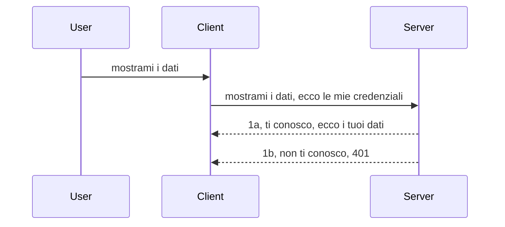

# Autenticazione semplice

Gli SDK MCP supportano l'uso di OAuth 2.1 che, a dire il vero, è un processo piuttosto complesso che coinvolge concetti come server di autenticazione, server di risorse, invio delle credenziali, ottenimento di un codice, scambio del codice per un token bearer fino a poter finalmente ottenere i dati della risorsa. Se non siete abituati a OAuth, che è una cosa ottima da implementare, è una buona idea iniziare con un livello base di autenticazione e costruire da lì una sicurezza sempre migliore. Ecco perché questo capitolo esiste: per portarvi verso autenticazioni più avanzate.

## Autenticazione, cosa intendiamo?

Autenticazione sta per autenticazione e autorizzazione. L'idea è che dobbiamo fare due cose:

- **Autenticazione**, cioè il processo di capire se lasciamo entrare una persona in casa nostra, che ha il diritto di essere "qui", cioè di avere accesso al nostro server di risorse dove vivono le funzionalità del nostro MCP Server.
- **Autorizzazione**, è il processo di scoprire se un utente dovrebbe avere accesso a queste specifiche risorse che sta richiedendo, ad esempio questi ordini o questi prodotti oppure se è autorizzato a leggere il contenuto ma non a cancellarlo come altro esempio.

## Credenziali: come diciamo al sistema chi siamo

Beh, la maggior parte degli sviluppatori web pensa in termini di fornire una credenziale al server, di solito un segreto che dica se sono autorizzati ad essere qui ("Autenticazione"). Questa credenziale è solitamente una versione codificata in base64 di username e password o una chiave API che identifica un utente specifico in modo univoco.

Questo coinvolge l'invio tramite un'intestazione chiamata "Authorization" in questo modo:

```json
{ "Authorization": "secret123" }
```

Questo viene solitamente chiamato autenticazione di base. Il flusso complessivo funziona poi nel modo seguente:


Ora che capiamo come funziona dal punto di vista del flusso, come la implementiamo? Beh, la maggior parte dei web server ha un concetto chiamato middleware, un pezzo di codice che viene eseguito come parte della richiesta che può verificare le credenziali e, se le credenziali sono valide, lascia passare la richiesta. Se la richiesta non ha credenziali valide, ottieni un errore di autenticazione. Vediamo come può essere implementato:

**Python**

```python
class AuthMiddleware(BaseHTTPMiddleware):
    async def dispatch(self, request, call_next):

        has_header = request.headers.get("Authorization")
        if not has_header:
            print("-> Missing Authorization header!")
            return Response(status_code=401, content="Unauthorized")

        if not valid_token(has_header):
            print("-> Invalid token!")
            return Response(status_code=403, content="Forbidden")

        print("Valid token, proceeding...")
       
        response = await call_next(request)
        # aggiungi eventuali intestazioni cliente o modifica in qualche modo la risposta
        return response


starlette_app.add_middleware(CustomHeaderMiddleware)
```

Qui abbiamo:

- Creato un middleware chiamato `AuthMiddleware` dove il suo metodo `dispatch` viene invocato dal web server.
- Aggiunto il middleware al web server:

    ```python
    starlette_app.add_middleware(AuthMiddleware)
    ```

- Scritto la logica di validazione che controlla se l'intestazione Authorization è presente e se il segreto inviato è valido:

    ```python
    has_header = request.headers.get("Authorization")
    if not has_header:
        print("-> Missing Authorization header!")
        return Response(status_code=401, content="Unauthorized")

    if not valid_token(has_header):
        print("-> Invalid token!")
        return Response(status_code=403, content="Forbidden")
    ```

Se il segreto è presente e valido lasciamo passare la richiesta chiamando `call_next` e restituiamo la risposta.

    ```python
    response = await call_next(request)
    # aggiungi eventuali intestazioni personalizzate o modifica in qualche modo la risposta
    return response
    ```

Come funziona è che se viene fatta una richiesta web verso il server il middleware verrà invocato e, data la sua implementazione, lascerà passare la richiesta o restituirà un errore che indica che il client non è autorizzato a proseguire.

**TypeScript**

Qui creiamo un middleware con il popolare framework Express e intercettiamo la richiesta prima che arrivi al MCP Server. Ecco il codice per questo:

```typescript
function isValid(secret) {
    return secret === "secret123";
}

app.use((req, res, next) => {
    // 1. Intestazione di autorizzazione presente?
    if(!req.headers["Authorization"]) {
        res.status(401).send('Unauthorized');
    }
    
    let token = req.headers["Authorization"];

    // 2. Verifica la validità.
    if(!isValid(token)) {
        res.status(403).send('Forbidden');
    }

   
    console.log('Middleware executed');
    // 3. Passa la richiesta al passaggio successivo nella pipeline della richiesta.
    next();
});
```

In questo codice:

1. Controlliamo se l'intestazione Authorization è presente, altrimenti inviamo un errore 401.
2. Assicuriamo che la credenziale/token sia valido, altrimenti inviamo un errore 403.
3. Infine passiamo la richiesta nel pipeline e restituiamo la risorsa richiesta.

## Esercizio: Implementare l'autenticazione

Prendiamo la nostra conoscenza e proviamo a implementarla. Ecco il piano:

Server

- Creare un web server e un'istanza MCP.
- Implementare un middleware per il server.

Client

- Inviare una richiesta web, con credenziale, tramite header.

### -1- Creare un web server e un'istanza MCP

Nel primo passo, dobbiamo creare l'istanza del web server e l'MCP Server.

**Python**

Qui creiamo un'istanza di MCP server, creiamo un'app starlette web e la ospitiamo con uvicorn.

```python
# creando il server MCP

app = FastMCP(
    name="MCP Resource Server",
    instructions="Resource Server that validates tokens via Authorization Server introspection",
    host=settings["host"],
    port=settings["port"],
    debug=True
)

# creando l'app web starlette
starlette_app = app.streamable_http_app()

# servendo l'app tramite uvicorn
async def run(starlette_app):
    import uvicorn
    config = uvicorn.Config(
            starlette_app,
            host=app.settings.host,
            port=app.settings.port,
            log_level=app.settings.log_level.lower(),
        )
    server = uvicorn.Server(config)
    await server.serve()

run(starlette_app)
```

In questo codice:

- Creiamo l'MCP Server.
- Costruiamo l'app starlette dal MCP Server, `app.streamable_http_app()`.
- Ospitiamo e serviamo l'app usando uvicorn `server.serve()`.

**TypeScript**

Qui creiamo un'istanza di MCP Server.

```typescript
const server = new McpServer({
      name: "example-server",
      version: "1.0.0"
    });

    // ... configurare risorse server, strumenti e prompt ...
```

Questa creazione di MCP Server dovrà avvenire all'interno della nostra definizione di route POST /mcp, quindi prendiamo il codice sopra e lo spostiamo così:

```typescript
import express from "express";
import { randomUUID } from "node:crypto";
import { McpServer } from "@modelcontextprotocol/sdk/server/mcp.js";
import { StreamableHTTPServerTransport } from "@modelcontextprotocol/sdk/server/streamableHttp.js";
import { isInitializeRequest } from "@modelcontextprotocol/sdk/types.js"

const app = express();
app.use(express.json());

// Mappa per memorizzare i trasporti per ID sessione
const transports: { [sessionId: string]: StreamableHTTPServerTransport } = {};

// Gestire le richieste POST per la comunicazione client-server
app.post('/mcp', async (req, res) => {
  // Controlla l'ID sessione esistente
  const sessionId = req.headers['mcp-session-id'] as string | undefined;
  let transport: StreamableHTTPServerTransport;

  if (sessionId && transports[sessionId]) {
    // Riutilizza il trasporto esistente
    transport = transports[sessionId];
  } else if (!sessionId && isInitializeRequest(req.body)) {
    // Nuova richiesta di inizializzazione
    transport = new StreamableHTTPServerTransport({
      sessionIdGenerator: () => randomUUID(),
      onsessioninitialized: (sessionId) => {
        // Memorizza il trasporto per ID sessione
        transports[sessionId] = transport;
      },
      // La protezione contro il DNS rebinding è disabilitata per impostazione predefinita per compatibilità con versioni precedenti. Se stai eseguendo questo server
      // localmente, assicurati di impostare:
      // enableDnsRebindingProtection: true,
      // allowedHosts: ['127.0.0.1'],
    });

    // Pulisci il trasporto quando viene chiuso
    transport.onclose = () => {
      if (transport.sessionId) {
        delete transports[transport.sessionId];
      }
    };
    const server = new McpServer({
      name: "example-server",
      version: "1.0.0"
    });

    // ... configura risorse del server, strumenti e prompt ...

    // Connetti al server MCP
    await server.connect(transport);
  } else {
    // Richiesta non valida
    res.status(400).json({
      jsonrpc: '2.0',
      error: {
        code: -32000,
        message: 'Bad Request: No valid session ID provided',
      },
      id: null,
    });
    return;
  }

  // Gestisci la richiesta
  await transport.handleRequest(req, res, req.body);
});

// Gestore riutilizzabile per richieste GET e DELETE
const handleSessionRequest = async (req: express.Request, res: express.Response) => {
  const sessionId = req.headers['mcp-session-id'] as string | undefined;
  if (!sessionId || !transports[sessionId]) {
    res.status(400).send('Invalid or missing session ID');
    return;
  }
  
  const transport = transports[sessionId];
  await transport.handleRequest(req, res);
};

// Gestire le richieste GET per notifiche server-client tramite SSE
app.get('/mcp', handleSessionRequest);

// Gestire le richieste DELETE per la terminazione della sessione
app.delete('/mcp', handleSessionRequest);

app.listen(3000);
```

Ora vedete come la creazione del MCP Server è stata spostata all'interno di `app.post("/mcp")`.

Passiamo al passo successivo di creare il middleware per poter validare la credenziale in ingresso.

### -2- Implementare un middleware per il server

Passiamo alla parte del middleware. Qui creiamo un middleware che cerca una credenziale nell'intestazione `Authorization` e la valida. Se è accettabile, la richiesta passerà per fare quello che deve (ad esempio elencare strumenti, leggere una risorsa o qualsiasi funzionalità MCP richiesta dal client).

**Python**

Per creare il middleware, creiamo una classe che eredita da `BaseHTTPMiddleware`. Ci sono due parti interessanti:

- La richiesta `request`, da cui leggiamo le informazioni dell'intestazione.
- `call_next`, il callback che dobbiamo chiamare se il client ha portato una credenziale che accettiamo.

Prima, dobbiamo gestire il caso in cui manca l'intestazione `Authorization`:

```python
has_header = request.headers.get("Authorization")

# nessuna intestazione presente, fallire con 401, altrimenti continua.
if not has_header:
    print("-> Missing Authorization header!")
    return Response(status_code=401, content="Unauthorized")
```

Qui inviamo un messaggio 401 Unauthorized perché il client fallisce l'autenticazione.

Poi, se è stata inviata una credenziale, dobbiamo controllarne la validità così:

```python
 if not valid_token(has_header):
    print("-> Invalid token!")
    return Response(status_code=403, content="Forbidden")
```

Notate come sopra inviamo un messaggio 403 Forbidden. Vediamo il middleware completo qui sotto che implementa tutto quello che abbiamo detto:

```python
class AuthMiddleware(BaseHTTPMiddleware):
    async def dispatch(self, request, call_next):

        has_header = request.headers.get("Authorization")
        if not has_header:
            print("-> Missing Authorization header!")
            return Response(status_code=401, content="Unauthorized")

        if not valid_token(has_header):
            print("-> Invalid token!")
            return Response(status_code=403, content="Forbidden")

        print("Valid token, proceeding...")
        print(f"-> Received {request.method} {request.url}")
        response = await call_next(request)
        response.headers['Custom'] = 'Example'
        return response

```

Ottimo, ma che dire della funzione `valid_token`? Eccola qui di seguito:

```python
# NON usare in produzione - miglioralo !!
def valid_token(token: str) -> bool:
    # rimuovi il prefisso "Bearer "
    if token.startswith("Bearer "):
        token = token[7:]
        return token == "secret-token"
    return False
```

Questo ovviamente dovrebbe migliorare.

IMPORTANTE: Non dovreste MAI avere segreti di questo tipo nel codice. Idealmente dovreste recuperare il valore da confrontare da una fonte dati o da un IDP (provider di identità) o meglio ancora, lasciare che l'IDP faccia la validazione.

**TypeScript**

Per implementare questo con Express, dobbiamo chiamare il metodo `use` che accetta funzioni middleware.

Dobbiamo:

- Interagire con la variabile request per controllare la credenziale passata nella proprietà `Authorization`.
- Validare la credenziale e, se valida, lasciare continuare la richiesta e permettere che la richiesta MCP del client faccia ciò che deve (ad es. elenco strumenti, lettura risorsa o altro MCP correlato).

Qui controlliamo se l'intestazione `Authorization` è presente e, se non lo è, blocchiamo la richiesta:

```typescript
if(!req.headers["authorization"]) {
    res.status(401).send('Unauthorized');
    return;
}
```

Se l'intestazione non viene inviata in primo luogo, ricevi un 401.

Poi controlliamo se la credenziale è valida, se non lo è blocchiamo di nuovo la richiesta ma con un messaggio leggermente diverso:

```typescript
if(!isValid(token)) {
    res.status(403).send('Forbidden');
    return;
} 
```

Notate come ora viene restituito un errore 403.

Ecco il codice completo:

```typescript
app.use((req, res, next) => {
    console.log('Request received:', req.method, req.url, req.headers);
    console.log('Headers:', req.headers["authorization"]);
    if(!req.headers["authorization"]) {
        res.status(401).send('Unauthorized');
        return;
    }
    
    let token = req.headers["authorization"];

    if(!isValid(token)) {
        res.status(403).send('Forbidden');
        return;
    }  

    console.log('Middleware executed');
    next();
});
```

Abbiamo configurato il web server per accettare un middleware che controlla la credenziale che il client speriamo ci invii. Ma che dire del client stesso?

### -3- Inviare la richiesta web con credenziale tramite header

Dobbiamo assicurarci che il client passi la credenziale tramite l'intestazione. Poiché useremo un client MCP per farlo, dobbiamo capire come farlo.

**Python**

Per il client, dobbiamo passare un'intestazione con la nostra credenziale in questo modo:

```python
# NON codificare il valore, tienilo almeno in una variabile d'ambiente o in una memorizzazione più sicura
token = "secret-token"

async with streamablehttp_client(
        url = f"http://localhost:{port}/mcp",
        headers = {"Authorization": f"Bearer {token}"}
    ) as (
        read_stream,
        write_stream,
        session_callback,
    ):
        async with ClientSession(
            read_stream,
            write_stream
        ) as session:
            await session.initialize()
      
            # DA FARE, ciò che vuoi che venga fatto nel client, es. elenco strumenti, chiamata strumenti ecc.
```

Notate come popoli la proprietà `headers` così ` headers = {"Authorization": f"Bearer {token}"}`.

**TypeScript**

Possiamo risolvere questo in due passi:

1. Popolare un oggetto di configurazione con la nostra credenziale.
2. Passare l'oggetto di configurazione al transport.

```typescript

// NON hardcodare il valore come mostrato qui. Al minimo, impostalo come variabile di ambiente e usa qualcosa come dotenv (in modalità sviluppo).
let token = "secret123"

// definire un oggetto opzioni per il trasporto client
let options: StreamableHTTPClientTransportOptions = {
  sessionId: sessionId,
  requestInit: {
    headers: {
      "Authorization": "secret123"
    }
  }
};

// passa l'oggetto opzioni al trasporto
async function main() {
   const transport = new StreamableHTTPClientTransport(
      new URL(serverUrl),
      options
   );
```

Qui sopra vedete come abbiamo dovuto creare un oggetto `options` e posizionare i nostri header sotto la proprietà `requestInit`.

IMPORTANTE: Come possiamo migliorare da qui? Beh, l'implementazione attuale ha qualche problema. Prima di tutto, passare una credenziale così è piuttosto rischioso a meno che non abbiate almeno HTTPS. Anche allora, la credenziale può essere rubata quindi serve un sistema dove poter revocare facilmente il token e aggiungere controlli aggiuntivi come da dove nel mondo proviene, se la richiesta avviene troppo spesso (comportamento da bot), insomma ci sono tante preoccupazioni.

Va detto però che, per API molto semplici dove non vuoi che nessuno usi la tua API senza essere autenticato, quello che abbiamo qui è un buon inizio.

Detto questo, proviamo a rinforzare un po' la sicurezza usando un formato standardizzato come JSON Web Token, noto anche come JWT o "JOT" token.

## JSON Web Token, JWT

Quindi, stiamo cercando di migliorare rispetto all'invio di credenziali molto semplici. Quali sono i miglioramenti immediati che otteniamo adottando JWT?

- **Miglioramenti di sicurezza**. Nell'autenticazione base, invii username e password come token base64 codificato (o invii una chiave API) ripetutamente, il che aumenta il rischio. Con JWT, invii username e password e ottieni un token in cambio che è anche limitato nel tempo cioè scadrà. JWT ti permette facilmente di usare controlli di accesso granulare usando ruoli, scope e permessi.
- **Statelessness e scalabilità**. I JWT sono auto-contenuti, portano tutte le info dell'utente e eliminano la necessità di archiviazione di sessioni lato server. Il token può anche essere validato localmente.
- **Interoperabilità e federazione**. I JWT sono centrali in Open ID Connect e sono usati con fornitori di identità noti come Entra ID, Google Identity e Auth0. Permettono inoltre di usare single sign-on e molto altro rendendoli di grado enterprise.
- **Modularità e flessibilità**. I JWT possono essere usati anche con API Gateway come Azure API Management, NGINX e altro. Supportano scenari di autenticazione utente e comunicazione server-to-server compresi scenari di impersonificazione e delega.
- **Performance e caching**. I JWT possono essere cachati dopo la decodifica, riducendo la necessità di parsing. Questo aiuta soprattutto con app ad alto traffico migliorando il throughput e riducendo il carico sull'infrastruttura scelta.
- **Funzionalità avanzate**. Supportano inoltre introspezione (verifica della validità sul server) e revoca (rendere un token non valido).

Con tutti questi benefici, vediamo come possiamo portare la nostra implementazione al livello successivo.

## Trasformare l'autenticazione di base in JWT

Quindi, i cambiamenti di alto livello di cui abbiamo bisogno sono:

- **Imparare a costruire un token JWT** e renderlo pronto per essere inviato da client a server.
- **Validare un token JWT** e se è valido, lasciare che il client ottenga le nostre risorse.
- **Archiviazione sicura del token**. Come memorizziamo questo token.
- **Proteggere le route**. Dobbiamo proteggere le route, nel nostro caso, proteggere route e specifiche funzionalità MCP.
- **Aggiungere refresh token**. Assicurarci di creare token a breve durata ma con refresh token a lunga durata che possono essere usati per ottenere nuovi token se scaduti. Assicurarsi anche di avere un endpoint di refresh e una strategia di rotazione.

### -1- Costruire un token JWT

Innanzitutto, un token JWT ha le seguenti parti:

- **header**, algoritmo usato e tipo di token.
- **payload**, claims, come sub (l'utente o entità che il token rappresenta. In uno scenario di auth solitamente è l'id utente), exp (quando scade), role (il ruolo).
- **signature**, firmata con un segreto o chiave privata.

Per questo dobbiamo costruire l'header, il payload e il token codificato.

**Python**

```python

import jwt
import jwt
from jwt.exceptions import ExpiredSignatureError, InvalidTokenError
import datetime

# Chiave segreta usata per firmare il JWT
secret_key = 'your-secret-key'

header = {
    "alg": "HS256",
    "typ": "JWT"
}

# le informazioni utente e le sue dichiarazioni e il tempo di scadenza
payload = {
    "sub": "1234567890",               # Soggetto (ID utente)
    "name": "User Userson",                # Dichiarazione personalizzata
    "admin": True,                     # Dichiarazione personalizzata
    "iat": datetime.datetime.utcnow(),# Emesso il
    "exp": datetime.datetime.utcnow() + datetime.timedelta(hours=1)  # Scadenza
}

# codificalo
encoded_jwt = jwt.encode(payload, secret_key, algorithm="HS256", headers=header)
```

Nel codice sopra abbiamo:

- Definito un header usando HS256 come algoritmo e tipo JWT.
- Costruito un payload che contiene un soggetto o id utente, un username, un ruolo, quando è stato emesso e quando scade, implementando così l'aspetto temporale di cui parlavamo prima.

**TypeScript**

Qui avremo bisogno di alcune dipendenze che ci aiuteranno a costruire il token JWT.

Dipendenze

```sh

npm install jsonwebtoken
npm install --save-dev @types/jsonwebtoken
```

Ora che abbiamo questo, creiamo l'header, il payload e tramite essi creiamo il token codificato.

```typescript
import jwt from 'jsonwebtoken';

const secretKey = 'your-secret-key'; // Usa le variabili d'ambiente in produzione

// Definisci il payload
const payload = {
  sub: '1234567890',
  name: 'User usersson',
  admin: true,
  iat: Math.floor(Date.now() / 1000), // Emesso il
  exp: Math.floor(Date.now() / 1000) + 60 * 60 // Scade in 1 ora
};

// Definisci l'intestazione (opzionale, jsonwebtoken imposta i valori predefiniti)
const header = {
  alg: 'HS256',
  typ: 'JWT'
};

// Crea il token
const token = jwt.sign(payload, secretKey, {
  algorithm: 'HS256',
  header: header
});

console.log('JWT:', token);
```

Questo token è:

Firmato usando HS256
Valido per 1 ora
Include claims come sub, name, admin, iat e exp.

### -2- Validare un token

Dobbiamo anche validare un token, cosa che dovremmo fare sul server per assicurare che ciò che il client ci manda sia effettivamente valido. Ci sono molti controlli da fare, dalla validazione della struttura alla validità. È anche incoraggiato aggiungere altri controlli per vedere se l'utente è nel nostro sistema e altro.

Per validare un token dobbiamo decodificarlo per leggerlo e poi iniziare a controllarne la validità:

**Python**

```python

# Decodifica e verifica il JWT
try:
    decoded = jwt.decode(token, secret_key, algorithms=["HS256"])
    print("✅ Token is valid.")
    print("Decoded claims:")
    for key, value in decoded.items():
        print(f"  {key}: {value}")
except ExpiredSignatureError:
    print("❌ Token has expired.")
except InvalidTokenError as e:
    print(f"❌ Invalid token: {e}")

```

In questo codice chiamiamo `jwt.decode` usando il token, la chiave segreta e l'algoritmo scelto. Nota come usiamo un costrutto try-catch perché una validazione fallita genera un errore.

**TypeScript**

Qui dobbiamo chiamare `jwt.verify` per ottenere una versione decodificata del token che possiamo analizzare ulteriormente. Se questa chiamata fallisce, significa che la struttura del token è incorretta o non più valida.

```typescript

try {
  const decoded = jwt.verify(token, secretKey);
  console.log('Decoded Payload:', decoded);
} catch (err) {
  console.error('Token verification failed:', err);
}
```

NOTA: come detto prima, dovremmo fare ulteriori controlli per accertare che questo token punti a un utente nel nostro sistema e che l'utente abbia i diritti che dichiara di avere.
Successivamente, esaminiamo il controllo di accesso basato sui ruoli, noto anche come RBAC.

## Aggiunta del controllo di accesso basato sui ruoli

L’idea è che vogliamo esprimere che ruoli diversi hanno permessi diversi. Ad esempio, assumiamo che un amministratore possa fare tutto, un utente normale possa leggere/scrivere e un ospite possa solo leggere. Pertanto, ecco alcuni possibili livelli di autorizzazione:

- Admin.Write 
- User.Read
- Guest.Read

Vediamo come possiamo implementare tale controllo con un middleware. I middleware possono essere aggiunti per route così come per tutte le route.

**Python**

```python
from starlette.middleware.base import BaseHTTPMiddleware
from starlette.responses import JSONResponse
import jwt

# NON mettere il segreto nel codice, questo è solo a scopo dimostrativo. Lancialo da un posto sicuro.
SECRET_KEY = "your-secret-key" # metti questo in una variabile d'ambiente
REQUIRED_PERMISSION = "User.Read"

class JWTPermissionMiddleware(BaseHTTPMiddleware):
    async def dispatch(self, request, call_next):
        auth_header = request.headers.get("Authorization")
        if not auth_header or not auth_header.startswith("Bearer "):
            return JSONResponse({"error": "Missing or invalid Authorization header"}, status_code=401)

        token = auth_header.split(" ")[1]
        try:
            decoded = jwt.decode(token, SECRET_KEY, algorithms=["HS256"])
        except jwt.ExpiredSignatureError:
            return JSONResponse({"error": "Token expired"}, status_code=401)
        except jwt.InvalidTokenError:
            return JSONResponse({"error": "Invalid token"}, status_code=401)

        permissions = decoded.get("permissions", [])
        if REQUIRED_PERMISSION not in permissions:
            return JSONResponse({"error": "Permission denied"}, status_code=403)

        request.state.user = decoded
        return await call_next(request)


```

Ci sono diversi modi per aggiungere il middleware come mostrato di seguito:

```python

# Alt 1: aggiungi middleware durante la costruzione dell'app starlette
middleware = [
    Middleware(JWTPermissionMiddleware)
]

app = Starlette(routes=routes, middleware=middleware)

# Alt 2: aggiungi middleware dopo che l'app starlette è già stata costruita
starlette_app.add_middleware(JWTPermissionMiddleware)

# Alt 3: aggiungi middleware per ogni route
routes = [
    Route(
        "/mcp",
        endpoint=..., # gestore
        middleware=[Middleware(JWTPermissionMiddleware)]
    )
]
```

**TypeScript**

Possiamo usare `app.use` e un middleware che verrà eseguito per tutte le richieste.

```typescript
app.use((req, res, next) => {
    console.log('Request received:', req.method, req.url, req.headers);
    console.log('Headers:', req.headers["authorization"]);

    // 1. Verifica se l'intestazione di autorizzazione è stata inviata

    if(!req.headers["authorization"]) {
        res.status(401).send('Unauthorized');
        return;
    }
    
    let token = req.headers["authorization"];

    // 2. Verifica se il token è valido
    if(!isValid(token)) {
        res.status(403).send('Forbidden');
        return;
    }  

    // 3. Verifica se l'utente del token esiste nel nostro sistema
    if(!isExistingUser(token)) {
        res.status(403).send('Forbidden');
        console.log("User does not exist");
        return;
    }
    console.log("User exists");

    // 4. Verifica che il token abbia i permessi corretti
    if(!hasScopes(token, ["User.Read"])){
        res.status(403).send('Forbidden - insufficient scopes');
    }

    console.log("User has required scopes");

    console.log('Middleware executed');
    next();
});

```

Ci sono parecchie cose che possiamo lasciare fare al nostro middleware e che il nostro middleware DOVREBBE fare, ovvero:

1. Controllare se è presente l’header di autorizzazione
2. Verificare che il token sia valido, chiamiamo `isValid` che è un metodo che abbiamo scritto per controllare l'integrità e la validità del token JWT.
3. Verificare che l’utente esista nel nostro sistema, dobbiamo controllare questo.

   ```typescript
    // utenti nel DB
   const users = [
     "user1",
     "User usersson",
   ]

   function isExistingUser(token) {
     let decodedToken = verifyToken(token);

     // DA FARE, controlla se l'utente esiste nel DB
     return users.includes(decodedToken?.name || "");
   }
   ```

   Sopra, abbiamo creato una lista molto semplice di `users`, che ovviamente dovrebbe essere in un database.

4. Inoltre, dovremmo anche controllare che il token abbia i permessi corretti.

   ```typescript
   if(!hasScopes(token, ["User.Read"])){
        res.status(403).send('Forbidden - insufficient scopes');
   }
   ```

   Nel codice sopra del middleware, controlliamo che il token contenga il permesso User.Read, altrimenti inviamo un errore 403. Di seguito il metodo helper `hasScopes`.

   ```typescript
   function hasScopes(scope: string, requiredScopes: string[]) {
     let decodedToken = verifyToken(scope);
    return requiredScopes.every(scope => decodedToken?.scopes.includes(scope));
  }
   ```

Have a think which additional checks you should be doing, but these are the absolute minimum of checks you should be doing.

Using Express as a web framework is a common choice. There are helpers library when you use JWT so you can write less code.

- `express-jwt`, helper library that provides a middleware that helps decode your token.
- `express-jwt-permissions`, this provides a middleware `guard` that helps check if a certain permission is on the token.

Here's what these libraries can look like when used:

```typescript
const express = require('express');
const jwt = require('express-jwt');
const guard = require('express-jwt-permissions')();

const app = express();
const secretKey = 'your-secret-key'; // put this in env variable

// Decode JWT and attach to req.user
app.use(jwt({ secret: secretKey, algorithms: ['HS256'] }));

// Check for User.Read permission
app.use(guard.check('User.Read'));

// multiple permissions
// app.use(guard.check(['User.Read', 'Admin.Access']));

app.get('/protected', (req, res) => {
  res.json({ message: `Welcome ${req.user.name}` });
});

// Error handler
app.use((err, req, res, next) => {
  if (err.code === 'permission_denied') {
    return res.status(403).send('Forbidden');
  }
  next(err);
});

```

Ora avete visto come il middleware possa essere usato sia per l’autenticazione che per l’autorizzazione; ma per MCP, cambia qualcosa nel modo in cui facciamo l'autenticazione? Scopriamolo nella prossima sezione.

### -3- Aggiungere RBAC a MCP

Avete visto finora come è possibile aggiungere RBAC tramite middleware, però, per MCP non esiste un modo semplice per aggiungere RBAC per singola feature MCP, quindi cosa facciamo? Beh, dobbiamo solo aggiungere codice come questo che verifica in questo caso se il client ha i diritti per chiamare uno strumento specifico:

Avete diverse opzioni su come realizzare RBAC per singola feature, eccone alcune:

- Aggiungere un controllo per ogni strumento, risorsa, prompt dove è necessario verificare il livello di autorizzazione.

   **python**

   ```python
   @tool()
   def delete_product(id: int):
      try:
          check_permissions(role="Admin.Write", request)
      catch:
        pass # il cliente non ha superato l'autorizzazione, genera un errore di autorizzazione
   ```

   **typescript**

   ```typescript
   server.registerTool(
    "delete-product",
    {
      title: Delete a product",
      description: "Deletes a product",
      inputSchema: { id: z.number() }
    },
    async ({ id }) => {
      
      try {
        checkPermissions("Admin.Write", request);
        // da fare, inviare l'id a productService e voci remote
      } catch(Exception e) {
        console.log("Authorization error, you're not allowed");  
      }

      return {
        content: [{ type: "text", text: `Deletected product with id ${id}` }]
      };
    }
   );
   ```


- Usare un approccio server avanzato e gli handler delle richieste così da minimizzare i posti in cui effettuare il controllo.

   **Python**

   ```python
   
   tool_permission = {
      "create_product": ["User.Write", "Admin.Write"],
      "delete_product": ["Admin.Write"]
   }

   def has_permission(user_permissions, required_permissions) -> bool:
      # autorizzazioni_utente: lista dei permessi che l'utente ha
      # autorizzazioni_necessarie: lista dei permessi richiesti per lo strumento
      return any(perm in user_permissions for perm in required_permissions)

   @server.call_tool()
   async def handle_call_tool(
     name: str, arguments: dict[str, str] | None
   ) -> list[types.TextContent]:
    # Presupponi che request.user.permissions sia una lista di permessi per l'utente
     user_permissions = request.user.permissions
     required_permissions = tool_permission.get(name, [])
     if not has_permission(user_permissions, required_permissions):
        # Solleva errore "Non hai il permesso di chiamare lo strumento {name}"
        raise Exception(f"You don't have permission to call tool {name}")
     # continua ed esegui lo strumento
     # ...
   ```   
   

   **TypeScript**

   ```typescript
   function hasPermission(userPermissions: string[], requiredPermissions: string[]): boolean {
       if (!Array.isArray(userPermissions) || !Array.isArray(requiredPermissions)) return false;
       // Restituisce true se l'utente ha almeno una delle autorizzazioni richieste
       
       return requiredPermissions.some(perm => userPermissions.includes(perm));
   }
  
   server.setRequestHandler(CallToolRequestSchema, async (request) => {
      const { params: { name } } = request;
  
      let permissions = request.user.permissions;
  
      if (!hasPermission(permissions, toolPermissions[name])) {
         return new Error(`You don't have permission to call ${name}`);
      }
  
      // continua..
   });
   ```

   Nota, dovrai assicurarti che il middleware assegni un token decodificato alla proprietà user della richiesta così il codice sopra sarà semplice.

### Riassumendo

Ora che abbiamo discusso come aggiungere supporto per RBAC in generale e per MCP in particolare, è il momento di provare a implementare la sicurezza da soli per assicurarti di aver compreso i concetti presentati.

## Compito 1: Costruire un server mcp e un client mcp usando l'autenticazione di base

Qui utilizzerai ciò che hai imparato riguardo all'invio delle credenziali tramite gli header.

## Soluzione 1

[Soluzione 1](./code/basic/README.md)

## Compito 2: Migliorare la soluzione del Compito 1 usando JWT

Prendi la prima soluzione ma questa volta, miglioriamola.

Invece di usare l’autenticazione Basic, usiamo JWT.

## Soluzione 2

[Soluzione 2](./solution/jwt-solution/README.md)

## Sfida

Aggiungi RBAC per singolo strumento come descritto nella sezione "Aggiungere RBAC a MCP".

## Sommario

Speriamo che abbiate imparato molto in questo capitolo, da nessuna sicurezza, a sicurezza base, a JWT e come può essere aggiunto a MCP.

Abbiamo costruito una solida base con JWT personalizzati, ma mentre cresciamo, ci stiamo muovendo verso un modello di identità basato su standard. Adottare un IdP come Entra o Keycloak ci permette di delegare l’emissione, la validazione e la gestione del ciclo di vita del token a una piattaforma di fiducia — liberandoci di concentrarci sulla logica dell’app e sull’esperienza utente.

Per questo, abbiamo un capitolo più [avanzato su Entra](../../05-AdvancedTopics/mcp-security-entra/README.md)

## Cosa c’è dopo

- Successivo: [Configurazione degli host MCP](../12-mcp-hosts/README.md)

---

<!-- CO-OP TRANSLATOR DISCLAIMER START -->
**Avvertenza**:
Questo documento è stato tradotto utilizzando il servizio di traduzione automatica AI [Co-op Translator](https://github.com/Azure/co-op-translator). Pur impegnandoci per garantire accuratezza, si prega di notare che le traduzioni automatiche possono contenere errori o imprecisioni. Il documento originale nella sua lingua nativa deve essere considerato la fonte autorevole. Per informazioni critiche, si raccomanda una traduzione professionale effettuata da un umano. Non ci assumiamo responsabilità per eventuali incomprensioni o interpretazioni errate derivanti dall'uso di questa traduzione.
<!-- CO-OP TRANSLATOR DISCLAIMER END -->