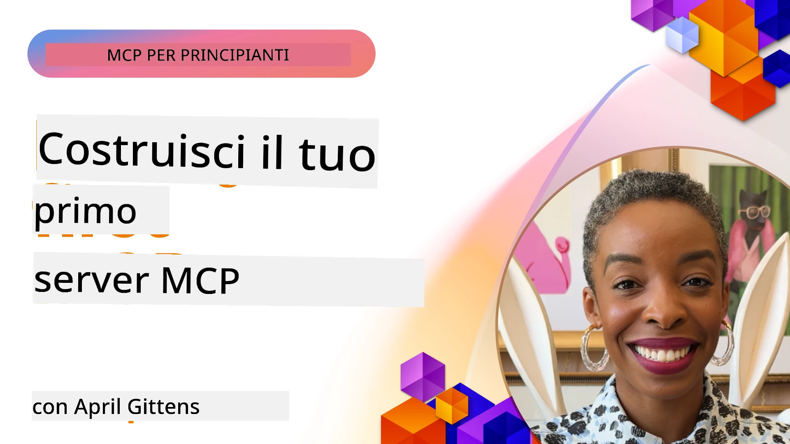

## Iniziare  

_(Clicca sull'immagine sopra per vedere il video di questa lezione)_

Questa sezione è composta da diverse lezioni:

- **1 Il tuo primo server**, in questa prima lezione, imparerai come creare il tuo primo server e ispezionarlo con lo strumento inspector, un modo prezioso per testare e fare il debug del tuo server, [alla lezione](01-first-server/README.md)

- **2 Client**, in questa lezione, imparerai come scrivere un client che possa connettersi al tuo server, [alla lezione](02-client/README.md)

- **3 Client con LLM**, un modo ancora migliore di scrivere un client è aggiungendo un LLM in modo che possa "negoziare" con il tuo server cosa fare, [alla lezione](03-llm-client/README.md)

- **4 Utilizzo di un server in modalità agente GitHub Copilot in Visual Studio Code**. Qui, stiamo esaminando l'esecuzione del nostro server MCP da Visual Studio Code, [alla lezione](04-vscode/README.md)

- **5 Server di trasporto stdio** stdio è lo standard raccomandato per la comunicazione locale server-client MCP, fornendo comunicazione sicura basata su sottoprocesso con isolamento di processo integrato [alla lezione](05-stdio-server/README.md)

- **6 Streaming HTTP con MCP (HTTP streaming)**. Scopri il moderno trasporto streaming HTTP (l'approccio raccomandato per server MCP remoti secondo [Specifiche MCP 2025-11-25](https://spec.modelcontextprotocol.io/specification/2025-11-25/basic/transports/#streamable-http)), notifiche di progresso e come implementare server e client MCP scalabili e in tempo reale usando HTTP streaming. [alla lezione](06-http-streaming/README.md)

- **7 Utilizzo del Toolkit AI per VSCode** per consumare e testare i tuoi Client e Server MCP [alla lezione](07-aitk/README.md)

- **8 Testing**. Qui ci concentreremo specialmente su come possiamo testare il nostro server e client in modi diversi, [alla lezione](08-testing/README.md)

- **9 Deployment**. Questo capitolo esamina diversi modi per distribuire le tue soluzioni MCP, [alla lezione](09-deployment/README.md)

- **10 Uso avanzato del server**. Questo capitolo tratta l'uso avanzato del server, [alla lezione](./10-advanced/README.md)

- **11 Autenticazione**. Questo capitolo tratta come aggiungere un'autenticazione semplice, da Basic Auth all'uso di JWT e RBAC. È consigliabile iniziare qui e poi esaminare gli Argomenti Avanzati nel Capitolo 5 e seguire ulteriori misure di sicurezza raccomandate nel Capitolo 2, [alla lezione](./11-simple-auth/README.md)

- **12 Host MCP**. Configura e usa popolari client host MCP tra cui Claude Desktop, Cursor, Cline e Windsurf. Scopri i tipi di trasporto e la risoluzione dei problemi, [alla lezione](./12-mcp-hosts/README.md)

- **13 MCP Inspector**. Debugga e testa interattivamente i tuoi server MCP usando lo strumento MCP Inspector. Impara a risolvere problemi di strumenti, risorse e messaggi di protocollo, [alla lezione](./13-mcp-inspector/README.md)

Il Model Context Protocol (MCP) è un protocollo aperto che standardizza come le applicazioni forniscono contesto agli LLM. Pensa a MCP come a una porta USB-C per applicazioni AI - fornisce un modo standardizzato per collegare modelli AI a diverse fonti di dati e strumenti.

## Obiettivi di apprendimento

Alla fine di questa lezione, sarai in grado di:

- Configurare ambienti di sviluppo per MCP in C#, Java, Python, TypeScript e JavaScript
- Costruire e distribuire server MCP base con funzionalità personalizzate (risorse, prompt e strumenti)
- Creare applicazioni host che si connettono a server MCP
- Testare e fare il debug di implementazioni MCP
- Comprendere le sfide comuni di configurazione e le loro soluzioni
- Connettere le tue implementazioni MCP ai servizi LLM più usati

## Configurare il tuo ambiente MCP

Prima di iniziare a lavorare con MCP, è importante preparare il tuo ambiente di sviluppo e comprendere il flusso di lavoro di base. Questa sezione ti guiderà nei passaggi iniziali per assicurarti un avvio senza problemi con MCP.

### Prerequisiti

Prima di tuffarti nello sviluppo MCP, assicurati di avere:

- **Ambiente di sviluppo**: per il linguaggio scelto (C#, Java, Python, TypeScript o JavaScript)
- **IDE/Editor**: Visual Studio, Visual Studio Code, IntelliJ, Eclipse, PyCharm o qualsiasi editor di codice moderno
- **Gestori di pacchetti**: NuGet, Maven/Gradle, pip o npm/yarn
- **Chiavi API**: per qualsiasi servizio AI che intendi usare nelle tue applicazioni host

### SDK ufficiali

Nei prossimi capitoli vedrai soluzioni costruite usando Python, TypeScript, Java e .NET. Ecco tutti gli SDK ufficialmente supportati.

MCP fornisce SDK ufficiali per più linguaggi (allineati con [Specifiche MCP 2025-11-25](https://spec.modelcontextprotocol.io/specification/2025-11-25/)):
- [SDK C#](https://github.com/modelcontextprotocol/csharp-sdk) - Mantenuto in collaborazione con Microsoft
- [SDK Java](https://github.com/modelcontextprotocol/java-sdk) - Mantenuto in collaborazione con Spring AI
- [SDK TypeScript](https://github.com/modelcontextprotocol/typescript-sdk) - L'implementazione ufficiale TypeScript
- [SDK Python](https://github.com/modelcontextprotocol/python-sdk) - L'implementazione ufficiale Python (FastMCP)
- [SDK Kotlin](https://github.com/modelcontextprotocol/kotlin-sdk) - L'implementazione ufficiale Kotlin
- [SDK Swift](https://github.com/modelcontextprotocol/swift-sdk) - Mantenuto in collaborazione con Loopwork AI
- [SDK Rust](https://github.com/modelcontextprotocol/rust-sdk) - L'implementazione ufficiale Rust
- [SDK Go](https://github.com/modelcontextprotocol/go-sdk) - L'implementazione ufficiale Go

## Punti chiave

- Configurare un ambiente di sviluppo MCP è semplice con SDK specifici per linguaggio
- Costruire server MCP implica creare e registrare strumenti con schemi chiari
- I client MCP si connettono a server e modelli per sfruttare capacità estese
- Testare e fare il debug sono fondamentali per implementazioni MCP affidabili
- Le opzioni di deployment variano dallo sviluppo locale a soluzioni cloud

## Praticare

Abbiamo un set di esempi che completano gli esercizi che vedrai in tutti i capitoli di questa sezione. Inoltre ogni capitolo ha anche i suoi esercizi e compiti

- [Calcolatrice Java](./samples/java/calculator/README.md)
- [Calcolatrice .Net](../../../03-GettingStarted/samples/csharp)
- [Calcolatrice JavaScript](./samples/javascript/README.md)
- [Calcolatrice TypeScript](./samples/typescript/README.md)
- [Calcolatrice Python](../../../03-GettingStarted/samples/python)

## Risorse aggiuntive

- [Costruire agenti usando Model Context Protocol su Azure](https://learn.microsoft.com/azure/developer/ai/intro-agents-mcp)
- [MCP remoto con Azure Container Apps (Node.js/TypeScript/JavaScript)](https://learn.microsoft.com/samples/azure-samples/mcp-container-ts/mcp-container-ts/)
- [Agente MCP OpenAI .NET](https://learn.microsoft.com/samples/azure-samples/openai-mcp-agent-dotnet/openai-mcp-agent-dotnet/)

## Cosa c'è dopo 

Inizia con la prima lezione: [Creare il tuo primo server MCP](01-first-server/README.md)

Una volta completato questo modulo, continua con: [Modulo 4: Implementazione pratica](../04-PracticalImplementation/README.md)

---

<!-- CO-OP TRANSLATOR DISCLAIMER START -->
**Avvertenza**:  
Questo documento è stato tradotto utilizzando il servizio di traduzione automatica [Co-op Translator](https://github.com/Azure/co-op-translator). Pur impegnandoci per garantire l’accuratezza, si prega di considerare che le traduzioni automatiche possono contenere errori o imprecisioni. Il documento originale nella sua lingua nativa deve essere considerato la fonte autorevole. Per informazioni critiche, si raccomanda una traduzione professionale umana. Non siamo responsabili per eventuali fraintendimenti o interpretazioni errate derivanti dall’uso di questa traduzione.
<!-- CO-OP TRANSLATOR DISCLAIMER END -->