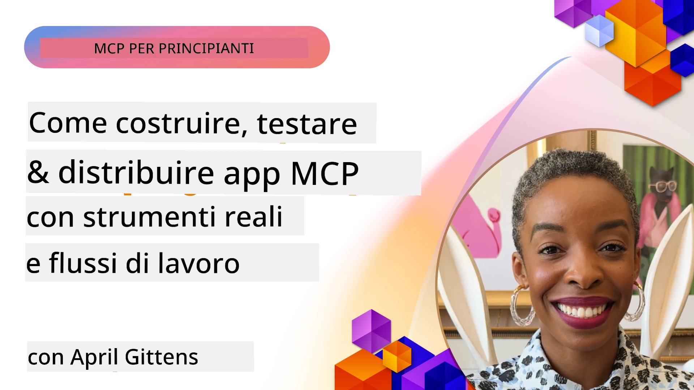
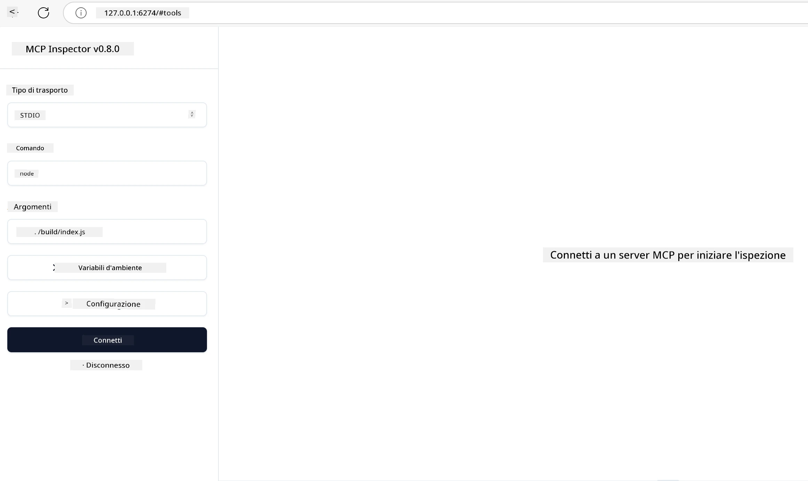

# Implementazione Pratica

[](https://youtu.be/vCN9-mKBDfQ)

_(Clicca sull'immagine sopra per vedere il video di questa lezione)_

L'implementazione pratica è il punto in cui il potere del Model Context Protocol (MCP) diventa tangibile. Sebbene comprendere la teoria e l'architettura dietro MCP sia importante, il vero valore emerge quando applichi questi concetti per costruire, testare e distribuire soluzioni che risolvono problemi del mondo reale. Questo capitolo colma il divario tra conoscenza concettuale e sviluppo pratico, guidandoti nel processo di dare vita ad applicazioni basate su MCP.

Che tu stia sviluppando assistenti intelligenti, integrando l'IA nei flussi di lavoro aziendali o costruendo strumenti personalizzati per l'elaborazione dei dati, MCP fornisce una base flessibile. Il suo design indipendente dal linguaggio e gli SDK ufficiali per i linguaggi di programmazione più diffusi lo rendono accessibile a una vasta gamma di sviluppatori. Sfruttando questi SDK, puoi prototipare rapidamente, iterare e scalare le tue soluzioni su diverse piattaforme e ambienti.

Nelle sezioni seguenti troverai esempi pratici, codice di esempio e strategie di distribuzione che dimostrano come implementare MCP in C#, Java con Spring, TypeScript, JavaScript e Python. Imparerai anche come fare il debug e testare i tuoi server MCP, gestire API e distribuire soluzioni nel cloud usando Azure. Queste risorse pratiche sono progettate per accelerare il tuo apprendimento e aiutarti a costruire con sicurezza applicazioni MCP robuste e pronte per la produzione.

## Panoramica

Questa lezione si concentra sugli aspetti pratici dell'implementazione MCP in diversi linguaggi di programmazione. Esploreremo come usare gli SDK MCP in C#, Java con Spring, TypeScript, JavaScript e Python per costruire applicazioni robuste, fare debug e testare server MCP, e creare risorse, prompt e strumenti riutilizzabili.

## Obiettivi di Apprendimento

Al termine di questa lezione, sarai in grado di:

- Implementare soluzioni MCP usando gli SDK ufficiali in vari linguaggi di programmazione
- Fare debug e testare sistematicamente i server MCP
- Creare e usare funzionalità server (Risorse, Prompt e Strumenti)
- Progettare flussi di lavoro MCP efficaci per compiti complessi
- Ottimizzare le implementazioni MCP per prestazioni e affidabilità

## Risorse SDK Ufficiali

Il Model Context Protocol offre SDK ufficiali per più linguaggi (allineati con [Specifiche MCP 2025-11-25](https://spec.modelcontextprotocol.io/specification/2025-11-25/)):

- [SDK C#](https://github.com/modelcontextprotocol/csharp-sdk)
- [SDK Java con Spring](https://github.com/modelcontextprotocol/java-sdk) **Nota:** richiede dipendenza da [Project Reactor](https://projectreactor.io). (Vedi [discussione issue 246](https://github.com/orgs/modelcontextprotocol/discussions/246).)
- [SDK TypeScript](https://github.com/modelcontextprotocol/typescript-sdk)
- [SDK Python](https://github.com/modelcontextprotocol/python-sdk)
- [SDK Kotlin](https://github.com/modelcontextprotocol/kotlin-sdk)
- [SDK Go](https://github.com/modelcontextprotocol/go-sdk)

## Lavorare con gli SDK MCP

Questa sezione fornisce esempi pratici di implementazione MCP in diversi linguaggi di programmazione. Puoi trovare codice di esempio nella directory `samples` organizzata per linguaggio.

### Esempi Disponibili

Il repository include [implementazioni di esempio](../../../04-PracticalImplementation/samples) nei seguenti linguaggi:

- [C#](./samples/csharp/README.md)
- [Java con Spring](./samples/java/containerapp/README.md)
- [TypeScript](./samples/typescript/README.md)
- [JavaScript](./samples/javascript/README.md)
- [Python](./samples/python/README.md)

Ogni esempio dimostra i concetti chiave MCP e i pattern di implementazione per quel linguaggio ed ecosistema specifici.

### Guide Pratiche

Guide aggiuntive per implementazioni pratiche MCP:

- [Paginazione e Grandi Set di Risultati](./pagination/README.md) - Gestire la paginazione basata su cursore per strumenti, risorse e grandi dataset

## Funzionalità Core del Server

I server MCP possono implementare qualsiasi combinazione di queste funzionalità:

### Risorse

Le risorse forniscono contesto e dati per l'utente o il modello AI da utilizzare:

- Repository di documenti
- Basi di conoscenza
- Fonti di dati strutturati
- Sistemi di file

### Prompt

I prompt sono messaggi e flussi di lavoro template per gli utenti:

- Template conversazionali predefiniti
- Pattern di interazione guidata
- Strutture di dialogo specializzate

### Strumenti

Gli strumenti sono funzioni che il modello AI può eseguire:

- Utilità di elaborazione dati
- Integrazioni con API esterne
- Capacità computazionali
- Funzionalità di ricerca

## Esempi di Implementazione: Implementazione C#

Il repository ufficiale dello SDK C# contiene diversi esempi di implementazione che dimostrano aspetti differenti di MCP:

- **Client MCP Base**: esempio semplice che mostra come creare un client MCP e chiamare strumenti
- **Server MCP Base**: implementazione minimale di server con registrazione base degli strumenti
- **Server MCP Avanzato**: server completo con registrazione strumenti, autenticazione e gestione errori
- **Integrazione ASP.NET**: esempi che mostrano l'integrazione con ASP.NET Core
- **Pattern di Implementazione Strumenti**: vari pattern per implementare strumenti con diversi livelli di complessità

Lo SDK MCP C# è in anteprima e le API potrebbero cambiare. Aggiorneremo continuamente questo blog man mano che lo SDK evolve.

### Funzionalità Chiave

- [Nuget MCP C# ModelContextProtocol](https://www.nuget.org/packages/ModelContextProtocol)
- Costruisci il tuo [primo Server MCP](https://devblogs.microsoft.com/dotnet/build-a-model-context-protocol-mcp-server-in-csharp/).

Per esempi completi di implementazioni C#, visita il [repository ufficiale degli esempi SDK C#](https://github.com/modelcontextprotocol/csharp-sdk)

## Esempio di implementazione: Implementazione Java con Spring

Lo SDK Java con Spring offre opzioni robuste per l'implementazione MCP con funzionalità di livello enterprise.

### Funzionalità Chiave

- Integrazione con Spring Framework
- Forte sicurezza dei tipi
- Supporto per programmazione reattiva
- Gestione completa degli errori

Per un esempio completo di implementazione Java con Spring, vedi [Java con Spring sample](samples/java/containerapp/README.md) nella directory degli esempi.

## Esempio di implementazione: Implementazione JavaScript

Lo SDK JavaScript fornisce un approccio leggero e flessibile all'implementazione MCP.

### Funzionalità Chiave

- Supporto per Node.js e browser
- API basata su Promise
- Facile integrazione con Express e altri framework
- Supporto WebSocket per streaming

Per un esempio completo di implementazione JavaScript, vedi [JavaScript sample](samples/javascript/README.md) nella directory degli esempi.

## Esempio di implementazione: Implementazione Python

Lo SDK Python offre un approccio Pythonico all'implementazione MCP con eccellenti integrazioni per framework ML.

### Funzionalità Chiave

- Supporto async/await con asyncio
- Integrazione FastAPI``
- Registrazione semplice degli strumenti
- Integrazione nativa con librerie ML popolari

Per un esempio completo di implementazione Python, vedi [Python sample](samples/python/README.md) nella directory degli esempi.

## Gestione API

Azure API Management è una grande risposta su come possiamo mettere in sicurezza i server MCP. L'idea è mettere un'istanza Azure API Management davanti al tuo server MCP e far gestire a essa funzionalità che probabilmente vorrai come:

- limitazione della frequenza (rate limiting)
- gestione dei token
- monitoraggio
- bilanciamento del carico
- sicurezza

### Esempio Azure

Ecco un esempio Azure che fa esattamente questo, cioè [crea un server MCP e lo protegge con Azure API Management](https://github.com/Azure-Samples/remote-mcp-apim-functions-python).

Guarda come avviene il flusso di autorizzazione nell'immagine sottostante:


Nell'immagine sopra, avvengono le seguenti operazioni:

- L'autenticazione/autorizzazione avviene usando Microsoft Entra.
- Azure API Management agisce come gateway e usa politiche per indirizzare e gestire il traffico.
- Azure Monitor registra tutte le richieste per ulteriori analisi.

#### Flusso di autorizzazione

Esaminiamo più nel dettaglio il flusso di autorizzazione:


#### Specifica autorizzazione MCP

Scopri di più sulla [specifica di autorizzazione MCP](https://spec.modelcontextprotocol.io/specification/2025-11-25/basic/authorization/)

## Distribuire Remote MCP Server su Azure

Vediamo se possiamo distribuire l'esempio menzionato prima:

1. Clona il repository

    ```bash
    git clone https://github.com/Azure-Samples/remote-mcp-apim-functions-python.git
    cd remote-mcp-apim-functions-python
    ```

1. Registra il provider di risorse `Microsoft.App`.

   - Se usi Azure CLI, esegui `az provider register --namespace Microsoft.App --wait`.
   - Se usi Azure PowerShell, esegui `Register-AzResourceProvider -ProviderNamespace Microsoft.App`. Poi esegui `(Get-AzResourceProvider -ProviderNamespace Microsoft.App).RegistrationState` dopo un po' di tempo per verificare se la registrazione è completata.

1. Esegui questo comando [azd](https://aka.ms/azd) per fornire il servizio di gestione API, l'app funzione (con codice) e tutte le altre risorse Azure necessarie

    ```shell
    azd up
    ```

    Questo comando dovrebbe distribuire tutte le risorse cloud su Azure

### Testare il tuo server con MCP Inspector

1. In una **nuova finestra del terminale**, installa ed esegui MCP Inspector

    ```shell
    npx @modelcontextprotocol/inspector
    ```

    Dovresti vedere un'interfaccia simile a:

    

1. CTRL clicca per caricare l'app web MCP Inspector dall'URL mostrato dall'app (es. [http://127.0.0.1:6274/#resources](http://127.0.0.1:6274/#resources))
1. Imposta il tipo di trasporto su `SSE`
1. Imposta l'URL al tuo endpoint SSE API Management in esecuzione mostrato dopo `azd up` e **connetti**:

    ```shell
    https://<apim-servicename-from-azd-output>.azure-api.net/mcp/sse
    ```

1. **Elenca gli Strumenti**. Clicca su uno strumento e **Esegui Strumento**.

Se tutti i passaggi hanno funzionato, ora dovresti essere connesso al server MCP e essere riuscito a chiamare uno strumento.

## Server MCP per Azure

[Remote-mcp-functions](https://github.com/Azure-Samples/remote-mcp-functions-dotnet): Questo set di repository è un template di quickstart per costruire e distribuire server MCP personalizzati remoti (Model Context Protocol) usando Azure Functions con Python, C# .NET o Node/TypeScript.

Gli esempi forniscono una soluzione completa che permette agli sviluppatori di:

- Costruire ed eseguire localmente: sviluppare e fare debug di un server MCP su macchina locale
- Distribuire su Azure: distribuire facilmente nel cloud con un semplice comando azd up
- Connettersi da client: connettersi al server MCP da vari client inclusa la modalità agente Copilot di VS Code e lo strumento MCP Inspector

### Funzionalità Chiave

- Sicurezza by design: il server MCP è protetto tramite chiavi e HTTPS
- Opzioni di autenticazione: supporta OAuth usando autenticazione integrata e/o API Management
- Isolamento di rete: permette isolamento di rete usando Azure Virtual Networks (VNET)
- Architettura serverless: sfrutta Azure Functions per esecuzione scalabile e basata su eventi
- Sviluppo locale: supporto completo per sviluppo e debug locale
- Distribuzione semplice: processo di distribuzione semplificato su Azure

Il repository include tutti i file di configurazione necessari, codice sorgente e definizioni di infrastruttura per iniziare rapidamente con un'implementazione MCP pronta per la produzione.

- [Azure Remote MCP Functions Python](https://github.com/Azure-Samples/remote-mcp-functions-python) - Implementazione esempio MCP usando Azure Functions con Python

- [Azure Remote MCP Functions .NET](https://github.com/Azure-Samples/remote-mcp-functions-dotnet) - Implementazione esempio MCP usando Azure Functions con C# .NET

- [Azure Remote MCP Functions Node/Typescript](https://github.com/Azure-Samples/remote-mcp-functions-typescript) - Implementazione esempio MCP usando Azure Functions con Node/TypeScript.

## Punti Chiave

- Gli SDK MCP forniscono strumenti specifici per linguaggio per implementare soluzioni MCP robuste
- Il processo di debug e test è critico per applicazioni MCP affidabili
- I template di prompt riutilizzabili permettono interazioni AI coerenti
- Flussi di lavoro ben progettati possono orchestrare compiti complessi usando più strumenti
- Implementare soluzioni MCP richiede considerazione di sicurezza, prestazioni e gestione degli errori

## Esercizio

Progetta un flusso di lavoro MCP pratico che affronti un problema reale nel tuo dominio:

1. Individua 3-4 strumenti che sarebbero utili per risolvere questo problema
2. Crea un diagramma del flusso che mostri come questi strumenti interagiscono
3. Implementa una versione base di uno degli strumenti usando il tuo linguaggio preferito
4. Crea un template prompt che aiuti il modello a usare efficacemente il tuo strumento

## Risorse Aggiuntive

---

## Cosa c'è dopo

Successivo: [Argomenti Avanzati](../05-AdvancedTopics/README.md)

---

<!-- CO-OP TRANSLATOR DISCLAIMER START -->
**Disclaimer**:  
Questo documento è stato tradotto utilizzando il servizio di traduzione AI [Co-op Translator](https://github.com/Azure/co-op-translator). Pur impegnandoci per l’accuratezza, si prega di notare che le traduzioni automatiche possono contenere errori o inesattezze. Il documento originale nella sua lingua madre deve essere considerato la fonte autorevole. Per informazioni critiche, si raccomanda una traduzione professionale umana. Non siamo responsabili per eventuali malintesi o interpretazioni errate derivanti dall’uso di questa traduzione.
<!-- CO-OP TRANSLATOR DISCLAIMER END -->