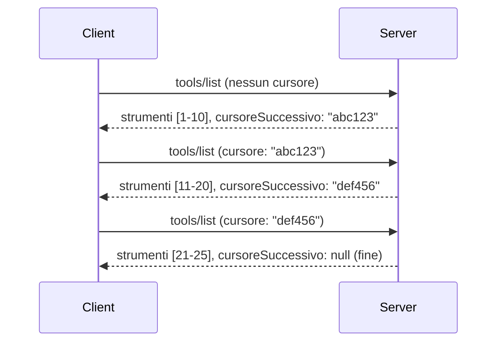

# Paginazione e Set di Risultati Estesi in MCP

Quando il tuo server MCP gestisce grandi set di dati - che si tratti di elencare migliaia di file, record di database o risultati di ricerca - è necessaria la paginazione per gestire la memoria in modo efficiente e offrire esperienze utente reattive. Questa guida spiega come implementare e utilizzare la paginazione in MCP.

## Perché la Paginazione è Importante

Senza la paginazione, risposte di grandi dimensioni possono causare:

- **Esaurimento della memoria** - Caricamento di milioni di record contemporaneamente
- **Tempi di risposta lenti** - Gli utenti attendono che tutti i dati vengano caricati
- **Errori di timeout** - Le richieste superano i limiti di timeout
- **Scarso rendimento dell’AI** - LLMs faticano con contesti enormi

MCP utilizza la **paginazione basata su cursore** per una navigazione affidabile e coerente tra i set di risultati.

---

## Come Funziona la Paginazione in MCP

### Il Concetto di Cursore

Un **cursore** è una stringa opaca che segnala la tua posizione in un set di risultati. Pensalo come un segnalibro in un libro lungo.


### Paginazione nei Metodi MCP

Questi metodi MCP supportano la paginazione:

| Metodo | Restituisce | Supporto Cursore |
|--------|-------------|------------------|
| `tools/list` | Definizioni degli strumenti | ✅ |
| `resources/list` | Definizioni delle risorse | ✅ |
| `prompts/list` | Definizioni dei prompt | ✅ |
| `resources/templates/list` | Template delle risorse | ✅ |

---

## Implementazione sul Server

### Python (FastMCP)

```python
from mcp.server import Server
from mcp.types import Tool, ListToolsResult
import math

app = Server("paginated-server")

# Simulato grande set di dati
ALL_TOOLS = [
    Tool(name=f"tool_{i}", description=f"Tool number {i}", inputSchema={})
    for i in range(100)
]

PAGE_SIZE = 10

@app.list_tools()
async def list_tools(cursor: str | None = None) -> ListToolsResult:
    """List tools with pagination support."""
    
    # Decodifica il cursore per ottenere l'indice di partenza
    start_index = 0
    if cursor:
        try:
            start_index = int(cursor)
        except ValueError:
            start_index = 0
    
    # Ottieni la pagina dei risultati
    end_index = min(start_index + PAGE_SIZE, len(ALL_TOOLS))
    page_tools = ALL_TOOLS[start_index:end_index]
    
    # Calcola il cursore successivo
    next_cursor = None
    if end_index < len(ALL_TOOLS):
        next_cursor = str(end_index)
    
    return ListToolsResult(
        tools=page_tools,
        nextCursor=next_cursor
    )
```

### TypeScript

```typescript
import { Server } from "@modelcontextprotocol/sdk/server/index.js";
import { ListToolsResultSchema } from "@modelcontextprotocol/sdk/types.js";

const server = new Server({
  name: "paginated-server",
  version: "1.0.0"
});

// Dataset grande simulato
const ALL_TOOLS = Array.from({ length: 100 }, (_, i) => ({
  name: `tool_${i}`,
  description: `Tool number ${i}`,
  inputSchema: { type: "object", properties: {} }
}));

const PAGE_SIZE = 10;

server.setRequestHandler(ListToolsResultSchema, async (request) => {
  // Decodifica cursore
  let startIndex = 0;
  if (request.params?.cursor) {
    startIndex = parseInt(request.params.cursor, 10) || 0;
  }
  
  // Ottieni pagina di risultati
  const endIndex = Math.min(startIndex + PAGE_SIZE, ALL_TOOLS.length);
  const pageTools = ALL_TOOLS.slice(startIndex, endIndex);
  
  // Calcola cursore successivo
  const nextCursor = endIndex < ALL_TOOLS.length ? String(endIndex) : undefined;
  
  return {
    tools: pageTools,
    nextCursor
  };
});
```

### Java (Spring MCP)

```java
@Service
public class PaginatedToolService {
    
    private static final int PAGE_SIZE = 10;
    private final List<Tool> allTools;
    
    public PaginatedToolService() {
        // Inizializza un grande set di dati
        this.allTools = IntStream.range(0, 100)
            .mapToObj(i -> new Tool("tool_" + i, "Tool number " + i, Map.of()))
            .collect(Collectors.toList());
    }
    
    @McpMethod("tools/list")
    public ListToolsResult listTools(@Param("cursor") String cursor) {
        // Decodifica il cursore
        int startIndex = 0;
        if (cursor != null && !cursor.isEmpty()) {
            try {
                startIndex = Integer.parseInt(cursor);
            } catch (NumberFormatException e) {
                startIndex = 0;
            }
        }
        
        // Ottieni pagina di risultati
        int endIndex = Math.min(startIndex + PAGE_SIZE, allTools.size());
        List<Tool> pageTools = allTools.subList(startIndex, endIndex);
        
        // Calcola il cursore successivo
        String nextCursor = endIndex < allTools.size() ? String.valueOf(endIndex) : null;
        
        return new ListToolsResult(pageTools, nextCursor);
    }
}
```

---

## Implementazione sul Client

### Client Python

```python
from mcp import ClientSession

async def get_all_tools(session: ClientSession) -> list:
    """Fetch all tools using pagination."""
    all_tools = []
    cursor = None
    
    while True:
        result = await session.list_tools(cursor=cursor)
        all_tools.extend(result.tools)
        
        if result.nextCursor is None:
            break
        cursor = result.nextCursor
    
    return all_tools

# Uso
async with client_session as session:
    tools = await get_all_tools(session)
    print(f"Found {len(tools)} tools")
```

### Client TypeScript

```typescript
import { Client } from "@modelcontextprotocol/sdk/client/index.js";

async function getAllTools(client: Client): Promise<Tool[]> {
  const allTools: Tool[] = [];
  let cursor: string | undefined = undefined;
  
  do {
    const result = await client.listTools({ cursor });
    allTools.push(...result.tools);
    cursor = result.nextCursor;
  } while (cursor);
  
  return allTools;
}

// Uso
const tools = await getAllTools(client);
console.log(`Found ${tools.length} tools`);
```

### Pattern di Lazy Loading

Per set di dati molto grandi, carica le pagine su richiesta:

```python
class PaginatedToolIterator:
    """Lazily iterate through paginated tools."""
    
    def __init__(self, session: ClientSession):
        self.session = session
        self.cursor = None
        self.buffer = []
        self.exhausted = False
    
    async def __anext__(self):
        # Restituisci dal buffer se disponibile
        if self.buffer:
            return self.buffer.pop(0)
        
        # Controlla se abbiamo esaurito tutte le pagine
        if self.exhausted:
            raise StopAsyncIteration
        
        # Recupera la pagina successiva
        result = await self.session.list_tools(cursor=self.cursor)
        self.buffer = list(result.tools)
        self.cursor = result.nextCursor
        
        if self.cursor is None:
            self.exhausted = True
        
        if not self.buffer:
            raise StopAsyncIteration
        
        return self.buffer.pop(0)
    
    def __aiter__(self):
        return self

# Uso - efficiente in memoria per grandi set di dati
async for tool in PaginatedToolIterator(session):
    process_tool(tool)
```

---

## Paginazione per le Risorse

Le risorse spesso necessitano di paginazione per cartelle o grandi set di dati:

```python
from mcp.server import Server
from mcp.types import Resource, ListResourcesResult
import os

app = Server("file-server")

@app.list_resources()
async def list_resources(cursor: str | None = None) -> ListResourcesResult:
    """List files in directory with pagination."""
    
    directory = "/data/files"
    all_files = sorted(os.listdir(directory))
    
    # Decodifica cursore (indice file)
    start_index = int(cursor) if cursor else 0
    page_size = 20
    end_index = min(start_index + page_size, len(all_files))
    
    # Crea lista delle risorse per questa pagina
    resources = []
    for filename in all_files[start_index:end_index]:
        filepath = os.path.join(directory, filename)
        resources.append(Resource(
            uri=f"file://{filepath}",
            name=filename,
            mimeType="application/octet-stream"
        ))
    
    # Calcola il cursore successivo
    next_cursor = str(end_index) if end_index < len(all_files) else None
    
    return ListResourcesResult(
        resources=resources,
        nextCursor=next_cursor
    )
```

---

## Strategie di Progettazione del Cursore

### Strategia 1: Basata su Indice (Semplice)

```python
# Il cursore è solo l'indice
cursor = "50"  # Inizia dall'elemento 50
```

**Pro:** Semplice, senza stato  
**Contro:** I risultati possono variare se gli elementi vengono aggiunti/rimossi

### Strategia 2: Basata su ID (Stabile)

```python
# Il cursore è l'ID visto per ultimo
cursor = "item_abc123"  # Inizia dopo questo elemento
```

**Pro:** Stabile anche se gli elementi cambiano  
**Contro:** Richiede ID ordinati

### Strategia 3: Stato Codificato (Complesso)

```python
import base64
import json

def encode_cursor(state: dict) -> str:
    return base64.b64encode(json.dumps(state).encode()).decode()

def decode_cursor(cursor: str) -> dict:
    return json.loads(base64.b64decode(cursor).decode())

# Il cursore contiene più campi di stato
cursor = encode_cursor({
    "offset": 50,
    "filter": "active",
    "sort": "name"
})
```

**Pro:** Può codificare stati complessi  
**Contro:** Più complesso, stringhe di cursore più lunghe

---

## Best Practices

### 1. Scegliere Dimensioni di Pagina Appropriate

```python
# Considera la dimensione dei dati
PAGE_SIZE_SMALL_ITEMS = 100   # Metadati semplici
PAGE_SIZE_MEDIUM_ITEMS = 20   # Oggetti più ricchi
PAGE_SIZE_LARGE_ITEMS = 5     # Contenuto complesso
```

### 2. Gestire i Cursori Non ValidI con Grazia

```python
@app.list_tools()
async def list_tools(cursor: str | None = None) -> ListToolsResult:
    try:
        start_index = int(cursor) if cursor else 0
        if start_index < 0 or start_index >= len(ALL_TOOLS):
            start_index = 0  # Reimposta all'inizio
    except (ValueError, TypeError):
        start_index = 0  # Cursore non valido, ricomincia da capo
    # ...
```

### 3. Includere il Conteggio Totale (Opzionale)

```python
return ListToolsResult(
    tools=page_tools,
    nextCursor=next_cursor,
    # Alcune implementazioni includono il totale per il progresso dell'interfaccia utente
    _meta={"total": len(ALL_TOOLS)}
)
```

### 4. Testare i Casi Limite

```python
async def test_pagination():
    # Risultato vuoto
    result = await session.list_tools()
    assert result.tools == []
    assert result.nextCursor is None
    
    # Singola pagina
    result = await session.list_tools()
    assert len(result.tools) <= PAGE_SIZE
    
    # Cursore non valido
    result = await session.list_tools(cursor="invalid")
    assert result.tools  # Dovrebbe restituire la prima pagina
```

---

## Errori Comuni

### ❌ Restituire Tutti i Risultati e Poi Paginare nel Client

```python
# MALE: Carica tutto nella memoria
@app.list_tools()
async def list_tools() -> ListToolsResult:
    all_tools = load_all_tools()  # 1 milione di strumenti!
    return ListToolsResult(tools=all_tools)
```

### ✅ Paginare alla Fonte dei Dati

```python
# BENE: Carica solo ciò che è necessario
@app.list_tools()
async def list_tools(cursor: str | None = None) -> ListToolsResult:
    offset = int(cursor) if cursor else 0
    tools = await db.query_tools(offset=offset, limit=PAGE_SIZE)
    return ListToolsResult(tools=tools, nextCursor=...)
```

---

## Cosa Fare Dopo

- [Modulo 5.14 - Context Engineering](../../05-AdvancedTopics/mcp-contextengineering/README.md)
- [Modulo 8 - Best Practices](../../08-BestPractices/README.md)
- [3.8 - Testare il Tuo Server MCP](../../03-GettingStarted/08-testing/README.md)

---

## Risorse Aggiuntive

- [Specifiche MCP - Paginazione](https://spec.modelcontextprotocol.io/specification/2025-11-25/)
- [Paginazione Basata su Cursore Spiegata](https://slack.engineering/evolving-api-pagination-at-slack/)
- [Test di paginazione Python SDK](https://github.com/modelcontextprotocol/python-sdk/blob/main/tests/client/test_list_methods_cursor.py)

---

<!-- CO-OP TRANSLATOR DISCLAIMER START -->
**Dichiarazione di non responsabilità**:  
Questo documento è stato tradotto utilizzando il servizio di traduzione AI [Co-op Translator](https://github.com/Azure/co-op-translator). Pur impegnandoci per garantire la precisione, si prega di considerare che le traduzioni automatiche possono contenere errori o inesattezze. Il documento originale nella sua lingua nativa deve essere considerato la fonte autorevole. Per informazioni critiche, si raccomanda una traduzione professionale effettuata da un traduttore umano. Non siamo responsabili per eventuali incomprensioni o interpretazioni errate derivanti dall’uso di questa traduzione.
<!-- CO-OP TRANSLATOR DISCLAIMER END -->