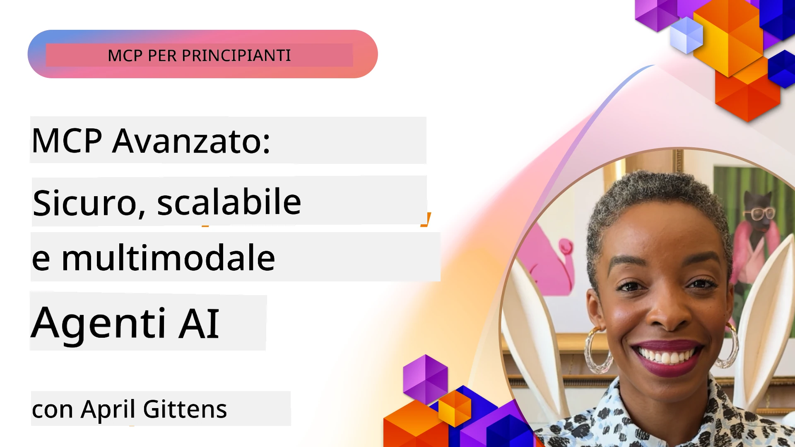

# Argomenti Avanzati in MCP

_(Clicca sull'immagine sopra per vedere il video di questa lezione)_

Questo capitolo copre una serie di argomenti avanzati nell'implementazione del Model Context Protocol (MCP), inclusa l'integrazione multimodale, la scalabilità, le migliori pratiche di sicurezza e l'integrazione enterprise. Questi argomenti sono fondamentali per costruire applicazioni MCP robuste e pronte per la produzione che possano soddisfare le esigenze dei sistemi di IA moderni.

## Panoramica

Questa lezione esplora concetti avanzati nell'implementazione del Model Context Protocol, con un focus sull'integrazione multimodale, la scalabilità, le migliori pratiche di sicurezza e l'integrazione enterprise. Questi argomenti sono essenziali per costruire applicazioni MCP di livello produttivo in grado di gestire requisiti complessi negli ambienti enterprise.

## Obiettivi di Apprendimento

Al termine di questa lezione, sarai in grado di:

- Implementare capacità multimodali all'interno dei framework MCP
- Progettare architetture MCP scalabili per scenari ad alta domanda
- Applicare le migliori pratiche di sicurezza in linea con i principi di sicurezza MCP
- Integrare MCP con sistemi e framework AI enterprise
- Ottimizzare le prestazioni e l'affidabilità negli ambienti di produzione

## Lezioni e Progetti di esempio

| Link | Titolo | Descrizione |
|------|--------|-------------|
| [5.1 Integration with Azure](./mcp-integration/README.md) | Integrazione con Azure | Impara come integrare il tuo Server MCP su Azure |
| [5.2 Multi modal sample](./mcp-multi-modality/README.md) | Esempi Multi modali MCP | Esempi per risposte audio, immagini e multimodali |
| [5.3 MCP OAuth2 sample](../../../05-AdvancedTopics/mcp-oauth2-demo) | Demo MCP OAuth2 | Applicazione Spring Boot minimale che mostra OAuth2 con MCP, sia come Authorization che Resource Server. Dimostra emissione sicura di token, endpoint protetti, deployment su Azure Container Apps e integrazione con API Management. |
| [5.4 Root Contexts](./mcp-root-contexts/README.md) | Contesti radice | Scopri di più sui contesti radice e come implementarli |
| [5.5 Routing](./mcp-routing/README.md) | Routing | Scopri diversi tipi di routing |
| [5.6 Sampling](./mcp-sampling/README.md) | Campionamento | Impara come lavorare con il campionamento |
| [5.7 Scaling](./mcp-scaling/README.md) | Scalabilità | Impara sulla scalabilità |
| [5.8 Security](./mcp-security/README.md) | Sicurezza | Metti in sicurezza il tuo Server MCP |
| [5.9 Web Search sample](./web-search-mcp/README.md) | Ricerca Web MCP | Server e client Python MCP che integra SerpAPI per ricerche web, notizie, prodotti e Q&A in tempo reale. Dimostra orchestrazione multi-tool, integrazione API esterne, e gestione robusta degli errori. |
| [5.10 Realtime Streaming](./mcp-realtimestreaming/README.md) | Streaming | Lo streaming dati in tempo reale è diventato essenziale nel mondo guidato dai dati di oggi, dove aziende e applicazioni richiedono accesso immediato alle informazioni per prendere decisioni tempestive.|
| [5.11 Realtime Web Search](./mcp-realtimesearch/README.md) | Ricerca Web | Come MCP trasforma la ricerca web in tempo reale fornendo un approccio standardizzato alla gestione del contesto tra modelli AI, motori di ricerca e applicazioni.| 
| [5.12  Entra ID Authentication for Model Context Protocol Servers](./mcp-security-entra/README.md) | Autenticazione Entra ID | Microsoft Entra ID fornisce una soluzione robusta di gestione delle identità e accessi basata sul cloud, aiutando a garantire che solo utenti e applicazioni autorizzati possano interagire con il tuo server MCP.|
| [5.13 Azure AI Foundry Agent Integration](./mcp-foundry-agent-integration/README.md) | Integrazione Azure AI Foundry | Scopri come integrare i server Model Context Protocol con agenti Azure AI Foundry, abilitando potenti orchestrazioni di strumenti e capacità AI enterprise con connessioni standardizzate a fonti dati esterne.|
| [5.14 Context Engineering](./mcp-contextengineering/README.md) | Ingegneria del Contesto | Opportunità future delle tecniche di ingegneria del contesto per i server MCP, inclusa l'ottimizzazione del contesto, la gestione dinamica del contesto e le strategie per un'efficace prompt engineering all'interno dei framework MCP.|
| [5.15 MCP Custom Transport](./mcp-transport/README.md) | Trasporto Personalizzato | Impara come implementare meccanismi di trasporto personalizzati per scenari di comunicazione MCP specializzati.|
| [5.16 Protocol Features Deep Dive](./mcp-protocol-features/README.md) | Funzionalità del Protocollo | Padroneggia funzionalità avanzate del protocollo, inclusi notifiche di progresso, cancellazione richieste, template di risorse e modelli di gestione degli errori.|

> **Novità nella Specifica MCP 2025-11-25**: La specifica ora include supporto sperimentale per **Tasks** (operazioni di lunga durata con monitoraggio del progresso), **Annotazioni degli Strumenti** (metadati sul comportamento degli strumenti per la sicurezza), **URL Mode Elicitation** (richiesta di contenuti specifici di URL dai client) e radici potenziate (**Roots**) per la gestione del contesto del workspace. Vedi il [registro delle modifiche della Specifica MCP](https://spec.modelcontextprotocol.io/) per i dettagli completi.

## Riferimenti Aggiuntivi

Per le informazioni più aggiornate sugli argomenti avanzati di MCP, fai riferimento a:
- [Documentazione MCP](https://modelcontextprotocol.io/)
- [Specifiche MCP (2025-11-25)](https://spec.modelcontextprotocol.io/specification/2025-11-25/)
- [Repository GitHub](https://github.com/modelcontextprotocol)
- [OWASP MCP Top 10](https://microsoft.github.io/mcp-azure-security-guide/mcp/) - Rischi e mitigazioni di sicurezza
- [Workshop MCP Security Summit (Sherpa)](https://azure-samples.github.io/sherpa/) - Formazione pratica sulla sicurezza

## Punti Chiave

- Le implementazioni MCP multimodali estendono le capacità AI oltre l'elaborazione del testo
- La scalabilità è essenziale per i deployment aziendali e può essere affrontata con scaling orizzontale e verticale
- Misure di sicurezza complete proteggono i dati e garantiscono il controllo degli accessi
- L'integrazione enterprise con piattaforme come Azure OpenAI e Microsoft AI Foundry potenzia le capacità MCP
- Le implementazioni MCP avanzate beneficiano di architetture ottimizzate e una gestione attenta delle risorse

## Esercizio

Progetta un'implementazione MCP di livello enterprise per un caso d'uso specifico:

1. Identifica i requisiti multimodali per il tuo caso d'uso
2. Delinea i controlli di sicurezza necessari per proteggere i dati sensibili
3. Progetta un'architettura scalabile che possa gestire carichi variabili
4. Pianifica i punti di integrazione con sistemi AI enterprise
5. Documenta i possibili colli di bottiglia di prestazioni e strategie di mitigazione

## Risorse Aggiuntive

- [Documentazione Azure OpenAI](https://learn.microsoft.com/en-us/azure/ai-services/openai/)
- [Documentazione Microsoft AI Foundry](https://learn.microsoft.com/en-us/ai-services/)

---

## Cosa c'è dopo

Esplora le lezioni in questo modulo a partire da: [5.1 MCP Integration](./mcp-integration/README.md)

Una volta completato questo modulo, continua con: [Modulo 6: Contributi della Comunità](../06-CommunityContributions/README.md)

---

<!-- CO-OP TRANSLATOR DISCLAIMER START -->
**Disclaimer**:  
Questo documento è stato tradotto utilizzando il servizio di traduzione automatica [Co-op Translator](https://github.com/Azure/co-op-translator). Pur impegnandoci per garantire l’accuratezza, si prega di notare che le traduzioni automatiche possono contenere errori o imprecisioni. Il documento originale nella sua lingua nativa deve essere considerato la fonte autorevole. Per informazioni critiche si raccomanda la traduzione professionale effettuata da un traduttore umano. Non ci assumiamo alcuna responsabilità per eventuali incomprensioni o interpretazioni errate derivanti dall’uso di questa traduzione.
<!-- CO-OP TRANSLATOR DISCLAIMER END -->