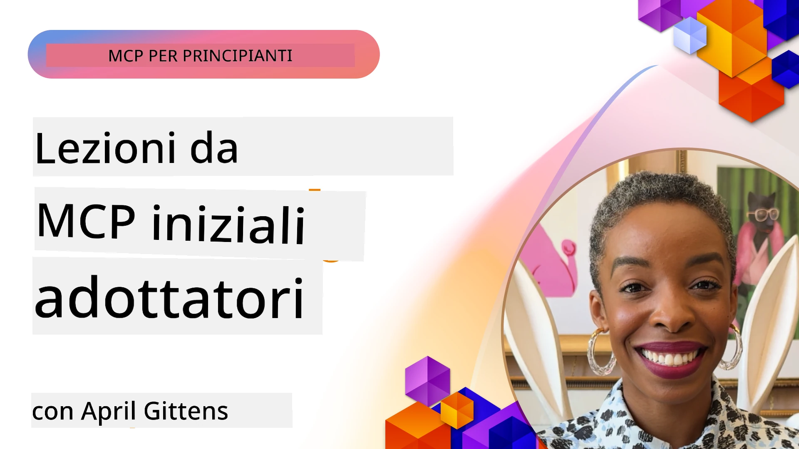

# 🌟 Lezioni dai Primi Adottanti

[](https://youtu.be/jds7dSmNptE)

_(Clicca sull'immagine sopra per vedere il video di questa lezione)_

## 🎯 Cosa Copre Questo Modulo

Questo modulo esplora come organizzazioni e sviluppatori reali stanno sfruttando il Model Context Protocol (MCP) per risolvere sfide concrete e guidare l’innovazione. Attraverso casi di studio dettagliati, progetti pratici ed esempi concreti, scoprirai come MCP consente un’integrazione AI sicura e scalabile che collega modelli linguistici, strumenti e dati aziendali.

### 📚 Vedi MCP in Azione

Vuoi vedere questi principi applicati a strumenti pronti per la produzione? Dai un’occhiata ai nostri [**10 Server MCP Microsoft che Stanno Trasformando la Produttività degli Sviluppatori**](microsoft-mcp-servers.md), che mostrano server MCP Microsoft reali che puoi utilizzare oggi.

## Panoramica

Questa lezione esplora come i primi adottanti hanno sfruttato il Model Context Protocol (MCP) per risolvere sfide reali e guidare l’innovazione in diversi settori. Attraverso casi di studio dettagliati e progetti pratici, vedrai come MCP consente un’integrazione AI standardizzata, sicura e scalabile—collegando grandi modelli linguistici, strumenti e dati aziendali in un quadro unificato. Acquisirai esperienza pratica nel progettare e costruire soluzioni basate su MCP, imparerai da pattern di implementazione collaudati e scoprirai le migliori pratiche per il deployment di MCP in ambienti di produzione. La lezione mette inoltre in evidenza tendenze emergenti, direzioni future e risorse open source per aiutarti a rimanere all’avanguardia della tecnologia MCP e del suo ecosistema in evoluzione.

## Obiettivi di Apprendimento

- Analizzare implementazioni MCP reali in diversi settori
- Progettare e costruire applicazioni complete basate su MCP
- Esplorare tendenze emergenti e direzioni future nella tecnologia MCP
- Applicare le migliori pratiche in scenari di sviluppo reali

## Implementazioni MCP nel Mondo Reale

### Caso di Studio 1: Automazione del Supporto Clienti Aziendale

Una multinazionale ha implementato una soluzione basata su MCP per standardizzare le interazioni AI attraverso i loro sistemi di supporto clienti. Questo ha permesso di:

- Creare un’interfaccia unificata per più fornitori LLM
- Mantenere una gestione coerente dei prompt tra i dipartimenti
- Implementare controlli di sicurezza e conformità robusti
- Passare facilmente tra diversi modelli AI in base alle esigenze specifiche

**Implementazione Tecnica:**

```python
# Implementazione del server MCP in Python per il supporto clienti
import logging
import asyncio
from modelcontextprotocol import create_server, ServerConfig
from modelcontextprotocol.server import MCPServer
from modelcontextprotocol.transports import create_http_transport
from modelcontextprotocol.resources import ResourceDefinition
from modelcontextprotocol.prompts import PromptDefinition
from modelcontextprotocol.tool import ToolDefinition

# Configura il logging
logging.basicConfig(level=logging.INFO)

async def main():
    # Crea la configurazione del server
    config = ServerConfig(
        name="Enterprise Customer Support Server",
        version="1.0.0",
        description="MCP server for handling customer support inquiries"
    )
    
    # Inizializza il server MCP
    server = create_server(config)
    
    # Registra le risorse della knowledge base
    server.resources.register(
        ResourceDefinition(
            name="customer_kb",
            description="Customer knowledge base documentation"
        ),
        lambda params: get_customer_documentation(params)
    )
    
    # Registra i modelli di prompt
    server.prompts.register(
        PromptDefinition(
            name="support_template",
            description="Templates for customer support responses"
        ),
        lambda params: get_support_templates(params)
    )
    
    # Registra gli strumenti di supporto
    server.tools.register(
        ToolDefinition(
            name="ticketing",
            description="Create and update support tickets"
        ),
        handle_ticketing_operations
    )
    
    # Avvia il server con trasporto HTTP
    transport = create_http_transport(port=8080)
    await server.run(transport)

if __name__ == "__main__":
    asyncio.run(main())
```
  
**Risultati:** Riduzione del 30% dei costi del modello, miglioramento del 45% nella coerenza delle risposte e maggiore conformità nelle operazioni globali.

### Caso di Studio 2: Assistente Diagnostico Sanitario

Un fornitore sanitario ha sviluppato un’infrastruttura MCP per integrare più modelli AI medici specializzati garantendo la protezione dei dati sensibili dei pazienti:  

- Passaggio fluido tra modelli medici generalisti e specialisti  
- Controlli rigorosi sulla privacy e tracciabilità delle attività  
- Integrazione con sistemi di Cartelle Cliniche Elettroniche (EHR) esistenti  
- Ingegneria dei prompt coerente per la terminologia medica  

**Implementazione Tecnica:**

```csharp
// C# MCP host application implementation in healthcare application
using Microsoft.Extensions.DependencyInjection;
using ModelContextProtocol.SDK.Client;
using ModelContextProtocol.SDK.Security;
using ModelContextProtocol.SDK.Resources;

public class DiagnosticAssistant
{
    private readonly MCPHostClient _mcpClient;
    private readonly PatientContext _patientContext;
    
    public DiagnosticAssistant(PatientContext patientContext)
    {
        _patientContext = patientContext;
        
        // Configure MCP client with healthcare-specific settings
        var clientOptions = new ClientOptions
        {
            Name = "Healthcare Diagnostic Assistant",
            Version = "1.0.0",
            Security = new SecurityOptions
            {
                Encryption = EncryptionLevel.Medical,
                AuditEnabled = true
            }
        };
        
        _mcpClient = new MCPHostClientBuilder()
            .WithOptions(clientOptions)
            .WithTransport(new HttpTransport("https://healthcare-mcp.example.org"))
            .WithAuthentication(new HIPAACompliantAuthProvider())
            .Build();
    }
    
    public async Task<DiagnosticSuggestion> GetDiagnosticAssistance(
        string symptoms, string patientHistory)
    {
        // Create request with appropriate resources and tool access
        var resourceRequest = new ResourceRequest
        {
            Name = "patient_records",
            Parameters = new Dictionary<string, object>
            {
                ["patientId"] = _patientContext.PatientId,
                ["requestingProvider"] = _patientContext.ProviderId
            }
        };
        
        // Request diagnostic assistance using appropriate prompt
        var response = await _mcpClient.SendPromptRequestAsync(
            promptName: "diagnostic_assistance",
            parameters: new Dictionary<string, object>
            {
                ["symptoms"] = symptoms,
                patientHistory = patientHistory,
                relevantGuidelines = _patientContext.GetRelevantGuidelines()
            });
            
        return DiagnosticSuggestion.FromMCPResponse(response);
    }
}
```
  
**Risultati:** Migliorate le indicazioni diagnostiche per i medici mantenendo la piena conformità HIPAA e significativa riduzione dei cambi di contesto tra sistemi.

### Caso di Studio 3: Analisi del Rischio nei Servizi Finanziari

Un istituto finanziario ha implementato MCP per standardizzare i processi di analisi del rischio tra i diversi dipartimenti:  

- Creata un’interfaccia unificata per modelli di rischio credito, rilevamento frodi e rischio investimenti  
- Implementati severi controlli di accesso e versionamento dei modelli  
- Garantita auditabilità di tutte le raccomandazioni AI  
- Mantenuta coerenza nel formato dei dati tra sistemi diversificati  

**Implementazione Tecnica:**

```java
// Server MCP Java per la valutazione del rischio finanziario
import org.mcp.server.*;
import org.mcp.security.*;

public class FinancialRiskMCPServer {
    public static void main(String[] args) {
        // Crea server MCP con funzionalità di conformità finanziaria
        MCPServer server = new MCPServerBuilder()
            .withModelProviders(
                new ModelProvider("risk-assessment-primary", new AzureOpenAIProvider()),
                new ModelProvider("risk-assessment-audit", new LocalLlamaProvider())
            )
            .withPromptTemplateDirectory("./compliance/templates")
            .withAccessControls(new SOCCompliantAccessControl())
            .withDataEncryption(EncryptionStandard.FINANCIAL_GRADE)
            .withVersionControl(true)
            .withAuditLogging(new DatabaseAuditLogger())
            .build();
            
        server.addRequestValidator(new FinancialDataValidator());
        server.addResponseFilter(new PII_RedactionFilter());
        
        server.start(9000);
        
        System.out.println("Financial Risk MCP Server running on port 9000");
    }
}
```
  
**Risultati:** Migliorata la conformità normativa, cicli di deployment dei modelli più veloci del 40% e migliore coerenza nella valutazione del rischio tra i dipartimenti.

### Caso di Studio 4: Microsoft Playwright MCP Server per l’Automazione Browser

Microsoft ha sviluppato il [Playwright MCP server](https://github.com/microsoft/playwright-mcp) per abilitare l’automazione browser sicura e standardizzata attraverso il Model Context Protocol. Questo server pronto per la produzione consente ad agenti AI e LLM di interagire con browser web in modo controllato, verificabile ed estensibile—per casi d’uso come test web automatizzati, estrazione dati e workflow end-to-end.

> **🎯 Strumento Pronto per la Produzione**  
>  
> Questo caso di studio mostra un server MCP reale che puoi utilizzare oggi! Scopri di più sul Playwright MCP Server e altri 9 server MCP Microsoft pronti per la produzione nella nostra [**Guida ai Server MCP Microsoft**](microsoft-mcp-servers.md#8--playwright-mcp-server).

**Caratteristiche Principali:**  
- Espone capacità di automazione browser (navigazione, compilazione moduli, cattura screenshot, ecc.) come strumenti MCP  
- Implementa rigorosi controlli di accesso e sandboxing per prevenire azioni non autorizzate  
- Fornisce log di audit dettagliati per tutte le interazioni con il browser  
- Supporta integrazione con Azure OpenAI e altri fornitori LLM per automazione guidata da agenti  
- Alimenta il Coding Agent di GitHub Copilot con capacità di navigazione web  

**Implementazione Tecnica:**

```typescript
// TypeScript: Registrazione degli strumenti di automazione del browser Playwright in un server MCP
import { createServer, ToolDefinition } from 'modelcontextprotocol';
import { launch } from 'playwright';

const server = createServer({
  name: 'Playwright MCP Server',
  version: '1.0.0',
  description: 'MCP server for browser automation using Playwright'
});

// Registrare uno strumento per navigare a un URL e catturare uno screenshot
server.tools.register(
  new ToolDefinition({
    name: 'navigate_and_screenshot',
    description: 'Navigate to a URL and capture a screenshot',
    parameters: {
      url: { type: 'string', description: 'The URL to visit' }
    }
  }),
  async ({ url }) => {
    const browser = await launch();
    const page = await browser.newPage();
    await page.goto(url);
    const screenshot = await page.screenshot();
    await browser.close();
    return { screenshot };
  }
);

// Avvia il server MCP
server.listen(8080);
```
  
**Risultati:**  

- Abilitata automazione browser programmata e sicura per agenti AI e LLM  
- Ridotta la fatica dei test manuali e migliorata la copertura dei test per applicazioni web  
- Fornito un framework riutilizzabile ed estensibile per l’integrazione di strumenti basati su browser negli ambienti aziendali  
- Alimenta le capacità di navigazione web di GitHub Copilot  

**Riferimenti:**  

- [Playwright MCP Server GitHub Repository](https://github.com/microsoft/playwright-mcp)  
- [Microsoft AI and Automation Solutions](https://azure.microsoft.com/en-us/products/ai-services/)

### Caso di Studio 5: Azure MCP – Model Context Protocol as a Service Enterprise-Grade

Azure MCP Server ([https://aka.ms/azmcp](https://aka.ms/azmcp)) è l’implementazione gestita e enterprise-grade di Microsoft del Model Context Protocol, progettata per offrire capacità server MCP scalabili, sicure e conformi come servizio cloud. Azure MCP consente alle organizzazioni di distribuire, gestire e integrare rapidamente server MCP con Azure AI, dati e servizi di sicurezza, riducendo l’overhead operativo e accelerando l’adozione dell’AI.

> **🎯 Strumento Pronto per la Produzione**  
>  
> Questo è un server MCP reale che puoi usare oggi! Scopri di più sull’Azure AI Foundry MCP Server nella nostra [**Guida ai Server MCP Microsoft**](microsoft-mcp-servers.md).

- Hosting server MCP completamente gestito con scaling, monitoraggio e sicurezza integrati  
- Integrazione nativa con Azure OpenAI, Azure AI Search e altri servizi Azure  
- Autenticazione e autorizzazione enterprise tramite Microsoft Entra ID  
- Supporto per strumenti personalizzati, template di prompt e connettori di risorse  
- Conformità con requisiti di sicurezza e normativi enterprise  

**Implementazione Tecnica:**

```yaml
# Example: Azure MCP server deployment configuration (YAML)
apiVersion: mcp.microsoft.com/v1
kind: McpServer
metadata:
  name: enterprise-mcp-server
spec:
  modelProviders:
    - name: azure-openai
      type: AzureOpenAI
      endpoint: https://<your-openai-resource>.openai.azure.com/
      apiKeySecret: <your-azure-keyvault-secret>
  tools:
    - name: document_search
      type: AzureAISearch
      endpoint: https://<your-search-resource>.search.windows.net/
      apiKeySecret: <your-azure-keyvault-secret>
  authentication:
    type: EntraID
    tenantId: <your-tenant-id>
  monitoring:
    enabled: true
    logAnalyticsWorkspace: <your-log-analytics-id>
```
  
**Risultati:**  
- Ridotto il time-to-value per progetti AI enterprise offrendo una piattaforma server MCP pronta all’uso e conforme  
- Semplificata l’integrazione di LLM, strumenti e fonti dati aziendali  
- Migliorata sicurezza, osservabilità ed efficienza operativa per i workload MCP  
- Incrementata la qualità del codice con best practice Azure SDK e pattern di autenticazione attuali  

**Riferimenti:**  
- [Azure MCP Documentation](https://aka.ms/azmcp)  
- [Azure MCP Server GitHub Repository](https://github.com/Azure/azure-mcp)  
- [Azure AI Services](https://azure.microsoft.com/en-us/products/ai-services/)  
- [Microsoft MCP Center](https://mcp.azure.com)

## Caso di Studio 6: NLWeb  
MCP (Model Context Protocol) è un protocollo emergente per chatbot e assistenti AI per interagire con gli strumenti. Ogni istanza NLWeb è anche un server MCP, che supporta un metodo core, ask, utilizzato per porre una domanda naturale a un sito web. La risposta restituita sfrutta schema.org, un vocabolario ampiamente usato per descrivere dati web. In termini semplici, MCP è a NLWeb come HTTP è a HTML. NLWeb combina protocolli, formati schema.org e codice di esempio per aiutare i siti a creare rapidamente questi endpoint, beneficiando sia gli umani attraverso interfacce conversazionali sia le macchine tramite interazione naturale agent-to-agent.

Ci sono due componenti distinti in NLWeb.  
- Un protocollo, molto semplice all’inizio, per interfacciarsi con un sito in linguaggio naturale e un formato, basato su json e schema.org per la risposta restituita. Vedi la documentazione sull’API REST per maggiori dettagli.  
- Un’implementazione semplice di (1) che sfrutta markup esistente, per siti che possono essere astratti come liste di elementi (prodotti, ricette, attrazioni, recensioni, ecc.). Insieme a un set di widget UI, i siti possono facilmente fornire interfacce conversazionali ai loro contenuti. Vedi la documentazione su Life of a chat query per maggiori dettagli su come funziona.  

**Riferimenti:**  
- [Azure MCP Documentation](https://aka.ms/azmcp)  
- [NLWeb](https://github.com/microsoft/NlWeb)

### Caso di Studio 7: Azure AI Foundry MCP Server – Integrazione Agente AI Aziendale

I server Azure AI Foundry MCP dimostrano come MCP possa essere usato per orchestrare e gestire agenti AI e workflow in ambienti enterprise. Integrando MCP con Azure AI Foundry, le organizzazioni possono standardizzare le interazioni con gli agenti, sfruttare la gestione dei workflow di Foundry e garantire deployment sicuri e scalabili.

> **🎯 Strumento Pronto per la Produzione**  
>  
> Questo è un server MCP reale che puoi usare oggi! Scopri di più sull’Azure AI Foundry MCP Server nella nostra [**Guida ai Server MCP Microsoft**](microsoft-mcp-servers.md#9--azure-ai-foundry-mcp-server).

**Caratteristiche Principali:**  
- Accesso completo all’ecosistema AI di Azure, inclusi cataloghi modelli e gestione del deployment  
- Indicizzazione della conoscenza con Azure AI Search per applicazioni RAG  
- Strumenti di valutazione per performance e assicurazione qualità dei modelli AI  
- Integrazione con Azure AI Foundry Catalog e Labs per modelli di ricerca all’avanguardia  
- Capacità di gestione e valutazione degli agenti per scenari di produzione  

**Risultati:**  
- Prototipazione rapida e monitoraggio robusto dei workflow agent AI  
- Integrazione fluida con servizi AI Azure per scenari avanzati  
- Interfaccia unificata per costruire, distribuire e monitorare pipeline agent  
- Migliorata sicurezza, conformità ed efficienza operativa per le imprese  
- Accelerata adozione AI mantenendo controllo sui processi complessi guidati da agenti  

**Riferimenti:**  
- [Azure AI Foundry MCP Server GitHub Repository](https://github.com/azure-ai-foundry/mcp-foundry)  
- [Integrating Azure AI Agents with MCP (Microsoft Foundry Blog)](https://devblogs.microsoft.com/foundry/integrating-azure-ai-agents-mcp/)

### Caso di Studio 8: Foundry MCP Playground – Sperimentazione e Prototipazione

Il Foundry MCP Playground offre un ambiente pronto all’uso per sperimentare con server MCP e integrazioni Azure AI Foundry. Gli sviluppatori possono rapidamente prototipare, testare e valutare modelli AI e workflow agent utilizzando risorse dal Azure AI Foundry Catalog e Labs. Il playground semplifica la configurazione, fornisce progetti di esempio e supporta lo sviluppo collaborativo, facilitando l’esplorazione delle migliori pratiche e di nuovi scenari con un overhead minimo. È particolarmente utile per team che vogliono validare idee, condividere esperimenti e accelerare l’apprendimento senza necessità di infrastrutture complesse. Abbassando la barriera d’ingresso, il playground aiuta a favorire l’innovazione e i contributi dalla community nell’ecosistema MCP e Azure AI Foundry.

**Riferimenti:**

- [Foundry MCP Playground GitHub Repository](https://github.com/azure-ai-foundry/foundry-mcp-playground)

### Caso di Studio 9: Microsoft Learn Docs MCP Server – Accesso alla Documentazione AI-Potenziato

Il Microsoft Learn Docs MCP Server è un servizio cloud che offre agli assistenti AI accesso in tempo reale alla documentazione ufficiale Microsoft tramite il Model Context Protocol. Questo server pronto per la produzione si collega all’ecosistema Microsoft Learn e consente la ricerca semantica su tutte le fonti ufficiali Microsoft.

> **🎯 Strumento Pronto per la Produzione**  
>  
> Questo è un server MCP reale che puoi utilizzare oggi! Scopri di più sul Microsoft Learn Docs MCP Server nella nostra [**Guida ai Server MCP Microsoft**](microsoft-mcp-servers.md#1--microsoft-learn-docs-mcp-server).

**Caratteristiche Principali:**  
- Accesso in tempo reale alla documentazione ufficiale Microsoft, documenti Azure e documentazione Microsoft 365  
- Capacità avanzate di ricerca semantica che comprendono contesto e intento  
- Informazioni sempre aggiornate man mano che i contenuti Microsoft Learn vengono pubblicati  
- Copertura completa di Microsoft Learn, documentazione Azure e fonti Microsoft 365  
- Restituisce fino a 10 blocchi di contenuto di alta qualità con titoli articoli e URL  

**Perché è Critico:**  
- Risolve il problema della “conoscenza AI obsoleta” per le tecnologie Microsoft  
- Assicura che gli assistenti AI abbiano accesso alle ultime funzionalità .NET, C#, Azure e Microsoft 365  
- Fornisce informazioni autorevoli di prima mano per una generazione di codice accurata  
- Essenziale per sviluppatori che lavorano con tecnologie Microsoft in rapida evoluzione  

**Risultati:**  
- Precisione migliorata drasticamente nei codici AI-generati per tecnologie Microsoft  
- Riduzione del tempo impiegato nella ricerca di documentazione corrente e best practices  
- Maggiore produttività degli sviluppatori con recupero della documentazione contestuale  
- Integrazione senza soluzione di continuità con i workflow di sviluppo senza uscire dall’IDE  

**Riferimenti:**  
- [Microsoft Learn Docs MCP Server GitHub Repository](https://github.com/MicrosoftDocs/mcp)  
- [Microsoft Learn Documentation](https://learn.microsoft.com/)

## Progetti Pratici

### Progetto 1: Costruisci un Server MCP Multi-Provider

**Obiettivo:** Creare un server MCP che possa instradare le richieste a più fornitori di modelli AI basandosi su criteri specifici.

**Requisiti:**

- Supportare almeno tre diversi fornitori di modelli (es. OpenAI, Anthropic, modelli locali)  
- Implementare un meccanismo di routing basato su metadati della richiesta  
- Creare un sistema di configurazione per la gestione delle credenziali dei fornitori  
- Aggiungere caching per ottimizzare prestazioni e costi  
- Costruire un semplice cruscotto per monitorare l’utilizzo  

**Passaggi di Implementazione:**

1. Configurare l’infrastruttura base del server MCP  
2. Implementare adapter per ogni servizio modello AI  
3. Creare la logica di routing basata sugli attributi della richiesta  
4. Aggiungere meccanismi di caching per richieste frequenti  
5. Sviluppare il cruscotto di monitoraggio  
6. Testare con vari pattern di richiesta  

**Tecnologie:** Scegli tra Python (.NET/Java/Python a seconda della preferenza), Redis per caching e un semplice framework web per il cruscotto.

### Progetto 2: Sistema di Gestione dei Prompt Aziendale
**Obiettivo:** Sviluppare un sistema basato su MCP per la gestione, il versioning e la distribuzione di template di prompt all'interno di un'organizzazione.

**Requisiti:**

- Creare un repository centralizzato per i template di prompt
- Implementare workflow di versioning e approvazione
- Costruire capacità di test dei template con input di esempio
- Sviluppare controlli di accesso basati sui ruoli
- Creare un'API per il recupero e la distribuzione dei template

**Fasi di implementazione:**

1. Progettare lo schema del database per l’archiviazione dei template  
2. Creare l’API core per le operazioni CRUD sui template  
3. Implementare il sistema di versioning  
4. Costruire il workflow di approvazione  
5. Sviluppare il framework di test  
6. Creare una semplice interfaccia web per la gestione  
7. Integrare con un server MCP  

**Tecnologie:** La tua scelta di framework backend, database SQL o NoSQL e un framework frontend per l’interfaccia di gestione.

### Progetto 3: Piattaforma di generazione contenuti basata su MCP

**Obiettivo:** Costruire una piattaforma di generazione contenuti che sfrutti MCP per fornire risultati coerenti attraverso diversi tipi di contenuto.

**Requisiti:**

- Supportare molteplici formati di contenuto (post blog, social media, copy marketing)  
- Implementare generazione basata su template con opzioni di personalizzazione  
- Creare un sistema di revisione e feedback dei contenuti  
- Monitorare metriche di performance dei contenuti  
- Supportare versioning e iterazione dei contenuti  

**Fasi di implementazione:**

1. Configurare l’infrastruttura del client MCP  
2. Creare template per diversi tipi di contenuto  
3. Costruire la pipeline di generazione contenuti  
4. Implementare il sistema di revisione  
5. Sviluppare il sistema di tracciamento delle metriche  
6. Creare un’interfaccia utente per la gestione dei template e la generazione dei contenuti  

**Tecnologie:** Il tuo linguaggio di programmazione preferito, framework web e sistema di database.

## Direzioni future per la tecnologia MCP

### Tendenze emergenti

1. **MCP Multimodale**  
   - Espansione di MCP per standardizzare le interazioni con modelli di immagini, audio e video  
   - Sviluppo di capacità di ragionamento cross-modale  
   - Formati di prompt standardizzati per diverse modalità  

2. **Infrastruttura MCP Federata**  
   - Reti MCP distribuite che possono condividere risorse tra organizzazioni  
   - Protocolli standardizzati per la condivisione sicura di modelli  
   - Tecniche di calcolo a tutela della privacy  

3. **Marketplace MCP**  
   - Ecosistemi per condividere e monetizzare template e plugin MCP  
   - Processi di garanzia di qualità e certificazione  
   - Integrazione con marketplace di modelli  

4. **MCP per Edge Computing**  
   - Adattamento degli standard MCP per dispositivi edge a risorse limitate  
   - Protocolli ottimizzati per ambienti a bassa larghezza di banda  
   - Implementazioni MCP specializzate per ecosistemi IoT  

5. **Quadri regolamentari**  
   - Sviluppo di estensioni MCP per la conformità normativa  
   - Tracce di audit standardizzate e interfacce di spiegabilità  
   - Integrazione con framework emergenti di governance AI  

### Soluzioni MCP di Microsoft

Microsoft e Azure hanno sviluppato diversi repository open-source per aiutare gli sviluppatori a implementare MCP in vari scenari:

#### Organizzazione Microsoft

1. [playwright-mcp](https://github.com/microsoft/playwright-mcp) - Un server MCP Playwright per automazione browser e testing  
2. [files-mcp-server](https://github.com/microsoft/files-mcp-server) - Implementazione server MCP OneDrive per testing locale e contributi comunitari  
3. [NLWeb](https://github.com/microsoft/NlWeb) - NLWeb è una raccolta di protocolli aperti e strumenti open source associati. Il suo focus principale è stabilire uno strato fondazionale per il Web AI  

#### Organizzazione Azure-Samples

1. [mcp](https://github.com/Azure-Samples/mcp) - Collezione di esempi, strumenti e risorse per costruire e integrare server MCP su Azure con più linguaggi  
2. [mcp-auth-servers](https://github.com/Azure-Samples/mcp-auth-servers) - Server MCP di riferimento per dimostrare l’autenticazione secondo la specifica Model Context Protocol attuale  
3. [remote-mcp-functions](https://github.com/Azure-Samples/remote-mcp-functions) - Pagina di atterraggio per implementazioni Remote MCP Server in Azure Functions con link a repo specifici per linguaggi  
4. [remote-mcp-functions-python](https://github.com/Azure-Samples/remote-mcp-functions-python) - Template quickstart per costruire e distribuire server MCP remoti personalizzati utilizzando Azure Functions con Python  
5. [remote-mcp-functions-dotnet](https://github.com/Azure-Samples/remote-mcp-functions-dotnet) - Template quickstart per costruire e distribuire server MCP remoti personalizzati con Azure Functions e .NET/C#  
6. [remote-mcp-functions-typescript](https://github.com/Azure-Samples/remote-mcp-functions-typescript) - Template quickstart per costruire e distribuire server MCP remoti personalizzati utilizzando Azure Functions con TypeScript  
7. [remote-mcp-apim-functions-python](https://github.com/Azure-Samples/remote-mcp-apim-functions-python) - Azure API Management come AI Gateway a server MCP remoti usando Python  
8. [AI-Gateway](https://github.com/Azure-Samples/AI-Gateway) - Esperimenti APIM ❤️ AI inclusa capacità MCP, integrazione con Azure OpenAI e AI Foundry  

Questi repository forniscono varie implementazioni, template e risorse per lavorare con il Model Context Protocol in diversi linguaggi di programmazione e servizi Azure. Coprono casi d’uso che vanno da implementazioni server di base ad autenticazione, distribuzione cloud e scenari di integrazione enterprise.

#### Directory delle risorse MCP

La [directory MCP Resources](https://github.com/microsoft/mcp/tree/main/Resources) nel repository ufficiale Microsoft MCP offre una raccolta curata di risorse campione, template di prompt e definizioni di strumenti per l’uso con server Model Context Protocol. Questa directory è pensata per aiutare gli sviluppatori a iniziare rapidamente con MCP offrendo blocchi riutilizzabili e esempi best-practice per:

- **Template di Prompt:** Template pronti all’uso per compiti e scenari AI comuni, adattabili alle proprie implementazioni server MCP.  
- **Definizioni degli Strumenti:** Schemi di strumenti esemplificativi e metadati per standardizzare integrazione e invocazione degli strumenti su diversi server MCP.  
- **Campioni di Risorse:** Definizioni di risorse di esempio per connettersi a fonti dati, API e servizi esterni all’interno del framework MCP.  
- **Implementazioni di riferimento:** Esempi pratici che mostrano come strutturare e organizzare risorse, prompt e strumenti in progetti MCP reali.  

Queste risorse accelerano lo sviluppo, promuovono la standardizzazione e aiutano a garantire best practice nella costruzione e distribuzione di soluzioni basate su MCP.

#### Directory delle risorse MCP

- [Risorse MCP (Prompt di esempio, Strumenti e Definizioni di Risorse)](https://github.com/microsoft/mcp/tree/main/Resources)

### Opportunità di ricerca

- Tecniche efficienti di ottimizzazione dei prompt all'interno di framework MCP  
- Modelli di sicurezza per deployment MCP multi-tenant  
- Benchmark di performance tra diverse implementazioni MCP  
- Metodi di verifica formale per server MCP  

## Conclusione

Il Model Context Protocol (MCP) sta rapidamente modellando il futuro dell'integrazione AI standardizzata, sicura e interoperabile tra industrie. Attraverso gli studi di casi e i progetti pratici in questa lezione, hai visto come i primi adottanti — inclusi Microsoft e Azure — stanno sfruttando MCP per risolvere sfide reali, accelerare l’adozione dell’AI e garantire conformità, sicurezza e scalabilità. L’approccio modulare di MCP consente alle organizzazioni di collegare modelli di linguaggio ampi, strumenti e dati enterprise in un framework unificato e auditabile. Con l’evolversi di MCP, rimanere attivi nella community, esplorare risorse open-source e applicare best practice sarà fondamentale per costruire soluzioni AI robuste e pronte per il futuro.

## Risorse aggiuntive

- [Repository GitHub MCP Foundry](https://github.com/azure-ai-foundry/mcp-foundry)  
- [Foundry MCP Playground](https://github.com/azure-ai-foundry/foundry-mcp-playground)  
- [Integrazione Azure AI Agents con MCP (Microsoft Foundry Blog)](https://devblogs.microsoft.com/foundry/integrating-azure-ai-agents-mcp/)  
- [Repository GitHub MCP (Microsoft)](https://github.com/microsoft/mcp)  
- [Directory Risorse MCP (Prompt di esempio, Strumenti e Definizioni di Risorse)](https://github.com/microsoft/mcp/tree/main/Resources)  
- [Community & Documentazione MCP](https://modelcontextprotocol.io/introduction)  
- [Specifiche MCP (2025-11-25)](https://spec.modelcontextprotocol.io/specification/2025-11-25/)  
- [Documentazione Azure MCP](https://aka.ms/azmcp)  
- [OWASP MCP Top 10](https://microsoft.github.io/mcp-azure-security-guide/mcp/) - Best practice di sicurezza  
- [Playwright MCP Server Repository GitHub](https://github.com/microsoft/playwright-mcp)  
- [Files MCP Server (OneDrive)](https://github.com/microsoft/files-mcp-server)  
- [Azure-Samples MCP](https://github.com/Azure-Samples/mcp)  
- [MCP Auth Servers (Azure-Samples)](https://github.com/Azure-Samples/mcp-auth-servers)  
- [Remote MCP Functions (Azure-Samples)](https://github.com/Azure-Samples/remote-mcp-functions)  
- [Remote MCP Functions Python (Azure-Samples)](https://github.com/Azure-Samples/remote-mcp-functions-python)  
- [Remote MCP Functions .NET (Azure-Samples)](https://github.com/Azure-Samples/remote-mcp-functions-dotnet)  
- [Remote MCP Functions TypeScript (Azure-Samples)](https://github.com/Azure-Samples/remote-mcp-functions-typescript)  
- [Remote MCP APIM Functions Python (Azure-Samples)](https://github.com/Azure-Samples/remote-mcp-apim-functions-python)  
- [AI-Gateway (Azure-Samples)](https://github.com/Azure-Samples/AI-Gateway)  
- [Soluzioni AI e Automazione Microsoft](https://azure.microsoft.com/en-us/products/ai-services/)

## Esercizi

1. Analizza uno degli studi di caso e proponi un approccio di implementazione alternativo.  
2. Scegli uno degli spunti progettuali e crea una specifica tecnica dettagliata.  
3. Ricerca un settore non trattato negli studi di caso e definisci come MCP potrebbe affrontarne le sfide specifiche.  
4. Esplora una delle direzioni future e crea un concept per una nuova estensione MCP a supporto di essa.  

## Prossimi passi

Esplora di più: [Microsoft MCP Servers](./microsoft-mcp-servers.md)

Continua con: [Modulo 8: Best Practices](../08-BestPractices/README.md)

---

<!-- CO-OP TRANSLATOR DISCLAIMER START -->
**Dichiarazione di non responsabilità**:
Questo documento è stato tradotto utilizzando il servizio di traduzione automatica [Co-op Translator](https://github.com/Azure/co-op-translator). Pur facendo del nostro meglio per garantire l’accuratezza, si prega di considerare che le traduzioni automatiche possono contenere errori o imprecisioni. Il documento originale nella sua lingua nativa deve essere considerato la fonte autorevole. Per informazioni critiche, si raccomanda una traduzione professionale umana. Non ci assumiamo alcuna responsabilità per incomprensioni o interpretazioni errate derivanti dall’uso di questa traduzione.
<!-- CO-OP TRANSLATOR DISCLAIMER END -->