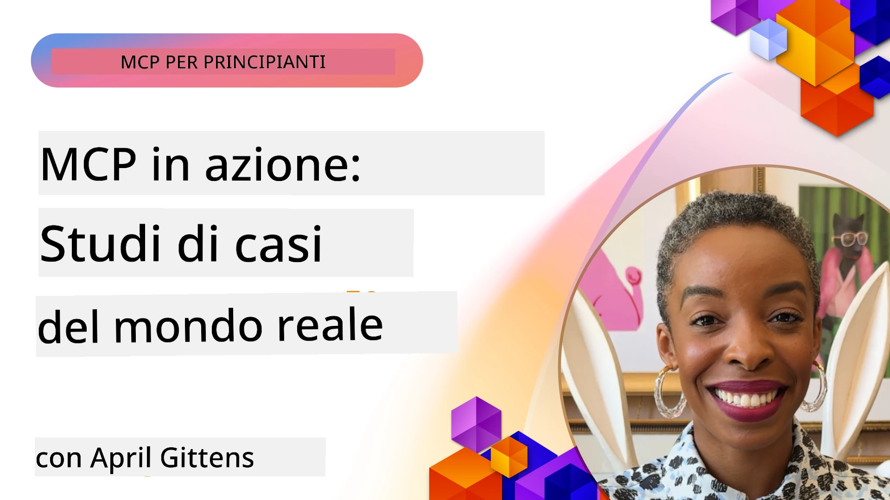

# MCP in Azione: Casi di Studio Reali

_(Clicca sull'immagine sopra per vedere il video di questa lezione)_

Il Model Context Protocol (MCP) sta trasformando il modo in cui le applicazioni AI interagiscono con dati, strumenti e servizi. Questa sezione presenta casi di studio reali che dimostrano applicazioni pratiche di MCP in vari scenari aziendali.

## Panoramica

Questa sezione mostra esempi concreti di implementazioni MCP, evidenziando come le organizzazioni stiano sfruttando questo protocollo per risolvere complesse sfide aziendali. Esaminando questi casi di studio, otterrai approfondimenti sulla versatilità, scalabilità e benefici pratici di MCP in scenari reali.

## Obiettivi di Apprendimento Chiave

Esplorando questi casi di studio, potrai:

- Comprendere come MCP può essere applicato per risolvere specifici problemi aziendali  
- Apprendere diversi pattern di integrazione e approcci architetturali  
- Riconoscere le migliori pratiche per implementare MCP in ambienti enterprise  
- Ottenere informazioni sulle sfide e sulle soluzioni incontrate nelle implementazioni reali  
- Identificare opportunità per applicare pattern simili nei tuoi progetti  

## Casi di Studio Presentati

### 1. [Azure AI Travel Agents – Implementazione di Riferimento](./travelagentsample.md)

Questo caso di studio esamina la soluzione di riferimento completa di Microsoft che dimostra come costruire un'applicazione di pianificazione viaggi multi-agente alimentata da AI utilizzando MCP, Azure OpenAI e Azure AI Search. Il progetto mostra:

- Orchestrazione multi-agente tramite MCP  
- Integrazione dati enterprise con Azure AI Search  
- Architettura sicura e scalabile usando servizi Azure  
- Strumenti estendibili con componenti MCP riutilizzabili  
- Esperienza conversazionale utente alimentata da Azure OpenAI  

L'architettura e i dettagli di implementazione offrono preziosi insight per costruire sistemi complessi multi-agente con MCP come livello di coordinamento.

### 2. [Aggiornamento di Elementi Azure DevOps da Dati YouTube](./UpdateADOItemsFromYT.md)

Questo caso di studio dimostra un'applicazione pratica di MCP per automatizzare processi di workflow. Mostra come gli strumenti MCP possano essere usati per:

- Estrarre dati da piattaforme online (YouTube)  
- Aggiornare elementi di lavoro nei sistemi Azure DevOps  
- Creare workflow di automazione ripetibili  
- Integrare dati tra sistemi disparati  

Questo esempio illustra come implementazioni MCP relativamente semplici possano offrire notevoli guadagni di efficienza automatizzando compiti di routine e migliorando la coerenza dei dati tra sistemi.

### 3. [Recupero Documentazione in Tempo Reale con MCP](./docs-mcp/README.md)

Questo caso di studio ti guida nel collegare un client console Python a un server Model Context Protocol (MCP) per recuperare e registrare documentazione Microsoft in tempo reale e contestualizzata. Imparerai come:

- Collegarti a un server MCP usando un client Python e l'SDK ufficiale MCP  
- Utilizzare client HTTP in streaming per un recupero dati efficiente e in tempo reale  
- Chiamare strumenti documentali sul server e registrare risposte direttamente in console  
- Integrare documentazione Microsoft aggiornata nel tuo flusso di lavoro senza uscire dal terminale  

Il capitolo include un'esercitazione pratica, un esempio di codice minimo funzionante e link a risorse aggiuntive per approfondimenti. Vedi la guida completa e il codice nel capitolo collegato per capire come MCP può trasformare l'accesso alla documentazione e la produttività degli sviluppatori in ambienti console.

### 4. [Web App Interattiva per Generare Piani di Studio con MCP](./docs-mcp/README.md)

Questo caso di studio dimostra come costruire un'app web interattiva utilizzando Chainlit e il Model Context Protocol (MCP) per generare piani di studio personalizzati su qualsiasi argomento. Gli utenti possono specificare un soggetto (ad esempio "certificazione AI-900") e una durata di studio (es. 8 settimane), e l'app fornirà una suddivisione settimanale dei contenuti consigliati. Chainlit permette un'interfaccia chat conversazionale, rendendo l'esperienza coinvolgente e adattiva.

- App web conversazionale alimentata da Chainlit  
- Prompt guidati dall'utente per argomento e durata  
- Raccomandazioni di contenuto settimana per settimana tramite MCP  
- Risposte adattive in tempo reale in un'interfaccia chat  

Il progetto illustra come AI conversazionale e MCP possano essere combinati per creare strumenti educativi dinamici e personalizzati in un ambiente web moderno.

### 5. [Documentazione in-Editor con MCP Server in VS Code](./docs-mcp/README.md)

Questo caso di studio dimostra come portare Microsoft Learn Docs direttamente nell'ambiente VS Code usando il server MCP—non serve più cambiare scheda del browser! Vedrai come:

- Cercare e leggere documentazione all'istante dentro VS Code usando il pannello MCP o la command palette  
- Fare riferimento alla documentazione e inserire link direttamente nei file README o markdown del corso  
- Usare GitHub Copilot e MCP insieme per workflow di documentazione e codice alimentati da AI senza interruzioni  
- Validare e migliorare la documentazione con feedback in tempo reale e accuratezza proveniente da Microsoft  
- Integrare MCP con i workflow GitHub per la validazione continua della documentazione  

L'implementazione include:

- Configurazione di esempio `.vscode/mcp.json` per un setup semplice  
- Guide basate su screenshot dell’esperienza in-editor  
- Consigli per combinare Copilot e MCP per la massima produttività  

Questo scenario è ideale per autori di corsi, redattori di documentazione e sviluppatori che vogliono restare concentrati nel loro editor lavorando con docs, Copilot e strumenti di validazione—tutto alimentato da MCP.

### 6. [Creazione Server MCP con APIM](./apimsample.md)

Questo caso di studio fornisce una guida passo-passo su come creare un server MCP utilizzando Azure API Management (APIM). Copre:

- Configurazione di un server MCP in Azure API Management  
- Esposizione delle operazioni API come strumenti MCP  
- Configurazione delle policy per limitazione del traffico e sicurezza  
- Test del server MCP usando Visual Studio Code e GitHub Copilot  

Questo esempio illustra come sfruttare le capacità di Azure per creare un server MCP robusto utilizzabile in molte applicazioni, migliorando l’integrazione di sistemi AI con API enterprise.

### 7. [GitHub MCP Registry — Accelerare l’Integrazione Agentica](https://github.com/mcp)

Questo caso di studio esamina come il GitHub MCP Registry, lanciato nel settembre 2025, affronti una sfida critica nell’ecosistema AI: la scoperta e distribuzione frammentata di server Model Context Protocol (MCP).

#### Panoramica  
Il **Registro MCP** risolve il problema crescente di server MCP sparsi tra repository e registri, che in passato rallentava e complicava l’integrazione. Questi server permettono agli agenti AI di interagire con sistemi esterni come API, database e fonti di documentazione.

#### Problema  
Gli sviluppatori che realizzavano workflow agentici affrontavano varie difficoltà:  
- **Scarsa reperibilità** dei server MCP su diverse piattaforme  
- **Domande ridondanti** sparse tra forum e documentazione  
- **Rischi di sicurezza** da fonti non verificate e non affidabili  
- **Mancanza di standardizzazione** nella qualità e compatibilità dei server  

#### Architettura della Soluzione  
Il Registro MCP di GitHub centralizza server MCP affidabili con caratteristiche chiave:  
- **Installazione con un clic** via VS Code per setup veloce  
- **Ordinamento segnale-su-rumore** basato su stelle, attività e validazione comunitaria  
- **Integrazione diretta** con GitHub Copilot e altri strumenti compatibili MCP  
- **Modello di contributo aperto** che permette sia alla comunità sia ai partner enterprise di contribuire  

#### Impatto sul Business  
Il registro ha portato miglioramenti misurabili:  
- **Onboarding più rapido** per sviluppatori che usano strumenti come Microsoft Learn MCP Server, che trasmette documentazione ufficiale direttamente agli agenti  
- **Produttività migliorata** tramite server specializzati, come `github-mcp-server`, che abilita automazioni GitHub in linguaggio naturale (creazione PR, ri-esecuzioni CI, scansioni codice)  
- **Maggiore fiducia nell’ecosistema** grazie a elenchi curati e standard di configurazione trasparenti  

#### Valore Strategico  
Per i professionisti specializzati nella gestione del ciclo vita agentico e workflow riproducibili, il Registro MCP offre:  
- **Capacità modulari di deploy agentico** con componenti standardizzati  
- **Pipeline di valutazione supportate da registro** per test e validazioni coerenti  
- **Interoperabilità cross-tool** per integrazione fluida tra differenti piattaforme AI  

Questo caso di studio dimostra che il Registro MCP è più di un semplice elenco: è una piattaforma fondamentale per integrazione scalabile di modelli e distribuzione di sistemi agentici reali.

## Conclusione

Questi sette completi casi di studio dimostrano l’eccezionale versatilità e le applicazioni pratiche del Model Context Protocol in scenari reali diversificati. Dai complessi sistemi multi-agente di pianificazione viaggi e gestione API enterprise ai flussi di lavoro documentali semplificati e al rivoluzionario GitHub MCP Registry, questi esempi mostrano come MCP fornisca un modo standardizzato e scalabile per connettere sistemi AI con strumenti, dati e servizi necessari per offrire valore eccezionale.

I casi di studio coprono molte dimensioni dell’implementazione MCP:  
- **Integrazione Enterprise**: Azure API Management e automazione Azure DevOps  
- **Orchestrazione Multi-Agente**: Pianificazione viaggi con agenti AI coordinati  
- **Produttività Sviluppatori**: Integrazione VS Code e accesso documentazione in tempo reale  
- **Sviluppo Ecosistema**: Registro MCP di GitHub come piattaforma fondazionale  
- **Applicazioni Educative**: Generatori di piani di studio interattivi e interfacce conversazionali  

Studiando queste implementazioni, ottieni insight critici su:  
- **Pattern architetturali** per scale e casi d’uso differenti  
- **Strategie di implementazione** che bilanciano funzionalità e manutenibilità  
- **Considerazioni su sicurezza e scalabilità** per deploy in produzione  
- **Best practices** per sviluppo server MCP e integrazione client  
- **Visione ecosistemica** per costruire soluzioni AI interconnesse  

Questi esempi dimostrano collettivamente che MCP non è solo un quadro teorico, ma un protocollo maturo e pronto per la produzione che abilita soluzioni pratiche a sfide aziendali complesse. Che tu stia costruendo strumenti di automazione semplici o complessi sistemi multi-agente, i pattern e approcci illustrati qui forniscono una solida base per i tuoi progetti MCP.

## Risorse Aggiuntive

- [Azure AI Travel Agents GitHub Repository](https://github.com/Azure-Samples/azure-ai-travel-agents)  
- [Azure DevOps MCP Tool](https://github.com/microsoft/azure-devops-mcp)  
- [Playwright MCP Tool](https://github.com/microsoft/playwright-mcp)  
- [Microsoft Docs MCP Server](https://github.com/MicrosoftDocs/mcp)  
- [GitHub MCP Registry — Accelerating Agentic Integration](https://github.com/mcp)  
- [Esempi della Community MCP](https://github.com/microsoft/mcp)  

## Cosa C’è Dopo

- Precedente: [Modulo 8: Best Practices](../08-BestPractices/README.md)  
- Successivo: [Modulo 10: Snellire i Workflow AI: Costruire un Server MCP con AI Toolkit](../10-StreamliningAIWorkflowsBuildingAnMCPServerWithAIToolkit/README.md)

---

<!-- CO-OP TRANSLATOR DISCLAIMER START -->
**Disclaimer**:  
Questo documento è stato tradotto utilizzando il servizio di traduzione automatica AI [Co-op Translator](https://github.com/Azure/co-op-translator). Sebbene ci impegniamo per garantire l’accuratezza, si prega di notare che le traduzioni automatiche possono contenere errori o inesattezze. Il documento originale nella sua lingua nativa deve essere considerato la fonte autorevole. Per informazioni critiche, si raccomanda una traduzione professionale effettuata da traduttori umani. Non ci assumiamo alcuna responsabilità per eventuali malintesi o interpretazioni errate derivanti dall’uso di questa traduzione.
<!-- CO-OP TRANSLATOR DISCLAIMER END -->