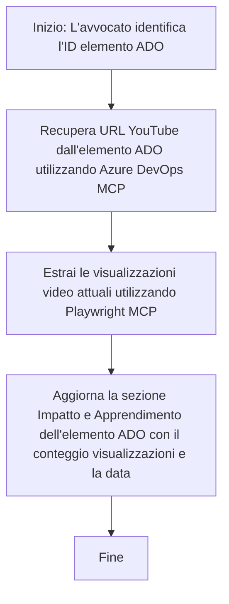

# Case Study: Aggiornamento degli Elementi Azure DevOps dai Dati YouTube con MCP

> **Disclaimer:** Esistono strumenti e report online che possono automatizzare il processo di aggiornamento degli elementi Azure DevOps con dati provenienti da piattaforme come YouTube. Lo scenario seguente è fornito puramente come esempio di caso d'uso per illustrare come gli strumenti MCP possono essere applicati per compiti di automazione e integrazione.

## Panoramica

Questo case study dimostra un esempio di come il Model Context Protocol (MCP) e i suoi strumenti possano essere utilizzati per automatizzare il processo di aggiornamento degli elementi di lavoro Azure DevOps (ADO) con informazioni provenienti da piattaforme online, come YouTube. Lo scenario descritto è solo un’illustrazione delle capacità più ampie di questi strumenti, che possono essere adattati a molti bisogni similari di automazione.

In questo esempio, un Advocate monitora sessioni online utilizzando elementi ADO, in cui ciascun elemento include un URL di un video YouTube. Sfruttando gli strumenti MCP, l’Advocate può mantenere aggiornati gli elementi ADO con le ultime metriche del video, come il conteggio delle visualizzazioni, in modo ripetibile e automatizzato. Questo approccio può essere generalizzato ad altri casi d’uso in cui informazioni da fonti online devono essere integrate in ADO o altri sistemi.

## Scenario

Un Advocate è responsabile del monitoraggio dell’impatto delle sessioni online e degli impegni comunitari. Ogni sessione è registrata come elemento di lavoro ADO nel progetto 'DevRel', e l’elemento contiene un campo per l’URL del video YouTube. Per riportare accuratamente la portata della sessione, l’Advocate deve aggiornare l’elemento ADO con il numero corrente di visualizzazioni del video e la data in cui queste informazioni sono state recuperate.

## Strumenti Utilizzati

- [Azure DevOps MCP](https://github.com/microsoft/azure-devops-mcp): Consente l’accesso programmatico e l’aggiornamento degli elementi di lavoro ADO tramite MCP.
- [Playwright MCP](https://github.com/microsoft/playwright-mcp): Automatizza le azioni nel browser per estrarre dati live dalle pagine web, come le statistiche dei video YouTube.

## Flusso di Lavoro Passo-passo

1. **Identificare l’Elemento ADO**: Iniziare con l’ID dell’elemento di lavoro ADO (es. 1234) nel progetto 'DevRel'.
2. **Recuperare l’URL YouTube**: Usare lo strumento Azure DevOps MCP per ottenere l’URL YouTube dall’elemento di lavoro.
3. **Estrarre le Visualizzazioni del Video**: Usare lo strumento Playwright MCP per navigare all’URL YouTube ed estrarre il conteggio attuale delle visualizzazioni.
4. **Aggiornare l’Elemento ADO**: Scrivere il conteggio più recente delle visualizzazioni e la data di recupero nella sezione ‘Impact and Learnings’ dell’elemento di lavoro ADO usando lo strumento Azure DevOps MCP.

## Prompt di Esempio

```bash
- Work with the ADO Item ID: 1234
- The project is '2025-Awesome'
- Get the YouTube URL for the ADO item
- Use Playwright to get the current views from the YouTube video
- Update the ADO item with the current video views and the updated date of the information
```

## Mermaid Flowchart


## Implementazione Tecnica

- **Orchestrazione MCP**: Il flusso di lavoro è orchestrato da un server MCP, che coordina l’uso di entrambi gli strumenti Azure DevOps MCP e Playwright MCP.
- **Automazione**: Il processo può essere avviato manualmente o programmato per essere eseguito a intervalli regolari per mantenere aggiornati gli elementi ADO.
- **Estendibilità**: Lo stesso schema può essere esteso per aggiornare gli elementi ADO con altre metriche online (es. like, commenti) o da altre piattaforme.

## Risultati e Impatto

- **Efficienza**: Riduce lo sforzo manuale per gli Advocates automatizzando il recupero e l’aggiornamento delle metriche video.
- **Accuratezza**: Garantisce che gli elementi ADO riflettano i dati più attuali disponibili da fonti online.
- **Ripetibilità**: Fornisce un flusso di lavoro riutilizzabile per scenari simili che coinvolgono altre fonti di dati o metriche.

## Riferimenti

- [Azure DevOps MCP](https://github.com/microsoft/azure-devops-mcp)
- [Playwright MCP](https://github.com/microsoft/playwright-mcp)
- [Model Context Protocol (MCP)](https://modelcontextprotocol.io/)

## Cosa Succede Dopo

- Torna a: [Case Studies Overview](./README.md)
- Avanti: [Real-Time Documentation Retrieval with MCP](./docs-mcp/README.md)

---

<!-- CO-OP TRANSLATOR DISCLAIMER START -->
**Dichiarazione di non responsabilità**:  
Questo documento è stato tradotto utilizzando il servizio di traduzione automatica AI [Co-op Translator](https://github.com/Azure/co-op-translator). Pur impegnandoci per garantire l’accuratezza, si prega di considerare che le traduzioni automatiche possono contenere errori o inesattezze. Il documento originale nella sua lingua originaria deve essere considerato la fonte autorevole. Per informazioni critiche, si raccomanda una traduzione professionale effettuata da un esperto umano. Non ci assumiamo responsabilità per eventuali incomprensioni o interpretazioni errate derivanti dall’uso di questa traduzione.
<!-- CO-OP TRANSLATOR DISCLAIMER END -->