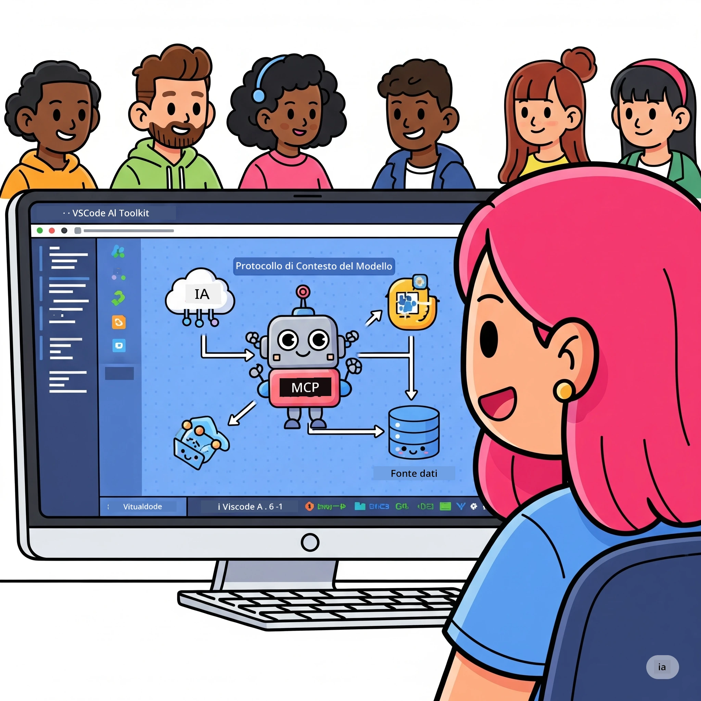
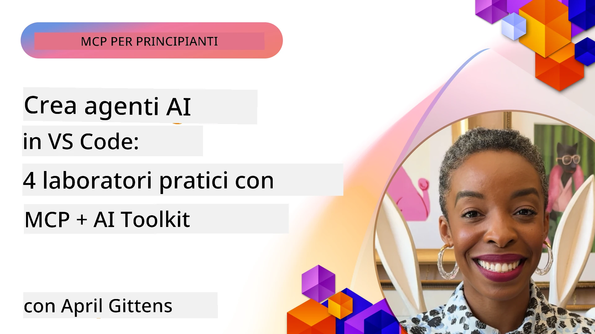

# Ottimizzazione dei Flussi di Lavoro AI: Costruire un Server MCP con AI Toolkit

## 🎯 Panoramica

_(Clicca sull'immagine sopra per vedere il video di questa lezione)_

Benvenuti al **Workshop Model Context Protocol (MCP)**! Questo workshop pratico completo combina due tecnologie all'avanguardia per rivoluzionare lo sviluppo di applicazioni AI:

- **🔗 Model Context Protocol (MCP)**: Uno standard aperto per un'integrazione fluida degli strumenti AI
- **🛠️ AI Toolkit per Visual Studio Code (AITK)**: La potente estensione di sviluppo AI di Microsoft

### 🎓 Cosa Imparerai

Al termine di questo workshop, padroneggerai l'arte di costruire applicazioni intelligenti che collegano modelli AI con strumenti e servizi reali. Dal testing automatizzato all'integrazione di API personalizzate, acquisirai competenze pratiche per risolvere sfide aziendali complesse.

## 🏗️ Stack Tecnologico

### 🔌 Model Context Protocol (MCP)

MCP è il **"USB-C per l'AI"** - uno standard universale che collega i modelli AI a strumenti esterni e fonti di dati.

**✨ Caratteristiche Chiave:**

- 🔄 **Integrazione Standardizzata**: Interfaccia universale per connessioni tra AI e strumenti
- 🏛️ **Architettura Flessibile**: Server locali e remoti tramite trasporto stdio/SSE
- 🧰 **Ecosistema Ricco**: Strumenti, prompt e risorse in un unico protocollo
- 🔒 **Pronto per l'Impresa**: Sicurezza e affidabilità integrate

**🎯 Perché MCP Conta:**
Proprio come USB-C ha eliminato il caos dei cavi, MCP elimina la complessità delle integrazioni AI. Un protocollo, infinite possibilità.

### 🤖 AI Toolkit per Visual Studio Code (AITK)

L'estensione di punta di Microsoft per lo sviluppo AI che trasforma VS Code in una potenza AI.

**🚀 Capacità Principali:**

- 📦 **Catalogo Modelli**: Accesso a modelli da Azure AI, GitHub, Hugging Face, Ollama
- ⚡ **Inferenza Locale**: Esecuzione ottimizzata ONNX su CPU/GPU/NPU
- 🏗️ **Agent Builder**: Sviluppo visuale di agenti AI con integrazione MCP
- 🎭 **Multi-Modalità**: Supporto per testo, visione e output strutturato

**💡 Benefici per lo Sviluppo:**

- Deployment modelli senza configurazione
- Ingegneria visuale dei prompt
- Playground di test in tempo reale
- Integrazione fluida con server MCP

## 📚 Percorso di Apprendimento

### [🚀 Modulo 1: Fondamenti di AI Toolkit](./lab1/README.md)

**Durata**: 15 minuti

- 🛠️ Installare e configurare AI Toolkit per VS Code
- 🗂️ Esplorare il Catalogo Modelli (oltre 100 modelli da GitHub, ONNX, OpenAI, Anthropic, Google)
- 🎮 Padroneggiare il Playground Interattivo per testare modelli in tempo reale
- 🤖 Costruire il primo agente AI con Agent Builder
- 📊 Valutare le performance dei modelli con metriche integrate (F1, rilevanza, similarità, coerenza)
- ⚡ Apprendere l'elaborazione batch e le capacità multi-modali

**🎯 Risultato di Apprendimento**: Creare un agente AI funzionale con comprensione completa delle capacità di AITK

### [🌐 Modulo 2: MCP con Fondamenti di AI Toolkit](./lab2/README.md)

**Durata**: 20 minuti

- 🧠 Padroneggiare l'architettura e i concetti del Model Context Protocol (MCP)
- 🌐 Esplorare l'ecosistema server MCP di Microsoft
- 🤖 Costruire un agente di automazione browser usando il server MCP Playwright
- 🔧 Integrare server MCP con AI Toolkit Agent Builder
- 📊 Configurare e testare strumenti MCP all’interno degli agenti
- 🚀 Esportare e distribuire agenti potenziati MCP per l’uso in produzione

**🎯 Risultato di Apprendimento**: Distribuire un agente AI potenziato con strumenti esterni tramite MCP

### [🔧 Modulo 3: Sviluppo Avanzato MCP con AI Toolkit](./lab3/README.md)

**Durata**: 20 minuti

- 💻 Creare server MCP personalizzati usando AI Toolkit
- 🐍 Configurare e utilizzare l’ultima SDK Python MCP (v1.9.3)
- 🔍 Configurare e utilizzare MCP Inspector per il debugging
- 🛠️ Costruire un Weather MCP Server con workflow di debugging professionale
- 🧪 Eseguire il debug dei server MCP sia in Agent Builder che in Inspector

**🎯 Risultato di Apprendimento**: Sviluppare e fare il debug di server MCP personalizzati con strumenti moderni

### [🐙 Modulo 4: Sviluppo Pratico MCP - Server GitHub Clone Personalizzato](./lab4/README.md)

**Durata**: 30 minuti

- 🏗️ Costruire un vero GitHub Clone MCP Server per i workflow di sviluppo
- 🔄 Implementare un cloning intelligente dei repository con validazione e gestione errori
- 📁 Creare una gestione intelligente delle directory e integrazione con VS Code
- 🤖 Utilizzare GitHub Copilot Agent Mode con strumenti MCP personalizzati
- 🛡️ Applicare affidabilità pronta per produzione e compatibilità cross-platform

**🎯 Risultato di Apprendimento**: Distribuire un server MCP pronto per la produzione che ottimizza workflow di sviluppo reali

## 💡 Applicazioni Realistiche & Impatto

### 🏢 Casi d'Uso Enterprise

#### 🔄 Automazione DevOps

Trasforma il tuo workflow di sviluppo con automazione intelligente:

- **Gestione Intelligente dei Repository**: Revisione codice AI-driven e decisioni di merge
- **CI/CD Intelligente**: Ottimizzazione automatica delle pipeline basata su modifiche al codice
- **Triage dei Problemi**: Classificazione e assegnazione automatica dei bug

#### 🧪 Rivoluzione del Quality Assurance

Eleva i test con automazione AI-powered:

- **Generazione Intelligente di Test**: Creazione automatica di suite di test complete
- **Test di Regressione Visiva**: Rilevazione AI delle modifiche UI
- **Monitoraggio delle Performance**: Identificazione e risoluzione proattiva dei problemi

#### 📊 Intelligenza nei Data Pipeline

Costruisci workflow di elaborazione dati più intelligenti:

- **Processi ETL Adattivi**: Trasformazioni dati auto-ottimizzanti
- **Rilevazione di Anomalie**: Monitoraggio qualità dati in tempo reale
- **Instradamento Intelligente**: Gestione smart del flusso dati

#### 🎧 Miglioramento dell’Esperienza Cliente

Crea interazioni clienti eccezionali:

- **Supporto Contestuale**: Agenti AI con accesso alla storia cliente
- **Risoluzione Proattiva Problemi**: Servizio clienti predittivo
- **Integrazione Multi-Canale**: Esperienza AI unificata su più piattaforme

## 🛠️ Prerequisiti & Setup

### 💻 Requisiti di Sistema

| Componente | Requisito | Note |
|-----------|-------------|-------|
| **Sistema Operativo** | Windows 10+, macOS 10.15+, Linux | Qualsiasi OS moderno |
| **Visual Studio Code** | Ultima versione stabile | Necessario per AITK |
| **Node.js** | v18.0+ e npm | Per sviluppo server MCP |
| **Python** | 3.10+ | Opzionale per server MCP Python |
| **Memoria** | Minimo 8GB RAM | 16GB raccomandati per modelli locali |

### 🔧 Ambiente di Sviluppo

#### Estensioni VS Code Consigliate

- **AI Toolkit** (ms-windows-ai-studio.windows-ai-studio)
- **Python** (ms-python.python)
- **Python Debugger** (ms-python.debugpy)
- **GitHub Copilot** (GitHub.copilot) - Opzionale ma utile

#### Strumenti Opzionali

- **uv**: Gestore pacchetti Python moderno
- **MCP Inspector**: Strumento visuale di debugging per server MCP
- **Playwright**: Per esempi di automazione web

## 🎖️ Risultati di Apprendimento & Percorso di Certificazione

### 🏆 Checklist di Competenza

Completando questo workshop acquisirai padronanza in:

#### 🎯 Competenze Fondamentali

- [ ] **Padronanza del Protocollo MCP**: Comprensione profonda di architettura e pattern di implementazione
- [ ] **Competenza AITK**: Uso esperto di AI Toolkit per sviluppo rapido
- [ ] **Sviluppo Server Personalizzati**: Costruzione, deploy e manutenzione di server MCP di produzione
- [ ] **Eccellenza nell’Integrazione Strumenti**: Connessione fluida dell'AI con workflow di sviluppo esistenti
- [ ] **Applicazione di Problem Solving**: Applicazione di competenze per sfide aziendali reali

#### 🔧 Abilità Tecniche

- [ ] Configurare AI Toolkit in VS Code
- [ ] Progettare e implementare server MCP personalizzati
- [ ] Integrare modelli GitHub con architettura MCP
- [ ] Costruire workflow di test automatizzati con Playwright
- [ ] Distribuire agenti AI per uso in produzione
- [ ] Debuggare e ottimizzare performance server MCP

#### 🚀 Capacità Avanzate

- [ ] Architettare integrazioni AI su scala enterprise
- [ ] Implementare best practice di sicurezza per applicazioni AI
- [ ] Progettare architetture server MCP scalabili
- [ ] Creare catene di strumenti personalizzati per domini specifici
- [ ] Mentoraggio nello sviluppo nativo AI

## 📖 Risorse Aggiuntive

- [Specifiche MCP (2025-11-25)](https://spec.modelcontextprotocol.io/specification/2025-11-25/)
- [Repository AI Toolkit su GitHub](https://github.com/microsoft/vscode-ai-toolkit)
- [Collezione Sample Server MCP](https://github.com/modelcontextprotocol/servers)
- [Guida alle Best Practice](https://modelcontextprotocol.io/docs/best-practices)
- [OWASP MCP Top 10](https://microsoft.github.io/mcp-azure-security-guide/mcp/) - Best practice di sicurezza

---

**🚀 Pronto a rivoluzionare il tuo workflow di sviluppo AI?**

Costruiamo insieme il futuro delle applicazioni intelligenti con MCP e AI Toolkit!

## Cosa Fare Dopo

Continua a: [Modulo 11: Laboratori Pratici MCP Server](../11-MCPServerHandsOnLabs/README.md)

---

<!-- CO-OP TRANSLATOR DISCLAIMER START -->
**Avvertenza**:
Questo documento è stato tradotto utilizzando il servizio di traduzione automatica [Co-op Translator](https://github.com/Azure/co-op-translator). Pur impegnandoci per garantire l'accuratezza, si prega di notare che le traduzioni automatiche possono contenere errori o imprecisioni. Il documento originale nella sua lingua nativa deve essere considerato la fonte autorevole. Per informazioni critiche, si consiglia una traduzione professionale effettuata da un umano. Non ci assumiamo alcuna responsabilità per eventuali malintesi o interpretazioni errate derivanti dall'uso di questa traduzione.
<!-- CO-OP TRANSLATOR DISCLAIMER END -->