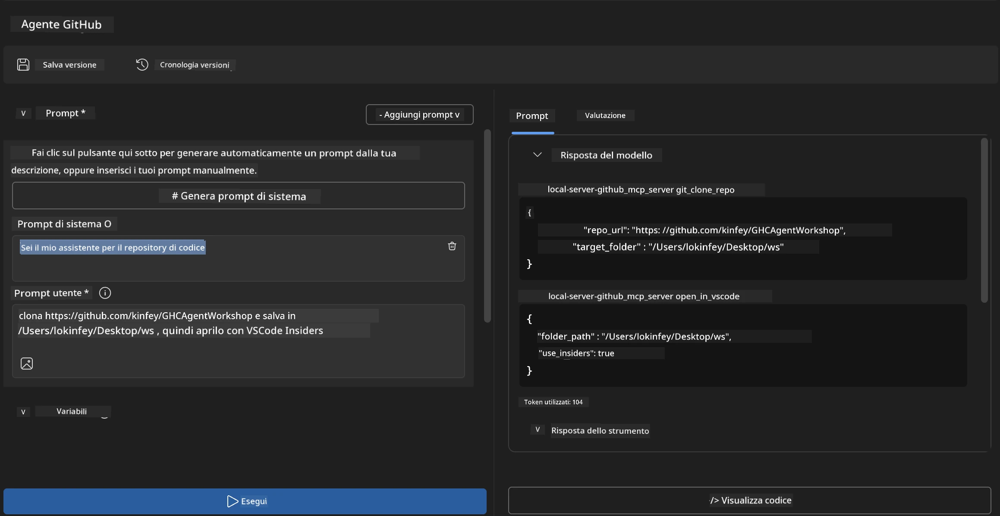
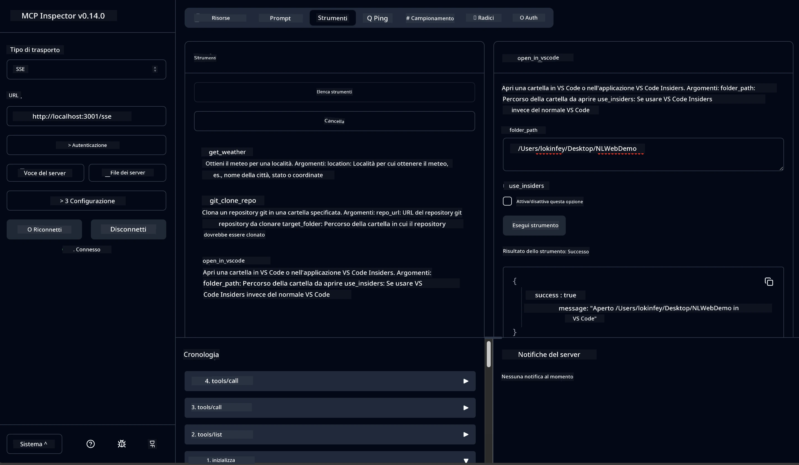

# 🐙 Modulo 4: Sviluppo Pratico MCP - Server Personalizzato per Clonare GitHub


> **⚡ Avvio Rapido:** Costruisci un server MCP pronto per la produzione che automatizza il clonaggio di repository GitHub e l'integrazione con VS Code in soli 30 minuti!

## 🎯 Obiettivi di Apprendimento

Al termine di questo laboratorio, saprai:

- ✅ Creare un server MCP personalizzato per flussi di lavoro di sviluppo reali
- ✅ Implementare la funzionalità di clonazione di repository GitHub tramite MCP
- ✅ Integrare server MCP personalizzati con VS Code e Agent Builder
- ✅ Usare GitHub Copilot Agent Mode con strumenti MCP personalizzati
- ✅ Testare e distribuire server MCP personalizzati in ambienti di produzione

## 📋 Prerequisiti

- Completamento dei Laboratori 1-3 (fondamenti MCP e sviluppo avanzato)
- Abbonamento a GitHub Copilot ([iscrizione gratuita disponibile](https://github.com/github-copilot/signup))
- VS Code con estensioni AI Toolkit e GitHub Copilot
- CLI Git installata e configurata

## 🏗️ Panoramica del Progetto

### **Sfida di sviluppo reale**
Come sviluppatori, usiamo spesso GitHub per clonare repository e aprirli in VS Code o VS Code Insiders. Questo processo manuale comporta:
1. Aprire terminale/prompt dei comandi
2. Navigare nella directory desiderata
3. Eseguire il comando `git clone`
4. Aprire VS Code nella directory clonata

**La nostra soluzione MCP semplifica tutto in un solo comando intelligente!**

### **Cosa costruirai**
Un **Server MCP di Clonazione GitHub** (`git_mcp_server`) che offre:

| Funzionalità | Descrizione | Beneficio |
|--------------|-------------|-----------|
| 🔄 **Clonazione Intelligente di Repository** | Clona repo GitHub con validazione | Controllo errori automatizzato |
| 📁 **Gestione Intelligente delle Directory** | Verifica e crea directory in modo sicuro | Previene sovrascritture |
| 🚀 **Integrazione VS Code Cross-Platform** | Apre progetti in VS Code/Insiders | Passaggio fluido nel flusso di lavoro |
| 🛡️ **Gestione Robusta degli Errori** | Gestisce rete, permessi e problemi di percorso | Affidabilità pronta per la produzione |

---

## 📖 Implementazione Passo-Passo

### Passo 1: Crea Agente GitHub in Agent Builder

1. **Avvia Agent Builder** tramite l’estensione AI Toolkit
2. **Crea un nuovo agente** con la seguente configurazione:
   ```
   Agent Name: GitHubAgent
   ```

3. **Inizializza server MCP personalizzato:**
   - Vai su **Tools** → **Add Tool** → **MCP Server**
   - Seleziona **"Create A new MCP Server"**
   - Scegli il **template Python** per massima flessibilità
   - **Nome Server:** `git_mcp_server`

### Passo 2: Configura GitHub Copilot Agent Mode

1. **Apri GitHub Copilot** in VS Code (Ctrl/Cmd + Shift + P → "GitHub Copilot: Open")
2. **Seleziona il Modello Agente** nell’interfaccia Copilot
3. **Scegli il modello Claude 3.7** per capacità di ragionamento avanzate
4. **Abilita integrazione MCP** per accesso agli strumenti

> **💡 Suggerimento Pro:** Claude 3.7 offre una comprensione superiore dei flussi di lavoro di sviluppo e dei modelli di gestione errori.

### Passo 3: Implementa la Funzionalità Core del Server MCP

**Usa il seguente prompt dettagliato con GitHub Copilot Agent Mode:**

```
Create two MCP tools with the following comprehensive requirements:

🔧 TOOL A: clone_repository
Requirements:
- Clone any GitHub repository to a specified local folder
- Return the absolute path of the successfully cloned project
- Implement comprehensive validation:
  ✓ Check if target directory already exists (return error if exists)
  ✓ Validate GitHub URL format (https://github.com/user/repo)
  ✓ Verify git command availability (prompt installation if missing)
  ✓ Handle network connectivity issues
  ✓ Provide clear error messages for all failure scenarios

🚀 TOOL B: open_in_vscode
Requirements:
- Open specified folder in VS Code or VS Code Insiders
- Cross-platform compatibility (Windows/Linux/macOS)
- Use direct application launch (not terminal commands)
- Auto-detect available VS Code installations
- Handle cases where VS Code is not installed
- Provide user-friendly error messages

Additional Requirements:
- Follow MCP 1.9.3 best practices
- Include proper type hints and documentation
- Implement logging for debugging purposes
- Add input validation for all parameters
- Include comprehensive error handling
```

### Passo 4: Testa il Tuo Server MCP

#### 4a. Test in Agent Builder

1. **Avvia la configurazione di debug** per Agent Builder
2. **Configura il tuo agente con questo prompt di sistema:**

```
SYSTEM_PROMPT:
You are my intelligent coding repository assistant. You help developers efficiently clone GitHub repositories and set up their development environment. Always provide clear feedback about operations and handle errors gracefully.
```

3. **Testa con scenari utente realistici:**

```
USER_PROMPT EXAMPLES:

Scenario : Basic Clone and Open
"Clone {Your GitHub Repo link such as https://github.com/kinfey/GHCAgentWorkshop
 } and save to {The global path you specify}, then open it with VS Code Insiders"
```



**Risultati Attesi:**
- ✅ Clonazione riuscita con conferma percorso
- ✅ Avvio automatico di VS Code
- ✅ Messaggi chiari di errore in scenari non validi
- ✅ Gestione corretta dei casi limite

#### 4b. Test in MCP Inspector




---


**🎉 Congratulazioni!** Hai creato con successo un server MCP pratico e pronto per la produzione che risolve sfide reali del flusso di lavoro di sviluppo. Il tuo server di clonazione GitHub personalizzato dimostra la potenza di MCP per automatizzare e migliorare la produttività degli sviluppatori.

### 🏆 Traguardi Sbloccati:
- ✅ **Sviluppatore MCP** - Creato server MCP personalizzato
- ✅ **Automatizzatore di Flussi** - Semplificati i processi di sviluppo  
- ✅ **Esperto di Integrazione** - Collegato più strumenti di sviluppo
- ✅ **Pronto per Produzione** - Costruito soluzioni distribuibili

---

## 🎓 Completamento del Workshop: Il Tuo Percorso con Model Context Protocol

**Caro Partecipante al Workshop,**

Complimenti per aver completato tutti e quattro i moduli del workshop Model Context Protocol! Hai percorso una lunga strada, dalla comprensione dei concetti base di AI Toolkit alla creazione di server MCP pronti per la produzione che risolvono sfide reali di sviluppo.

### 🚀 Riassunto del Tuo Percorso di Apprendimento:

**[Modulo 1](../lab1/README.md)**: Hai iniziato esplorando i fondamenti di AI Toolkit, il testing dei modelli e la creazione del tuo primo agente AI.

**[Modulo 2](../lab2/README.md)**: Hai imparato l’architettura MCP, integrato Playwright MCP e costruito il tuo primo agente di automazione del browser.

**[Modulo 3](../lab3/README.md)**: Sei passato allo sviluppo personalizzato di server MCP con il server Weather MCP e hai padroneggiato gli strumenti di debugging.

**[Modulo 4](../lab4/README.md)**: Ora hai applicato tutto per creare uno strumento pratico di automazione del flusso di lavoro dei repository GitHub.

### 🌟 Cosa Hai Padroneggiato:

- ✅ **Ecosistema AI Toolkit**: Modelli, agenti e pattern di integrazione
- ✅ **Architettura MCP**: Design client-server, protocolli di trasporto e sicurezza
- ✅ **Strumenti per Sviluppatori**: Dal Playground all’Inspector alla distribuzione in produzione
- ✅ **Sviluppo Personalizzato**: Creare, testare e distribuire i propri server MCP
- ✅ **Applicazioni Pratiche**: Risolvere sfide reali di flussi di lavoro con l’AI

### 🔮 I Tuoi Prossimi Passi:

1. **Costruisci il Tuo Server MCP**: Applica queste competenze per automatizzare i tuoi flussi di lavoro unici
2. **Unisciti alla Comunità MCP**: Condividi le tue creazioni e impara dagli altri
3. **Esplora l’Integrazione Avanzata**: Collega i server MCP ai sistemi aziendali
4. **Contribuisci all’Open Source**: Aiuta a migliorare gli strumenti e la documentazione MCP

Ricorda, questo workshop è solo l’inizio. L’ecosistema Model Context Protocol evolve rapidamente, e ora sei pronto per essere in prima linea negli strumenti di sviluppo potenziati dall’AI.

**Grazie per la tua partecipazione e la dedizione all’apprendimento!**

Speriamo che questo workshop abbia acceso idee che trasformeranno il modo in cui costruisci e interagisci con gli strumenti AI nel tuo percorso di sviluppo.

**Buona programmazione!**

---

## Cosa c’è dopo

Congratulazioni per aver completato tutti i laboratori del Modulo 10!

- Torna a: [Panoramica Modulo 10](../README.md)
- Continua con: [Modulo 11: Laboratori Pratici MCP Server](../../11-MCPServerHandsOnLabs/README.md)

---

<!-- CO-OP TRANSLATOR DISCLAIMER START -->
**Disclaimer**:
Questo documento è stato tradotto utilizzando il servizio di traduzione automatica AI [Co-op Translator](https://github.com/Azure/co-op-translator). Pur impegnandoci per l’accuratezza, si prega di tenere presente che le traduzioni automatiche possono contenere errori o imprecisioni. Il documento originale nella sua lingua nativa deve essere considerato la fonte autorevole. Per informazioni critiche si raccomanda la traduzione professionale effettuata da un traduttore umano. Non siamo responsabili per eventuali incomprensioni o interpretazioni errate derivanti dall’uso di questa traduzione.
<!-- CO-OP TRANSLATOR DISCLAIMER END -->