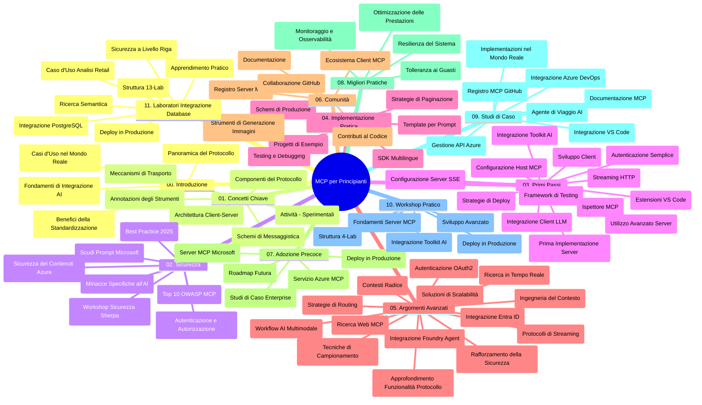

# Model Context Protocol (MCP) per Principianti - Guida di Studio

Questa guida di studio fornisce una panoramica della struttura e del contenuto del repository per il curriculum "Model Context Protocol (MCP) per Principianti". Usa questa guida per navigare il repository in modo efficiente e sfruttare al meglio le risorse disponibili.

## Panoramica del Repository

Il Model Context Protocol (MCP) è un framework standardizzato per le interazioni tra modelli AI e applicazioni client. Creato inizialmente da Anthropic, MCP è ora mantenuto dalla più ampia comunità MCP tramite l'organizzazione ufficiale GitHub. Questo repository offre un curriculum completo con esempi pratici di codice in C#, Java, JavaScript, Python e TypeScript, progettato per sviluppatori AI, architetti di sistema e ingegneri del software.

## Mappa Visiva del Curriculum

## Struttura del Repository

Il repository è organizzato in undici sezioni principali, ciascuna focalizzata su diversi aspetti di MCP:

1. **Introduzione (00-Introduction/)**
   - Panoramica del Model Context Protocol
   - Perché la standardizzazione è importante nelle pipeline AI
   - Casi d'uso pratici e benefici

2. **Concetti Fondamentali (01-CoreConcepts/)**
   - Architettura client-server
   - Componenti chiave del protocollo
   - Pattern di messaggistica in MCP

3. **Sicurezza (02-Security/)**
   - Minacce di sicurezza nei sistemi basati su MCP
   - Best practice per la messa in sicurezza delle implementazioni
   - Strategie di autenticazione e autorizzazione
   - **Documentazione completa sulla sicurezza**:
     - Best Practice di Sicurezza MCP 2025
     - Guida all’implementazione Azure Content Safety
     - Controlli e tecniche di sicurezza MCP
     - Riferimento rapido Best Practice MCP
   - **Argomenti chiave di sicurezza**:
     - Attacchi di prompt injection e avvelenamento degli strumenti
     - Hijacking di sessione e problemi di confused deputy
     - Vulnerabilità di token passthrough
     - Permessi e controllo accessi eccessivi
     - Sicurezza della supply chain per componenti AI
     - Integrazione Microsoft Prompt Shields

4. **Primi Passi (03-GettingStarted/)**
   - Configurazione dell’ambiente
   - Creazione di server e client MCP di base
   - Integrazione con applicazioni esistenti
   - Include sezioni su:
     - Prima implementazione server
     - Sviluppo client
     - Integrazione client LLM
     - Integrazione VS Code
     - Server Server-Sent Events (SSE)
     - Uso avanzato del server
     - Streaming HTTP
     - Integrazione Toolkit AI
     - Strategie di testing
     - Linee guida per il deployment

5. **Implementazione Pratica (04-PracticalImplementation/)**
   - Uso di SDK in diversi linguaggi
   - Tecniche di debug, test e validazione
   - Creazione di template e workflow di prompt riutilizzabili
   - Progetti di esempio con esempi di implementazione

6. **Argomenti Avanzati (05-AdvancedTopics/)**
   - Tecniche di context engineering
   - Integrazione agente Foundry
   - Workflow AI multimodali
   - Demo di autenticazione OAuth2
   - Capacità di ricerca in tempo reale
   - Streaming in tempo reale
   - Implementazione root context
   - Strategie di routing
   - Tecniche di campionamento
   - Approcci di scaling
   - Considerazioni di sicurezza
   - Integrazione sicurezza Entra ID
   - Integrazione ricerca web

7. **Contributi della Comunità (06-CommunityContributions/)**
   - Come contribuire con codice e documentazione
   - Collaborazione via GitHub
   - Miglioramenti e feedback guidati dalla comunità
   - Uso di vari client MCP (Claude Desktop, Cline, VSCode)
   - Lavoro con popolari server MCP incluso generazione immagini

8. **Lezioni dall’Adozione Precoce (07-LessonsfromEarlyAdoption/)**
   - Implementazioni reali e casi di successo
   - Costruzione e deployment di soluzioni basate su MCP
   - Tendenze e roadmap futura
   - **Guida ai Server Microsoft MCP**: Guida completa a 10 server Microsoft MCP pronti per la produzione tra cui:
     - Microsoft Learn Docs MCP Server
     - Azure MCP Server (15+ connettori specializzati)
     - GitHub MCP Server
     - Azure DevOps MCP Server
     - MarkItDown MCP Server
     - SQL Server MCP Server
     - Playwright MCP Server
     - Dev Box MCP Server
     - Azure AI Foundry MCP Server
     - Microsoft 365 Agents Toolkit MCP Server

9. **Best Practice (08-BestPractices/)**
   - Ottimizzazione delle prestazioni
   - Progettazione di sistemi MCP tolleranti ai guasti
   - Strategie di testing e resilienza

10. **Studi di Caso (09-CaseStudy/)**
    - **Sette studi di caso completi** che dimostrano la versatilità MCP in scenari diversi:
    - **Azure AI Travel Agents**: Orchestrazione multi-agente con Azure OpenAI e AI Search
    - **Integrazione Azure DevOps**: Automazione flussi di lavoro con aggiornamenti dati YouTube
    - **Recupero documentazione in tempo reale**: Client console Python con streaming HTTP
    - **Generatore Piano di Studio Interattivo**: App web Chainlit con AI conversazionale
    - **Documentazione in Editor**: Integrazione VS Code con workflow GitHub Copilot
    - **Azure API Management**: Integrazione API enterprise con creazione server MCP
    - **GitHub MCP Registry**: Sviluppo ecosistema e piattaforma integrazione agenti
    - Esempi di implementazione per integrazione enterprise, produttività sviluppatori e sviluppo ecosistema

11. **Workshop Pratico (10-StreamliningAIWorkflowsBuildingAnMCPServerWithAIToolkit/)**
    - Workshop pratico completo che combina MCP con AI Toolkit
    - Costruzione di applicazioni intelligenti che collegano modelli AI a strumenti reali
    - Moduli pratici che coprono nozioni di base, sviluppo server personalizzato e strategie di deployment in produzione
    - **Struttura del laboratorio**:
      - Lab 1: Fondamenti server MCP
      - Lab 2: Sviluppo server MCP avanzato
      - Lab 3: Integrazione AI Toolkit
      - Lab 4: Deployment e scaling in produzione
    - Approccio di apprendimento basato su laboratori con istruzioni passo-passo

12. **Laboratori di Integrazione Database MCP Server (11-MCPServerHandsOnLabs/)**
    - **Percorso di apprendimento completo di 13 laboratori** per costruire server MCP pronti per la produzione con integrazione PostgreSQL
    - **Implementazione reale di analytics retail** usando il caso d’uso Zava Retail
    - **Pattern enterprise-grade** inclusi Row Level Security (RLS), ricerca semantica e accesso dati multi-tenant
    - **Struttura completa dei laboratori**:
      - **Laboratori 00-03: Fondamenti** - Introduzione, Architettura, Sicurezza, Configurazione ambiente
      - **Laboratori 04-06: Costruzione Server MCP** - Progettazione database, implementazione server MCP, sviluppo strumenti
      - **Laboratori 07-09: Funzionalità Avanzate** - Ricerca semantica, Testing & Debug, Integrazione VS Code
      - **Laboratori 10-12: Produzione e Best Practice** - Deployment, Monitoraggio, Ottimizzazione
    - **Tecnologie trattate**: Framework FastMCP, PostgreSQL, Azure OpenAI, Azure Container Apps, Application Insights
    - **Risultati di apprendimento**: Server MCP pronto per produzione, pattern di integrazione database, analytics AI-powered, sicurezza enterprise

## Risorse Aggiuntive

Il repository include risorse di supporto:

- **Cartella immagini**: Contiene diagrammi e illustrazioni usate nel curriculum
- **Traduzioni**: Supporto multilingue con traduzioni automatiche della documentazione
- **Risorse ufficiali MCP**:
  - [Documentazione MCP](https://modelcontextprotocol.io/)
  - [Specifiche MCP](https://spec.modelcontextprotocol.io/)
  - [Repository MCP su GitHub](https://github.com/modelcontextprotocol)

## Come Usare Questo Repository

1. **Apprendimento sequenziale**: Segui i capitoli in ordine (00 fino a 11) per un’esperienza di apprendimento strutturata.
2. **Focus su linguaggi specifici**: Se sei interessato a un particolare linguaggio di programmazione, esplora le directory dei sample per implementazioni nella tua lingua preferita.
3. **Implementazione pratica**: Inizia dalla sezione "Primi Passi" per configurare l’ambiente e creare il tuo primo server e client MCP.
4. **Esplorazione avanzata**: Una volta acquisiti i fondamenti, approfondisci gli argomenti avanzati per ampliare le tue conoscenze.
5. **Coinvolgimento della comunità**: Unisciti alla comunità MCP tramite discussioni GitHub e canali Discord per connetterti con esperti e altri sviluppatori.

## Client e Strumenti MCP

Il curriculum copre vari client MCP e strumenti:

1. **Client ufficiali**:
   - Visual Studio Code
   - MCP in Visual Studio Code
   - Claude Desktop
   - Claude in VSCode
   - Claude API

2. **Client della comunità**:
   - Cline (terminale)
   - Cursor (editor codice)
   - ChatMCP
   - Windsurf

3. **Strumenti di gestione MCP**:
   - MCP CLI
   - MCP Manager
   - MCP Linker
   - MCP Router

## Server MCP Popolari

Il repository presenta vari server MCP, tra cui:

1. **Server Microsoft MCP Ufficiali**:
   - Microsoft Learn Docs MCP Server
   - Azure MCP Server (15+ connettori specializzati)
   - GitHub MCP Server
   - Azure DevOps MCP Server
   - MarkItDown MCP Server
   - SQL Server MCP Server
   - Playwright MCP Server
   - Dev Box MCP Server
   - Azure AI Foundry MCP Server
   - Microsoft 365 Agents Toolkit MCP Server

2. **Server di riferimento ufficiali**:
   - Filesystem
   - Fetch
   - Memory
   - Sequential Thinking

3. **Generazione Immagini**:
   - Azure OpenAI DALL-E 3
   - Stable Diffusion WebUI
   - Replicate

4. **Strumenti di sviluppo**:
   - Git MCP
   - Terminal Control
   - Code Assistant

5. **Server specializzati**:
   - Salesforce
   - Microsoft Teams
   - Jira & Confluence

## Contributi

Questo repository accoglie contributi dalla comunità. Consulta la sezione Contributi della Comunità per indicazioni su come contribuire efficacemente all’ecosistema MCP.

----

*Questa guida di studio è stata aggiornata l’ultima volta il 5 febbraio 2026, riflettendo le ultime Specifiche MCP 2025-11-25 e fornisce una panoramica del repository a quella data. Il contenuto del repository potrebbe essere aggiornato dopo tale data.*

---

<!-- CO-OP TRANSLATOR DISCLAIMER START -->
**Disclaimer**:  
Questo documento è stato tradotto utilizzando il servizio di traduzione automatica [Co-op Translator](https://github.com/Azure/co-op-translator). Pur impegnandoci per garantire l’accuratezza, si prega di notare che le traduzioni automatiche possono contenere errori o imprecisioni. Il documento originale nella sua lingua nativa deve essere considerato la fonte autorevole. Per informazioni critiche, si raccomanda una traduzione professionale effettuata da un traduttore umano. Non siamo responsabili per eventuali malintesi o interpretazioni errate derivanti dall’uso di questa traduzione.
<!-- CO-OP TRANSLATOR DISCLAIMER END -->