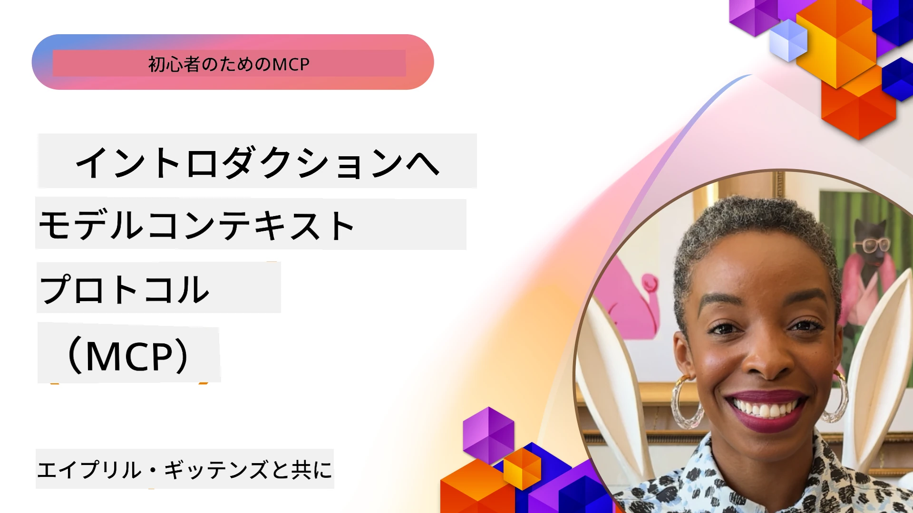
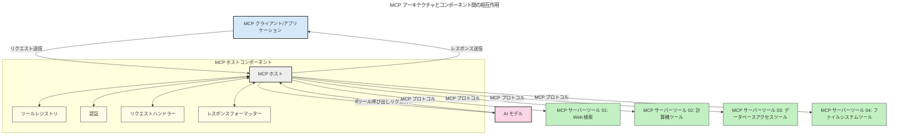

# モデルコンテキストプロトコル（MCP）入門：スケーラブルなAIアプリケーションにおける重要性

[](https://youtu.be/agBbdiOPLQA)

_(上の画像をクリックすると、このレッスンのビデオを視聴できます)_

生成AIアプリケーションは、ユーザーが自然言語のプロンプトでアプリと対話できる点で大きな進歩です。しかし、このようなアプリにより多くの時間とリソースを投資するほど、機能やリソースを簡単に統合できるようにし、複数のモデルを扱えるようにし、さまざまなモデルの複雑さに対応できるようにすることが重要になります。要するに、生成AIアプリの構築は始めるのは簡単ですが、成長し複雑になるにつれてアーキテクチャを定義する必要が生じ、標準に依存して一貫した形でアプリを構築することが必要になります。ここでMCPが登場し、仕組みを整理し標準を提供します。

---

## **🔍 モデルコンテキストプロトコル（MCP）とは？**

**モデルコンテキストプロトコル（MCP）** は、大規模言語モデル（LLM）が外部ツール、API、データソースとシームレスに連携できるようにする **オープンで標準化されたインターフェース** です。AIモデルのトレーニングデータを超えた機能を強化するための一貫したアーキテクチャを提供し、よりスマートでスケーラブルかつ応答性の高いAIシステムを可能にします。

---

## **🎯 AIにおける標準化が重要な理由**

生成AIアプリケーションがより複雑になるにつれ、**スケーラビリティ、拡張性、保守性、ベンダーロックインの回避** を確保するための標準を採用することが必須になります。MCPは以下の課題に取り組んでいます。

- モデルとツールの統合の一本化
- もろく、一度きりのカスタムソリューションの削減
- 複数ベンダーのモデルを1つのエコシステム内で共存させることの許可

**注記:** MCPはオープン標準として自称していますが、IEEE、IETF、W3C、ISOなどの既存の標準化団体による標準化を計画しているわけではありません。

---

## **📚 学習目標**

この記事を読むことで、以下ができるようになります：

- **モデルコンテキストプロトコル（MCP）** とそのユースケースを定義できる
- MCPがモデルとツールの通信をどのように標準化するか理解する
- MCPアーキテクチャのコアコンポーネントを識別する
- エンタープライズや開発コンテキストでのMCPの実例を探求する

---

## **💡 モデルコンテキストプロトコル（MCP）が変革をもたらす理由**

### **🔗 MCPはAIのインタラクションの断片化を解消する**

MCP以前は、モデルとツールの統合に次のような課題がありました：

- ツールごと、モデルごとにカスタムコードが必要
- ベンダーごとに非標準APIが存在
- 更新により頻繁に壊れることがある
- ツールが増えるとスケーラビリティが悪化

### **✅ MCP標準化のメリット**

| **利点**                  | **説明**                                                                       |
|---------------------------|--------------------------------------------------------------------------------|
| インターオペラビリティ   | 異なるベンダー間でもLLMがツールとシームレスに連携                             |
| 一貫性                   | プラットフォームとツール全体での均一な挙動                                   |
| 再利用性                 | 一度構築したツールを複数のプロジェクトやシステムで利用可能                   |
| 開発の高速化             | 標準化されたプラグアンドプレイのインターフェースによる開発時間の短縮          |

---

## **🧱 高レベルのMCPアーキテクチャ概要**

MCPは**クライアント-サーバモデル**に従い、

- **MCPホスト**がAIモデルを動かす
- **MCPクライアント**がリクエストを発する
- **MCPサーバ**がコンテキスト、ツール、機能を提供する

### **主要コンポーネント：**

- **リソース** – モデル向けの静的または動的データ  
- **プロンプト** – ガイド付き生成のための事前定義ワークフロー  
- **ツール** – 検索や計算などの実行可能関数  
- **サンプリング** – 再帰的相互作用によるエージェント的振る舞い
- **誘発** – サーバ側からのユーザー入力要求
- **ルート** – サーバアクセス制御のためのファイルシステム境界

### **プロトコルアーキテクチャ：**

MCPは二層構造を持ちます：
- **データ層**：JSON-RPC 2.0ベースの通信でライフサイクル管理とプリミティブを含む
- **トランスポート層**：STDIO(ローカル)およびSSE対応のストリーミングHTTP(リモート)通信チャネル

---

## MCPサーバの動作

MCPサーバは以下の方法で動作します：

- **リクエストフロー**：
    1. エンドユーザーまたはその代理のソフトウェアがリクエストを開始します。
    2. **MCPクライアント**がリクエストをAIモデル実行を管理する**MCPホスト**に送信します。
    3. **AIモデル**はユーザープロンプトを受け取り、必要に応じて1つ以上のツール呼び出しを介して外部ツールやデータへのアクセスを要求します。
    4. **MCPホスト**がモデルに代わり、標準化されたプロトコルを使用して適切な**MCPサーバ**と通信します。
- **MCPホストの機能**：
    - **ツールレジストリ**：利用可能なツールとその機能のカタログを管理
    - **認証**：ツールアクセスの権限検証
    - **リクエストハンドラー**：モデルからのツールリクエストを処理
    - **レスポンスフォーマッター**：モデルが理解できる形式でツール出力を構築
- **MCPサーバの実行**：
    - **MCPホスト**はツール呼び出しを1つまたは複数の**MCPサーバ**にルーティングし、各サーバが検索、計算、データベースクエリなどの専門機能を提供
    - **MCPサーバ**は各自の処理を実行し、一貫した形式で結果を**MCPホスト**に返却
    - **MCPホスト**はこれらの結果をフォーマットして**AIモデル**に中継
- **レスポンス完了**：
    - **AIモデル**はツール出力を最終レスポンスに組み込み
    - **MCPホスト**がこのレスポンスを**MCPクライアント**に送り、エンドユーザーまたは呼出元ソフトに届ける
    


## 👨‍💻 MCPサーバの作り方（例付き）

MCPサーバはLLMの能力を拡張し、データや機能を提供します。

試してみたいですか？ 以下は言語やスタック別に簡単なMCPサーバを作成するSDKと例です：

- **Python SDK**: https://github.com/modelcontextprotocol/python-sdk

- **TypeScript SDK**: https://github.com/modelcontextprotocol/typescript-sdk

- **Java SDK**: https://github.com/modelcontextprotocol/java-sdk

- **C#/.NET SDK**: https://github.com/modelcontextprotocol/csharp-sdk


## 🌍 MCPの実世界ユースケース

MCPはAIの能力を拡張し、幅広いアプリケーションを実現します：

| **アプリケーション**       | **説明**                                                                       |
|----------------------------|--------------------------------------------------------------------------------|
| エンタープライズデータ統合 | LLMをデータベース、CRM、社内ツールに接続                                    |
| エージェンティックAIシステム| ツールアクセスと意思決定ワークフローを備えた自律型エージェントを実現          |
| マルチモーダルアプリ       | テキスト、画像、音声ツールを統合した単一の統合AIアプリ                       |
| リアルタイムデータ統合      | 最新のデータをAI対話に取り込み、より正確で最新の出力を実現                   |


### 🧠 MCP ＝ AIインタラクションのためのユニバーサルスタンダード

モデルコンテキストプロトコル（MCP）は、USB-Cが物理接続機器を統一したように、AIインタラクションのためのユニバーサルスタンダードとして機能します。AIの世界では、MCPが一貫したインターフェースを提供し、モデル（クライアント）が外部ツールやデータプロバイダー（サーバ）とシームレスに統合できるようにします。これにより、多様でカスタムなプロトコルが不要になります。

MCP準拠のツール（MCPサーバと呼ばれる）は統一標準に従います。これらのサーバは提供するツールやアクションをリストし、AIエージェントからの要請に応じてそれを実行できます。MCP対応エージェントプラットフォームは利用可能なツールをサーバから発見し、この標準プロトコル経由で呼び出せます。

### 💡 知識アクセスを促進

ツールを提供するだけでなく、MCPは知識アクセスも促進します。アプリはLLMに文脈を提供するために多種多様なデータソースをリンクできます。例えば、MCPサーバは企業の文書リポジトリを表し、エージェントが必要に応じて関連情報を取得可能にします。別のサーバはメール送信やレコード更新のような特定アクションを処理します。エージェント視点では、これらは単なる「ツール」であり、一部はデータ（知識コンテキスト）を返し、他はアクションを実行します。MCPは両者を効率的に管理します。

エージェントがMCPサーバに接続すると、サーバの利用可能な機能やアクセス可能なデータを標準フォーマットで自動的に学習します。この標準化によりツールの動的利用が可能です。例えば新たにMCPサーバを追加すると、その機能がすぐに使えるようになり、エージェントの指示を追加でカスタマイズする必要はありません。

この効率的な統合は、以下の図のようにサーバがツールと知識の両面を提供し、システム間のスムーズな連携を保証します。

### 👉 例：スケーラブルなエージェントソリューション

```mermaid
---
title: MCPによるスケーラブルエージェントソリューション
description: ユーザーが複数のMCPサーバーに接続するLLMとどのようにやり取りするかを示す図。各サーバーは知識とツールの両方を提供し、スケーラブルなAIシステムアーキテクチャを形成する
---
graph TD
    User -->|入力| LLM
    LLM -->|応答| User
    LLM -->|MCP| ServerA
    LLM -->|MCP| ServerB
    ServerA -->|ユニバーサルコネクター| ServerB
    ServerA --> KnowledgeA
    ServerA --> ToolsA
    ServerB --> KnowledgeB
    ServerB --> ToolsB

    subgraph Server A
        KnowledgeA[知識]
        ToolsA[ツール]
    end

    subgraph Server B
        KnowledgeB[知識]
        ToolsB[ツール]
    end
```ユニバーサルコネクターにより、MCPサーバ同士が通信し機能を共有可能になり、ServerAがServerBにタスクを委譲したり、そのツールや知識へアクセスできます。これによりサーバ間でツールやデータが連邦化され、スケーラブルでモジュラーなエージェントアーキテクチャをサポートします。MCPはツール公開を標準化するため、エージェントはハードコードされた統合なしにサーバ間でツールを動的に発見・ルーティング可能です。

ツールと知識の連邦化：サーバ間でのツールとデータの共有により、よりスケーラブルでモジュラーなエージェンティックアーキテクチャを実現。

### 🔄 クライアントサイドLLM統合による高度なMCPシナリオ

基本的なMCPアーキテクチャを越え、クライアントとサーバ双方にLLMを組み込む高度なシナリオも存在し、より高度な相互作用が可能です。以下の図では、**クライアントアプリ**が複数のMCPツールを備えたIDEのように、LLMによる利用が可能な例を示しています：

```mermaid
---
title: クライアント・サーバーLLM統合を伴う高度なMCPシナリオ
description: ユーザー、クライアントアプリ、クライアントLLM、複数のMCPサーバー、サーバーLLM間の詳細なインタラクションフローを示すシーケンス図。ツール検出、ユーザーインタラクション、直接ツール呼び出し、および機能交渉フェーズを説明
---
sequenceDiagram
    autonumber
    actor User as 👤 ユーザー
    participant ClientApp as 🖥️ クライアントアプリ
    participant ClientLLM as 🧠 クライアントLLM
    participant Server1 as 🔧 MCPサーバー1
    participant Server2 as 📚 MCPサーバー2
    participant ServerLLM as 🤖 サーバーLLM
    
    %% Discovery Phase
    rect rgb(220, 240, 255)
        Note over ClientApp, Server2: ツール検出フェーズ
        ClientApp->>+Server1: 利用可能なツール/リソースをリクエスト
        Server1-->>-ClientApp: ツールリストを返す（JSON）
        ClientApp->>+Server2: 利用可能なツール/リソースをリクエスト
        Server2-->>-ClientApp: ツールリストを返す（JSON）
        Note right of ClientApp: 結合されたツール<br/>カタログをローカルに保存
    end
    
    %% User Interaction
    rect rgb(255, 240, 220)
        Note over User, ClientLLM: ユーザーインタラクションフェーズ
        User->>+ClientApp: 自然言語プロンプトを入力
        ClientApp->>+ClientLLM: プロンプト＋ツールカタログを転送
        ClientLLM->>-ClientLLM: プロンプトを分析しツールを選択
    end
    
    %% Scenario A: Direct Tool Calling
    alt 直接ツール呼び出し
        rect rgb(220, 255, 220)
            Note over ClientApp, Server1: シナリオA: 直接ツール呼び出し
            ClientLLM->>+ClientApp: ツール実行をリクエスト
            ClientApp->>+Server1: 特定のツールを実行
            Server1-->>-ClientApp: 結果を返す
            ClientApp->>+ClientLLM: 結果を処理
            ClientLLM-->>-ClientApp: 応答を生成
            ClientApp-->>-User: 最終回答を表示
        end
    
    %% Scenario B: Feature Negotiation (VS Code style)
    else 機能交渉（VS Codeスタイル）
        rect rgb(255, 220, 220)
            Note over ClientApp, ServerLLM: シナリオB: 機能交渉
            ClientLLM->>+ClientApp: 必要な機能を特定
            ClientApp->>+Server2: 機能/能力を交渉
            Server2->>+ServerLLM: 追加のコンテキストをリクエスト
            ServerLLM-->>-Server2: コンテキストを提供
            Server2-->>-ClientApp: 利用可能な機能を返す
            ClientApp->>+Server2: 交渉済みのツールを呼び出し
            Server2-->>-ClientApp: 結果を返す
            ClientApp->>+ClientLLM: 結果を処理
            ClientLLM-->>-ClientApp: 応答を生成
            ClientApp-->>-User: 最終回答を表示
        end
    end
```
## 🔐 MCPの実用的メリット

MCP使用時の実用的な利点は次の通りです：

- **新鮮さ**：モデルはトレーニングデータを超えた最新情報にアクセス可能
- **能力拡張**：専門ツールを活用し、訓練外のタスクをこなせる
- **幻覚の減少**：外部データソースに基づき事実に裏付けられた回答が可能
- **プライバシー**：機密データはプロンプトに埋め込むことなく安全環境に保持

## 📌 重要ポイントまとめ

MCP利用の重要ポイントは以下の通り：

- **MCP**はAIモデルとツール・データの標準的連携方法を確立
- **拡張性、一貫性、相互運用性**を促進
- MCPは**開発時間削減、信頼性向上、モデル機能拡張**に寄与
- クライアント-サーバアーキテクチャにより柔軟で拡張性あるAIアプリが可能

## 🧠 演習

あなたが興味のあるAIアプリケーションについて考えてみましょう。

- その能力を高めるためにどんな**外部ツールやデータ**が必要か？
- MCPにより統合がどのように**簡単で信頼性高く**なるか？

## 追加リソース

- [MCP GitHubリポジトリ](https://github.com/modelcontextprotocol)


## 次に読む

次へ：[第1章：コアコンセプト](../01-CoreConcepts/README.md)

---

<!-- CO-OP TRANSLATOR DISCLAIMER START -->
**免責事項**：
本書類はAI翻訳サービス[Co-op Translator](https://github.com/Azure/co-op-translator)を使用して翻訳されました。正確性を期しておりますが、自動翻訳には誤りや不正確な箇所が含まれる可能性があります。原文の母国語版が正式な情報源とみなされます。重要な情報については、専門の人間による翻訳を推奨します。本翻訳の使用により生じたいかなる誤解や誤訳についても、当方は責任を負いかねます。
<!-- CO-OP TRANSLATOR DISCLAIMER END -->