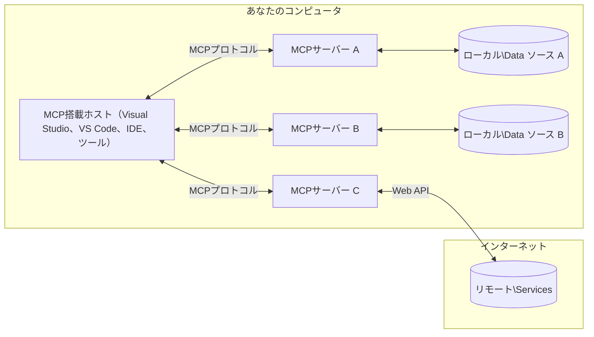

# MCP Core Concepts: AI統合のためのModel Context Protocolの習得

[](https://youtu.be/earDzWGtE84)

_(このレッスンのビデオをご覧になるには上の画像をクリックしてください)_

[Model Context Protocol (MCP)](https://github.com/modelcontextprotocol) は、 大規模言語モデル（LLM）と外部ツール、アプリケーション、データソース間の通信を最適化する強力で標準化されたフレームワークです。  
本ガイドではMCPのコアコンセプトを紹介します。クライアント-サーバーアーキテクチャ、重要なコンポーネント、通信の仕組み、実装のベストプラクティスについて学びます。

- **明確なユーザー同意**：すべてのデータアクセスと操作は実行前にユーザーの明示的な承認が必要です。ユーザーはどのデータへアクセスが行われ、どのような操作が行われるかを明確に理解し、権限や認可を細かく制御できます。

- **データプライバシーの保護**：ユーザーデータは明示的な同意がある場合のみ公開され、インタラクション全体を通じて堅牢なアクセス制御により保護されます。実装は許可のないデータ送信を防止し、厳格なプライバシー境界を維持しなければなりません。

- **ツール実行の安全性**：すべてのツール呼び出しはツールの機能、パラメータ、および潜在的な影響を明確に理解したうえでユーザーの明示的な承認を必要とします。堅牢なセキュリティ境界により意図しない、不安全、悪意のあるツール実行を防止します。

- **トランスポート層のセキュリティ**：すべての通信チャネルは適切な暗号化および認証機構を使用する必要があります。リモート接続には安全なトランスポートプロトコルと適切な資格情報管理を実装します。

#### 実装ガイドライン:

- **権限管理**：ユーザーがアクセスできるサーバー、ツール、リソースを細かく制御できる権限システムを実装する
- **認証と認可**：OAuthやAPIキーなどの安全な認証方法を使用し、適切なトークン管理と有効期限を設ける  
- **入力検証**：定義されたスキーマに従いすべてのパラメータやデータ入力を検証し、インジェクション攻撃を防止する
- **監査ログ**：セキュリティ監視とコンプライアンスのためにすべての操作の詳細なログを保持する

## 概要

このレッスンでは、Model Context Protocol (MCP) エコシステムを構成する基本的なアーキテクチャとコンポーネントを探ります。クライアント-サーバー構造、主要な構成要素、MCPインタラクションを支える通信メカニズムについて学びます。

## 主な学習目標

このレッスンを終えると、次のことができるようになります：

- MCPのクライアント-サーバーアーキテクチャを理解する。
- ホスト、クライアント、およびサーバーの役割と責任を特定する。
- MCPを柔軟な統合レイヤーにしている中核的な特徴を分析する。
- MCPエコシステム内の情報の流れを学ぶ。
- .NET、Java、Python、JavaScriptでのコード例を通じて実践的な洞察を得る。

## MCPアーキテクチャ：詳細解析

MCPエコシステムはクライアント-サーバーモデルに基づいて構築されています。  
このモジュール式構造により、AIアプリケーションはツール、データベース、API、コンテキストリソースと効率的に連携できます。アーキテクチャを主要な構成要素に分解して見てみましょう。

MCPは基本的にクライアント-サーバーアーキテクチャで、ホストアプリケーションが複数のサーバーに接続できます。


- **MCPホスト**: VSCode、Claude Desktop、IDE、またはMCPを通じてデータにアクセスしたいAIツールなどのプログラム
- **MCPクライアント**: サーバーと1対1の接続を維持するプロトコルクライアント
- **MCPサーバー**: 標準化されたModel Context Protocolを通じて特定の機能を公開する軽量プログラム
- **ローカルデータソース**: MCPサーバーが安全にアクセスできるコンピュータのファイル、データベース、サービス
- **リモートサービス**: インターネット経由で利用可能な外部システムで、MCPサーバーはAPIを通じて接続可能

MCPプロトコルは日付ベースのバージョニング（YYYY-MM-DD形式）を採用した進化中の標準です。現在のプロトコルバージョンは **2025-11-25** です。最新の[プロトコル仕様はこちら](https://modelcontextprotocol.io/specification/2025-11-25/)でご覧いただけます。

### 1. ホスト

Model Context Protocol (MCP) における**ホスト**は、ユーザーがプロトコルと対話する主要なインターフェースとして機能するAIアプリケーションです。  
ホストは複数のMCPサーバーへの接続を管理し、サーバーごとに専用のMCPクライアントを生成します。ホストの例は以下の通りです：

- **AIアプリケーション**: Claude Desktop、Visual Studio Code、Claude Code
- **開発環境**: MCP統合済みのIDEやコードエディタ  
- **カスタムアプリケーション**: 特定用途向けに構築されたAIエージェントやツール

**ホスト**はAIモデルとの対話を調整するアプリケーションです。彼らは：

- **AIモデルのオーケストレーション**: LLMを実行または連携して応答を生成し、AIのワークフローを調整する
- **クライアント接続の管理**: MCPサーバーごとに1つのMCPクライアントを生成し管理する
- **ユーザーインターフェースの制御**: 会話の流れ、ユーザーの相互作用、応答の表示を扱う  
- **セキュリティの強制**: 権限、セキュリティ制約、認証を制御する
- **ユーザー同意の取り扱い**: データ共有やツール実行に対するユーザー承認を管理

### 2. クライアント

**クライアント**はホストとMCPサーバー間の専用の1対1接続を維持する重要なコンポーネントです。  
ホストは各MCPサーバーに接続するためにMCPクライアントを生成し、組織化された安全な通信チャネルを確立します。複数のクライアントを使い、ホストは複数のサーバーに同時接続できます。

**クライアント**はホストアプリケーション内の接続役割コンポーネントです。彼らは：

- **プロトコル通信**: プロンプトや命令を含むJSON-RPC 2.0リクエストをサーバーに送信
- **機能交渉**: 初期化時にサーバーと対応可能な機能やプロトコルバージョンを交渉
- **ツール実行管理**: モデルからのツール実行リクエストを管理し応答を処理
- **リアルタイム更新**: サーバーからの通知やリアルタイム更新を処理
- **応答処理**: サーバーの応答を処理し、ユーザーに表示できる形式に整形

### 3. サーバー

**サーバー**はMCPクライアントに対して文脈やツール、機能を提供するプログラムです。  
サーバーはローカル（ホストと同じマシン）で動作する場合やリモート（外部プラットフォーム）で動作する場合があり、クライアントからのリクエストを処理し構造化された応答を返す役割を持ちます。MCP標準プロトコルを通じて特定の機能を公開します。

**サーバー**は文脈や機能を提供するサービスです。彼らは：

- **機能登録**: 利用可能なプリミティブ（リソース、プロンプト、ツール）をクライアントに登録・公開
- **リクエスト処理**: クライアントからのツール呼び出しやリソース要求、プロンプト要求を受け実行
- **文脈提供**: モデルの応答を強化するための文脈情報やデータを提供
- **状態管理**: セッション状態を維持し、必要に応じてステートフルなやり取りを処理
- **リアルタイム通知**: 機能変更や更新に関する通知を接続クライアントに送信

サーバーは誰でも開発可能で、特化した機能でモデルの能力を拡張できます。ローカルおよびリモートの両方の展開シナリオをサポートしています。

### 4. サーバープリミティブ

Model Context Protocol (MCP) のサーバーは、クライアント、ホスト、言語モデル間の豊かなインタラクションに必須な3つの中核**プリミティブ**を提供します。これらのプリミティブは、プロトコルを通じて利用可能な文脈情報や操作の種類を定義します。

MCPサーバーは以下3つのコアプリミティブを任意に組み合わせて公開可能です：

#### リソース

**リソース**はAIアプリケーションに文脈情報を提供するデータソースです。静的または動的なコンテンツでモデルの理解や意思決定を強化します：

- **文脈データ**：AIモデルが利用する構造化情報とコンテキスト
- **ナレッジベース**：ドキュメントリポジトリ、記事、マニュアル、研究論文
- **ローカルデータソース**：ファイル、データベース、ローカルシステム情報  
- **外部データ**：APIレスポンス、Webサービス、リモートシステムデータ
- **動的コンテンツ**：外部条件によりリアルタイムに更新されるデータ

リソースはURIで識別され、`resources/list`による一覧取得と`resources/read`による取得をサポートします：

```text
file://documents/project-spec.md
database://production/users/schema
api://weather/current
```

#### プロンプト

**プロンプト**は言語モデルとのインタラクションを構造化する再利用可能なテンプレートです。標準化された相互作用パターンやテンプレート化されたワークフローを提供します：

- **テンプレートベースのやり取り**：予め構造化されたメッセージや会話の起点
- **ワークフローテンプレート**：共通タスクとインタラクションの標準シーケンス
- **数ショット例**：モデル命令用の例ベーステンプレート
- **システムプロンプト**：モデルの振る舞いや文脈を定義する基本プロンプト
- **動的テンプレート**：特定コンテキストに応じてパラメータ化されたプロンプト

プロンプトは変数置換に対応し、`prompts/list`で一覧取得、`prompts/get`で取得可能です：

```markdown
Generate a {{task_type}} for {{product}} targeting {{audience}} with the following requirements: {{requirements}}
```

#### ツール

**ツール**はAIモデルが特定の操作を行うために呼び出せる実行可能関数です。MCPエコシステムにおける「動詞」であり、モデルが外部システムと連携可能にします：

- **実行可能な関数**：モデルが特定のパラメータで呼び出せる離散的な操作
- **外部システム連携**：API呼び出し、データベースクエリ、ファイル操作、計算
- **一意の識別**：各ツールは固有の名前、説明、パラメータスキーマを持つ
- **構造化I/O**：検証済みパラメータを受け取り、構造化かつ型付けされた応答を返す
- **アクション機能**：モデルが実世界で操作を行いライブデータを取得可能

ツールはJSON Schemaでパラメータ検証を行い、`tools/list`で一覧取得、`tools/call`で実行可能です。UI表示を改善するための**アイコン**メタデータも含められます。

**ツール注釈**：ツールは動作に関する注釈（例: `readOnlyHint`, `destructiveHint`）をサポートし、読取専用か破壊的操作かを示します。これによりクライアントはツール実行の判断を援助できます。

ツール定義の例：

```typescript
server.tool(
  "search_products", 
  {
    query: z.string().describe("Search query for products"),
    category: z.string().optional().describe("Product category filter"),
    max_results: z.number().default(10).describe("Maximum results to return")
  }, 
  async (params) => {
    // 検索を実行し、構造化された結果を返します
    return await productService.search(params);
  }
);
```

## クライアントプリミティブ

Model Context Protocol (MCP) では、**クライアント**がプリミティブを公開し、サーバーがホストアプリケーションに対して追加機能を要求できます。これらのクライアント側プリミティブにより、AIモデル機能やユーザーインタラクションへアクセス可能なよりリッチで双方向的なサーバー実装が可能となります。

### サンプリング

**サンプリング**はサーバーがクライアントのAIアプリケーションに言語モデルの補完を要求できるプリミティブです。  
これによりサーバーは独自にモデル依存を持たず、クライアントのモデル能力にアクセスできます：

- **モデル非依存アクセス**：サーバーはLLM SDKを含めたりモデルアクセス管理せずに補完を要求できる
- **サーバー主導のAI**：サーバーが自律的にクライアントのAIモデルを使ってコンテンツ生成可能
- **再帰的LLMインタラクション**：サーバーがAI支援で複雑な処理を行うシナリオに対応
- **動的コンテンツ生成**：ホストのモデルを使い文脈に合った応答を生成可能
- **ツール呼び出し支援**：サーバーは`tools`や`toolChoice`パラメータを含めてクライアントのモデルによるツール呼び出しを有効にできる

サンプリングは`samping/complete`メソッドを通じて開始され、サーバーからクライアントへ補完要求を送ります。

### ルーツ

**ルーツ**はクライアントがファイルシステムの境界をサーバーに公開する標準化された方法です。これによりサーバーはアクセス可能なディレクトリやファイルを理解します：

- **ファイルシステム境界**：サーバーが操作可能なファイルシステムの境界を定義
- **アクセス制御**：サーバーにアクセス権限のあるディレクトリやファイルを理解させる
- **動的更新**：クライアントはルーツのリストが変わった際にサーバーに通知可能
- **URIベース識別**：`file://` URIでアクセス可能なディレクトリやファイルを識別

ルーツは`roots/list`メソッドで取得可能で、変化時に`notifications/roots/list_changed`が送信されます。

### エリシテーション

**エリシテーション**はサーバーがクライアントのUIを通じて追加情報やユーザー確認を要求できるプリミティブです：

- **ユーザー入力要求**：ツール実行に必要な追加情報をユーザーに尋ねる
- **確認ダイアログ**：機微または影響の大きい操作に対するユーザー承認を求める
- **インタラクティブワークフロー**：サーバーが段階的なユーザー対話を作成可能
- **動的パラメータ収集**：ツール実行時に欠如しているまたは任意のパラメータを収集

エリシテーション要求は`elicitation/request`メソッドで行い、クライアントのUIを通じてユーザー入力を取得します。

**URLモードエリシテーション**：サーバーはURLベースのユーザーインタラクションも要求可能で、認証、承認、データ入力のため外部Webページへの誘導ができます。

### ロギング

**ロギング**はサーバーがクライアントに構造化されたログメッセージを送信し、デバッグ、監視、運用の透明性を提供できる機能です：

- **デバッグ支援**：トラブルシューティングのため詳細な実行ログをサーバーが提供可能
- **運用モニタリング**：状態更新やパフォーマンス指標をクライアントに送信
- **エラー報告**：詳細なエラーコンテキストと診断情報を提供
- **監査証跡**：サーバー操作や判断の包括的なログ生成

ロギングメッセージはクライアントに送られ、サーバー操作の透明性やデバッグを助けます。

## MCPの情報フロー

Model Context Protocol (MCP) はホスト、クライアント、サーバー、モデル間の構造化された情報フローを定義しています。この流れを理解することで、ユーザーリクエストの処理方法と、外部ツールやデータがモデル応答にどう統合されるかが明確になります。

- **ホストが接続を開始**  
  IDEやチャットインタフェースなどのホストアプリケーションが、通常はSTDIO、WebSocket、または他のサポート済みトランスポートを介してMCPサーバーへ接続します。

- **機能交渉**  
  ホストに埋め込まれたクライアントとサーバーは、サポートされる機能、ツール、リソース、プロトコルバージョンについて情報交換を行います。これにより両者はセッションで利用可能な機能を理解します。

- **ユーザーリクエスト**  
  ユーザーがホストと対話（例：プロンプトやコマンドを入力）します。ホストはその入力を受け取り処理のためにクライアントへ渡します。

- **リソースまたはツールの利用**  
  - クライアントはモデルの理解を深めるために、サーバーに追加の文脈やリソース（ファイル、データベースエントリー、ナレッジベース記事など）を要求する場合があります。  
  - モデルがツールを利用する必要があると判断した場合（例：データ取得、計算、API呼び出しなど）、クライアントはツール名とパラメータを指定してツール呼び出しリクエストをサーバーへ送信します。

- **サーバーの実行**  

サーバーはリソースまたはツールのリクエストを受け取り、必要な操作（関数の実行、データベースの問い合わせ、ファイルの取得など）を実行し、その結果を構造化された形式でクライアントに返します。

- **応答生成**  
  クライアントはサーバーの応答（リソースデータ、ツールの出力など）を進行中のモデルインタラクションに統合します。モデルはこの情報を使用して包括的かつ文脈に適した応答を生成します。

- **結果表示**  
  ホストはクライアントから最終出力を受け取り、ユーザーに表示します。通常、モデル生成テキストとツールの実行結果やリソースの検索結果の両方を含みます。

このフローにより、MCPはモデルと外部ツールおよびデータソースをシームレスに接続し、高度でインタラクティブかつ文脈認識型のAIアプリケーションをサポートします。

## プロトコルアーキテクチャとレイヤー

MCPは2つの明確なアーキテクチャレイヤーで構成され、完全な通信フレームワークを提供するために連携しています：

### データレイヤー

**データレイヤー**は、**JSON-RPC 2.0**を基盤としてMCPプロトコルのコアを実装します。このレイヤーはメッセージの構造、意味論、相互作用パターンを定義します：

#### コアコンポーネント：

- **JSON-RPC 2.0 プロトコル**：すべての通信は標準化されたJSON-RPC 2.0メッセージ形式を使用し、メソッドコール、応答、通知を実施
- **ライフサイクル管理**：クライアントとサーバー間の接続初期化、機能交渉、セッション終了を管理
- **サーバープリミティブ**：サーバーがツール、リソース、プロンプトを通じてコア機能を提供可能
- **クライアントプリミティブ**：サーバーがLLMからのサンプリングを要求し、ユーザー入力を誘導、ログメッセージ送信を可能にする
- **リアルタイム通知**：ポーリングなしの動的更新のための非同期通知をサポート

#### 主な特徴：

- **プロトコルバージョン交渉**：日付ベースのバージョニング（YYYY-MM-DD）を用いて互換性を確保
- **機能検出**：初期化時にクライアントとサーバーが対応機能を交換
- **ステートフルセッション**：複数の対話にわたって接続状態を維持し文脈の連続性を保つ

### トランスポートレイヤー

**トランスポートレイヤー**は、MCP参加者間の通信チャネル、メッセージのフレーミング、認証を管理します：

#### サポートされるトランスポートメカニズム：

1. **STDIOトランスポート**：
   - 標準入力/出力ストリームを用いたプロセス間直接通信
   - ネットワークオーバーヘッドがない同一マシン上のローカルプロセスに最適
   - ローカルMCPサーバー実装で一般的に使用

2. **ストリーミング可能HTTPトランスポート**：
   - クライアントからサーバーへのメッセージはHTTP POSTで送信  
   - サーバーからクライアントへのストリーミングは任意のServer-Sent Events (SSE)で実現
   - ネットワーク経由のリモートサーバー通信を可能にする
   - 標準HTTP認証（ベアラートークン、APIキー、カスタムヘッダー）に対応
   - MCPでは安全なトークン認証にOAuthの使用を推奨

#### トランスポート抽象化：

トランスポート層はデータ層から通信の詳細を抽象化し、すべてのトランスポートメカニズムで同じJSON-RPC 2.0メッセージ形式を使用可能にします。これにより、アプリケーションはローカルとリモートのサーバー間をシームレスに切り替えられます。

### セキュリティに関する考慮事項

MCPの実装は、すべてのプロトコル操作において安全で信頼性の高い、且つセキュアな相互作用を保証するために、いくつかの重要なセキュリティ原則に従う必要があります：

- **ユーザーの同意と制御**：ユーザーはデータへのアクセスや操作の実行前に明示的な同意を提供する必要があります。共有データや許可された操作を明確に制御でき、レビューと承認のための直感的なユーザーインターフェイスが求められます。

- **データプライバシー**：ユーザーデータは明示的な同意を得た場合にのみ公開され、適切なアクセス制御により保護されなければなりません。MCP実装は不正なデータ送信を防ぎ、すべての相互作用でプライバシーを維持する必要があります。

- **ツールの安全性**：ツールを呼び出す前に明確なユーザー同意が必要です。ユーザーは各ツールの機能を明確に把握すべきであり、意図しないまたは安全でないツールの実行を防ぐ堅牢なセキュリティ境界が施されていなければなりません。

これらのセキュリティ原則を遵守することで、MCPは強力なAI統合を可能にしつつ、ユーザーの信頼、プライバシー、安全性をすべてのプロトコル相互作用で守ります。

## コード例：主要コンポーネント

以下に、代表的なプログラミング言語で主要なMCPサーバーコンポーネントおよびツールの実装例を示します。

### .NET例：ツール付き簡単なMCPサーバー作成

こちらはカスタムツールの定義、登録、リクエスト処理、MCPを使ったサーバー接続方法を示す実践的な.NETコード例です。

```csharp
using System;
using System.Threading.Tasks;
using ModelContextProtocol.Server;
using ModelContextProtocol.Server.Transport;
using ModelContextProtocol.Server.Tools;

public class WeatherServer
{
    public static async Task Main(string[] args)
    {
        // Create an MCP server
        var server = new McpServer(
            name: "Weather MCP Server",
            version: "1.0.0"
        );
        
        // Register our custom weather tool
        server.AddTool<string, WeatherData>("weatherTool", 
            description: "Gets current weather for a location",
            execute: async (location) => {
                // Call weather API (simplified)
                var weatherData = await GetWeatherDataAsync(location);
                return weatherData;
            });
        
        // Connect the server using stdio transport
        var transport = new StdioServerTransport();
        await server.ConnectAsync(transport);
        
        Console.WriteLine("Weather MCP Server started");
        
        // Keep the server running until process is terminated
        await Task.Delay(-1);
    }
    
    private static async Task<WeatherData> GetWeatherDataAsync(string location)
    {
        // This would normally call a weather API
        // Simplified for demonstration
        await Task.Delay(100); // Simulate API call
        return new WeatherData { 
            Temperature = 72.5,
            Conditions = "Sunny",
            Location = location
        };
    }
}

public class WeatherData
{
    public double Temperature { get; set; }
    public string Conditions { get; set; }
    public string Location { get; set; }
}
```

### Java例：MCPサーバーコンポーネント

これは上記.NET例と同様のMCPサーバーとツール登録をJavaで実装した例です。

```java
import io.modelcontextprotocol.server.McpServer;
import io.modelcontextprotocol.server.McpToolDefinition;
import io.modelcontextprotocol.server.transport.StdioServerTransport;
import io.modelcontextprotocol.server.tool.ToolExecutionContext;
import io.modelcontextprotocol.server.tool.ToolResponse;

public class WeatherMcpServer {
    public static void main(String[] args) throws Exception {
        // MCPサーバーを作成する
        McpServer server = McpServer.builder()
            .name("Weather MCP Server")
            .version("1.0.0")
            .build();
            
        // 天気ツールを登録する
        server.registerTool(McpToolDefinition.builder("weatherTool")
            .description("Gets current weather for a location")
            .parameter("location", String.class)
            .execute((ToolExecutionContext ctx) -> {
                String location = ctx.getParameter("location", String.class);
                
                // 天気データを取得する（簡略化）
                WeatherData data = getWeatherData(location);
                
                // フォーマットされた応答を返す
                return ToolResponse.content(
                    String.format("Temperature: %.1f°F, Conditions: %s, Location: %s", 
                    data.getTemperature(), 
                    data.getConditions(), 
                    data.getLocation())
                );
            })
            .build());
        
        // stdioトランスポートを使用してサーバーに接続する
        try (StdioServerTransport transport = new StdioServerTransport()) {
            server.connect(transport);
            System.out.println("Weather MCP Server started");
            // プロセスが終了するまでサーバーを稼働させ続ける
            Thread.currentThread().join();
        }
    }
    
    private static WeatherData getWeatherData(String location) {
        // 実装では天気APIを呼び出す
        // 例示のために簡略化している
        return new WeatherData(72.5, "Sunny", location);
    }
}

class WeatherData {
    private double temperature;
    private String conditions;
    private String location;
    
    public WeatherData(double temperature, String conditions, String location) {
        this.temperature = temperature;
        this.conditions = conditions;
        this.location = location;
    }
    
    public double getTemperature() {
        return temperature;
    }
    
    public String getConditions() {
        return conditions;
    }
    
    public String getLocation() {
        return location;
    }
}
```

### Python例：MCPサーバー構築

この例ではfastmcpを使用します。事前にインストールしてください：

```python
pip install fastmcp
```
コードサンプル：

```python
#!/usr/bin/env python3
import asyncio
from fastmcp import FastMCP
from fastmcp.transports.stdio import serve_stdio

# FastMCPサーバーを作成する
mcp = FastMCP(
    name="Weather MCP Server",
    version="1.0.0"
)

@mcp.tool()
def get_weather(location: str) -> dict:
    """Gets current weather for a location."""
    return {
        "temperature": 72.5,
        "conditions": "Sunny",
        "location": location
    }

# クラスを使用した別のアプローチ
class WeatherTools:
    @mcp.tool()
    def forecast(self, location: str, days: int = 1) -> dict:
        """Gets weather forecast for a location for the specified number of days."""
        return {
            "location": location,
            "forecast": [
                {"day": i+1, "temperature": 70 + i, "conditions": "Partly Cloudy"}
                for i in range(days)
            ]
        }

# クラスのツールを登録する
weather_tools = WeatherTools()

# サーバーを起動する
if __name__ == "__main__":
    asyncio.run(serve_stdio(mcp))
```

### JavaScript例：MCPサーバー作成

この例では、JavaScriptによるMCPサーバー作成と2つの天気関連ツールの登録方法を示します。

```javascript
// 公式のモデルコンテキストプロトコルSDKを使用
import { McpServer } from "@modelcontextprotocol/sdk/server/mcp.js";
import { StdioServerTransport } from "@modelcontextprotocol/sdk/server/stdio.js";
import { z } from "zod"; // パラメータ検証のために

// MCPサーバーを作成
const server = new McpServer({
  name: "Weather MCP Server",
  version: "1.0.0"
});

// 天気ツールを定義
server.tool(
  "weatherTool",
  {
    location: z.string().describe("The location to get weather for")
  },
  async ({ location }) => {
    // 通常は天気APIを呼び出します
    // デモ用に簡略化されています
    const weatherData = await getWeatherData(location);
    
    return {
      content: [
        { 
          type: "text", 
          text: `Temperature: ${weatherData.temperature}°F, Conditions: ${weatherData.conditions}, Location: ${weatherData.location}` 
        }
      ]
    };
  }
);

// 予報ツールを定義
server.tool(
  "forecastTool",
  {
    location: z.string(),
    days: z.number().default(3).describe("Number of days for forecast")
  },
  async ({ location, days }) => {
    // 通常は天気APIを呼び出します
    // デモ用に簡略化されています
    const forecast = await getForecastData(location, days);
    
    return {
      content: [
        { 
          type: "text", 
          text: `${days}-day forecast for ${location}: ${JSON.stringify(forecast)}` 
        }
      ]
    };
  }
);

// ヘルパー関数
async function getWeatherData(location) {
  // API呼び出しをシミュレート
  return {
    temperature: 72.5,
    conditions: "Sunny",
    location: location
  };
}

async function getForecastData(location, days) {
  // API呼び出しをシミュレート
  return Array.from({ length: days }, (_, i) => ({
    day: i + 1,
    temperature: 70 + Math.floor(Math.random() * 10),
    conditions: i % 2 === 0 ? "Sunny" : "Partly Cloudy"
  }));
}

// stdioトランスポートでサーバーに接続
const transport = new StdioServerTransport();
server.connect(transport).catch(console.error);

console.log("Weather MCP Server started");
```

このJavaScript例は、サーバーに接続し、プロンプトを送信し、ツール呼び出しを含む応答を処理するMCPクライアントの作成方法を示しています。

## セキュリティと認可

MCPはプロトコル全体でのセキュリティと認可管理のため、いくつかの組み込み概念とメカニズムを備えています：

1. **ツール権限管理**：  
  クライアントはセッション中にモデルが使用可能なツールを指定可能です。これにより明示的に許可されたツールのみアクセスでき、意図しないまたは安全でない操作のリスクを軽減します。権限はユーザー設定、組織ポリシー、対話の文脈に基づき動的に構成可能です。

2. **認証**：  
  サーバーはツール、リソース、機密操作へのアクセス前に認証を要求可能です。APIキー、OAuthトークン、その他の認証方式が用いられます。適切な認証により、信頼できるクライアントとユーザーのみがサーバー機能を呼び出せます。

3. **検証**：  
  すべてのツール呼び出しでパラメータ検証が行われます。各ツールはパラメータの期待される型、フォーマット、制約を定義し、サーバーは受信リクエストを検証します。これにより不正または悪意のある入力による影響を防ぎ、操作の整合性を保ちます。

4. **レート制限**：  
  不正利用防止と公正なサーバー資源使用のため、MCPサーバーはツール呼び出しやリソースアクセスにレート制限を実装可能です。制限はユーザー単位、セッション単位、または全体で適用でき、DoS攻撃や過剰消費を防ぎます。

これらのメカニズムを組み合わせることで、MCPは言語モデルと外部ツール・データソースの安全な統合基盤を提供し、ユーザーと開発者に細粒度のアクセス制御を可能にします。

## プロトコルメッセージ & 通信フロー

MCPの通信は構造化された**JSON-RPC 2.0**メッセージを用い、ホスト、クライアント、サーバー間の明確かつ信頼性の高い相互作用を実現します。プロトコルは各種操作タイプ別に特定のメッセージパターンを定義しています：

### コアメッセージタイプ：

#### **初期化メッセージ**
- **`initialize` リクエスト**：接続確立とプロトコルバージョン・機能の交渉を実施
- **`initialize` レスポンス**：サポート機能とサーバー情報を確認  
- **`notifications/initialized`**：初期化完了とセッション準備完了を通知

#### **ディスカバリーメッセージ**
- **`tools/list` リクエスト**：利用可能なツールの検索
- **`resources/list` リクエスト**：利用可能なリソース（データソース）一覧取得
- **`prompts/list` リクエスト**：利用可能なプロンプトテンプレートの取得

#### **実行メッセージ**  
- **`tools/call` リクエスト**：特定ツールのパラメータ付き実行
- **`resources/read` リクエスト**：特定リソースからのコンテンツ取得
- **`prompts/get` リクエスト**：オプションパラメータ付きプロンプトテンプレート取得

#### **クライアント側メッセージ**
- **`sampling/complete` リクエスト**：サーバーからクライアントへLLMの補完要求
- **`elicitation/request`**：クライアントインターフェース経由のユーザー入力要求
- **ログ記録メッセージ**：サーバーからクライアントへの構造化ログ送信

#### **通知メッセージ**
- **`notifications/tools/list_changed`**：ツールの変更をクライアントに通知
- **`notifications/resources/list_changed`**：リソースの変更をクライアントに通知  
- **`notifications/prompts/list_changed`**：プロンプトの変更をクライアントに通知

### メッセージ構造：

すべてのMCPメッセージはJSON-RPC 2.0形式に準拠し、以下を含みます：
- **リクエストメッセージ**：`id`、`method`、および省略可能な`params`
- **レスポンスメッセージ**：`id`と`result`または`error`
- **通知メッセージ**：`method`と省略可能な`params`（`id`なし、応答不要）

この構造化された通信により、信頼性が高く追跡可能で拡張性のある相互作用が保証され、リアルタイム更新、ツール連結、堅牢なエラー処理といった高度なシナリオをサポートします。

### タスク（実験的）

**タスク**は実験的機能で、MCPリクエストに対して耐久的な実行ラッパーを提供し、結果の後日取得や状況追跡を可能にします：

- **長時間実行操作**：高コストな計算、ワークフロー自動化、バッチ処理を追跡
- **結果の延期取得**：タスク状況をポーリングし、操作完了時に結果を取得
- **状況追跡**：定義されたライフサイクル状態を通じて進行状況を管理
- **多段階操作**：複数対話にまたがる複雑なワークフローをサポート

タスクは標準MCPリクエストをラップし、即時完了しない操作での非同期実行パターンを可能にします。

## 重要ポイント

- **アーキテクチャ**：ホストが複数のクライアント接続を管理するクライアント-サーバー構造
- **参加者**：ホスト（AIアプリ）、クライアント（プロトコルコネクター）、サーバー（機能提供者）
- **トランスポートメカニズム**：STDIO（ローカル）およびストリーム可能なHTTP＋任意SSE（リモート）対応
- **コアプリミティブ**：サーバーはツール（実行可能関数）、リソース（データソース）、プロンプト（テンプレート）を公開
- **クライアントプリミティブ**：サーバーはサンプリング（ツール呼び出し対応のLLM補完）、ユーザー誘導（URLモード含む）、ルート（ファイルシステム境界）、ログ記録をクライアントに要求可能
- **実験的機能**：タスクは長時間実行向けの耐久的実行ラッパーを提供
- **プロトコル基盤**：JSON-RPC 2.0上に構築、日付ベースのバージョニング（現在：2025-11-25）
- **リアルタイム対応**：動的更新やリアルタイム同期のための通知をサポート
- **セキュリティ最優先**：明示的なユーザー同意、データプライバシー保護、安全なトランスポートが必須

## 演習

あなたの領域で役立つシンプルなMCPツールを設計してください。以下を定義してください：
1. ツール名
2. 受け付けるパラメータ
3. 返す出力
4. モデルがこのツールを使ってユーザーの問題をどのように解決するか

---

## 次に読むべき章

次へ：[Chapter 2: Security](../02-Security/README.md)

---

<!-- CO-OP TRANSLATOR DISCLAIMER START -->
**免責事項**：
本書類はAI翻訳サービス「[Co-op Translator](https://github.com/Azure/co-op-translator)」を使用して翻訳されました。正確性の向上に努めておりますが、自動翻訳には誤りや不正確な部分が含まれる場合があります。原文の言語によるオリジナル文書を正式な情報源としてください。重要な情報に関しては、専門の人間翻訳をご利用いただくことを推奨します。本翻訳の使用により生じた誤解や解釈の相違について、一切の責任を負いかねますのでご了承ください。
<!-- CO-OP TRANSLATOR DISCLAIMER END -->
