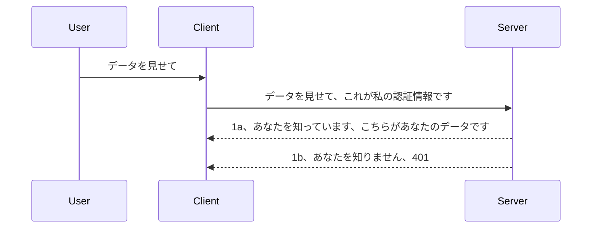

# シンプルな認証

MCP SDKはOAuth 2.1の使用をサポートしていますが、正直言ってこれは認証サーバー、リソースサーバー、資格情報の送信、コードの取得、コードをベアラートークンに交換、最終的にリソースデータの取得といった概念を含むかなり複雑なプロセスです。OAuthに慣れていない場合（これは実装するのに非常に良いものですが）、基本的なレベルの認証から始めて、より良いセキュリティへと段階的に構築していくことをお勧めします。この章が存在する理由は、より高度な認証へとあなたを導くためです。

## 認証、私たちは何を意味するのか？

認証とは、認証と認可の略です。すべきことは2つあります：

- **認証**：それは、その人が私たちの家に入ることを許可するかどうかを判断するプロセスで、「ここにいる」つまりMCPサーバー機能が動作するリソースサーバーにアクセスする権利があるかどうかを判定することです。
- **認可**：特定のユーザーが要求しているリソース、例えばこれらの注文やこれらの製品にアクセスする権利があるかどうか、あるいは読み取りは許可されているが削除は許可されていないなどを判断するプロセスです。

## 資格情報：システムに自分が誰であるかを伝える方法

ほとんどのウェブ開発者は通常、認証のためにサーバーに資格情報を提供することを考えます。これは通常、ユーザー名とパスワードのbase64エンコード版、または特定のユーザーを一意に識別するAPIキーの形式で、サーバーに「ここにいてもよい」という秘密情報を送ることです。

これは通常、"Authorization"というヘッダーを通じて送信されます：

```json
{ "Authorization": "secret123" }
```
  
これは通常ベーシック認証と呼ばれます。全体のフローは以下のように動きます：


フローの仕組みがわかったところで、どのように実装するのでしょうか？ほとんどのウェブサーバーには「ミドルウェア」という概念があり、リクエストの一部として実行され、資格情報を検証し、有効であればリクエストを通過させます。資格情報が無効な場合は認証エラーを返します。実装例を見てみましょう。

**Python**

```python
class AuthMiddleware(BaseHTTPMiddleware):
    async def dispatch(self, request, call_next):

        has_header = request.headers.get("Authorization")
        if not has_header:
            print("-> Missing Authorization header!")
            return Response(status_code=401, content="Unauthorized")

        if not valid_token(has_header):
            print("-> Invalid token!")
            return Response(status_code=403, content="Forbidden")

        print("Valid token, proceeding...")
       
        response = await call_next(request)
        # 任意のカスタマーヘッダーを追加するか、レスポンスを何らかの形で変更してください
        return response


starlette_app.add_middleware(CustomHeaderMiddleware)
```
  
ここでは：

- `AuthMiddleware` というミドルウェアを作成し、その `dispatch` メソッドがウェブサーバーから呼び出されるようにしました。
- ミドルウェアをウェブサーバーに追加しました：

    ```python
    starlette_app.add_middleware(AuthMiddleware)
    ```
  
- Authorizationヘッダーが存在し、送信された秘密情報が有効かどうかをチェックする検証ロジックを書きました：

    ```python
    has_header = request.headers.get("Authorization")
    if not has_header:
        print("-> Missing Authorization header!")
        return Response(status_code=401, content="Unauthorized")

    if not valid_token(has_header):
        print("-> Invalid token!")
        return Response(status_code=403, content="Forbidden")
    ```
  
秘密情報が存在し有効な場合は、`call_next` を呼び出してリクエストを通過させ、レスポンスを返します。

    ```python
    response = await call_next(request)
    # 任意のカスタマーヘッダーを追加するか、レスポンスを何らかの形で変更する
    return response
    ```
  
動作は、ウェブリクエストがサーバーに送られるとミドルウェアが呼ばれ、実装によってリクエストを通過させるか、クライアントが進むことを許可されていないというエラーを返すかのどちらかになります。

**TypeScript**

ここでは人気のあるExpressフレームワークでミドルウェアを作成し、リクエストがMCPサーバーに到達する前にインターセプトします。コードは以下の通りです：

```typescript
function isValid(secret) {
    return secret === "secret123";
}

app.use((req, res, next) => {
    // 1. Authorizationヘッダーは存在しますか?
    if(!req.headers["Authorization"]) {
        res.status(401).send('Unauthorized');
    }
    
    let token = req.headers["Authorization"];

    // 2. 有効性を確認します。
    if(!isValid(token)) {
        res.status(403).send('Forbidden');
    }

   
    console.log('Middleware executed');
    // 3. リクエストパイプラインの次のステップにリクエストを渡します。
    next();
});
```
  
このコードでは：

1. Authorizationヘッダーが最初に存在するかを確認し、なければ401エラーを返す。
2. 資格情報/トークンが有効かを確認し、無効なら403エラーを返す。
3. 最後にリクエストパイプラインにリクエストを通し、要求されたリソースを返す。

## 演習：認証を実装する

知識を使って実装してみましょう。計画は次の通りです：

サーバー

- ウェブサーバーとMCPインスタンスを作成する。
- サーバーのミドルウェアを実装する。

クライアント 

- ヘッダーを介して資格情報を含むウェブリクエストを送る。

### -1- ウェブサーバーとMCPインスタンスを作成する

最初のステップとして、ウェブサーバーインスタンスとMCPサーバーを作成します。

**Python**

ここではMCPサーバーのインスタンスを作成し、starletteのウェブアプリを作成し、uvicornでホストします。

```python
# MCPサーバーを作成中

app = FastMCP(
    name="MCP Resource Server",
    instructions="Resource Server that validates tokens via Authorization Server introspection",
    host=settings["host"],
    port=settings["port"],
    debug=True
)

# starletteウェブアプリを作成中
starlette_app = app.streamable_http_app()

# uvicornでアプリを提供中
async def run(starlette_app):
    import uvicorn
    config = uvicorn.Config(
            starlette_app,
            host=app.settings.host,
            port=app.settings.port,
            log_level=app.settings.log_level.lower(),
        )
    server = uvicorn.Server(config)
    await server.serve()

run(starlette_app)
```
  
このコードは：

- MCPサーバーを作成し、
- MCPサーバーからstarletteウェブアプリを構築し、`app.streamable_http_app()`。
- uvicornを使用してウェブアプリをホストしサーバーを実行、`server.serve()`。

**TypeScript**

ここではMCPサーバーのインスタンスを作成します。

```typescript
const server = new McpServer({
      name: "example-server",
      version: "1.0.0"
    });

    // ... サーバーのリソース、ツール、およびプロンプトを設定します ...
```
  
このMCPサーバーの作成はPOST /mcpルート定義内で行う必要があるので、上記コードを以下のように移動します：

```typescript
import express from "express";
import { randomUUID } from "node:crypto";
import { McpServer } from "@modelcontextprotocol/sdk/server/mcp.js";
import { StreamableHTTPServerTransport } from "@modelcontextprotocol/sdk/server/streamableHttp.js";
import { isInitializeRequest } from "@modelcontextprotocol/sdk/types.js"

const app = express();
app.use(express.json());

// セッションIDごとにトランスポートを格納するマップ
const transports: { [sessionId: string]: StreamableHTTPServerTransport } = {};

// クライアントからサーバーへの通信のためのPOSTリクエストを処理する
app.post('/mcp', async (req, res) => {
  // 既存のセッションIDをチェックする
  const sessionId = req.headers['mcp-session-id'] as string | undefined;
  let transport: StreamableHTTPServerTransport;

  if (sessionId && transports[sessionId]) {
    // 既存のトランスポートを再利用する
    transport = transports[sessionId];
  } else if (!sessionId && isInitializeRequest(req.body)) {
    // 新しい初期化リクエスト
    transport = new StreamableHTTPServerTransport({
      sessionIdGenerator: () => randomUUID(),
      onsessioninitialized: (sessionId) => {
        // セッションIDごとにトランスポートを格納する
        transports[sessionId] = transport;
      },
      // DNSリバインディング保護は後方互換性のためデフォルトで無効になっています。サーバーを実行している場合
      // ローカルで実行している場合は、以下を設定してください:
      // enableDnsRebindingProtection: true,
      // allowedHosts: ['127.0.0.1'],
    });

    // トランスポートが閉じられた時にクリーンアップする
    transport.onclose = () => {
      if (transport.sessionId) {
        delete transports[transport.sessionId];
      }
    };
    const server = new McpServer({
      name: "example-server",
      version: "1.0.0"
    });

    // ... サーバーのリソース、ツール、プロンプトを設定する ...

    // MCPサーバーに接続する
    await server.connect(transport);
  } else {
    // 無効なリクエスト
    res.status(400).json({
      jsonrpc: '2.0',
      error: {
        code: -32000,
        message: 'Bad Request: No valid session ID provided',
      },
      id: null,
    });
    return;
  }

  // リクエストを処理する
  await transport.handleRequest(req, res, req.body);
});

// GETおよびDELETEリクエストに再利用可能なハンドラ
const handleSessionRequest = async (req: express.Request, res: express.Response) => {
  const sessionId = req.headers['mcp-session-id'] as string | undefined;
  if (!sessionId || !transports[sessionId]) {
    res.status(400).send('Invalid or missing session ID');
    return;
  }
  
  const transport = transports[sessionId];
  await transport.handleRequest(req, res);
};

// SSEを介してサーバーからクライアントへの通知のためのGETリクエストを処理する
app.get('/mcp', handleSessionRequest);

// セッション終了のためのDELETEリクエストを処理する
app.delete('/mcp', handleSessionRequest);

app.listen(3000);
```
  
これで `app.post("/mcp")` 内にMCPサーバー作成処理が移動したことがわかります。

次のステップであるミドルウェアの作成に進みましょう。これで受信した資格情報を検証できるようになります。

### -2- サーバーのミドルウェアを実装する

次にミドルウェア部分を作成します。ここでは `Authorization` ヘッダーの資格情報を探し、それを検証します。許容できる場合はリクエストを続行し、必要な処理（例えばツールの一覧取得、リソースの読み取り、などクライアント要求のMCP機能）を行います。

**Python**

ミドルウェアを作るためには `BaseHTTPMiddleware` を継承したクラスを作成します。興味深いのは以下の2つ：

- リクエスト `request` 、ここからヘッダー情報を読み取る。
- `call_next` 、クライアントの資格情報が許可される場合に呼び出すコールバック。

最初に、`Authorization` ヘッダーがない場合の処理を行います：

```python
has_header = request.headers.get("Authorization")

# ヘッダーが存在しない場合は401で失敗し、それ以外は続行します。
if not has_header:
    print("-> Missing Authorization header!")
    return Response(status_code=401, content="Unauthorized")
```
  
ここではクライアントが認証に失敗しているので401 unauthorizedレスポンスを返します。

次に、資格情報が送信されている場合、その有効性を以下のようにチェックします：

```python
 if not valid_token(has_header):
    print("-> Invalid token!")
    return Response(status_code=403, content="Forbidden")
```
  
上記で403 forbiddenを返していることに注目してください。以下に、これまでのすべてを実装したフルミドルウェアコードを示します：

```python
class AuthMiddleware(BaseHTTPMiddleware):
    async def dispatch(self, request, call_next):

        has_header = request.headers.get("Authorization")
        if not has_header:
            print("-> Missing Authorization header!")
            return Response(status_code=401, content="Unauthorized")

        if not valid_token(has_header):
            print("-> Invalid token!")
            return Response(status_code=403, content="Forbidden")

        print("Valid token, proceeding...")
        print(f"-> Received {request.method} {request.url}")
        response = await call_next(request)
        response.headers['Custom'] = 'Example'
        return response

```
  
良いですね。ただ `valid_token` 関数はどうでしょう？以下です：

```python
# 本番環境では使用しないでください - 改善してください！！
def valid_token(token: str) -> bool:
    # "Bearer " プレフィックスを削除してください
    if token.startswith("Bearer "):
        token = token[7:]
        return token == "secret-token"
    return False
```
  
これは明らかに改善すべきです。

重要：このような秘密情報をコード中に持つべきではありません。理想的にはデータソースやIDP（Identity Provider）から値を取得するか、あるいはIDPに検証をさせるべきです。

**TypeScript**

Expressで実装するには、ミドルウェア関数を受け取る `use` メソッドを呼び出す必要があります。

以下のことを行います：

- リクエストオブジェクトから `Authorization` プロパティを取得して資格情報をチェックする。
- 資格情報を検証し、有効であればリクエストを続行し、クライアントのMCPリクエストに応じた処理を行う。

まず、`Authorization` ヘッダーが存在するかを判定し、なければリクエストを中断します：

```typescript
if(!req.headers["authorization"]) {
    res.status(401).send('Unauthorized');
    return;
}
```
  
ヘッダーが全く送られなければ401エラーを返します。

次に資格情報が有効かチェックし、無効ならまたリクエストを中断しますが、メッセージは少し異なります：

```typescript
if(!isValid(token)) {
    res.status(403).send('Forbidden');
    return;
} 
```
  
こちらは403エラーが返ります。

以下がフルコードです：

```typescript
app.use((req, res, next) => {
    console.log('Request received:', req.method, req.url, req.headers);
    console.log('Headers:', req.headers["authorization"]);
    if(!req.headers["authorization"]) {
        res.status(401).send('Unauthorized');
        return;
    }
    
    let token = req.headers["authorization"];

    if(!isValid(token)) {
        res.status(403).send('Forbidden');
        return;
    }  

    console.log('Middleware executed');
    next();
});
```
  
クライアントが送信してくる資格情報をチェックするミドルウェアを受け入れる形でウェブサーバーが設定されました。ではクライアントはどうすればよいでしょうか？

### -3- ヘッダーを通じて資格情報付きのウェブリクエストを送信する

クライアントから資格情報をヘッダーに入れて受け渡す必要があります。MCPクライアントを使う場合、どうすればいいか見てみましょう。

**Python**

クライアントでは、このように資格情報を含むヘッダーを渡します：

```python
# 値をハードコードしないでください。最低でも環境変数やより安全なストレージに保存してください
token = "secret-token"

async with streamablehttp_client(
        url = f"http://localhost:{port}/mcp",
        headers = {"Authorization": f"Bearer {token}"}
    ) as (
        read_stream,
        write_stream,
        session_callback,
    ):
        async with ClientSession(
            read_stream,
            write_stream
        ) as session:
            await session.initialize()
      
            # TODO、クライアントで行いたいこと、例えばツールのリスト化、ツールの呼び出しなど。
```
  
`headers = {"Authorization": f"Bearer {token}"}` のように `headers` プロパティを設定していることに注目してください。

**TypeScript**

2つのステップで解決できます：

1. 設定オブジェクトに資格情報を入れる。
2. その設定オブジェクトをトランスポート層に渡す。

```typescript

// ここで示されているように値をハードコーディングしないでください。最低でも環境変数として持ち、開発モードではdotenvのようなものを使用してください。
let token = "secret123"

// クライアントのトランスポートオプションオブジェクトを定義する
let options: StreamableHTTPClientTransportOptions = {
  sessionId: sessionId,
  requestInit: {
    headers: {
      "Authorization": "secret123"
    }
  }
};

// オプションオブジェクトをトランスポートに渡す
async function main() {
   const transport = new StreamableHTTPClientTransport(
      new URL(serverUrl),
      options
   );
```
  
上記では `options` オブジェクトを作成し、ヘッダーを `requestInit` プロパティの下に配置していることがわかります。

重要：ここからどう改良するか？現在の実装は問題があります。まず、HTTPSがない限りこのように資格情報を送るのは危険です。それでも資格情報が盗まれる可能性があるため、トークンを取り消せる仕組みや発信元の地理的検証、過剰なリクエスト（ボットのような動作）などのチェックを追加しなければなりません。つまり、多数の懸念事項があります。

とはいえ、認証無しでAPIを呼ばれたくない非常にシンプルなAPIには、ここで紹介した方法は良い出発点です。

とは言っても、より安全にするためにJSON Web Token（JWT、または「JOT」トークン）といった標準的なフォーマットを使って強化してみましょう。

## JSON Web Token、JWT

単純な資格情報を送る方法からの改善を考えています。JWTを採用すると得られる即時的な利点は何でしょう？

- **セキュリティ向上**。ベーシック認証ではユーザー名とパスワード（またはAPIキー）をbase64で何度も送信し、リスクが高いです。JWTはユーザー名・パスワードを送信しトークンを取得し、このトークンは期限付きで失効します。JWTはロール、スコープ、パーミッションによる細かなアクセス制御を簡単に可能にします。
- **ステートレス性とスケーラビリティ**。JWTは自己完結型でユーザー情報を全て含むため、サーバー側のセッションストレージが不要になります。トークンはローカルで検証可能です。
- **相互運用性とフェデレーション**。JWTはOpen ID Connectの中心であり、Entra ID、Google Identity、Auth0などの既知のIDプロバイダーで使われます。シングルサインオンなど企業向け機能も実現します。
- **モジュール性と柔軟性**。JWTはAzure API ManagementやNGINXなどのAPIゲートウェイとも連携可能で、ユーザー認証シナリオ、サーバー間通信、代理操作や委任シナリオなどをサポートします。
- **パフォーマンスとキャッシュ**。JWTはデコード後にキャッシュ可能で、解析の必要が減り、特に高トラフィックアプリでスループット向上と負荷軽減に繋がります。
- **高度な機能**。イントロスペクション（サーバー側での有効性チェック）やトークンの取り消し（無効化）もサポートします。

これらのメリットを踏まえ、実装を次の段階へ進めましょう。

## ベーシック認証からJWTへの移行

概観すると、必要な変更は以下です：

- **JWTトークンを構築し**、クライアントからサーバーへ送る準備をする。
- **JWTトークンを検証し**、有効ならクライアントにリソースを提供する。
- **トークンの安全な保管**。このトークンをどのように保存するか。
- **ルートの保護**。特にルートとMCPの特定機能を守る。
- **リフレッシュトークンの追加**。有効期限が短いトークンと、期限が長いリフレッシュトークンを作成し、期限切れ時は新しいトークンを取得できるようにする。リフレッシュ用のエンドポイントと回転戦略も用意する。

### -1- JWTトークンを構築する

JWTトークンは次の部分から成ります：

- **ヘッダー**：使用アルゴリズムとトークンのタイプ。
- **ペイロード**：サブジェクト（トークンが表すユーザーやエンティティ、認証シナリオでは通常ユーザーID）、有効期限（exp）、ロールなどのクレーム。
- **署名**：秘密鍵または秘密情報で署名される。

これらを構築してエンコードされたトークンを作成します。

**Python**

```python

import jwt
import jwt
from jwt.exceptions import ExpiredSignatureError, InvalidTokenError
import datetime

# JWTに署名するために使用される秘密鍵
secret_key = 'your-secret-key'

header = {
    "alg": "HS256",
    "typ": "JWT"
}

# ユーザー情報とそのクレームおよび有効期限
payload = {
    "sub": "1234567890",               # サブジェクト（ユーザーID）
    "name": "User Userson",                # カスタムクレーム
    "admin": True,                     # カスタムクレーム
    "iat": datetime.datetime.utcnow(),# 発行時間
    "exp": datetime.datetime.utcnow() + datetime.timedelta(hours=1)  # 有効期限
}

# エンコードする
encoded_jwt = jwt.encode(payload, secret_key, algorithm="HS256", headers=header)
```
  
上記コードでは

- HS256アルゴリズム、JWTタイプのヘッダーを定義し、
- サブジェクトまたはユーザーID、ユーザー名、ロール、発行時刻、期限切れ時刻を含むペイロードを構築し、時間制限付きトークンを実装しています。

**TypeScript**

JWTトークンの構築に役立つ依存パッケージが必要です。

依存関係

```sh

npm install jsonwebtoken
npm install --save-dev @types/jsonwebtoken
```
  
準備できたらヘッダー、ペイロードを作成し、それを通じてエンコード済みトークンを作成します。

```typescript
import jwt from 'jsonwebtoken';

const secretKey = 'your-secret-key'; // 本番環境では環境変数を使用してください

// ペイロードを定義する
const payload = {
  sub: '1234567890',
  name: 'User usersson',
  admin: true,
  iat: Math.floor(Date.now() / 1000), // 発行日時
  exp: Math.floor(Date.now() / 1000) + 60 * 60 // 1時間で期限切れ
};

// ヘッダーを定義する（オプション、jsonwebtokenはデフォルトを設定します）
const header = {
  alg: 'HS256',
  typ: 'JWT'
};

// トークンを作成する
const token = jwt.sign(payload, secretKey, {
  algorithm: 'HS256',
  header: header
});

console.log('JWT:', token);
```
  
このトークンは：

HS256で署名  
1時間有効  
sub、name、admin、iat、expといったクレームを含みます。

### -2- トークンの検証

またトークンの検証も必要で、これはクライアントが送るものが本当に有効かどうかを確かめるサーバー側の処理です。構造の検証から有効期限の確認まで様々なチェックがあります。さらにユーザーが当社システムのメンバーか、権限を持っているかなどの追加検証も推奨されます。

トークンを検証するにはデコードし内容を読み取り、そこから検証を開始します。

**Python**

```python

# JWTをデコードして検証する
try:
    decoded = jwt.decode(token, secret_key, algorithms=["HS256"])
    print("✅ Token is valid.")
    print("Decoded claims:")
    for key, value in decoded.items():
        print(f"  {key}: {value}")
except ExpiredSignatureError:
    print("❌ Token has expired.")
except InvalidTokenError as e:
    print(f"❌ Invalid token: {e}")

```
  
このコードでは、`jwt.decode` をトークン、秘密鍵、指定したアルゴリズムで呼び出します。検証失敗時に例外が発生するためtry-catch構文を使用しています。

**TypeScript**

ここでは `jwt.verify` を呼び出し、解析済みトークンを取得してさらに分析します。失敗するとトークンの構造が間違っているか期限切れなどが考えられます。

```typescript

try {
  const decoded = jwt.verify(token, secretKey);
  console.log('Decoded Payload:', decoded);
} catch (err) {
  console.error('Token verification failed:', err);
}
```
  
注意：前述の通り、トークンがシステム内のユーザーを指し示し、ユーザーが持つ権限をチェックする追加検証を行うべきです。
次に、RBAC（ロールベースアクセスコントロール）としても知られるロールベースアクセス制御について見ていきましょう。

## ロールベースアクセス制御の追加

異なるロールが異なる権限を持つことを表現したいという考え方です。例えば、管理者（admin）はすべてを実行でき、通常のユーザーは読み書きができ、ゲストは読み取りのみ可能だと仮定します。したがって、以下のような権限レベルが考えられます。

- Admin.Write  
- User.Read  
- Guest.Read

ミドルウェアでこのような制御をどのように実装できるかを見てみましょう。ミドルウェアはルートごとに追加することも全てのルートに対して追加することも可能です。

**Python**

```python
from starlette.middleware.base import BaseHTTPMiddleware
from starlette.responses import JSONResponse
import jwt

# 秘密情報をコード内に入れないでください。これはデモ用です。安全な場所から読み取ってください。
SECRET_KEY = "your-secret-key" # これを環境変数に入れてください
REQUIRED_PERMISSION = "User.Read"

class JWTPermissionMiddleware(BaseHTTPMiddleware):
    async def dispatch(self, request, call_next):
        auth_header = request.headers.get("Authorization")
        if not auth_header or not auth_header.startswith("Bearer "):
            return JSONResponse({"error": "Missing or invalid Authorization header"}, status_code=401)

        token = auth_header.split(" ")[1]
        try:
            decoded = jwt.decode(token, SECRET_KEY, algorithms=["HS256"])
        except jwt.ExpiredSignatureError:
            return JSONResponse({"error": "Token expired"}, status_code=401)
        except jwt.InvalidTokenError:
            return JSONResponse({"error": "Invalid token"}, status_code=401)

        permissions = decoded.get("permissions", [])
        if REQUIRED_PERMISSION not in permissions:
            return JSONResponse({"error": "Permission denied"}, status_code=403)

        request.state.user = decoded
        return await call_next(request)


```
  
ミドルウェアを追加する方法は以下のようにいくつかあります。

```python

# 代替案 1: starlette アプリを構築する際にミドルウェアを追加する
middleware = [
    Middleware(JWTPermissionMiddleware)
]

app = Starlette(routes=routes, middleware=middleware)

# 代替案 2: starlette アプリがすでに構築された後にミドルウェアを追加する
starlette_app.add_middleware(JWTPermissionMiddleware)

# 代替案 3: ルートごとにミドルウェアを追加する
routes = [
    Route(
        "/mcp",
        endpoint=..., # ハンドラー
        middleware=[Middleware(JWTPermissionMiddleware)]
    )
]
```
  
**TypeScript**

`app.use`とすべてのリクエストに対して実行されるミドルウェアを使うことができます。

```typescript
app.use((req, res, next) => {
    console.log('Request received:', req.method, req.url, req.headers);
    console.log('Headers:', req.headers["authorization"]);

    // 1. 認証ヘッダーが送信されているか確認する

    if(!req.headers["authorization"]) {
        res.status(401).send('Unauthorized');
        return;
    }
    
    let token = req.headers["authorization"];

    // 2. トークンが有効か確認する
    if(!isValid(token)) {
        res.status(403).send('Forbidden');
        return;
    }  

    // 3. トークンのユーザーが当システムに存在するか確認する
    if(!isExistingUser(token)) {
        res.status(403).send('Forbidden');
        console.log("User does not exist");
        return;
    }
    console.log("User exists");

    // 4. トークンに正しい権限があるか検証する
    if(!hasScopes(token, ["User.Read"])){
        res.status(403).send('Forbidden - insufficient scopes');
    }

    console.log("User has required scopes");

    console.log('Middleware executed');
    next();
});

```
  
ミドルウェアにさせることができ、かつミドルウェアがすべきことは多数あります。具体的には：

1. 認証ヘッダーが存在するか確認する
2. トークンが有効か確認する。`isValid`を呼び出します。これはJWTトークンの整合性と有効性をチェックするメソッドです。
3. ユーザーがシステムに存在することを検証する。これは確認すべきです。

   ```typescript
    // DB内のユーザー
   const users = [
     "user1",
     "User usersson",
   ]

   function isExistingUser(token) {
     let decodedToken = verifyToken(token);

     // TODO、ユーザーがDBに存在するか確認する
     return users.includes(decodedToken?.name || "");
   }
   ```
  
上記では非常にシンプルな`users`リストを作成しましたが、これは当然データベースにあるべきものです。

4. さらに、トークンが正しい権限を持つかもチェックすべきです。

   ```typescript
   if(!hasScopes(token, ["User.Read"])){
        res.status(403).send('Forbidden - insufficient scopes');
   }
   ```
  
上記のミドルウェアコードでは、トークンにUser.Read権限が含まれているかをチェックし、そうでなければ403エラーを返しています。以下は`hasScopes`ヘルパーメソッドです。

   ```typescript
   function hasScopes(scope: string, requiredScopes: string[]) {
     let decodedToken = verifyToken(scope);
    return requiredScopes.every(scope => decodedToken?.scopes.includes(scope));
  }  
   ```

Have a think which additional checks you should be doing, but these are the absolute minimum of checks you should be doing.

Using Express as a web framework is a common choice. There are helpers library when you use JWT so you can write less code.

- `express-jwt`, helper library that provides a middleware that helps decode your token.
- `express-jwt-permissions`, this provides a middleware `guard` that helps check if a certain permission is on the token.

Here's what these libraries can look like when used:

```typescript
const express = require('express');
const jwt = require('express-jwt');
const guard = require('express-jwt-permissions')();

const app = express();
const secretKey = 'your-secret-key'; // put this in env variable

// Decode JWT and attach to req.user
app.use(jwt({ secret: secretKey, algorithms: ['HS256'] }));

// Check for User.Read permission
app.use(guard.check('User.Read'));

// multiple permissions
// app.use(guard.check(['User.Read', 'Admin.Access']));

app.get('/protected', (req, res) => {
  res.json({ message: `Welcome ${req.user.name}` });
});

// Error handler
app.use((err, req, res, next) => {
  if (err.code === 'permission_denied') {
    return res.status(403).send('Forbidden');
  }
  next(err);
});

```
  
これでミドルウェアが認証と認可の両方に使えることが分かりましたが、MCPの場合はどうでしょうか？認証のやり方が変わるでしょうか？次のセクションで見ていきます。

### -3- MCPにRBACを追加する

これまでミドルウェア経由でRBACを追加する方法を見てきましたが、MCPごとの機能に対してRBACを簡単に追加する方法はありません。ではどうするか？このケースではクライアントが特定のツールを呼び出す権利を持つかチェックするコードを追加するしかありません。

機能ごとにRBACを実現する方法はいくつかあります。例として：

- 権限レベルをチェックする必要のある各ツール、リソース、プロンプトのチェックを追加する。

   **python**

   ```python
   @tool()
   def delete_product(id: int):
      try:
          check_permissions(role="Admin.Write", request)
      catch:
        pass # クライアントの認証に失敗しました。認証エラーを発生させます。
   ```
  
   **typescript**

   ```typescript
   server.registerTool(
    "delete-product",
    {
      title: Delete a product",
      description: "Deletes a product",
      inputSchema: { id: z.number() }
    },
    async ({ id }) => {
      
      try {
        checkPermissions("Admin.Write", request);
        // todo、idをproductServiceとremote entryに送ること
      } catch(Exception e) {
        console.log("Authorization error, you're not allowed");  
      }

      return {
        content: [{ type: "text", text: `Deletected product with id ${id}` }]
      };
    }
   );
   ```
  

- 高度なサーバーアプローチとリクエストハンドラーを使い、チェックする場所を最小限に抑える。

   **Python**

   ```python
   
   tool_permission = {
      "create_product": ["User.Write", "Admin.Write"],
      "delete_product": ["Admin.Write"]
   }

   def has_permission(user_permissions, required_permissions) -> bool:
      # user_permissions: ユーザーが持つ権限のリスト
      # required_permissions: ツールに必要な権限のリスト
      return any(perm in user_permissions for perm in required_permissions)

   @server.call_tool()
   async def handle_call_tool(
     name: str, arguments: dict[str, str] | None
   ) -> list[types.TextContent]:
    # request.user.permissions はユーザーの権限リストであると仮定する
     user_permissions = request.user.permissions
     required_permissions = tool_permission.get(name, [])
     if not has_permission(user_permissions, required_permissions):
        # エラーを発生させる "ツール {name} を呼び出す権限がありません"
        raise Exception(f"You don't have permission to call tool {name}")
     # 続行してツールを呼び出す
     # ...
   ```   
   

   **TypeScript**

   ```typescript
   function hasPermission(userPermissions: string[], requiredPermissions: string[]): boolean {
       if (!Array.isArray(userPermissions) || !Array.isArray(requiredPermissions)) return false;
       // ユーザーが少なくとも1つの必要な権限を持っている場合はtrueを返します
       
       return requiredPermissions.some(perm => userPermissions.includes(perm));
   }
  
   server.setRequestHandler(CallToolRequestSchema, async (request) => {
      const { params: { name } } = request;
  
      let permissions = request.user.permissions;
  
      if (!hasPermission(permissions, toolPermissions[name])) {
         return new Error(`You don't have permission to call ${name}`);
      }
  
      // 続けてください..
   });
   ```
  
   注意：ミドルウェアがリクエストのuserプロパティにデコードされたトークンを割り当てることを確認しておく必要があり、上記コードがシンプルになります。

### まとめ

ここまでRBACの一般的な追加方法とMCPでの追加方法を話しました。理解したことを確かめるためにセキュリティ実装に挑戦してみましょう。

## 課題1：基本認証を使ったmcpサーバーとmcpクライアントを構築する

ここでは、ヘッダーを通じて資格情報を送る方法を学びます。

## 解答1

[Solution 1](./code/basic/README.md)

## 課題2：課題1の解決策をJWTを使うようアップグレードする

最初の解決策を用いて、今回は改良を加えましょう。

Basic Authではなく、JWTを使います。

## 解答2

[Solution 2](./solution/jwt-solution/README.md)

## チャレンジ

"Add RBAC to MCP" セクションで説明した機能ごとのRBACを追加してください。

## まとめ

この章では、まったくセキュリティがない状態から基本的なセキュリティ、JWTまで学び、MCPへの追加方法も学んだはずです。

カスタムJWTでしっかりした基盤を構築しましたが、規模が大きくなるにつれて標準ベースのアイデンティティモデルに向かっています。EntraやKeycloakのようなIdPを採用することで、トークンの発行、検証、ライフサイクル管理を信頼できるプラットフォームに委ねられ、アプリのロジックやユーザー体験に集中できます。

そのために、より[高度なEntraに関する章](../../05-AdvancedTopics/mcp-security-entra/README.md)があります。

## 次にやること

- 次へ：[MCPホストの設定](../12-mcp-hosts/README.md)

---

<!-- CO-OP TRANSLATOR DISCLAIMER START -->
**免責事項**：  
本書類はAI翻訳サービス[Co-op Translator](https://github.com/Azure/co-op-translator)を使用して翻訳されました。正確性の向上に努めておりますが、自動翻訳には誤りや不正確な部分が含まれる可能性があります。原文の言語による文書が正式な情報源とみなされるべきです。重要な情報については、専門の人間翻訳をご利用いただくことをお勧めします。本翻訳の利用により生じた誤解や解釈の相違について、当方は一切の責任を負いかねますのでご了承ください。
<!-- CO-OP TRANSLATOR DISCLAIMER END -->