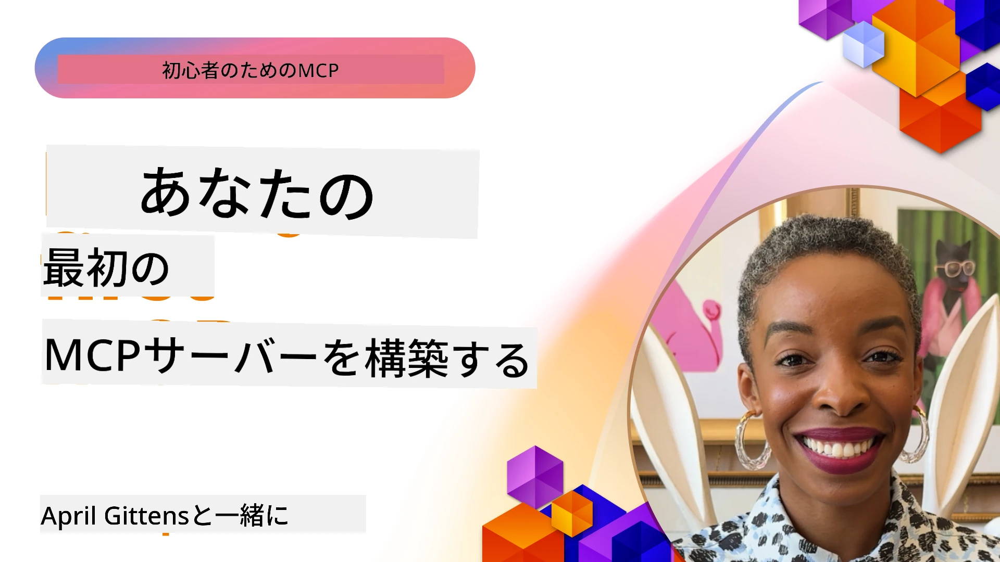

## はじめに  

_(上の画像をクリックするとこのレッスンのビデオが見られます)_

このセクションは複数のレッスンで構成されています:

- **1 Your first server**、最初のレッスンでは、最初のサーバーを作成し、サーバーのテストとデバッグに役立つ検査ツールで調査する方法を学びます、[レッスンへ](01-first-server/README.md)

- **2 Client**、このレッスンでは、サーバーに接続できるクライアントの書き方を学びます、[レッスンへ](02-client/README.md)

- **3 Client with LLM**、さらに良いクライアントの書き方として、LLMを追加し、サーバーと「交渉」して何をするかを決められるようにします、[レッスンへ](03-llm-client/README.md)

- **4 Consuming a server GitHub Copilot Agent mode in Visual Studio Code**。ここでは、Visual Studio Code内からMCPサーバーを実行する方法を見ます、[レッスンへ](04-vscode/README.md)

- **5 stdio Transport Server** stdioトランスポートは、ローカルMCPサーバーとクライアント間の通信に推奨される標準であり、組み込みのプロセス分離を備えた安全なサブプロセスベース通信を提供します、[レッスンへ](05-stdio-server/README.md)

- **6 HTTP Streaming with MCP (Streamable HTTP)**。最新のHTTPストリーミングトランスポート（[MCP Specification 2025-11-25](https://spec.modelcontextprotocol.io/specification/2025-11-25/basic/transports/#streamable-http) に基づくリモートMCPサーバーの推奨方法）、進捗通知、およびStreamable HTTPを使用してスケーラブルでリアルタイムなMCPサーバーとクライアントを実装する方法を学びます。 [レッスンへ](06-http-streaming/README.md)

- **7 Utilising AI Toolkit for VSCode** MCPクライアントとサーバーの利用とテスト方法、[レッスンへ](07-aitk/README.md)

- **8 Testing**。ここでは特に、さまざまな方法でサーバーとクライアントをテストする方法に焦点を当てます、[レッスンへ](08-testing/README.md)

- **9 Deployment**。この章では、MCPソリューションのデプロイ方法の異なる選択肢を検討します、[レッスンへ](09-deployment/README.md)

- **10 Advanced server usage**。この章は高度なサーバー使用法をカバーします、[レッスンへ](./10-advanced/README.md)

- **11 Auth**。この章はBasic AuthからJWTおよびRBACを用いた簡単な認証の追加方法を扱います。ここから始めて、第5章の高度なトピックと第2章の推奨によるセキュリティ強化も検討することを推奨します、[レッスンへ](./11-simple-auth/README.md)

- **12 MCP Hosts**。Claude Desktop、Cursor、Cline、Windsurfなどの人気MCPホストクライアントの設定と使用法。トランスポートタイプとトラブルシューティングについて学びます、[レッスンへ](./12-mcp-hosts/README.md)

- **13 MCP Inspector**。MCP Inspectorツールを使用してMCPサーバーを対話的にデバッグ・テストします。ツール、リソース、およびプロトコルメッセージのトラブルシューティングについて学びます、[レッスンへ](./13-mcp-inspector/README.md)

Model Context Protocol (MCP) は、アプリケーションがLLMにコンテキストを提供する方法を標準化したオープンプロトコルです。MCPをAIアプリケーション向けのUSB-Cポートのように考えてください—異なるデータソースやツールとAIモデルを接続する標準化された方法を提供します。

## 学習目標

このレッスンの終わりまでに、以下のことができるようになります:

- C#, Java, Python, TypeScript, JavaScriptでのMCP開発環境のセットアップ
- カスタム機能（リソース、プロンプト、ツール）を持つ基本的なMCPサーバーの構築とデプロイ
- MCPサーバーに接続するホストアプリケーションの作成
- MCP実装のテストとデバッグ
- 一般的なセットアップの課題とその解決策の理解
- MCP実装を人気のあるLLMサービスに接続する方法

## MCP環境のセットアップ

MCPの作業を始める前に、開発環境を準備し基本的なワークフローを理解することが重要です。このセクションは、MCPでスムーズに開始するための初期セットアップ手順を案内します。

### 必要条件

MCP開発に入る前に次を確認してください:

- **開発環境**: 選択した言語（C#, Java, Python, TypeScript, JavaScript）
- **IDE/エディター**: Visual Studio, Visual Studio Code, IntelliJ, Eclipse, PyCharm または任意の最新コードエディター
- **パッケージマネージャー**: NuGet, Maven/Gradle, pip, npm/yarn
- **APIキー**: ホストアプリケーションで使用予定のAIサービス用

### 公式SDK

今後の章ではPython、TypeScript、Java、.NETを使ったソリューションを示します。以下は公式にサポートされたすべてのSDKです。

MCPは複数の言語向けに公式SDKを提供しています（[MCP Specification 2025-11-25](https://spec.modelcontextprotocol.io/specification/2025-11-25/)に準拠）:
- [C# SDK](https://github.com/modelcontextprotocol/csharp-sdk) - Microsoftと共同で管理
- [Java SDK](https://github.com/modelcontextprotocol/java-sdk) - Spring AIと共同で管理
- [TypeScript SDK](https://github.com/modelcontextprotocol/typescript-sdk) - 公式TypeScript実装
- [Python SDK](https://github.com/modelcontextprotocol/python-sdk) - 公式Python実装（FastMCP）
- [Kotlin SDK](https://github.com/modelcontextprotocol/kotlin-sdk) - 公式Kotlin実装
- [Swift SDK](https://github.com/modelcontextprotocol/swift-sdk) - Loopwork AIと共同で管理
- [Rust SDK](https://github.com/modelcontextprotocol/rust-sdk) - 公式Rust実装
- [Go SDK](https://github.com/modelcontextprotocol/go-sdk) - 公式Go実装

## 主なポイント

- 言語別SDKを使うことでMCP開発環境のセットアップは簡単
- MCPサーバーの構築は明確なスキーマを持つツールの作成と登録を伴う
- MCPクライアントはサーバーやモデルに接続し拡張機能を利用する
- テストとデバッグは信頼性あるMCP実装には不可欠
- デプロイ選択肢はローカル開発からクラウドベースまで多岐にわたる

## 実践

このセクションの全章で紹介される演習を補完するサンプルセットがあります。さらに各章に独自の演習課題もあります。

- [Java Calculator](./samples/java/calculator/README.md)
- [.Net Calculator](../../../03-GettingStarted/samples/csharp)
- [JavaScript Calculator](./samples/javascript/README.md)
- [TypeScript Calculator](./samples/typescript/README.md)
- [Python Calculator](../../../03-GettingStarted/samples/python)

## 追加リソース

- [AzureでModel Context Protocolを使ってエージェントを構築する](https://learn.microsoft.com/azure/developer/ai/intro-agents-mcp)
- [Azure Container Appsを使ったリモートMCP (Node.js/TypeScript/JavaScript)](https://learn.microsoft.com/samples/azure-samples/mcp-container-ts/mcp-container-ts/)
- [.NET OpenAI MCP Agent](https://learn.microsoft.com/samples/azure-samples/openai-mcp-agent-dotnet/openai-mcp-agent-dotnet/)

## 次に進むには

最初のレッスンから始めましょう: [最初のMCPサーバーの作成](01-first-server/README.md)

このモジュールを終えたら、次は: [モジュール4: 実践的実装](../04-PracticalImplementation/README.md)

---

<!-- CO-OP TRANSLATOR DISCLAIMER START -->
**免責事項**：  
この文書はAI翻訳サービス「Co-op Translator」（https://github.com/Azure/co-op-translator）を使用して翻訳されています。正確性には努めておりますが、自動翻訳には誤りや不正確な部分が含まれる可能性があることをご了承ください。正確な情報については、原文の言語によるオリジナルの文書を正式な資料としてご参照ください。重要な内容については、専門の人間による翻訳を推奨します。本翻訳の利用により生じるいかなる誤解や解釈の相違についても、当方は一切責任を負いかねます。
<!-- CO-OP TRANSLATOR DISCLAIMER END -->