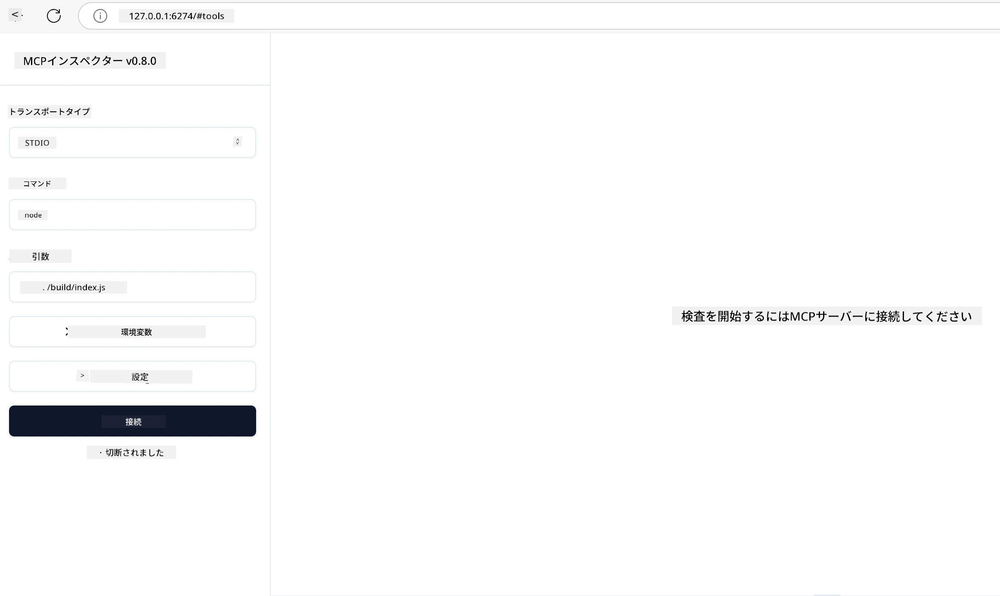

# 実践的な実装

[](https://youtu.be/vCN9-mKBDfQ)

_(上記の画像をクリックすると、このレッスンのビデオをご覧いただけます)_

実践的な実装は、Model Context Protocol（MCP）の力が具体的に感じられる場です。MCPの理論やアーキテクチャを理解することは重要ですが、これらの概念を用いて現実の問題を解決するソリューションを構築、テスト、デプロイすることで真の価値が生まれます。この章では、概念的な知識と実際の開発の橋渡しを行い、MCPベースのアプリケーションを現実に作り出すプロセスを案内します。

インテリジェントアシスタントの開発、ビジネスワークフローへのAI統合、またはデータ処理のためのカスタムツールの構築など、MCPは柔軟な基盤を提供します。言語非依存の設計と人気のプログラミング言語向けの公式SDKにより、さまざまな開発者にアクセス可能です。これらのSDKを活用することで、異なるプラットフォームや環境において迅速にプロトタイプを作成し、反復し、スケールさせることができます。

以下のセクションでは、C#、Java（Spring）、TypeScript、JavaScript、およびPythonでのMCP実装の実例、サンプルコード、デプロイ戦略を紹介します。また、MCPサーバーのデバッグやテスト、APIの管理、Azureを利用したクラウドへのデプロイ方法も学べます。これらの実践的リソースは、学習を加速し、堅牢で本番運用に耐えるMCPアプリケーションの構築に自信を持てるよう支援します。

## 概要

このレッスンでは、複数のプログラミング言語にわたるMCP実装の実践的側面に焦点を当てます。C#、Java（Spring）、TypeScript、JavaScript、PythonでMCP SDKを使用し、堅牢なアプリケーション構築、MCPサーバーのデバッグ・テスト、再利用可能なリソース、プロンプト、ツールの作成方法を探ります。

## 学習目標

このレッスンの終わりまでに、以下ができるようになります：

- 各種プログラミング言語の公式SDKを使用したMCPソリューションの実装
- MCPサーバーの体系的なデバッグおよびテスト
- サーバー機能（リソース、プロンプト、ツール）の作成・利用
- 複雑なタスクのための効果的なMCPワークフロー設計
- パフォーマンスと信頼性のためのMCP実装の最適化

## 公式SDKリソース

Model Context Protocolは複数言語向けの公式SDKを提供しています（[MCP Specification 2025-11-25](https://spec.modelcontextprotocol.io/specification/2025-11-25/)に準拠）：

- [C# SDK](https://github.com/modelcontextprotocol/csharp-sdk)
- [Java with Spring SDK](https://github.com/modelcontextprotocol/java-sdk) **注:** [Project Reactor](https://projectreactor.io)への依存が必要です。（[ディスカッションissue 246](https://github.com/orgs/modelcontextprotocol/discussions/246)参照）
- [TypeScript SDK](https://github.com/modelcontextprotocol/typescript-sdk)
- [Python SDK](https://github.com/modelcontextprotocol/python-sdk)
- [Kotlin SDK](https://github.com/modelcontextprotocol/kotlin-sdk)
- [Go SDK](https://github.com/modelcontextprotocol/go-sdk)

## MCP SDKの使い方

このセクションでは、複数言語におけるMCPの実践的な例を紹介します。`samples`ディレクトリに言語別に整理されたサンプルコードがあります。

### 利用可能なサンプル

リポジトリには次の言語の[サンプル実装](../../../04-PracticalImplementation/samples)が含まれています：

- [C#](./samples/csharp/README.md)
- [Java with Spring](./samples/java/containerapp/README.md)
- [TypeScript](./samples/typescript/README.md)
- [JavaScript](./samples/javascript/README.md)
- [Python](./samples/python/README.md)

各サンプルは、その言語とエコシステムに特化した重要なMCP概念と実装パターンを示しています。

### 実践ガイド

追加の実践的MCP実装ガイド：

- [ページネーションと大規模結果セット](./pagination/README.md) - ツール、リソース、大規模データセットのカーソルベースページネーションの扱い方

## コアサーバー機能

MCPサーバーは以下の機能のいずれかまたは組み合わせを実装できます。

### リソース

リソースはユーザーやAIモデルが利用できるコンテキストとデータを提供します：

- 文書リポジトリ
- ナレッジベース
- 構造化データソース
- ファイルシステム

### プロンプト

プロンプトはユーザー向けのテンプレート化されたメッセージやワークフローです：

- 事前定義された会話テンプレート
- ガイドされたインタラクションパターン
- 特殊な対話構造

### ツール

ツールはAIモデルが実行できる関数です：

- データ処理ユーティリティ
- 外部API統合
- 計算機能
- 検索機能

## サンプル実装：C#実装

公式のC# SDKリポジトリには、MCPのさまざまな側面を示すサンプル実装が複数含まれています：

- **基本的なMCPクライアント**：MCPクライアントの作成方法とツール呼び出しのシンプルな例
- **基本的なMCPサーバー**：基本的なツール登録を持つ最小限のサーバー実装
- **高度なMCPサーバー**：ツール登録、認証、エラーハンドリングを備えた完全機能のサーバー
- **ASP.NET統合**：ASP.NET Coreとの統合例
- **ツール実装パターン**：様々な複雑さのツール実装パターン

MCP C# SDKはプレビュー段階であり、APIは変更される可能性があります。SDKが進化するにつれて、このブログを継続的に更新します。

### 主な特徴

- [C# MCP Nuget ModelContextProtocol](https://www.nuget.org/packages/ModelContextProtocol)
- はじめての[MCPサーバー構築](https://devblogs.microsoft.com/dotnet/build-a-model-context-protocol-mcp-server-in-csharp/)

C#完全実装サンプルは、[公式C# SDKサンプルリポジトリ](https://github.com/modelcontextprotocol/csharp-sdk)をご覧ください

## サンプル実装：Java with Spring実装

Java with Spring SDKはエンタープライズグレードの機能を備えた堅牢なMCP実装オプションを提供します。

### 主な特徴

- Spring Frameworkとの統合
- 強力な型安全性
- リアクティブプログラミング対応
- 包括的なエラーハンドリング

完全なJava with Spring実装サンプルは、サンプルディレクトリの[Java with Springサンプル](samples/java/containerapp/README.md)をご覧ください。

## サンプル実装：JavaScript実装

JavaScript SDKは軽量で柔軟なMCP実装手法を提供します。

### 主な特徴

- Node.jsおよびブラウザ対応
- PromiseベースAPI
- Expressなどフレームワークとの簡単な統合
- ストリーミングのためのWebSocket対応

完全なJavaScript実装サンプルは、サンプルディレクトリの[JavaScriptサンプル](samples/javascript/README.md)をご覧ください。

## サンプル実装：Python実装

Python SDKはPython的なMCP実装と優れたMLフレームワーク統合を提供します。

### 主な特徴

- asyncioによるasync/awaitサポート
- FastAPI統合
- 簡単なツール登録
- 人気のMLライブラリとのネイティブ統合

完全なPython実装サンプルは、サンプルディレクトリの[Pythonサンプル](samples/python/README.md)をご覧ください。

## API管理

Azure API ManagementはMCPサーバーを安全に運用するための優れた方法です。考え方は、MCPサーバーの前にAzure API Managementインスタンスを配置し、以下のような望ましい機能を処理させることです：

- レートリミティング
- トークン管理
- 監視
- ロードバランシング
- セキュリティ

### Azureサンプル

まさにこれを行うAzureサンプル、すなわち[Azure API Managementで保護したMCPサーバーの作成](https://github.com/Azure-Samples/remote-mcp-apim-functions-python)があります。

下記画像で認証フローをご覧ください：


上図での流れ：

- Microsoft Entraを使用して認証／認可が行われます。
- Azure API Managementはゲートウェイとして機能し、ポリシーでトラフィックを誘導・管理します。
- Azure Monitorは分析のため全リクエストをログに記録します。

#### 認証フロー

認証フローをさらに詳しく見てみましょう：


#### MCP認証仕様

[MCP認証仕様](https://spec.modelcontextprotocol.io/specification/2025-11-25/basic/authorization/)の詳細はこちらをご覧ください。

## リモートMCPサーバーをAzureにデプロイ

先に挙げたサンプルをデプロイできるか見てみましょう：

1. リポジトリをクローン

    ```bash
    git clone https://github.com/Azure-Samples/remote-mcp-apim-functions-python.git
    cd remote-mcp-apim-functions-python
    ```

1. `Microsoft.App`リソースプロバイダを登録します。

   - Azure CLIを使う場合は`az provider register --namespace Microsoft.App --wait`を実行。
   - Azure PowerShellの場合は`Register-AzResourceProvider -ProviderNamespace Microsoft.App`を実行し、時間を置いてから`(Get-AzResourceProvider -ProviderNamespace Microsoft.App).RegistrationState`で登録状況を確認。

1. この[azd](https://aka.ms/azd)コマンドを実行しAPI Managementサービス、Function App（コード付き）、他の必要なAzureリソースをプロビジョニング

    ```shell
    azd up
    ```

    このコマンドで全てのAzureクラウドリソースがデプロイされます。

### MCP Inspectorでサーバーテスト

1. **新しいターミナルウィンドウ**でMCP Inspectorをインストール・実行

    ```shell
    npx @modelcontextprotocol/inspector
    ```

    以下のようなインターフェイスが表示されます：

    

1. アプリが表示するURL（例：[http://127.0.0.1:6274/#resources](http://127.0.0.1:6274/#resources)）のMCP Inspector WebアプリをCTRLクリックで開く
1. トランスポートタイプを`SSE`に設定
1. `azd up`後に表示される実行中のAPI Management SSEエンドポイントのURLを設定し、**接続**：

    ```shell
    https://<apim-servicename-from-azd-output>.azure-api.net/mcp/sse
    ```

1. **ツール一覧表示**。ツールをクリックして**実行**。

すべての手順が正しく進めば、MCPサーバーに接続され、ツールを呼び出すことができています。

## Azure向けMCPサーバー

[Remote-mcp-functions](https://github.com/Azure-Samples/remote-mcp-functions-dotnet)：これはAzure Functionsを用いてPython、C# .NET、Node/TypeScriptでカスタムリモートMCP（Model Context Protocol）サーバーを構築・デプロイするためのクイックスタートテンプレートセットです。

このサンプルは次を可能にする完全なソリューションを提供します：

- ローカルビルド・実行：ローカルマシンでMCPサーバーを開発・デバッグ
- Azureへのデプロイ：単純なazd upコマンドでクラウドへ簡単にデプロイ
- クライアントからの接続：VS CodeのCopilotエージェントモードやMCP Inspectorツールを含む様々なクライアントからMCPサーバーに接続

### 主な特徴

- セキュリティ設計：鍵とHTTPSで保護されたMCPサーバー
- 認証オプション：組み込み認証やAPI Managementを使用したOAuthをサポート
- ネットワーク分離：Azure Virtual Networks（VNET）によるネットワーク分離を可能に
- サーバーレスアーキテクチャ：Azure Functionsによるスケーラブル且つイベント駆動の実行
- ローカル開発：包括的なローカル開発およびデバッグサポート
- シンプルなデプロイ：Azureへのスムーズなデプロイプロセス

このリポジトリには、本番運用可能なMCPサーバー実装を迅速に開始するための全設定ファイル、ソースコード、インフラ定義が含まれています。

- [Azure Remote MCP Functions Python](https://github.com/Azure-Samples/remote-mcp-functions-python) - Azure Functionsを用いたPythonでのMCP実装サンプル
- [Azure Remote MCP Functions .NET](https://github.com/Azure-Samples/remote-mcp-functions-dotnet) - Azure Functionsを用いたC# .NETでのMCP実装サンプル
- [Azure Remote MCP Functions Node/Typescript](https://github.com/Azure-Samples/remote-mcp-functions-typescript) - Azure Functionsを用いたNode/TypeScriptでのMCP実装サンプル

## 重要ポイント

- MCP SDKは堅牢なMCPソリューション実装のための言語固有ツールを提供
- デバッグとテストは信頼性の高いMCPアプリケーションに不可欠
- 再利用可能なプロンプトテンプレートは一貫したAIインタラクションを可能にする
- よく設計されたワークフローは複数のツールを使った複雑なタスクを調整する
- MCP実装にはセキュリティ、パフォーマンス、エラーハンドリングの考慮が必要

## 演習

あなたのドメインの現実的な問題を解決する実用的なMCPワークフローを設計してください：

1. この問題を解決するのに有用な3～4つのツールを特定する
2. これらのツールがどのように連携するかを示すワークフローダイアグラムを作成する
3. 好みの言語でツールの基本バージョンを実装する
4. モデルがツールを効果的に使うためのプロンプトテンプレートを作成する

## 追加リソース

---

## 次に進む

次へ: [高度なトピック](../05-AdvancedTopics/README.md)

---

<!-- CO-OP TRANSLATOR DISCLAIMER START -->
**免責事項**：  
本書類はAI翻訳サービス「Co-op Translator」（https://github.com/Azure/co-op-translator）を利用して翻訳されています。正確性には努めておりますが、自動翻訳には誤りや不正確な部分が含まれる可能性があることをご理解ください。原文の言語による文書が正式な情報源とみなされます。重要な情報については、専門の翻訳者による翻訳を推奨いたします。本翻訳の利用により生じたいかなる誤解や誤訳に関しても、当方は責任を負いかねます。
<!-- CO-OP TRANSLATOR DISCLAIMER END -->