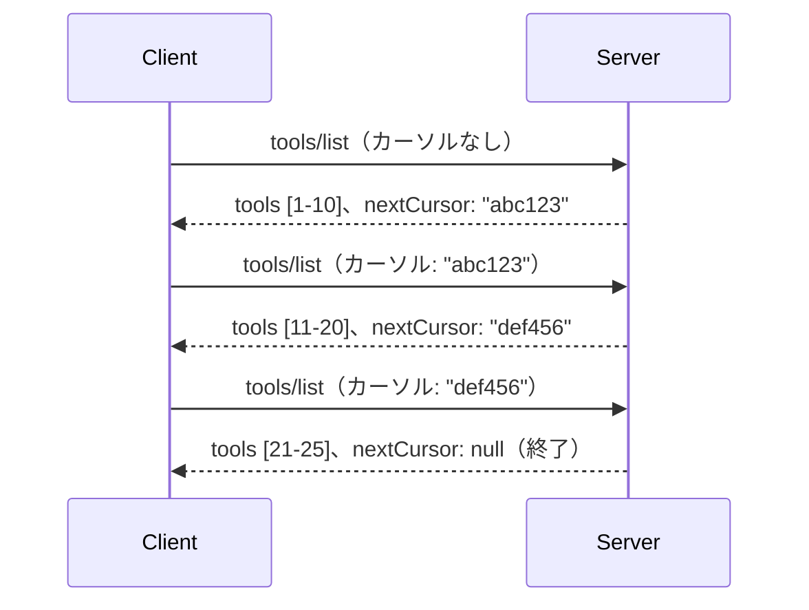

# MCPにおけるページネーションと大規模結果セット

MCPサーバーが数千件のファイル、データベースレコード、検索結果などの大規模データセットを扱う際には、メモリを効率的に管理し、応答性の高いユーザー体験を提供するためにページネーションが必要です。このガイドでは、MCPでのページネーションの実装および使用方法について説明します。

## なぜページネーションが重要か

ページネーションがないと、大規模なレスポンスは以下の問題を引き起こす可能性があります：

- **メモリ枯渇** - 数百万のレコードを一度に読み込む
- **遅い応答時間** - 全データの読み込みをユーザーが待つ
- **タイムアウトエラー** - リクエストがタイムアウト制限を超える
- **AIパフォーマンス低下** - 大規模なコンテキストでLLMの処理が困難になる

MCPは結果セットの確実で一貫したページングのために、**カーソルベースのページネーション**を使用しています。

---

## MCPのページネーションの仕組み

### カーソルの概念

**カーソル**は、結果セット内の位置を示す不透明な文字列です。長い本のブックマークのようなものと考えてください。


### MCPメソッドのページネーション

これらのMCPメソッドはページネーションに対応しています：

| メソッド | 返されるもの | カーソル対応 |
|--------|---------|----------------|
| `tools/list` | ツール定義 | ✅ |
| `resources/list` | リソース定義 | ✅ |
| `prompts/list` | プロンプト定義 | ✅ |
| `resources/templates/list` | リソーステンプレート | ✅ |

---

## サーバー実装

### Python (FastMCP)

```python
from mcp.server import Server
from mcp.types import Tool, ListToolsResult
import math

app = Server("paginated-server")

# シミュレートされた大規模データセット
ALL_TOOLS = [
    Tool(name=f"tool_{i}", description=f"Tool number {i}", inputSchema={})
    for i in range(100)
]

PAGE_SIZE = 10

@app.list_tools()
async def list_tools(cursor: str | None = None) -> ListToolsResult:
    """List tools with pagination support."""
    
    # 開始インデックスを取得するためにカーソルをデコードする
    start_index = 0
    if cursor:
        try:
            start_index = int(cursor)
        except ValueError:
            start_index = 0
    
    # 結果のページを取得する
    end_index = min(start_index + PAGE_SIZE, len(ALL_TOOLS))
    page_tools = ALL_TOOLS[start_index:end_index]
    
    # 次のカーソルを計算する
    next_cursor = None
    if end_index < len(ALL_TOOLS):
        next_cursor = str(end_index)
    
    return ListToolsResult(
        tools=page_tools,
        nextCursor=next_cursor
    )
```

### TypeScript

```typescript
import { Server } from "@modelcontextprotocol/sdk/server/index.js";
import { ListToolsResultSchema } from "@modelcontextprotocol/sdk/types.js";

const server = new Server({
  name: "paginated-server",
  version: "1.0.0"
});

// シミュレートされた大規模データセット
const ALL_TOOLS = Array.from({ length: 100 }, (_, i) => ({
  name: `tool_${i}`,
  description: `Tool number ${i}`,
  inputSchema: { type: "object", properties: {} }
}));

const PAGE_SIZE = 10;

server.setRequestHandler(ListToolsResultSchema, async (request) => {
  // カーソルをデコードする
  let startIndex = 0;
  if (request.params?.cursor) {
    startIndex = parseInt(request.params.cursor, 10) || 0;
  }
  
  // 結果のページを取得する
  const endIndex = Math.min(startIndex + PAGE_SIZE, ALL_TOOLS.length);
  const pageTools = ALL_TOOLS.slice(startIndex, endIndex);
  
  // 次のカーソルを計算する
  const nextCursor = endIndex < ALL_TOOLS.length ? String(endIndex) : undefined;
  
  return {
    tools: pageTools,
    nextCursor
  };
});
```

### Java (Spring MCP)

```java
@Service
public class PaginatedToolService {
    
    private static final int PAGE_SIZE = 10;
    private final List<Tool> allTools;
    
    public PaginatedToolService() {
        // 大規模データセットを初期化する
        this.allTools = IntStream.range(0, 100)
            .mapToObj(i -> new Tool("tool_" + i, "Tool number " + i, Map.of()))
            .collect(Collectors.toList());
    }
    
    @McpMethod("tools/list")
    public ListToolsResult listTools(@Param("cursor") String cursor) {
        // カーソルをデコードする
        int startIndex = 0;
        if (cursor != null && !cursor.isEmpty()) {
            try {
                startIndex = Integer.parseInt(cursor);
            } catch (NumberFormatException e) {
                startIndex = 0;
            }
        }
        
        // 結果のページを取得する
        int endIndex = Math.min(startIndex + PAGE_SIZE, allTools.size());
        List<Tool> pageTools = allTools.subList(startIndex, endIndex);
        
        // 次のカーソルを計算する
        String nextCursor = endIndex < allTools.size() ? String.valueOf(endIndex) : null;
        
        return new ListToolsResult(pageTools, nextCursor);
    }
}
```

---

## クライアント実装

### Pythonクライアント

```python
from mcp import ClientSession

async def get_all_tools(session: ClientSession) -> list:
    """Fetch all tools using pagination."""
    all_tools = []
    cursor = None
    
    while True:
        result = await session.list_tools(cursor=cursor)
        all_tools.extend(result.tools)
        
        if result.nextCursor is None:
            break
        cursor = result.nextCursor
    
    return all_tools

# 使用法
async with client_session as session:
    tools = await get_all_tools(session)
    print(f"Found {len(tools)} tools")
```

### TypeScriptクライアント

```typescript
import { Client } from "@modelcontextprotocol/sdk/client/index.js";

async function getAllTools(client: Client): Promise<Tool[]> {
  const allTools: Tool[] = [];
  let cursor: string | undefined = undefined;
  
  do {
    const result = await client.listTools({ cursor });
    allTools.push(...result.tools);
    cursor = result.nextCursor;
  } while (cursor);
  
  return allTools;
}

// 使用法
const tools = await getAllTools(client);
console.log(`Found ${tools.length} tools`);
```

### レイジーローディングパターン

非常に大きなデータセットの場合、ページを必要に応じて読み込みます：

```python
class PaginatedToolIterator:
    """Lazily iterate through paginated tools."""
    
    def __init__(self, session: ClientSession):
        self.session = session
        self.cursor = None
        self.buffer = []
        self.exhausted = False
    
    async def __anext__(self):
        # バッファが利用可能な場合はそこから返す
        if self.buffer:
            return self.buffer.pop(0)
        
        # 全てのページを使い果たしたかチェックする
        if self.exhausted:
            raise StopAsyncIteration
        
        # 次のページを取得する
        result = await self.session.list_tools(cursor=self.cursor)
        self.buffer = list(result.tools)
        self.cursor = result.nextCursor
        
        if self.cursor is None:
            self.exhausted = True
        
        if not self.buffer:
            raise StopAsyncIteration
        
        return self.buffer.pop(0)
    
    def __aiter__(self):
        return self

# 使用例 - 大規模データセットに対してメモリ効率が良い
async for tool in PaginatedToolIterator(session):
    process_tool(tool)
```

---

## リソースのページネーション

リソースはディレクトリや大規模データセットでページネーションが必要です：

```python
from mcp.server import Server
from mcp.types import Resource, ListResourcesResult
import os

app = Server("file-server")

@app.list_resources()
async def list_resources(cursor: str | None = None) -> ListResourcesResult:
    """List files in directory with pagination."""
    
    directory = "/data/files"
    all_files = sorted(os.listdir(directory))
    
    # カーソルをデコードする（ファイルインデックス）
    start_index = int(cursor) if cursor else 0
    page_size = 20
    end_index = min(start_index + page_size, len(all_files))
    
    # このページのリソースリストを作成する
    resources = []
    for filename in all_files[start_index:end_index]:
        filepath = os.path.join(directory, filename)
        resources.append(Resource(
            uri=f"file://{filepath}",
            name=filename,
            mimeType="application/octet-stream"
        ))
    
    # 次のカーソルを計算する
    next_cursor = str(end_index) if end_index < len(all_files) else None
    
    return ListResourcesResult(
        resources=resources,
        nextCursor=next_cursor
    )
```

---

## カーソル設計の戦略

### 戦略1：インデックスベース（シンプル）

```python
# カーソルは単にインデックスです
cursor = "50"  # アイテム50から開始する
```

**利点:** シンプルでステートレス  
**欠点:** アイテムの追加・削除で結果がずれることがある

### 戦略2：IDベース（安定）

```python
# カーソルは最後に見たIDです
cursor = "item_abc123"  # この項目の後から開始します
```

**利点:** アイテムの変化があっても安定  
**欠点:** 順序付けられたIDが必要

### 戦略3：エンコードされた状態（複雑）

```python
import base64
import json

def encode_cursor(state: dict) -> str:
    return base64.b64encode(json.dumps(state).encode()).decode()

def decode_cursor(cursor: str) -> dict:
    return json.loads(base64.b64decode(cursor).decode())

# カーソルには複数の状態フィールドが含まれています
cursor = encode_cursor({
    "offset": 50,
    "filter": "active",
    "sort": "name"
})
```

**利点:** 複雑な状態をエンコード可能  
**欠点:** より複雑でカーソル文字列が大きくなる

---

## ベストプラクティス

### 1. 適切なページサイズを選択する

```python
# データサイズを考慮してください
PAGE_SIZE_SMALL_ITEMS = 100   # シンプルなメタデータ
PAGE_SIZE_MEDIUM_ITEMS = 20   # より豊かなオブジェクト
PAGE_SIZE_LARGE_ITEMS = 5     # 複雑なコンテンツ
```

### 2. 無効なカーソルに対処する

```python
@app.list_tools()
async def list_tools(cursor: str | None = None) -> ListToolsResult:
    try:
        start_index = int(cursor) if cursor else 0
        if start_index < 0 or start_index >= len(ALL_TOOLS):
            start_index = 0  # 最初にリセット
    except (ValueError, TypeError):
        start_index = 0  # 無効なカーソル、新たに開始
    # ...
```

### 3. 合計件数を含める（任意）

```python
return ListToolsResult(
    tools=page_tools,
    nextCursor=next_cursor,
    # 一部の実装にはUIの進行状況の合計が含まれています
    _meta={"total": len(ALL_TOOLS)}
)
```

### 4. エッジケースをテストする

```python
async def test_pagination():
    # 空の結果セット
    result = await session.list_tools()
    assert result.tools == []
    assert result.nextCursor is None
    
    # 単一ページ
    result = await session.list_tools()
    assert len(result.tools) <= PAGE_SIZE
    
    # 無効なカーソル
    result = await session.list_tools(cursor="invalid")
    assert result.tools  # 最初のページを返すべきです
```

---

## よくある落とし穴

### ❌ 全ての結果を返してからクライアント側でページネーションする

```python
# 悪い：すべてをメモリに読み込む
@app.list_tools()
async def list_tools() -> ListToolsResult:
    all_tools = load_all_tools()  # 100万のツール！
    return ListToolsResult(tools=all_tools)
```

### ✅ データソース側でページネーションする

```python
# 良い: 必要なものだけを読み込む
@app.list_tools()
async def list_tools(cursor: str | None = None) -> ListToolsResult:
    offset = int(cursor) if cursor else 0
    tools = await db.query_tools(offset=offset, limit=PAGE_SIZE)
    return ListToolsResult(tools=tools, nextCursor=...)
```

---

## 次に読むべきもの

- [モジュール 5.14 - コンテキストエンジニアリング](../../05-AdvancedTopics/mcp-contextengineering/README.md)
- [モジュール 8 - ベストプラクティス](../../08-BestPractices/README.md)
- [3.8 - MCPサーバのテスト](../../03-GettingStarted/08-testing/README.md)

---

## 追加リソース

- [MCP仕様 - ページネーション](https://spec.modelcontextprotocol.io/specification/2025-11-25/)
- [カーソルベースページネーションの解説](https://slack.engineering/evolving-api-pagination-at-slack/)
- [Python SDK ページネーションテスト](https://github.com/modelcontextprotocol/python-sdk/blob/main/tests/client/test_list_methods_cursor.py)

---

<!-- CO-OP TRANSLATOR DISCLAIMER START -->
**免責事項**：  
本書類はAI翻訳サービス「Co-op Translator」（https://github.com/Azure/co-op-translator）を使用して翻訳されました。正確性の確保に努めておりますが、自動翻訳には誤りや不正確な部分が含まれる可能性があります。原文の言語による文書が正式な情報源として扱われるべきです。重要な情報については、専門の人間による翻訳を推奨します。本翻訳の使用により生じたいかなる誤解や解釈の相違についても、当方は一切の責任を負いかねます。
<!-- CO-OP TRANSLATOR DISCLAIMER END -->