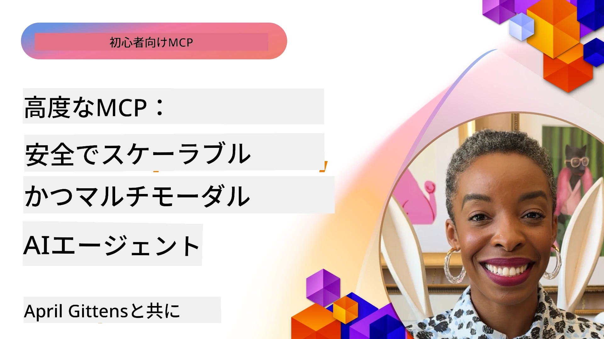

# MCPの高度なトピック

_(上の画像をクリックすると、このレッスンのビデオが表示されます)_

本章では、モデルコンテキストプロトコル（MCP）実装における一連の高度なトピックを扱います。マルチモーダル統合、スケーラビリティ、安全性のベストプラクティス、エンタープライズ統合が含まれます。これらのトピックは、現代のAIシステムの要求に応えられる堅牢で本番対応のMCPアプリケーションを構築するために非常に重要です。

## 概要

本レッスンでは、モデルコンテキストプロトコルの実装における高度な概念について探ります。マルチモーダル統合、スケーラビリティ、安全性のベストプラクティス、エンタープライズ統合に焦点を当てています。これらのトピックは、エンタープライズ環境での複雑な要件に対応できる本番グレードのMCPアプリケーションを構築するために不可欠です。

## 学習目標

本レッスンの終了時には、以下ができるようになります：

- MCPフレームワーク内でのマルチモーダル機能の実装
- 高負荷シナリオに対応するスケーラブルなMCPアーキテクチャの設計
- MCPのセキュリティ原則に沿った安全性のベストプラクティスの適用
- MCPとエンタープライズAIシステムおよびフレームワークとの統合
- 本番環境でのパフォーマンスと信頼性の最適化

## レッスンとサンプルプロジェクト

| Link | タイトル | 説明 |
|------|---------|------|
| [5.1 Integration with Azure](./mcp-integration/README.md) | Azureとの統合 | Azure上でMCPサーバーを統合する方法を学びます |
| [5.2 Multi modal sample](./mcp-multi-modality/README.md) | MCPマルチモーダルサンプル | 音声、画像、マルチモーダル応答のサンプル |
| [5.3 MCP OAuth2 sample](../../../05-AdvancedTopics/mcp-oauth2-demo) | MCP OAuth2デモ | AuthorizationおよびResource ServerとしてのOAuth2を示す最小限のSpring Bootアプリ。セキュアなトークン発行、保護されたエンドポイント、Azure Container Appsのデプロイ、およびAPI管理統合を実演。 |
| [5.4 Root Contexts](./mcp-root-contexts/README.md) | ルートコンテキスト | ルートコンテキストについて詳しく学び、その実装方法を理解する |
| [5.5 Routing](./mcp-routing/README.md) | ルーティング | さまざまなルーティングの種類について学びます |
| [5.6 Sampling](./mcp-sampling/README.md) | サンプリング | サンプリングの操作方法を学びます |
| [5.7 Scaling](./mcp-scaling/README.md) | スケーリング | スケーリングについて学びます |
| [5.8 Security](./mcp-security/README.md) | セキュリティ | MCPサーバーを安全に保護する方法 |
| [5.9 Web Search sample](./web-search-mcp/README.md) | ウェブ検索MCP | SerpAPIと統合したPython MCPサーバーとクライアントで、リアルタイムのウェブ、ニュース、製品検索、Q&Aを実現。マルチツールオーケストレーション、外部API統合、および堅牢なエラーハンドリングを実演。 |
| [5.10 Realtime Streaming](./mcp-realtimestreaming/README.md) | ストリーミング | データ駆動の現代において、企業やアプリケーションが即時の情報アクセスを必要とするリアルタイムのデータストリーミングの重要性を解説。 |
| [5.11 Realtime Web Search](./mcp-realtimesearch/README.md) | ウェブ検索 | AIモデル、検索エンジン、アプリケーション間でのコンテキスト管理を標準化するアプローチを提供することで、リアルタイムウェブ検索を変革するMCPの仕組みを解説。 |
| [5.12  Entra ID Authentication for Model Context Protocol Servers](./mcp-security-entra/README.md) | Entra ID認証 | Microsoft Entra IDは強力なクラウドベースのIDおよびアクセス管理ソリューションを提供し、認可されたユーザーおよびアプリだけがMCPサーバーと対話できるように支援。 |
| [5.13 Azure AI Foundry Agent Integration](./mcp-foundry-agent-integration/README.md) | Azure AI Foundry統合 | MCPサーバーをAzure AI Foundryエージェントと統合し、パワフルなツールオーケストレーションとエンタープライズAI機能を標準化された外部データソース接続で実現する方法を学びます。 |
| [5.14 Context Engineering](./mcp-contextengineering/README.md) | コンテキストエンジニアリング | MCPサーバーにおけるコンテキスト最適化、動的コンテキスト管理、効果的なプロンプトエンジニアリング戦略を含むコンテキストエンジニアリング技術の将来展望。 |
| [5.15 MCP Custom Transport](./mcp-transport/README.md) | カスタムトランスポート | 専門的なMCP通信シナリオ向けにカスタムトランスポート機構を実装する方法を学びます。 |
| [5.16 Protocol Features Deep Dive](./mcp-protocol-features/README.md) | プロトコル機能 | 進捗通知、リクエストキャンセル、リソーステンプレート、エラーハンドリングパターンなど、高度なプロトコル機能を習得します。 |

> **MCP仕様 2025-11-25版の新機能**: 仕様は現在、**タスク**（進捗追跡付きの長時間実行操作）、**ツール注釈**（安全性のためのツールの動作に関するメタデータ）、**URLモードエリシテーション**（クライアントから特定のURLコンテンツを要求）、および強化された**ルート**（ワークスペースコンテキスト管理）を実験的にサポートしています。詳細は[MCP仕様の変更履歴](https://spec.modelcontextprotocol.io/)をご覧ください。

## 追加の参考資料

高度なMCPトピックの最新情報については、以下を参照してください：
- [MCPドキュメント](https://modelcontextprotocol.io/)
- [MCP仕様書（2025-11-25）](https://spec.modelcontextprotocol.io/specification/2025-11-25/)
- [GitHubリポジトリ](https://github.com/modelcontextprotocol)
- [OWASP MCPトップ10](https://microsoft.github.io/mcp-azure-security-guide/mcp/) - セキュリティリスクと対策
- [MCPセキュリティサミットワークショップ（Sherpa）](https://azure-samples.github.io/sherpa/) - 実践的なセキュリティトレーニング

## 重要なポイント

- マルチモーダルMCP実装はテキスト処理を超えたAI機能を拡張
- スケーラビリティはエンタープライズ展開に不可欠で、水平方向・垂直方向のスケールで対策可能
- 包括的なセキュリティ対策がデータ保護と適切なアクセス制御を保証
- Azure OpenAIやMicrosoft AI Foundryなどのプラットフォームとのエンタープライズ統合がMCP機能を強化
- 高度なMCP実装は最適化されたアーキテクチャと慎重なリソース管理から恩恵を受ける

## 演習

特定のユースケースに対するエンタープライズグレードのMCP実装を設計してください：

1. ユースケースに必要なマルチモーダル要件を特定する
2. 機密データを保護するためのセキュリティ制御を概説する
3. 変動する負荷に対応可能なスケーラブルなアーキテクチャを設計する
4. エンタープライズAIシステムとの統合ポイントを計画する
5. 潜在的なパフォーマンスのボトルネックと軽減策を文書化する

## 追加リソース

- [Azure OpenAIドキュメント](https://learn.microsoft.com/en-us/azure/ai-services/openai/)
- [Microsoft AI Foundryドキュメント](https://learn.microsoft.com/en-us/ai-services/)

---

## 次に進むには

このモジュールのレッスンを [5.1 MCP Integration](./mcp-integration/README.md) から始めましょう。

モジュールを完了したら、次へ進みます: [モジュール6：コミュニティ貢献](../06-CommunityContributions/README.md)

---

<!-- CO-OP TRANSLATOR DISCLAIMER START -->
**免責事項**：
本書類はAI翻訳サービス「Co-op Translator」（https://github.com/Azure/co-op-translator）を使用して翻訳されています。正確性には努めておりますが、自動翻訳には誤りや不正確な点が含まれる可能性があります。原文の言語によるオリジナル文書が正式な情報源とみなされるべきです。重要な情報については、専門の人間による翻訳を推奨します。本翻訳の利用によって生じる誤解や誤訳について当方は一切の責任を負いかねます。
<!-- CO-OP TRANSLATOR DISCLAIMER END -->