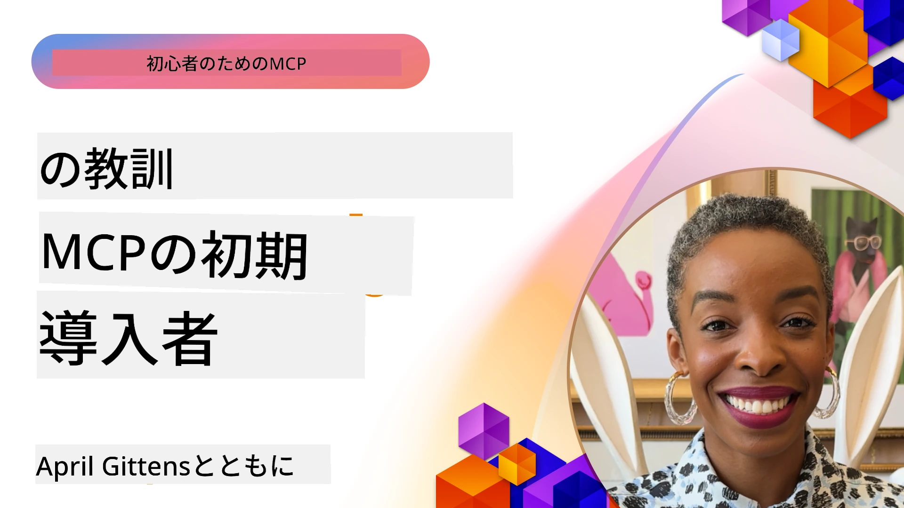

# 🌟 先行導入者からの教訓

[](https://youtu.be/jds7dSmNptE)

_（上の画像をクリックするとこのレッスンのビデオを視聴できます）_

## 🎯 このモジュールの内容

このモジュールでは、実際の組織や開発者がModel Context Protocol（MCP）を活用して実際の課題を解決し、イノベーションを推進している方法を探ります。詳細なケーススタディ、実践的なプロジェクト、具体的な例を通じて、MCPが言語モデル、ツール、企業データをつなぐ、安全でスケーラブルなAI統合をどのように可能にしているかを発見します。

### 📚 MCPの実例をみる

これらの原則が実稼働ツールにどのように適用されているかを見たいですか？こちらの[**開発者生産性を変革する10のMicrosoft MCPサーバー**](microsoft-mcp-servers.md)をご覧ください。今日から利用可能な実際のMicrosoft MCPサーバーが紹介されています。

## 概要

このレッスンでは、先行導入者がModel Context Protocol（MCP）を活用して実世界の課題を解決し、業界全体でイノベーションを推進してきた方法を探ります。詳細なケーススタディと実践的なプロジェクトを通じて、MCPが大規模言語モデル、ツール、企業データを統合した標準化され安全でスケーラブルなAI統合をどのように実現しているかをご覧いただけます。MCPベースのソリューションの設計と構築について実践的な経験を積み、実証済みの実装パターンから学び、実運用環境でのMCP展開におけるベストプラクティスを発見します。このレッスンはまた、新興トレンド、将来の方向性、オープンソースのリソースを強調し、MCP技術とその進化し続けるエコシステムの最前線に立ち続ける手助けをします。

## 学習目標

- さまざまな業界における実世界のMCP実装を分析する  
- 完全なMCPベースのアプリケーションを設計・構築する  
- MCP技術の新興トレンドと将来の方向性を探る  
- 実際の開発シナリオでベストプラクティスを適用する

## 実世界のMCP実装

### ケーススタディ 1: 企業向けカスタマーサポート自動化

多国籍企業は、カスタマーサポートシステム全体でAIインタラクションを標準化するためにMCPベースのソリューションを導入しました。これにより以下を可能にしました：

- 複数のLLMプロバイダー向けの統一インターフェイスを作成
- 部門間で一貫したプロンプト管理を維持
- 強固なセキュリティおよびコンプライアンス制御を実装
- 特定のニーズに基づいて異なるAIモデル間の容易な切り替え

**技術的実装：**

```python
# カスタマーサポートのためのPython MCPサーバー実装
import logging
import asyncio
from modelcontextprotocol import create_server, ServerConfig
from modelcontextprotocol.server import MCPServer
from modelcontextprotocol.transports import create_http_transport
from modelcontextprotocol.resources import ResourceDefinition
from modelcontextprotocol.prompts import PromptDefinition
from modelcontextprotocol.tool import ToolDefinition

# ロギングを設定する
logging.basicConfig(level=logging.INFO)

async def main():
    # サーバー構成を作成する
    config = ServerConfig(
        name="Enterprise Customer Support Server",
        version="1.0.0",
        description="MCP server for handling customer support inquiries"
    )
    
    # MCPサーバーを初期化する
    server = create_server(config)
    
    # ナレッジベースリソースを登録する
    server.resources.register(
        ResourceDefinition(
            name="customer_kb",
            description="Customer knowledge base documentation"
        ),
        lambda params: get_customer_documentation(params)
    )
    
    # プロンプトテンプレートを登録する
    server.prompts.register(
        PromptDefinition(
            name="support_template",
            description="Templates for customer support responses"
        ),
        lambda params: get_support_templates(params)
    )
    
    # サポートツールを登録する
    server.tools.register(
        ToolDefinition(
            name="ticketing",
            description="Create and update support tickets"
        ),
        handle_ticketing_operations
    )
    
    # HTTPトランスポートでサーバーを起動する
    transport = create_http_transport(port=8080)
    await server.run(transport)

if __name__ == "__main__":
    asyncio.run(main())
```
  
**結果：** モデルコストを30％削減、応答の一貫性を45％向上、グローバル運用におけるコンプライアンスも強化。

### ケーススタディ 2: 医療診断アシスタント

医療機関は、複数の専門的な医療AIモデルを統合しつつ、機微な患者データを保護するMCPインフラを開発しました：

- 一般医療モデルと専門医療モデル間のシームレスな切り替え  
- 厳格なプライバシー制御と監査ログ  
- 既存の電子健康記録（EHR）システムとの統合  
- 医療用語に合わせた一貫したプロンプト設計

**技術的実装：**

```csharp
// C# MCP host application implementation in healthcare application
using Microsoft.Extensions.DependencyInjection;
using ModelContextProtocol.SDK.Client;
using ModelContextProtocol.SDK.Security;
using ModelContextProtocol.SDK.Resources;

public class DiagnosticAssistant
{
    private readonly MCPHostClient _mcpClient;
    private readonly PatientContext _patientContext;
    
    public DiagnosticAssistant(PatientContext patientContext)
    {
        _patientContext = patientContext;
        
        // Configure MCP client with healthcare-specific settings
        var clientOptions = new ClientOptions
        {
            Name = "Healthcare Diagnostic Assistant",
            Version = "1.0.0",
            Security = new SecurityOptions
            {
                Encryption = EncryptionLevel.Medical,
                AuditEnabled = true
            }
        };
        
        _mcpClient = new MCPHostClientBuilder()
            .WithOptions(clientOptions)
            .WithTransport(new HttpTransport("https://healthcare-mcp.example.org"))
            .WithAuthentication(new HIPAACompliantAuthProvider())
            .Build();
    }
    
    public async Task<DiagnosticSuggestion> GetDiagnosticAssistance(
        string symptoms, string patientHistory)
    {
        // Create request with appropriate resources and tool access
        var resourceRequest = new ResourceRequest
        {
            Name = "patient_records",
            Parameters = new Dictionary<string, object>
            {
                ["patientId"] = _patientContext.PatientId,
                ["requestingProvider"] = _patientContext.ProviderId
            }
        };
        
        // Request diagnostic assistance using appropriate prompt
        var response = await _mcpClient.SendPromptRequestAsync(
            promptName: "diagnostic_assistance",
            parameters: new Dictionary<string, object>
            {
                ["symptoms"] = symptoms,
                patientHistory = patientHistory,
                relevantGuidelines = _patientContext.GetRelevantGuidelines()
            });
            
        return DiagnosticSuggestion.FromMCPResponse(response);
    }
}
```
  
**結果：** 医師の診断支援が向上しつつ、完全なHIPAA準拠を維持。システム間の文脈切替も大幅削減。

### ケーススタディ 3: 金融サービスのリスク分析

金融機関は、部門横断的なリスク分析プロセスの標準化のためにMCPを導入しました：

- クレジットリスク、詐欺検出、投資リスクモデル向けの統一インターフェイスを作成  
- 厳格なアクセス制御とモデルバージョニングを実装  
- すべてのAI推奨の監査可能性を確保  
- 多様なシステム間で一貫したデータフォーマットを維持

**技術的実装：**

```java
// 金融リスク評価のためのJava MCPサーバー
import org.mcp.server.*;
import org.mcp.security.*;

public class FinancialRiskMCPServer {
    public static void main(String[] args) {
        // 金融コンプライアンス機能を備えたMCPサーバーを作成する
        MCPServer server = new MCPServerBuilder()
            .withModelProviders(
                new ModelProvider("risk-assessment-primary", new AzureOpenAIProvider()),
                new ModelProvider("risk-assessment-audit", new LocalLlamaProvider())
            )
            .withPromptTemplateDirectory("./compliance/templates")
            .withAccessControls(new SOCCompliantAccessControl())
            .withDataEncryption(EncryptionStandard.FINANCIAL_GRADE)
            .withVersionControl(true)
            .withAuditLogging(new DatabaseAuditLogger())
            .build();
            
        server.addRequestValidator(new FinancialDataValidator());
        server.addResponseFilter(new PII_RedactionFilter());
        
        server.start(9000);
        
        System.out.println("Financial Risk MCP Server running on port 9000");
    }
}
```
  
**結果：** 規制遵守を強化、モデルのデプロイサイクルを40％高速化、部門間のリスク評価の一貫性を改善。

### ケーススタディ 4: Microsoft Playwright MCPサーバーによるブラウザ自動化

MicrosoftはModel Context Protocolを通じて安全かつ標準化されたブラウザ自動化を可能にする[Playwright MCPサーバー](https://github.com/microsoft/playwright-mcp)を開発しました。この実稼働サーバーは、AIエージェントとLLMが制御された監査可能で拡張可能な方法でWebブラウザと対話できるようにし、自動ウェブテスト、データ抽出、エンドツーエンドのワークフローなどのユースケースを実現します。

> **🎯 実稼働ツール**  
> このケーススタディは、今日から使える本物のMCPサーバーを紹介します！Playwright MCPサーバーと他9つの実稼働Microsoft MCPサーバーの詳細は[**Microsoft MCPサーバーガイド**](microsoft-mcp-servers.md#8--playwright-mcp-server)をご覧ください。

**主な特徴：**  
- ブラウザナビゲーション、フォーム入力、スクリーンショット取得などのブラウザ自動化機能をMCPツールとして公開  
- 不正行動を防ぐための厳格なアクセス制御とサンドボックス化を実装  
- すべてのブラウザ操作に詳細な監査ログを提供  
- Azure OpenAIや他のLLMプロバイダーとの統合をサポートし、エージェント駆動の自動化を可能に  
- GitHub CopilotのCoding Agentにウェブブラウジング機能を提供

**技術的実装：**

```typescript
// TypeScript: MCPサーバーにPlaywrightブラウザ自動化ツールを登録する
import { createServer, ToolDefinition } from 'modelcontextprotocol';
import { launch } from 'playwright';

const server = createServer({
  name: 'Playwright MCP Server',
  version: '1.0.0',
  description: 'MCP server for browser automation using Playwright'
});

// URLに移動してスクリーンショットを撮るツールを登録する
server.tools.register(
  new ToolDefinition({
    name: 'navigate_and_screenshot',
    description: 'Navigate to a URL and capture a screenshot',
    parameters: {
      url: { type: 'string', description: 'The URL to visit' }
    }
  }),
  async ({ url }) => {
    const browser = await launch();
    const page = await browser.newPage();
    await page.goto(url);
    const screenshot = await page.screenshot();
    await browser.close();
    return { screenshot };
  }
);

// MCPサーバーを起動する
server.listen(8080);
```
  
**結果：**  
- AIエージェントやLLMによる安全なプログラム的ブラウザ自動化を実現  
- 手動テスト工数を削減し、Webアプリのテストカバレッジを向上  
- 企業環境でのブラウザベースツール統合の再利用可能で拡張可能なフレームワークを提供  
- GitHub Copilotのウェブブラウジング機能を支援

**参考資料：**  
- [Playwright MCPサーバーGitHubリポジトリ](https://github.com/microsoft/playwright-mcp)  
- [Microsoft AIおよび自動化ソリューション](https://azure.microsoft.com/en-us/products/ai-services/)

### ケーススタディ 5: Azure MCP – エンタープライズグレードのModel Context Protocol as a Service

Azure MCPサーバー（[https://aka.ms/azmcp](https://aka.ms/azmcp)）は、MicrosoftによるModel Context Protocolのマネージドでエンタープライズ対応の実装で、スケーラブルで安全かつ準拠したMCPサーバー機能をクラウドサービスとして提供します。Azure MCPは組織が迅速にMCPサーバーを展開、管理し、Azure AI、データ、セキュリティサービスと統合できるようにし、運用負荷を削減しAI導入を加速させます。

> **🎯 実稼働ツール**  
> 今日から使用できる本物のMCPサーバーです！Azure AI Foundry MCPサーバーの詳細は[**Microsoft MCPサーバーガイド**](microsoft-mcp-servers.md)にあります。

- 自動スケーリング、監視、セキュリティを備えた完全マネージドのMCPサーバーホスティング  
- Azure OpenAI、Azure AI Search、その他Azureサービスとのネイティブ統合  
- Microsoft Entra IDによるエンタープライズ認証・認可  
- カスタムツール、プロンプトテンプレート、リソースコネクターのサポート  
- エンタープライズのセキュリティ・規制要件への準拠

**技術的実装：**

```yaml
# Example: Azure MCP server deployment configuration (YAML)
apiVersion: mcp.microsoft.com/v1
kind: McpServer
metadata:
  name: enterprise-mcp-server
spec:
  modelProviders:
    - name: azure-openai
      type: AzureOpenAI
      endpoint: https://<your-openai-resource>.openai.azure.com/
      apiKeySecret: <your-azure-keyvault-secret>
  tools:
    - name: document_search
      type: AzureAISearch
      endpoint: https://<your-search-resource>.search.windows.net/
      apiKeySecret: <your-azure-keyvault-secret>
  authentication:
    type: EntraID
    tenantId: <your-tenant-id>
  monitoring:
    enabled: true
    logAnalyticsWorkspace: <your-log-analytics-id>
```
  
**結果：**  
- 使いやすく準拠したMCPサーバープラットフォームがエンタープライズAIプロジェクトの価値創出までの時間を短縮  
- LLM、ツール、企業データソースの統合を簡素化  
- MCPワークロードのセキュリティ、可観測性、運用効率を向上  
- Azure SDKのベストプラクティスと最新の認証パターンでコード品質を改善

**参考資料：**  
- [Azure MCPドキュメント](https://aka.ms/azmcp)  
- [Azure MCPサーバーGitHubリポジトリ](https://github.com/Azure/azure-mcp)  
- [Azure AIサービス](https://azure.microsoft.com/en-us/products/ai-services/)  
- [Microsoft MCPセンター](https://mcp.azure.com)

## ケーススタディ 6: NLWeb  
MCP（Model Context Protocol）は、チャットボットやAIアシスタントがツールと対話するための新しいプロトコルです。すべてのNLWebインスタンスはMCPサーバーでもあり、1つのコアメソッドaskをサポートしています。これは自然言語でウェブサイトに質問するために使われます。返される応答はウェブデータを記述する広く使われている語彙であるschema.orgを活用しています。大まかに言えば、MCPはHttpがHTMLに対して果たす役割をNLWebが果たします。NLWebはプロトコル、Schema.orgフォーマット、サンプルコードを組み合わせて、サイトがこれらのエンドポイントを迅速に作成できるよう支援し、人間に対しては対話型インターフェイスを、機械に対しては自然なエージェント間相互作用を提供します。

NLWebには2つの明確な要素があります。  
- 非常にシンプルなプロトコルで、自然言語でサイトとインターフェイスし、jsonとschema.orgフォーマットを活用して回答を返すもの。REST APIのドキュメント参照。  
- (1)の実装で、既存のマークアップを活用し、製品、レシピ、観光地、レビューなどのアイテムリストとして抽象化可能なサイトに適用。ユーザーインターフェイスのウィジェットセットと共に、サイトがコンテンツに対して対話型インターフェイスを簡単に提供可能。チャットクエリのライフサイクルのドキュメントも参照。

**参考資料：**  
- [Azure MCPドキュメント](https://aka.ms/azmcp)  
- [NLWeb](https://github.com/microsoft/NlWeb)

### ケーススタディ 7: Azure AI Foundry MCPサーバー – エンタープライズAIエージェント統合

Azure AI Foundry MCPサーバーは、MCPを活用してエンタープライズ環境でのAIエージェントとワークフローを調整、管理する方法を示しています。Azure AI FoundryとMCPの統合により、組織はエージェントのやりとりを標準化し、Foundryのワークフロー管理機能を利用し、安全でスケーラブルな展開を確実に行えます。

> **🎯 実稼働ツール**  
> 今日から使える本物のMCPサーバーです！Azure AI Foundry MCPサーバーの詳細は[**Microsoft MCPサーバーガイド**](microsoft-mcp-servers.md#9--azure-ai-foundry-mcp-server)をご覧ください。

**主な特徴：**  
- モデルカタログや展開管理を含むAzureのAIエコシステムへの包括的アクセス  
- RAGアプリケーション向けのAzure AI Searchによる知識インデックス  
- AIモデルの性能評価や品質保証用ツール  
- Azure AI Foundry CatalogとLabsとの統合で最新研究モデルを利用可能  
- 本番環境用のエージェント管理と評価機能

**結果：**  
- AIエージェントワークフローの迅速なプロトタイプ作成と堅牢な監視  
- 高度なシナリオのためのAzure AIサービスとのシームレスな統合  
- エージェントパイプラインのビルド、展開、監視の統一インターフェイス  
- エンタープライズ向けのセキュリティ、コンプライアンス、運用効率の改善  
- 複雑なエージェント駆動プロセスの管理を維持しつつAI導入を加速

**参考資料：**  
- [Azure AI Foundry MCPサーバーGitHubリポジトリ](https://github.com/azure-ai-foundry/mcp-foundry)  
- [Azure AIエージェントのMCP統合（Microsoft Foundryブログ）](https://devblogs.microsoft.com/foundry/integrating-azure-ai-agents-mcp/)

### ケーススタディ 8: Foundry MCP Playground – 実験とプロトタイピング

Foundry MCP Playgroundは、MCPサーバーとAzure AI Foundry統合の実験のためのすぐに使える環境を提供します。開発者はAzure AI Foundry CatalogとLabsのリソースを使って、AIモデルやエージェントワークフローをすばやくプロトタイプ、検証、評価できます。プレイグラウンドはセットアップを簡素化し、サンプルプロジェクトを提供し、共同開発をサポートします。これにより最小限の負荷でベストプラクティスや新シナリオの探索が可能です。特に複雑なインフラ不要でアイデア検証、実験共有、学習加速を目指すチームに有用です。参入障壁を下げることで、MCPとAzure AI Foundryのエコシステムでのイノベーションとコミュニティ貢献を促進します。

**参考資料：**

- [Foundry MCP Playground GitHubリポジトリ](https://github.com/azure-ai-foundry/foundry-mcp-playground)

### ケーススタディ 9: Microsoft Learn Docs MCPサーバー – AI駆動のドキュメントアクセス

Microsoft Learn Docs MCPサーバーは、Model Context Protocolを通じてAIアシスタントに公式Microsoftドキュメントへのリアルタイムアクセスを提供するクラウドホスト型サービスです。この実稼働サーバーはMicrosoft Learnの包括的エコシステムに接続し、すべての公式Microsoftリソースを対象としたセマンティック検索を可能にします。

> **🎯 実稼働ツール**  
> 今日から使える本物のMCPサーバーです！Microsoft Learn Docs MCPサーバーの詳細は[**Microsoft MCPサーバーガイド**](microsoft-mcp-servers.md#1--microsoft-learn-docs-mcp-server)をご覧ください。

**主な特徴：**  
- 公式Microsoftドキュメント、Azureドキュメント、Microsoft 365ドキュメントへのリアルタイムアクセス  
- コンテキストと意図を理解する高度なセマンティック検索機能  
- Microsoft Learnコンテンツ公開に伴う常に最新の情報提供  
- Microsoft Learn、Azureドキュメント、Microsoft 365リソースを広くカバー  
- 記事タイトルとURL付きの高品質なコンテンツチャンクを最大10件返す

**重要性の理由：**  
- Microsoft技術に関する「古いAI知識」問題を解決  
- AIアシスタントが最新の.NET、C#、Azure、Microsoft 365機能にアクセス可能に  
- 正確なコード生成を支える一次情報を提供  
- 急速に進化するMicrosoft技術に取り組む開発者に不可欠

**結果：**  
- Microsoft技術向けAI生成コードの精度を劇的に向上  
- 最新ドキュメントやベストプラクティス探索時間を短縮  
- コンテキスト対応ドキュメント取得による開発者生産性向上  
- IDEを離れることなく開発ワークフローにシームレス統合

**参考資料：**  
- [Microsoft Learn Docs MCPサーバーGitHubリポジトリ](https://github.com/MicrosoftDocs/mcp)  
- [Microsoft Learnドキュメント](https://learn.microsoft.com/)

## 実践プロジェクト

### プロジェクト1: マルチプロバイダーMCPサーバーの構築

**目的:** 特定の条件に基づいて複数のAIモデルプロバイダーへリクエストをルーティングできるMCPサーバーを作成する。

**要件：**  
- 少なくとも3つの異なるモデルプロバイダー（例：OpenAI、Anthropic、ローカルモデル）をサポート  
- リクエストメタデータに基づくルーティング機構の実装  
- プロバイダー認証情報を管理する設定システムの構築  
- パフォーマンスとコスト最適化のためのキャッシュ追加  
- 利用状況を監視するシンプルなダッシュボードの構築

**実装手順：**  
1. 基本的なMCPサーバーインフラのセットアップ  
2. 各AIモデルサービス向けのプロバイダーアダプター実装  
3. リクエスト属性に基づくルーティングロジック作成  
4. 頻繁なリクエスト向けのキャッシュ機構追加  
5. 監視ダッシュボードの開発  
6. さまざまなリクエストパターンでのテスト

**技術スタック:** Python（.NET/Java/Pythonはお好みで）、キャッシュにRedis、ダッシュボードに簡単なWebフレームワークを選択。

### プロジェクト2: エンタープライズプロンプト管理システム
**目的：** 組織全体でプロンプトテンプレートを管理、バージョン管理、デプロイするためのMCPベースのシステムを開発すること。

**要件：**

- プロンプトテンプレートの集中型リポジトリを作成する
- バージョン管理と承認ワークフローを実装する
- サンプル入力でのテンプレートテスト機能を構築する
- 役割ベースのアクセス制御を開発する
- テンプレート取得とデプロイ用のAPIを作成する

**実装手順：**

1. テンプレート格納用のデータベーススキーマを設計する
2. テンプレートのCRUD操作のためのコアAPIを作成する
3. バージョン管理システムを実装する
4. 承認ワークフローを構築する
5. テストフレームワークを開発する
6. 管理用のシンプルなウェブインターフェースを作成する
7. MCPサーバーと統合する

**技術：** お好みのバックエンドフレームワーク、SQLまたはNoSQLデータベース、管理インターフェース用のフロントエンドフレームワークを使用。

### プロジェクト 3: MCPベースのコンテンツ生成プラットフォーム

**目的：** MCPを活用して異なるコンテンツタイプ間で一貫した結果を提供するコンテンツ生成プラットフォームを構築する。

**要件：**

- 複数のコンテンツフォーマット（ブログ投稿、ソーシャルメディア、マーケティングコピー）をサポートする
- カスタマイズオプション付きのテンプレートベース生成を実装する
- コンテンツレビューおよびフィードバックシステムを作成する
- コンテンツパフォーマンス指標を追跡する
- コンテンツのバージョン管理と反復作業をサポートする

**実装手順：**

1. MCPクライアントインフラストラクチャを構築する
2. さまざまなコンテンツタイプのテンプレートを作成する
3. コンテンツ生成パイプラインを構築する
4. レビューシステムを実装する
5. 指標追跡システムを開発する
6. テンプレート管理とコンテンツ生成のためのユーザーインターフェースを作成する

**技術：** お好みのプログラミング言語、ウェブフレームワーク、およびデータベースシステムを使用。

## MCP技術の将来展望

### 新興トレンド

1. **マルチモーダルMCP**
   - 画像、音声、動画モデルとの標準化されたインタラクションを拡大
   - クロスモーダル推論機能の開発
   - 各モダリティごとの標準化されたプロンプトフォーマット

2. **フェデレーテッドMCPインフラストラクチャ**
   - 組織間でリソースを共有可能な分散型MCPネットワーク
   - 安全なモデル共有のための標準化プロトコル
   - プライバシー保護計算技術の活用

3. **MCPマーケットプレイス**
   - MCPテンプレートやプラグインの共有と収益化のためのエコシステム
   - 品質保証および認証プロセス
   - モデルマーケットプレイスとの統合

4. **エッジコンピューティング向けMCP**
   - リソース制約のあるエッジデバイス向けのMCP標準適応
   - 低帯域幅環境向けの最適化プロトコル
   - IoTエコシステム向けの特化型MCP実装

5. **規制フレームワーク**
   - 規制遵守のためのMCP拡張の開発
   - 標準化された監査記録と説明可能性インターフェース
   - 新興のAIガバナンスフレームワークとの統合

### MicrosoftによるMCPソリューション

MicrosoftとAzureは、様々なシナリオでMCPを実装するためのオープンソースリポジトリを複数開発しています：

#### Microsoft Organization

1. [playwright-mcp](https://github.com/microsoft/playwright-mcp) - ブラウザ自動化とテストのためのPlaywright MCPサーバー
2. [files-mcp-server](https://github.com/microsoft/files-mcp-server) - ローカルテストとコミュニティ貢献向けのOneDrive MCPサーバー実装
3. [NLWeb](https://github.com/microsoft/NlWeb) - オープンプロトコルおよび関連ツールのコレクション。主にAI Webの基盤レイヤーの確立が目的

#### Azure-Samples Organization

1. [mcp](https://github.com/Azure-Samples/mcp) - 複数言語を使用したAzure上でのMCPサーバー構築および統合のためのサンプル、ツール、リソースへのリンク
2. [mcp-auth-servers](https://github.com/Azure-Samples/mcp-auth-servers) - 現行Model Context Protocol仕様に基づく認証を示すリファレンスMCPサーバー
3. [remote-mcp-functions](https://github.com/Azure-Samples/remote-mcp-functions) - Azure FunctionsでのRemote MCP Server実装用のランディングページと言語別リポジトリへのリンク
4. [remote-mcp-functions-python](https://github.com/Azure-Samples/remote-mcp-functions-python) - Pythonを使ったAzure FunctionsによるカスタムRemote MCPサーバーの構築とデプロイ用クイックスタートテンプレート
5. [remote-mcp-functions-dotnet](https://github.com/Azure-Samples/remote-mcp-functions-dotnet) - .NET/C#を使ったAzure FunctionsによるカスタムRemote MCPサーバーの構築とデプロイ用クイックスタートテンプレート
6. [remote-mcp-functions-typescript](https://github.com/Azure-Samples/remote-mcp-functions-typescript) - TypeScriptを使ったAzure FunctionsによるカスタムRemote MCPサーバーの構築とデプロイ用クイックスタートテンプレート
7. [remote-mcp-apim-functions-python](https://github.com/Azure-Samples/remote-mcp-apim-functions-python) - Pythonを使用したAzure API Managementを介したRemote MCPサーバーへのAIゲートウェイ化
8. [AI-Gateway](https://github.com/Azure-Samples/AI-Gateway) - MCP機能を含むAPIM ❤️ AI実験、Azure OpenAIおよびAI Foundryとの統合

これらのリポジトリは、異なるプログラミング言語やAzureサービスにわたり、Model Context Protocolと連携するための様々な実装、テンプレート、およびリソースを提供しています。基本的なサーバー実装から認証、クラウド展開や企業向け統合シナリオまで幅広くカバーしています。

#### MCP Resources ディレクトリ

公式Microsoft MCPリポジトリ内の [MCP Resourcesディレクトリ](https://github.com/microsoft/mcp/tree/main/Resources) は、Model Context Protocolサーバーで使用できるサンプルリソース、プロンプトテンプレート、ツール定義の厳選コレクションを提供します。このディレクトリは開発者がMCPを迅速に開始できるよう、再利用可能な構成要素やベストプラクティス例を紹介しています：

- **プロンプトテンプレート：** 一般的なAIタスクやシナリオ用の使いやすいプロンプトテンプレート。自分のMCPサーバー実装に適用可能。
- **ツール定義：** ツール統合および呼び出しの標準化を目的とした例示的なツールスキーマおよびメタデータ。
- **リソースサンプル：** MCPフレームワーク内でデータソース、API、外部サービスに接続するための例示的なリソース定義。
- **リファレンス実装：** 実際のMCPプロジェクトでリソース、プロンプト、ツールを構造化および組織化する方法を示す実践的サンプル。

これらのリソースは開発加速、標準化促進、およびMCPベースのソリューション構築・展開におけるベストプラクティスの実現に寄与します。

#### MCP Resources ディレクトリ

- [MCP Resources（サンプルプロンプト、ツール、リソース定義）](https://github.com/microsoft/mcp/tree/main/Resources)

### 研究機会

- MCPフレームワーク内での効率的なプロンプト最適化技術
- マルチテナントMCP展開のためのセキュリティモデル
- 各種MCP実装におけるパフォーマンスベンチマーク
- MCPサーバーの形式的検証手法

## 結論

Model Context Protocol（MCP）は、業界全体で標準化され、安全かつ相互運用可能なAI統合の未来を迅速に形作っています。このレッスンのケーススタディや実践的プロジェクトを通じて、MicrosoftやAzureを含む初期導入者がMCPを活用して現実世界の課題を解決し、AI採用を加速し、コンプライアンス、安全性、スケーラビリティを確保している様子を学びました。MCPのモジュール型アプローチは、大規模言語モデル、ツール、エンタープライズデータを統一され監査可能なフレームワーク内で接続できることを可能にします。MCPが進化を続ける中、コミュニティとの連携、オープンソースリソースの活用、ベストプラクティスの適用が、堅牢で未来対応のAIソリューション構築の鍵となります。

## 追加リソース

- [MCP Foundry GitHub リポジトリ](https://github.com/azure-ai-foundry/mcp-foundry)
- [Foundry MCP Playground](https://github.com/azure-ai-foundry/foundry-mcp-playground)
- [Azure AIエージェントとMCPの統合（Microsoft Foundryブログ）](https://devblogs.microsoft.com/foundry/integrating-azure-ai-agents-mcp/)
- [MCP GitHub リポジトリ（Microsoft）](https://github.com/microsoft/mcp)
- [MCP Resources ディレクトリ（サンプルプロンプト、ツール、リソース定義）](https://github.com/microsoft/mcp/tree/main/Resources)
- [MCP コミュニティ＆ドキュメント](https://modelcontextprotocol.io/introduction)
- [MCP 仕様（2025-11-25）](https://spec.modelcontextprotocol.io/specification/2025-11-25/)
- [Azure MCP ドキュメント](https://aka.ms/azmcp)
- [OWASP MCP トップ10](https://microsoft.github.io/mcp-azure-security-guide/mcp/) - セキュリティベストプラクティス
- [Playwright MCP サーバー GitHub リポジトリ](https://github.com/microsoft/playwright-mcp)
- [Files MCP サーバー（OneDrive）](https://github.com/microsoft/files-mcp-server)
- [Azure-Samples MCP](https://github.com/Azure-Samples/mcp)
- [MCP Auth Servers（Azure-Samples）](https://github.com/Azure-Samples/mcp-auth-servers)
- [Remote MCP Functions（Azure-Samples）](https://github.com/Azure-Samples/remote-mcp-functions)
- [Remote MCP Functions Python（Azure-Samples）](https://github.com/Azure-Samples/remote-mcp-functions-python)
- [Remote MCP Functions .NET（Azure-Samples）](https://github.com/Azure-Samples/remote-mcp-functions-dotnet)
- [Remote MCP Functions TypeScript（Azure-Samples）](https://github.com/Azure-Samples/remote-mcp-functions-typescript)
- [Remote MCP APIM Functions Python（Azure-Samples）](https://github.com/Azure-Samples/remote-mcp-apim-functions-python)
- [AI-Gateway（Azure-Samples）](https://github.com/Azure-Samples/AI-Gateway)
- [Microsoft AIおよび自動化ソリューション](https://azure.microsoft.com/en-us/products/ai-services/)

## 練習問題

1. ケーススタディの1つを分析し、代替の実装アプローチを提案してください。
2. プロジェクトのアイデアのうち1つを選び、詳細な技術仕様を作成してください。
3. ケーススタディで扱われていない業界を調査し、その業界の特有の課題にMCPがどのように対処できるかを概説してください。
4. 将来の方向性のうち1つを調査し、それをサポートする新しいMCP拡張のコンセプトを作成してください。

## 次に進む

さらに探求する: [Microsoft MCP Servers](./microsoft-mcp-servers.md)

続けて： [モジュール8：ベストプラクティス](../08-BestPractices/README.md)

---

<!-- CO-OP TRANSLATOR DISCLAIMER START -->
**免責事項**：  
本書類はAI翻訳サービス「Co-op Translator」（https://github.com/Azure/co-op-translator）を使用して翻訳されています。正確さの向上に努めておりますが、自動翻訳には誤りや不正確な部分が含まれる可能性があります。原文の言語による文書が正本とみなされるべきです。重要な情報については、専門の人による翻訳を推奨します。本翻訳の利用により生じたいかなる誤解や誤訳についても、当方は一切責任を負いかねます。
<!-- CO-OP TRANSLATOR DISCLAIMER END -->