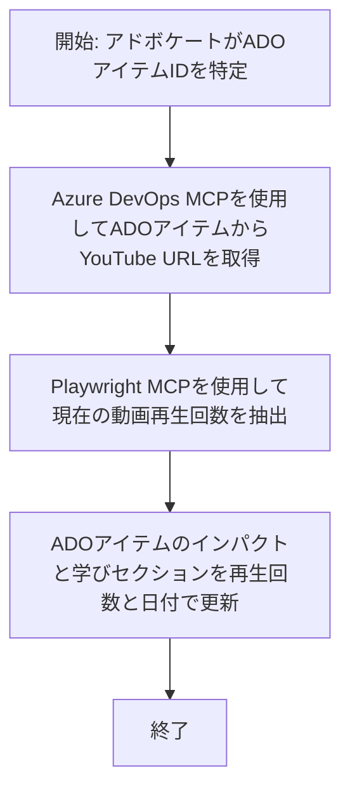

# ケーススタディ: MCPを使用したYouTubeデータからのAzure DevOpsアイテム更新

> **免責事項:** YouTubeなどのプラットフォームからのデータを使ってAzure DevOpsアイテムを自動的に更新する既存のオンラインツールやレポートが存在します。以下のシナリオは、MCPツールが自動化および統合タスクにどのように適用できるかを示すサンプルユースケースとして提供されています。

## 概要

このケーススタディでは、Model Context Protocol（MCP）とそのツールを使用して、YouTubeなどのオンラインプラットフォームから取得した情報でAzure DevOps（ADO）の作業アイテムを自動的に更新する例を示します。ここで説明するシナリオは、これらのツールの幅広い能力の一例にすぎず、多くの類似の自動化ニーズに適応可能です。

この例では、アドボケイトがADOアイテムでオンラインセッションを追跡しており、各アイテムにはYouTubeの動画URLが含まれています。MCPツールを活用することで、アドボケイトは最新の動画視聴数などのメトリクスを繰り返しかつ自動的にADOアイテムに反映させることができます。この手法は、オンラインソースの情報をADOや他のシステムに統合する他のユースケースにも一般化できます。

## シナリオ

アドボケイトはオンラインセッションやコミュニティ参加の影響を追跡します。各セッションは「DevRel」プロジェクトのADO作業アイテムとして記録され、作業アイテムにはYouTube動画URLのフィールドがあります。セッションのリーチを正確に報告するために、アドボケイトはADOアイテムを最新の動画視聴数とこの情報を取得した日付で更新する必要があります。

## 使用ツール

- [Azure DevOps MCP](https://github.com/microsoft/azure-devops-mcp): MCP経由でADO作業アイテムへのプログラム的なアクセスと更新を可能にします。
- [Playwright MCP](https://github.com/microsoft/playwright-mcp): ブラウザ操作を自動化し、YouTube動画の統計などウェブページからライブデータを抽出します。

## ステップバイステップワークフロー

1. **ADOアイテムの特定**: 「DevRel」プロジェクト内のADO作業アイテムID（例：1234）から開始します。
2. **YouTube URLの取得**: Azure DevOps MCPツールを使って作業アイテムからYouTube URLを取得します。
3. **動画視聴数の抽出**: Playwright MCPツールを使ってYouTube URLにアクセスし、現在の視聴数を抽出します。
4. **ADOアイテムの更新**: 取得した最新の視聴数と取得日を「インパクトと学び」セクションにAzure DevOps MCPツールで書き込みます。

## 例のプロンプト

```bash
- Work with the ADO Item ID: 1234
- The project is '2025-Awesome'
- Get the YouTube URL for the ADO item
- Use Playwright to get the current views from the YouTube video
- Update the ADO item with the current video views and the updated date of the information
```

## Mermaidフローチャート


## 技術的な実装

- **MCPオーケストレーション**: ワークフローはMCPサーバーによって管理され、Azure DevOps MCPとPlaywright MCPツールの連携を調整します。
- **自動化**: プロセスは手動で実行するか、定期的にスケジュールしてADOアイテムを最新に保つことができます。
- **拡張性**: 同様のパターンを応用して、他のオンラインメトリクス（いいね数、コメント数など）や他のプラットフォームからのデータ更新に拡張可能です。

## 結果と効果

- **効率化**: 動画メトリクスの取得と更新を自動化することで、アドボケイトの手作業負荷を軽減します。
- **正確性**: ADOアイテムがオンラインソースからの最新データを反映することを保証します。
- **再現性**: 他のデータソースやメトリクスを扱う類似シナリオで再利用可能なワークフローを提供します。

## 参考文献

- [Azure DevOps MCP](https://github.com/microsoft/azure-devops-mcp)
- [Playwright MCP](https://github.com/microsoft/playwright-mcp)
- [Model Context Protocol (MCP)](https://modelcontextprotocol.io/)

## 次に読む

- 戻る: [ケーススタディ一覧](./README.md)
- 次へ: [MCPによるリアルタイムドキュメント取得](./docs-mcp/README.md)

---

<!-- CO-OP TRANSLATOR DISCLAIMER START -->
**免責事項**：  
本書類はAI翻訳サービス[Co-op Translator](https://github.com/Azure/co-op-translator)を用いて翻訳されました。正確性には努めておりますが、自動翻訳には誤りや不正確な箇所が含まれる可能性があります。原文の言語による文書が正式な情報源と見なされるべきです。重要な情報については、専門の人間による翻訳を推奨します。本翻訳の利用に起因するいかなる誤解や誤訳についても当社は責任を負いかねます。
<!-- CO-OP TRANSLATOR DISCLAIMER END -->