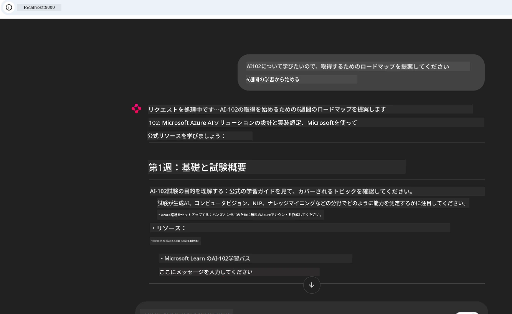
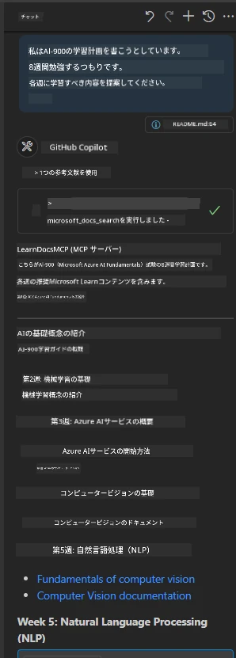

# ケーススタディ：クライアントから Microsoft Learn Docs MCP サーバーへの接続

ドキュメントサイト、Stack Overflow、無数の検索エンジンのタブを行き来しながらコードの問題を解決しようとして、手間取ったことはありませんか？ドキュメント用にセカンドモニターを用意したり、IDEとブラウザを頻繁にalt-tabしていたりしませんか？ドキュメントをワークフローの中に組み込み、アプリやIDE、あるいは独自のカスタムツール内に直接取り込めたらもっと良くありませんか？このケーススタディでは、Microsoft Learn Docs MCP サーバーにご自身のクライアントアプリケーションから直接接続する方法を探っていきます。

## 概要

現代の開発は単にコードを書くことだけでなく、適切な情報を適切なタイミングで見つけることが重要です。ドキュメントはあらゆる場所にありますが、最も必要とされる場所、つまりツールやワークフローの中にあることは稀です。ドキュメント取得をアプリに直接統合することで、時間を節約し、コンテキストの切り替えを減らし、生産性を向上できます。このセクションでは、クライアントから Microsoft Learn Docs MCP サーバーへ接続し、アプリを離れることなくリアルタイムでコンテキストに応じたドキュメントを取得する方法を紹介します。

接続の確立、リクエスト送信、ストリーミング応答の効率的な処理の手順を順に説明します。この手法はワークフローの効率化を図るだけでなく、より賢く役立つ開発者ツール構築への扉を開きます。

## 学習目標

なぜこのことをするのか？それは最高の開発者体験とは摩擦を取り除くことだからです。コードエディター、チャットボット、Webアプリが Microsoft Learn の最新コンテンツを使ってドキュメント質問に即座に答えられる世界を想像してみてください。この章の終わりには次のことができるようになります：

- ドキュメント用 MCP サーバーとクライアント間通信の基本を理解する
- Microsoft Learn Docs MCP サーバーへの接続を実装したコンソールまたはWebアプリを作る
- ストリーミングHTTPクライアントを使ったリアルタイムドキュメント取得
- アプリケーション内でドキュメント応答をログに記録し、解釈する

これらのスキルにより、単に反応するだけでなく、真にインタラクティブでコンテキストを理解したツールを構築できます。

## シナリオ1 - MCP を使ったリアルタイムドキュメント取得

このシナリオでは、クライアントから Microsoft Learn Docs MCP サーバーに接続し、アプリを離れることなくリアルタイムでコンテキストに応じたドキュメントを取得する方法を紹介します。

実践してみましょう。課題は、Microsoft Learn Docs MCP サーバーに接続し、`microsoft_docs_search` ツールを呼び出し、ストリーミングされた応答をコンソールにログ出力するアプリを書くことです。

### なぜこの方法なのか？
これはチャットボットや IDE 拡張、ウェブダッシュボードなど高度な統合を構築するための基盤だからです。

このシナリオのコードと手順は、本ケーススタディの [`solution`](./solution/README.md) フォルダーにあります。接続設定の手順は次のとおりです：
- 公式 MCP SDK とストリーム対応 HTTP クライアントを使って接続
- クエリパラメーター付きで `microsoft_docs_search` ツールを呼び出しドキュメントを取得
- 適切なログ出力とエラーハンドリングの実装
- ユーザーが複数の検索クエリを入力できるインタラクティブなコンソールインターフェースの作成

このシナリオには以下の内容が含まれます：
- Docs MCP サーバーへの接続
- クエリ送信
- 結果の解析と表示

実行イメージは以下のようになります：

```
Prompt> What is Azure Key Vault?
Answer> Azure Key Vault is a cloud service for securely storing and accessing secrets. ...
```

以下は最小限のサンプルソリューションです。完全なコードと詳細は solution フォルダーにあります。

<details>
<summary>Python</summary>

```python
import asyncio
from mcp.client.streamable_http import streamablehttp_client
from mcp import ClientSession

async def main():
    async with streamablehttp_client("https://learn.microsoft.com/api/mcp") as (read_stream, write_stream, _):
        async with ClientSession(read_stream, write_stream) as session:
            await session.initialize()
            result = await session.call_tool("microsoft_docs_search", {"query": "Azure Functions best practices"})
            print(result.content)

if __name__ == "__main__":
    asyncio.run(main())
```

- 完全な実装とログは [`scenario1.py`](../../../../09-CaseStudy/docs-mcp/solution/python/scenario1.py) をご覧ください。
- インストールと使用方法は同フォルダーの [`README.md`](./solution/python/README.md) に記載されています。
</details>


## シナリオ2 - MCP を利用したインタラクティブ学習プラン生成Webアプリ

このシナリオでは、Docs MCP を Web 開発プロジェクトに組み込む方法を学びます。目的は、Microsoft Learn ドキュメントを Web インターフェイスから直接検索できるようにし、アプリやサイト内でドキュメントに即座にアクセスできるようにすることです。

以下の内容を学べます：
- Web アプリのセットアップ
- Docs MCP サーバーへの接続
- ユーザー入力の処理と結果の表示

実行イメージは以下のとおりです：

```
User> I want to learn about AI102 - so suggest the roadmap to get it started from learn for 6 weeks

Assistant> Here’s a detailed 6-week roadmap to start your preparation for the AI-102: Designing and Implementing a Microsoft Azure AI Solution certification, using official Microsoft resources and focusing on exam skills areas:

---
## Week 1: Introduction & Fundamentals
- **Understand the Exam**: Review the [AI-102 exam skills outline](https://learn.microsoft.com/en-us/credentials/certifications/exams/ai-102/).
- **Set up Azure**: Sign up for a free Azure account if you don't have one.
- **Learning Path**: [Introduction to Azure AI services](https://learn.microsoft.com/en-us/training/modules/intro-to-azure-ai/)
- **Focus**: Get familiar with Azure portal, AI capabilities, and necessary tools.

....more weeks of the roadmap...

Let me know if you want module-specific recommendations or need more customized weekly tasks!
```

以下は最小限のサンプルソリューションです。完全なコードと詳細は solution フォルダーにあります。



<details>
<summary>Python (Chainlit)</summary>

Chainlit は会話型AIウェブアプリ構築のフレームワークです。MCPツールを呼び出してリアルタイムで結果を表示できるインタラクティブなチャットボットやアシスタントを簡単に作成できます。プロトタイプ開発やユーザーフレンドリーなインターフェースに最適です。

```python
import chainlit as cl
import requests

MCP_URL = "https://learn.microsoft.com/api/mcp"

@cl.on_message
def handle_message(message):
    query = {"question": message}
    response = requests.post(MCP_URL, json=query)
    if response.ok:
        result = response.json()
        cl.Message(content=result.get("answer", "No answer found.")).send()
    else:
        cl.Message(content="Error: " + response.text).send()
```

- 完全な実装は [`scenario2.py`](../../../../09-CaseStudy/docs-mcp/solution/python/scenario2.py) を参照してください。
- セットアップと実行手順は [`README.md`](./solution/python/README.md) にあります。
</details>


## シナリオ3: VS Code での MCP サーバーによるエディター内ドキュメント表示

ブラウザタブを切り替える代わりに、Microsoft Learn Docs を VS Code 内に直接取り込みたい場合、MCP サーバーをエディターに組み込めます。これにより、以下が可能になります：
- コーディング環境から離れずに VS Code 内でドキュメントを検索・閲覧
- ドキュメントを参照し、README やコースファイルに直接リンクを挿入
- GitHub Copilot と MCP を組み合わせてシームレスでAI支援のドキュメントワークフローを実現

**以下のことがわかります：**
- ワークスペースのルートに有効な `.vscode/mcp.json` ファイルを追加する方法（下記例参照）
- VS Code の MCP パネルを開くかコマンドパレットからドキュメントを検索・挿入する方法
- 作業中にマークダウンファイル内でドキュメントを直接参照する方法
- GitHub Copilot とこのワークフローを組み合わせることでさらに効率アップ

VS Code での MCP サーバーのセットアップ例は以下の通りです：

```json
{
  "servers": {
    "LearnDocsMCP": {
      "url": "https://learn.microsoft.com/api/mcp"
    }
  }
}
```

</details>

> スクリーンショット付きの詳細な手順は [`README.md`](./solution/scenario3/README.md) をご覧ください。



この手法は技術講座作成やドキュメント執筆、頻繁に参照が必要なコード開発に最適です。

## 重要なポイント

ドキュメントをツールに直接統合することは単なる便利さではなく、生産性を一変させるものです。Microsoft Learn Docs MCP サーバーにクライアントから接続することで：

- コードとドキュメント間のコンテキスト切り替えをなくせる
- 最新でコンテキスト対応のドキュメントをリアルタイムで取得できる
- もっと賢く、インタラクティブな開発者ツールを作れる

これらのスキルは効率的で使いやすいソリューション作成に役立ちます。

## 追加リソース

理解を深めるために、以下の公式リソースもご活用ください：

- [Microsoft Learn Docs MCP Server (GitHub)](https://github.com/MicrosoftDocs/mcp)
- [Azure MCP Server の入門 (mcp-python)](https://learn.microsoft.com/en-us/azure/developer/azure-mcp-server/get-started#create-the-python-app)
- [Azure MCP Server とは？](https://learn.microsoft.com/en-us/azure/developer/azure-mcp-server/)
- [Model Context Protocol (MCP) 入門](https://modelcontextprotocol.io/introduction)
- [MCP サーバーからプラグインを追加する (Python)](https://learn.microsoft.com/en-us/semantic-kernel/concepts/plugins/adding-mcp-plugins)

## 次に進むには

- 戻る：[ケーススタディの概要](../README.md)
- 続ける：[モジュール10: AI ツールキットによる AI ワークフローの効率化](../../10-StreamliningAIWorkflowsBuildingAnMCPServerWithAIToolkit/README.md)

---

<!-- CO-OP TRANSLATOR DISCLAIMER START -->
**免責事項**：  
本書類はAI翻訳サービス[Co-op Translator](https://github.com/Azure/co-op-translator)を使用して翻訳されました。正確性を期しておりますが、自動翻訳には誤りや不正確な箇所が含まれる場合があります。原文は当該言語の正式な版を権威ある情報源とみなしてください。重要な情報については、専門の人間による翻訳を推奨します。本翻訳の使用により生じたいかなる誤解や誤訳についても、当方は一切の責任を負いかねます。
<!-- CO-OP TRANSLATOR DISCLAIMER END -->