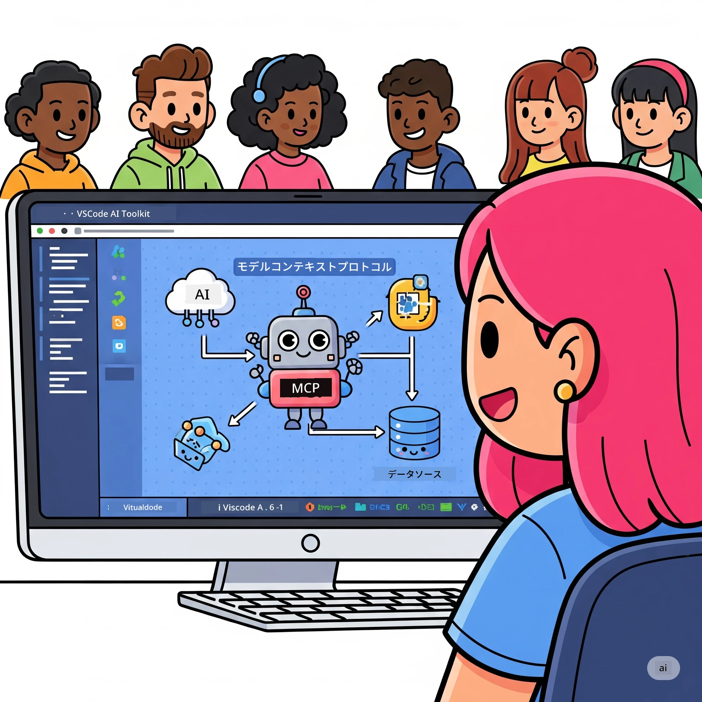

# AIワークフローの効率化：AI Toolkitを用いたMCPサーバー構築

## 🎯 概要

_(上の画像をクリックするとこのレッスンの動画が視聴できます)_

**Model Context Protocol (MCP) ワークショップ**へようこそ！この包括的なハンズオンワークショップでは、最先端技術を融合し、AIアプリケーション開発の革命を起こします：

- **🔗 Model Context Protocol (MCP)**：シームレスなAIツール統合のためのオープン標準
- **🛠️ Visual Studio Code用AI Toolkit (AITK)**：Microsoftの強力なAI開発拡張機能

### 🎓 学べること

このワークショップの最後には、AIモデルと実世界のツールやサービスを橋渡しするインテリジェントなアプリケーション構築の技術を習得します。自動テストからカスタムAPI統合まで、複雑なビジネス課題を解決する実践的なスキルを身につけます。

## 🏗️ 技術スタック

### 🔌 Model Context Protocol (MCP)

MCPはAIのための**「USB-C」**です。AIモデルを外部ツールやデータソースに接続するためのユニバーサルスタンダードです。

**✨ 主な特徴：**

- 🔄 **標準化された統合**：AIツール接続のためのユニバーサルインターフェース
- 🏛️ **柔軟なアーキテクチャ**：stdio/SSEトランスポートを使ったローカル＆リモートサーバー対応
- 🧰 **豊富なエコシステム**：ツール、プロンプト、リソースが一つのプロトコルに集約
- 🔒 **企業向けの信頼性**：組み込みのセキュリティと信頼性

**🎯 MCPが重要な理由：**  
USB-Cがケーブルの混乱を解消したように、MCPはAI統合の複雑さを解消します。1つのプロトコルで無限の可能性を提供します。

### 🤖 Visual Studio Code用AI Toolkit (AITK)

Microsoftの旗艦AI開発拡張機能で、VS Codeを強力なAI開発環境に変えます。

**🚀 主な機能：**

- 📦 **モデルカタログ**：Azure AI、GitHub、Hugging Face、Ollamaのモデルにアクセス
- ⚡ **ローカル推論**：ONNX最適化済みのCPU/GPU/NPU実行
- 🏗️ **エージェントビルダー**：MCP統合によるビジュアルAIエージェント開発
- 🎭 **マルチモーダル対応**：テキスト、ビジョン、構造化出力のサポート

**💡 開発メリット：**

- ゼロコンフィグでモデルデプロイ
- ビジュアルプロンプトエンジニアリング
- リアルタイムテストプレイグラウンド
- シームレスなMCPサーバー統合

## 📚 学習ジャーニー

### [🚀 モジュール1：AI Toolkitの基礎](./lab1/README.md)

**所要時間**：15分

- 🛠️ VS Code用AI Toolkitのインストールと設定
- 🗂️ モデルカタログの探索（GitHub、ONNX、OpenAI、Anthropic、Googleの100以上のモデル）
- 🎮 リアルタイムモデルテストのためのインタラクティブプレイグラウンドの習得
- 🤖 初めてのAIエージェント構築（エージェントビルダー使用）
- 📊 内蔵メトリクス（F1、関連度、類似度、一貫性）でモデル性能評価
- ⚡ バッチ処理とマルチモーダル機能の学習

**🎯 学習成果**：AITK機能を理解し実用的なAIエージェントを作成

### [🌐 モジュール2：MCPとAI Toolkitの基礎](./lab2/README.md)

**所要時間**：20分

- 🧠 Model Context Protocol (MCP)のアーキテクチャとコンセプト習得
- 🌐 MicrosoftのMCPサーバーエコシステムの探索
- 🤖 Playwright MCPサーバーを使ったブラウザ自動化エージェント構築
- 🔧 MCPサーバーをAI Toolkitのエージェントビルダーと統合
- 📊 エージェント内でのMCPツール設定とテスト
- 🚀 MCP対応エージェントの本番環境向けエクスポートとデプロイ

**🎯 学習成果**：外部ツールを駆使した強力なAIエージェントを展開

### [🔧 モジュール3：AI Toolkitによる高度なMCP開発](./lab3/README.md)

**所要時間**：20分

- 💻 AI Toolkitを用いたカスタムMCPサーバー作成
- 🐍 最新MCP Python SDK（v1.9.3）の設定と活用
- 🔍 MCP Inspectorによるデバッグ環境構築と利用
- 🛠️ プロフェッショナルなデバッグワークフローで気象MCPサーバー構築
- 🧪 エージェントビルダーとInspectorの両環境でMCPサーバーデバッグ

**🎯 学習成果**：最新ツールによるMCPサーバー開発とデバッグ技術の習得

### [🐙 モジュール4：実践的なMCP開発 - カスタムGitHubクローンサーバー](./lab4/README.md)

**所要時間**：30分

- 🏗️ 開発ワークフロー用の実用的なGitHubクローンMCPサーバー構築
- 🔄 バリデーションとエラーハンドリングを備えたスマートなリポジトリクローン機能実装
- 📁 インテリジェントなディレクトリ管理とVS Code統合の作成
- 🤖 カスタムMCPツールと連携したGitHub Copilotエージェントモード使用
- 🛡️ 本番環境向けの信頼性とクロスプラットフォーム対応適用

**🎯 学習成果**：実際の開発ワークフローを効率化する本番対応MCPサーバー展開

## 💡 実際の応用例とインパクト

### 🏢 企業向けユースケース

#### 🔄 DevOps自動化

開発ワークフローをインテリジェントに自動化：

- **スマートリポジトリ管理**：AIによるコードレビューとマージ判断
- **インテリジェントCI/CD**：コード変更に基づく自動パイプライン最適化
- **課題トリアージ**：自動バグ分類および割り当て

#### 🧪 品質保証革命

AI駆動の自動化でテストを向上：

- **インテリジェントテスト生成**：網羅的なテストスイートの自動作成
- **ビジュアル回帰テスト**：AI搭載のUI変更検出
- **パフォーマンス監視**：問題の事前検知と解決

#### 📊 データパイプラインインテリジェンス

スマートなデータ処理ワークフロー構築：

- **適応型ETLプロセス**：自己最適化型データ変換
- **異常検知**：リアルタイムデータ品質監視
- **インテリジェントルーティング**：スマートなデータフロー管理

#### 🎧 顧客体験の向上

卓越した顧客インタラクションの創出：

- **コンテキスト認識サポート**：顧客履歴にアクセスできるAIエージェント
- **プロアクティブな問題解決**：予測型カスタマーサービス
- **マルチチャネル統合**：プラットフォームを超えた統合AI体験

## 🛠️ 前提条件とセットアップ

### 💻 システム要件

| コンポーネント | 要件 | 備考 |
|-----------|-------------|-------|
| **OS** | Windows 10以降、macOS 10.15以降、Linux | いずれも最新のOS |
| **Visual Studio Code** | 最新の安定版 | AITKに必須 |
| **Node.js** | v18.0以上とnpm | MCPサーバー開発用 |
| **Python** | 3.10以上 | Python製MCPサーバー用（任意） |
| **メモリ** | 最低8GB RAM | ローカルモデルは16GB推奨 |

### 🔧 開発環境

#### 推奨VS Code拡張機能

- **AI Toolkit** (ms-windows-ai-studio.windows-ai-studio)
- **Python** (ms-python.python)
- **Python Debugger** (ms-python.debugpy)
- **GitHub Copilot** (GitHub.copilot) - 任意ですが便利

#### 任意ツール

- **uv**: 最新のPythonパッケージマネージャー
- **MCP Inspector**: MCPサーバー用ビジュアルデバッグツール
- **Playwright**: Web自動化サンプル用

## 🎖️ 学習成果と認定パス

### 🏆 スキルマスタリーチェックリスト

このワークショップ修了により、以下の技術を習得できます：

#### 🎯 コア能力

- [ ] **MCPプロトコルマスター**：アーキテクチャと実装パターンの深い理解
- [ ] **AITK熟練**：AI Toolkitを用いた高速開発のエキスパートレベル操作
- [ ] **カスタムサーバー開発**：本番用MCPサーバーの構築・展開・運用
- [ ] **ツール統合の優秀性**：既存の開発ワークフローとAIのシームレス接続
- [ ] **課題解決応用**：実ビジネス課題への学んだスキルの適用

#### 🔧 技術スキル

- [ ] VS CodeでのAI Toolkit設定と構成
- [ ] カスタムMCPサーバーの設計・実装
- [ ] GitHubモデルとのMCPアーキテクチャ統合
- [ ] Playwrightによる自動化テストワークフロー構築
- [ ] 本番環境向けAIエージェントのデプロイ
- [ ] MCPサーバーのデバッグと性能最適化

#### 🚀 高度な機能

- [ ] エンタープライズ規模のAI統合アーキテクチャ設計
- [ ] AIアプリケーションにおけるセキュリティベストプラクティス実装
- [ ] スケーラブルなMCPサーバーアーキテクチャ設計
- [ ] 特定領域向けカスタムツールチェーン作成
- [ ] AIネイティブ開発のメンター役

## 📖 追加リソース

- [MCP仕様書 (2025-11-25)](https://spec.modelcontextprotocol.io/specification/2025-11-25/)
- [AI Toolkit GitHubリポジトリ](https://github.com/microsoft/vscode-ai-toolkit)
- [サンプルMCPサーバーコレクション](https://github.com/modelcontextprotocol/servers)
- [ベストプラクティスガイド](https://modelcontextprotocol.io/docs/best-practices)
- [OWASP MCP Top 10](https://microsoft.github.io/mcp-azure-security-guide/mcp/) - セキュリティベストプラクティス

---

**🚀 AI開発ワークフローを変革する準備はできましたか？**

MCPとAI Toolkitでインテリジェントなアプリケーションの未来を共に創りましょう！

## 次のステップ

続ける：[モジュール11：MCPサーバーハンズオンラボ](../11-MCPServerHandsOnLabs/README.md)

---

<!-- CO-OP TRANSLATOR DISCLAIMER START -->
**免責事項**：  
本書類はAI翻訳サービス[Co-op Translator](https://github.com/Azure/co-op-translator)を使用して翻訳されました。正確性を目指しておりますが、自動翻訳には誤りや不正確な点が含まれる場合があります。原文の母国語版が正式な情報源と見なされるべきです。重要な情報については、専門の人間による翻訳を推奨します。本翻訳の使用により生じた誤解や誤訳について、当方は一切の責任を負いかねます。
<!-- CO-OP TRANSLATOR DISCLAIMER END -->