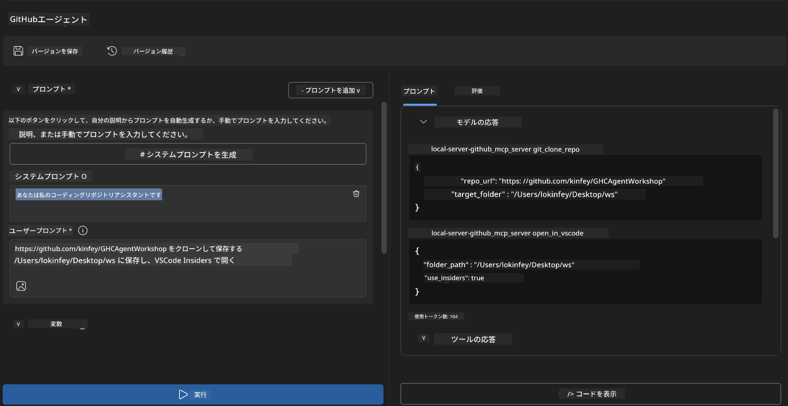
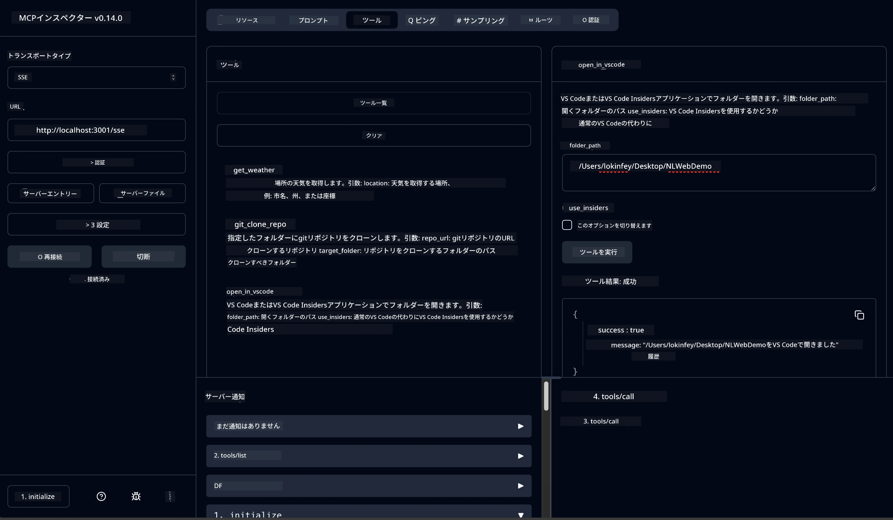

# 🐙 モジュール 4: 実践的なMCP開発 - カスタムGitHubクローンサーバー


> **⚡ クイックスタート:** たった30分でGitHubリポジトリのクローンとVS Code連携を自動化する、本番対応のMCPサーバーを構築しましょう！

## 🎯 学習目標

このラボを終える頃には、以下ができるようになります：

- ✅ 実践的な開発ワークフロー向けのカスタムMCPサーバーの作成
- ✅ MCP経由でGitHubリポジトリのクローン機能を実装
- ✅ カスタムMCPサーバーとVS CodeおよびAgent Builderの統合
- ✅ カスタムMCPツールでGitHub Copilot Agent Modeを活用
- ✅ 実運用環境でのカスタムMCPサーバーのテストとデプロイ

## 📋 前提条件

- ラボ1〜3の完了（MCPの基本と高度な開発）
- GitHub Copilotのサブスクリプション（[無料サインアップはこちら](https://github.com/github-copilot/signup)）
- AI ToolkitとGitHub Copilot拡張機能を導入済みのVS Code
- Git CLIがインストール・設定済みであること

## 🏗️ プロジェクト概要

### **実践的開発課題**
開発者はGitHubからリポジトリをクローンしてVS CodeやVS Code Insidersで開く機会が多いです。この手動プロセスは以下の通りです：
1. ターミナル／コマンドプロンプトを開く
2. 対象ディレクトリに移動する
3. `git clone`コマンドを実行
4. クローンしたディレクトリでVS Codeを起動

**このMCPソリューションは、これを1つの賢いコマンドにまとめます！**

### **作成するもの**
GitHubリポジトリのクローン機能を提供する**GitHub Clone MCPサーバー** (`git_mcp_server`) です：

| 機能 | 説明 | 利点 |
|---------|-------------|---------|
| 🔄 **スマートなリポジトリクローン** | GitHubリポジトリを検証付きでクローン | 自動エラーチェック |
| 📁 **インテリジェントなディレクトリ管理** | ディレクトリの安全な検証・生成 | 上書き防止 |
| 🚀 **クロスプラットフォーム対応のVS Code連携** | VS Code/Insidersでプロジェクトを起動 | シームレスな作業移行 |
| 🛡️ **堅牢なエラーハンドリング** | ネットワーク・権限・パスの問題を処理 | 本番環境対応の信頼性 |

---

## 📖 ステップバイステップ実装

### ステップ 1: Agent BuilderでGitHubエージェントを作成

1. AI Toolkit拡張から**Agent Builderを起動**
2. 以下の設定で**新しいエージェントを作成**：
   ```
   Agent Name: GitHubAgent
   ```

3. **カスタムMCPサーバーの初期化：**
   - **Tools（ツール）** → **Add Tool（ツール追加）** → **MCP Server（MCPサーバー）** に進む
   - **「Create A new MCP Server」** を選択
   - 最大の柔軟性のために **Pythonテンプレート** を選択
   - **サーバー名:** `git_mcp_server`

### ステップ 2: GitHub Copilot Agent Modeの設定

1. VS CodeでGitHub Copilotを開く（Ctrl/Cmd + Shift + P → 「GitHub Copilot: Open」）
2. Copilotインターフェースで**エージェントモデルを選択**
3. **Claude 3.7モデル**を選択し、推論能力を強化
4. **MCP統合を有効化**してツールアクセスを許可

> **💡 プロのコツ：** Claude 3.7は開発ワークフローやエラーハンドリングの理解に優れています。

### ステップ 3: コアMCPサーバー機能の実装

**GitHub Copilot Agent Modeで以下の詳細プロンプトを使用してください：**

```
Create two MCP tools with the following comprehensive requirements:

🔧 TOOL A: clone_repository
Requirements:
- Clone any GitHub repository to a specified local folder
- Return the absolute path of the successfully cloned project
- Implement comprehensive validation:
  ✓ Check if target directory already exists (return error if exists)
  ✓ Validate GitHub URL format (https://github.com/user/repo)
  ✓ Verify git command availability (prompt installation if missing)
  ✓ Handle network connectivity issues
  ✓ Provide clear error messages for all failure scenarios

🚀 TOOL B: open_in_vscode
Requirements:
- Open specified folder in VS Code or VS Code Insiders
- Cross-platform compatibility (Windows/Linux/macOS)
- Use direct application launch (not terminal commands)
- Auto-detect available VS Code installations
- Handle cases where VS Code is not installed
- Provide user-friendly error messages

Additional Requirements:
- Follow MCP 1.9.3 best practices
- Include proper type hints and documentation
- Implement logging for debugging purposes
- Add input validation for all parameters
- Include comprehensive error handling
```

### ステップ 4: MCPサーバーのテスト

#### 4a. Agent Builderでのテスト

1. Agent Builderのデバッグ構成を起動
2. 以下のシステムプロンプトでエージェントを設定：

```
SYSTEM_PROMPT:
You are my intelligent coding repository assistant. You help developers efficiently clone GitHub repositories and set up their development environment. Always provide clear feedback about operations and handle errors gracefully.
```

3. 現実的なユーザーシナリオでテスト：

```
USER_PROMPT EXAMPLES:

Scenario : Basic Clone and Open
"Clone {Your GitHub Repo link such as https://github.com/kinfey/GHCAgentWorkshop
 } and save to {The global path you specify}, then open it with VS Code Insiders"
```



**期待される結果：**
- ✅ クローン成功とパス確認
- ✅ 自動的にVS Codeが起動
- ✅ 不正なケースでの明確なエラーメッセージ
- ✅ エッジケースの適切な処理

#### 4b. MCP Inspectorでのテスト



---

**🎉 おめでとうございます！** 実践的で本番対応が可能なMCPサーバーを作成し、現実的な開発ワークフローの課題を解決しました。カスタムGitHubクローンサーバーは、開発者の生産性を自動化・向上させるMCPの力を示しています。

### 🏆 獲得した実績：
- ✅ **MCP開発者** - カスタムMCPサーバーを作成
- ✅ **ワークフロー自動化者** - 開発プロセスを効率化  
- ✅ **統合エキスパート** - 複数の開発ツールを連携
- ✅ **本番対応者** - デプロイ可能なソリューションを構築

---

## 🎓 ワークショップ修了：Model Context Protocolの旅

**ワークショップ参加者の皆様へ、**

Model Context Protocolワークショップ全4モジュールの修了、おめでとうございます！AI Toolkitの基本理解から、本番利用可能なMCPサーバー構築まで大きく成長されました。

### 🚀 学習の歩みまとめ：

**[モジュール 1](../lab1/README.md)**: AI Toolkitの基礎、モデルテスト、最初のAIエージェント作成を学習

**[モジュール 2](../lab2/README.md)**: MCPアーキテクチャを理解し、Playwright MCPを統合し初のブラウザオートメーションエージェントを構築

**[モジュール 3](../lab3/README.md)**: Weather MCPサーバーでカスタムMCPサーバー開発を深め、デバッグツールも習得

**[モジュール 4](../lab4/README.md)**: 実践的なGitHubリポジトリワークフロー自動化ツールを完成

### 🌟 習得したこと：

- ✅ **AI Toolkitエコシステム**：モデル、エージェント、統合パターン
- ✅ **MCPアーキテクチャ**：クライアント・サーバー設計、トランスポートプロトコル、セキュリティ
- ✅ **開発ツール**：Playground、Inspector、実運用デプロイ
- ✅ **カスタム開発**：独自MCPサーバーの構築・テスト・デプロイ
- ✅ **実践アプリケーション**：AIで実際のワークフロー課題を解決

### 🔮 次のステップ：

1. **独自のMCPサーバーを作成**: あなたのワークフローを自動化
2. **MCPコミュニティに参加**: シェアし学び合う場へ
3. **高度な統合を探求**: エンタープライズシステム連携
4. **オープンソースに貢献**: MCPツールやドキュメントの改善

このワークショップはスタートです。Model Context Protocolのエコシステムは急速に進化中。AI駆動の開発ツールの最前線に立つ準備ができました。

**参加と学習への情熱に感謝します！**

このワークショップが、あなたの開発旅を変えるアイデアのきっかけとなれば幸いです。

**楽しいコーディングを！**

---

## 次のステップ

モジュール10の全ラボを完了しました。おめでとうございます！

- 戻る：[モジュール10概要](../README.md)
- 続ける：[モジュール11: MCPサーバーハンズオンラボ](../../11-MCPServerHandsOnLabs/README.md)

---

<!-- CO-OP TRANSLATOR DISCLAIMER START -->
**免責事項**：  
本ドキュメントはAI翻訳サービス[Co-op Translator](https://github.com/Azure/co-op-translator)を使用して翻訳されました。正確性の確保に努めておりますが、自動翻訳には誤りや不正確な部分が含まれる場合があります。原文の言語でのオリジナル文書を権威ある情報源としてご参照ください。重要な情報については、専門の人間翻訳者による翻訳を推奨します。本翻訳の利用により生じた誤解や誤訳について、当方は一切の責任を負いかねます。
<!-- CO-OP TRANSLATOR DISCLAIMER END -->