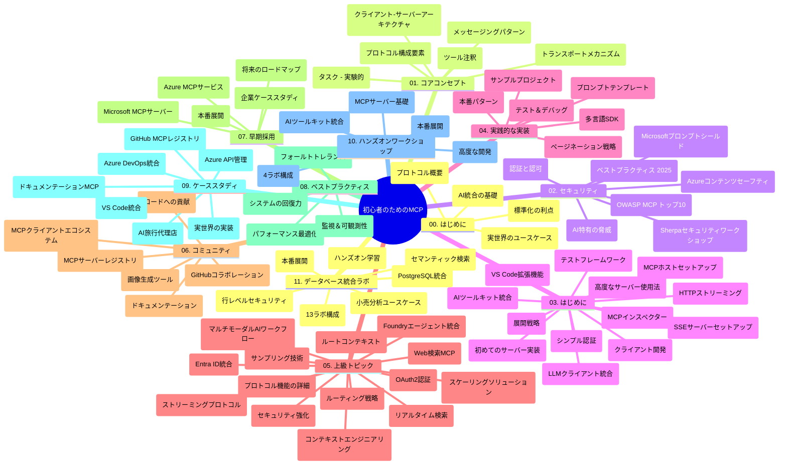

# 初心者向けモデルコンテキストプロトコル（MCP）－学習ガイド

この学習ガイドは、「初心者向けモデルコンテキストプロトコル（MCP）」カリキュラムのリポジトリ構成と内容の概要を提供します。このガイドを活用してリポジトリを効率的にナビゲートし、利用可能なリソースを最大限に活用してください。

## リポジトリの概要

モデルコンテキストプロトコル（MCP）は、AIモデルとクライアントアプリケーション間の相互作用のための標準化されたフレームワークです。元々Anthropicによって作成され、現在は公式GitHub組織を通じてより広範なMCPコミュニティによって維持されています。このリポジトリは、C#、Java、JavaScript、Python、TypeScriptによる実践的なコード例を含む包括的なカリキュラムを提供しており、AI開発者、システムアーキテクト、ソフトウェアエンジニア向けに設計されています。

## ビジュアルカリキュラムマップ

## リポジトリ構成

リポジトリはMCPのさまざまな側面に焦点を当てた11の主要セクションに編成されています：

1. **イントロダクション（00-Introduction/）**
   - モデルコンテキストプロトコルの概要
   - AIパイプラインにおける標準化の重要性
   - 実践的なユースケースと利点

2. **コアコンセプト（01-CoreConcepts/）**
   - クライアント‐サーバーアーキテクチャ
   - プロトコルの主要コンポーネント
   - MCPにおけるメッセージングパターン

3. **セキュリティ（02-Security/）**
   - MCPベースシステムのセキュリティ脅威
   - 実装を保護するベストプラクティス
   - 認証と認可戦略
   - **包括的なセキュリティドキュメント**：
     - MCPセキュリティベストプラクティス2025
     - Azure Content Safety導入ガイド
     - MCPセキュリティコントロールと手法
     - MCPベストプラクティスクイックリファレンス
   - **主要なセキュリティトピック**：
     - プロンプトインジェクションとツールポイズニング攻撃
     - セッションハイジャックおよび混乱代理問題
     - トークンパススルーの脆弱性
     - 過剰な権限とアクセス制御
     - AIコンポーネントのサプライチェーンセキュリティ
     - Microsoftプロンプトシールド統合

4. **はじめに（03-GettingStarted/）**
   - 環境設定と構成
   - 基本的なMCPサーバーとクライアントの作成
   - 既存アプリケーションとの統合
   - 次のセクションを含む：
     - 最初のサーバー実装
     - クライアント開発
     - LLMクライアント統合
     - VS Code統合
     - Server-Sent Events (SSE)サーバー
     - 高度なサーバー使用法
     - HTTPストリーミング
     - AIツールキット統合
     - テスト戦略
     - デプロイメントガイドライン

5. **実践的実装（04-PracticalImplementation/）**
   - 複数プログラミング言語でのSDK利用
   - デバッグ、テスト、検証技法
   - 再利用可能なプロンプトテンプレートとワークフロー作成
   - 実装例を伴うサンプルプロジェクト

6. **高度なトピック（05-AdvancedTopics/）**
   - コンテキストエンジニアリング技法
   - Foundryエージェント統合
   - マルチモーダルAIワークフロー
   - OAuth2認証デモ
   - リアルタイム検索機能
   - リアルタイムストリーミング
   - ルートコンテキスト実装
   - ルーティング戦略
   - サンプリング技法
   - スケーリング手法
   - セキュリティ考慮
   - Entra ID セキュリティ統合
   - Web検索統合

7. **コミュニティ貢献（06-CommunityContributions/）**
   - コードおよびドキュメントの貢献方法
   - GitHubを介したコラボレーション
   - コミュニティ主導の拡張とフィードバック
   - 各種MCPクライアントの使用（Claude Desktop、Cline、VSCode）
   - 人気のMCPサーバーとの連携、画像生成を含む

8. **初期導入からの教訓（07-LessonsfromEarlyAdoption/）**
   - 実世界の実装例と成功事例
   - MCPベースのソリューション構築と展開
   - トレンドと将来のロードマップ
   - **Microsoft MCPサーバーガイド**：10の本番対応Microsoft MCPサーバーに関する包括的ガイド：
     - Microsoft Learn Docs MCPサーバー
     - Azure MCPサーバー（15以上の専門コネクタ）
     - GitHub MCPサーバー
     - Azure DevOps MCPサーバー
     - MarkItDown MCPサーバー
     - SQL Server MCPサーバー
     - Playwright MCPサーバー
     - Dev Box MCPサーバー
     - Azure AI Foundry MCPサーバー
     - Microsoft 365 Agents Toolkit MCPサーバー

9. **ベストプラクティス（08-BestPractices/）**
   - パフォーマンスチューニングと最適化
   - 障害耐性のあるMCPシステム設計
   - テストおよびレジリエンス戦略

10. **ケーススタディ（09-CaseStudy/）**
    - MCPの多様なシナリオでの柔軟性を示す**7つの包括的なケーススタディ**：
    - **Azure AIトラベルエージェント**：Azure OpenAIとAI検索でのマルチエージェントオーケストレーション
    - **Azure DevOps統合**：YouTubeデータ更新のワークフロー自動化
    - **リアルタイムドキュメント取得**：PythonコンソールクライアントとHTTPストリーミング
    - **インタラクティブ学習計画ジェネレーター**：Chainlitウェブアプリと会話型AI
    - **エディタ内ドキュメント**：VS Code統合とGitHub Copilotワークフロー
    - **Azure API管理**：MCPサーバー作成によるエンタープライズAPI統合
    - **GitHub MCPレジストリ**：エコシステム開発とエージェント統合プラットフォーム
    - エンタープライズ統合、開発者生産性、エコシステム開発をカバーする実装例

11. **実践ワークショップ（10-StreamliningAIWorkflowsBuildingAnMCPServerWithAIToolkit/）**
    - MCPとAIツールキットを組み合わせた包括的な実践ワークショップ
    - AIモデルと実世界ツールをつなぐインテリジェントアプリの構築
    - 基礎、カスタムサーバー開発、本番展開戦略を含む実用モジュール
    - **ラボ構成**：
      - ラボ1：MCPサーバー基礎
      - ラボ2：高度なMCPサーバー開発
      - ラボ3：AIツールキット統合
      - ラボ4：本番展開とスケーリング
    - ステップバイステップのラボベース学習アプローチ

12. **MCPサーバーデータベース統合ラボ（11-MCPServerHandsOnLabs/）**
    - PostgreSQL統合による本番対応MCPサーバー構築のための**13ラボの包括的学習パス**
    - Zava Retailユースケースを用いた実世界の小売分析実装
    - 行レベルセキュリティ（RLS）、セマンティックサーチ、多テナントデータアクセスを含むエンタープライズ向けパターン
    - **完全なラボ構成**：
      - **ラボ00-03：基礎**－イントロ、アーキテクチャ、セキュリティ、環境設定
      - **ラボ04-06：MCPサーバー構築**－データベース設計、MCPサーバー実装、ツール開発
      - **ラボ07-09：高度機能**－セマンティックサーチ、テスト＆デバッグ、VS Code統合
      - **ラボ10-12：本番運用＆ベストプラクティス**－デプロイメント、監視、最適化
    - **使用技術**：FastMCPフレームワーク、PostgreSQL、Azure OpenAI、Azure Container Apps、Application Insights
    - **学習成果**：本番対応のMCPサーバー、データベース統合パターン、AI駆動分析、エンタープライズセキュリティ

## 追加リソース

リポジトリには次の支援リソースが含まれます：

- **Imagesフォルダ**：カリキュラム全体で使用される図解やイラスト
- **翻訳**：ドキュメントの多言語対応と自動翻訳
- **公式MCPリソース**：
  - [MCP Documentation](https://modelcontextprotocol.io/)
  - [MCP Specification](https://spec.modelcontextprotocol.io/)
  - [MCP GitHub Repository](https://github.com/modelcontextprotocol)

## このリポジトリの使い方

1. **順序立てた学習**：章を順に（00から11まで）学ぶことで体系的な学習が可能です。
2. **言語別フォーカス**：特定のプログラミング言語に興味がある場合は、対応するsamplesディレクトリを探索してください。
3. **実践的実装**：「はじめに」セクションから環境を設定し、最初のMCPサーバーとクライアントを作成しましょう。
4. **高度な探求**：基本が理解できたら、高度なトピックに進んで知識を深めてください。
5. **コミュニティ参加**：GitHubのディスカッションやDiscordチャネルでMCPコミュニティに参加し、専門家や他の開発者と交流しましょう。

## MCPクライアントとツール

カリキュラムではさまざまなMCPクライアントとツールをカバーしています：

1. **公式クライアント**：
   - Visual Studio Code
   - Visual Studio Code内のMCP
   - Claude Desktop
   - VSCode内のClaude
   - Claude API

2. **コミュニティクライアント**：
   - Cline（ターミナルベース）
   - Cursor（コードエディタ）
   - ChatMCP
   - Windsurf

3. **MCP管理ツール**：
   - MCP CLI
   - MCP Manager
   - MCP Linker
   - MCP Router

## 人気のMCPサーバー

リポジトリでは多様なMCPサーバーを紹介しています：

1. **公式Microsoft MCPサーバー**：
   - Microsoft Learn Docs MCPサーバー
   - Azure MCPサーバー（15以上の専門コネクタ）
   - GitHub MCPサーバー
   - Azure DevOps MCPサーバー
   - MarkItDown MCPサーバー
   - SQL Server MCPサーバー
   - Playwright MCPサーバー
   - Dev Box MCPサーバー
   - Azure AI Foundry MCPサーバー
   - Microsoft 365 Agents Toolkit MCPサーバー

2. **公式リファレンスサーバー**：
   - Filesystem
   - Fetch
   - Memory
   - Sequential Thinking

3. **画像生成**：
   - Azure OpenAI DALL-E 3
   - Stable Diffusion WebUI
   - Replicate

4. **開発ツール**：
   - Git MCP
   - Terminal Control
   - Code Assistant

5. **専門サーバー**：
   - Salesforce
   - Microsoft Teams
   - Jira & Confluence

## 貢献について

このリポジトリはコミュニティからの貢献を歓迎します。MCPエコシステムへ効果的に貢献する方法については、コミュニティ貢献セクションをご覧ください。

----

*この学習ガイドは2026年2月5日に最後に更新されており、最新のMCP仕様2025-11-25を反映しています。この日付以降にリポジトリの内容が更新される可能性があります。*

---

<!-- CO-OP TRANSLATOR DISCLAIMER START -->
**免責事項**：  
本ドキュメントはAI翻訳サービス「Co-op Translator」（https://github.com/Azure/co-op-translator）を使用して翻訳されています。正確性に努めておりますが、自動翻訳には誤りや不正確な箇所が含まれる場合があります。原文のネイティブ言語版を正式な情報源としてご参照ください。重要な情報については、専門の人間による翻訳を推奨いたします。本翻訳の利用により生じたいかなる誤解や誤訳についても責任を負いかねます。
<!-- CO-OP TRANSLATOR DISCLAIMER END -->