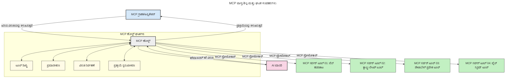

# ಮಾದರಿ ಸಾಂದರ್ಭಿಕ ಪ್ರೋಟೋಕಾಲ್ (MCP) ಗೆ ಪರಿಚಯ: ವಿಸ್ತರಿಸುವ AI ಅಪ್ಲಿಕೇಶನ್‌ಗಳಿಗೆ ಇದು ಏಕೆ ಮುಖ್ಯ?

[](https://youtu.be/agBbdiOPLQA)

_(ಈ ಪಾಠದ ವೀಡಿಯೋ ನೋಡಲು ಮೇಲಿನ ಚಿತ್ರ ಕ್ಲಿಕ್ ಮಾಡಿ)_

ಜನರೇಟಿವ್ AI ಅಪ್ಲಿಕೇಶನ್‌ಗಳು ಒಂದು ಮಹತ್ವದ ಪ್ರಗತಿ, ಏಕೆಂದರೆ ಅವರು ಬಳಕೆದಾರರಿಗೆ ನೈಸರ್ಗಿಕ ಭಾಷಾ ಪ್ರಾಂಪ್ಟ್‌ಗಳನ್ನು ಬಳಸಿಕೊಂಡು ಅಪ್ಲಿಕೇಶನ್ ಜೊತೆ ಸಂವಹನ ಸಾಧಿಸಲು ಅವಕಾಶ ನೀಡುತ್ತವೆ. ಆದಾಗ್ಯೂ, ಇಂತಹ ಅಪ್ಲಿಕೇಶನ್‌ಗಳಲ್ಲಿ ಹೆಚ್ಚು ಸಮಯ ಮತ್ತು ಸಂಪನ್ಮೂಲಗಳನ್ನು ಹೂಡಿಕೆಯಾದಂತೆ, ನೀವು ಸುಲಭವಾಗಿ ಕಾರ್ಯಕ್ಷಮತೆಯನ್ನೂ ಸಂಪನ್ಮೂಲಗಳನ್ನೂ ಸಂಯೋಜಿಸಲು, ಒಂದುಕೇಳೆಗೆ ಹೇಗೆ ವಿಸ್ತಾರಗೊಳ್ಳಬಹುದೆಂದು ಖಾತ್ರಿಪಡಿಸಿಕೊಳ್ಳಬೇಕು, ಮತ್ತು ನಿಮ್ಮ ಅಪ್ಲಿಕೇಶನ್ ಒಂದೂ ಹೆಚ್ಚು ಮಾದರಿಗಳನ್ನು ಬಳಸಬಹುದಾಗಿಸುವುದು ಹಾಗೂ ವಿವಿಧ ಮಾದರಿ ವೈಶಿಷ್ಟ್ಯಗಳನ್ನು ನಿಭಾಯಿಸುವುದನ್ನು ಮಾಡಬೇಕು. ಸಂಕ್ಷೇಪವಾಗಿ ಹೇಳುವುದಾದರೆ, ಜನ AI ಅಪ್ಲಿಕೇಶನ್‌ಗಳನ್ನು ಪ್ರಾರಂಭಿಸುವುದು ಸುಲಭ, ಆದರೆ ಅವು ಬೆಳೆಯುತ್ತಾ, ಜಟಿಲವಾಗುತ್ತಾ ಇರುವಂತೆ ನೀವು ಆರ್ಕಿಟೆಕ್ಚರ್ ಅನ್ನು ಪ್ರಾರಂಭಿಸಬೇಕು ಮತ್ತು ಸಾಮಾನ್ಯವಾಗಿ ನಿಮ್ಮ ಅಪ್ಲಿಕೇಶನ್‌ಗಳು ಸुसಂಗತವಾಗಿ ನಿರ್ಮಿಸಲು ಸೂಚನೆ ನೀಡಿ ಎನ್ನುವมาตರಕ್ಕೆ ಅವಲಂಬಿತವಾಗಬೇಕು. ಈ ಸ್ಥಳದಲ್ಲಿ MCP ಪ್ರವೇಶಿಸಿ ವಸ್ತುಗಳನ್ನು ವ್ಯವಸ್ಥಿತಗೊಳಿಸಿ ಮಾನಕವನ್ನು ಒದಗಿಸುತ್ತದೆ.

---

## **🔍 ಮಾದರಿ ಸಾಂದರ್ಭಿಕ ಪ್ರೋಟೋಕಾಲ್ (MCP) ಎಂದರೆ ಏನು?**

**ಮಾದರಿ ಸಾಂದರ್ಭಿಕ ಪ್ರೋಟೋಕಾಲ್ (MCP)** ಎನ್ನುವುದು **ತೆರೆದ, ಮಾನಕಗೊಳಿಸಿದ ಇಂಟರ್ಫೇಸ್**, ಇದು ದೊಡ್ಡ ಭಾಷಾ ಮಾದರಿಗಳು (LLMs) ವೃತ್ತಿಪರ ಉಪಕರಣಗಳು, APIಗಳು ಮತ್ತು ಡೇಟಾ ಮೂಲಗಳೊಂದಿಗೆ ನಿರಬಂಧವಾಗಿ ಸಂವಹನ ಮಾಡಬಹುದಾಗಿ ಅನುಮತಿಸುತ್ತದೆ. ಇದು AI ಮಾದರಿ ಕಾರ್ಯಾಚರಣೆ ಪಡೆದು ಕೊಳ್ಳುವ ತನ್ನ ತರಬೇತಿ ಡೇಟಾದ ಹೊರಗೆ ಸ್ಮಾರ್ಟ್, ವಿಸ್ತರಿಸಬಹುದಾದ, ಮತ್ತು ಹೆಚ್ಚು ಪ್ರತ್ಯುತ್ತರಕಾರಿ AI ವ್ಯವಸ್ಥೆಗಳ ನಿರ್ಮಾಣಕ್ಕಾಗಿಯೂ ಸದೃಢ ಆರ್ಕಿಟೆಕ್ಚರ್ ಒದಗಿಸುತ್ತದೆ.

---

## **🎯 AIಯಲ್ಲಿ ಮಾನಕೀಕರಣ ஏಕೆ ಡಿಕ್ಕೆ ಮಹತ್ವದದು**

ಜನರೇಟಿವ್ AI ಅಪ್ಲಿಕೇಶನ್ಗಳು ಹೆಚ್ಚು ಜಟಿಲವಾಗುತ್ತಿರುವಂತೆ, **ವಿಸ್ತಾರಗೊಳ್ಳುವಿಕೆ, ವಿಸ್ತರಿಸಬಹುದಾಗಿರುವಿಕೆ, ನಿರ್ವಹಣೆ ಮತ್ತು ವಂಡರ್ ಲಾಕ್-ಇನ್ ತಪ್ಪಿಸುವಿಕೆ** ಖಾತ್ರಿ ಪಡೆಯಲು ಮಾನಕಗಳನ್ನು ಸ್ವೀಕರಿಸುವುದು ಅಗತ್ಯವಾಗಿದೆ. MCP ಈ ಅಗತ್ಯಗಳನ್ನು ಈ ಕೆಳಗಿನ ಮೂಲಕ ಪೂರ್ಣ ಮಾಡುತ್ತದೆ:

- ಮಾದರಿ-ಉಪಕರಣ ಸಂಯೋಜನೆಗಳನ್ನು ಏಕೀಕೃತಗೊಳಿಸಲಾಗುವುದು  
- ಒಮ್ಮೆ ಬಡ್ಡಿ ನೀಡುವ, ವೈಯಕ್ತಿಕ ಪರಿಹಾರಗಳನ್ನು ಕಡಿಮೆ ಮಾಡುವುದು  
- ವಿಭಿನ್ನ ಮಾರ್ಗದರ್ಶಕರಿಂದ ಹಲವು ಮಾದರಿಗಳು ಒಂದೇ ಪರಿಸರದಲ್ಲಿ ಸಹವಾಸ ಮಾಡಬಹುದಾಗಿದೆ

**ಟಿಪ್ಪಣಿ:** MCP ತನ್ನನ್ನು ತೆರೆದ ಮಾನಕ ಎಂದು ಅಂದಾಜಿಸಿದ್ದರೂ, IEEE, IETF, W3C, ISO ಅಥವಾ ಇತರೆ ಯಾವುದೇ ಮಾನಕ ಸಂಸ್ಥೆಗಳ ಮೂಲಕ MCP ಅನ್ನು ಮಾನಕೀಕರಿಸುವ ಯೋಜನೆಗಳು ಇಲ್ಲ.

---

## **📚 ಕಲಿಕೆಯ ಉದ್ದೇಶಗಳು**

ಈ ಲೇಖನದ ಕೊನೆಯಲ್ಲಿ, ನೀವು ಮಾಡಬಹುದಾದವು:

- **ಮಾದರಿ ಸಾಂದರ್ಭಿಕ ಪ್ರೋಟೋಕಾಲ್ (MCP)** ಮತ್ತು ಅದರ ಉಪಯೋಗಗಳನ್ನು ವ್ಯಾಖ್ಯಾನಿಸುವುದು  
- MCP ಮಾದರಿ-ಉಪಕರಣ ಸಂವಹನವನ್ನು ಹೇಗೆ ಮಾನಕೀಕರಿಸುತ್ತದೆ ಎಂದು ಅರ್ಥಮಾಡಿಕೊಳ್ಳುವುದು  
- MCP ಆರ್ಕಿಟೆಕ್ಚರ್ ನ ಪ್ರಮುಖ ഘಟಕಗಳನ್ನು ಗುರುತಿಸುವುದು  
- MCP ನ ಅನುಷ್ಠಾನಗಳನ್ನು ಉದ್ಯಮ ಮತ್ತು ಅಭಿವೃದ್ಧಿ ಸಂದರ್ಭಗಳಲ್ಲಿ ಪರಿಶೀಲಿಸುವುದು  

---

## **💡 ಮಾದರಿ ಸಾಂದರ್ಭಿಕ ಪ್ರೋಟೋಕಾಲ್ (MCP) ಯೆಂದಿಗೆ ಮಹತ್ವದ ಕಾರಣ**

### **🔗 MCP AI ಸಂವಹನಗಳಲ್ಲಿ ವಿಭಜನೆಗೆ ಪರಿಹಾರವನ್ನು ನೀಡುತ್ತದೆ**

MCPಕ್ಕೆ ಮುಂಚೆ, ಮಾದರಿಗಳನ್ನು ಉಪಕರಣಗಳೊಂದಿಗೆ ಸಂಯೋಜಿಸಲು ಆಗಬೇಕಿದ್ದವು:

- ಪ್ರತಿ ಉಪಕರಣ-ಮಾದರಿ ಜೋಡಿಗೆ ಕಸ್ಟಮ್ ಕೋಡ್  
- ಪ್ರತಿ ಮಾರಾಟಗಾರನಿಗೆ ವಿವಿಧ, ಮಾನಕವಲ್ಲದ APIಗಳು  
- ಅಪ್ಡೇಟುಗಳಿಂದಾಗಿ ಜಾಗತಿಕ ಮುರಿತಗಳು  
- ಹೆಚ್ಚು ಉಪಕರಣಗಳೊಂದಿಗೆ ದುರ್ಬಲ ವಿಸ್ತಾರಗೊಳ್ಳುವಿಕೆ  

### **✅ MCP ಮಾನಕೀಕರಣದ ಲಾಭಗಳು**

| **ಲಾಭ**                | **ವಿವರಣೆ**                                                                   |
|------------------------|--------------------------------------------------------------------------------|
| ಪರಸ್ಪರ ಕಾರ್ಯಕ್ಷಮತೆ     | LLM ಗಳು ವೈವಿಧ್ಯಮಯ ಮಾರಾಟಗಾರರ ಉಪಕರಣಗಳೊಂದಿಗೆ ನಿರಂತರ ಕಾರ್ಯಾಚರಣೆ ಮಾಡುತ್ತವೆ                |
| ಸಮಾನತೆ                | ವೇದಿಕೆಗಳು ಹಾಗೂ ಉಪಕರಣಗಳಲ್ಲಿ ಸಾದೃಶ್ಯ ವರ್ತನೆ                                            |
| ಪುನರುಪಯೋಗ ಯೋಗ್ಯತೆ      | ಒಮ್ಮೆ ನಿರ್ಮಿಸಿದ ಉಪಕರಣಗಳನ್ನು ವಿವಿಧ ಯೋಜನೆಗಳು ಮತ್ತು ವ್ಯವಸ್ಥೆಗಳಲ್ಲಿ ಬಳಸಬಹುದು                  |
| ವೇಗದ ಅಭಿವೃದ್ಧಿ         | ಮಾನಕಗೊಳಿಸಿದ, ಪ್ಲಗ್-ಅಂಡ್-ಪ್ಲೇ ಇಂಟರ್ಫೇಸ್ ಬಳಸಿ ಡೆವ್ ಸಮಯವನ್ನು ಕಡಿಮೆ ಮಾಡುತ್ತದೆ                  |

---

## **🧱 MCP ಉನ್ನತ-ಮಟ್ಟದ ಆರ್ಕಿಟೆಕ್ಚರ್ ಅವಲೋಕನ**

MCP ಒಂದು **ಕ್ಲೈಂಟ್-ಸರ್ವರ್ ಮಾದರಿಯನ್ನು** ಅನುಸರಿಸುತ್ತದೆ, ಎಂದು:

- **MCP ಹೋಸ್ಟ್ಗಳು** AI ಮಾದರಿಗಳನ್ನು ಆಚರಿಸುತ್ತವೆ  
- **MCP ಕ್ಲೈಂಟ್‌ಗಳು** ವಿನಂತಿಗಳನ್ನು ಪ್ರಾರಂಭಿಸುತ್ತವೆ  
- **MCP ಸರ್ವರ್‌ಗಳು** ಸಾಂದರ್ಭಿಕ ಮಾಹಿತಿ, ಉಪಕರಣಗಳು ಮತ್ತು ಸಾಮರ್ಥ್ಯಗಳನ್ನು ಒದಗಿಸುತ್ತವೆ  

### **ಪ್ರಮುಖ ಘಟಕಗಳು:**

- **ಸಂಪನ್ಮೂಲಗಳು** – ಮಾದರಿಗಳಿಗೆ ಸ್ಥಿರ ಅಥವಾ ಚಲನೆಯ ಡೇಟಾ  
- **ಪ್ರಾಂಪ್ಟ್‌ಗಳು** – ಮಾರ್ಗದರ್ಶಿತ ಉತ್ಪತ್ತಿಗಾಗಿ ಪೂರ್ವನಿರ್ಧರಿತ ಕಾರ್ಯಪ್ರವಾಹಗಳು  
- **ಉಪಕರಣಗಳು** – ಹುಡುಕು, ಲೆಕ್ಕಾಚಾರಗಳಂತಹ ಕಾರ್ಯ ನಿರ್ವಹಣಾ ಫಂಕ್ಷನ್ಗಳು  
- **ಸ್ಯಾಂಪ್ಲಿಂಗ್** – ಪುನರಾವರ್ತನೆ ಸಂವಹನವ ಮೂಲಕ ಏಜೆಂಟ್ ವರ್ತನೆ  
- **ಪ್ರೇರಣೆ** – ಬಳಕೆದಾರ ಇನ್‌పುಟ್‌ಗಾಗಿ ಸರ್ವರ್ ಪ್ರಾರಂಭಿಸಿದ ವಿನಂತಿಗಳು  
- **ರೂಟ್ಸ್** – ಸರ್ವರ್ ಪ್ರವೇಶ ಹೊಂದಲು ಫೈಲ್ ಸಿಸ್ಟಮ್ ಮಿತಿಗಳು  

### **ಪ್ರೋಟೋಕಾಲ್ ಆರ್ಕಿಟೆಕ್ಚರ್:**

MCP ಎರಡು ಪದರಗಳ ಆರ್ಕಿಟೆಕ್ಚರ್ ಬಳಕೆ ಮಾಡುತ್ತದೆ:  
- **ಡೇಟಾ ಪದರ**: ಜೀವನಚಕ್ರ ನಿರ್ವಹಣೆ ಮತ್ತು ಮೂಲಾಂಗಗಳೊಂದಿಗೆ JSON-RPC 2.0 ಆಧಾರಿತ ಸಂವಹನ  
- **ಸ್ಥಾನಾಂತರ ಪದರ**: STDIO (ಸ್ಥಳೀಯ) ಮತ್ತು SSE ಮೂಲಕ ಸ್ಟ್ರೀಮಬಲ್ HTTP (ದೂರಸ್ಥ) ಸಂವಹನ ಚಾನೆಲ್‌ಗಳು  

---

## MCP ಸರ್ವರ್‌ಗಳು ಹೇಗೆ ಕಾರ್ಯನಿರ್ವಹಿಸುತ್ತವೆ

MCP ಸರ್ವರ್‌ಗಳು ಈ ಕೆಳಗಿನ ರೀತಿಯಲ್ಲಿ ಕಾರ್ಯನಿರ್ವಹಿಸುತ್ತವೆ:

- **ವಿನಂತಿ ಪ್ರಕ್ರಿಯೆ**:  
    1. ಅಂತಿಮ ಬಳಕೆದಾರ ಅಥವಾ ಅವರ ಪರವಾಗಿ ಕಾರ್ಯನಿರ್ವಹಿಸುವ ಸಾಫ್ಟ್‌ವೇರ್ ಮೂಲಕ ವಿನಂತಿ ಪ್ರಾರಂಭವಾಗುತ್ತದೆ.  
    2. **MCP ಕ್ಲೈಂಟ್** ವಿನಂತಿಯನ್ನು **MCP ಹೋಸ್ಟ್** ಗೆ ಕಳುಹಿಸುತ್ತದೆ, ಇದು AI ಮಾದರಿ_RUNTIME ನಿರ್ವಹಿಸುತ್ತದೆ.  
    3. **AI ಮಾದರಿ** ಬಳಕೆದಾರ ಪ್ರಾಂಪ್ಟ್ ಪಡೆಯುತ್ತದೆ ಮತ್ತು ಒಂದು ಅಥವಾ ಹೆಚ್ಚು ಉಪಕರಣ ಕರೆಗಳ ಮೂಲಕ ಬಾಹ್ಯ ಉಪಕರಣಗಳು ಅಥವಾ ಡೇಟಾಗೆ ಪ್ರವೇಶ ಕೋರಬಹುದು.  
    4. **MCP ಹೋಸ್ಟ್**, ಮಾದರಿಯಲ್ಲದೆ ನೇರವಾಗಿ, ಮಾನಕಗೊಳಿಸಿದ ಪ್ರೋಟೋಕಾಲ್ ಬಳಸಿ ಸೂಕ್ತ **MCP ಸರ್ವರ್‌ಗಳೊಂದಿಗೆ** ಸಂವಹನ ಮಾಡುತ್ತದೆ.  
- **MCP ಹೋಸ್ಟ್ ಕಾರ್ಯಗಳು**:  
    - **ಉಪಕರಣ ರೆಜಿಸ್ಟ್ರಿ**: ಲಭ್ಯವಿರುವ ಉಪಕರಣಗಳ ಮತ್ತು ಅವರ ಸಾಮರ್ಥ್ಯಗಳ каталೋಗ್ ನಿರ್ವಹಣೆ  
    - **ಪ್ರಮಾಣೀಕರಣ**: ಉಪಕರಣ ಪ್ರವೇಶವನ್ನು ಪರಿಶೀಲಿಸುವುದು  
    - **ವಿನಂತಿ ನಿರ್ವಹಣೆ**: ಮಾದರಿಯಿಂದ ಬಂದ ಉಪಕರಣ ವಿನಂತಿಗಳನ್ನು ಪ್ರಕ್ರಿಯೆ ಮಾಡುವುದು  
    - **ಪ್ರತಿಕ್ರಿಯೆ ವಿನ್ಯಾಸಗಾರ**: ಉಪಕರಣಗಳ ಔಟ್ಪುಟ್‌ ಅನ್ನು ಮಾದರಿ ಅನುಸರಿಸಲು ಸೂಕ್ತ ಸ್ವರೂಪದಲ್ಲಿ ರಚಿಸುವುದು  
- **MCP ಸರ್ವರ್ ಕಾರ್ಯಾಚರಣೆ**:  
    - **MCP ಹೋಸ್ಟ್** ಒಂದು ಅಥವಾ ಹೆಚ್ಚು **MCP ಸರ್ವರ್‌ಗಳಿಗೆ** ಉಪಕರಣ ಕರೆಗಳನ್ನು ಹೋರುತದೆ, ಪ್ರತಿ ಸರ್ವರ್ ವಿಶೇಷ ಕಾರ್ಯಗಳನ್ನು (ಹುಡುಕು, ಲೆಕ್ಕಾಚಾರ, ಡೇಟಾಬೇಸ್ ಪ್ರಶ್ನೆಗಳು) ಪ್ರదర్శಿಸುತ್ತದೆ.  
    - **MCP ಸರ್ವರ್‌ಗಳು** ತಮ್ಮ ಸಂಬಂಧಿತ ಕಾರ್ಯಗಳನ್ನು ಪೂರೈಸಿ ಫಲಿತಾಂಶಗಳನ್ನು ಸಹಜ ಸ್ವರೂಪದಲ್ಲಿ **MCP ಹೋಸ್ಟ್** ಗೆ ಹಿಂತಿರುಗಿಸುತ್ತವೆ.  
    - **MCP ಹೋಸ್ಟ್** ಅವುಗಳನ್ನು ರೂಪಿಯಾಗಿ **AI ಮಾದರಿಯ** ಕಡೆಗೆ ಸಾಗಿಸುತ್ತದೆ.  
- **ಪ್ರತಿಕ್ರಿಯೆ ಪೂರ್ಣಗೊಳಿಸುವಿಕೆ**:  
    - **AI ಮಾದರಿ** ಉಪಕರಣಗಳ ಔಟ್ಪುಟ್‌ಗಳನ್ನು ಅಂತಿಮ ಪ್ರತಿಕ್ರಿಯೆಯಲ್ಲಿ ಸೇರಿಸುತ್ತದೆ.  
    - **MCP ಹೋಸ್ಟ್** ಆ ಪ್ರತಿಕ್ರಿಯೆಯನ್ನು **MCP ಕ್ಲೈಂಟ್** ಗೆ ಕಳುಹಿಸುತ್ತದೆ, ಅದು ಅಂತಿಮ ಬಳಕೆದಾರ ಅಥವಾ ಕರೆಮಾಡುವ ಸಾಫ್ಟ್‌ವೇರ್‌ಗೆ ತಲುಪಿಸುತ್ತದೆ.  
    


## 👨‍💻 MCP ಸರ್ವರ್ ಅನ್ನು ಹೇಗೆ ನಿರ್ಮಿಸುವುದು (ಉದಾಹರಣೆಗಳೊಂದಿಗೆ)

MCP ಸರ್ವರ್‌ಗಳು LLM ಸಾಮರ್ಥ್ಯಗಳನ್ನು ಡೇಟಾ ಮತ್ತು ಕಾರ್ಯಾಚರಣೆ ಗಳನ್ನು ಒದಗಿಸುವ ಮೂಲಕ ವಿಸ್ತರಿಸಲು ಸಹಾಯ ಮಾಡುತ್ತವೆ.

ಪ್ರಯತ್ನಿಸುವುದಕ್ಕೆ ಸಿದ್ಧವೇ? ವಿವಿಧ ಭಾಷೆ/ಸ್ಟಾಕ್‌ಗಳು ಮತ್ತು ಸರಳ MCP ಸರ್ವರ್‌ಗಳನ್ನು ನಿರ್ಮಿಸುವ ಉದಾಹರಣೆಗಳೊಂದಿಗೆ ಇಲ್ಲಿವೆ SDK ಗಳ ಲಿಂಕ್‌ಗಳು:

- **Python SDK**: https://github.com/modelcontextprotocol/python-sdk

- **TypeScript SDK**: https://github.com/modelcontextprotocol/typescript-sdk

- **Java SDK**: https://github.com/modelcontextprotocol/java-sdk

- **C#/.NET SDK**: https://github.com/modelcontextprotocol/csharp-sdk


## 🌍 MCP ನ ನೈಜ-ಜಗತ್ತಿನ ಉಪಯೋಗಗಳು

MCP ವಿಭಿನ್ನ AI ಸಾಮರ್ಥ್ಯಗಳನ್ನು ವಿಸ್ತರಿಸುವ ಮೂಲಕ ವ್ಯಾಪಕ ಅಪ್ಲಿಕೇಶನ್ಗಳನ್ನು ಸಾಧ್ಯವಾಗಿಸುತ್ತದೆ:

| **ಅಪ್ಲಿಕೇಶನ್**              | **ವಿವರಣೆ**                                                                     |
|-----------------------------|---------------------------------------------------------------------------------|
| ಉದ್ಯಮಿ ಡೇಟಾ ಸಂಯೋಜನೆ        | LLMಗಳನ್ನು ಡೇಟಾಬೇಸ್‌ಗಳು, CRMಗಳು ಅಥವಾ ಆಂತರಿಕ ಉಪಕರಣಗಳಿಗೆ ಸಂಪರ್ಕಿಸುವುದು          |
| ಏಜೆಂಟಿಕ್ AI ವ್ಯವಸ್ಥೆಗಳು      | ಉಪಕರಣ ಪ್ರವೇಶ ಮತ್ತು ನಿರ್ಣಯ-ಮೇಕಿಂಗ್ ಕಾರ್ಯಪ್ರವಾಹಗಳೊಂದಿಗೆ ಸ್ವಾಯತ್ತ ಏಜೆಂಟ್‌ಗಳನ್ನು ಸಕ್ರಿಯಗೊಳಿಸುವುದು  |
| ಬಹು-ಮಾಧ್ಯಮ ಅಪ್ಲಿಕೇಶನ್ಗಳು   | ಒಬ್ಬ AI ಅಪ್ಲಿಕೇಶನಿನಲ್ಲಿ ಪಠ್ಯ, ಚಿತ್ರ ಮತ್ತು ಧ್ವನಿ ಉಪಕರಣಗಳನ್ನು ಸಂಯೋಜಿಸುವುದು             |
| ತತ್ಸಮಯ ಡೇಟಾ ಸಂಯೋಜನೆ        | ಹೆಚ್ಚು ನಿಖರ, ಇತ್ತೀಚಿನ ಔಟ್‌ಪುಟ್‌ಗಳಿಗೆ AI ಸಂವಹನಗಳಲ್ಲಿ ಸತತ ಡೇಟಾವನ್ನು ತರುವುದು         |


### 🧠 MCP = AI ಸಂವಹನಗಳಿಗಾಗಿ ವಿಶ್ವವ್ಯಾಪಿ ಮಾನಕ

ಮಾದರಿ ಸಾಂದರ್ಭಿಕ ಪ್ರೋಟೋಕಾಲ್ (MCP) ಒಂದು ವಿಶ್ವವ್ಯಾಪಿ AI ಸಂವಹನ ಮಾನಕ್ ಆಗಿದ್ದು, USB-C ಸಾಧನಗಳ ಭೌತಿಕ ಸಂಪರ್ಕಗಳನ್ನು ಮಾನಕೀಕರಿಸಿದ ರೀತಿಯೇ. AI ಜಗತ್ತಿನಲ್ಲಿ, MCP ಮಾದರಿಗಳನ್ನು (ಕ್ಲೈಂಟ್‌ಗಳು) ಉಳಿದ ಉಪಕರಣಗಳ ಮತ್ತು ಡೇಟಾ ನೀಡುವವರ (ಸರ್ವರ್‌ಗಳು) ಜೊತೆಗೆ ನಿರಂತರವಾಗಿ ಸಂಯೋಜಿಸಲು ಮೂಲಭೂತ ಇಂಟರ್ಫೇಸ್ ನೀಡುತ್ತದೆ. ಇದು ಪ್ರತಿ API ಅಥವಾ ಡೇಟಾ ಮೂಲಕ್ಕೆ ವಿಭಿನ್ನ, ಕಸ್ಟಮ್ ಪ್ರೋಟೋಕಾಲ್‌ಗಳು ಬೇಕಾಗುವ ಅಗತ್ಯವನ್ನು ನಿವಾರಿಸುತ್ತದೆ.

MCPನಲ್ಲಿ, MCP-ಅನುಕೂಲವಾದ ಉಪಕರಣ (MCP ಸರ್ವರ್ ಎಂದು ಕರೆಯಲ್ಪಡುವುದು) ಒಕ್ಕೂಟ ಮಾನಕ ಅನುಸರಿಸುತ್ತದೆ. ಈ ಸರ್ವರ್‌ಗಳು ನೀಡುವ ಉಪಕರಣಗಳು ಅಥವಾ ಕಾರ್ಯಗಳ ಪಟ್ಟಿಯನ್ನು ನೀಡುತ್ತಾರೆ ಮತ್ತು AI ಏಜೆಂಟ್ ಕೇಳಿದಾಗ ಆ ಕಾರ್ಯಗಳನ್ನು ನಿರ್ವಹಿಸುತ್ತವೆ. MCP ಬೆಂಬಲಿಸುವ AI ಏಜೆಂಟ್ ವೇದಿಕೆಗಳು ಸರ್ವರ್‌ಗಳಿಂದ ಲಭ್ಯವಿರುವ ಉಪಕರಣಗಳನ್ನು ಹುಡುಕಿ ಅವುಗಳನ್ನು ಈ ಮಾನಕ ಪ್ರೋಟೋಕಾಲ್ ಮೂಲಕ ಕರೆಮಾಡಬಹುದು.

### 💡 ಜ್ಞಾನಕ್ಕೆ ಪ್ರವೇಶ ಸುಲಭಗೊಳಿಸುತ್ತದೆ

ಉಪಕರಣಗಳನ್ನು ನೀಡುವುದಕ್ಕಿಂತಲೂ MCP ಜ್ಞಾನ ಪ್ರವೇಶವನ್ನು ಸಹ ಸುಲಭಗೊಳಿಸುತ್ತದೆ. ಇದು ಅಪ್ಲಿಕೇಶನ್‌ಗಳಿಗೆ ದೊಡ್ಡ ಭಾಷಾ ಮಾದರಿಗಳಿಗೆ (LLM) ಸಾಂದರ್ಭಿಕ ಮಾಹಿತಿಯನ್ನು ಒದಗಿಸಲು ಸಹಾಯ ಮಾಡುತ್ತದೆ, ಅನೇಕ ಡೇಟಾ ಮೂಲಗಳಿಗೆ ಸಂಪರ್ಕ ಮಾಡಿಸುತ್ತದೆ. ಉದಾಹರಣೆಗೆ, ಒಂದು MCP ಸರ್ವರ್ ಕಂಪನಿಯ ದಾಖಲೆ ಸಂಗ್ರಹಣೆಯನ್ನು ಪ್ರತಿನಿಧಿಸಬಹುದು, ಏಜೆಂಟ್‌ಗಳು ಅಗತ್ಯವಿರುವ ಮಾಹಿತಿಯನ್ನು ತಕ್ಷಣ ಪಡೆಯಬಹುದು. ಮತ್ತೊಂದು ಸರ್ವರ್ ಇಮೇಲ್ ಕಳುಹಿಸುವುದು ಅಥವಾ ದಾಖಲೆಗಳ ನವೀಕರಣಂತಹ ನಿರ್ದಿಷ್ಟ ಕಾರ್ಯಗಳನ್ನು ನಿರ್ವಹಿಸಬಹುದು. ಏಜೆಂಟ್ ದೃಷ್ಟಿಕೋನದಿಂದ, ಇವು ಎಲ್ಲವೂ ಬಳಸಬಹುದಾದ ಉಪಕರಣಗಳಾಗಿವೆ – ಕೆಲವು ಉಪಕರಣಗಳು ಡೇಟಾಗಳನ್ನು (ಜ್ಞಾನ ಸಾಂದರ್ಭಿಕತೆ) ನೀಡುತ್ತವೆ, ಮತ್ತೆರಡೂ ಕಾರ್ಯನಿರ್ವಹಿಸುತ್ತವೆ. MCP ಎರಡನ್ನರನ್ನೂ ಪರಿಣಾಮಕಾರಿಯಾಗಿ ನಿರ್ವಹಿಸುತ್ತದೆ.

MCP ಸರ್ವರ್‌ಗೆ ಸಂಪರ್ಕ ಹೊಂದುವ ಏಜೆಂಟ್ ಸರ್ವರ್ ಲಭ್ಯವಿರುವ ಸಾಮರ್ಥ್ಯಗಳ ಮತ್ತು ಪ್ರವೇಶ ಯೋಗ್ಯ ಡೇಟಾ ಬಗ್ಗೆ ಮಾನಕ ಸ್ವರೂಪದಲ್ಲಿ ಸ್ವಯಂಚಾಲಿತವಾಗಿ ತಿಳಿದುಕೊಳ್ಳುತ್ತದೆ. ಈ ಮಾನಕೀಕರಣದಿಂದ ಉಪಕರಣ ಲಭ್ಯತೆ ಡೈನಾಮಿಕ್ ಆಗುತ್ತದೆ. ಉದಾಹರಣೆಗೆ, ಏಜೆಂಟ್ ವ್ಯವಸ್ಥೆಗೆ ಹೊಸ MCP ಸರ್ವರ್ ಸೇರಿಸುವಷ್ಟರಲ್ಲಿ ಅದರ ಕಾರ್ಯಗಳು ಕೂಡಲೇ ಬಳಸಬಹುದಾಗುವುದು, ಏಜೆಂಟ್ ಸೂಚನೆಗಳನ್ನು ಹೆಚ್ಚುವರಿ ಬದಲಾವಣೆಯ ಬೇಡಿಕೆ ಇಲ್ಲದೆ.

ಈ ಸುಗಮ ಸಂಯೋಜನೆ ಕೆಳಗಿನ ಚಿತ್ರದಲ್ಲಿ ತೋರಿಸಲಾಗಿರುವಂತೆ, ಸರ್ವರ್‌ಗಳು ಉಪಕರಣಗಳ ಮತ್ತು ಜ್ಞಾನವನ್ನು ಒದಗಿಸುವ ಮೂಲಕ ವ್ಯವಸ್ಥೆಗಳು ನಡುವಿನ ನಿರಂತರ ಸಹಕಾರವನ್ನು ಖಾತ್ರಿ ಮಾಡುತ್ತದೆ.

### 👉 ಉದಾಹರಣೆ: ವಿಸ್ತರಿಸುವ ಏಜೆಂಟ್ ಪರಿಹಾರ

```mermaid
---
title: MCP ಸಹಿತ ವಿಸ್ತಾರಗೊಳ್ಳುವ ಏಜೆಂಟ್ ಪರಿಹಾರ
description: ಒಬ್ಬ ಬಳಕೆದಾರ ಎಲ್‌ಎಲ್‌ಎಂನೊಂದಿಗೆ ಹೇಗೆ ಸಂವಹನ ಮಾಡುತ್ತಾರೆ ಎಂಬುದನ್ನು ತೋರಿಸುವ ಚಿತ್ರ, ಅದು ಹಲವಾರು MCP ಸರ್ವರ್‌ಗಳಿಗೆ ಕನೆಕ್ಟ್ ಆಗಿದ್ದು, ಪ್ರತಿ ಸರ್ವರ್ ಜ್ಞಾನ ಮತ್ತು ಸಾಧನಗಳನ್ನು ಒದಗಿಸುತ್ತದೆ, ವಿಸ್ತಾರಗೊಳ್ಳಬಹುದಾದ ಏಐ ವ್ಯವಸ್ಥೆಯ ರಚನೆ ನಿರ್ಮಿಸುತ್ತದೆ
---
graph TD
    User -->|ಪ್ರಾಂಪ್ಟ್| LLM
    LLM -->|ಪ್ರತ್ಯುತ್ತರ| User
    LLM -->|MCP| ServerA
    LLM -->|MCP| ServerB
    ServerA -->|ವಿಶ್ವಸಾಮಾನ್ಯ ಸಂಪರ್ಕಕ| ServerB
    ServerA --> KnowledgeA
    ServerA --> ToolsA
    ServerB --> KnowledgeB
    ServerB --> ToolsB

    subgraph Server A
        KnowledgeA[ಜ್ಞಾನ]
        ToolsA[ಸಾಧನಗಳು]
    end

    subgraph Server B
        KnowledgeB[ಜ್ಞಾನ]
        ToolsB[ಸಾಧನಗಳು]
    end
``` ವಿಶ್ವಸಂಯೋಜಕ MCP ಸರ್ವರ್‌ಗಳು ಪರಸ್ಪರ ಮಾತುಕತೆ ಮಾಡುವಂತೆ ಮತ್ತು ಸಾಮರ್ಥ್ಯಗಳನ್ನು ಹಂಚಿಕೊಳ್ಳುವಂತೆ ಮಾಡುತ್ತದೆ, ಇದರಿಂದ ServerA ServerB ಗೆ ಕಾರ್ಯಗಳನ್ನು ಹಂಚಿಬಾಗ್ಗೊಳ್ಳಬಹುದು ಅಥವಾ ಅದರ ಉಪಕರಣಗಳು ಮತ್ತು ಜ್ಞಾನವನ್ನು ಪಡೆಯಬಹುದು. ಇದರಿಂದ ಉಪಕರಣಗಳು ಮತ್ತು ಡೇಟಾ ಸರ್ವರ್‌ಗಳ ನಡುವೆ ವಿಸ್ತೃತ್ತ ಮತ್ತು ಭಾಗದಾಯುಕ್ತ ಏಜೆಂಟ್ ಆರ್ಕಿಟೆಕ್ಚರ್‌ಗಳನ್ನು ಬೆಂಬಲಿಸುತ್ತದೆ. MCP ಉಪಕರಣ ಪ್ರದರ್ಶನ ಮಾನಕೀಕರಣ ಮಾಡುವುದರಿಂದ, ಏಜೆಂಟ್‌ಗಳು ಕಠಿಣಿಕೃತವಾಗಿರುವ ಸಂಯೋಜನೆಗಳಿಲ್ಲದೆ ಡೈನಾಮಿಕ್ ಆಗಿ ಸರ್ವರ್‌ಗಳ ನಡುವಣ ವಿನಂತಿಗಳನ್ನು ಹುಡುಕಿ ಮಾರ್ಗಸೂಚಿ ಮಾಡಬಹುದು.

ಉಪಕರಣ ಮತ್ತು ಜ್ಞಾನ ಹಂಚಿಕೆ: ಉಪಕರಣಗಳು ಹಾಗೂ ಡೇಟಾ ಸರ್ವರ್‌ಗಳ ನಡುವೆ ಲಭ್ಯವಿದ್ದು, ವಿಸ್ತರಿಸಬಹುದಾದ ಮತ್ತು ವಿಭಾಗೀಯ ಏಜೆಂಟ್ ಆರ್ಕಿಟೆಕ್ಚರ್‌ಗಳಿಗೆ ನೆರವು.

### 🔄 ಗ್ರಾಹಕ-ಪಕ್ಕದ LLM ಸಂಯೋಜನೆಯೊಂದಿಗೆ ಉನ್ನತ MCP ದೃಶ್ಯಗಳು

ಮೂಲ MCP ಆರ್ಕಿಟೆಕ್ಚರು ಮೀರಿ, ಗ್ರಾಹಕ ಮತ್ತು ಸರ್ವರ್ ಎರಡಲ್ಲು LLM ಗಳನ್ನು ಹೊಂದಿರುವ ಉನ್ನತ ದೃಶ್ಯಗಳು ಇವೆ, ಅವು ಹೆಚ್ಚು ಕುಶಲ ಸಂವಹನಗಳನ್ನು ಸಾಧ್ಯ ಮಾಡುತ್ತವೆ. ಕೆಳಗಿನ ಚಿತ್ರದಲ್ಲಿ, **ಗ್ರಾಹಕ ಅಪ್ಲಿಕೇಶನ್** LLM ಬಳಕೆಗೆ ಲಭ್ಯವಿರುವ ಹಲವಾರು MCP ಉಪಕರಣಗಳನ್ನು ಹೊಂದಿರುವ IDE ಆಗಿರಬಹುದು:

```mermaid
---
title: ಗ್ರಾಹಕ-ಸರ್ವರ್ LLM ಏಕೀಕರಣದೊಂದಿಗೆ ಆಧುನಿಕ MCP ದೃಶ್ಯಗಳು
description: ಉಪಯೋಗಕರ್ತ, ಗ್ರಾಹಕ ಅಪ್ಲಿಕೇಶನ್, ಗ್ರಾಹಕ LLM, ಹಲವು MCP ಸರ್ವರ್‌ಗಳು, ಮತ್ತು ಸರ್ವರ್ LLM ನಡುವೆ ವಿಶದ ಆಂತರಿಕ ಪ್ರವಾಹವನ್ನು ತೋರಿಸುವ ಕ್ರಮ ಚિત્ર, ಉಪಕರಣ ಅನ್ವೇಷಣೆ, ಉಪಯೋಗಕರ್ತ ಸಂವಾದ, ನೇರ ಉಪಕರಣ ಕರೆ, ಮತ್ತು ವೈಶಿಷ್ಟ್ಯ ಸಮುದಾಯ ಹಂತಗಳನ್ನು ಚಿತ್ರಿಸುವುದು
---
sequenceDiagram
    autonumber
    actor User as 👤 ಬಳಕೆದಾರ
    participant ClientApp as 🖥️ ಗ್ರಾಹಕ ಅಪ್ಲಿಕೇಶನ್
    participant ClientLLM as 🧠 ಗ್ರಾಹಕ LLM
    participant Server1 as 🔧 MCP ಸರ್ವರ್ 1
    participant Server2 as 📚 MCP ಸರ್ವರ್ 2
    participant ServerLLM as 🤖 ಸರ್ವರ್ LLM
    
    %% ಅನ್ವೇಷಣೆ ಹಂತ
    rect rgb(220, 240, 255)
        Note over ClientApp, Server2: ಉಪಕರಣ ಅನ್ವೇಷಣೆ ಹಂತ
        ClientApp->>+Server1: ಲಭ್ಯವಿರುವ ಉಪಕರಣಗಳು/ಸಂಪನ್ಮೂಲಗಳ ವಿನಂತಿ
        Server1-->>-ClientApp: ಉಪಕರಣ ಪಟ್ಟಿ (JSON) ಮರುಪಡೆಯಿರಿ
        ClientApp->>+Server2: ಲಭ್ಯವಿರುವ ಉಪಕರಣಗಳು/ಸಂಪನ್ಮೂಲಗಳ ವಿನಂತಿ
        Server2-->>-ClientApp: ಉಪಕರಣ ಪಟ್ಟಿ (JSON) ಮರುಪಡೆಯಿರಿ
        Note right of ClientApp: ಸಂಯೋಜಿತ ಉಪಕರಣ<br/>ಪಟ್ಟಿಯನ್ನು ಸ್ಥಳೀಯವಾಗಿ ಸಂಗ್ರಹಿಸಿ
    end
    
    %% ಬಳಕೆದಾರ ಸಂವಾದ
    rect rgb(255, 240, 220)
        Note over User, ClientLLM: ಬಳಕೆದಾರ ಸಂವಾದ ಹಂತ
        User->>+ClientApp: ಪ್ರಕೃತಿ ಭಾಷಾ ಪ್ರಾಂಪ್ಟ್ ನಮೂದಿಸಿ
        ClientApp->>+ClientLLM: ಪ್ರಾಂಪ್ಟ್ + ಉಪಕರಣ ಪಟ್ಟಿಯನ್ನು ಕಳುಹಿಸಿ
        ClientLLM->>-ClientLLM: ಪ್ರಾಂಪ್ಟ್ ವಿಶ್ಲೇಷಿಸಿ ಮತ್ತು ಉಪಕರಣಗಳನ್ನು ಆಯ್ಕೆಮಾಡಿ
    end
    
    %% ದೃಶ್ಯ A: ನೇರ ಉಪಕರಣ ಕರೆ
    alt ನೇರ ಉಪಕರಣ ಕರೆ
        rect rgb(220, 255, 220)
            Note over ClientApp, Server1: ದೃಶ್ಯ A: ನೇರ ಉಪಕರಣ ಕರೆ
            ClientLLM->>+ClientApp: ಉಪಕರಣ ಕಾರ್ಯಾಚರಣೆಗಾಗಿ ವಿನಂತಿ ಮಾಡಿ
            ClientApp->>+Server1: ನಿರ್ದಿಷ್ಟ ಉಪಕರಣವನ್ನು ಕಾರ್ಯಗತಗೊಳಿಸಿ
            Server1-->>-ClientApp: ಫಲಿತಾಂಶಗಳನ್ನು ಮರುಪಡೆಯಿರಿ
            ClientApp->>+ClientLLM: ಫಲಿತಾಂಶಗಳನ್ನು ಹ್ಯಾಂಡಲ್ ಮಾಡಿ
            ClientLLM-->>-ClientApp: ಪ್ರತಿಕ್ರಿಯೆ ರಚಿಸಿ
            ClientApp-->>-User: ಅಂತಿಮ ಉತ್ತರವನ್ನು ಪ್ರದರ್ಶಿಸಿ
        end
    
    %% ದೃಶ್ಯ B: ವೈಶಿಷ್ಟ್ಯ ಸಮುದಾಯ (VS ಕೋಡ್ ಶೈಲಿ)
    else ವೈಶಿಷ್ಟ್ಯ ಸಮುದಾಯ (VS ಕೋಡ್ ಶೈಲಿ)
        rect rgb(255, 220, 220)
            Note over ClientApp, ServerLLM: ದೃಶ್ಯ B: ವೈಶಿಷ್ಟ್ಯ ಸಮುದಾಯ
            ClientLLM->>+ClientApp: ಬೇಕಾದ ಸಾಮರ್ಥ್ಯಗಳನ್ನು ಗುರುತಿಸಿ
            ClientApp->>+Server2: ವೈಶಿಷ್ಟ್ಯಗಳು/ಸಾಮರ್ಥ್ಯಗಳ ಸಮುದಾಯ ಮಾಡಿ
            Server2->>+ServerLLM: ಹೆಚ್ಚುವರಿ ಪ್ರಾಸಂಗಿಕತೆಗಾಗಿ ವಿನಂತಿ
            ServerLLM-->>-Server2: ಪ್ರಾಸಂಗಿಕತೆ ಒದಗಿಸಿ
            Server2-->>-ClientApp: ಲಭ್ಯವಿರುವ ವೈಶಿಷ್ಟ್ಯಗಳನ್ನು ಮರುಪಡೆಯಿರಿ
            ClientApp->>+Server2: ಸಮುದಾಯ ಮಾಡಲಾದ ಉಪಕರಣಗಳನ್ನು ಕರೆ ಮಾಡಿ
            Server2-->>-ClientApp: ಫಲಿತಾಂಶಗಳನ್ನು ಮರುಪಡೆಯಿರಿ
            ClientApp->>+ClientLLM: ಫಲಿತಾಂಶಗಳನ್ನು ಹ್ಯಾಂಡಲ್ ಮಾಡಿ
            ClientLLM-->>-ClientApp: ಪ್ರತಿಕ್ರಿಯೆ ರಚಿಸಿ
            ClientApp-->>-User: ಅಂತಿಮ ಉತ್ತರವನ್ನು ಪ್ರದರ್ಶಿಸಿ
        end
    end
```
## 🔐 MCP ನ ಪ್ರಯೋಜನಕಾರಕ ಲಾಭಗಳು

MCP ಬಳಸದ ಪ್ರಯೋಜನಗಳು ಇವುಗಳಾಗಿವೆ:

- **ತಾಜಾತನತೆ**: ಮಾದರಿಗಳು ತಮ್ಮ ತರಬೇತಿ ಡೇಟಾದ ಹೊರಗಿನ ನವೀಕೃತ ಮಾಹಿತಿ ಪಡೆಯಬಹುದು  
- **ಸಾಮರ್ಥ್ಯ ವಿಸ್ತರಣೆ**: ಮಾದರಿಗಳು ತಮ್ಮ ತರಬೇತಿಯಿಂದ ಆಲಾಗಿದ್ದ ವಿಶೇಷ ಉಪಕರಣಗಳನ್ನು ಬಳಸಬಹುದು  
- **ಹಳ್ಳುಸಿನೇಷನ್ ಕಡಿಮೆ**: ಬಾಹ್ಯ ಡೇಟಾ ಮೂಲಗಳಿಂದ ನೈಜ ದೃಢಪೀಠಿಕೆ  
- **ಗೋಪ್ಯತೆ**: ಸಂವೇದನಾಶೀಲ ಡೇಟಾ ಪ್ರಾಂಪ್ಟ್ ಗಳಲ್ಲಿ ಸೇರದಂತೆ ಭದ್ರ ಪರಿಸರಗಳಲ್ಲಿ ಉಳಿಯಬಹುದು  

## 📌 ಪ್ರಮುಖ ತಿಳಿಸಲು

MCP ಬಳಕೆಯ ಪ್ರಮುಖ ಅಂಶಗಳು:

- **MCP** AI ಮಾದರಿಗಳ ಉಪಕರಣಗಳು ಮತ್ತು ಡೇಟಾ ಸಂವಹನವನ್ನು ಮಾನಕೀಕರಿಸುತ್ತದೆ  
- ವಿಸ್ತರಣೀಯತೆ, ಸಮಾನತೆ ಮತ್ತು ಪರಸ್ಪರ ಕಾರ್ಯಕ್ಷಮತೆಯನ್ನು ಉತ್ತೇಜಿಸುತ್ತದೆ  
- MCP ಅಭಿವೃದ್ದಿ ಸಮಯ ಕಡಿಮೆಮಾಡಲು, ನಂಬಕತ್ವ ಹೆಚ್ಚಿಸಲು ಮತ್ತು ಮಾದರಿ ಸಾಮರ್ಥ್ಯ ವಿಸ್ತರಿಸಲು ಸಹಾಯ ಮಾಡುತ್ತದೆ  
- ಗ್ರಾಹಕ-ಸರ್ವರ್ ಆರ್ಕಿಟೆಕ್ಚರ್ ಲವಚಿಕ, ವಿಸ್ತರಿಸಬಹುದಾದ AI ಅಪ್ಲಿಕೇಶನ್ಗಳನ್ನು ಸಾಧ್ಯ ಮಾಡುತ್ತದೆ  

## 🧠 ಅಭ್ಯಾಸ

ನೀವು ನಿರ್ಮಿಸಲು ಆಸಕ್ತಿಯ AI ಅಪ್ಲಿಕೇಶನ್ ಬಗ್ಗೆ ಯೋಚಿಸಿ.

- ಯಾವ **ಬಾಹ್ಯ ಉಪಕರಣಗಳು ಅಥವಾ ಡೇಟಾ** ಅದರ ಸಾಮರ್ಥ್ಯಗಳನ್ನು ವೃದ್ಧಿಸಬಹುದು?  
- MCP ಸಹಾಯದಿಂದ ಸಂಯೋಜನೆ ಹೇಗೆ **ಸರಳ ಮತ್ತು ನಂಬಿಗಸ್ಥವಾಗಬಹುದು?**  

## ಹೆಚ್ಚುವರಿ ಸಂಪನ್ಮೂಲಗಳು

- [MCP GitHub Repository](https://github.com/modelcontextprotocol)


## ಮುಂದಿನ ಹಂತ

ಮುಂದೆ: [ಅಧ್ಯಾಯ 1: ಮೂಲ ತತ್ತ್ವಗಳು](../01-CoreConcepts/README.md)

---

<!-- CO-OP TRANSLATOR DISCLAIMER START -->
**ನಿರಾಕರಣೆ**:  
ಈ ದಾಖಲೆ AI ಭಾಷಾಂತರ ಸೇವೆ [Co-op Translator](https://github.com/Azure/co-op-translator) ಬಳಸಿ ಭಾಷಾಂತರಿಸಲಾಗಿದೆ. ನಾವು ಶುದ್ಧತೆಗೆ ಪ್ರಯತ್ನಿಸುತ್ತಿರುವುದಾದರೂ, ಸ್ವಯಂಚಾಲಿತ ಭಾಷಾಂತರಗಳಲ್ಲಿ ದೋಷಗಳು ಅಥವಾ ಅಸತ್ಯತೆಗಳು ಇರಬಹುದು ಎಂಬುದನ್ನು ದಯವಿಟ್ಟು ಗಮನದಲ್ಲಿರಿಸಿ. ಮೂಲ ದಸ್ತಾವೇಜಿನ ಮೂಲಭಾಷೆಯನ್ನು ಅಧಿಕೃತ ಮೂಲ ಎಂದು ಪರಿಗಣಿಸಬೇಕು. ಮಹತ್ವದ ಮಾಹಿತಿಗಾಗಿ, ಪರಿಣತ ಮಾನವ ಭಾಷಾಂತರವನ್ನು ಪ್ರಸ್ತಾಪಿಸಲಾಗುವುದು. ಈ ಭಾಷಾಂತರ ಬಳಕೆಯಿಂದ ಉಂಟಾಗುವ ಯಾವುದೇ ತಪ್ಪು ಅರ್ಥಗರ್ಭಿತತೆಗಳಿಗೆ ಅಥವಾ ವೈಖರ್ಯಗಳಲ್ಲಿ ನಾವು ಹೊಣೆಗಾರರಲ್ಲ.
<!-- CO-OP TRANSLATOR DISCLAIMER END -->