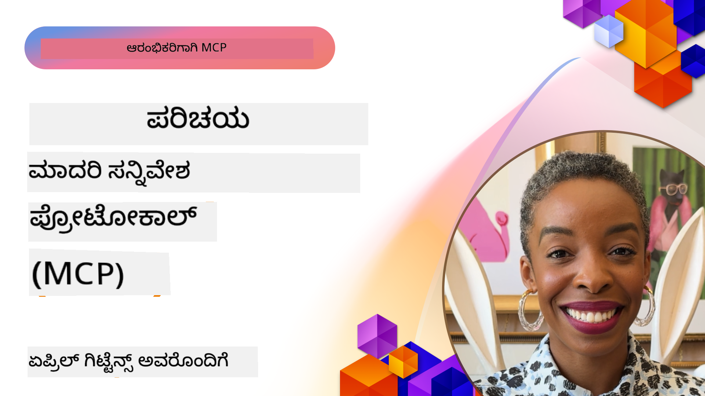

<!--
CO_OP_TRANSLATOR_METADATA:
{
  "original_hash": "9678e0c6945b8e0c23586869b0e26783",
  "translation_date": "2025-12-11T09:48:07+00:00",
  "source_file": "00-Introduction/README.md",
  "language_code": "kn"
}
-->
# ಮಾದರಿ ಸಂದರ್ಭ ಪ್ರೋಟೋಕಾಲ್ (MCP) ಗೆ ಪರಿಚಯ: ವಿಸ್ತಾರಗೊಳ್ಳುವ AI ಅಪ್ಲಿಕೇಶನ್‌ಗಳಿಗೆ ಇದು ಏಕೆ ಮುಖ್ಯ

[](https://youtu.be/agBbdiOPLQA)

_(ಈ ಪಾಠದ ವೀಡಿಯೋವನ್ನು ನೋಡಲು ಮೇಲಿನ ಚಿತ್ರವನ್ನು ಕ್ಲಿಕ್ ಮಾಡಿ)_

ಜನರೇಟಿವ್ AI ಅಪ್ಲಿಕೇಶನ್‌ಗಳು ಉತ್ತಮ ಮುಂದುವರಿದ ಹೆಜ್ಜೆಯಾಗಿವೆ ಏಕೆಂದರೆ ಅವು ಸಾಮಾನ್ಯವಾಗಿ ಬಳಕೆದಾರರು ನೈಸರ್ಗಿಕ ಭಾಷಾ ಪ್ರಾಂಪ್ಟ್‌ಗಳ ಮೂಲಕ ಅಪ್ಲಿಕೇಶನ್‌ನೊಂದಿಗೆ ಸಂವಹನ ಮಾಡಲು ಅವಕಾಶ ನೀಡುತ್ತವೆ. ಆದಾಗ್ಯೂ, ಇಂತಹ ಅಪ್ಲಿಕೇಶನ್‌ಗಳಲ್ಲಿ ಹೆಚ್ಚು ಸಮಯ ಮತ್ತು ಸಂಪನ್ಮೂಲಗಳನ್ನು ಹೂಡಿಕೆ ಮಾಡಿದಂತೆ, ನೀವು ಸುಲಭವಾಗಿ ಕಾರ್ಯಕ್ಷಮತೆ ಮತ್ತು ಸಂಪನ್ಮೂಲಗಳನ್ನು ಸಂಯೋಜಿಸಬಹುದಾದ ರೀತಿಯಲ್ಲಿ ವಿಸ್ತರಿಸಲು ಸಾಧ್ಯವಾಗಬೇಕು, ನಿಮ್ಮ ಅಪ್ಲಿಕೇಶನ್ ಒಂದಕ್ಕಿಂತ ಹೆಚ್ಚು ಮಾದರಿಗಳನ್ನು ಬಳಸಲು ಸಿದ್ಧವಾಗಿರಬೇಕು ಮತ್ತು ವಿವಿಧ ಮಾದರಿ ವೈಶಿಷ್ಟ್ಯಗಳನ್ನು ನಿರ್ವಹಿಸಬೇಕು. ಸಂಕ್ಷಿಪ್ತವಾಗಿ ಹೇಳುವುದಾದರೆ, ಜನರೇಟಿವ್ AI ಅಪ್ಲಿಕೇಶನ್‌ಗಳನ್ನು ಆರಂಭಿಸಲು ಸುಲಭವಾಗಿದ್ದರೂ, ಅವು ಬೆಳೆಯುತ್ತಾ ಮತ್ತು ಹೆಚ್ಚು ಸಂಕೀರ್ಣವಾಗುತ್ತಾ ಇದ್ದಂತೆ, ನೀವು ವಾಸ್ತವಿಕ ವಿನ್ಯಾಸವನ್ನು ನಿರ್ಧರಿಸಲು ಪ್ರಾರಂಭಿಸಬೇಕು ಮತ್ತು ನಿಮ್ಮ ಅಪ್ಲಿಕೇಶನ್‌ಗಳು ಸुसಂಗತವಾಗಿ ನಿರ್ಮಾಣವಾಗುವಂತೆ ಮಾನದಂಡವನ್ನು ಅವಲಂಬಿಸಬೇಕಾಗುತ್ತದೆ. ಇದಕ್ಕೆ MCP ಸಹಾಯ ಮಾಡುತ್ತದೆ ಮತ್ತು ಮಾನದಂಡ ಒದಗಿಸುತ್ತದೆ.

---

## **🔍 ಮಾದರಿ ಸಂದರ್ಭ ಪ್ರೋಟೋಕಾಲ್ (MCP) ಎಂದರೆ ಏನು?**

**ಮಾದರಿ ಸಂದರ್ಭ ಪ್ರೋಟೋಕಾಲ್ (MCP)** ಎಂಬುದು **ಮುಕ್ತ, ಮಾನದಂಡಿತ ಇಂಟರ್ಫೇಸ್** ಆಗಿದ್ದು, ದೊಡ್ಡ ಭಾಷಾ ಮಾದರಿಗಳು (LLMs) ಹೊರಗಿನ ಸಾಧನಗಳು, APIಗಳು ಮತ್ತು ಡೇಟಾ ಮೂಲಗಳೊಂದಿಗೆ ನಿರಂತರವಾಗಿ ಸಂವಹನ ಮಾಡಲು ಅನುಮತಿಸುತ್ತದೆ. ಇದು AI ಮಾದರಿಯ ಕಾರ್ಯಕ್ಷಮತೆಯನ್ನು ತರಬೇತಿ ಡೇಟಾದ ಹೊರತಾಗಿ ವೃದ್ಧಿಸಲು ಸुसಂಗತ ವಾಸ್ತವಿಕ ವಿನ್ಯಾಸವನ್ನು ಒದಗಿಸುತ್ತದೆ, ಇದರಿಂದ ಬುದ್ಧಿವಂತ, ವಿಸ್ತಾರಗೊಳ್ಳುವ ಮತ್ತು ಹೆಚ್ಚು ಪ್ರತಿಕ್ರಿಯಾಶೀಲ AI ವ್ಯವಸ್ಥೆಗಳು ಸಾಧ್ಯವಾಗುತ್ತವೆ.

---

## **🎯 AI ನಲ್ಲಿ ಮಾನದಂಡೀಕರಣದ ಮಹತ್ವ**

ಜನರೇಟಿವ್ AI ಅಪ್ಲಿಕೇಶನ್‌ಗಳು ಹೆಚ್ಚು ಸಂಕೀರ್ಣವಾಗುತ್ತಾ ಇದ್ದಂತೆ, **ವಿಸ್ತಾರಗೊಳ್ಳುವಿಕೆ, ವಿಸ್ತರಣೀಯತೆ, ನಿರ್ವಹಣಾ ಸುಲಭತೆ** ಮತ್ತು **ವ್ಯಾಪಾರಿಕ ಬಂಧನ ತಪ್ಪಿಸುವಿಕೆ** ಎಂಬ ಮಾನದಂಡಗಳನ್ನು ಅಳವಡಿಸುವುದು ಅತ್ಯಾವಶ್ಯಕ. MCP ಈ ಅಗತ್ಯಗಳನ್ನು ಈ ಕೆಳಗಿನಂತೆ ಪೂರೈಸುತ್ತದೆ:

- ಮಾದರಿ-ಸಾಧನ ಸಂಯೋಜನೆಗಳನ್ನು ಏಕೀಕೃತಗೊಳಿಸುವುದು
- ಒಮ್ಮೆಬಂದ, ಒತ್ತಡದ ಕಸ್ಟಮ್ ಪರಿಹಾರಗಳನ್ನು ಕಡಿಮೆ ಮಾಡುವುದು
- ವಿಭಿನ್ನ ವ್ಯಾಪಾರಿಗಳಿಂದ ಬಂದ ಹಲವು ಮಾದರಿಗಳನ್ನು ಒಂದೇ ಪರಿಸರದಲ್ಲಿ ಸಹಜವಾಗಿ ಇರಿಸುವುದು

**ಗಮನಿಸಿ:** MCP ತನ್ನನ್ನು ಮುಕ್ತ ಮಾನದಂಡವೆಂದು ಘೋಷಿಸಿದರೂ, IEEE, IETF, W3C, ISO ಅಥವಾ ಇತರ ಯಾವುದೇ ಮಾನದಂಡ ಸಂಸ್ಥೆಗಳ ಮೂಲಕ MCP ಅನ್ನು ಮಾನದಂಡಗೊಳಿಸುವ ಯೋಜನೆಗಳಿಲ್ಲ.

---

## **📚 ಕಲಿಕೆಯ ಗುರಿಗಳು**

ಈ ಲೇಖನದ ಅಂತ್ಯಕ್ಕೆ, ನೀವು ಈ ಕೆಳಗಿನವುಗಳನ್ನು ಮಾಡಬಲ್ಲಿರಿ:

- **ಮಾದರಿ ಸಂದರ್ಭ ಪ್ರೋಟೋಕಾಲ್ (MCP)** ಮತ್ತು ಅದರ ಬಳಕೆ ಪ್ರಕರಣಗಳನ್ನು ವ್ಯಾಖ್ಯಾನಿಸುವುದು
- MCP ಮಾದರಿ-ಸಾಧನ ಸಂವಹನವನ್ನು ಹೇಗೆ ಮಾನದಂಡಗೊಳಿಸುತ್ತದೆ ಎಂಬುದನ್ನು ಅರ್ಥಮಾಡಿಕೊಳ್ಳುವುದು
- MCP ವಾಸ್ತವಿಕ ವಿನ್ಯಾಸದ ಮುಖ್ಯ ಘಟಕಗಳನ್ನು ಗುರುತಿಸುವುದು
- ಉದ್ಯಮ ಮತ್ತು ಅಭಿವೃದ್ಧಿ ಸಂದರ್ಭಗಳಲ್ಲಿ MCP ನ ನೈಜ ಜಗತ್ತಿನ ಬಳಕೆಗಳನ್ನು ಅನ್ವೇಷಿಸುವುದು

---

## **💡 ಮಾದರಿ ಸಂದರ್ಭ ಪ್ರೋಟೋಕಾಲ್ (MCP) ಯಾಕೆ ಕ್ರಾಂತಿಕಾರಿ?**

### **🔗 MCP AI ಸಂವಹನಗಳಲ್ಲಿ ವಿಭಜನೆ ಸಮಸ್ಯೆಯನ್ನು ಪರಿಹರಿಸುತ್ತದೆ**

MCP ಮೊದಲು, ಮಾದರಿಗಳನ್ನು ಸಾಧನಗಳೊಂದಿಗೆ ಸಂಯೋಜಿಸಲು ಬೇಕಾಗಿದ್ದವು:

- ಸಾಧನ-ಮಾದರಿ ಜೋಡಿಗೆ ಕಸ್ಟಮ್ ಕೋಡ್
- ಪ್ರತಿ ವ್ಯಾಪಾರಿಗಾಗಿಯೂ ಅಸಾಮಾನ್ಯ APIಗಳು
- ನವೀಕರಣಗಳಿಂದ ಆಗಾಗ ಬಿರುಕುಗಳು
- ಹೆಚ್ಚು ಸಾಧನಗಳೊಂದಿಗೆ ಕಡಿಮೆ ವಿಸ್ತಾರಗೊಳ್ಳುವಿಕೆ

### **✅ MCP ಮಾನದಂಡೀಕರಣದ ಲಾಭಗಳು**

| **ಲಾಭ**                  | **ವಿವರಣೆ**                                                                   |
|--------------------------|--------------------------------------------------------------------------------|
| ಪರಸ್ಪರ ಕಾರ್ಯಕ್ಷಮತೆ       | LLMಗಳು ವಿಭಿನ್ನ ವ್ಯಾಪಾರಿಗಳ ಸಾಧನಗಳೊಂದಿಗೆ ನಿರಂತರವಾಗಿ ಕೆಲಸ ಮಾಡುತ್ತವೆ               |
| ಸुसಂಗತತೆ                | ವೇದಿಕೆಗಳು ಮತ್ತು ಸಾಧನಗಳ ನಡುವೆ ಏಕರೂಪ ವರ್ತನೆ                                   |
| ಮರುಬಳಕೆ                  | ಒಮ್ಮೆ ನಿರ್ಮಿಸಿದ ಸಾಧನಗಳನ್ನು ವಿವಿಧ ಯೋಜನೆಗಳು ಮತ್ತು ವ್ಯವಸ್ಥೆಗಳಲ್ಲಿ ಬಳಸಬಹುದು          |
| ವೇಗವಾದ ಅಭಿವೃದ್ಧಿ       | ಮಾನದಂಡಿತ, ಪ್ಲಗ್-ಅಂಡ್-ಪ್ಲೇ ಇಂಟರ್ಫೇಸ್‌ಗಳ ಬಳಕೆ ಮೂಲಕ ಅಭಿವೃದ್ಧಿ ಸಮಯವನ್ನು ಕಡಿಮೆ ಮಾಡುವುದು |

---

## **🧱 MCP ವಾಸ್ತವಿಕ ವಿನ್ಯಾಸದ ಮೇಲ್ದರ್ಜೆ ಅವಲೋಕನ**

MCP ಒಂದು **ಗ್ರಾಹಕ-ಸರ್ವರ್ ಮಾದರಿಯನ್ನು** ಅನುಸರಿಸುತ್ತದೆ, ಇಲ್ಲಿ:

- **MCP ಹೋಸ್ಟ್‌ಗಳು** AI ಮಾದರಿಗಳನ್ನು ನಿರ್ವಹಿಸುತ್ತವೆ
- **MCP ಗ್ರಾಹಕರು** ವಿನಂತಿಗಳನ್ನು ಪ್ರಾರಂಭಿಸುತ್ತಾರೆ
- **MCP ಸರ್ವರ್‌ಗಳು** ಸಂದರ್ಭ, ಸಾಧನಗಳು ಮತ್ತು ಸಾಮರ್ಥ್ಯಗಳನ್ನು ಒದಗಿಸುತ್ತವೆ

### **ಮುಖ್ಯ ಘಟಕಗಳು:**

- **ಸಂಪನ್ಮೂಲಗಳು** – ಮಾದರಿಗಳಿಗೆ ಸ್ಥಿರ ಅಥವಾ ಚಲಿಸುವ ಡೇಟಾ  
- **ಪ್ರಾಂಪ್ಟ್‌ಗಳು** – ಮಾರ್ಗದರ್ಶಕ ತಯಾರಿಕೆಗೆ ಪೂರ್ವನಿರ್ಧರಿತ ಕಾರ್ಯಪ್ರವಾಹಗಳು  
- **ಸಾಧನಗಳು** – ಹುಡುಕಾಟ, ಲೆಕ್ಕಾಚಾರಗಳಂತಹ ಕಾರ್ಯನಿರ್ವಹಣಾ ಫಂಕ್ಷನ್‌ಗಳು  
- **ಸ್ಯಾಂಪ್ಲಿಂಗ್** – ಪುನರಾವರ್ತಿತ ಸಂವಹನಗಳ ಮೂಲಕ ಏಜೆಂಟಿಕ್ ವರ್ತನೆ

---

## MCP ಸರ್ವರ್‌ಗಳು ಹೇಗೆ ಕಾರ್ಯನಿರ್ವಹಿಸುತ್ತವೆ

MCP ಸರ್ವರ್‌ಗಳು ಕೆಳಗಿನ ರೀತಿಯಲ್ಲಿ ಕಾರ್ಯನಿರ್ವಹಿಸುತ್ತವೆ:

- **ವಿನಂತಿ ಹರಿವು**:
    1. ಅಂತಿಮ ಬಳಕೆದಾರ ಅಥವಾ ಅವರ ಪರವಾಗಿ ಕಾರ್ಯನಿರ್ವಹಿಸುವ ಸಾಫ್ಟ್‌ವೇರ್ ವಿನಂತಿಯನ್ನು ಪ್ರಾರಂಭಿಸುತ್ತದೆ.
    2. **MCP ಗ್ರಾಹಕ** ವಿನಂತಿಯನ್ನು **MCP ಹೋಸ್ಟ್** ಗೆ ಕಳುಹಿಸುತ್ತದೆ, ಇದು AI ಮಾದರಿ ರನ್‌ಟೈಮ್ ಅನ್ನು ನಿರ್ವಹಿಸುತ್ತದೆ.
    3. **AI ಮಾದರಿ** ಬಳಕೆದಾರ ಪ್ರಾಂಪ್ಟ್ ಅನ್ನು ಸ್ವೀಕರಿಸಿ, ಒಂದು ಅಥವಾ ಹೆಚ್ಚು ಸಾಧನ ಕರೆಗಳ ಮೂಲಕ ಹೊರಗಿನ ಸಾಧನಗಳು ಅಥವಾ ಡೇಟಾ ಪ್ರವೇಶವನ್ನು ಕೇಳಬಹುದು.
    4. **MCP ಹೋಸ್ಟ್**, ಮಾದರಿಯಲ್ಲದೆ, ಮಾನದಂಡಿತ ಪ್ರೋಟೋಕಾಲ್ ಬಳಸಿ ಸೂಕ್ತ **MCP ಸರ್ವರ್(ಗಳು)** ಜೊತೆ ಸಂವಹನ ಮಾಡುತ್ತದೆ.
- **MCP ಹೋಸ್ಟ್ ಕಾರ್ಯಕ್ಷಮತೆ**:
    - **ಸಾಧನ ರಿಜಿಸ್ಟ್ರಿ**: ಲಭ್ಯವಿರುವ ಸಾಧನಗಳು ಮತ್ತು ಅವುಗಳ ಸಾಮರ್ಥ್ಯಗಳ ಕ್ಯಾಟಲಾಗ್ ಅನ್ನು ನಿರ್ವಹಿಸುತ್ತದೆ.
    - **ಪ್ರಮಾಣೀಕರಣ**: ಸಾಧನ ಪ್ರವೇಶಕ್ಕೆ ಅನುಮತಿಗಳನ್ನು ಪರಿಶೀಲಿಸುತ್ತದೆ.
    - **ವಿನಂತಿ ನಿರ್ವಹಣೆ**: ಮಾದರಿಯಿಂದ ಬರುವ ಸಾಧನ ವಿನಂತಿಗಳನ್ನು ಪ್ರಕ್ರಿಯೆಗೊಳಿಸುತ್ತದೆ.
    - **ಪ್ರತಿಕ್ರಿಯೆ ರೂಪರೇಖೆ**: ಸಾಧನ ಔಟ್‌ಪುಟ್‌ಗಳನ್ನು ಮಾದರಿ ಅರ್ಥಮಾಡಿಕೊಳ್ಳಬಹುದಾದ ಸ್ವರೂಪದಲ್ಲಿ ರಚಿಸುತ್ತದೆ.
- **MCP ಸರ್ವರ್ ಕಾರ್ಯಾಚರಣೆ**:
    - **MCP ಹೋಸ್ಟ್** ಸಾಧನ ಕರೆಗಳನ್ನು ಒಂದು ಅಥವಾ ಹೆಚ್ಚು **MCP ಸರ್ವರ್‌ಗಳಿಗೆ** ಮಾರ್ಗದರ್ಶನ ಮಾಡುತ್ತದೆ, ಪ್ರತಿ ಸರ್ವರ್ ವಿಶೇಷ ಕಾರ್ಯಗಳನ್ನು (ಹುಡುಕಾಟ, ಲೆಕ್ಕಾಚಾರ, ಡೇಟಾಬೇಸ್ ಪ್ರಶ್ನೆಗಳು) ಒದಗಿಸುತ್ತದೆ.
    - **MCP ಸರ್ವರ್‌ಗಳು** ತಮ್ಮ ಕಾರ್ಯಗಳನ್ನು ನಿರ್ವಹಿಸಿ ಫಲಿತಾಂಶಗಳನ್ನು ಸुसಂಗತ ಸ್ವರೂಪದಲ್ಲಿ **MCP ಹೋಸ್ಟ್** ಗೆ ಹಿಂತಿರುಗಿಸುತ್ತವೆ.
    - **MCP ಹೋಸ್ಟ್** ಈ ಫಲಿತಾಂಶಗಳನ್ನು ರೂಪಗೊಳಿಸಿ **AI ಮಾದರಿ** ಗೆ ಪ್ರಸಾರ ಮಾಡುತ್ತದೆ.
- **ಪ್ರತಿಕ್ರಿಯೆ ಪೂರ್ಣಗೊಳಿಸುವಿಕೆ**:
    - **AI ಮಾದರಿ** ಸಾಧನ ಔಟ್‌ಪುಟ್‌ಗಳನ್ನು ಅಂತಿಮ ಪ್ರತಿಕ್ರಿಯೆಯಲ್ಲಿ ಸೇರಿಸುತ್ತದೆ.
    - **MCP ಹೋಸ್ಟ್** ಈ ಪ್ರತಿಕ್ರಿಯೆಯನ್ನು **MCP ಗ್ರಾಹಕ** ಗೆ ಕಳುಹಿಸುತ್ತದೆ, ಅದು ಅಂತಿಮ ಬಳಕೆದಾರ ಅಥವಾ ಕರೆ ಮಾಡುವ ಸಾಫ್ಟ್‌ವೇರ್‌ಗೆ ನೀಡುತ್ತದೆ.
    


## 👨‍💻 MCP ಸರ್ವರ್ ಅನ್ನು ಹೇಗೆ ನಿರ್ಮಿಸುವುದು (ಉದಾಹರಣೆಗಳೊಂದಿಗೆ)

MCP ಸರ್ವರ್‌ಗಳು LLM ಸಾಮರ್ಥ್ಯಗಳನ್ನು ಡೇಟಾ ಮತ್ತು ಕಾರ್ಯಕ್ಷಮತೆ ಒದಗಿಸುವ ಮೂಲಕ ವಿಸ್ತರಿಸಲು ಅನುಮತಿಸುತ್ತವೆ.

ಪ್ರಯತ್ನಿಸಲು ಸಿದ್ಧರಾ? ಇಲ್ಲಿ ವಿವಿಧ ಭಾಷೆಗಳು/ಸ್ಟ್ಯಾಕ್‌ಗಳಿಗೆ ಸಂಬಂಧಿಸಿದ SDKಗಳು ಮತ್ತು ಸರಳ MCP ಸರ್ವರ್‌ಗಳನ್ನು ರಚಿಸುವ ಉದಾಹರಣೆಗಳಿವೆ:

- **Python SDK**: https://github.com/modelcontextprotocol/python-sdk

- **TypeScript SDK**: https://github.com/modelcontextprotocol/typescript-sdk

- **Java SDK**: https://github.com/modelcontextprotocol/java-sdk

- **C#/.NET SDK**: https://github.com/modelcontextprotocol/csharp-sdk


## 🌍 MCP ನ ನೈಜ ಜಗತ್ತಿನ ಬಳಕೆ ಪ್ರಕರಣಗಳು

MCP AI ಸಾಮರ್ಥ್ಯಗಳನ್ನು ವಿಸ್ತರಿಸುವ ಮೂಲಕ ವ್ಯಾಪಕ ಅಪ್ಲಿಕೇಶನ್‌ಗಳಿಗೆ ಅವಕಾಶ ನೀಡುತ್ತದೆ:

| **ಅಪ್ಲಿಕೇಶನ್**              | **ವಿವರಣೆ**                                                                   |
|------------------------------|--------------------------------------------------------------------------------|
| ಉದ್ಯಮ ಡೇಟಾ ಸಂಯೋಜನೆ         | LLMಗಳನ್ನು ಡೇಟಾಬೇಸ್‌ಗಳು, CRMಗಳು ಅಥವಾ ಆಂತರಿಕ ಸಾಧನಗಳಿಗೆ ಸಂಪರ್ಕಿಸುವುದು         |
| ಏಜೆಂಟಿಕ್ AI ವ್ಯವಸ್ಥೆಗಳು      | ಸಾಧನ ಪ್ರವೇಶ ಮತ್ತು ನಿರ್ಧಾರ-ಮೇಕಿಂಗ್ ಕಾರ್ಯಪ್ರವಾಹಗಳೊಂದಿಗೆ ಸ್ವಯಂಚಾಲಿತ ಏಜೆಂಟ್‌ಗಳನ್ನು ಸಕ್ರಿಯಗೊಳಿಸುವುದು |
| ಬಹು-ಮಾಧ್ಯಮ ಅಪ್ಲಿಕೇಶನ್‌ಗಳು  | ಪಠ್ಯ, ಚಿತ್ರ ಮತ್ತು ಧ್ವನಿ ಸಾಧನಗಳನ್ನು ಒಂದೇ ಏಕೀಕೃತ AI ಅಪ್ಲಿಕೇಶನ್‌ನಲ್ಲಿ ಸಂಯೋಜಿಸುವುದು     |
| ನೈಜ-ಸಮಯ ಡೇಟಾ ಸಂಯೋಜನೆ     | ಹೆಚ್ಚು ನಿಖರ, ಪ್ರಸ್ತುತ ಔಟ್‌ಪುಟ್‌ಗಳಿಗೆ AI ಸಂವಹನಗಳಲ್ಲಿ ನೇರ ಡೇಟಾವನ್ನು ತರಲು          |


### 🧠 MCP = AI ಸಂವಹನಗಳಿಗೆ ವಿಶ್ವವ್ಯಾಪಿ ಮಾನದಂಡ

ಮಾದರಿ ಸಂದರ್ಭ ಪ್ರೋಟೋಕಾಲ್ (MCP) AI ಸಂವಹನಗಳಿಗೆ ವಿಶ್ವವ್ಯಾಪಿ ಮಾನದಂಡವಾಗಿ ಕಾರ್ಯನಿರ್ವಹಿಸುತ್ತದೆ, USB-C ಹೇಗೆ ಸಾಧನಗಳ ಭೌತಿಕ ಸಂಪರ್ಕಗಳನ್ನು ಮಾನದಂಡಗೊಳಿಸಿತು ಹಾಗೆ. AI ಜಗತ್ತಿನಲ್ಲಿ, MCP ಸुसಂಗತ ಇಂಟರ್ಫೇಸ್ ಒದಗಿಸುತ್ತದೆ, ಇದರಿಂದ ಮಾದರಿಗಳು (ಗ್ರಾಹಕರು) ಹೊರಗಿನ ಸಾಧನಗಳು ಮತ್ತು ಡೇಟಾ ಒದಗಿಸುವವರ (ಸರ್ವರ್‌ಗಳು)ೊಂದಿಗೆ ನಿರಂತರವಾಗಿ ಸಂಯೋಜಿಸಬಹುದು. ಇದರಿಂದ ಪ್ರತಿ API ಅಥವಾ ಡೇಟಾ ಮೂಲಕ್ಕೆ ವಿಭಿನ್ನ, ಕಸ್ಟಮ್ ಪ್ರೋಟೋಕಾಲ್‌ಗಳ ಅಗತ್ಯವಿಲ್ಲ.

MCP ಅಡಿಯಲ್ಲಿ, MCP ಹೊಂದಾಣಿಕೆಯ ಸಾಧನ (MCP ಸರ್ವರ್ ಎಂದು ಕರೆಯಲ್ಪಡುವುದು) ಏಕೀಕೃತ ಮಾನದಂಡವನ್ನು ಅನುಸರಿಸುತ್ತದೆ. ಈ ಸರ್ವರ್‌ಗಳು ಒದಗಿಸುವ ಸಾಧನಗಳು ಅಥವಾ ಕ್ರಿಯೆಗಳ ಪಟ್ಟಿಯನ್ನು ನೀಡಬಹುದು ಮತ್ತು AI ಏಜೆಂಟ್ ಕೇಳಿದಾಗ ಆ ಕ್ರಿಯೆಗಳನ್ನು ನಿರ್ವಹಿಸುತ್ತವೆ. MCP ಬೆಂಬಲಿಸುವ AI ಏಜೆಂಟ್ ವೇದಿಕೆಗಳು ಸರ್ವರ್‌ಗಳಿಂದ ಲಭ್ಯವಿರುವ ಸಾಧನಗಳನ್ನು ಕಂಡುಹಿಡಿದು ಈ ಮಾನದಂಡಿತ ಪ್ರೋಟೋಕಾಲ್ ಮೂಲಕ ಅವುಗಳನ್ನು ಕರೆ ಮಾಡಬಹುದು.

### 💡 ಜ್ಞಾನ ಪ್ರವೇಶವನ್ನು ಸುಗಮಗೊಳಿಸುತ್ತದೆ

ಸಾಧನಗಳನ್ನು ಒದಗಿಸುವುದರ ಹೊರತಾಗಿ, MCP ಜ್ಞಾನ ಪ್ರವೇಶವನ್ನು ಸಹ ಸುಗಮಗೊಳಿಸುತ್ತದೆ. ಇದು ಅಪ್ಲಿಕೇಶನ್‌ಗಳಿಗೆ ದೊಡ್ಡ ಭಾಷಾ ಮಾದರಿಗಳಿಗೆ (LLMs) ಸಂದರ್ಭ ಒದಗಿಸಲು ವಿವಿಧ ಡೇಟಾ ಮೂಲಗಳನ್ನು ಸಂಪರ್ಕಿಸುವಂತೆ ಮಾಡುತ್ತದೆ. ಉದಾಹರಣೆಗೆ, MCP ಸರ್ವರ್ ಒಂದು ಕಂಪನಿಯ ಡಾಕ್ಯುಮೆಂಟ್ ಸಂಗ್ರಹಣೆಯನ್ನು ಪ್ರತಿನಿಧಿಸಬಹುದು, ಏಜೆಂಟ್‌ಗಳು ಅಗತ್ಯವಿರುವ ಮಾಹಿತಿಯನ್ನು ಬೇಡಿಕೊಳ್ಳಲು. ಮತ್ತೊಂದು ಸರ್ವರ್ ಇಮೇಲ್ ಕಳುಹಿಸುವುದು ಅಥವಾ ದಾಖಲೆಗಳನ್ನು ನವೀಕರಿಸುವಂತಹ ನಿರ್ದಿಷ್ಟ ಕ್ರಿಯೆಗಳನ್ನು ನಿರ್ವಹಿಸಬಹುದು. ಏಜೆಂಟ್ ದೃಷ್ಟಿಯಿಂದ, ಇವು ಕೇವಲ ಉಪಕರಣಗಳಾಗಿವೆ—ಕೆಲವು ಸಾಧನಗಳು ಡೇಟಾ (ಜ್ಞಾನ ಸಂದರ್ಭ) ನೀಡುತ್ತವೆ, ಇತರವು ಕ್ರಿಯೆಗಳನ್ನು ನಿರ್ವಹಿಸುತ್ತವೆ. MCP ಎರಡನ್ನೂ ಪರಿಣಾಮಕಾರಿಯಾಗಿ ನಿರ್ವಹಿಸುತ್ತದೆ.

MCP ಸರ್ವರ್‌ಗೆ ಸಂಪರ್ಕಿಸುವ ಏಜೆಂಟ್ ಸ್ವಯಂಚಾಲಿತವಾಗಿ ಸರ್ವರ್‌ನ ಲಭ್ಯವಿರುವ ಸಾಮರ್ಥ್ಯಗಳು ಮತ್ತು ಪ್ರವೇಶಿಸಬಹುದಾದ ಡೇಟಾವನ್ನು ಮಾನದಂಡಿತ ಸ್ವರೂಪದಲ್ಲಿ ಕಲಿಯುತ್ತದೆ. ಈ ಮಾನದಂಡೀಕರಣವು ಗತಿಶೀಲ ಸಾಧನ ಲಭ್ಯತೆಯನ್ನು ಸಾಧ್ಯಮಾಡುತ್ತದೆ. ಉದಾಹರಣೆಗೆ, ಏಜೆಂಟ್ ವ್ಯವಸ್ಥೆಗೆ ಹೊಸ MCP ಸರ್ವರ್ ಸೇರಿಸುವುದರಿಂದ ಅದರ ಕಾರ್ಯಗಳು ತಕ್ಷಣವೇ ಬಳಸಬಹುದಾಗುತ್ತವೆ, ಏಜೆಂಟ್ ಸೂಚನೆಗಳ ಹೆಚ್ಚಿನ ಕಸ್ಟಮೈಜೇಶನ್ ಅಗತ್ಯವಿಲ್ಲದೆ.

ಈ ಸರಳೀಕೃತ ಸಂಯೋಜನೆ ಕೆಳಗಿನ ಚಿತ್ರದಲ್ಲಿ ತೋರಿಸಿದಂತೆ, ಸರ್ವರ್‌ಗಳು ಸಾಧನಗಳು ಮತ್ತು ಜ್ಞಾನವನ್ನು ಒದಗಿಸುತ್ತವೆ, ವ್ಯವಸ್ಥೆಗಳ ನಡುವೆ ನಿರಂತರ ಸಹಕಾರವನ್ನು ಖಚಿತಪಡಿಸುತ್ತವೆ.

### 👉 ಉದಾಹರಣೆ: ವಿಸ್ತಾರಗೊಳ್ಳುವ ಏಜೆಂಟ್ ಪರಿಹಾರ

```mermaid
---
title: MCP ಜೊತೆಗೆ ವಿಸ್ತರಿಸಬಹುದಾದ ಏಜೆಂಟ್ ಪರಿಹಾರ
description: ಬಳಕೆದಾರರು ಹೇಗೆ LLM ಜೊತೆಗೆ ಸಂವಹನ ಮಾಡುತ್ತಾರೆ ಮತ್ತು ಅದು ಹಲವಾರು MCP ಸರ್ವರ್‌ಗಳಿಗೆ ಸಂಪರ್ಕ ಹೊಂದಿದೆ, ಪ್ರತಿ ಸರ್ವರ್ ಜ್ಞಾನ ಮತ್ತು ಸಾಧನಗಳನ್ನು ಒದಗಿಸುತ್ತದೆ, ವಿಸ್ತರಿಸಬಹುದಾದ AI ವ್ಯವಸ್ಥೆಯ ವಾಸ್ತುಶಿಲ್ಪವನ್ನು ಸೃಷ್ಟಿಸುವುದನ್ನು ಚಿತ್ರಿಸುವ ಚಿತ್ರಣ
---
graph TD
    User -->|ಪ್ರಾಂಪ್ಟ್| LLM
    LLM -->|ಪ್ರತಿಕ್ರಿಯೆ| User
    LLM -->|MCP| ServerA
    LLM -->|MCP| ServerB
    ServerA -->|ವಿಶ್ವಸಂಯೋಜಕ| ServerB
    ServerA --> KnowledgeA
    ServerA --> ToolsA
    ServerB --> KnowledgeB
    ServerB --> ToolsB

    subgraph Server A
        KnowledgeA[ಜ್ಞಾನ]
        ToolsA[ಸಾಧನಗಳು]
    end

    subgraph Server B
        KnowledgeB[ಜ್ಞಾನ]
        ToolsB[ಸಾಧನಗಳು]
    end
```ವಿಶ್ವವ್ಯಾಪಿ ಸಂಪರ್ಕಕ MCP ಸರ್ವರ್‌ಗಳಿಗೆ ಪರಸ್ಪರ ಸಂವಹನ ಮತ್ತು ಸಾಮರ್ಥ್ಯಗಳನ್ನು ಹಂಚಿಕೊಳ್ಳಲು ಅವಕಾಶ ನೀಡುತ್ತದೆ, ಇದರಿಂದ ServerA ServerB ಗೆ ಕಾರ್ಯಗಳನ್ನು ನಿಯೋಜಿಸಬಹುದು ಅಥವಾ ಅದರ ಸಾಧನಗಳು ಮತ್ತು ಜ್ಞಾನವನ್ನು ಪ್ರವೇಶಿಸಬಹುದು. ಇದು ಸರ್ವರ್‌ಗಳ ನಡುವೆ ಸಾಧನ ಮತ್ತು ಡೇಟಾ ಫೆಡರೇಶನ್ ಆಗಿದ್ದು, ವಿಸ್ತಾರಗೊಳ್ಳುವ ಮತ್ತು ಘಟಕೀಕೃತ ಏಜೆಂಟ್ ವಾಸ್ತವಿಕ ವಿನ್ಯಾಸಗಳನ್ನು ಬೆಂಬಲಿಸುತ್ತದೆ. MCP ಸಾಧನ ಪ್ರದರ್ಶನವನ್ನು ಮಾನದಂಡಗೊಳಿಸುವುದರಿಂದ, ಏಜೆಂಟ್‌ಗಳು ಸರ್ವರ್‌ಗಳ ನಡುವೆ ವಿನಂತಿಗಳನ್ನು ಗತಿಶೀಲವಾಗಿ ಕಂಡುಹಿಡಿದು ಮಾರ್ಗದರ್ಶನ ಮಾಡಬಹುದು, ಹಾರ್ಡ್‌ಕೋಡ್ ಮಾಡಲಾದ ಸಂಯೋಜನೆಗಳ ಅಗತ್ಯವಿಲ್ಲದೆ.

ಸಾಧನ ಮತ್ತು ಜ್ಞಾನ ಫೆಡರೇಶನ್: ಸಾಧನಗಳು ಮತ್ತು ಡೇಟಾವನ್ನು ಸರ್ವರ್‌ಗಳ ನಡುವೆ ಪ್ರವೇಶಿಸಬಹುದು, ಇದರಿಂದ ಹೆಚ್ಚು ವಿಸ್ತಾರಗೊಳ್ಳುವ ಮತ್ತು ಘಟಕೀಕೃತ ಏಜೆಂಟ್ ವಾಸ್ತವಿಕ ವಿನ್ಯಾಸಗಳು ಸಾಧ್ಯವಾಗುತ್ತವೆ.

### 🔄 ಗ್ರಾಹಕ-ಪಕ್ಷ LLM ಸಂಯೋಜನೆಯೊಂದಿಗೆ ಉನ್ನತ MCP ದೃಶ್ಯಗಳು

ಮೂಲ MCP ವಾಸ್ತವಿಕ ವಿನ್ಯಾಸದ ಹೊರತಾಗಿ, ಗ್ರಾಹಕ ಮತ್ತು ಸರ್ವರ್ ಎರಡರಲ್ಲಿಯೂ LLMಗಳು ಇರುವ ಉನ್ನತ ದೃಶ್ಯಗಳಿವೆ, ಇದರಿಂದ ಹೆಚ್ಚು ಸುಧಾರಿತ ಸಂವಹನ ಸಾಧ್ಯವಾಗುತ್ತದೆ. ಕೆಳಗಿನ ಚಿತ್ರದಲ್ಲಿ, **ಗ್ರಾಹಕ ಅಪ್ಲಿಕೇಶನ್** ಬಳಕೆದಾರರಿಗಾಗಿ ಹಲವಾರು MCP ಸಾಧನಗಳೊಂದಿಗೆ IDE ಆಗಿರಬಹುದು:

```mermaid
---
title: ಕ್ಲೈಂಟ್-ಸರ್ವರ್ LLM ಸಂಯೋಜನೆಯೊಂದಿಗೆ ಉನ್ನತ MCP ದೃಶ್ಯಗಳು
description: ಬಳಕೆದಾರ, ಕ್ಲೈಂಟ್ ಅಪ್ಲಿಕೇಶನ್, ಕ್ಲೈಂಟ್ LLM, ಬಹು MCP ಸರ್ವರ್‌ಗಳು ಮತ್ತು ಸರ್ವರ್ LLM ನಡುವಿನ ವಿವರವಾದ ಸಂವಹನ ಹರಿವನ್ನು ತೋರಿಸುವ ಕ್ರಮ ರೇಖಾಚಿತ್ರ, ಸಾಧನ ಪತ್ತೆ, ಬಳಕೆದಾರ ಸಂವಹನ, ನೇರ ಸಾಧನ ಕರೆ ಮತ್ತು ವೈಶಿಷ್ಟ್ಯಗಳ ಚರ್ಚಾ ಹಂತಗಳನ್ನು ಚಿತ್ರಿಸುವುದು
---
sequenceDiagram
    autonumber
    actor User as 👤 ಬಳಕೆದಾರ
    participant ClientApp as 🖥️ ಕ್ಲೈಂಟ್ ಅಪ್ಲಿಕೇಶನ್
    participant ClientLLM as 🧠 ಕ್ಲೈಂಟ್ LLM
    participant Server1 as 🔧 MCP ಸರ್ವರ್ 1
    participant Server2 as 📚 MCP ಸರ್ವರ್ 2
    participant ServerLLM as 🤖 ಸರ್ವರ್ LLM
    
    %% Discovery Phase
    rect rgb(220, 240, 255)
        Note over ClientApp, Server2: ಸಾಧನ ಪತ್ತೆ ಹಂತ
        ClientApp->>+Server1: ಲಭ್ಯವಿರುವ ಸಾಧನಗಳು/ಸಂಪನ್ಮೂಲಗಳನ್ನು ವಿನಂತಿಸಿ
        Server1-->>-ClientApp: ಸಾಧನ ಪಟ್ಟಿ (JSON) ಹಿಂತಿರುಗಿಸಿ
        ClientApp->>+Server2: ಲಭ್ಯವಿರುವ ಸಾಧನಗಳು/ಸಂಪನ್ಮೂಲಗಳನ್ನು ವಿನಂತಿಸಿ
        Server2-->>-ClientApp: ಸಾಧನ ಪಟ್ಟಿ (JSON) ಹಿಂತಿರುಗಿಸಿ
        Note right of ClientApp: ಸಂಯೋಜಿತ ಸಾಧನ<br/>ಕ್ಯಾಟಲಾಗ್ ಅನ್ನು ಸ್ಥಳೀಯವಾಗಿ ಸಂಗ್ರಹಿಸಿ
    end
    
    %% User Interaction
    rect rgb(255, 240, 220)
        Note over User, ClientLLM: ಬಳಕೆದಾರ ಸಂವಹನ ಹಂತ
        User->>+ClientApp: ಸಹಜ ಭಾಷೆಯ ಪ್ರಾಂಪ್ಟ್ ನಮೂದಿಸಿ
        ClientApp->>+ClientLLM: ಪ್ರಾಂಪ್ಟ್ + ಸಾಧನ ಕ್ಯಾಟಲಾಗ್ ಮುಂದಿನಗೆ ಕಳುಹಿಸಿ
        ClientLLM->>-ClientLLM: ಪ್ರಾಂಪ್ಟ್ ವಿಶ್ಲೇಷಿಸಿ & ಸಾಧನಗಳನ್ನು ಆಯ್ಕೆಮಾಡಿ
    end
    
    %% Scenario A: Direct Tool Calling
    alt ನೇರ ಸಾಧನ ಕರೆ
        rect rgb(220, 255, 220)
            Note over ClientApp, Server1: ದೃಶ್ಯ A: ನೇರ ಸಾಧನ ಕರೆ
            ClientLLM->>+ClientApp: ಸಾಧನ ಕಾರ್ಯಾಚರಣೆ ವಿನಂತಿಸಿ
            ClientApp->>+Server1: ನಿರ್ದಿಷ್ಟ ಸಾಧನವನ್ನು ಕಾರ್ಯಗತಗೊಳಿಸಿ
            Server1-->>-ClientApp: ಫಲಿತಾಂಶಗಳನ್ನು ಹಿಂತಿರುಗಿಸಿ
            ClientApp->>+ClientLLM: ಫಲಿತಾಂಶಗಳನ್ನು ಪ್ರಕ್ರಿಯೆ ಮಾಡಿ
            ClientLLM-->>-ClientApp: ಪ್ರತಿಕ್ರಿಯೆ ರಚಿಸಿ
            ClientApp-->>-User: ಅಂತಿಮ ಉತ್ತರವನ್ನು ಪ್ರದರ್ಶಿಸಿ
        end
    
    %% Scenario B: Feature Negotiation (VS Code style)
    else ವೈಶಿಷ್ಟ್ಯಗಳ ಚರ್ಚೆ (VS ಕೋಡ್ ಶೈಲಿ)
        rect rgb(255, 220, 220)
            Note over ClientApp, ServerLLM: ದೃಶ್ಯ B: ವೈಶಿಷ್ಟ್ಯಗಳ ಚರ್ಚೆ
            ClientLLM->>+ClientApp: ಅಗತ್ಯವಿರುವ ಸಾಮರ್ಥ್ಯಗಳನ್ನು ಗುರುತಿಸಿ
            ClientApp->>+Server2: ವೈಶಿಷ್ಟ್ಯಗಳು/ಸಾಮರ್ಥ್ಯಗಳ ಚರ್ಚೆ ಮಾಡಿ
            Server2->>+ServerLLM: ಹೆಚ್ಚುವರಿ ಸನ್ನಿವೇಶವನ್ನು ವಿನಂತಿಸಿ
            ServerLLM-->>-Server2: ಸನ್ನಿವೇಶವನ್ನು ಒದಗಿಸಿ
            Server2-->>-ClientApp: ಲಭ್ಯವಿರುವ ವೈಶಿಷ್ಟ್ಯಗಳನ್ನು ಹಿಂತಿರುಗಿಸಿ
            ClientApp->>+Server2: ಚರ್ಚಿಸಲಾದ ಸಾಧನಗಳನ್ನು ಕರೆ ಮಾಡಿ
            Server2-->>-ClientApp: ಫಲಿತಾಂಶಗಳನ್ನು ಹಿಂತಿರುಗಿಸಿ
            ClientApp->>+ClientLLM: ಫಲಿತಾಂಶಗಳನ್ನು ಪ್ರಕ್ರಿಯೆ ಮಾಡಿ
            ClientLLM-->>-ClientApp: ಪ್ರತಿಕ್ರಿಯೆ ರಚಿಸಿ
            ClientApp-->>-User: ಅಂತಿಮ ಉತ್ತರವನ್ನು ಪ್ರದರ್ಶಿಸಿ
        end
    end
```
## 🔐 MCP ನ ಪ್ರಾಯೋಗಿಕ ಲಾಭಗಳು

MCP ಬಳಕೆಯ ಪ್ರಾಯೋಗಿಕ ಲಾಭಗಳು:

- **ತಾಜಾತನ**: ಮಾದರಿಗಳು ತಮ್ಮ ತರಬೇತಿ ಡೇಟಾದ ಹೊರತಾಗಿ ನವೀಕೃತ ಮಾಹಿತಿಯನ್ನು ಪ್ರವೇಶಿಸಬಹುದು
- **ಸಾಮರ್ಥ್ಯ ವಿಸ್ತರಣೆ**: ಮಾದರಿಗಳು ತರಬೇತಿಗೊಳ್ಳದ ಕಾರ್ಯಗಳಿಗೆ ವಿಶೇಷ ಸಾಧನಗಳನ್ನು ಬಳಸಬಹುದು
- **ಕಲ್ಪನೆಗಳ ಕಡಿತ**: ಹೊರಗಿನ ಡೇಟಾ ಮೂಲಗಳು ವಾಸ್ತವಿಕ ಆಧಾರ ಒದಗಿಸುತ್ತವೆ
- **ಗೌಪ್ಯತೆ**: ಸಂವೇದನಾಶೀಲ ಡೇಟಾ ಪ್ರಾಂಪ್ಟ್‌ಗಳಲ್ಲಿ ಸೇರಿಸುವ ಬದಲು ಸುರಕ್ಷಿತ ಪರಿಸರಗಳಲ್ಲಿ ಉಳಿಯಬಹುದು

## 📌 ಮುಖ್ಯ ಅಂಶಗಳು

MCP ಬಳಕೆಯ ಪ್ರಮುಖ ಅಂಶಗಳು:

- **MCP** AI ಮಾದರಿಗಳು ಸಾಧನಗಳು ಮತ್ತು ಡೇಟಾ ಜೊತೆ ಸಂವಹನ ಮಾಡುವ ವಿಧಾನವನ್ನು ಮಾನದಂಡಗೊಳಿಸುತ್ತದೆ
- **ವಿಸ್ತರಣೀಯತೆ, ಸुसಂಗತತೆ ಮತ್ತು ಪರಸ್ಪರ ಕಾರ್ಯಕ್ಷಮತೆಯನ್ನು** ಉತ್ತೇಜಿಸುತ್ತದೆ
- MCP ಅಭಿವೃದ್ಧಿ ಸಮಯವನ್ನು ಕಡಿಮೆ ಮಾಡುತ್ತದೆ, ವಿಶ್ವಾಸಾರ್ಹತೆಯನ್ನು ಸುಧಾರಿಸುತ್ತದೆ ಮತ್ತು ಮಾದರಿ ಸಾಮರ್ಥ್ಯಗಳನ್ನು ವಿಸ್ತರಿಸುತ್ತದೆ
- ಗ್ರಾಹಕ-ಸರ್ವರ್ ವಾಸ್ತವಿಕ ವಿನ್ಯಾಸವು ಲವಚಿಕ, ವಿಸ್ತರಣೀಯ AI ಅಪ್ಲಿಕೇಶನ್‌ಗಳನ್ನು ಸಾಧ್ಯಮಾಡುತ್ತದೆ

## 🧠 ಅಭ್ಯಾಸ

ನೀವು ನಿರ್ಮಿಸಲು ಆಸಕ್ತಿಯಿರುವ AI ಅಪ್ಲಿಕೇಶನ್ ಬಗ್ಗೆ ಯೋಚಿಸಿ.

- ಯಾವ **ಹೊರಗಿನ ಸಾಧನಗಳು ಅಥವಾ ಡೇಟಾ** ಅದರ ಸಾಮರ್ಥ್ಯಗಳನ್ನು ಹೆಚ್ಚಿಸಬಹುದು?
- MCP ಸಂಯೋಜನೆಯನ್ನು ಹೇಗೆ **ಸರಳ ಮತ್ತು ವಿಶ್ವಾಸಾರ್ಹ** ಮಾಡಬಹುದು?

## ಹೆಚ್ಚುವರಿ ಸಂಪನ್ಮೂಲಗಳು

- [MCP GitHub ಸಂಗ್ರಹಾಲಯ](https://github.com/modelcontextprotocol)


## ಮುಂದೇನು

ಮುಂದೆ: [ಅಧ್ಯಾಯ 1: ಮೂಲ ತತ್ವಗಳು](../01-CoreConcepts/README.md)

---

<!-- CO-OP TRANSLATOR DISCLAIMER START -->
**ಅಸ್ವೀಕರಣ**:  
ಈ ದಸ್ತಾವೇಜು AI ಅನುವಾದ ಸೇವೆ [Co-op Translator](https://github.com/Azure/co-op-translator) ಬಳಸಿ ಅನುವಾದಿಸಲಾಗಿದೆ. ನಾವು ನಿಖರತೆಯಿಗಾಗಿ ಪ್ರಯತ್ನಿಸುತ್ತಿದ್ದರೂ, ಸ್ವಯಂಚಾಲಿತ ಅನುವಾದಗಳಲ್ಲಿ ದೋಷಗಳು ಅಥವಾ ಅಸತ್ಯತೆಗಳು ಇರಬಹುದು ಎಂದು ದಯವಿಟ್ಟು ಗಮನಿಸಿ. ಮೂಲ ಭಾಷೆಯಲ್ಲಿರುವ ಮೂಲ ದಸ್ತಾವೇಜನ್ನು ಅಧಿಕೃತ ಮೂಲವೆಂದು ಪರಿಗಣಿಸಬೇಕು. ಮಹತ್ವದ ಮಾಹಿತಿಗಾಗಿ, ವೃತ್ತಿಪರ ಮಾನವ ಅನುವಾದವನ್ನು ಶಿಫಾರಸು ಮಾಡಲಾಗುತ್ತದೆ. ಈ ಅನುವಾದ ಬಳಕೆಯಿಂದ ಉಂಟಾಗುವ ಯಾವುದೇ ತಪ್ಪು ಅರ್ಥಮಾಡಿಕೊಳ್ಳುವಿಕೆ ಅಥವಾ ತಪ್ಪು ವಿವರಣೆಗಳಿಗೆ ನಾವು ಹೊಣೆಗಾರರಾಗುವುದಿಲ್ಲ.
<!-- CO-OP TRANSLATOR DISCLAIMER END -->